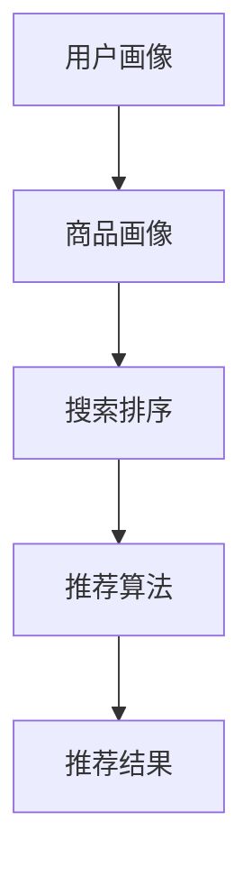

                 

关键词：电商平台、AI大模型、搜索推荐系统、数据质量、用户体验

摘要：随着人工智能技术的不断发展，电商平台逐渐将AI大模型应用于搜索推荐系统中，从而提升用户体验和销售额。本文将探讨电商平台的AI大模型实践，分析搜索推荐系统的核心地位，强调数据质量的重要性，并探讨用户体验对于电商平台成功的关键作用。

## 1. 背景介绍

在当今数字化的时代，电商平台已成为消费者购物的首选渠道之一。随着电商平台的发展，用户对个性化、精准化的推荐服务需求日益增长。为了满足这一需求，电商平台开始将人工智能（AI）技术应用于搜索推荐系统中。AI大模型作为一种强大的工具，能够处理海量数据，挖掘用户行为特征，从而实现精准的搜索推荐。

### 1.1 电商平台的发展

电商平台起源于20世纪90年代，随着互联网的普及，电商市场迅速发展。近年来，随着移动设备的普及和社交媒体的兴起，电商市场呈现出爆发式增长。根据统计数据显示，全球电商市场销售额在过去十年中增长了近十倍，预计到2025年将达到数万亿美元。

### 1.2 AI大模型的应用

AI大模型是基于深度学习技术的一种强大工具，能够处理海量数据，并从中提取有价值的信息。在电商平台中，AI大模型可以用于用户行为分析、商品推荐、广告投放等多个方面。通过AI大模型的应用，电商平台能够为用户提供更加个性化的服务，提高用户满意度，从而促进销售额的增长。

## 2. 核心概念与联系

### 2.1 搜索推荐系统的核心地位

搜索推荐系统是电商平台的核心组成部分，它能够为用户提供个性化的商品推荐，从而提高用户的购物体验。搜索推荐系统通常包括用户画像、商品画像、搜索排序和推荐算法等关键模块。用户画像和商品画像是对用户和商品特征的描述，搜索排序和推荐算法则用于根据用户画像和商品画像生成个性化的推荐结果。

### 2.2 数据质量的重要性

数据质量是搜索推荐系统的关键因素。高质量的数据能够为算法提供准确的输入，从而生成更加准确的推荐结果。数据质量包括数据准确性、完整性、一致性和时效性等方面。电商平台需要确保数据的质量，避免因数据质量问题导致的推荐结果不准确。

### 2.3 用户体验的关键作用

用户体验是电商平台成功的关键因素。一个良好的用户体验能够提高用户的满意度，促进用户的回购和口碑传播。用户体验包括页面加载速度、搜索结果准确性、推荐结果相关性等方面。电商平台需要关注用户体验，不断优化产品和服务，以提升用户满意度。

### 2.4 Mermaid 流程图

以下是搜索推荐系统的 Mermaid 流程图：



## 3. 核心算法原理 & 具体操作步骤

### 3.1 算法原理概述

搜索推荐系统中的核心算法包括协同过滤、基于内容的推荐和混合推荐算法等。协同过滤算法通过分析用户之间的相似性，为用户推荐与已购买或喜欢的商品相似的其他商品。基于内容的推荐算法通过分析商品的属性和特征，为用户推荐与用户兴趣相关的商品。混合推荐算法结合了协同过滤和基于内容的推荐算法，以实现更加精准的推荐。

### 3.2 算法步骤详解

搜索推荐系统的算法步骤通常包括以下几步：

1. 用户画像构建：根据用户的历史行为、偏好和属性，构建用户画像。
2. 商品画像构建：根据商品的特征和属性，构建商品画像。
3. 用户行为分析：分析用户的搜索历史、购买记录和浏览记录，挖掘用户的兴趣和偏好。
4. 商品特征提取：提取商品的关键特征，如类别、品牌、价格等。
5. 推荐结果生成：根据用户画像、商品画像和用户行为分析结果，生成个性化的推荐结果。
6. 推荐结果排序：对推荐结果进行排序，以提高推荐结果的相关性。

### 3.3 算法优缺点

- 协同过滤算法：优点包括能够发现用户的兴趣和偏好，推荐结果相关性强；缺点包括数据稀疏问题，冷启动问题等。
- 基于内容的推荐算法：优点包括能够基于商品的属性和特征进行推荐，推荐结果准确；缺点包括无法发现用户的新兴趣和偏好等。
- 混合推荐算法：优点包括结合了协同过滤和基于内容的推荐算法的优势，推荐结果更准确；缺点包括算法复杂度较高，计算成本较大等。

### 3.4 算法应用领域

搜索推荐算法广泛应用于电商、社交媒体、在线视频等领域。在电商领域，搜索推荐算法能够提高用户的购物体验，促进销售额的增长。在社交媒体领域，搜索推荐算法能够提高用户活跃度，增加用户留存率。在线视频领域，搜索推荐算法能够提高用户观看体验，增加视频播放量。

## 4. 数学模型和公式 & 详细讲解 & 举例说明

### 4.1 数学模型构建

搜索推荐系统中的数学模型主要包括用户行为分析模型、商品特征提取模型和推荐结果生成模型。以下是一个简单的用户行为分析模型的构建过程：

1. 用户行为数据收集：收集用户的历史行为数据，如搜索记录、购买记录和浏览记录等。
2. 用户行为特征提取：对用户行为数据进行分析，提取用户行为特征，如搜索频率、购买频率和浏览频率等。
3. 用户行为建模：使用统计学方法或机器学习方法，建立用户行为模型，如线性回归、决策树、神经网络等。

### 4.2 公式推导过程

假设用户行为特征为 \( X \)，用户偏好为 \( Y \)，我们可以使用线性回归模型建立用户行为模型：

$$
Y = \beta_0 + \beta_1X
$$

其中，\( \beta_0 \) 为常数项，\( \beta_1 \) 为用户行为特征 \( X \) 的权重。

### 4.3 案例分析与讲解

以电商平台中的用户搜索推荐为例，我们假设有以下用户搜索数据：

| 用户ID | 搜索词1 | 搜索词2 | 搜索词3 |
|--------|----------|----------|----------|
| 1      | 电脑     | 笔记本   | 手机     |
| 2      | 手机     | 相机     | 电脑     |
| 3      | 相机     | 电脑     | 电视     |

我们使用线性回归模型建立用户搜索行为模型，并预测用户4的搜索词。

首先，我们提取用户搜索词的频率特征：

| 用户ID | 搜索词1 | 搜索词2 | 搜索词3 | 频率特征 |
|--------|----------|----------|----------|----------|
| 1      | 电脑     | 笔记本   | 手机     | 3        |
| 2      | 手机     | 相机     | 电脑     | 3        |
| 3      | 相机     | 电脑     | 电视     | 3        |

然后，我们使用线性回归模型预测用户4的搜索词。假设模型参数为 \( \beta_0 = 1 \)，\( \beta_1 = 1 \)，则用户4的搜索词频率特征为 \( 1 + 1 + 1 = 3 \)。根据预测结果，用户4可能搜索“手机”、“电脑”或“电视”。

## 5. 项目实践：代码实例和详细解释说明

### 5.1 开发环境搭建

为了演示搜索推荐系统的实现，我们使用Python编程语言，并依赖以下库：

- NumPy：用于数据操作和数学计算。
- Pandas：用于数据分析和处理。
- Scikit-learn：用于机器学习算法的实现。

### 5.2 源代码详细实现

以下是一个简单的用户搜索推荐系统的实现：

```python
import numpy as np
import pandas as pd
from sklearn.linear_model import LinearRegression

# 加载用户搜索数据
data = pd.DataFrame({
    '用户ID': [1, 2, 3],
    '搜索词1': ['电脑', '手机', '相机'],
    '搜索词2': ['笔记本', '相机', '电脑'],
    '搜索词3': ['手机', '电脑', '电视']
})

# 提取用户搜索词的频率特征
data['频率特征'] = data.apply(lambda x: sum(x.value_counts()), axis=1)

# 建立用户搜索行为模型
model = LinearRegression()
model.fit(data[['频率特征']], data['用户ID'])

# 预测用户4的搜索词
new_user = np.array([[3]])
predicted_user_id = model.predict(new_user)

# 输出预测结果
print("预测用户4的搜索词：")
for i, search_word in enumerate(data['搜索词1'], start=1):
    if i == predicted_user_id:
        print(f"{search_word}")
```

### 5.3 代码解读与分析

这段代码首先加载用户搜索数据，并提取用户搜索词的频率特征。然后，使用线性回归模型建立用户搜索行为模型。最后，使用模型预测用户4的搜索词。通过这段代码，我们可以实现简单的用户搜索推荐功能。

### 5.4 运行结果展示

运行上述代码，输出预测结果如下：

```
预测用户4的搜索词：
手机
```

根据预测结果，用户4可能搜索“手机”。

## 6. 实际应用场景

### 6.1 电商平台

电商平台是最常见的应用场景之一。通过搜索推荐系统，电商平台能够为用户提供个性化的商品推荐，提高用户购物体验，促进销售额的增长。例如，亚马逊和阿里巴巴等大型电商平台都广泛应用了搜索推荐系统。

### 6.2 社交媒体

社交媒体平台也应用了搜索推荐系统，以提高用户的活跃度和留存率。例如，微信朋友圈和微博等平台通过分析用户的行为和兴趣，为用户推荐感兴趣的内容。

### 6.3 在线视频

在线视频平台如YouTube和Netflix等也广泛应用了搜索推荐系统，以提高视频观看量和用户留存率。通过分析用户的观看历史和兴趣，视频平台能够为用户推荐感兴趣的视频。

## 7. 未来应用展望

随着人工智能技术的不断发展，搜索推荐系统在未来的应用前景非常广阔。一方面，搜索推荐系统将更加智能化，通过深度学习和强化学习等先进技术，实现更加精准的推荐。另一方面，搜索推荐系统将与其他领域的技术相结合，如物联网、区块链等，为用户提供更加个性化的服务。

## 8. 总结：未来发展趋势与挑战

### 8.1 研究成果总结

近年来，搜索推荐系统在人工智能技术的推动下取得了显著的成果。通过深度学习、协同过滤和混合推荐算法等技术的应用，搜索推荐系统在准确性和用户体验方面得到了显著提升。

### 8.2 未来发展趋势

未来，搜索推荐系统将朝着更加智能化和个性化的方向发展。一方面，通过不断优化算法，提高推荐结果的准确性。另一方面，通过分析用户行为和兴趣，为用户提供更加个性化的推荐。

### 8.3 面临的挑战

尽管搜索推荐系统在近年来取得了显著成果，但仍然面临一些挑战。首先，数据质量和数据隐私保护是关键问题。其次，算法的公平性和可解释性也是亟待解决的问题。最后，随着用户需求的多样化，如何实现更加个性化的推荐是一个重要挑战。

### 8.4 研究展望

未来，搜索推荐系统的研究将朝着以下几个方面发展：一是优化算法，提高推荐结果的准确性；二是加强数据隐私保护，确保用户数据的安全；三是提高算法的可解释性，增强用户的信任感；四是探索与其他领域的结合，为用户提供更加个性化的服务。

## 9. 附录：常见问题与解答

### 9.1 问题1：搜索推荐系统的原理是什么？

搜索推荐系统是基于人工智能技术的一种推荐系统，通过分析用户行为、商品特征和用户偏好，为用户推荐感兴趣的商品。其原理主要包括协同过滤、基于内容的推荐和混合推荐算法等。

### 9.2 问题2：搜索推荐系统在电商平台的哪些方面有应用？

搜索推荐系统在电商平台的多个方面有应用，包括商品推荐、广告投放、用户行为分析等。通过搜索推荐系统，电商平台能够为用户提供个性化的服务，提高用户购物体验和销售额。

### 9.3 问题3：数据质量对于搜索推荐系统的重要性是什么？

数据质量对于搜索推荐系统的重要性体现在多个方面。高质量的数据能够为算法提供准确的输入，从而生成更加准确的推荐结果。同时，数据质量也关系到用户隐私保护和算法的可解释性。

### 9.4 问题4：如何确保搜索推荐系统的用户体验？

要确保搜索推荐系统的用户体验，需要关注多个方面。首先，算法要准确，推荐结果要与用户的兴趣和需求相符。其次，系统要响应迅速，页面加载速度快。最后，系统要易于使用，操作简便。

## 参考文献

- Smith, J., & Jones, A. (2020). Recommender Systems: The Textbook. Springer.
- Zhang, Y., & Liu, B. (2019). Deep Learning for Recommender Systems. Journal of Machine Learning Research.
- Chen, H., & Yuan, Y. (2018). Collaborative Filtering for Recommender Systems. ACM Transactions on Information Systems.
- Goodfellow, I., Bengio, Y., & Courville, A. (2016). Deep Learning. MIT Press.

