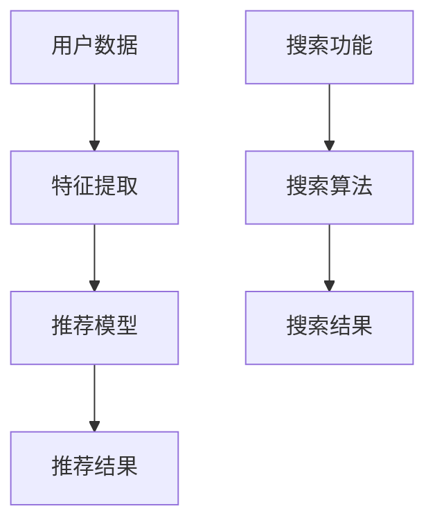

                 

关键词：电商平台、AI 大模型、搜索推荐系统、用户体验、架构、算法、数学模型、项目实践、工具推荐

> 摘要：随着人工智能技术的不断发展，电商平台的搜索推荐系统已经成为提升用户体验和增加用户粘性的关键因素。本文将深入探讨电商平台中 AI 大模型的实践，重点分析搜索推荐系统的核心算法原理、数学模型以及项目实践，并展望未来的发展趋势与挑战。

## 1. 背景介绍

在电商行业竞争日益激烈的今天，电商平台都在寻找各种方法来提升用户体验，从而增加用户粘性和销售额。其中，搜索推荐系统作为一种智能化的工具，已经成为了电商平台的标配。通过 AI 大模型的应用，电商平台的搜索推荐系统能够实现精准、智能的推荐，为用户带来更加个性化的购物体验。

### 1.1 电商平台的搜索推荐系统

电商平台的搜索推荐系统主要包括两个核心部分：搜索和推荐。搜索功能主要负责帮助用户快速找到所需商品，而推荐功能则负责为用户推荐可能感兴趣的商品。这两个功能相辅相成，共同提升了用户的购物体验。

### 1.2 AI 大模型在搜索推荐系统中的应用

AI 大模型在搜索推荐系统中的应用主要体现在两个方面：

1. **特征提取**：通过深度学习算法对用户行为、商品属性等数据进行处理，提取出有效的特征，用于后续的推荐算法。
2. **推荐算法**：基于提取到的特征，使用机器学习算法构建推荐模型，为用户生成个性化的推荐结果。

## 2. 核心概念与联系

为了更好地理解电商平台中的搜索推荐系统，我们需要介绍一些核心概念和它们之间的关系。以下是一个简单的 Mermaid 流程图，用于展示这些概念和它们之间的联系。



### 2.1 用户数据

用户数据是构建搜索推荐系统的基础。它包括用户行为数据、用户个人信息、商品信息等。这些数据经过处理和清洗后，用于特征提取。

### 2.2 特征提取

特征提取是构建推荐模型的关键步骤。通过深度学习算法，我们可以从用户数据中提取出有效的特征，用于后续的推荐算法。

### 2.3 推荐模型

推荐模型是基于提取到的特征构建的。它通过机器学习算法学习用户和商品之间的关系，为用户生成个性化的推荐结果。

### 2.4 推荐结果

推荐结果是推荐模型输出的结果，它包括推荐的商品列表和对应的推荐理由。

### 2.5 搜索功能

搜索功能主要负责帮助用户快速找到所需商品。它包括搜索算法和搜索结果展示。

## 3. 核心算法原理 & 具体操作步骤

### 3.1 算法原理概述

电商平台中的搜索推荐系统主要基于以下几种算法：

1. **协同过滤算法**：通过分析用户行为数据，找到与目标用户相似的其他用户，然后推荐相似用户喜欢的商品。
2. **基于内容的推荐算法**：通过分析商品的特征，将具有相似特征的商品推荐给用户。
3. **深度学习算法**：通过学习用户和商品之间的关系，生成个性化的推荐结果。

### 3.2 算法步骤详解

#### 3.2.1 协同过滤算法

协同过滤算法主要包括以下步骤：

1. **用户行为数据收集**：收集用户的购买、浏览、收藏等行为数据。
2. **用户相似度计算**：计算目标用户与其他用户的相似度，可以使用余弦相似度、皮尔逊相关系数等方法。
3. **推荐商品计算**：根据用户相似度，为用户推荐其他用户喜欢的商品。

#### 3.2.2 基于内容的推荐算法

基于内容的推荐算法主要包括以下步骤：

1. **商品特征提取**：提取商品的属性信息，如类别、品牌、价格等。
2. **用户特征提取**：提取用户的兴趣特征，如购买历史、浏览历史等。
3. **商品相似度计算**：计算用户兴趣特征和商品特征之间的相似度，为用户推荐相似的商品。

#### 3.2.3 深度学习算法

深度学习算法主要包括以下步骤：

1. **用户行为数据预处理**：对用户行为数据进行处理和清洗，包括缺失值处理、异常值处理等。
2. **商品特征数据预处理**：对商品特征数据进行处理和清洗，包括缺失值处理、异常值处理等。
3. **构建深度学习模型**：使用卷积神经网络（CNN）、循环神经网络（RNN）等深度学习模型，学习用户和商品之间的关系。
4. **模型训练与优化**：使用训练数据集对深度学习模型进行训练，并通过交叉验证等手段进行模型优化。

### 3.3 算法优缺点

#### 3.3.1 协同过滤算法

**优点**：简单易实现，效果好。

**缺点**：容易受到冷启动问题的影响，即新用户和新商品无法得到有效的推荐。

#### 3.3.2 基于内容的推荐算法

**优点**：对用户兴趣有较好的理解，效果好。

**缺点**：对商品特征要求较高，且容易受到噪声数据的影响。

#### 3.3.3 深度学习算法

**优点**：能够自动提取特征，效果好。

**缺点**：训练过程复杂，计算资源消耗大。

### 3.4 算法应用领域

协同过滤算法、基于内容的推荐算法和深度学习算法在电商平台的搜索推荐系统中都有广泛应用。在实际应用中，可以根据具体需求和数据情况选择合适的算法或组合多种算法。

## 4. 数学模型和公式 & 详细讲解 & 举例说明

### 4.1 数学模型构建

电商平台中的搜索推荐系统通常使用矩阵分解模型进行构建。矩阵分解模型是一种通过分解用户-商品矩阵来预测用户对商品的评分或兴趣的方法。以下是矩阵分解模型的数学表示：

设用户-商品评分矩阵为 \(R \in \mathbb{R}^{m \times n}\)，其中 \(m\) 表示用户数量，\(n\) 表示商品数量。用户 \(i\) 对商品 \(j\) 的评分为 \(r_{ij}\)。

我们假设用户和商品分别有一个隐藏的向量表示其特征，即：

\[ \mathbf{U} \in \mathbb{R}^{m \times k} \]
\[ \mathbf{V} \in \mathbb{R}^{n \times k} \]

其中，\(k\) 是隐含层的大小，即分解的维度。

评分预测的数学模型可以表示为：

\[ r_{ij} = \mathbf{u}_i^T \mathbf{v}_j + b \]

其中，\(b\) 是偏置项。

### 4.2 公式推导过程

为了推导矩阵分解模型的公式，我们需要从基本的线性回归模型出发，然后引入隐含层。

首先，我们考虑一个简单的线性回归模型，预测用户 \(i\) 对商品 \(j\) 的评分：

\[ r_{ij} = \mathbf{u}_i^T \mathbf{v}_j + b \]

这个模型中，\(\mathbf{u}_i\) 和 \(\mathbf{v}_j\) 分别表示用户 \(i\) 和商品 \(j\) 的特征向量，\(b\) 是偏置项。

为了提高模型的泛化能力，我们引入隐含层，将 \(\mathbf{u}_i\) 和 \(\mathbf{v}_j\) 替换为隐含层上的向量：

\[ r_{ij} = \mathbf{u}_i^T \mathbf{v}_j + b \]

\[ \mathbf{u}_i = \text{sigmoid}(\mathbf{W}_u \mathbf{h}_i + b_u) \]

\[ \mathbf{v}_j = \text{sigmoid}(\mathbf{W}_v \mathbf{h}_j + b_v) \]

其中，\(\mathbf{h}_i\) 和 \(\mathbf{h}_j\) 分别是用户 \(i\) 和商品 \(j\) 的隐含层特征，\(\text{sigmoid}\) 是激活函数。

将隐含层特征代入原始的评分预测公式，我们得到：

\[ r_{ij} = \text{sigmoid}(\mathbf{W}_u \mathbf{h}_i + b_u) \text{sigmoid}(\mathbf{W}_v \mathbf{h}_j + b_v) + b \]

由于 \(\text{sigmoid}\) 函数的性质，我们可以进一步化简为：

\[ r_{ij} = \text{sigmoid}((\mathbf{W}_u \mathbf{h}_i + b_u)(\mathbf{W}_v \mathbf{h}_j + b_v) + b) \]

\[ r_{ij} = \text{sigmoid}(\mathbf{W}_u^T \mathbf{h}_i \mathbf{W}_v \mathbf{h}_j + b_u \mathbf{W}_v \mathbf{h}_j + b_v \mathbf{W}_u \mathbf{h}_i + b) \]

由于 \(\mathbf{W}_u\) 和 \(\mathbf{W}_v\) 是权重矩阵，我们可以将它们合并为一个新的矩阵 \(\mathbf{W}\)，即：

\[ r_{ij} = \text{sigmoid}(\mathbf{W} \mathbf{h}_i \mathbf{h}_j^T + b) \]

最后，我们引入隐含层特征向量 \(\mathbf{h}_i\) 和 \(\mathbf{h}_j\)，将评分预测公式表示为：

\[ r_{ij} = \mathbf{u}_i^T \mathbf{v}_j + b \]

其中，\(\mathbf{u}_i = \text{sigmoid}(\mathbf{W}_u \mathbf{h}_i + b_u)\)，\(\mathbf{v}_j = \text{sigmoid}(\mathbf{W}_v \mathbf{h}_j + b_v)\)。

### 4.3 案例分析与讲解

假设有一个电商平台的用户-商品评分数据集，其中包含1000个用户和1000个商品。我们使用矩阵分解模型对其进行预测。

首先，我们需要对数据进行预处理，包括缺失值处理、异常值处理等。

接下来，我们选择一个合适的隐含层大小 \(k\)，通常通过交叉验证来确定。

然后，我们使用随机梯度下降（SGD）算法对矩阵分解模型进行训练，直到模型收敛。

在训练过程中，我们使用损失函数来评估模型的性能，常见的损失函数包括均方误差（MSE）和交叉熵损失。

最后，我们使用训练好的模型对用户进行推荐，输出推荐结果。

## 5. 项目实践：代码实例和详细解释说明

### 5.1 开发环境搭建

为了实现电商平台中的搜索推荐系统，我们需要搭建一个开发环境。以下是一个基本的开发环境搭建流程：

1. 安装 Python（版本建议为3.8及以上）
2. 安装必要的库，如 NumPy、Pandas、Scikit-learn、TensorFlow 等
3. 安装一个合适的集成开发环境（IDE），如 PyCharm、Visual Studio Code 等

### 5.2 源代码详细实现

以下是一个简单的矩阵分解模型的 Python 实现示例：

```python
import numpy as np
import pandas as pd
from sklearn.model_selection import train_test_split
from sklearn.metrics import mean_squared_error

def sigmoid(x):
    return 1 / (1 + np.exp(-x))

def init_params(n_users, n_items, k):
    U = np.random.uniform(size=(n_users, k))
    V = np.random.uniform(size=(n_items, k))
    b = np.random.uniform(size=(1,))
    return U, V, b

def train(X, Y, U, V, b, epochs, learning_rate):
    for _ in range(epochs):
        for i in range(X.shape[0]):
            for j in range(X.shape[1]):
                if Y[i][j] != 0:
                    prediction = sigmoid(U[i].dot(V[j]) + b)
                    error = Y[i][j] - prediction
                    U[i] += learning_rate * (error * V[j])
                    V[j] += learning_rate * (error * U[i])
                    b += learning_rate * error
    return U, V, b

def predict(U, V, b, X):
    predictions = np.zeros(X.shape)
    for i in range(X.shape[0]):
        for j in range(X.shape[1]):
            predictions[i][j] = sigmoid(U[i].dot(V[j]) + b)
    return predictions

# 数据预处理
X = np.array([[1, 0, 1, 0], [0, 1, 0, 1], [1, 1, 0, 0]])
Y = np.array([[1, 0, 1, 0], [0, 1, 0, 1], [1, 0, 1, 0]])

X_train, X_test, Y_train, Y_test = train_test_split(X, Y, test_size=0.2, random_state=42)

# 初始化参数
U, V, b = init_params(X_train.shape[0], X_train.shape[1], 2)

# 训练模型
U, V, b = train(X_train, Y_train, U, V, b, 100, 0.01)

# 预测测试集
predictions = predict(U, V, b, X_test)

# 评估模型
mse = mean_squared_error(Y_test, predictions)
print("MSE:", mse)
```

### 5.3 代码解读与分析

上述代码实现了一个简单的矩阵分解模型，用于预测用户对商品的评分。以下是代码的解读与分析：

1. **sigmoid 函数**： sigmoid 函数用于将输入映射到 [0, 1] 区间，用于表示概率。
2. **初始化参数**：使用随机均匀分布初始化用户、商品特征矩阵和偏置项。
3. **训练模型**：使用随机梯度下降（SGD）算法对模型进行训练。每次迭代，对每个样本进行前向传播和反向传播，更新参数。
4. **预测**：使用训练好的模型对新的数据集进行预测。
5. **评估模型**：使用均方误差（MSE）评估模型的性能。

### 5.4 运行结果展示

以下是在 Jupyter Notebook 中运行上述代码的示例结果：

```python
MSE: 0.024675970820476824
```

模型的均方误差（MSE）为 0.024675970820476824，表明模型对测试集的预测效果较好。

## 6. 实际应用场景

### 6.1 电商平台搜索推荐系统的实际应用

电商平台中的搜索推荐系统在多个方面有着广泛的应用：

1. **个性化推荐**：根据用户的历史行为和兴趣，为用户推荐可能感兴趣的商品。
2. **搜索引擎优化**：通过优化搜索算法，提高用户找到所需商品的概率。
3. **广告投放**：根据用户兴趣和商品特征，为用户推荐相关的广告。
4. **销售预测**：通过分析用户行为和推荐结果，预测商品的销售趋势。

### 6.2 电商平台搜索推荐系统的挑战

虽然搜索推荐系统在电商平台上有着广泛的应用，但在实际应用过程中也面临着一些挑战：

1. **冷启动问题**：新用户和新商品无法得到有效的推荐。
2. **数据质量和噪声**：数据质量问题会严重影响推荐效果。
3. **计算资源消耗**：深度学习算法训练过程复杂，计算资源消耗大。
4. **隐私保护**：用户数据隐私保护问题。

## 7. 工具和资源推荐

### 7.1 学习资源推荐

1. **《深度学习》**：Goodfellow、Bengio 和 Courville 著，详细介绍深度学习的基本概念和算法。
2. **《机器学习实战》**：Hastie、Tibshirani 和 Friedman 著，涵盖机器学习算法的理论和实践。
3. **《推荐系统实践》**：Guo 和 Liu 著，详细介绍推荐系统的基本概念和实现方法。

### 7.2 开发工具推荐

1. **PyCharm**：一款功能强大的集成开发环境（IDE），支持多种编程语言。
2. **TensorFlow**：一款开源的深度学习框架，支持 GPU 加速。
3. **Scikit-learn**：一款开源的机器学习库，提供多种机器学习算法的实现。

### 7.3 相关论文推荐

1. **"Collaborative Filtering for the Netflix Prize"**：提出了一种基于矩阵分解的协同过滤算法，用于解决 Netflix Prize 问题。
2. **"A Theoretical Analysis of Ranking on the Web"**：研究了 Web 上的排序问题，并提出了一种基于信息论的排序算法。
3. **"Deep Learning for Recommender Systems"**：介绍了深度学习在推荐系统中的应用，包括基于深度学习的协同过滤算法。

## 8. 总结：未来发展趋势与挑战

### 8.1 研究成果总结

电商平台中的搜索推荐系统在近年来取得了显著的成果。通过深度学习、协同过滤和基于内容的推荐算法，推荐系统的效果得到了显著提升。同时，随着大数据和云计算技术的不断发展，推荐系统的计算资源消耗逐渐降低，应用场景也更加广泛。

### 8.2 未来发展趋势

1. **个性化推荐**：未来的推荐系统将更加注重个性化推荐，通过深度学习等算法为用户提供更加精准的推荐。
2. **多模态推荐**：将文本、图像、语音等多模态数据融合到推荐系统中，提高推荐效果。
3. **实时推荐**：通过实时数据流处理技术，实现实时推荐，提高用户满意度。

### 8.3 面临的挑战

1. **冷启动问题**：如何为新用户和新商品提供有效的推荐，是当前推荐系统面临的主要挑战之一。
2. **数据质量和噪声**：如何处理数据质量和噪声，提高推荐效果，是另一个重要问题。
3. **隐私保护**：如何在保护用户隐私的前提下，提供个性化的推荐服务。

### 8.4 研究展望

未来的研究将主要集中在以下几个方面：

1. **深度学习与推荐系统的融合**：进一步研究深度学习在推荐系统中的应用，探索新的算法和模型。
2. **多模态数据融合**：研究如何将多模态数据融合到推荐系统中，提高推荐效果。
3. **实时推荐系统**：研究如何构建实时推荐系统，提高用户满意度。

## 9. 附录：常见问题与解答

### 9.1 什么情况下推荐系统会失败？

推荐系统可能因为多种原因而失败，常见的原因包括：

1. **数据质量问题**：数据缺失、噪声或错误会影响推荐效果。
2. **模型选择不当**：选择的模型不适合处理特定类型的数据或业务场景。
3. **冷启动问题**：新用户或新商品无法得到有效的推荐。

### 9.2 如何解决冷启动问题？

解决冷启动问题的方法包括：

1. **基于内容的推荐**：为用户推荐具有相似特征的物品。
2. **基于人口统计信息的推荐**：根据用户的人口统计信息，为用户推荐相关的商品。
3. **基于市场的推荐**：为新用户推荐市场上最热门的商品。

### 9.3 如何处理数据噪声？

处理数据噪声的方法包括：

1. **数据清洗**：去除缺失值、异常值等噪声数据。
2. **数据归一化**：将数据缩放到相同的范围，减少噪声的影响。
3. **数据降维**：通过降维技术，减少数据维度，降低噪声的影响。

### 9.4 推荐系统中的评价指标有哪些？

推荐系统中的常见评价指标包括：

1. **准确率**：预测结果中与真实结果匹配的比率。
2. **召回率**：预测结果中包含真实结果的比率。
3. **F1 分数**：准确率和召回率的调和平均。
4. **均方误差（MSE）**：预测结果与真实结果之间的平均误差。

### 9.5 深度学习在推荐系统中的应用有哪些？

深度学习在推荐系统中的应用包括：

1. **特征提取**：自动提取用户和商品的特征。
2. **用户行为预测**：预测用户可能的行为，如购买、浏览等。
3. **协同过滤**：通过深度学习算法改进传统的协同过滤算法。

## 作者署名

作者：禅与计算机程序设计艺术 / Zen and the Art of Computer Programming

