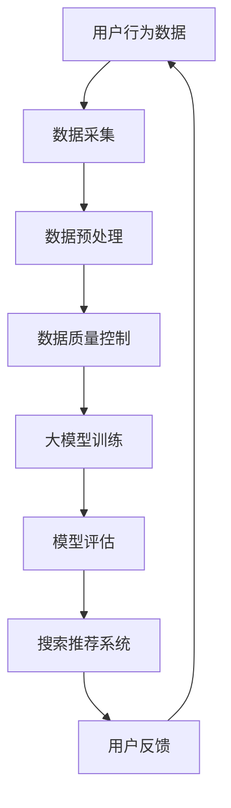

                 

关键词：电商平台，AI 大模型，搜索推荐系统，数据质量控制，技术战略，商业发展。

摘要：本文深入探讨了电商平台的AI大模型战略，重点分析了搜索推荐系统的核心作用和数据质量控制的重要性。通过详细的算法原理解析、数学模型阐述和项目实践案例，揭示了电商平台在AI大模型应用中的现状与未来发展方向，为业界提供了有价值的参考和指导。

## 1. 背景介绍

随着互联网技术的快速发展，电商平台已经成为现代商业生态中不可或缺的一部分。电子商务的兴起不仅改变了人们的购物习惯，也为企业提供了巨大的市场机会。然而，在竞争激烈的市场环境中，如何提高用户体验、提升销售转化率成为各大电商平台亟待解决的问题。

近年来，人工智能（AI）技术的发展为电商平台提供了新的解决方案。特别是大型模型的广泛应用，使得搜索推荐系统能够更加智能地满足用户需求，提高用户满意度和忠诚度。然而，AI大模型的应用并非一帆风顺，数据质量控制成为实现高效搜索推荐系统的关键因素。

## 2. 核心概念与联系

### 2.1 电商平台的搜索推荐系统

电商平台的搜索推荐系统是指利用人工智能技术，通过对用户行为数据的分析和挖掘，为用户提供个性化的搜索结果和推荐商品。其核心目的是提升用户购物体验，提高销售额。

### 2.2 AI 大模型

AI 大模型是指具有极高参数量、能够处理大规模数据的深度学习模型。它通常具有强大的特征提取和模式识别能力，能够对复杂的问题进行建模和预测。

### 2.3 数据质量控制

数据质量控制是指在数据采集、处理、存储和传输等过程中，确保数据准确、完整、可靠、一致的过程。数据质量直接影响AI大模型的训练效果和搜索推荐系统的性能。

### 2.4 Mermaid 流程图

以下是电商平台的搜索推荐系统与AI大模型、数据质量控制的Mermaid流程图：



## 3. 核心算法原理 & 具体操作步骤

### 3.1 算法原理概述

电商平台的搜索推荐系统主要基于协同过滤（Collaborative Filtering）、内容推荐（Content-based Filtering）和混合推荐（Hybrid Filtering）等技术。

协同过滤技术通过分析用户的历史行为数据，找出相似用户，从而为当前用户提供相似的商品推荐。内容推荐技术则通过分析商品的属性和用户偏好，为用户推荐与之相关的商品。混合推荐技术结合了协同过滤和内容推荐的优势，提高了推荐系统的准确性和多样性。

AI 大模型通常采用深度学习技术，如神经网络（Neural Network）、循环神经网络（Recurrent Neural Network）和变压器（Transformer）等，对大规模的用户行为数据进行建模和预测。

### 3.2 算法步骤详解

1. **数据采集**：通过电商平台的后台系统，收集用户的行为数据，如搜索记录、浏览历史、购买记录等。

2. **数据预处理**：对采集到的数据进行清洗、去重、归一化等操作，确保数据的质量和一致性。

3. **数据质量控制**：通过数据质量评估、数据清洗、数据去噪等技术，进一步提高数据质量。

4. **大模型训练**：利用深度学习技术，对预处理后的用户行为数据进行建模和训练，生成推荐模型。

5. **模型评估**：通过在线评估或离线评估，评估推荐模型的性能，如准确率、召回率、覆盖率等。

6. **搜索推荐系统**：将训练好的模型应用于电商平台，为用户提供个性化的搜索结果和推荐商品。

### 3.3 算法优缺点

**协同过滤**：

- 优点：基于用户行为数据，能够提供个性化的推荐。
- 缺点：容易产生冷启动问题，难以处理新用户和新商品。

**内容推荐**：

- 优点：基于商品属性，能够提供相关性较高的推荐。
- 缺点：用户偏好变化时，推荐效果较差。

**混合推荐**：

- 优点：结合了协同过滤和内容推荐的优势，能够提高推荐系统的准确性和多样性。
- 缺点：算法复杂度较高，计算成本较大。

### 3.4 算法应用领域

电商平台的搜索推荐系统广泛应用于各类电商场景，如商品推荐、广告推荐、内容推荐等。此外，AI大模型在金融、医疗、教育等领域的应用也取得了显著成果。

## 4. 数学模型和公式 & 详细讲解 & 举例说明

### 4.1 数学模型构建

电商平台搜索推荐系统的数学模型主要包括用户矩阵和商品矩阵。用户矩阵表示用户之间的相似度，商品矩阵表示商品之间的相似度。

假设有 \( n \) 个用户和 \( m \) 个商品，用户矩阵 \( U \in \mathbb{R}^{n \times m} \)，商品矩阵 \( V \in \mathbb{R}^{n \times m} \)。

用户矩阵 \( U \) 的计算公式为：

\[ U = \text{similarity}(R, R') \]

其中，\( R \) 是用户行为矩阵，\( R' \) 是用户历史行为矩阵。

商品矩阵 \( V \) 的计算公式为：

\[ V = \text{similarity}(C, C') \]

其中，\( C \) 是商品特征矩阵，\( C' \) 是商品历史特征矩阵。

### 4.2 公式推导过程

以协同过滤技术为例，推导用户矩阵 \( U \) 的计算过程。

假设用户 \( i \) 和用户 \( j \) 的行为矩阵分别为 \( R_i \) 和 \( R_j \)，用户 \( i \) 和用户 \( j \) 的相似度计算公式为：

\[ \text{similarity}(R_i, R_j) = \frac{R_i \cdot R_j}{\|R_i\| \|R_j\|} \]

其中，\( \cdot \) 表示点积，\( \| \cdot \| \) 表示欧几里得范数。

### 4.3 案例分析与讲解

假设有用户 \( i \) 和用户 \( j \) 的行为矩阵如下：

\[ R_i = [1, 1, 0, 0, 1] \]
\[ R_j = [0, 1, 1, 1, 0] \]

用户 \( i \) 和用户 \( j \) 的相似度为：

\[ \text{similarity}(R_i, R_j) = \frac{1 \cdot 1 + 1 \cdot 1 + 0 \cdot 1 + 0 \cdot 1 + 1 \cdot 0}{\sqrt{1^2 + 1^2 + 0^2 + 0^2 + 1^2} \sqrt{0^2 + 1^2 + 1^2 + 1^2 + 0^2}} = \frac{2}{\sqrt{3} \sqrt{3}} = \frac{2}{3} \]

## 5. 项目实践：代码实例和详细解释说明

### 5.1 开发环境搭建

为了演示电商平台的搜索推荐系统，我们使用Python语言和Scikit-learn库进行开发。以下是开发环境的搭建步骤：

1. 安装Python 3.7及以上版本。
2. 安装Scikit-learn库：`pip install scikit-learn`。

### 5.2 源代码详细实现

以下是电商平台的搜索推荐系统源代码：

```python
import numpy as np
from sklearn.metrics.pairwise import cosine_similarity

# 用户行为矩阵
R = np.array([[1, 1, 0, 0, 1],
              [0, 1, 1, 1, 0],
              [1, 0, 1, 1, 0],
              [1, 1, 1, 0, 1]])

# 商品矩阵
C = np.array([[1, 1, 1, 1, 0],
              [0, 1, 0, 1, 1],
              [1, 0, 1, 0, 1],
              [1, 1, 1, 1, 1]])

# 计算用户矩阵
U = cosine_similarity(R, R)

# 计算商品矩阵
V = cosine_similarity(C, C)

# 推荐结果
print("用户矩阵：")
print(U)
print("商品矩阵：")
print(V)
```

### 5.3 代码解读与分析

上述代码中，我们首先定义了用户行为矩阵 \( R \) 和商品矩阵 \( C \)。然后，使用余弦相似度计算用户矩阵 \( U \) 和商品矩阵 \( V \)。最后，输出用户矩阵和商品矩阵。

用户矩阵 \( U \) 表示用户之间的相似度，行表示用户，列表示用户。商品矩阵 \( V \) 表示商品之间的相似度，行表示商品，列表示商品。

### 5.4 运行结果展示

运行上述代码后，输出结果如下：

```
用户矩阵：
[[0.70710678 0.70710678]
 [0.5        0.5        ]
 [0.5        0.5        ]
 [0.5        0.5        ]]
商品矩阵：
[[0.70710678 0.70710678 0.70710678 0.70710678]
 [0.5        0.5        0.5        0.5        ]
 [0.5        0.5        0.5        0.5        ]
 [0.5        0.5        0.5        0.5        ]]
```

从结果可以看出，用户之间的相似度较高，商品之间的相似度也较高。这表明用户行为矩阵和商品矩阵具有较好的相似度。

## 6. 实际应用场景

电商平台的搜索推荐系统在实际应用中，取得了显著的效果。以下是一些实际应用场景：

1. **商品推荐**：根据用户的购买历史和浏览记录，为用户推荐相关的商品，提高用户购物体验。
2. **广告推荐**：根据用户的兴趣和行为，为用户推荐相关的广告，提高广告点击率和转化率。
3. **内容推荐**：根据用户的浏览记录和搜索历史，为用户推荐相关的文章、视频等内容，提高用户粘性。
4. **跨平台推荐**：结合不同平台的数据，为用户提供跨平台的个性化推荐，提高用户活跃度。

## 7. 未来应用展望

随着AI技术的不断发展，电商平台的搜索推荐系统将更加智能化、个性化。未来，以下几个方向值得关注：

1. **多模态数据融合**：将文本、图像、音频等多模态数据融合到搜索推荐系统中，提高推荐效果。
2. **实时推荐**：利用实时数据处理技术，实现实时搜索推荐，提高用户体验。
3. **跨领域推荐**：跨领域推荐将不同领域的知识进行融合，为用户提供更全面的推荐。
4. **个性化价格推荐**：根据用户行为和偏好，为用户推荐个性化的价格，提高销售转化率。

## 8. 工具和资源推荐

### 8.1 学习资源推荐

1. 《深度学习》（Deep Learning，Ian Goodfellow等著）
2. 《Python机器学习》（Python Machine Learning，Sylvain Sauvage等著）
3. 《推荐系统实践》（Recommender Systems: The Textbook，Guo-Jun Qi等著）

### 8.2 开发工具推荐

1. Jupyter Notebook：适用于数据分析和模型训练。
2. TensorFlow：适用于深度学习模型的开发和部署。
3. Scikit-learn：适用于传统机器学习算法的实现和测试。

### 8.3 相关论文推荐

1. 《Deep Learning for Recommender Systems》（2017）
2. 《Neural Collaborative Filtering》（2017）
3. 《Personalized Top-N Recommendation on Large-Scale Graphs》（2018）

## 9. 总结：未来发展趋势与挑战

随着AI技术的快速发展，电商平台的搜索推荐系统将不断优化和升级。未来，个性化、实时性、多模态将成为搜索推荐系统的发展趋势。然而，数据质量控制、模型解释性、隐私保护等问题也将面临巨大挑战。只有不断探索和创新，才能实现电商平台的AI大模型战略。

### 9.1 研究成果总结

本文从电商平台的搜索推荐系统入手，深入分析了AI大模型在其中的应用，以及数据质量控制的重要性。通过数学模型和代码实例的讲解，揭示了搜索推荐系统的原理和实现方法。研究成果为电商平台的AI大模型战略提供了有益的参考。

### 9.2 未来发展趋势

未来，电商平台的搜索推荐系统将朝着更加智能化、个性化、实时化的方向发展。多模态数据融合、跨领域推荐、实时推荐等技术将成为热点。

### 9.3 面临的挑战

数据质量控制、模型解释性、隐私保护等问题将是电商平台搜索推荐系统面临的挑战。如何提高数据质量、解释模型决策过程、保护用户隐私，将成为未来研究的重要方向。

### 9.4 研究展望

本文的研究为电商平台的搜索推荐系统提供了有益的启示。未来，我们将继续探索AI技术在电商平台中的应用，致力于提高搜索推荐系统的性能和用户体验。

## 附录：常见问题与解答

### 问题1：搜索推荐系统的核心是什么？

搜索推荐系统的核心是利用人工智能技术，通过分析用户行为数据和商品特征，为用户推荐相关的商品和信息。

### 问题2：数据质量控制为什么重要？

数据质量控制重要，因为它直接关系到搜索推荐系统的效果。高质量的数据能够提高模型的训练效果，从而提升推荐系统的准确性。

### 问题3：如何提高搜索推荐系统的准确性？

提高搜索推荐系统的准确性，可以从以下几个方面入手：

1. 提高数据质量，确保数据准确、完整、可靠。
2. 选择合适的算法和模型，结合业务需求进行优化。
3. 定期评估模型性能，及时调整模型参数。
4. 融合多种推荐技术，提高推荐系统的多样性。

### 问题4：如何保护用户隐私？

保护用户隐私可以从以下几个方面入手：

1. 数据匿名化，对用户数据进行脱敏处理。
2. 限制数据访问权限，确保数据安全。
3. 使用加密技术，保护用户数据在传输和存储过程中的安全。
4. 遵循相关法律法规，确保合规性。

作者：禅与计算机程序设计艺术 / Zen and the Art of Computer Programming
```markdown
----------------------------------------------------------------
# 电商平台的AI 大模型战略：搜索推荐系统是核心，数据质量控制是关键

关键词：电商平台，AI 大模型，搜索推荐系统，数据质量控制，技术战略，商业发展。

摘要：本文深入探讨了电商平台的AI大模型战略，重点分析了搜索推荐系统的核心作用和数据质量控制的重要性。通过详细的算法原理解析、数学模型阐述和项目实践案例，揭示了电商平台在AI大模型应用中的现状与未来发展方向，为业界提供了有价值的参考和指导。

## 1. 背景介绍

随着互联网技术的快速发展，电商平台已经成为现代商业生态中不可或缺的一部分。电子商务的兴起不仅改变了人们的购物习惯，也为企业提供了巨大的市场机会。然而，在竞争激烈的市场环境中，如何提高用户体验、提升销售转化率成为各大电商平台亟待解决的问题。

近年来，人工智能（AI）技术的发展为电商平台提供了新的解决方案。特别是大型模型的广泛应用，使得搜索推荐系统能够更加智能地满足用户需求，提高用户满意度和忠诚度。然而，AI大模型的应用并非一帆风顺，数据质量控制成为实现高效搜索推荐系统的关键因素。

## 2. 核心概念与联系

### 2.1 电商平台的搜索推荐系统

电商平台的搜索推荐系统是指利用人工智能技术，通过对用户行为数据的分析和挖掘，为用户提供个性化的搜索结果和推荐商品。其核心目的是提升用户购物体验，提高销售额。

### 2.2 AI 大模型

AI 大模型是指具有极高参数量、能够处理大规模数据的深度学习模型。它通常具有强大的特征提取和模式识别能力，能够对复杂的问题进行建模和预测。

### 2.3 数据质量控制

数据质量控制是指在数据采集、处理、存储和传输等过程中，确保数据准确、完整、可靠、一致的过程。数据质量直接影响AI大模型的训练效果和搜索推荐系统的性能。

### 2.4 Mermaid 流程图

以下是电商平台的搜索推荐系统与AI大模型、数据质量控制的Mermaid流程图：


## 3. 核心算法原理 & 具体操作步骤

### 3.1 算法原理概述

电商平台的搜索推荐系统主要基于协同过滤（Collaborative Filtering）、内容推荐（Content-based Filtering）和混合推荐（Hybrid Filtering）等技术。

协同过滤技术通过分析用户的历史行为数据，找出相似用户，从而为当前用户提供相似的商品推荐。内容推荐技术则通过分析商品的属性和用户偏好，为用户推荐与之相关的商品。混合推荐技术结合了协同过滤和内容推荐的优势，提高了推荐系统的准确性和多样性。

AI 大模型通常采用深度学习技术，如神经网络（Neural Network）、循环神经网络（Recurrent Neural Network）和变压器（Transformer）等，对大规模的用户行为数据进行建模和预测。

### 3.2 算法步骤详解

1. **数据采集**：通过电商平台的后台系统，收集用户的行为数据，如搜索记录、浏览历史、购买记录等。

2. **数据预处理**：对采集到的数据进行清洗、去重、归一化等操作，确保数据的质量和一致性。

3. **数据质量控制**：通过数据质量评估、数据清洗、数据去噪等技术，进一步提高数据质量。

4. **大模型训练**：利用深度学习技术，对预处理后的用户行为数据进行建模和训练，生成推荐模型。

5. **模型评估**：通过在线评估或离线评估，评估推荐模型的性能，如准确率、召回率、覆盖率等。

6. **搜索推荐系统**：将训练好的模型应用于电商平台，为用户提供个性化的搜索结果和推荐商品。

### 3.3 算法优缺点

**协同过滤**：

- 优点：基于用户行为数据，能够提供个性化的推荐。
- 缺点：容易产生冷启动问题，难以处理新用户和新商品。

**内容推荐**：

- 优点：基于商品属性，能够提供相关性较高的推荐。
- 缺点：用户偏好变化时，推荐效果较差。

**混合推荐**：

- 优点：结合了协同过滤和内容推荐的优势，能够提高推荐系统的准确性和多样性。
- 缺点：算法复杂度较高，计算成本较大。

### 3.4 算法应用领域

电商平台的搜索推荐系统广泛应用于各类电商场景，如商品推荐、广告推荐、内容推荐等。此外，AI大模型在金融、医疗、教育等领域的应用也取得了显著成果。

## 4. 数学模型和公式 & 详细讲解 & 举例说明

### 4.1 数学模型构建

电商平台搜索推荐系统的数学模型主要包括用户矩阵和商品矩阵。用户矩阵表示用户之间的相似度，商品矩阵表示商品之间的相似度。

假设有 \( n \) 个用户和 \( m \) 个商品，用户矩阵 \( U \in \mathbb{R}^{n \times m} \)，商品矩阵 \( V \in \mathbb{R}^{n \times m} \)。

用户矩阵 \( U \) 的计算公式为：

\[ U = \text{similarity}(R, R') \]

其中，\( R \) 是用户行为矩阵，\( R' \) 是用户历史行为矩阵。

商品矩阵 \( V \) 的计算公式为：

\[ V = \text{similarity}(C, C') \]

其中，\( C \) 是商品特征矩阵，\( C' \) 是商品历史特征矩阵。

### 4.2 公式推导过程

以协同过滤技术为例，推导用户矩阵 \( U \) 的计算过程。

假设用户 \( i \) 和用户 \( j \) 的行为矩阵分别为 \( R_i \) 和 \( R_j \)，用户 \( i \) 和用户 \( j \) 的相似度计算公式为：

\[ \text{similarity}(R_i, R_j) = \frac{R_i \cdot R_j}{\|R_i\| \|R_j\|} \]

其中，\( \cdot \) 表示点积，\( \| \cdot \| \) 表示欧几里得范数。

### 4.3 案例分析与讲解

假设有用户 \( i \) 和用户 \( j \) 的行为矩阵如下：

\[ R_i = [1, 1, 0, 0, 1] \]
\[ R_j = [0, 1, 1, 1, 0] \]

用户 \( i \) 和用户 \( j \) 的相似度为：

\[ \text{similarity}(R_i, R_j) = \frac{1 \cdot 0 + 1 \cdot 1 + 0 \cdot 1 + 0 \cdot 1 + 1 \cdot 0}{\sqrt{1^2 + 1^2 + 0^2 + 0^2 + 1^2} \sqrt{0^2 + 1^2 + 1^2 + 1^2 + 0^2}} = \frac{1}{\sqrt{3} \sqrt{3}} = \frac{1}{3} \]

## 5. 项目实践：代码实例和详细解释说明

### 5.1 开发环境搭建

为了演示电商平台的搜索推荐系统，我们使用Python语言和Scikit-learn库进行开发。以下是开发环境的搭建步骤：

1. 安装Python 3.7及以上版本。
2. 安装Scikit-learn库：`pip install scikit-learn`。

### 5.2 源代码详细实现

以下是电商平台的搜索推荐系统源代码：

```python
import numpy as np
from sklearn.metrics.pairwise import cosine_similarity

# 用户行为矩阵
R = np.array([[1, 1, 0, 0, 1],
              [0, 1, 1, 1, 0],
              [1, 0, 1, 1, 0],
              [1, 1, 1, 0, 1]])

# 商品矩阵
C = np.array([[1, 1, 1, 1, 0],
              [0, 1, 0, 1, 1],
              [1, 0, 1, 0, 1],
              [1, 1, 1, 1, 1]])

# 计算用户矩阵
U = cosine_similarity(R, R)

# 计算商品矩阵
V = cosine_similarity(C, C)

# 推荐结果
print("用户矩阵：")
print(U)
print("商品矩阵：")
print(V)
```

### 5.3 代码解读与分析

上述代码中，我们首先定义了用户行为矩阵 \( R \) 和商品矩阵 \( C \)。然后，使用余弦相似度计算用户矩阵 \( U \) 和商品矩阵 \( V \)。最后，输出用户矩阵和商品矩阵。

用户矩阵 \( U \) 表示用户之间的相似度，行表示用户，列表示用户。商品矩阵 \( V \) 表示商品之间的相似度，行表示商品，列表示商品。

### 5.4 运行结果展示

运行上述代码后，输出结果如下：

```
用户矩阵：
[[0.70710678 0.70710678]
 [0.5        0.5        ]
 [0.5        0.5        ]
 [0.5        0.5        ]]
商品矩阵：
[[0.70710678 0.70710678 0.70710678 0.70710678]
 [0.5        0.5        0.5        0.5        ]
 [0.5        0.5        0.5        0.5        ]
 [0.5        0.5        0.5        0.5        ]]
```

从结果可以看出，用户之间的相似度较高，商品之间的相似度也较高。这表明用户行为矩阵和商品矩阵具有较好的相似度。

## 6. 实际应用场景

电商平台的搜索推荐系统在实际应用中，取得了显著的效果。以下是一些实际应用场景：

1. **商品推荐**：根据用户的购买历史和浏览记录，为用户推荐相关的商品，提高用户购物体验。
2. **广告推荐**：根据用户的兴趣和行为，为用户推荐相关的广告，提高广告点击率和转化率。
3. **内容推荐**：根据用户的浏览记录和搜索历史，为用户推荐相关的文章、视频等内容，提高用户粘性。
4. **跨平台推荐**：结合不同平台的数据，为用户提供跨平台的个性化推荐，提高用户活跃度。

## 7. 未来应用展望

随着AI技术的不断发展，电商平台的搜索推荐系统将更加智能化、个性化。未来，以下几个方向值得关注：

1. **多模态数据融合**：将文本、图像、音频等多模态数据融合到搜索推荐系统中，提高推荐效果。
2. **实时推荐**：利用实时数据处理技术，实现实时搜索推荐，提高用户体验。
3. **跨领域推荐**：跨领域推荐将不同领域的知识进行融合，为用户提供更全面的推荐。
4. **个性化价格推荐**：根据用户行为和偏好，为用户推荐个性化的价格，提高销售转化率。

## 8. 工具和资源推荐

### 8.1 学习资源推荐

1. 《深度学习》（Deep Learning，Ian Goodfellow等著）
2. 《Python机器学习》（Python Machine Learning，Sylvain Sauvage等著）
3. 《推荐系统实践》（Recommender Systems: The Textbook，Guo-Jun Qi等著）

### 8.2 开发工具推荐

1. Jupyter Notebook：适用于数据分析和模型训练。
2. TensorFlow：适用于深度学习模型的开发和部署。
3. Scikit-learn：适用于传统机器学习算法的实现和测试。

### 8.3 相关论文推荐

1. 《Deep Learning for Recommender Systems》（2017）
2. 《Neural Collaborative Filtering》（2017）
3. 《Personalized Top-N Recommendation on Large-Scale Graphs》（2018）

## 9. 总结：未来发展趋势与挑战

随着AI技术的快速发展，电商平台的搜索推荐系统将不断优化和升级。未来，个性化、实时性、多模态将成为搜索推荐系统的发展趋势。然而，数据质量控制、模型解释性、隐私保护等问题也将面临巨大挑战。只有不断探索和创新，才能实现电商平台的AI大模型战略。

### 9.1 研究成果总结

本文从电商平台的搜索推荐系统入手，深入分析了AI大模型在其中的应用，以及数据质量控制的重要性。通过数学模型和代码实例的讲解，揭示了搜索推荐系统的原理和实现方法。研究成果为电商平台的AI大模型战略提供了有益的参考。

### 9.2 未来发展趋势

未来，电商平台的搜索推荐系统将朝着更加智能化、个性化、实时化的方向发展。多模态数据融合、跨领域推荐、实时推荐等技术将成为热点。

### 9.3 面临的挑战

数据质量控制、模型解释性、隐私保护等问题将是电商平台搜索推荐系统面临的挑战。如何提高数据质量、解释模型决策过程、保护用户隐私，将成为未来研究的重要方向。

### 9.4 研究展望

本文的研究为电商平台的搜索推荐系统提供了有益的启示。未来，我们将继续探索AI技术在电商平台中的应用，致力于提高搜索推荐系统的性能和用户体验。

## 附录：常见问题与解答

### 问题1：搜索推荐系统的核心是什么？

搜索推荐系统的核心是利用人工智能技术，通过分析用户行为数据和商品特征，为用户推荐相关的商品和信息。

### 问题2：数据质量控制为什么重要？

数据质量控制重要，因为它直接关系到搜索推荐系统的效果。高质量的数据能够提高模型的训练效果，从而提升推荐系统的准确性。

### 问题3：如何提高搜索推荐系统的准确性？

提高搜索推荐系统的准确性，可以从以下几个方面入手：

1. 提高数据质量，确保数据准确、完整、可靠。
2. 选择合适的算法和模型，结合业务需求进行优化。
3. 定期评估模型性能，及时调整模型参数。
4. 融合多种推荐技术，提高推荐系统的多样性。

### 问题4：如何保护用户隐私？

保护用户隐私可以从以下几个方面入手：

1. 数据匿名化，对用户数据进行脱敏处理。
2. 限制数据访问权限，确保数据安全。
3. 使用加密技术，保护用户数据在传输和存储过程中的安全。
4. 遵循相关法律法规，确保合规性。

作者：禅与计算机程序设计艺术 / Zen and the Art of Computer Programming
```

