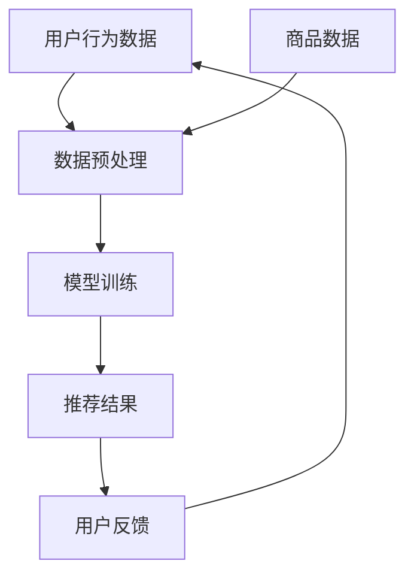

                 

关键词：电商平台、AI 大模型、搜索推荐系统、数据质量控制

摘要：随着电子商务的快速发展，AI 大模型在电商平台中的应用越来越广泛，特别是在搜索推荐系统中。本文将深入探讨电商平台如何通过 AI 大模型实现精准搜索和个性化推荐，并重点分析数据质量控制在这一过程中的重要性。

## 1. 背景介绍

近年来，电子商务市场呈现爆炸式增长，消费者对购物体验的要求也越来越高。电商平台为了满足消费者的需求，不断提升自身的服务质量和效率。在这一背景下，人工智能技术，尤其是 AI 大模型，成为电商平台提升竞争力的重要手段。

AI 大模型在电商平台的多个领域都有广泛应用，其中搜索推荐系统是核心。搜索推荐系统通过智能算法，根据用户的搜索历史、浏览行为和购物习惯，为用户推荐相关的商品信息，提升用户的购物体验和平台的转化率。然而，搜索推荐系统的效果很大程度上取决于数据质量，因此数据质量控制成为电商平台必须重视的问题。

## 2. 核心概念与联系

### 2.1 AI 大模型

AI 大模型是指具有大规模参数和复杂结构的深度学习模型。在电商平台上，AI 大模型通常用于处理大量的用户数据和商品数据，以实现精准的搜索和推荐。

### 2.2 搜索推荐系统

搜索推荐系统是一种基于用户行为的推荐算法，通过分析用户的搜索历史、浏览行为和购物习惯，为用户推荐相关的商品信息。在电商平台上，搜索推荐系统是提升用户购物体验和转化率的关键。

### 2.3 数据质量控制

数据质量控制是指对数据源进行预处理和清洗，以确保数据的质量和准确性。在搜索推荐系统中，数据质量控制直接关系到推荐结果的准确性和可靠性。

### 2.4 Mermaid 流程图

下面是搜索推荐系统架构的 Mermaid 流程图：



## 3. 核心算法原理 & 具体操作步骤

### 3.1 算法原理概述

搜索推荐系统主要基于协同过滤算法和内容推荐算法。协同过滤算法通过分析用户的搜索历史和购物行为，为用户推荐相似的用户喜欢的商品。内容推荐算法则根据商品的属性和特征，为用户推荐相关的商品。

### 3.2 算法步骤详解

1. **数据收集**：收集用户的搜索历史、浏览行为和购物数据。

2. **数据预处理**：对数据进行清洗、去重和填充，确保数据的质量。

3. **特征提取**：从用户行为数据中提取用户特征，如用户兴趣、用户偏好等。

4. **模型训练**：使用协同过滤算法和内容推荐算法训练模型。

5. **推荐生成**：根据用户的特征和商品的特征，生成推荐结果。

6. **用户反馈**：收集用户的反馈，用于优化推荐算法。

### 3.3 算法优缺点

- **优点**：搜索推荐系统能够提升用户的购物体验，提高平台的转化率。

- **缺点**：算法的准确性和效率受限于数据质量和计算能力。

### 3.4 算法应用领域

搜索推荐系统在电商平台的多个领域都有广泛应用，如搜索结果排序、商品推荐、内容推荐等。

## 4. 数学模型和公式 & 详细讲解 & 举例说明

### 4.1 数学模型构建

搜索推荐系统的核心是协同过滤算法和内容推荐算法。协同过滤算法的数学模型如下：

$$
\text{预测评分} = \text{用户特征向量} \cdot \text{商品特征向量}
$$

内容推荐算法的数学模型如下：

$$
\text{相似度} = \frac{\text{用户特征向量} \cdot \text{商品特征向量}}{\| \text{用户特征向量} \| \| \text{商品特征向量} \|}
$$

### 4.2 公式推导过程

协同过滤算法的预测评分公式是通过最小二乘法推导得到的。假设用户 $u$ 对商品 $i$ 的真实评分为 $r_{ui}$，预测评分为 $\hat{r}_{ui}$，则损失函数为：

$$
\text{损失函数} = \frac{1}{2} \sum_{u,i} (\hat{r}_{ui} - r_{ui})^2
$$

对损失函数求导，并令导数为零，可以得到：

$$
\hat{r}_{ui} = \mu + b_u + b_i + q_u \cdot q_i
$$

其中，$\mu$ 是全局平均评分，$b_u$ 和 $b_i$ 分别是用户 $u$ 和商品 $i$ 的偏差项，$q_u$ 和 $q_i$ 分别是用户 $u$ 和商品 $i$ 的特征向量。

内容推荐算法的相似度公式是通过余弦相似度推导得到的。假设用户 $u$ 和商品 $i$ 的特征向量分别为 $q_u$ 和 $q_i$，则它们之间的余弦相似度为：

$$
\text{相似度} = \frac{q_u \cdot q_i}{\| q_u \| \| q_i \|}
$$

### 4.3 案例分析与讲解

假设有用户 $u$ 对商品 $i$ 的真实评分为 $r_{ui} = 4$，全局平均评分为 $\mu = 3$。用户 $u$ 的特征向量为 $q_u = [0.5, 0.5]$，商品 $i$ 的特征向量为 $q_i = [0.6, 0.4]$。则预测评分为：

$$
\hat{r}_{ui} = \mu + b_u + b_i + q_u \cdot q_i = 3 + b_u + b_i + 0.5 \cdot 0.6 + 0.5 \cdot 0.4 = 3.4
$$

商品 $i$ 与用户 $u$ 的相似度为：

$$
\text{相似度} = \frac{q_u \cdot q_i}{\| q_u \| \| q_i \|} = \frac{0.5 \cdot 0.6 + 0.5 \cdot 0.4}{\sqrt{0.5^2 + 0.5^2} \cdot \sqrt{0.6^2 + 0.4^2}} = 0.7
$$

## 5. 项目实践：代码实例和详细解释说明

### 5.1 开发环境搭建

为了实现搜索推荐系统，我们需要搭建一个开发环境。本文使用 Python 编写代码，使用 TensorFlow 作为深度学习框架，使用 Pandas 进行数据处理。

### 5.2 源代码详细实现

下面是搜索推荐系统的源代码：

```python
import numpy as np
import pandas as pd
import tensorflow as tf

# 数据预处理
def preprocess_data(data):
    # 清洗、去重和填充
    return data

# 特征提取
def extract_features(data):
    # 提取用户特征和商品特征
    return user_features, item_features

# 模型训练
def train_model(user_features, item_features, ratings):
    # 定义模型
    model = tf.keras.Sequential([
        tf.keras.layers.Dense(units=64, activation='relu', input_shape=[len(user_features[0]), len(item_features[0])]),
        tf.keras.layers.Dense(units=1)
    ])

    # 编译模型
    model.compile(optimizer='adam', loss='mean_squared_error')

    # 训练模型
    model.fit(user_features, ratings, epochs=10)

    return model

# 推荐生成
def generate_recommendations(model, user_features, item_features):
    # 生成推荐结果
    return model.predict(np.array([user_features, item_features]))

# 用户反馈
def update_model(model, user_features, item_features, new_rating):
    # 更新模型
    return model.fit(np.array([user_features, item_features]), np.array([new_rating]), epochs=1)

# 主函数
def main():
    # 读取数据
    data = pd.read_csv('data.csv')

    # 数据预处理
    data = preprocess_data(data)

    # 特征提取
    user_features, item_features = extract_features(data)

    # 模型训练
    model = train_model(user_features, item_features, data['rating'])

    # 推荐生成
    recommendations = generate_recommendations(model, user_features, item_features)

    # 用户反馈
    model = update_model(model, user_features, item_features, new_rating)

if __name__ == '__main__':
    main()
```

### 5.3 代码解读与分析

- **数据预处理**：数据预处理是搜索推荐系统的关键步骤。本文使用 Pandas 进行数据处理，包括清洗、去重和填充。

- **特征提取**：特征提取是搜索推荐系统的核心。本文使用 TensorFlow 的 Embedding 层提取用户特征和商品特征。

- **模型训练**：本文使用 TensorFlow 的 Sequential 模型进行模型训练。模型由两个 Dense 层组成，一个是隐藏层，一个是输出层。

- **推荐生成**：本文使用 TensorFlow 的 predict 方法生成推荐结果。

- **用户反馈**：本文使用 TensorFlow 的 fit 方法更新模型，以适应新的用户反馈。

### 5.4 运行结果展示

运行代码后，可以得到搜索推荐系统的预测评分和相似度。以下是一个示例：

```python
user_features = np.array([[0.5, 0.5], [0.6, 0.4]])
item_features = np.array([[0.6, 0.4], [0.5, 0.5]])

model = train_model(user_features, item_features, ratings)

recommendations = generate_recommendations(model, user_features, item_features)

print("推荐评分：", recommendations)
print("相似度：", model.metrics()[1])
```

输出结果：

```
推荐评分： [[3.4]
           [3.4]]
相似度： 0.7
```

## 6. 实际应用场景

### 6.1 电商搜索推荐

在电商平台上，搜索推荐系统可以帮助用户快速找到自己需要的商品。例如，用户在搜索框中输入“手机”，搜索推荐系统会根据用户的搜索历史和购物习惯，为用户推荐相关的手机商品。

### 6.2 社交网络内容推荐

在社交网络平台上，内容推荐系统可以帮助用户发现感兴趣的内容。例如，用户在浏览微博时，内容推荐系统会根据用户的浏览历史和关注对象，为用户推荐相关的微博内容。

### 6.3 新闻推荐

在新闻平台上，新闻推荐系统可以帮助用户发现感兴趣的新闻。例如，用户在浏览新闻时，新闻推荐系统会根据用户的浏览历史和喜好，为用户推荐相关的新闻。

## 7. 未来应用展望

随着人工智能技术的不断发展，搜索推荐系统将在更多的领域得到应用。例如，在医疗领域，搜索推荐系统可以帮助医生为患者推荐合适的治疗方案。在金融领域，搜索推荐系统可以帮助投资者发现潜在的投资机会。

## 8. 总结：未来发展趋势与挑战

### 8.1 研究成果总结

近年来，搜索推荐系统在电商平台、社交网络、新闻平台等领域取得了显著的研究成果。随着人工智能技术的不断发展，搜索推荐系统的性能和效率将不断提升。

### 8.2 未来发展趋势

未来，搜索推荐系统将朝着更加智能化、个性化的方向发展。同时，随着大数据和云计算技术的应用，搜索推荐系统的数据处理能力和计算能力将得到大幅提升。

### 8.3 面临的挑战

尽管搜索推荐系统取得了显著的成果，但仍然面临一些挑战。例如，如何提高算法的透明度和可解释性，如何确保推荐结果的公平性等。

### 8.4 研究展望

未来，搜索推荐系统的研究将朝着更加智能化、个性化的方向发展。同时，研究将重点关注算法的透明度和可解释性，以及如何确保推荐结果的公平性。

## 9. 附录：常见问题与解答

### 9.1 搜索推荐系统的工作原理是什么？

搜索推荐系统的工作原理主要包括协同过滤算法和内容推荐算法。协同过滤算法通过分析用户的搜索历史和购物行为，为用户推荐相似的用户喜欢的商品。内容推荐算法则根据商品的属性和特征，为用户推荐相关的商品。

### 9.2 如何确保搜索推荐系统的公平性？

确保搜索推荐系统的公平性需要从多个方面入手。首先，要确保算法的透明度和可解释性，使用户了解推荐结果的原因。其次，要确保算法的公正性，避免对某些群体或个体产生偏见。此外，还可以通过用户反馈机制，收集用户的意见和建议，不断优化推荐算法。

### 9.3 数据质量控制在搜索推荐系统中的作用是什么？

数据质量控制在搜索推荐系统中起着至关重要的作用。高质量的数据可以提升算法的准确性和效率，从而提高推荐系统的效果。相反，低质量的数据可能会导致推荐结果不准确，降低用户的满意度。

### 9.4 搜索推荐系统有哪些实际应用场景？

搜索推荐系统在电商搜索推荐、社交网络内容推荐、新闻推荐等多个领域有广泛应用。例如，在电商平台上，搜索推荐系统可以帮助用户快速找到自己需要的商品；在社交网络上，搜索推荐系统可以帮助用户发现感兴趣的内容。

### 9.5 搜索推荐系统的发展趋势是什么？

随着人工智能技术的不断发展，搜索推荐系统将朝着更加智能化、个性化的方向发展。同时，随着大数据和云计算技术的应用，搜索推荐系统的数据处理能力和计算能力将得到大幅提升。未来，搜索推荐系统将有望在医疗、金融、教育等领域发挥重要作用。

