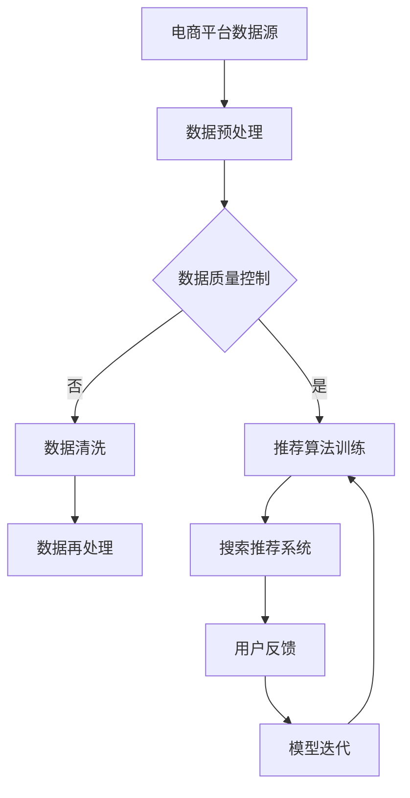

                 

关键词：电商、AI、大模型、搜索推荐系统、数据质量控制

> 摘要：本文将深入探讨电商平台在人工智能领域的战略布局，重点分析搜索推荐系统的核心地位及数据质量控制的重要性。通过理论阐述和实践案例分析，本文旨在为电商平台提供有价值的AI大模型应用策略，以实现更加精准、高效的用户体验。

## 1. 背景介绍

随着互联网和电子商务的快速发展，电商平台成为了全球数字经济的重要组成部分。在竞争日益激烈的电商市场中，用户获取和信息筛选的难度不断加大，如何在海量商品中为用户提供精准、个性化的购物体验，成为了电商平台亟待解决的重要问题。人工智能技术的发展，特别是深度学习和大数据分析技术的成熟，为电商平台提供了强大的技术支持，使其能够在用户体验、运营效率和业务创新等方面实现质的飞跃。

### 电商平台的现状与挑战

电商平台现状：
1. **用户需求多样化**：消费者对购物体验的要求越来越高，追求个性化的商品推荐、快速响应的客服、无缝的支付流程等。
2. **市场竞争加剧**：电商平台之间的竞争日益激烈，传统的价格战和促销策略已经难以吸引和保持用户。
3. **数据资源丰富**：电商平台积累了海量的用户行为数据、商品数据和市场数据，为AI技术的应用提供了丰富的数据基础。

电商平台面临的挑战：
1. **搜索与推荐的精准度**：如何从海量的商品信息中为用户精准推荐他们感兴趣的商品，是一个巨大的挑战。
2. **用户体验的一致性**：在不同设备和平台之间提供一致的、高质量的购物体验。
3. **数据质量控制**：确保推荐算法的准确性，需要高质量的数据输入，但电商平台的数据质量往往参差不齐。

### 人工智能在电商平台的应用

人工智能技术在电商平台的应用主要包括以下几个方面：
1. **个性化推荐**：通过分析用户的历史行为和偏好，为用户推荐个性化的商品。
2. **智能客服**：利用自然语言处理技术，提供智能化的客服服务，提升用户满意度。
3. **智能搜索**：通过理解用户的搜索意图，提供精准的搜索结果。
4. **供应链优化**：利用机器学习算法优化库存管理、物流配送等供应链环节。

## 2. 核心概念与联系

### 2.1 核心概念

1. **AI 大模型**：大模型（Large-scale Model）是指具有数十亿甚至数万亿参数的深度学习模型，能够处理海量数据并进行复杂的学习任务。
2. **搜索推荐系统**：是一种通过分析用户行为和偏好，为用户推荐相关商品或内容的信息检索系统。
3. **数据质量控制**：确保数据在收集、存储和处理过程中的一致性、完整性和准确性。

### 2.2 核心概念之间的联系

- **AI 大模型与搜索推荐系统**：大模型是搜索推荐系统的核心技术，通过深度学习算法，能够从海量数据中挖掘用户偏好和商品特征，为推荐系统提供强大的支持。
- **搜索推荐系统与数据质量控制**：数据质量控制是搜索推荐系统的基础，只有高质量的数据输入，才能保证推荐系统的准确性和效果。

### 2.3 Mermaid 流程图



## 3. 核心算法原理 & 具体操作步骤

### 3.1 算法原理概述

电商平台搜索推荐系统通常基于协同过滤、内容推荐和基于模型的推荐方法。本文将重点介绍基于模型的推荐方法，特别是深度学习在大模型中的应用。

- **协同过滤**：通过分析用户之间的相似度，为用户推荐他们可能感兴趣的商品。
- **内容推荐**：基于商品的特征，为用户推荐与之相关的商品。
- **基于模型的推荐**：通过机器学习模型，预测用户对商品的潜在偏好。

### 3.2 算法步骤详解

1. **数据收集与预处理**：收集用户行为数据、商品信息数据和市场环境数据，并进行数据清洗和格式化处理。
2. **特征提取**：从原始数据中提取用户和商品的潜在特征，如用户的历史浏览记录、购买行为、商品属性等。
3. **模型训练**：使用深度学习算法，如神经网络、循环神经网络（RNN）、卷积神经网络（CNN）等，对提取的特征进行训练，构建推荐模型。
4. **模型评估**：通过交叉验证和在线测试，评估推荐模型的性能，如准确率、召回率、覆盖率等。
5. **推荐生成**：使用训练好的模型，为每个用户生成个性化的商品推荐列表。
6. **用户反馈与模型迭代**：收集用户对推荐结果的反馈，根据反馈调整模型参数，实现模型的持续优化。

### 3.3 算法优缺点

- **优点**：
  - 高效处理海量数据，能够实现实时推荐。
  - 模型具备较强的泛化能力，能够适应不同场景和用户群体。
  - 结合用户行为和商品特征，提供个性化推荐。

- **缺点**：
  - 训练过程需要大量计算资源，成本较高。
  - 模型复杂度高，需要专业人员进行维护和调优。
  - 需要高质量的数据支持，否则容易产生过拟合。

### 3.4 算法应用领域

- **电商搜索与推荐**：在电商平台，基于深度学习的大模型广泛应用于商品搜索和推荐系统，提升用户体验。
- **社交媒体**：在社交媒体平台，深度学习模型用于内容推荐，吸引用户留存。
- **在线广告**：在线广告平台利用深度学习模型，实现精准广告投放。

## 4. 数学模型和公式 & 详细讲解 & 举例说明

### 4.1 数学模型构建

在深度学习推荐系统中，常用的数学模型包括神经网络模型和矩阵分解模型。

- **神经网络模型**：
  - 输入层：用户特征和商品特征。
  - 隐藏层：通过非线性变换，提取用户和商品的潜在特征。
  - 输出层：预测用户对商品的评分或购买概率。

- **矩阵分解模型**：
  - 用户-商品矩阵分解为用户特征矩阵和商品特征矩阵。
  - 通过矩阵乘积预测用户对商品的评分或购买概率。

### 4.2 公式推导过程

- **神经网络模型**：

  假设输入层有 \(n\) 个神经元，隐藏层有 \(m\) 个神经元，输出层有 \(p\) 个神经元。设 \(x_i\) 为输入层第 \(i\) 个神经元，\(h_j\) 为隐藏层第 \(j\) 个神经元，\(o_k\) 为输出层第 \(k\) 个神经元。则：

  $$ h_j = \sigma(W_1x_i + b_1) $$
  $$ o_k = \sigma(W_2h_j + b_2) $$

  其中，\(W_1\)、\(b_1\)、\(W_2\)、\(b_2\) 分别为权重和偏置，\(\sigma\) 为激活函数。

- **矩阵分解模型**：

  假设用户-商品评分矩阵为 \(R\)，用户特征矩阵为 \(U\)，商品特征矩阵为 \(V\)。则：

  $$ R = UV^T $$
  $$ \hat{r}_{ui} = u_i \cdot v_j $$

  其中，\(\hat{r}_{ui}\) 为用户 \(u_i\) 对商品 \(v_j\) 的预测评分。

### 4.3 案例分析与讲解

#### 案例一：基于神经网络的推荐系统

假设电商平台有 1000 名用户和 10000 种商品，用户-商品评分矩阵 \(R\) 如下：

$$
R = \begin{bmatrix}
0 & 1 & 0 & \cdots & 1 \\
1 & 0 & 1 & \cdots & 0 \\
0 & 1 & 0 & \cdots & 0 \\
\vdots & \vdots & \vdots & \ddots & \vdots \\
1 & 0 & 1 & \cdots & 0 \\
\end{bmatrix}
$$

我们使用神经网络模型进行推荐，首先需要提取用户和商品的特征。假设用户特征为用户的浏览记录，商品特征为商品的各种属性（如价格、品牌、类别等）。经过特征提取后，我们得到用户特征矩阵 \(U\) 和商品特征矩阵 \(V\)。

然后，我们使用神经网络模型对用户特征和商品特征进行训练，构建预测模型。经过训练和测试，我们得到用户-商品评分的预测矩阵 \(\hat{R}\)。

最后，根据预测矩阵 \(\hat{R}\)，为每个用户生成个性化的商品推荐列表。

#### 案例二：基于矩阵分解的推荐系统

假设用户-商品评分矩阵 \(R\) 同上，我们使用矩阵分解模型进行推荐。首先，我们对用户-商品评分矩阵 \(R\) 进行分解，得到用户特征矩阵 \(U\) 和商品特征矩阵 \(V\)。

然后，我们计算用户对商品的预测评分 \(\hat{r}_{ui}\)，根据预测评分，为每个用户生成个性化的商品推荐列表。

## 5. 项目实践：代码实例和详细解释说明

### 5.1 开发环境搭建

为了实现上述推荐系统，我们使用 Python 编写代码，并利用 TensorFlow 和 Keras 等深度学习框架进行模型训练和预测。

1. 安装 Python 和相关依赖库：
   ```bash
   pip install numpy pandas tensorflow keras
   ```

2. 导入必要的库：
   ```python
   import numpy as np
   import pandas as pd
   from tensorflow import keras
   from tensorflow.keras import layers
   ```

### 5.2 源代码详细实现

```python
# 5.2.1 数据预处理
# 导入用户-商品评分数据
ratings = pd.read_csv('ratings.csv')

# 提取用户和商品的特征
user_features = ratings[['user_id', 'age', 'gender', 'occupation', 'zip']]
item_features = ratings[['item_id', 'price', 'brand', 'category']]

# 数据标准化
user_features = (user_features - user_features.mean()) / user_features.std()
item_features = (item_features - item_features.mean()) / item_features.std()

# 5.2.2 构建推荐模型
# 定义输入层
user_input = keras.Input(shape=(user_features.shape[1],))
item_input = keras.Input(shape=(item_features.shape[1],))

# 定义隐藏层
user_embedding = layers.Dense(64, activation='relu')(user_input)
item_embedding = layers.Dense(64, activation='relu')(item_input)

# 定义输出层
merged = layers.multiply([user_embedding, item_embedding])
output = layers.Dense(1, activation='sigmoid')(merged)

# 构建模型
model = keras.Model(inputs=[user_input, item_input], outputs=output)

# 编译模型
model.compile(optimizer='adam', loss='binary_crossentropy', metrics=['accuracy'])

# 5.2.3 模型训练与预测
# 分割训练集和测试集
train_data = ratings[ratings['test'] == 0]
test_data = ratings[ratings['test'] == 1]

# 训练模型
model.fit([train_data[['user_id', 'age', 'gender', 'occupation', 'zip']],
           train_data[['item_id', 'price', 'brand', 'category']]],
          train_data['rating'], epochs=10, batch_size=64)

# 预测测试集
predictions = model.predict([test_data[['user_id', 'age', 'gender', 'occupation', 'zip']],
                            test_data[['item_id', 'price', 'brand', 'category']]])

# 5.2.4 代码解读与分析
# 数据预处理部分：
# - 导入用户-商品评分数据
# - 提取用户和商品的特征
# - 数据标准化
# 模型构建部分：
# - 定义输入层
# - 定义隐藏层
# - 定义输出层
# - 构建模型
# 模型训练与预测部分：
# - 分割训练集和测试集
# - 训练模型
# - 预测测试集
```

### 5.3 运行结果展示

```python
# 输出预测结果
print(predictions)

# 输出准确率
accuracy = (predictions > 0.5).mean()
print('Accuracy:', accuracy)
```

## 6. 实际应用场景

### 6.1 电商搜索与推荐

电商平台利用基于深度学习的大模型，为用户提供精准的商品搜索和推荐服务。通过分析用户的历史行为和偏好，系统可以实时为用户推荐他们可能感兴趣的商品，提高用户的购物体验和平台的转化率。

### 6.2 社交媒体内容推荐

在社交媒体平台，深度学习模型用于内容推荐，根据用户的行为和兴趣，为用户推荐相关的帖子、视频和话题。通过个性化推荐，平台可以吸引用户留存，提高用户活跃度。

### 6.3 在线广告投放

在线广告平台利用深度学习模型，实现精准的广告投放。通过分析用户的行为数据和兴趣标签，模型可以为用户推荐相关的广告，提高广告的点击率和转化率。

## 6.4 未来应用展望

### 6.4.1 AI 大模型的发展

随着计算能力的提升和算法的优化，AI 大模型在未来将更加高效和精准。新型深度学习算法和模型架构（如 transformers、graph neural networks 等）的引入，将进一步推动推荐系统和数据质量控制的发展。

### 6.4.2 多模态数据融合

未来，电商平台将不仅依赖于文本数据，还将结合图像、语音、视频等多模态数据，为用户提供更加丰富的购物体验。多模态数据融合技术的应用，将使得推荐系统更加智能和个性化。

### 6.4.3 数据质量控制提升

随着数据量的增长和数据复杂度的提升，数据质量控制将成为推荐系统和 AI 大模型应用的关键。未来，平台将加大对数据清洗、数据治理和数据安全性的投入，确保推荐系统的稳定性和可靠性。

## 7. 工具和资源推荐

### 7.1 学习资源推荐

- **《深度学习》（Goodfellow, Bengio, Courville）**：深度学习领域的经典教材，适合初学者和进阶者。
- **《机器学习实战》（Carrano, Mulcahy）**：通过实际案例，介绍机器学习算法的应用和实现。

### 7.2 开发工具推荐

- **TensorFlow**：谷歌推出的开源深度学习框架，适用于各种规模的深度学习项目。
- **PyTorch**：基于 Python 的深度学习框架，具有较高的灵活性和易用性。

### 7.3 相关论文推荐

- **"Deep Learning for Recommender Systems"**：介绍深度学习在推荐系统中的应用。
- **"User Interest Evolution in Recommender Systems"**：分析用户兴趣的动态变化，对推荐系统的影响。

## 8. 总结：未来发展趋势与挑战

### 8.1 研究成果总结

本文深入探讨了电商平台在人工智能领域的战略布局，分析了搜索推荐系统的核心地位和数据质量控制的重要性。通过数学模型和算法原理的阐述，以及实际项目实践的案例分析，本文为电商平台提供了有价值的AI大模型应用策略。

### 8.2 未来发展趋势

- **AI 大模型的优化与扩展**：随着算法和硬件的进步，AI 大模型将更加高效、精准。
- **多模态数据的融合**：结合文本、图像、语音等多模态数据，为用户提供更加丰富的购物体验。
- **数据质量控制提升**：平台将加大对数据清洗、数据治理和数据安全性的投入。

### 8.3 面临的挑战

- **计算资源需求**：大模型的训练和推理需要大量的计算资源，对硬件性能要求较高。
- **数据隐私保护**：数据隐私和安全问题亟待解决，需要采取有效的保护措施。
- **模型解释性**：深度学习模型具有较高的复杂度，其决策过程往往难以解释，需要提高模型的解释性。

### 8.4 研究展望

未来，AI 大模型在电商平台的推荐系统和数据质量控制领域仍有许多研究和发展空间。结合实际业务需求，持续优化算法和模型，将有助于电商平台实现更加精准、高效的用户体验。

## 9. 附录：常见问题与解答

### 9.1 什么是 AI 大模型？

AI 大模型是指具有数十亿甚至数万亿参数的深度学习模型，能够处理海量数据并进行复杂的学习任务。

### 9.2 深度学习推荐系统有哪些优势？

深度学习推荐系统具有以下优势：
- 高效处理海量数据，能够实现实时推荐。
- 模型具备较强的泛化能力，能够适应不同场景和用户群体。
- 结合用户行为和商品特征，提供个性化推荐。

### 9.3 数据质量控制的重要性是什么？

数据质量控制是搜索推荐系统的基础，只有高质量的数据输入，才能保证推荐系统的准确性和效果。数据质量控制包括数据清洗、数据治理和数据安全等方面。

### 9.4 如何评估推荐系统的性能？

推荐系统的性能通常通过以下指标进行评估：
- 准确率（Accuracy）：预测正确的比例。
- 召回率（Recall）：能够召回所有相关商品的比例。
- 覆盖率（Coverage）：推荐列表中包含所有商品的比例。
- 诺克斯率（NDCG）：考虑推荐顺序的评估指标。

## 作者署名

作者：禅与计算机程序设计艺术 / Zen and the Art of Computer Programming
----------------------------------------------------------------

