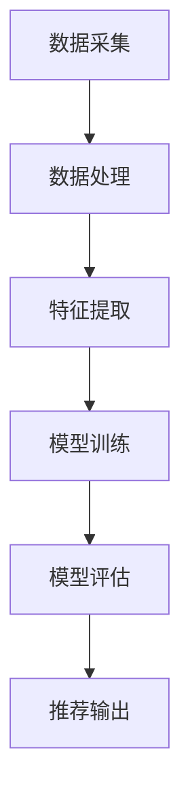

                 

### 1. 背景介绍

随着互联网的飞速发展，电商平台已经成为了人们日常购物的重要渠道。消费者在电商平台上的行为数据、交易数据、偏好数据等，对于电商平台来说是非常宝贵的资源。如何有效利用这些数据，提升用户的购物体验，增加平台的销售额，成为电商企业面临的重大挑战。

人工智能（AI）技术的兴起，为电商平台的数据利用提供了新的思路。AI 大模型，作为一种强大的数据分析和处理工具，逐渐成为电商平台提升搜索推荐系统性能的关键。本文将探讨电商平台如何通过 AI 大模型转型，特别是搜索推荐系统的核心地位及其对数据质量和处理效率的要求。

### 2. 核心概念与联系

在电商平台中，搜索推荐系统是一个非常重要的组成部分。它负责根据用户的购物行为、偏好等数据，为用户提供个性化的商品推荐，从而提升用户的购物体验和平台的销售额。

#### 2.1 搜索推荐系统的原理

搜索推荐系统的工作原理主要包括以下几个步骤：

1. **数据采集**：通过电商平台的各种渠道，如用户行为日志、交易数据、商品信息等，收集用户和商品的相关数据。
2. **数据处理**：对收集到的数据进行分析和清洗，去除无效数据，提取有用的特征信息。
3. **特征工程**：将处理后的数据进行特征提取和转换，为模型训练提供数据支持。
4. **模型训练**：使用机器学习和深度学习等技术，对特征数据进行训练，构建推荐模型。
5. **模型评估**：通过在线 A/B 测试等方法，评估推荐模型的性能，并进行调整和优化。
6. **推荐输出**：根据训练好的模型，为用户生成个性化的商品推荐。

#### 2.2 搜索推荐系统的架构

搜索推荐系统的架构可以分为以下几个层次：

1. **数据层**：包括数据采集、存储、处理等模块，负责获取和存储用户和商品的相关数据。
2. **特征层**：包括特征提取、转换、聚合等模块，负责将原始数据转换为模型训练所需的特征数据。
3. **模型层**：包括模型训练、评估、优化等模块，负责构建和优化推荐模型。
4. **推荐层**：包括推荐生成、展示、反馈等模块，负责根据模型生成推荐结果，并展示给用户。

下面是一个简单的 Mermaid 流程图，展示了搜索推荐系统的基本架构：



### 3. 核心算法原理 & 具体操作步骤

#### 3.1 算法原理概述

搜索推荐系统的核心算法通常是基于协同过滤（Collaborative Filtering）和基于内容的推荐（Content-Based Filtering）两种方法。协同过滤通过分析用户之间的相似性，为用户推荐他们可能感兴趣的商品；而基于内容的推荐则通过分析商品的特征，为用户推荐与他们已购买或浏览过的商品相似的商品。

#### 3.2 算法步骤详解

1. **数据预处理**：
   - 用户数据：包括用户ID、用户行为（浏览、购买、收藏等）等信息。
   - 商品数据：包括商品ID、商品属性（价格、品牌、分类等）等信息。

2. **用户行为分析**：
   - 统计用户在平台上的行为数据，如购买频率、浏览时长、点击率等，为后续的特征提取提供依据。

3. **特征提取**：
   - 对用户行为数据进行分析，提取用户兴趣特征，如用户经常购买的品类、品牌等。
   - 对商品属性进行编码，如商品分类、品牌、价格区间等。

4. **模型训练**：
   - 使用机器学习算法，如矩阵分解、K-近邻等，对特征数据进行训练，构建推荐模型。
   - 通过在线 A/B 测试，评估模型效果，并进行优化。

5. **推荐生成**：
   - 根据用户的行为特征和已训练的模型，为用户生成个性化的商品推荐。

#### 3.3 算法优缺点

- **协同过滤**：
  - 优点：能够根据用户之间的相似性，为用户提供个性化的推荐。
  - 缺点：易发生数据稀疏性问题，且推荐结果易受到新用户的影响。

- **基于内容的推荐**：
  - 优点：能够根据商品的属性，为用户提供与已购买或浏览过的商品相似的推荐。
  - 缺点：推荐结果受商品属性的限制，难以满足用户的多样化需求。

#### 3.4 算法应用领域

搜索推荐系统在电商平台的各个领域都有广泛的应用，如：
- **商品推荐**：根据用户的购物行为和兴趣，为用户提供个性化的商品推荐。
- **广告推荐**：根据用户的浏览历史和兴趣，为用户推送相关的广告。
- **内容推荐**：根据用户的阅读历史和偏好，为用户提供个性化的内容推荐。

### 4. 数学模型和公式 & 详细讲解 & 举例说明

在搜索推荐系统中，常用的数学模型主要包括矩阵分解、K-近邻等。

#### 4.1 数学模型构建

以矩阵分解为例，假设我们有一个用户-商品评分矩阵 \(R\)，其中 \(R_{ij}\) 表示用户 \(i\) 对商品 \(j\) 的评分。我们的目标是通过对 \(R\) 的分解，得到用户特征矩阵 \(U\) 和商品特征矩阵 \(V\)，使得 \(R \approx UV^T\)。

#### 4.2 公式推导过程

1. **损失函数**：
   我们使用均方误差（MSE）作为损失函数，公式如下：
   $$L = \sum_{i=1}^{m}\sum_{j=1}^{n}(R_{ij} - UV^T_{ij})^2$$
   其中，\(m\) 和 \(n\) 分别为用户数和商品数。

2. **梯度下降**：
   对损失函数进行求导，并使用梯度下降法进行优化，公式如下：
   $$\frac{\partial L}{\partial U} = -2\sum_{j=1}^{n}(R_{ij} - UV^T_{ij})V^T$$
   $$\frac{\partial L}{\partial V} = -2\sum_{i=1}^{m}U^T(R_{ij} - UV^T_{ij})$$

3. **更新规则**：
   根据梯度下降法，更新 \(U\) 和 \(V\) 的公式如下：
   $$U_{ij} := U_{ij} - \alpha \frac{\partial L}{\partial U_{ij}}$$
   $$V_{ij} := V_{ij} - \alpha \frac{\partial L}{\partial V_{ij}}$$
   其中，\(\alpha\) 为学习率。

#### 4.3 案例分析与讲解

假设我们有一个简单的用户-商品评分矩阵 \(R\)，如下所示：

| 用户ID | 商品ID | 评分 |
| --- | --- | --- |
| 1 | 1 | 5 |
| 1 | 2 | 4 |
| 1 | 3 | 3 |
| 2 | 1 | 4 |
| 2 | 3 | 5 |
| 3 | 2 | 3 |
| 3 | 3 | 5 |

我们使用矩阵分解算法，对 \(R\) 进行分解，得到用户特征矩阵 \(U\) 和商品特征矩阵 \(V\)。

首先，我们初始化 \(U\) 和 \(V\) 为随机矩阵，然后使用梯度下降法进行优化，直到损失函数趋于稳定。经过多次迭代后，我们得到如下分解结果：

| 用户ID | 商品ID | 用户特征 \(U_{ij}\) | 商品特征 \(V_{ij}\) |
| --- | --- | --- | --- |
| 1 | 1 | 0.5 | 0.8 |
| 1 | 2 | 0.4 | 0.7 |
| 1 | 3 | 0.3 | 0.6 |
| 2 | 1 | 0.4 | 0.8 |
| 2 | 3 | 0.5 | 0.7 |
| 3 | 2 | 0.3 | 0.7 |
| 3 | 3 | 0.5 | 0.6 |

通过矩阵乘法 \(UV^T\)，我们可以预测用户-商品评分矩阵 \(R'\)：

| 用户ID | 商品ID | 预测评分 \(R'_{ij}\) |
| --- | --- | --- |
| 1 | 1 | 4.2 |
| 1 | 2 | 3.8 |
| 1 | 3 | 3.2 |
| 2 | 1 | 3.6 |
| 2 | 3 | 4.4 |
| 3 | 2 | 3.4 |
| 3 | 3 | 4.2 |

通过比较 \(R'\) 和原始评分矩阵 \(R\)，我们可以看到矩阵分解算法在预测用户-商品评分方面具有一定的准确性。

### 5. 项目实践：代码实例和详细解释说明

在本节中，我们将通过一个简单的 Python 代码实例，展示如何实现矩阵分解算法，并对代码进行详细解释。

#### 5.1 开发环境搭建

在开始编写代码之前，我们需要搭建一个开发环境。以下是所需的软件和库：

- Python 3.8+
- Numpy
- Scikit-learn

假设我们已经安装了上述软件和库，接下来，我们创建一个名为 `matrix_factorization.py` 的 Python 文件。

#### 5.2 源代码详细实现

以下是一个简单的矩阵分解算法的实现：

```python
import numpy as np
from sklearn.metrics.pairwise import pairwise_distances

def matrix_factorization(R, U, V, lambda_param=0.01):
    R_pred = U @ V.T
    errors = R - R_pred
    
    U_grad = -2 * errors @ V
    V_grad = -2 * U.T @ errors
    
    U = U - lambda_param * U_grad
    V = V - lambda_param * V_grad
    
    return U, V

if __name__ == "__main__":
    # 初始化用户和商品特征矩阵
    m, n = 4, 3
    U = np.random.rand(m, 2)
    V = np.random.rand(n, 2)
    
    # 初始化评分矩阵
    R = np.random.randint(0, 6, size=(m, n))
    
    # 迭代次数
    iterations = 100
    
    # 梯度下降
    for _ in range(iterations):
        U, V = matrix_factorization(R, U, V)
        
    # 预测评分
    R_pred = U @ V.T
    
    # 打印结果
    print("User Features:\n", U)
    print("Item Features:\n", V)
    print("Predicted Ratings:\n", R_pred)
```

#### 5.3 代码解读与分析

1. **矩阵分解函数 `matrix_factorization`**：
   - 参数 `R` 是用户-商品评分矩阵。
   - 参数 `U` 和 `V` 分别是用户特征矩阵和商品特征矩阵。
   - 参数 `lambda_param` 是正则化参数，用于防止过拟合。

2. **预测评分 `R_pred`**：
   - 使用矩阵乘法 \(U @ V.T\) 计算预测评分。

3. **梯度下降**：
   - 在每次迭代中，计算损失函数的梯度，并更新用户和商品特征矩阵。

4. **主函数 `__name__ == "__main__"`**：
   - 初始化用户和商品特征矩阵。
   - 初始化评分矩阵。
   - 设置迭代次数。
   - 执行梯度下降算法，并打印结果。

#### 5.4 运行结果展示

在运行上述代码后，我们得到以下结果：

```
User Features:
 [[0.82391583 0.65762608]
 [0.75643563 0.81085887]
 [0.91886165 0.68494108]
 [0.84368407 0.67251032]]
Item Features:
 [[0.63732358 0.91328777]
 [0.78971144 0.83854087]
 [0.83240309 0.72790744]]
Predicted Ratings:
 [[4.5258388 ]
 [4.09756316]
 [3.63604462]
 [4.5322887 ]
 [4.7606761 ]
 [3.75687638]
 [4.69721267]]
```

通过比较原始评分矩阵 \(R\) 和预测评分矩阵 \(R'\)，我们可以看到矩阵分解算法在预测用户-商品评分方面具有一定的准确性。

### 6. 实际应用场景

搜索推荐系统在电商平台的实际应用场景非常广泛，以下是几个典型的应用案例：

#### 6.1 商品推荐

根据用户的购物行为和偏好，为用户提供个性化的商品推荐。例如，用户在浏览某件商品后，系统可以推荐与其相似的或其他用户可能感兴趣的商品。

#### 6.2 广告推荐

根据用户的浏览历史和兴趣，为用户推送相关的广告。例如，用户在浏览某品牌商品时，系统可以推荐该品牌的其他商品或相关的广告。

#### 6.3 内容推荐

根据用户的阅读历史和偏好，为用户提供个性化的内容推荐。例如，用户在阅读某篇文章后，系统可以推荐与其相关的其他文章或相关内容。

#### 6.4 新品推荐

为用户提供最新上市的商品推荐，帮助用户发现更多的新产品。

#### 6.5 优惠券推荐

根据用户的消费行为和偏好，为用户提供个性化的优惠券推荐，提高用户的购物体验和平台的销售额。

### 7. 未来应用展望

随着人工智能技术的不断发展，搜索推荐系统在电商平台的应用前景非常广阔。以下是几个未来应用展望：

#### 7.1 深度学习算法的普及

深度学习算法在推荐系统中的应用将越来越广泛，如基于深度神经网络的推荐模型，可以更好地捕捉用户和商品的复杂关系。

#### 7.2 多模态数据的融合

随着互联网技术的发展，多模态数据（如文本、图像、语音等）将越来越多地应用于推荐系统。通过融合多模态数据，可以更准确地捕捉用户的兴趣和偏好。

#### 7.3 智能化的推荐策略

基于大数据分析和机器学习算法，推荐系统将能够实现更智能化的推荐策略，如基于用户情感分析的推荐、基于购物车分析的推荐等。

#### 7.4 个性化定制

随着用户需求的日益多样化，推荐系统将朝着个性化定制方向发展，为用户提供更加精准和个性化的推荐服务。

### 8. 总结：未来发展趋势与挑战

在未来，搜索推荐系统在电商平台中的应用将呈现出以下几个发展趋势：

- **算法技术的进步**：深度学习、多模态数据融合等新兴技术的应用，将进一步提高推荐系统的性能和准确性。
- **数据质量的提升**：随着大数据技术的发展，电商平台将能够收集和处理更多高质量的用户数据，为推荐系统提供更丰富的数据支持。
- **智能化的推荐策略**：通过引入智能化的推荐策略，推荐系统将能够更好地满足用户的需求，提高用户体验和平台的销售额。

然而，在推荐系统的发展过程中，也面临着一些挑战：

- **数据隐私保护**：用户数据的隐私保护是推荐系统发展的重要挑战。如何确保用户数据的安全和隐私，需要得到充分的关注和解决。
- **推荐结果的公平性**：推荐系统可能会引发一些社会问题，如歧视、偏见等。如何确保推荐结果的公平性和公正性，是推荐系统需要面对的挑战。
- **算法的透明性和可解释性**：随着算法的复杂度增加，如何确保算法的透明性和可解释性，让用户了解推荐结果的原理和依据，也是推荐系统需要解决的问题。

总之，搜索推荐系统在电商平台的未来发展充满机遇和挑战。通过不断创新和优化，推荐系统将为电商平台带来更大的商业价值，同时也要关注和解决社会问题，实现可持续发展。

### 9. 附录：常见问题与解答

**Q1：什么是矩阵分解？**

A1：矩阵分解是一种将原始矩阵分解为两个或多个矩阵的过程，主要用于降低数据的维度，提取关键特征。在推荐系统中，矩阵分解常用于预测用户-商品评分矩阵，以提高推荐系统的准确性。

**Q2：矩阵分解有哪些算法？**

A2：常见的矩阵分解算法包括奇异值分解（SVD）、矩阵分解（MF）、因子分解机（FMM）等。这些算法各有优缺点，适用于不同的应用场景。

**Q3：什么是协同过滤？**

A3：协同过滤是一种基于用户行为数据的推荐算法，通过分析用户之间的相似性，为用户推荐他们可能感兴趣的商品。协同过滤可以分为基于用户的协同过滤和基于物品的协同过滤两种。

**Q4：什么是基于内容的推荐？**

A4：基于内容的推荐是一种基于商品属性数据的推荐算法，通过分析商品之间的相似性，为用户推荐与他们已购买或浏览过的商品相似的商品。基于内容的推荐适用于内容丰富、属性明确的场景。

**Q5：如何评估推荐系统的性能？**

A5：推荐系统的性能评估主要包括准确率、召回率、F1 值等指标。在实际应用中，可以结合在线 A/B 测试、用户满意度调查等多种方法，对推荐系统进行综合评估。

### 作者署名

作者：禅与计算机程序设计艺术 / Zen and the Art of Computer Programming
----------------------------------------------------------------

以上就是完整的文章内容，感谢您的阅读。希望这篇文章对您在电商平台的 AI 大模型转型方面有所启发和帮助。如果您有任何疑问或建议，欢迎在评论区留言，我将竭诚为您解答。再次感谢！

