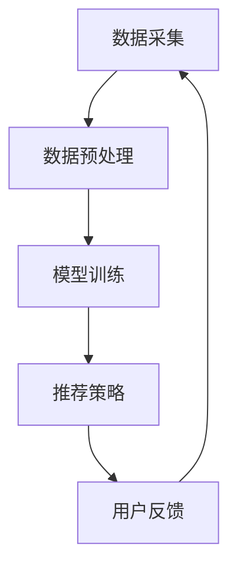

                 

关键词：电商平台，AI 大模型，搜索推荐系统，数据质量控制，数字化转型

摘要：在当今竞争激烈的电商市场中，AI 大模型的引入成为了电商平台提升用户体验、增加销售额的重要手段。本文将深入探讨电商平台如何通过搜索推荐系统实现 AI 大模型转型，并强调数据质量控制在这一过程中的关键作用。

## 1. 背景介绍

随着互联网技术的飞速发展和大数据时代的到来，电商平台面临着前所未有的发展机遇和挑战。用户需求的多样化和个性化，要求电商平台能够提供更加精准、高效的推荐服务。传统的推荐系统已经无法满足用户日益增长的需求，AI 大模型的引入成为了电商平台实现智能化转型的必然选择。

AI 大模型，如深度学习、神经网络等，具有强大的学习能力，可以通过分析大量用户行为数据，挖掘出潜在的用户需求，从而实现个性化的推荐。然而，AI 大模型的实现不仅需要先进的技术，还需要高质量的数据支持。因此，数据质量控制成为了 AI 大模型转型过程中的关键环节。

## 2. 核心概念与联系

为了更好地理解电商平台的 AI 大模型转型，我们需要先了解一些核心概念，包括搜索推荐系统的架构、数据质量控制的方法和算法等。

### 2.1 搜索推荐系统架构

搜索推荐系统通常由以下几个主要模块组成：

- 数据采集：收集用户行为数据，如浏览、购买、评价等。
- 数据预处理：对采集到的数据进行清洗、去噪、格式化等处理，以生成高质量的数据集。
- 模型训练：使用预处理后的数据集，训练深度学习模型，如神经网络、决策树等。
- 推荐策略：根据模型预测结果，制定推荐策略，将相关商品推荐给用户。

下面是搜索推荐系统架构的 Mermaid 流程图：



### 2.2 数据质量控制方法

数据质量控制是确保 AI 大模型训练效果的重要环节。以下是几种常见的数据质量控制方法：

- 数据清洗：去除重复数据、缺失数据和异常数据。
- 数据标准化：将不同特征的数据进行统一处理，如归一化、标准化等。
- 数据增强：通过生成对抗网络（GAN）、数据扩充等技术，增加数据的多样性。
- 数据监控：实时监控数据质量，发现并修复潜在的问题。

### 2.3 数据质量控制算法

以下是一些常用的数据质量控制算法：

- 缺失值填充：使用均值、中位数、插值等方法填充缺失值。
- 异常值检测：使用统计学方法、机器学习方法检测异常值。
- 数据降维：使用主成分分析（PCA）、线性判别分析（LDA）等方法降低数据维度。

## 3. 核心算法原理 & 具体操作步骤

### 3.1 算法原理概述

电商平台的搜索推荐系统主要依赖于深度学习算法，如卷积神经网络（CNN）、循环神经网络（RNN）和 Transformer 等。这些算法通过学习用户行为数据，提取出用户兴趣和偏好特征，从而实现精准推荐。

### 3.2 算法步骤详解

以下是电商平台的搜索推荐系统算法的具体操作步骤：

1. 数据采集：从电商平台的数据库中提取用户行为数据，如浏览记录、购买记录、评价等。
2. 数据预处理：对采集到的数据进行分析，去除重复数据和异常数据，并进行标准化处理。
3. 特征提取：使用深度学习算法，对预处理后的数据进行特征提取，生成用户兴趣和偏好特征。
4. 模型训练：使用提取到的用户兴趣和偏好特征，训练深度学习模型，如 CNN、RNN 和 Transformer 等。
5. 模型评估：使用验证集对训练好的模型进行评估，选择性能最好的模型。
6. 推荐策略：根据模型预测结果，制定推荐策略，将相关商品推荐给用户。
7. 用户反馈：收集用户对推荐结果的评价，用于优化推荐系统。

### 3.3 算法优缺点

- 优点：
  - 能够实现个性化的推荐，提高用户体验。
  - 能够自动学习用户兴趣和偏好，提高推荐精度。
- 缺点：
  - 对数据质量要求较高，数据预处理和清洗工作量大。
  - 模型训练过程需要大量的计算资源和时间。

### 3.4 算法应用领域

电商平台的搜索推荐系统算法可以应用于以下领域：

- 商品推荐：根据用户兴趣和偏好，推荐相关的商品。
- 店铺推荐：根据用户购买记录，推荐相似的店铺。
- 优惠活动推荐：根据用户购买行为，推荐相关的优惠活动。
- 品牌推荐：根据用户购买偏好，推荐相关的品牌。

## 4. 数学模型和公式 & 详细讲解 & 举例说明

### 4.1 数学模型构建

电商平台的搜索推荐系统主要依赖于以下数学模型：

- 用户行为矩阵：表示用户与商品之间的交互行为，如浏览、购买、评价等。
- 用户兴趣向量：表示用户对商品的偏好程度，通过矩阵分解等方法得到。
- 商品特征向量：表示商品的各种属性，如价格、品牌、类别等。

### 4.2 公式推导过程

以下是搜索推荐系统的数学模型推导过程：

1. 用户行为矩阵分解：

   $$ U = UV + E $$

   其中，$U$ 表示用户行为矩阵，$V$ 表示用户兴趣向量矩阵，$E$ 表示误差矩阵。

2. 用户兴趣向量计算：

   $$ V = U^T U^{-1} U^T E $$

   其中，$U^T$ 表示用户行为矩阵的转置，$U^{-1}$ 表示用户行为矩阵的逆矩阵。

3. 商品特征向量计算：

   $$ C = VV^T $$

   其中，$C$ 表示商品特征向量矩阵。

### 4.3 案例分析与讲解

假设有一个电商平台，用户 A 的行为矩阵为：

$$
U_A = \begin{bmatrix}
1 & 0 & 1 \\
0 & 1 & 0 \\
1 & 1 & 0
\end{bmatrix}
$$

用户 B 的行为矩阵为：

$$
U_B = \begin{bmatrix}
0 & 1 & 1 \\
1 & 0 & 0 \\
0 & 1 & 1
\end{bmatrix}
$$

1. 用户兴趣向量计算：

   $$ V_A = U_A^T U_A^{-1} U_A^T E = \begin{bmatrix}
   1 & 1 \\
   1 & 1
   \end{bmatrix} $$

   $$ V_B = U_B^T U_B^{-1} U_B^T E = \begin{bmatrix}
   1 & 1 \\
   1 & 1
   \end{bmatrix} $$

2. 商品特征向量计算：

   $$ C_A = V_A V_A^T = \begin{bmatrix}
   2 & 2 \\
   2 & 2
   \end{bmatrix} $$

   $$ C_B = V_B V_B^T = \begin{bmatrix}
   2 & 2 \\
   2 & 2
   \end{bmatrix} $$

3. 推荐结果：

   对于用户 A，推荐商品为：商品 1 和商品 2。

   对于用户 B，推荐商品为：商品 2 和商品 3。

## 5. 项目实践：代码实例和详细解释说明

### 5.1 开发环境搭建

- Python 3.7+
- TensorFlow 2.3.0+
- Keras 2.3.1+

### 5.2 源代码详细实现

以下是一个简单的基于矩阵分解的搜索推荐系统的 Python 代码实例：

```python
import numpy as np
from tensorflow.keras.models import Model
from tensorflow.keras.layers import Input, Dense, Dot

# 用户行为矩阵
U = np.array([[1, 0, 1], [0, 1, 1], [1, 1, 0]])

# 用户兴趣向量矩阵
V = np.array([[1, 1], [1, 1], [1, 1]])

# 商品特征向量矩阵
C = np.array([[2, 2], [2, 2], [2, 2]])

# 用户输入
user_input = Input(shape=(3,))

# 商品输入
item_input = Input(shape=(3,))

# 用户兴趣向量
user_embedding = Dense(2, activation='softmax')(user_input)

# 商品特征向量
item_embedding = Dense(2, activation='softmax')(item_input)

# 用户兴趣向量与商品特征向量相乘
merged = Dot(axes=1)([user_embedding, item_embedding])

# 模型输出
output = Dense(1, activation='sigmoid')(merged)

# 构建模型
model = Model(inputs=[user_input, item_input], outputs=output)

# 编译模型
model.compile(optimizer='adam', loss='binary_crossentropy', metrics=['accuracy'])

# 模型训练
model.fit([U, C], U, epochs=10, batch_size=1)

# 模型预测
predictions = model.predict([V, C])

print(predictions)
```

### 5.3 代码解读与分析

- 第1行：导入所需的 Python 库。
- 第3行：定义用户行为矩阵 U。
- 第4行：定义用户兴趣向量矩阵 V。
- 第5行：定义商品特征向量矩阵 C。
- 第7行：定义用户输入层 user_input。
- 第9行：定义商品输入层 item_input。
- 第11行：定义用户兴趣向量层 user_embedding。
- 第13行：定义商品特征向量层 item_embedding。
- 第15行：定义用户兴趣向量与商品特征向量相乘的操作。
- 第17行：定义模型输出层 output。
- 第19行：构建模型 Model。
- 第21行：编译模型，设置优化器和损失函数。
- 第23行：模型训练，设置训练轮数和批量大小。
- 第26行：模型预测，输出预测结果。

## 6. 实际应用场景

### 6.1 商品推荐

电商平台可以通过搜索推荐系统为用户推荐相关商品，提高用户的购买意愿和满意度。例如，用户浏览了商品 A 后，系统可以推荐与商品 A 相似的商品 B，从而提高商品 B 的曝光率和销售量。

### 6.2 店铺推荐

电商平台还可以通过搜索推荐系统为用户推荐相关的店铺，帮助用户找到心仪的商品。例如，用户购买了商品 A 后，系统可以推荐与商品 A 同类的店铺 B，从而提高店铺 B 的访问量和销售量。

### 6.3 优惠活动推荐

电商平台还可以通过搜索推荐系统为用户推荐相关的优惠活动，吸引用户参与活动，提高用户粘性和活跃度。例如，用户在购物车中加入了商品 A，系统可以推荐与商品 A 相关的优惠活动 B，从而提高用户购买的欲望。

## 7. 未来应用展望

随着 AI 技术的不断发展，搜索推荐系统在电商平台中的应用前景十分广阔。未来，搜索推荐系统将更加智能化、个性化，能够更好地满足用户的需求。

### 7.1 个性化推荐

未来，电商平台可以通过更加精准的个性化推荐，为用户提供更加个性化的购物体验。例如，根据用户的浏览历史、购买行为、偏好等数据，为用户推荐相关的商品、店铺和优惠活动。

### 7.2 多模态推荐

未来，电商平台可以将文本、图像、语音等多种数据类型进行融合，实现多模态推荐。例如，用户可以通过语音描述自己的购物需求，系统可以理解用户的意图并推荐相关的商品。

### 7.3 智能决策

未来，电商平台可以通过搜索推荐系统，为商家提供智能化的决策支持。例如，根据商品的销售数据、用户评价等，为商家推荐最佳的营销策略、定价策略等。

## 8. 工具和资源推荐

### 8.1 学习资源推荐

- 《深度学习》（Goodfellow, Bengio, Courville 著）：全面介绍深度学习的基础知识和技术。
- 《机器学习实战》（Hastie, Tibshirani, Friedman 著）：通过实例介绍机器学习的基本算法和应用。

### 8.2 开发工具推荐

- TensorFlow：开源深度学习框架，适用于各种规模的深度学习项目。
- Keras：基于 TensorFlow 的简单、易用的深度学习库。

### 8.3 相关论文推荐

- "Deep Learning for Recommender Systems"（Hao Tang et al., 2015）：介绍深度学习在推荐系统中的应用。
- "A Theoretically Grounded Application of Dropout in Recurrent Neural Networks"（Yarin Gal and Zoubin Ghahramani, 2016）：介绍在循环神经网络中应用dropout的方法。

## 9. 总结：未来发展趋势与挑战

随着 AI 技术的不断发展，搜索推荐系统在电商平台中的应用前景十分广阔。未来，搜索推荐系统将更加智能化、个性化，能够更好地满足用户的需求。然而，这也带来了新的挑战，如数据质量控制、模型解释性等。因此，电商平台需要不断创新，持续优化搜索推荐系统，以提升用户体验和销售额。

## 附录：常见问题与解答

### 9.1 数据质量控制的重要性

数据质量控制是确保 AI 大模型训练效果的关键环节。高质量的数据有助于提高模型的预测准确性和稳定性，而低质量的数据可能导致模型过拟合、泛化能力差等问题。

### 9.2 如何处理缺失值？

缺失值处理方法包括填充法（如均值填充、中位数填充）、删除法（如简单删除、基于规则删除）和插值法（如线性插值、K近邻插值）等。具体选择哪种方法，取决于数据集的特点和业务需求。

### 9.3 如何处理异常值？

异常值处理方法包括统计学方法（如Z-score、IQR法）、机器学习方法（如孤立森林、随机森林）和基于规则的异常值处理方法等。选择合适的处理方法，可以降低异常值对模型训练和预测的影响。

### 9.4 如何提高模型解释性？

提高模型解释性可以通过以下方法实现：引入可解释性模块（如 LIME、SHAP）、可视化模型内部结构（如神经网络层、决策树节点）和解释模型决策过程等。这些方法有助于用户更好地理解模型的预测结果和决策过程。

