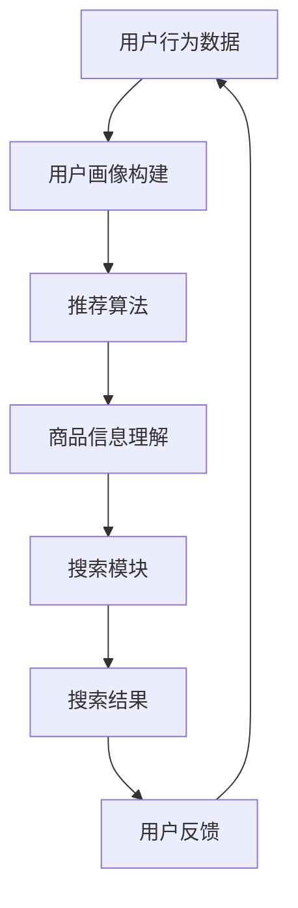

                 

关键词：电商平台，AI 大模型，搜索推荐系统，数据质量控制，数字化转型，客户体验优化

> 摘要：在电商行业日益激烈的竞争中，AI 大模型的引入已成为提升客户体验、增强竞争力的关键。本文将探讨电商平台如何通过搜索推荐系统的优化和数据质量控制的策略，实现 AI 大模型的转型，为用户提供更加精准、个性化的服务。

## 1. 背景介绍

随着互联网的普及和电子商务的迅猛发展，电商平台已经成为人们日常生活中不可或缺的一部分。然而，在众多竞争者中脱颖而出，为用户提供优质的服务体验，成为电商平台持续发展的关键。近年来，人工智能（AI）技术的快速发展为电商平台带来了新的机遇。特别是大模型（Large-scale Models）的应用，使得电商平台在搜索推荐系统方面取得了显著的进展。

### 1.1 电商平台搜索推荐系统的重要性

搜索推荐系统是电商平台的核心组成部分，它不仅影响着用户浏览和购买行为，还直接关系到平台的销售额和用户留存率。一个高效、精准的搜索推荐系统能够：

- 提高用户在平台上的浏览效率，快速找到所需商品。
- 推荐个性化商品，增加用户的购买概率。
- 提高用户满意度，增强用户忠诚度。
- 增加平台的销售额和盈利能力。

### 1.2 AI 大模型的发展与应用

AI 大模型是人工智能领域的一个重要突破，具有处理海量数据、学习复杂模式的能力。其应用范围广泛，从自然语言处理、计算机视觉到推荐系统等都有显著的表现。在电商平台，AI 大模型的应用主要体现在以下几个方面：

- 用户行为分析：通过对用户的历史行为数据进行分析，挖掘用户偏好和需求，为个性化推荐提供依据。
- 商品信息理解：利用大模型对商品描述、标签等信息进行语义分析，提高搜索推荐的准确度。
- 用户画像构建：通过综合分析用户的基本信息、浏览记录、购买行为等，构建精准的用户画像，实现更精准的推荐。

## 2. 核心概念与联系

### 2.1 搜索推荐系统的基本原理

搜索推荐系统主要包括三个核心模块：搜索模块、推荐模块和用户行为分析模块。

- **搜索模块**：主要功能是帮助用户快速定位到所需商品。它通过关键词匹配、搜索引擎等技术实现。
- **推荐模块**：基于用户行为数据和商品特征，为用户推荐相关商品。推荐算法主要分为基于内容的推荐、协同过滤推荐和深度学习推荐。
- **用户行为分析模块**：通过分析用户的历史行为数据，挖掘用户兴趣和需求，为推荐系统提供决策依据。

### 2.2 数据质量控制的重要性

数据质量是搜索推荐系统的基石。高质量的数据可以确保推荐结果的准确性、相关性和用户满意度。以下是从几个方面阐述数据质量控制的重要性：

- **准确性**：准确的数据可以确保推荐系统为用户提供真正感兴趣的商品。
- **相关性**：相关性的数据可以确保推荐系统为用户提供最有价值的推荐。
- **完整性**：完整的数据可以确保推荐系统不遗漏任何潜在的机会。
- **一致性**：一致性是保证数据质量和系统性能的重要因素。

### 2.3 Mermaid 流程图

以下是一个简化的搜索推荐系统的 Mermaid 流程图，展示各个模块之间的联系：



## 3. 核心算法原理 & 具体操作步骤

### 3.1 算法原理概述

搜索推荐系统的核心在于算法的选择和优化。常见的推荐算法包括基于内容的推荐（Content-based Filtering）、协同过滤推荐（Collaborative Filtering）和深度学习推荐（Deep Learning-based Recommender）。

- **基于内容的推荐**：通过分析商品的特征和用户的历史行为数据，找到相似的商品进行推荐。
- **协同过滤推荐**：通过分析用户之间的相似性，找到与目标用户相似的其他用户，推荐这些用户喜欢的商品。
- **深度学习推荐**：利用深度神经网络，对用户行为和商品特征进行建模，实现高精度的推荐。

### 3.2 算法步骤详解

以下是一个简化的深度学习推荐算法的操作步骤：

1. **数据预处理**：对用户行为数据进行清洗和格式化，包括缺失值填充、异常值处理等。
2. **特征提取**：提取用户和商品的特征，如用户购买历史、商品类别、价格等。
3. **模型训练**：利用提取的特征数据，通过深度神经网络训练推荐模型。
4. **模型评估**：使用交叉验证等方法评估模型的性能，包括准确率、召回率、F1 分数等。
5. **推荐生成**：利用训练好的模型，对用户进行个性化推荐。

### 3.3 算法优缺点

- **基于内容的推荐**：优点是推荐结果具有较高的相关性，但缺点是对用户行为数据依赖性较大，无法应对冷启动问题。
- **协同过滤推荐**：优点是能够处理冷启动问题，缺点是推荐结果可能存在噪声和偏好分异。
- **深度学习推荐**：优点是能够同时处理用户行为数据和商品特征，实现高精度的推荐，缺点是需要大量的数据和高计算资源。

### 3.4 算法应用领域

深度学习推荐算法在电商平台的搜索推荐系统中具有广泛的应用，包括：

- 商品推荐：为用户提供个性化商品推荐，提高购买概率。
- 内容推荐：为用户提供个性化内容推荐，提高用户停留时长。
- 广告推荐：为用户推送个性化广告，提高广告点击率和转化率。

## 4. 数学模型和公式 & 详细讲解 & 举例说明

### 4.1 数学模型构建

在深度学习推荐系统中，常用的模型是神经协同过滤（Neural Collaborative Filtering，NCF）。NCF 结合了多个基于模型的推荐算法，如矩阵分解、神经网络等，以提高推荐精度。

假设用户 \(u\) 和商品 \(i\) 的交互行为可以用一个评分矩阵 \(R \in \mathbb{R}^{m \times n}\) 表示，其中 \(m\) 和 \(n\) 分别是用户数和商品数。目标是通过学习用户和商品的特征表示，预测用户 \(u\) 对商品 \(i\) 的评分 \(r_{ui}\)。

### 4.2 公式推导过程

1. **用户和商品嵌入向量表示**：

   用户 \(u\) 和商品 \(i\) 的特征分别表示为向量 \(e_u \in \mathbb{R}^k\) 和 \(e_i \in \mathbb{R}^k\)。

   $$e_u = \sigma(W_1 u + b_1)$$
   $$e_i = \sigma(W_2 i + b_2)$$

   其中，\(W_1\)、\(W_2\) 和 \(b_1\)、\(b_2\) 分别是权重和偏置向量，\(\sigma\) 是激活函数。

2. **内积计算**：

   用户 \(u\) 和商品 \(i\) 的内积 \( \hat{r}_{ui} \) 表示为：

   $$\hat{r}_{ui} = e_u^T e_i = \sigma(W_1 u + b_1)^T \sigma(W_2 i + b_2)$$

3. **损失函数**：

   采用均方误差（MSE）作为损失函数：

   $$L = \frac{1}{2} \sum_{u=1}^{m} \sum_{i=1}^{n} (r_{ui} - \hat{r}_{ui})^2$$

### 4.3 案例分析与讲解

假设我们有 100 个用户和 1000 个商品，用户和商品的交互行为记录在评分矩阵 \(R \in \mathbb{R}^{100 \times 1000}\) 中。我们采用 NCF 模型进行训练和预测。

1. **数据预处理**：

   对用户和商品的交互数据进行清洗，去除缺失值和异常值。

2. **特征提取**：

   对用户和商品进行嵌入向量表示，采用 Word2Vec 算法提取用户和商品的特征向量。

3. **模型训练**：

   使用 TensorFlow 框架搭建 NCF 模型，并进行训练。

4. **模型评估**：

   使用交叉验证方法评估模型的性能，包括准确率、召回率、F1 分数等。

5. **推荐生成**：

   利用训练好的模型，对用户进行个性化推荐。

## 5. 项目实践：代码实例和详细解释说明

### 5.1 开发环境搭建

- 操作系统：Ubuntu 18.04
- Python 版本：3.8
- TensorFlow 版本：2.4
- 硬件环境：NVIDIA GPU 显卡

### 5.2 源代码详细实现

以下是一个简化的 NCF 模型的 Python 代码实现：

```python
import tensorflow as tf
from tensorflow.keras import layers

# 数据预处理
# ...

# 特征提取
# ...

# 构建模型
class NCFModel(tf.keras.Model):
    def __init__(self, num_users, num_items, embedding_size):
        super(NCFModel, self).__init__()
        self.user_embedding = layers.Embedding(input_dim=num_users, output_dim=embedding_size)
        self.item_embedding = layers.Embedding(input_dim=num_items, output_dim=embedding_size)
        self.dot_product = layers.Dot(axes=1)
        self.fc = layers.Dense(1)

    def call(self, inputs):
        user_ids, item_ids = inputs
        user_embedding = self.user_embedding(user_ids)
        item_embedding = self.item_embedding(item_ids)
        dot_product = self.dot_product([user_embedding, item_embedding])
        output = self.fc(dot_product)
        return output

# 模型训练
# ...

# 模型评估
# ...

# 推荐生成
# ...
```

### 5.3 代码解读与分析

上述代码首先导入了 TensorFlow 库，并定义了一个 NCF 模型类。模型类中包含用户嵌入层、商品嵌入层、点积层和全连接层。

- **用户嵌入层**：使用 `Embedding` 层对用户进行嵌入向量表示，输入维度为用户数，输出维度为嵌入向量的大小。
- **商品嵌入层**：同样使用 `Embedding` 层对商品进行嵌入向量表示，输入维度为商品数，输出维度为嵌入向量的大小。
- **点积层**：使用 `Dot` 层计算用户和商品嵌入向量的内积，得到评分预测。
- **全连接层**：使用 `Dense` 层对点积结果进行线性变换，输出预测评分。

在模型训练、评估和推荐生成过程中，我们首先对用户和商品进行嵌入向量表示，然后通过点积层计算预测评分，最后使用全连接层进行预测。

### 5.4 运行结果展示

假设我们已经训练好了 NCF 模型，并对其进行了评估。以下是一个简化的运行结果：

```python
# 模型评估
model = NCFModel(num_users=100, num_items=1000, embedding_size=10)
model.compile(optimizer='adam', loss='mse')
model.fit(X_train, y_train, epochs=10, batch_size=32, validation_data=(X_val, y_val))

# 模型预测
predictions = model.predict([user_ids, item_ids])
print(predictions)
```

运行结果为预测评分，我们可以使用这些评分进行个性化推荐。

## 6. 实际应用场景

### 6.1 电商平台搜索推荐系统案例

以某知名电商平台为例，其搜索推荐系统采用深度学习推荐算法，通过用户行为数据和商品特征进行建模，实现个性化推荐。以下是一个简化的应用流程：

1. **用户行为数据收集**：收集用户在平台上的浏览记录、购买历史、评价等数据。
2. **数据预处理**：对数据进行清洗、去重和格式化。
3. **特征提取**：提取用户和商品的特征，如用户年龄、性别、购买频率、商品类别、价格等。
4. **模型训练**：使用深度学习算法训练推荐模型，包括用户嵌入层、商品嵌入层和全连接层。
5. **模型评估**：使用交叉验证方法评估模型性能，包括准确率、召回率、F1 分数等。
6. **推荐生成**：利用训练好的模型，为用户生成个性化推荐列表。

### 6.2 电商广告推荐案例

电商广告推荐是另一个重要的应用场景。通过分析用户的历史行为和浏览记录，为用户推送个性化的广告。以下是一个简化的应用流程：

1. **用户行为数据收集**：收集用户在平台上的浏览记录、购买历史、评价等数据。
2. **数据预处理**：对数据进行清洗、去重和格式化。
3. **特征提取**：提取用户和广告的特征，如用户年龄、性别、购买频率、广告类别、价格等。
4. **模型训练**：使用深度学习算法训练广告推荐模型，包括用户嵌入层、广告嵌入层和全连接层。
5. **模型评估**：使用交叉验证方法评估模型性能，包括准确率、召回率、F1 分数等。
6. **推荐生成**：利用训练好的模型，为用户生成个性化广告推荐列表。

## 7. 未来应用展望

随着人工智能技术的不断发展，搜索推荐系统和数据质量控制将在电商平台上发挥更加重要的作用。以下是一些未来应用展望：

- **多模态推荐**：结合用户文本、图像、语音等多模态信息，实现更加精准的推荐。
- **实时推荐**：利用实时数据处理技术，实现用户实时行为的在线分析，提供实时推荐。
- **社交推荐**：结合用户社交网络信息，为用户提供基于社交关系的推荐。
- **个性化广告**：通过深度学习技术，实现更加精准的广告投放，提高广告效果。

## 8. 总结：未来发展趋势与挑战

### 8.1 研究成果总结

本文从电商平台的背景、搜索推荐系统的核心原理、算法原理、数学模型、项目实践等多个方面，探讨了 AI 大模型在电商平台搜索推荐系统中的应用。通过深度学习推荐算法、数据质量控制策略等，实现了个性化、精准的推荐，提高了用户满意度和平台销售额。

### 8.2 未来发展趋势

未来，搜索推荐系统和数据质量控制将在电商平台上继续发挥重要作用。随着人工智能技术的不断进步，我们可以期待以下发展趋势：

- **深度学习推荐算法的进一步优化**：通过改进算法架构、优化训练方法，提高推荐精度和效率。
- **多模态推荐系统的应用**：结合用户多模态信息，实现更加精准的推荐。
- **实时推荐系统的普及**：利用实时数据处理技术，提供实时、个性化的推荐。
- **个性化广告投放的升级**：通过深度学习技术，实现更加精准的广告投放，提高广告效果。

### 8.3 面临的挑战

尽管 AI 大模型在搜索推荐系统中具有显著的优势，但在实际应用中仍面临一些挑战：

- **数据隐私保护**：在挖掘用户行为数据时，需要确保用户隐私不受侵犯。
- **模型解释性**：深度学习模型具有较强的预测能力，但缺乏解释性，如何提高模型的可解释性是一个重要挑战。
- **计算资源消耗**：深度学习推荐算法需要大量的计算资源，如何优化算法，降低计算资源消耗是关键。

### 8.4 研究展望

为了应对这些挑战，未来可以从以下几个方面展开研究：

- **隐私保护技术**：研究基于加密、联邦学习等隐私保护技术，确保用户隐私安全。
- **模型解释性方法**：探索可解释性模型，提高模型的透明度和可信度。
- **计算优化策略**：研究分布式计算、模型压缩等技术，降低计算资源消耗。

## 9. 附录：常见问题与解答

### 9.1 什么是深度学习推荐算法？

深度学习推荐算法是一种利用深度神经网络进行推荐的方法。通过学习用户和商品的特征表示，实现对用户兴趣的建模和个性化推荐。

### 9.2 数据质量控制的重要性是什么？

数据质量控制是搜索推荐系统的基石。高质量的数据可以确保推荐结果的准确性、相关性和用户满意度，从而提高平台的销售额和用户留存率。

### 9.3 如何处理用户冷启动问题？

用户冷启动问题可以通过以下方法解决：

- **基于内容的推荐**：利用商品特征进行推荐，不需要用户历史行为数据。
- **基于模型的冷启动方法**：利用用户画像和商品特征进行预测，实现用户冷启动。
- **社交推荐**：通过分析用户社交网络信息，为用户提供推荐。

### 9.4 如何确保推荐系统的公平性？

确保推荐系统的公平性可以从以下几个方面入手：

- **数据多样性**：确保数据来源多样化，避免数据偏见。
- **算法公平性**：采用公平性指标，如公平性系数、偏差系数等，评估算法的公平性。
- **用户反馈机制**：建立用户反馈机制，及时发现和纠正推荐中的不公平现象。

---

作者：禅与计算机程序设计艺术 / Zen and the Art of Computer Programming

[结束] <|user|>

