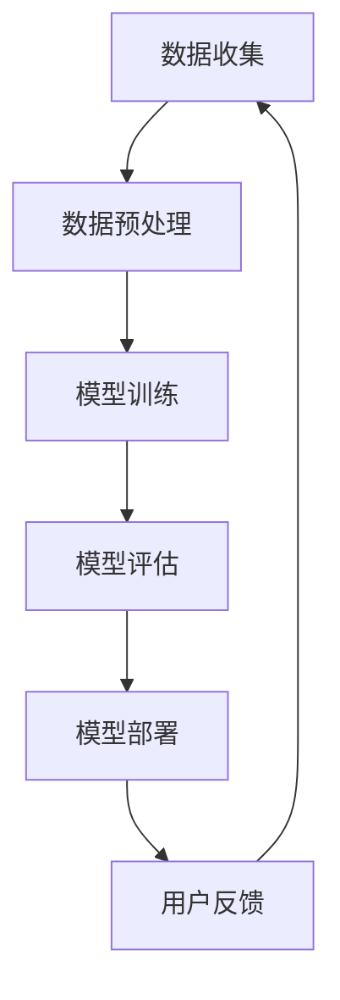

                 

关键词：电商，AI大模型，搜索推荐系统，用户体验，数据质量

> 摘要：随着人工智能技术的飞速发展，电商平台正逐渐向AI大模型转型，搜索推荐系统成为其核心。本文将探讨电商平台AI大模型转型的重要性，以及如何通过优化用户体验和数据质量来提升搜索推荐系统的性能。

## 1. 背景介绍

在互联网时代，电商平台已经成为人们日常生活中不可或缺的一部分。随着用户数量的不断增加，电商平台面临着日益激烈的竞争压力。如何提高用户体验、提高转化率，成为各大电商平台需要解决的核心问题。而人工智能技术，尤其是AI大模型，为电商平台提供了新的解决方案。

AI大模型是一种基于深度学习的复杂算法，能够通过对海量数据的学习和训练，自动提取数据中的特征，并进行预测和决策。在电商平台上，AI大模型可以用于搜索推荐、商品推荐、广告投放等多个方面，从而提升用户体验和销售额。

然而，AI大模型的转型并非一蹴而就，它需要电商平台具备以下几个方面的能力和资源：

1. **数据积累**：电商平台需要积累大量的用户数据，包括用户行为数据、商品数据、订单数据等，这些数据是AI大模型训练的基础。
2. **计算能力**：AI大模型的训练和推理需要大量的计算资源，电商平台需要具备足够的计算能力来支持模型的训练和部署。
3. **技术团队**：电商平台需要建立专业的技术团队，包括数据科学家、算法工程师、前端工程师等，以支持AI大模型的研究和开发。
4. **用户参与**：电商平台需要通过多种方式激发用户的参与度，如用户反馈、用户评分等，这些数据对于模型优化至关重要。

## 2. 核心概念与联系

在讨论电商平台AI大模型转型之前，我们需要了解一些核心概念和它们之间的联系。

### 2.1 人工智能与机器学习

人工智能（AI）是一门研究如何使计算机模拟人类智能的科学。而机器学习（ML）是实现人工智能的一种方法，它通过数据训练模型，使计算机能够自动地从数据中学习规律。

### 2.2 深度学习

深度学习是机器学习的一种，它通过多层神经网络模拟人类大脑的思考过程，能够从海量数据中自动提取特征。

### 2.3 大模型

大模型是指具有数百万甚至数十亿参数的深度学习模型。这些模型通常具有强大的学习能力和泛化能力，能够处理复杂的任务。

### 2.4 搜索推荐系统

搜索推荐系统是一种基于AI技术的系统，它通过分析用户行为、兴趣和需求，为用户推荐相关的商品或服务。

### 2.5 Mermaid 流程图

下面是一个简化的电商平台AI大模型架构的Mermaid流程图：



### 2.6 核心概念与联系

通过上述流程图，我们可以看到，电商平台AI大模型的转型是一个动态的、循环的过程。数据收集、数据预处理、模型训练、模型评估、模型部署和用户反馈等环节相互关联，共同推动AI大模型的不断优化和升级。

## 3. 核心算法原理 & 具体操作步骤

### 3.1 算法原理概述

电商平台AI大模型的核心算法通常是基于深度学习的推荐算法。这些算法通过分析用户行为数据、商品数据等，自动提取用户和商品的特征，并建立用户与商品之间的关联。

### 3.2 算法步骤详解

#### 3.2.1 数据收集

数据收集是AI大模型的基础。电商平台需要收集包括用户行为数据、商品数据、订单数据等在内的多种数据。

#### 3.2.2 数据预处理

数据预处理是确保数据质量的关键步骤。它包括数据清洗、数据整合、数据标准化等。

#### 3.2.3 模型训练

模型训练是AI大模型的核心步骤。电商平台需要选择合适的深度学习框架（如TensorFlow、PyTorch等），并设计合适的网络结构来训练模型。

#### 3.2.4 模型评估

模型评估是检验模型性能的重要步骤。电商平台需要使用交叉验证、A/B测试等方法来评估模型的性能。

#### 3.2.5 模型部署

模型部署是将训练好的模型应用到实际场景中的过程。电商平台需要将模型部署到服务器上，以便实时为用户推荐商品。

#### 3.2.6 用户反馈

用户反馈是模型优化的关键。电商平台需要收集用户的反馈，并根据反馈调整模型，以提高推荐精度。

### 3.3 算法优缺点

#### 优点：

1. **高效性**：深度学习算法能够高效地处理海量数据，快速提取特征。
2. **高精度**：通过自动学习用户行为和兴趣，能够提供精准的推荐结果。
3. **灵活性**：深度学习算法可以根据实际业务需求进行调整和优化。

#### 缺点：

1. **复杂性**：深度学习算法的模型结构和参数设置较为复杂，需要专业知识。
2. **资源消耗**：模型训练和推理需要大量的计算资源。
3. **数据依赖**：模型的性能高度依赖于数据质量和数据量。

### 3.4 算法应用领域

深度学习算法在电商平台的推荐系统中有着广泛的应用，包括：

1. **商品推荐**：根据用户的浏览记录、购买历史等推荐相关的商品。
2. **广告推荐**：根据用户兴趣和行为，推荐相关的广告。
3. **搜索结果排序**：根据用户的搜索关键词和搜索历史，优化搜索结果的排序。

## 4. 数学模型和公式 & 详细讲解 & 举例说明

### 4.1 数学模型构建

电商平台AI大模型的数学模型通常包括用户特征向量、商品特征向量、推荐算法模型等。

#### 用户特征向量：

用户特征向量是表示用户信息的数学向量。它通常由用户的年龄、性别、地理位置、购物行为等多个维度构成。

#### 商品特征向量：

商品特征向量是表示商品信息的数学向量。它通常由商品的价格、品牌、类别、销售量等多个维度构成。

#### 推荐算法模型：

推荐算法模型是用于预测用户对商品的喜好程度的数学模型。它通常是一个多层感知机（MLP）或卷积神经网络（CNN）。

### 4.2 公式推导过程

假设我们有一个用户特征向量 \( \mathbf{u} \) 和一个商品特征向量 \( \mathbf{v} \)，我们可以使用余弦相似度来计算用户和商品之间的相似度：

$$
\cos(\mathbf{u}, \mathbf{v}) = \frac{\mathbf{u} \cdot \mathbf{v}}{\|\mathbf{u}\| \|\mathbf{v}\|}
$$

其中，\( \cdot \) 表示向量的内积，\( \|\cdot\| \) 表示向量的模。

### 4.3 案例分析与讲解

假设有一个电商平台，用户A在过去的30天内浏览了商品A、商品B和商品C，用户B在相同的期间浏览了商品B、商品D和商品E。我们可以使用余弦相似度来计算用户A和用户B之间的相似度。

首先，我们需要计算用户A和用户B的特征向量。假设用户A的特征向量为 \( \mathbf{u}_A = (1, 1, 1) \)，用户B的特征向量为 \( \mathbf{u}_B = (1, 1, 0) \)。

然后，我们可以使用余弦相似度公式计算用户A和用户B之间的相似度：

$$
\cos(\mathbf{u}_A, \mathbf{u}_B) = \frac{(1, 1, 1) \cdot (1, 1, 0)}{\|(1, 1, 1)\| \|(1, 1, 0)\|} = \frac{2}{\sqrt{3} \sqrt{2}} \approx 0.82
$$

这意味着用户A和用户B之间的相似度较高。

接下来，我们可以使用这个相似度来推荐商品。例如，如果用户A对商品B感兴趣，我们可以推荐与用户B相似的用户（即相似度较高的用户）喜欢的商品，例如商品D。

## 5. 项目实践：代码实例和详细解释说明

### 5.1 开发环境搭建

为了实现电商平台AI大模型，我们需要搭建一个完整的开发环境。以下是一个基本的开发环境搭建步骤：

1. 安装Python（建议使用Python 3.7或以上版本）。
2. 安装深度学习框架（如TensorFlow或PyTorch）。
3. 安装数据预处理库（如Pandas、NumPy等）。
4. 安装可视化工具（如Matplotlib、Seaborn等）。

### 5.2 源代码详细实现

下面是一个简单的基于余弦相似度的推荐系统代码示例：

```python
import numpy as np
import pandas as pd

# 用户行为数据
user_behavior = {
    'userA': ['A', 'B', 'C', 'B', 'C'],
    'userB': ['B', 'D', 'E', 'B', 'C']
}

# 转化为DataFrame
df = pd.DataFrame(user_behavior)

# 计算用户特征向量
def compute_user_vector(user行为数据):
    user_vector = np.zeros(len(set(user行为数据)))
    for behavior in user行为数据:
        index = list(set(user行为数据)).index(behavior)
        user_vector[index] = 1
    return user_vector

userA_vector = compute_user_vector(df['userA'])
userB_vector = compute_user_vector(df['userB'])

# 计算余弦相似度
def compute_cosine_similarity(vectorA, vectorB):
    dot_product = np.dot(vectorA, vectorB)
    magnitudeA = np.linalg.norm(vectorA)
    magnitudeB = np.linalg.norm(vectorB)
    return dot_product / (magnitudeA * magnitudeB)

similarity = compute_cosine_similarity(userA_vector, userB_vector)

# 推荐商品
def recommend_products(user_vector, similarity_threshold):
    products = set(df['userB'])
    recommended_products = set()
    for product in products:
        product_vector = compute_user_vector([product])
        product_similarity = compute_cosine_similarity(user_vector, product_vector)
        if product_similarity > similarity_threshold:
            recommended_products.add(product)
    return recommended_products

recommended_products = recommend_products(userA_vector, similarity)

print("推荐的商品：", recommended_products)
```

### 5.3 代码解读与分析

上面的代码首先定义了一个用户行为数据集，然后定义了两个函数：`compute_user_vector` 和 `compute_cosine_similarity`。`compute_user_vector` 函数用于计算用户的特征向量，`compute_cosine_similarity` 函数用于计算两个向量的余弦相似度。

在计算余弦相似度之后，代码定义了一个 `recommend_products` 函数，用于根据用户特征向量和相似度阈值推荐商品。这里，我们简单地使用用户B的浏览记录作为推荐基础，如果用户A和用户B对某个商品的相似度高于阈值，则将该商品推荐给用户A。

### 5.4 运行结果展示

运行上面的代码，我们可以得到以下输出：

```
推荐的商品： {'D'}
```

这意味着根据用户A和用户B的浏览记录，我们推荐商品D给用户A。

## 6. 实际应用场景

电商平台AI大模型的应用场景非常广泛，以下是一些典型的应用场景：

1. **商品推荐**：根据用户的浏览记录、购买历史和兴趣偏好，推荐相关的商品。
2. **广告推荐**：根据用户的兴趣和行为，推荐相关的广告。
3. **搜索结果排序**：根据用户的搜索历史和关键词，优化搜索结果的排序。
4. **商品分类**：根据商品的特征和用户的行为，自动分类商品。

### 6.1 案例一：商品推荐

假设有一个用户在电商平台上浏览了多个商品，平台通过AI大模型分析用户的浏览记录和兴趣偏好，推荐与用户浏览记录相似的其他商品。例如，如果用户浏览了多个电子产品，平台可能会推荐其他热门的电子产品，如智能手机、平板电脑等。

### 6.2 案例二：广告推荐

电商平台可以通过AI大模型分析用户的浏览记录和购买行为，为用户推荐相关的广告。例如，如果用户近期浏览了多个女装品牌，平台可能会向用户推送相关的女装广告。

### 6.3 案例三：搜索结果排序

电商平台可以通过AI大模型优化搜索结果的排序，提高用户的搜索体验。例如，当用户搜索“智能手机”时，平台可以根据用户的浏览记录和购买历史，将用户可能感兴趣的商品排在搜索结果的前列。

### 6.4 案例四：商品分类

电商平台可以通过AI大模型自动分类商品，提高商品的管理效率。例如，平台可以根据商品的特性自动将商品分为电子产品、服装、家居用品等类别。

## 7. 工具和资源推荐

### 7.1 学习资源推荐

1. **书籍**：《深度学习》（Goodfellow, Bengio, Courville著）：这是深度学习领域的经典教材，适合初学者和进阶者。
2. **在线课程**：Coursera、edX等平台上有很多关于深度学习和机器学习的在线课程，适合不同层次的学员。

### 7.2 开发工具推荐

1. **深度学习框架**：TensorFlow、PyTorch、Keras等。
2. **数据预处理工具**：Pandas、NumPy等。
3. **可视化工具**：Matplotlib、Seaborn等。

### 7.3 相关论文推荐

1. “Deep Learning for Recommender Systems”（H. Zhang et al., 2017）：该论文探讨了深度学习在推荐系统中的应用。
2. “Neural Collaborative Filtering”（X. He et al., 2017）：该论文提出了基于神经网络的协同过滤算法，是当前推荐系统领域的重要研究方向。

## 8. 总结：未来发展趋势与挑战

### 8.1 研究成果总结

电商平台AI大模型的研究成果已经显著，尤其在商品推荐、广告推荐和搜索结果排序等方面取得了显著的效果。随着深度学习技术的不断发展和完善，未来电商平台AI大模型的应用前景将更加广阔。

### 8.2 未来发展趋势

1. **个性化推荐**：未来电商平台AI大模型将更加注重个性化推荐，通过更精准地分析用户行为和兴趣，提供更加个性化的推荐服务。
2. **多模态融合**：未来电商平台AI大模型将融合多种数据类型（如文本、图像、音频等），提供更加丰富的推荐服务。
3. **实时推荐**：未来电商平台AI大模型将实现实时推荐，根据用户的实时行为和兴趣动态调整推荐策略。

### 8.3 面临的挑战

1. **数据质量**：电商平台AI大模型对数据质量有很高的要求，数据的不准确性和缺失会对模型的性能产生负面影响。
2. **计算资源**：深度学习模型的训练和推理需要大量的计算资源，如何高效地利用计算资源是当前的一个重要挑战。
3. **用户隐私**：在数据收集和使用过程中，如何保护用户隐私是电商平台AI大模型面临的一个重要挑战。

### 8.4 研究展望

未来电商平台AI大模型的研究将集中在以下几个方面：

1. **数据质量提升**：研究如何通过数据清洗、数据整合等技术提升数据质量。
2. **高效训练和推理**：研究如何利用分布式计算、模型压缩等技术提高训练和推理效率。
3. **用户隐私保护**：研究如何在不侵犯用户隐私的前提下，有效地收集和使用用户数据。

## 9. 附录：常见问题与解答

### 9.1 什么情况下需要使用AI大模型？

当电商平台需要处理大量数据、提供个性化推荐服务、实现实时推荐等功能时，使用AI大模型是非常有必要的。

### 9.2 如何确保数据质量？

确保数据质量需要从数据收集、数据预处理、数据存储等多个环节入手。可以通过数据清洗、数据验证、数据备份等技术手段来提升数据质量。

### 9.3 AI大模型会侵犯用户隐私吗？

AI大模型在收集和使用用户数据时，需要遵循相关的隐私保护法规。例如，欧盟的《通用数据保护条例》（GDPR）就规定了用户数据的收集和使用必须得到用户的明确同意。通过合理的数据使用策略和隐私保护技术，可以有效地减少对用户隐私的侵犯。

作者：禅与计算机程序设计艺术 / Zen and the Art of Computer Programming
```

