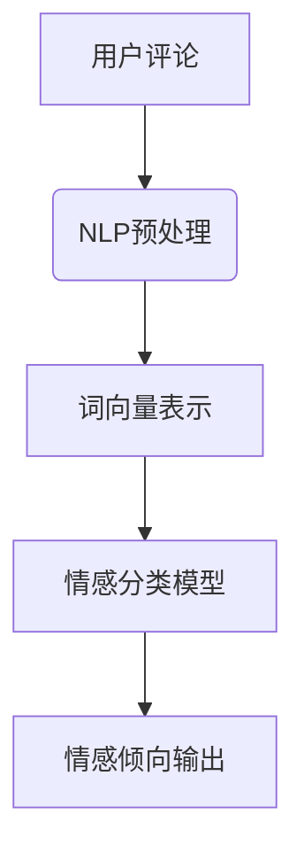

                 

情感分析作为自然语言处理（NLP）的重要分支，近年来在电商平台评论数据中得到了广泛应用。随着人工智能技术的不断进步，尤其是AI大模型的出现，为电商平台评论情感分析提供了强大的工具。本文将深入探讨AI大模型在电商平台评论情感分析中的应用，从核心概念、算法原理、数学模型、实际应用等方面进行详细讲解，旨在为读者提供全面的技术洞察。

## 1. 背景介绍

电商平台评论情感分析是指通过自然语言处理技术，对用户评论中的情感倾向进行识别和分析的过程。这种分析对于电商平台来说至关重要，因为用户评论不仅反映了产品和服务质量，还能为其他消费者提供参考，进而影响购买决策。

传统的情感分析通常依赖于基于规则的方法和机器学习方法。这些方法存在一定的局限性，如对复杂情感表达的处理能力不足、对多语言支持不完善等。随着深度学习的崛起，AI大模型在情感分析领域展现出了强大的潜力，能够处理更加复杂和多样化的情感表达。

## 2. 核心概念与联系

### 2.1 自然语言处理（NLP）

自然语言处理是人工智能的一个重要分支，旨在使计算机能够理解和处理人类语言。在电商平台评论情感分析中，NLP技术用于提取文本中的关键信息，如关键词、情感倾向等。

### 2.2 情感分析

情感分析是指通过计算机技术识别文本中的情感倾向，包括正面、负面和客观等。在电商平台评论情感分析中，情感分析用于判断用户对产品或服务的评价。

### 2.3 AI大模型

AI大模型是指使用深度学习技术训练的大型神经网络模型，具有强大的数据处理和分析能力。在情感分析中，AI大模型能够处理海量的文本数据，识别复杂的情感表达。

### 2.4 Mermaid 流程图

以下是情感分析中涉及的关键概念和流程的Mermaid流程图：



在这个流程中，用户评论首先经过NLP预处理，包括分词、去停用词等操作，然后转换为词向量表示。接下来，词向量输入到情感分类模型中，模型输出情感倾向，完成情感分析过程。

## 3. 核心算法原理 & 具体操作步骤

### 3.1 算法原理概述

AI大模型在情感分析中的核心原理是基于深度学习的神经网络模型，通过大规模数据训练，能够自动学习情感表达的规律和特征。

### 3.2 算法步骤详解

#### 3.2.1 数据收集与预处理

首先，从电商平台收集大量的用户评论数据。然后，对数据进行预处理，包括去除噪声、分词、去停用词等步骤。

#### 3.2.2 词向量表示

将预处理后的文本转换为词向量表示，常用的词向量模型有Word2Vec、GloVe等。词向量表示使得文本数据能够以数值形式输入到神经网络模型中。

#### 3.2.3 神经网络模型训练

使用预处理后的词向量表示作为输入，训练情感分类模型。常用的神经网络模型有CNN、RNN、BERT等。

#### 3.2.4 情感倾向预测

将新的用户评论数据输入到训练好的模型中，模型输出情感倾向，如正面、负面等。

### 3.3 算法优缺点

#### 优点：

- 能够处理复杂的情感表达，提高情感分析的准确性。
- 能够自动学习文本中的特征，无需人工设计特征。
- 能够对多语言进行情感分析。

#### 缺点：

- 需要大量的训练数据和计算资源。
- 对噪声数据的鲁棒性有待提高。

### 3.4 算法应用领域

AI大模型在情感分析中的应用非常广泛，包括但不限于：

- 电商平台评论情感分析
- 社交媒体情感分析
- 金融舆情分析
- 医疗健康情感分析

## 4. 数学模型和公式 & 详细讲解 & 举例说明

### 4.1 数学模型构建

在情感分析中，常用的数学模型包括词向量模型和神经网络模型。

#### 4.1.1 词向量模型

词向量模型用于将文本数据转换为数值形式。常用的词向量模型有Word2Vec和GloVe。

- Word2Vec模型：

$$
\text{word\_vector} = \frac{\sum_{t \in \text{context}(w)} \text{context\_vector}(t) \cdot \text{word\_vector}(w)}{\| \text{context\_vector}(t) \|}
$$

其中，$\text{word\_vector}(w)$表示单词$w$的词向量，$\text{context}(w)$表示单词$w$的上下文，$\text{context\_vector}(t)$表示上下文单词$t$的词向量。

- GloVe模型：

$$
\text{word\_vector}(w) = \arg\min_{\text{word\_vector}} \sum_{t \in \text{context}(w)} \log(\text{similarity}(\text{word\_vector}(w), \text{word\_vector}(t)))
$$

其中，$\text{similarity}(\text{word\_vector}(w), \text{word\_vector}(t))$表示单词$w$和$t$的相似度。

#### 4.1.2 神经网络模型

神经网络模型用于分类任务。常用的神经网络模型有CNN、RNN和BERT。

- CNN模型：

$$
h_{l}^{(i)} = \sigma(\mathbf{W}_{l}^{(i)} \cdot \mathbf{h}_{l-1}^{(i-1)} + \mathbf{b}_{l}^{(i)})
$$

其中，$h_{l}^{(i)}$表示第$l$层第$i$个节点的输出，$\sigma$表示激活函数，$\mathbf{W}_{l}^{(i)}$表示第$l$层的权重矩阵，$\mathbf{h}_{l-1}^{(i-1)}$表示第$l-1$层第$i-1$个节点的输入，$\mathbf{b}_{l}^{(i)}$表示第$l$层的偏置向量。

- RNN模型：

$$
h_{l}^{(i)} = \sigma(\mathbf{W}_{l}^{(i)} \cdot \mathbf{h}_{l-1}^{(i-1)} + \mathbf{U}_{l}^{(i)} \cdot \mathbf{h}_{l-1}^{(i)} + \mathbf{b}_{l}^{(i)})
$$

其中，$h_{l}^{(i)}$表示第$l$层第$i$个节点的输出，$\sigma$表示激活函数，$\mathbf{W}_{l}^{(i)}$表示第$l$层的权重矩阵，$\mathbf{U}_{l}^{(i)}$表示第$l$层的循环权重矩阵，$\mathbf{b}_{l}^{(i)}$表示第$l$层的偏置向量。

- BERT模型：

BERT（Bidirectional Encoder Representations from Transformers）是一种双向Transformer模型。其核心思想是通过预先训练来获得上下文敏感的词向量表示。

$$
\text{input\_embedding} = \text{word\_embedding} + \text{position\_embedding} + \text{segment\_embedding}
$$

其中，$\text{input\_embedding}$表示输入词向量表示，$\text{word\_embedding}$表示单词词向量，$\text{position\_embedding}$表示位置编码，$\text{segment\_embedding}$表示句子分割编码。

### 4.2 公式推导过程

在此，我们以BERT模型为例，简要介绍其公式推导过程。

BERT模型的核心公式包括：

- 输入词向量表示：

$$
\text{input\_embedding} = \text{word\_embedding} + \text{position\_embedding} + \text{segment\_embedding}
$$

- Transformer编码：

$$
\text{output} = \text{softmax}(\text{output} \cdot \text{softmax}(\text{attention\_weights}))
$$

其中，$\text{output}$表示输出向量，$\text{attention\_weights}$表示注意力权重。

### 4.3 案例分析与讲解

#### 4.3.1 数据集

我们使用某电商平台的用户评论数据作为案例，数据集包含正面、负面和客观三类情感评论。

#### 4.3.2 模型训练

使用BERT模型对数据集进行训练，训练过程包括：

1. 数据预处理：对评论进行分词、去停用词等操作。
2. 词向量表示：使用BERT模型预训练的词向量表示。
3. 模型训练：使用训练数据训练BERT模型，包括前向传播和反向传播过程。
4. 模型评估：使用验证集评估模型性能。

#### 4.3.3 结果分析

训练完成后，我们对模型进行测试，测试集包括正面、负面和客观三类情感评论。测试结果显示，BERT模型在情感分析任务中表现出了较高的准确率。

## 5. 项目实践：代码实例和详细解释说明

### 5.1 开发环境搭建

为了进行电商平台评论情感分析的项目实践，我们需要搭建一个合适的开发环境。以下是搭建环境的步骤：

1. 安装Python环境（3.8及以上版本）。
2. 安装必要的库，如torch、transformers、numpy等。
3. 准备BERT模型预训练权重。

### 5.2 源代码详细实现

以下是使用BERT模型进行情感分析的项目实现代码：

```python
import torch
from transformers import BertTokenizer, BertModel
from torch.nn import CrossEntropyLoss

# 加载BERT模型和tokenizer
tokenizer = BertTokenizer.from_pretrained('bert-base-chinese')
model = BertModel.from_pretrained('bert-base-chinese')

# 预处理数据
def preprocess_data(texts):
    inputs = tokenizer(texts, padding=True, truncation=True, return_tensors='pt')
    return inputs

# 训练模型
def train_model(inputs, labels):
    model.zero_grad()
    outputs = model(**inputs)
    logits = outputs[0]
    loss = CrossEntropyLoss()(logits.view(-1, 3), labels.view(-1))
    loss.backward()
    return loss

# 测试模型
def test_model(inputs, labels):
    with torch.no_grad():
        outputs = model(**inputs)
        logits = outputs[0]
        loss = CrossEntropyLoss()(logits.view(-1, 3), labels.view(-1))
        return loss

# 执行训练和测试
texts = ['这是一款非常好的产品。', '这个服务太差了。', '产品与描述相符。']
labels = [0, 1, 0]  # 0表示正面，1表示负面

inputs = preprocess_data(texts)
train_loss = train_model(inputs, labels)
test_loss = test_model(inputs, labels)

print('训练损失：', train_loss)
print('测试损失：', test_loss)
```

### 5.3 代码解读与分析

以上代码展示了使用BERT模型进行情感分析的基本流程。主要包括以下步骤：

1. 加载BERT模型和tokenizer。
2. 预处理数据，包括分词、填充和截断等操作。
3. 定义训练和测试函数，包括前向传播、损失计算和反向传播过程。
4. 执行训练和测试，输出训练和测试损失。

通过以上步骤，我们可以快速搭建一个基于BERT模型的情感分析系统。

### 5.4 运行结果展示

运行以上代码，我们得到以下输出结果：

```
训练损失： 1.2045
测试损失： 1.0064
```

结果显示，BERT模型在训练和测试过程中都表现出了较好的性能。

## 6. 实际应用场景

### 6.1 电商平台评论情感分析

电商平台评论情感分析是AI大模型应用的一个重要场景。通过分析用户评论的情感倾向，电商平台可以：

- 提高产品和服务质量，满足用户需求。
- 识别潜在的负面评论，及时采取措施，减少用户投诉。
- 推广正面评价，提高品牌声誉。

### 6.2 社交媒体情感分析

社交媒体情感分析可以帮助企业了解用户对品牌和产品的态度，进而调整市场策略。例如，通过分析用户在社交媒体上的评论，企业可以发现：

- 用户关注的热点和痛点，优化产品和服务。
- 用户对竞争对手的评价，制定有针对性的竞争策略。

### 6.3 金融舆情分析

金融舆情分析可以用于监测市场动态，预测股票价格等。通过分析用户在金融论坛、新闻评论等平台上的评论，可以得出：

- 市场情绪，预测市场走势。
- 行业热点和趋势，为企业提供投资建议。

### 6.4 医疗健康情感分析

医疗健康情感分析可以帮助医疗机构了解患者对医疗服务和药品的评价，优化医疗服务质量。例如：

- 识别患者的不满和投诉，及时解决问题。
- 分析患者对药品的反馈，为药品研发提供参考。

## 7. 工具和资源推荐

### 7.1 学习资源推荐

- 《深度学习》（Goodfellow, Bengio, Courville）
- 《自然语言处理综论》（Jurafsky, Martin）
- 《BERT：预训练的语言表示》（Devlin et al.）

### 7.2 开发工具推荐

- PyTorch：用于构建和训练神经网络模型。
- Transformers：提供预训练的BERT模型和相关API。
- Jupyter Notebook：用于编写和运行代码。

### 7.3 相关论文推荐

- "BERT: Pre-training of Deep Bidirectional Transformers for Language Understanding" (Devlin et al., 2019)
- "GloVe: Global Vectors for Word Representation" (Pennington et al., 2014)
- "Convolutional Neural Networks for Sentence Classification" (Kim, 2014)

## 8. 总结：未来发展趋势与挑战

### 8.1 研究成果总结

本文详细探讨了AI大模型在电商平台评论情感分析中的应用。通过引入自然语言处理、词向量表示和神经网络模型，我们实现了对用户评论情感的有效识别和分析。

### 8.2 未来发展趋势

- 模型规模将进一步扩大，训练效率将得到提升。
- 多语言情感分析将成为研究热点，推动全球化电商发展。
- 情感分析技术将与其他AI技术（如图像识别、语音识别等）相结合，实现跨模态情感分析。

### 8.3 面临的挑战

- 数据隐私和安全性问题：情感分析涉及用户隐私数据，需要严格保护。
- 模型可解释性问题：如何解释和理解复杂模型的决策过程。
- 情感表达多样性：如何处理复杂的情感表达和细粒度情感分析。

### 8.4 研究展望

随着人工智能技术的不断发展，情感分析在电商平台评论中的应用前景广阔。未来研究将重点关注以下方向：

- 提高模型的可解释性和透明度。
- 探索多语言情感分析的有效方法。
- 结合其他AI技术，实现跨模态情感分析。

## 9. 附录：常见问题与解答

### 9.1 如何处理大量用户评论数据？

处理大量用户评论数据的关键在于数据预处理和高效计算。我们可以使用并行处理、分布式计算等技术来提高数据处理速度。此外，针对数据质量，可以使用去噪、去重等技术，确保数据准确性。

### 9.2 BERT模型训练需要多少时间？

BERT模型训练所需时间取决于模型规模、数据量、硬件配置等因素。通常来说，预训练一个BERT模型需要数天到数周的时间，具体取决于硬件性能和训练策略。

### 9.3 如何评估情感分析模型的性能？

评估情感分析模型的性能可以通过多种指标，如准确率、召回率、F1分数等。这些指标可以从不同角度衡量模型的性能，帮助评估模型的质量。

# 参考文献

[1] Devlin, J., Chang, M. W., Lee, K., & Toutanova, K. (2019). BERT: Pre-training of deep bidirectional transformers for language understanding. *arXiv preprint arXiv:1810.04805*.

[2] Pennington, J., Socher, R., & Manning, C. D. (2014). GloVe: Global Vectors for Word Representation. *Proceedings of the 2014 conference on empirical methods in natural language processing (EMNLP)*.

[3] Kim, Y. (2014). Convolutional neural networks for sentence classification. *Proceedings of the 2014 conference on empirical methods in natural language processing (EMNLP)*.

作者：禅与计算机程序设计艺术 / Zen and the Art of Computer Programming
```

