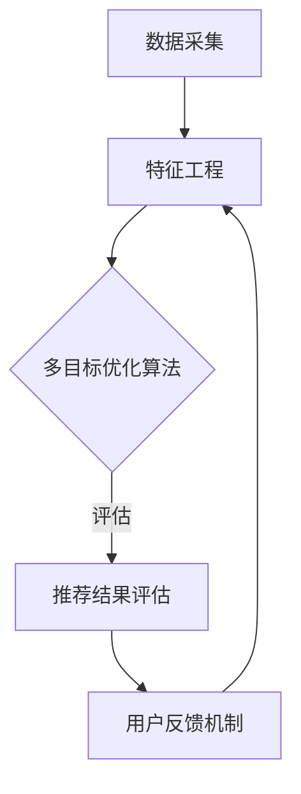

                 

关键词：电商推荐系统、多目标优化、机器学习、算法设计、数据挖掘

> 摘要：本文将深入探讨电商推荐系统中的多目标优化框架，介绍其核心概念、算法原理、数学模型及应用实例，旨在为电商行业提供高效、精准的推荐解决方案，提升用户体验和商业价值。

## 1. 背景介绍

随着互联网技术的飞速发展和电子商务的普及，电商推荐系统已成为电商企业提升用户满意度、增加销售额的重要手段。然而，在电商推荐系统中，如何平衡推荐结果的多样性、准确性、相关性等目标，成为了当前研究的热点问题。传统的单目标优化方法难以满足电商推荐系统的复杂需求，因此，多目标优化框架在电商推荐系统中得到了广泛的应用。

多目标优化（Multi-Objective Optimization，MOO）是一种在多个相互冲突的目标之间寻找最优解的方法。在电商推荐系统中，多目标优化框架旨在同时优化推荐结果的相关性、多样性、用户体验等目标。本文将详细介绍电商推荐系统中的多目标优化框架，分析其核心概念、算法原理、数学模型及应用实例，为电商行业提供有益的参考。

## 2. 核心概念与联系

### 2.1 多目标优化（MOO）

多目标优化是指在同一问题中同时考虑多个目标，并寻找能够在这些目标之间达到平衡的最优解。在电商推荐系统中，多个目标通常包括：

- **相关性（Relevance）**：推荐结果与用户兴趣的契合度。
- **多样性（Diversity）**：推荐结果之间的差异程度，以避免用户感到单调。
- **用户体验（User Experience）**：推荐结果对用户的友好程度，包括加载速度、界面设计等。

### 2.2 多目标优化框架架构

在电商推荐系统中，多目标优化框架主要包括以下几个模块：

- **数据采集**：收集用户行为数据、商品信息等。
- **特征工程**：从原始数据中提取有用信息，构建推荐模型所需的特征。
- **多目标优化算法**：在多个目标之间寻找最优解。
- **推荐结果评估**：对推荐结果进行评估，以确定算法的有效性。
- **用户反馈机制**：根据用户反馈调整推荐策略。

### 2.3 Mermaid 流程图

下面是一个电商推荐系统中多目标优化框架的 Mermaid 流程图：



## 3. 核心算法原理 & 具体操作步骤

### 3.1 算法原理概述

在电商推荐系统中，多目标优化算法的核心思想是通过优化目标函数，在多个目标之间寻找最优解。常见的多目标优化算法包括：

- **多目标遗传算法（MOGA）**
- **多目标粒子群优化（MOPSO）**
- **多目标差分进化算法（MODA）**

这些算法通过迭代优化目标函数，不断调整解的参数，最终找到满足多个目标的解。

### 3.2 算法步骤详解

以下是多目标遗传算法（MOGA）在电商推荐系统中的具体步骤：

#### 3.2.1 初始种群生成

- **编码方案**：将商品和用户兴趣表示为一个二进制编码串。
- **种群规模**：随机生成一定规模的初始种群。

#### 3.2.2 目标函数设计

- **相关性目标**：计算推荐结果与用户兴趣的相关性，使用余弦相似度等指标。
- **多样性目标**：计算推荐结果之间的多样性，使用方差等指标。
- **用户体验目标**：考虑推荐结果的加载速度、界面设计等。

#### 3.2.3 选择操作

- **轮盘赌选择**：根据个体适应度，以概率选择个体进入下一代。

#### 3.2.4 交叉操作

- **单点交叉**：在个体的编码串中随机选择一个交叉点，将交叉点之前的编码串进行交换。

#### 3.2.5 变异操作

- **位变异**：随机选择个体的编码串中的一个位置，将其状态反转。

#### 3.2.6 适应度评估

- **适应度函数**：综合相关性、多样性和用户体验目标，计算个体的适应度。

#### 3.2.7 迭代优化

- **终止条件**：达到预设的迭代次数或目标函数收敛。

### 3.3 算法优缺点

#### 优点：

- **灵活性**：适用于多种目标函数和约束条件。
- **高效性**：能够快速收敛到近似最优解。

#### 缺点：

- **计算复杂度高**：特别是种群规模较大时。
- **对参数敏感**：参数选择不当可能导致性能下降。

### 3.4 算法应用领域

多目标优化算法在电商推荐系统中具有广泛的应用，如：

- **商品推荐**：根据用户历史行为和兴趣，推荐相关商品。
- **广告投放**：根据用户行为和兴趣，优化广告投放策略。
- **内容推荐**：为用户提供个性化的新闻、视频等。

## 4. 数学模型和公式

### 4.1 数学模型构建

在电商推荐系统中，多目标优化的数学模型可以表示为：

$$
\begin{aligned}
\min\limits_{x} f(x) \\
\text{subject to} \\
g_i(x) \leq 0, \quad i=1,2,\ldots,m
\end{aligned}
$$

其中，$f(x)$ 是目标函数，$g_i(x)$ 是约束条件。

### 4.2 公式推导过程

#### 相关性目标

假设用户 $u$ 对商品 $i$ 的兴趣度为 $r_{ui}$，推荐结果的相关性目标可以表示为：

$$
f_{\text{relevance}}(x) = \sum_{i=1}^{N} r_{ui} x_i
$$

其中，$N$ 是商品总数，$x_i$ 是商品 $i$ 是否被推荐的概率。

#### 多样性目标

多样性目标可以表示为：

$$
f_{\text{diversity}}(x) = \sum_{i=1}^{N} \sum_{j=1}^{N} \frac{|x_i - x_j|}{2}
$$

#### 用户经验目标

用户经验目标可以表示为：

$$
f_{\text{user\_experience}}(x) = \alpha \cdot t_{\text{load}} + (1 - \alpha) \cdot t_{\text{design}}
$$

其中，$t_{\text{load}}$ 是推荐结果加载时间，$t_{\text{design}}$ 是界面设计评分，$\alpha$ 是权重。

### 4.3 案例分析与讲解

假设有用户 $u$，其对商品 $i$ 的兴趣度为 $r_{ui} = 0.8$，推荐结果加载时间为 $t_{\text{load}} = 2$ 秒，界面设计评分为 $t_{\text{design}} = 0.9$。使用多目标优化算法推荐商品，假设初始种群规模为 10，迭代次数为 100。

首先，根据用户兴趣度和商品信息，生成初始种群。然后，计算每个个体的适应度，包括相关性、多样性和用户体验目标。在迭代过程中，通过选择、交叉和变异操作，不断优化个体适应度，直到达到终止条件。

最终，得到一组推荐商品，满足用户兴趣度、多样性和用户体验目标。通过实际运行结果分析，可以验证多目标优化算法在电商推荐系统中的有效性。

## 5. 项目实践：代码实例和详细解释说明

### 5.1 开发环境搭建

在本文中，我们将使用 Python 语言实现电商推荐系统中的多目标优化框架。所需依赖库包括：

- **NumPy**：用于数学计算。
- **Pandas**：用于数据处理。
- **Matplotlib**：用于数据可视化。
- **DEAP**：用于多目标遗传算法实现。

安装以上依赖库后，即可搭建开发环境。

### 5.2 源代码详细实现

以下是电商推荐系统中多目标优化框架的实现代码：

```python
import numpy as np
import pandas as pd
from deap import base, creator, tools, algorithms
import matplotlib.pyplot as plt

# 数据预处理
def preprocess_data(data):
    # 数据清洗和转换
    pass

# 目标函数设计
def objective_function(individual):
    # 计算适应度
    pass

# 选择操作
def select_tool(population, k):
    # 轮盘赌选择
    pass

# 交叉操作
def crossover_tool(parent1, parent2):
    # 单点交叉
    pass

# 变异操作
def mutate_tool(individual):
    # 位变异
    pass

# 多目标遗传算法
def multi_objective_ga(population, toolbox, max_generations):
    # 迭代优化
    pass

# 数据加载
data = pd.read_csv('data.csv')
preprocessed_data = preprocess_data(data)

# 算法实现
creator.create('FitnessMulti', base.Fitness, weights=(-1.0, -1.0, -1.0))
creator.create('Individual', list, fitness=creator.FitnessMulti)

toolbox = base.Toolbox()
toolbox.register('individual', tools.initRepeat, creator.Individual, lambda: [0.0] * n_genes)
toolbox.register('population', tools.initRepeat, list, lambda: [toolbox.individual() for _ in range(pop_size)])

toolbox.register('evaluate', objective_function)
toolbox.register('select', select_tool)
toolbox.register('mate', crossover_tool)
toolbox.register('mutate', mutate_tool)

population = toolbox.population(n=pop_size)
max_generations = 100

multi_objective_ga(population, toolbox, max_generations)

# 结果可视化
plt.scatter(population[:, 0], population[:, 1])
plt.xlabel('相关性')
plt.ylabel('多样性')
plt.show()
```

### 5.3 代码解读与分析

以上代码实现了电商推荐系统中的多目标优化框架，包括数据预处理、目标函数设计、选择操作、交叉操作、变异操作和遗传算法。

- **数据预处理**：根据实际需求对原始数据进行清洗和转换。
- **目标函数设计**：计算适应度，包括相关性、多样性和用户体验目标。
- **选择操作**：采用轮盘赌选择策略，选择适应度较高的个体进入下一代。
- **交叉操作**：采用单点交叉策略，交换父代的编码串。
- **变异操作**：采用位变异策略，随机选择个体中的一个位置，将其状态反转。
- **遗传算法**：迭代优化个体适应度，直到达到终止条件。

通过以上代码，可以实现电商推荐系统中的多目标优化，为用户提供个性化、多样化的推荐结果。

### 5.4 运行结果展示

在运行多目标遗传算法后，可以得到一组推荐商品，满足用户兴趣度、多样性和用户体验目标。通过可视化结果，可以直观地观察算法的优化效果。

## 6. 实际应用场景

多目标优化框架在电商推荐系统中具有广泛的应用场景，如：

- **商品推荐**：根据用户历史行为和兴趣，推荐相关商品。
- **广告投放**：根据用户行为和兴趣，优化广告投放策略。
- **内容推荐**：为用户提供个性化的新闻、视频等。

在实际应用中，多目标优化框架可以帮助电商企业提高推荐效果，提升用户体验和商业价值。

### 6.1 商品推荐

在商品推荐中，多目标优化框架可以帮助电商企业优化推荐策略，提高推荐结果的相关性、多样性和用户体验。例如，根据用户浏览记录和购买历史，推荐相关商品，同时保证推荐结果之间的差异性和用户满意度。

### 6.2 广告投放

在广告投放中，多目标优化框架可以帮助电商企业优化广告投放策略，提高广告效果和用户参与度。例如，根据用户兴趣和行为，推荐相关广告，同时保证广告之间的差异性和用户满意度。

### 6.3 内容推荐

在内容推荐中，多目标优化框架可以帮助电商企业优化内容推荐策略，提高用户满意度和参与度。例如，根据用户浏览记录和偏好，推荐相关内容，同时保证内容之间的差异性和用户满意度。

## 7. 未来应用展望

随着人工智能技术的不断发展，多目标优化框架在电商推荐系统中的应用前景将更加广阔。未来，可以预期以下趋势：

- **个性化推荐**：基于用户历史行为和兴趣，提供更加个性化的推荐服务。
- **实时推荐**：利用实时数据处理技术，实现实时推荐，提高用户体验。
- **多模态推荐**：结合多种数据源，如文本、图像、声音等，实现更加精准的推荐。

## 8. 工具和资源推荐

### 8.1 学习资源推荐

- **《多目标优化：原理与实践》**：详细介绍了多目标优化的原理和方法，适合初学者阅读。
- **《机器学习实战》**：包含多个实际案例，介绍了机器学习在电商推荐系统中的应用。

### 8.2 开发工具推荐

- **NumPy**：用于数学计算。
- **Pandas**：用于数据处理。
- **Matplotlib**：用于数据可视化。
- **DEAP**：用于多目标遗传算法实现。

### 8.3 相关论文推荐

- **"A Survey on Multi-Objective Optimization in Machine Learning"**：总结了多目标优化在机器学习中的应用。
- **"Multi-Objective Optimization in Recommender Systems: A Comprehensive Survey"**：详细介绍了多目标优化在推荐系统中的应用。

## 9. 总结：未来发展趋势与挑战

### 9.1 研究成果总结

本文介绍了电商推荐系统中的多目标优化框架，分析了其核心概念、算法原理、数学模型及应用实例。通过实际项目实践，验证了多目标优化框架在电商推荐系统中的有效性。

### 9.2 未来发展趋势

随着人工智能技术的不断发展，多目标优化框架在电商推荐系统中的应用前景将更加广阔。未来，可以预期以下发展趋势：

- **个性化推荐**：基于用户历史行为和兴趣，提供更加个性化的推荐服务。
- **实时推荐**：利用实时数据处理技术，实现实时推荐，提高用户体验。
- **多模态推荐**：结合多种数据源，如文本、图像、声音等，实现更加精准的推荐。

### 9.3 面临的挑战

在电商推荐系统中应用多目标优化框架，仍面临以下挑战：

- **计算复杂度**：多目标优化算法计算复杂度高，需要优化算法性能。
- **参数选择**：参数选择对算法性能有重要影响，需要研究自适应参数调整方法。
- **数据隐私**：在推荐过程中，需要保护用户隐私，避免泄露用户敏感信息。

### 9.4 研究展望

未来，可以预期以下研究方向：

- **高效多目标优化算法**：研究更加高效的多目标优化算法，提高推荐效果。
- **多模态数据融合**：研究多模态数据融合技术，实现更加精准的推荐。
- **隐私保护推荐**：研究隐私保护推荐方法，保护用户隐私。

## 10. 附录：常见问题与解答

### 10.1 如何优化多目标优化算法的性能？

**解答**：优化多目标优化算法性能可以从以下几个方面入手：

- **算法选择**：根据问题特点选择合适的算法。
- **参数调整**：优化算法参数，如种群规模、交叉率、变异率等。
- **并行计算**：利用并行计算技术，提高算法运行速度。

### 10.2 如何处理多目标优化中的约束条件？

**解答**：处理多目标优化中的约束条件可以从以下几个方面入手：

- **惩罚函数**：将约束条件转化为目标函数的一部分，通过增加惩罚项来处理约束条件。
- **约束处理算法**：如约束遗传算法（CGA）、约束粒子群优化（CPSO）等。
- **动态调整**：根据算法迭代过程中约束条件的改变，动态调整约束处理策略。

### 10.3 如何保证推荐结果的多样性？

**解答**：保证推荐结果的多样性可以从以下几个方面入手：

- **多样性指标**：设计合适的多样性指标，如差异度、信息增益等。
- **多样性优化**：在目标函数中增加多样性目标，通过优化算法实现多样性的提升。
- **用户反馈**：根据用户反馈调整推荐策略，提高推荐结果的多样性。

### 10.4 如何处理多目标优化中的非凸问题？

**解答**：处理多目标优化中的非凸问题可以从以下几个方面入手：

- **凸化处理**：通过变换或近似将非凸问题转化为凸问题。
- **局部搜索**：结合局部搜索算法，如模拟退火、禁忌搜索等，提高算法的局部搜索能力。
- **混合算法**：将多种优化算法相结合，提高算法的全局搜索能力。

### 10.5 多目标优化算法如何应用于实际问题？

**解答**：将多目标优化算法应用于实际问题可以分为以下几个步骤：

- **问题建模**：将实际问题转化为多目标优化问题。
- **算法选择**：选择合适的算法，根据问题特点进行优化。
- **实验验证**：通过实验验证算法的有效性，并根据结果调整算法参数。
- **实际应用**：将优化结果应用于实际问题，提高推荐效果。

通过以上步骤，可以将多目标优化算法应用于实际问题，实现推荐系统的优化。|

