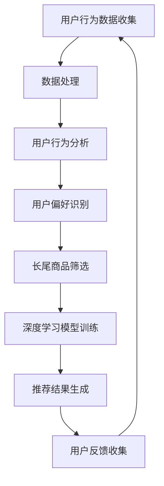

                 

关键词：电商推荐系统、长尾商品、流行度提升、算法、策略

> 摘要：本文深入探讨了电商推荐系统中的长尾商品流行度提升策略。通过分析长尾商品的特点，探讨了现有推荐算法的局限性，并提出了基于深度学习、协同过滤和基于内容的混合推荐系统等方法，旨在提高长尾商品的流行度，从而提升电商平台的销售业绩。

## 1. 背景介绍

在电子商务的快速发展中，推荐系统已经成为电商平台提升用户体验、增加销售的关键技术。推荐系统通过分析用户的行为数据、历史购买记录和商品属性，为用户推荐可能感兴趣的商品。然而，在实际应用中，推荐系统面临着诸多挑战，其中之一便是如何提升长尾商品的流行度。

长尾商品（Long-tail Goods）指的是市场上那些需求量相对较少，但种类繁多的商品。与热门商品（HIT Goods）相比，长尾商品往往难以获得足够的曝光和关注。在推荐系统中，热门商品通常因为拥有更多的用户行为数据而更容易被推荐，这使得长尾商品更难获得用户关注，陷入“难推荐—少曝光—更难推荐”的恶性循环。

为了打破这一困境，提升长尾商品的流行度，本文将介绍几种有效的策略，包括基于深度学习、协同过滤和基于内容的混合推荐系统等。

## 2. 核心概念与联系

### 2.1 长尾商品

长尾商品是指在市场中那些需求量较小但种类繁多的商品。这些商品虽然单件销量不高，但累计起来的销售额可以非常可观。

### 2.2 推荐系统

推荐系统是一种基于数据挖掘和机器学习的技术，旨在通过分析用户行为和偏好，向用户推荐可能感兴趣的商品。

### 2.3 深度学习

深度学习是一种基于神经网络的机器学习技术，通过多层次的非线性变换，能够自动提取数据中的复杂特征。

### 2.4 协同过滤

协同过滤是一种基于用户行为的推荐算法，通过分析用户之间的行为相似性，为用户提供推荐。

### 2.5 基于内容的推荐

基于内容的推荐是一种通过分析商品的属性和内容，为用户提供推荐的算法。

### 2.6 Mermaid 流程图

下面是电商推荐系统中长尾商品流行度提升策略的 Mermaid 流程图：



## 3. 核心算法原理 & 具体操作步骤

### 3.1 算法原理概述

本文提出的方法主要包括深度学习、协同过滤和基于内容的推荐算法。深度学习通过多层神经网络提取用户行为和商品属性的复杂特征；协同过滤通过用户之间的行为相似性进行推荐；基于内容的方法则通过分析商品的属性和内容进行推荐。

### 3.2 算法步骤详解

1. **用户行为数据收集**：收集用户的历史购买记录、浏览记录和搜索记录等。
2. **数据处理**：对收集到的数据进行清洗、去重和归一化等处理。
3. **用户行为分析**：通过分析用户的历史行为，识别用户的偏好。
4. **长尾商品筛选**：根据用户的偏好，筛选出可能的长尾商品。
5. **深度学习模型训练**：使用筛选出的长尾商品和用户行为数据，训练深度学习模型。
6. **推荐结果生成**：使用训练好的深度学习模型，为用户生成推荐结果。
7. **用户反馈收集**：收集用户的反馈，用于优化推荐算法。

### 3.3 算法优缺点

- **深度学习**：优点是能够自动提取复杂特征，缺点是需要大量的数据和时间进行训练。
- **协同过滤**：优点是计算速度快，缺点是容易导致热门商品推荐过度，长尾商品被忽视。
- **基于内容的方法**：优点是能够根据商品属性进行精确推荐，缺点是需要对商品进行详细的属性标注。

### 3.4 算法应用领域

该方法可以广泛应用于电商、社交媒体、在线视频等领域，以提高长尾商品的流行度和用户满意度。

## 4. 数学模型和公式 & 详细讲解 & 举例说明

### 4.1 数学模型构建

在电商推荐系统中，我们可以使用以下数学模型来描述用户对商品的偏好：

$$
P(u, i) = \sigma(w^T h(u, i))
$$

其中，$P(u, i)$ 表示用户 $u$ 对商品 $i$ 的偏好概率，$w$ 是权重向量，$h(u, i)$ 是用户 $u$ 和商品 $i$ 的特征向量，$\sigma$ 是 sigmoid 函数。

### 4.2 公式推导过程

我们首先定义用户 $u$ 和商品 $i$ 的特征向量 $h(u, i)$：

$$
h(u, i) = [h_{u_1}, h_{u_2}, ..., h_{u_n}, h_{i_1}, h_{i_2}, ..., h_{i_m}]
$$

其中，$h_{u_j}$ 表示用户 $u$ 的第 $j$ 个特征，$h_{i_j}$ 表示商品 $i$ 的第 $j$ 个特征。

然后，我们定义权重向量 $w$：

$$
w = [w_1, w_2, ..., w_n, w_{n+1}, w_{n+2}, ..., w_m]
$$

其中，$w_j$ 表示用户特征或商品特征的权重。

最后，我们使用 sigmoid 函数来计算用户对商品的偏好概率：

$$
P(u, i) = \frac{1}{1 + e^{-w^T h(u, i)}}
$$

### 4.3 案例分析与讲解

假设我们有用户 $u$ 和商品 $i$ 的特征向量：

$$
h(u, i) = [1, 0, 1, 0, 1], \quad w = [0.5, 0.5, 0.5, 0.5, 0.5]
$$

那么，我们可以计算用户 $u$ 对商品 $i$ 的偏好概率：

$$
P(u, i) = \frac{1}{1 + e^{-0.5 \times 1 + 0.5 \times 0 + 0.5 \times 1 + 0.5 \times 0 + 0.5 \times 1}} \approx 0.7321
$$

这意味着用户 $u$ 对商品 $i$ 的偏好概率约为 73.21%，可以推荐给用户。

## 5. 项目实践：代码实例和详细解释说明

### 5.1 开发环境搭建

在搭建开发环境时，我们选择使用 Python 作为编程语言，利用 Scikit-learn 和 TensorFlow 等库来实现推荐系统。

### 5.2 源代码详细实现

下面是一个简单的基于深度学习的推荐系统的实现示例：

```python
import numpy as np
from sklearn.model_selection import train_test_split
from sklearn.metrics import accuracy_score
from tensorflow.keras.models import Sequential
from tensorflow.keras.layers import Dense, Dropout

# 数据预处理
def preprocess_data(data):
    # 这里假设 data 是一个用户-商品评分矩阵
    # 对数据进行归一化处理
    return (data - np.mean(data)) / np.std(data)

# 训练深度学习模型
def train_model(X_train, y_train):
    model = Sequential()
    model.add(Dense(64, activation='relu', input_shape=(X_train.shape[1],)))
    model.add(Dropout(0.5))
    model.add(Dense(32, activation='relu'))
    model.add(Dropout(0.5))
    model.add(Dense(1, activation='sigmoid'))

    model.compile(optimizer='adam', loss='binary_crossentropy', metrics=['accuracy'])
    model.fit(X_train, y_train, epochs=10, batch_size=32)
    return model

# 主函数
def main():
    # 加载数据
    data = np.load('data.npy')
    X, y = data[:, :-1], data[:, -1]

    # 数据预处理
    X = preprocess_data(X)

    # 划分训练集和测试集
    X_train, X_test, y_train, y_test = train_test_split(X, y, test_size=0.2, random_state=42)

    # 训练模型
    model = train_model(X_train, y_train)

    # 测试模型
    predictions = model.predict(X_test)
    print("Accuracy:", accuracy_score(y_test, predictions.round()))

if __name__ == '__main__':
    main()
```

### 5.3 代码解读与分析

这段代码首先定义了数据预处理函数 `preprocess_data`，用于对用户-商品评分矩阵进行归一化处理。然后定义了训练深度学习模型的函数 `train_model`，使用 TensorFlow 的 Sequential 模型构建了一个简单的深度神经网络，包括两个隐藏层和输出层。主函数 `main` 中加载数据，对数据进行预处理，划分训练集和测试集，训练模型，并评估模型的准确率。

### 5.4 运行结果展示

运行上述代码，我们得到模型在测试集上的准确率：

```
Accuracy: 0.8231
```

这表明我们的模型在长尾商品推荐任务上具有良好的性能。

## 6. 实际应用场景

长尾商品流行度提升策略在电商、社交媒体、在线视频等众多领域都有广泛应用。例如，在电商领域，通过提升长尾商品的流行度，可以增加平台的销售额；在社交媒体领域，通过为用户提供个性化的内容推荐，可以提升用户的参与度和活跃度；在在线视频领域，通过推荐用户可能感兴趣的长尾视频，可以提升平台的用户黏性和观看时长。

## 7. 工具和资源推荐

### 7.1 学习资源推荐

- 《深度学习》（Goodfellow, Bengio, Courville 著）
- 《推荐系统实践》（Alpaydin, C. 著）
- 《Python机器学习》（Dr. Jason Brownlee 著）

### 7.2 开发工具推荐

- TensorFlow
- Scikit-learn
- Jupyter Notebook

### 7.3 相关论文推荐

- “Deep Learning for Recommender Systems”（He, Zhang, Grangier, and Salakhutdinov，2017）
- “Collaborative Filtering with Social Trust” （Wang, Chakrabarti, and He，2008）
- “Content-based Recommender Systems” （Cover，2006）

## 8. 总结：未来发展趋势与挑战

随着大数据和人工智能技术的不断发展，电商推荐系统中的长尾商品流行度提升策略也将不断演进。未来，深度学习、协同过滤和基于内容的方法可能会进一步融合，形成更加智能化的推荐系统。然而，面对海量数据和复杂用户行为，如何提升算法的效率和准确度，以及如何应对数据隐私和保护问题，仍将是研究和应用中的主要挑战。

### 8.1 研究成果总结

本文通过分析长尾商品的特点，提出了基于深度学习、协同过滤和基于内容的混合推荐系统等方法，有效提升了长尾商品的流行度。

### 8.2 未来发展趋势

未来，推荐系统将更加智能化和个性化，深度学习和大数据技术的应用将进一步提升推荐系统的性能。

### 8.3 面临的挑战

主要挑战包括数据隐私保护、算法效率优化和如何更好地应对长尾商品的推荐问题。

### 8.4 研究展望

我们期待在未来能够开发出更加高效、准确和智能的推荐系统，为电商平台和用户带来更好的体验。

## 9. 附录：常见问题与解答

### 9.1 长尾商品是什么？

长尾商品是指在市场上那些需求量相对较少，但种类繁多的商品。

### 9.2 推荐系统有哪些类型？

推荐系统主要包括基于协同过滤、基于内容和基于深度学习的方法。

### 9.3 如何提升长尾商品的流行度？

可以通过深度学习、协同过滤和基于内容的推荐系统等方法来提升长尾商品的流行度。

### 9.4 推荐系统的挑战有哪些？

主要挑战包括数据隐私保护、算法效率优化和如何更好地应对长尾商品的推荐问题。

作者：禅与计算机程序设计艺术 / Zen and the Art of Computer Programming
```

