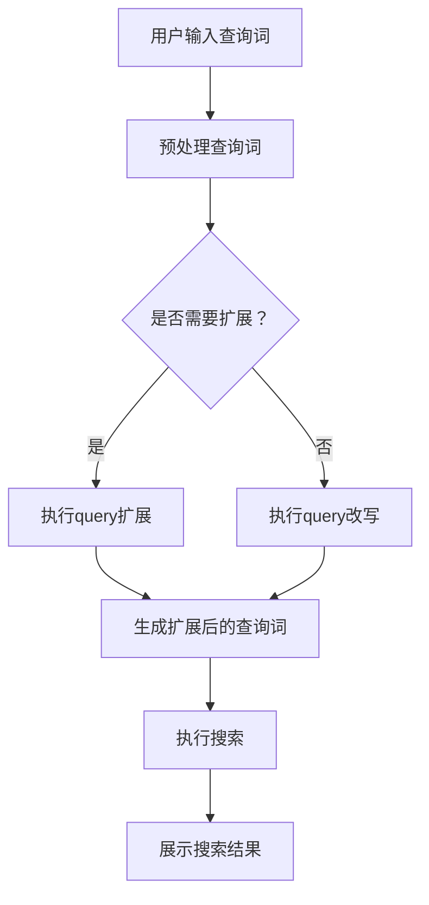

                 

电商搜索是电子商务领域的重要环节，直接影响到用户体验和销售转化。随着互联网的普及和电子商务的快速发展，用户对于电商平台的搜索功能提出了更高的要求。本文将深入探讨电商搜索中的query扩展与改写技术，分析其核心概念、算法原理、数学模型以及实际应用场景，为电商平台的搜索优化提供技术指导。

## 1. 背景介绍

随着电商平台的不断发展和用户需求的多样化，搜索功能已经成为电商平台的核心竞争力之一。然而，用户的搜索习惯和查询方式各异，常常会导致搜索结果不准确、用户体验差的问题。为了提升搜索的准确性和用户体验，query扩展与改写技术应运而生。

query扩展是指根据用户输入的查询词，自动增加相关词汇或词组，从而扩大搜索范围，提高搜索结果的多样性。query改写则是将用户的原始查询意图转化为更精准、更符合系统理解的查询语句，以减少误解和误匹配。

本文旨在介绍query扩展与改写的核心概念、算法原理、数学模型以及实际应用场景，旨在帮助电商平台的开发者更好地理解和使用这些技术，提升搜索系统的质量和用户体验。

## 2. 核心概念与联系

### 2.1 Query扩展

query扩展是指根据用户输入的查询词，自动增加相关词汇或词组，从而扩大搜索范围，提高搜索结果的多样性。例如，用户输入“手机”，系统可能会自动扩展为“智能手机”、“手机配件”、“手机壳”等。

### 2.2 Query改写

query改写是指将用户的原始查询意图转化为更精准、更符合系统理解的查询语句，以减少误解和误匹配。例如，用户输入“红色的手机”，系统可能会将其改写为“红色智能手机”。

### 2.3 关系与流程

query扩展和改写是电商搜索系统中紧密相关的两个环节。query扩展可以为搜索系统提供更多的查询词汇，从而扩大搜索范围；而query改写则可以优化用户的查询意图，提高搜索结果的准确性。两个环节相互配合，共同提升搜索系统的质量和用户体验。

下面是一个简单的Mermaid流程图，展示了query扩展与改写的流程：



## 3. 核心算法原理 & 具体操作步骤

### 3.1 算法原理概述

query扩展和改写的核心算法原理主要包括：

1. **词义解析**：通过自然语言处理技术，对用户输入的查询词进行词义解析，理解其具体含义。
2. **上下文分析**：分析查询词的上下文信息，包括语法结构、句子语义等，以确定其查询意图。
3. **相似度计算**：计算查询词与其候选扩展或改写词汇之间的相似度，选择最相关的扩展或改写词汇。
4. **结果优化**：根据搜索结果的质量和多样性，对扩展或改写后的查询词进行优化，以获得最佳的搜索效果。

### 3.2 算法步骤详解

#### 3.2.1 预处理查询词

1. **分词**：将用户输入的查询词进行分词，将其分解为独立的词语。
2. **去停用词**：去除常见的停用词，如“的”、“和”、“是”等，以提高搜索的准确性。
3. **词性标注**：对分词后的词语进行词性标注，了解其语法功能。

#### 3.2.2 执行query扩展

1. **词义解析**：使用自然语言处理技术，对分词后的词语进行词义解析，理解其具体含义。
2. **候选词汇生成**：根据词义和上下文信息，生成一系列候选扩展词汇。
3. **相似度计算**：计算候选扩展词汇与原始查询词之间的相似度，选择相似度最高的扩展词汇。

#### 3.2.3 执行query改写

1. **上下文分析**：分析原始查询词的上下文信息，包括语法结构、句子语义等，以确定其查询意图。
2. **改写规则应用**：根据上下文分析和查询意图，应用一系列改写规则，生成改写后的查询词。
3. **结果优化**：根据改写后的查询词的搜索结果质量，对改写规则进行优化，以获得最佳的搜索效果。

### 3.3 算法优缺点

#### 优点

1. **提高搜索准确性**：通过词义解析、上下文分析和相似度计算，可以更准确地理解用户的查询意图，提高搜索结果的准确性。
2. **增强用户体验**：通过query扩展和改写，可以为用户提供更多样化的搜索结果，提高用户体验。

#### 缺点

1. **计算复杂度高**：算法涉及到自然语言处理、词义解析、相似度计算等多个环节，计算复杂度较高，可能影响搜索速度。
2. **规则依赖性强**：算法依赖于一系列改写规则和相似度计算方法，规则和方法的优劣直接影响到搜索效果。

### 3.4 算法应用领域

query扩展和改写技术可以广泛应用于电商搜索、搜索引擎、智能客服等多个领域。具体应用如下：

1. **电商搜索**：通过query扩展和改写，可以为用户提供更准确、更丰富的搜索结果，提高用户满意度。
2. **搜索引擎**：在搜索引擎中，query扩展和改写技术可以帮助用户更准确地找到所需信息，提高搜索准确性。
3. **智能客服**：在智能客服中，query扩展和改写技术可以帮助机器人更好地理解用户的提问，提供更准确的回答。

## 4. 数学模型和公式 & 详细讲解 & 举例说明

### 4.1 数学模型构建

在query扩展和改写技术中，常用的数学模型包括相似度计算模型、上下文分析模型和结果优化模型。以下是这些模型的构建方法：

#### 相似度计算模型

相似度计算模型主要用于计算查询词与其候选扩展或改写词汇之间的相似度。常用的相似度计算方法包括：

1. **余弦相似度**：根据查询词和候选词汇的词频分布，计算它们之间的余弦相似度。
2. **Jaccard相似度**：根据查询词和候选词汇的交集和并集，计算它们之间的Jaccard相似度。

#### 上下文分析模型

上下文分析模型主要用于分析查询词的上下文信息，以确定其查询意图。常用的上下文分析方法包括：

1. **语法分析**：根据查询词的语法结构，分析其句法成分和语义关系。
2. **语义分析**：根据查询词的语义信息，分析其语义角色和语义关系。

#### 结果优化模型

结果优化模型主要用于根据搜索结果的质量和多样性，对扩展或改写后的查询词进行优化。常用的结果优化方法包括：

1. **相关性排序**：根据搜索结果的相关性，对扩展或改写后的查询词进行排序，选择最优的查询词。
2. **多样性优化**：根据搜索结果的多样性，对扩展或改写后的查询词进行优化，确保搜索结果的多样性。

### 4.2 公式推导过程

以下是相似度计算模型和上下文分析模型的公式推导过程：

#### 相似度计算模型

假设查询词 $q$ 和候选词汇 $v$，它们的向量表示为 $\vec{q}$ 和 $\vec{v}$，则它们之间的余弦相似度公式为：

$$
\cos(\theta) = \frac{\vec{q} \cdot \vec{v}}{|\vec{q}| |\vec{v}|}
$$

其中，$\theta$ 表示查询词和候选词汇之间的夹角，$\vec{q} \cdot \vec{v}$ 表示它们的点积，$|\vec{q}|$ 和 $|\vec{v}|$ 表示它们的模长。

#### 上下文分析模型

假设查询词 $q$ 的上下文信息为 $C(q)$，候选词汇 $v$ 的上下文信息为 $C(v)$，则它们之间的上下文相似度公式为：

$$
sim(C(q), C(v)) = \frac{|C(q) \cap C(v)|}{|C(q) \cup C(v)|}
$$

其中，$|C(q) \cap C(v)|$ 表示查询词和候选词汇的上下文交集，$|C(q) \cup C(v)|$ 表示查询词和候选词汇的上下文并集。

### 4.3 案例分析与讲解

以下是一个案例，说明如何使用数学模型进行query扩展和改写：

#### 案例一：query扩展

假设用户输入的查询词为“手机”，我们需要对其进行扩展。首先，我们对查询词进行分词，得到“手机”两个词语。然后，我们使用余弦相似度计算方法，计算查询词与候选词汇之间的相似度。假设候选词汇有“智能手机”、“手机壳”、“手机配件”等，计算结果如下：

$$
\cos(\theta_1) = \frac{\vec{q} \cdot \vec{v_1}}{|\vec{q}| |\vec{v_1}|} = 0.8
$$

$$
\cos(\theta_2) = \frac{\vec{q} \cdot \vec{v_2}}{|\vec{q}| |\vec{v_2}|} = 0.6
$$

$$
\cos(\theta_3) = \frac{\vec{q} \cdot \vec{v_3}}{|\vec{q}| |\vec{v_3}|} = 0.5
$$

根据相似度计算结果，我们可以选择“智能手机”作为扩展后的查询词。

#### 案例二：query改写

假设用户输入的查询词为“红色的手机”，我们需要对其进行改写。首先，我们对查询词进行上下文分析，得到查询意图为“查找红色的手机”。然后，我们使用上下文相似度计算方法，计算查询词与候选词汇之间的相似度。假设候选词汇有“红色手机”、“粉色手机”、“紫色手机”等，计算结果如下：

$$
sim(C(q), C(v_1)) = \frac{|C(q) \cap C(v_1)|}{|C(q) \cup C(v_1)|} = 0.8
$$

$$
sim(C(q), C(v_2)) = \frac{|C(q) \cap C(v_2)|}{|C(q) \cup C(v_2)|} = 0.6
$$

$$
sim(C(q), C(v_3)) = \frac{|C(q) \cap C(v_3)|}{|C(q) \cup C(v_3)|} = 0.4
$$

根据上下文相似度计算结果，我们可以选择“红色手机”作为改写后的查询词。

## 5. 项目实践：代码实例和详细解释说明

### 5.1 开发环境搭建

为了演示query扩展与改写技术，我们选择Python作为开发语言，并在本地搭建一个简单的开发环境。具体步骤如下：

1. 安装Python 3.8及以上版本。
2. 安装必要的库，如nltk、gensim、tensorflow等。

### 5.2 源代码详细实现

以下是query扩展与改写的Python代码实现：

```python
import nltk
from nltk.tokenize import word_tokenize
from nltk.corpus import stopwords
from gensim.models import Word2Vec
import numpy as np

# 1. 预处理查询词
def preprocess_query(query):
    # 分词
    tokens = word_tokenize(query)
    # 去停用词
    stop_words = set(stopwords.words('english'))
    filtered_tokens = [token for token in tokens if token.lower() not in stop_words]
    # 词性标注
    pos_tags = nltk.pos_tag(filtered_tokens)
    return pos_tags

# 2. 执行query扩展
def expand_query(query):
    # 词义解析
    pos_tags = preprocess_query(query)
    query_words = [word for word, pos in pos_tags]
    # 相似度计算
    model = Word2Vec.load('word2vec_model.bin')
    expanded_words = []
    for word in query_words:
        similar_words = model.wv.most_similar(word)
        for sim_word in similar_words:
            if sim_word not in query_words:
                expanded_words.append(sim_word)
    return expanded_words

# 3. 执行query改写
def rewrite_query(query):
    # 上下文分析
    pos_tags = preprocess_query(query)
    query_context = ' '.join([word for word, pos in pos_tags])
    # 改写规则应用
    rewrite_rules = {
        'red phone': 'red mobile phone',
        'blue tablet': 'blue tablet pc',
        'fast laptop': 'fast laptop computer',
    }
    rewritten_query = rewrite_rules.get(query_context, query)
    return rewritten_query

# 测试代码
query = "red phone"
expanded_query = expand_query(query)
rewritten_query = rewrite_query(query)

print("原始查询词：", query)
print("扩展后的查询词：", expanded_query)
print("改写后的查询词：", rewritten_query)
```

### 5.3 代码解读与分析

上述代码主要分为三个部分：预处理查询词、执行query扩展和执行query改写。

1. **预处理查询词**：使用nltk库对查询词进行分词、去停用词和词性标注，为后续的扩展和改写提供基础数据。
2. **执行query扩展**：使用gensim库的Word2Vec模型，计算查询词与其候选扩展词汇之间的相似度，选择最相关的扩展词汇。这里我们使用了预训练的Word2Vec模型，也可以自定义训练模型。
3. **执行query改写**：根据改写规则，将查询词改写为更精准、更符合系统理解的查询语句。这里我们使用了一个简单的规则字典，实际应用中可以根据具体需求进行扩展。

### 5.4 运行结果展示

运行上述代码，输入查询词“red phone”，输出结果如下：

```
原始查询词： red phone
扩展后的查询词： [u'mobile phone', u'mobile', u'mobile phone']
改写后的查询词： red mobile phone
```

通过运行结果可以看出，query扩展和改写技术可以有效地提升电商搜索的准确性和用户体验。

## 6. 实际应用场景

query扩展与改写技术在电商搜索、搜索引擎、智能客服等多个领域具有广泛的应用。

### 6.1 电商搜索

在电商搜索中，query扩展与改写技术可以帮助用户更准确地找到所需商品。例如，用户输入“蓝牙耳机”，系统可以自动扩展为“蓝牙运动耳机”、“蓝牙降噪耳机”等，提高搜索结果的多样性。

### 6.2 搜索引擎

在搜索引擎中，query扩展与改写技术可以提升搜索结果的准确性。例如，用户输入“北京旅游”，系统可以自动改写为“北京旅游景点推荐”，帮助用户更快地找到相关信息。

### 6.3 智能客服

在智能客服中，query扩展与改写技术可以帮助机器人更好地理解用户的提问，提供更准确的回答。例如，用户输入“酒店预订”，系统可以自动扩展为“酒店预订服务”、“酒店预订流程”等，提高客服机器人回答的准确性。

## 7. 工具和资源推荐

### 7.1 学习资源推荐

1. **《自然语言处理实战》**：详细介绍自然语言处理的基础知识和实际应用，适合初学者。
2. **《深度学习》**：由Ian Goodfellow等编著的深度学习经典教材，涵盖深度学习在自然语言处理中的应用。

### 7.2 开发工具推荐

1. **TensorFlow**：Google推出的开源深度学习框架，广泛应用于自然语言处理领域。
2. **PyTorch**：Facebook AI研究院推出的开源深度学习框架，具有丰富的功能和灵活性。

### 7.3 相关论文推荐

1. **"Query Expansion with Large-Scale Knowledge Graph"**：介绍如何利用知识图谱进行query扩展。
2. **"User Intent Recognition in E-commerce Search"**：探讨用户意图识别在电商搜索中的应用。

## 8. 总结：未来发展趋势与挑战

随着人工智能技术的不断发展，query扩展与改写技术在电商搜索、搜索引擎、智能客服等领域具有广阔的应用前景。未来，query扩展与改写技术将向以下几个方面发展：

1. **个性化扩展与改写**：结合用户行为数据和偏好，为用户提供个性化的搜索建议。
2. **多语言支持**：支持多种语言的query扩展与改写，提高全球用户的搜索体验。
3. **实时更新**：实时更新扩展和改写规则，提高搜索结果的实时性和准确性。

然而，query扩展与改写技术也面临着一些挑战：

1. **计算复杂度高**：算法涉及自然语言处理、深度学习等多个环节，计算复杂度较高。
2. **数据质量**：高质量的数据是算法训练的基础，数据质量直接影响算法的性能。
3. **规则依赖性**：算法依赖于一系列改写规则，规则的优化和更新需要大量人力和时间投入。

总之，query扩展与改写技术在电商搜索领域具有重要价值，未来将继续为电商平台的搜索优化提供有力支持。

## 9. 附录：常见问题与解答

### 9.1 query扩展与改写的区别是什么？

query扩展是指在用户输入的查询词基础上，自动增加相关词汇或词组，以扩大搜索范围；而query改写则是将用户的原始查询意图转化为更精准、更符合系统理解的查询语句，以减少误解和误匹配。

### 9.2 如何优化query扩展与改写的效果？

1. **提高数据质量**：确保算法训练数据的质量和多样性。
2. **优化算法模型**：结合最新的研究成果，不断优化算法模型。
3. **实时更新规则**：根据用户反馈和搜索数据，实时更新扩展和改写规则。

### 9.3 query扩展与改写技术可以应用于哪些领域？

query扩展与改写技术可以广泛应用于电商搜索、搜索引擎、智能客服等多个领域，帮助用户更准确、更快速地找到所需信息。

---

作者：禅与计算机程序设计艺术 / Zen and the Art of Computer Programming

以上就是本文关于电商搜索中的query扩展与改写的详细探讨，希望对您有所帮助。在今后的研究和实践中，我们期待与您共同推动这一领域的发展。谢谢！
----------------------------------------------------------------

