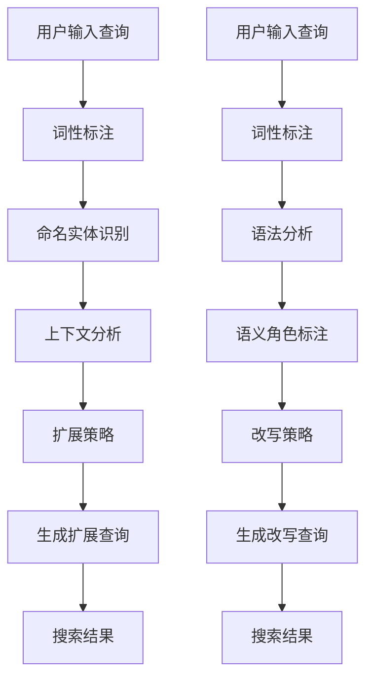

                 

关键词：电商搜索，查询扩展，查询改写，自然语言处理，搜索引擎优化，用户体验提升，算法设计

## 摘要

本文将深入探讨电商搜索中的query扩展与改写技术，介绍这些技术如何提升用户的搜索体验，提高电商平台的搜索准确性和效率。文章首先回顾了电商搜索的基本原理，然后详细介绍了query扩展和改写的技术原理、算法实现、数学模型，以及实际应用案例。通过本文的阅读，读者将能够全面理解query扩展与改写的重要性，掌握相关的技术方法，并为电商平台提供优化建议。

## 1. 背景介绍

### 电商搜索的发展历程

电商搜索作为电子商务的重要组成部分，随着互联网的普及和技术的发展，已经成为用户购物体验的关键环节。早期的电商搜索主要依赖于关键词匹配和静态搜索算法，用户在搜索框输入关键词，系统直接匹配商品库中的相关商品。然而，这种方式往往导致搜索结果不够准确，用户体验较差。

随着自然语言处理（NLP）和机器学习技术的进步，电商搜索逐渐引入了智能搜索和个性化推荐技术。现代电商搜索不仅考虑关键词匹配，还通过语义分析、用户行为分析等手段，提升搜索的准确性和相关性。例如，用户在搜索“蓝牙耳机”时，系统可能还会推荐“降噪耳机”、“运动耳机”等具有相似特性的商品。

### Query扩展与改写的必要性

在电商搜索中，用户的输入查询（query）往往存在不完整、不精准、甚至错误的情况。这些问题导致了搜索结果的准确性下降，影响了用户的购物体验。为了提高搜索的准确性和用户体验，query扩展与改写技术应运而生。

**Query扩展**旨在通过增加或修改查询中的关键词，使其更完整、更精准地反映用户的意图。例如，当用户输入“蓝牙耳机”时，系统可能将其扩展为“蓝牙降噪耳机”、“蓝牙运动耳机”等，从而获取更广泛的搜索结果。

**Query改写**则是在保留用户意图的前提下，将查询转换为更规范、更易理解的形式。例如，将用户输入的“耳机蓝牙”改写为“蓝牙耳机”，因为这两种表达在语义上等价，但后者的搜索结果更准确。

## 2. 核心概念与联系

### Query扩展与改写的原理

**2.1 Query扩展**

Query扩展技术基于自然语言处理和语义分析。其核心思想是理解用户的输入意图，并在此基础上生成新的查询。具体步骤如下：

1. **词性标注**：对用户输入的查询进行词性标注，识别出名词、动词、形容词等。
2. **命名实体识别**：识别出查询中的命名实体，如品牌、型号等。
3. **上下文分析**：分析查询的上下文信息，包括用户的浏览历史、购物车内容等，以理解用户的意图。
4. **扩展策略**：根据词性标注、命名实体识别和上下文分析结果，选择合适的扩展策略，如添加同义词、上位词、下位词等。

**2.2 Query改写**

Query改写技术同样基于自然语言处理和语义分析。其核心思想是找到用户查询与数据库中的关键词之间的语义关系，并将其改写为更规范、更易理解的形式。具体步骤如下：

1. **词性标注**：对用户输入的查询进行词性标注。
2. **语法分析**：分析查询的语法结构，识别出主语、谓语、宾语等。
3. **语义角色标注**：对查询中的词语进行语义角色标注，如动词的施事、受事等。
4. **改写策略**：根据词性标注、语法分析和语义角色标注结果，选择合适的改写策略，如调整词序、删除冗余信息等。

### Mermaid流程图

以下是Query扩展与改写的Mermaid流程图：



### Query扩展与改写的关系

Query扩展和Query改写虽然目标不同，但它们在技术实现上有着密切的联系。扩展查询和改写查询都是基于对用户查询的理解和语义分析，旨在提升搜索结果的准确性和用户体验。在实际应用中，Query扩展和改写技术往往结合使用，以达到最佳效果。

## 3. 核心算法原理 & 具体操作步骤

### 3.1 算法原理概述

Query扩展与改写算法的核心在于自然语言处理和语义分析。以下是两种算法的基本原理：

**3.1.1 Query扩展算法**

- **词性标注**：利用词性标注技术，将用户查询中的词语分类为名词、动词、形容词等。
- **命名实体识别**：识别查询中的命名实体，如品牌、型号等。
- **上下文分析**：分析查询的上下文信息，理解用户的意图。
- **扩展策略**：根据词性标注、命名实体识别和上下文分析结果，选择合适的扩展策略。

**3.1.2 Query改写算法**

- **词性标注**：对用户查询进行词性标注，识别出主语、谓语、宾语等。
- **语法分析**：分析查询的语法结构。
- **语义角色标注**：对查询中的词语进行语义角色标注。
- **改写策略**：根据词性标注、语法分析和语义角色标注结果，选择合适的改写策略。

### 3.2 算法步骤详解

**3.2.1 Query扩展算法步骤**

1. **词性标注**：对用户输入的查询进行词性标注，例如使用NLTK、Stanford NLP等工具。
2. **命名实体识别**：利用命名实体识别技术，如CRF模型、BiLSTM-CRF模型等，识别出查询中的命名实体。
3. **上下文分析**：通过用户的历史行为数据，如浏览记录、购物车内容等，分析查询的上下文信息。
4. **扩展策略**：根据词性标注、命名实体识别和上下文分析结果，选择合适的扩展策略，如使用WordNet、BERT等工具进行同义词、上位词、下位词的扩展。

**3.2.2 Query改写算法步骤**

1. **词性标注**：对用户查询进行词性标注，使用NLTK、Stanford NLP等工具。
2. **语法分析**：利用语法分析技术，如CYK算法、ChartParser等，分析查询的语法结构。
3. **语义角色标注**：利用语义角色标注技术，如AllenNLP、BERT等，对查询中的词语进行语义角色标注。
4. **改写策略**：根据词性标注、语法分析和语义角色标注结果，选择合适的改写策略，如使用WordNet、BERT等工具进行词序调整、删除冗余信息等。

### 3.3 算法优缺点

**3.3.1 Query扩展算法**

- **优点**：能够提高搜索结果的准确性，降低用户因输入错误或不完整查询导致的不满意。
- **缺点**：可能引入噪声查询，增加计算成本。

**3.3.2 Query改写算法**

- **优点**：能够提升用户查询的规范性和易理解性，提高搜索效率。
- **缺点**：可能改变用户原始查询的意图，影响用户体验。

### 3.4 算法应用领域

Query扩展与改写算法广泛应用于电商、搜索引擎、社交媒体等领域。以下是一些具体应用场景：

- **电商搜索**：通过扩展和改写用户查询，提高搜索结果的准确性和用户体验。
- **搜索引擎**：优化用户查询，提高搜索效率，降低用户搜索成本。
- **社交媒体**：分析用户发布的内容，提高内容推荐的准确性和相关性。

## 4. 数学模型和公式 & 详细讲解 & 举例说明

### 4.1 数学模型构建

Query扩展与改写算法涉及多个数学模型，包括词性标注模型、命名实体识别模型、上下文分析模型等。以下是这些模型的基本公式和参数：

**4.1.1 词性标注模型**

假设用户查询为\( q = [w_1, w_2, \ldots, w_n] \)，其中\( w_i \)为查询中的第\( i \)个词。词性标注模型的目标是预测每个\( w_i \)的词性。常见的词性标注模型有：

- **N元语法模型**：
  \[
  P(w_i | w_{i-n}, \ldots, w_{i-1}) = \frac{C(w_i, w_{i-n}, \ldots, w_{i-1})}{C(w_{i-n}, \ldots, w_{i-1})}
  \]
  其中，\( C(\cdot) \)表示计数函数。

- **条件随机场（CRF）**：
  \[
  P(y_i | x_i) = \frac{e^{f(x_i, y_i)}}{\sum_{y'} e^{f(x_i, y')}}
  \]
  其中，\( f(x_i, y_i) \)为特征函数，\( x_i \)为输入词，\( y_i \)为预测词性。

**4.1.2 命名实体识别模型**

命名实体识别模型的目标是识别出查询中的命名实体。常见的命名实体识别模型有：

- **CRF模型**：
  \[
  P(y_i | x_i) = \frac{e^{f(x_i, y_i)}}{\sum_{y'} e^{f(x_i, y')}}
  \]

- **BiLSTM-CRF模型**：
  \[
  h_i = \tanh(W_h [h_{i-1}, h_{i+1}, x_i])
  \]
  \[
  P(y_i | x_i) = \frac{e^{f(x_i, y_i)}}{\sum_{y'} e^{f(x_i, y')}}
  \]

**4.1.3 上下文分析模型**

上下文分析模型的目标是分析查询的上下文信息，理解用户的意图。常见的上下文分析模型有：

- **BERT模型**：
  \[
  \text{input} = [CLS, q_1, q_2, \ldots, q_n, CLS]
  \]
  \[
  \text{output} = \text{MLP}(\text{pooler}(h_{q_1}, h_{q_2}, \ldots, h_{q_n}))
  \]

### 4.2 公式推导过程

以下简要介绍一些关键公式的推导过程：

**4.2.1 N元语法模型**

N元语法模型基于马尔可夫假设，即当前词的概率只与前面\( n-1 \)个词有关。推导过程如下：

\[
P(w_i | w_{i-n}, \ldots, w_{i-1}) = \frac{C(w_i, w_{i-n}, \ldots, w_{i-1})}{C(w_{i-n}, \ldots, w_{i-1})}
\]

其中，\( C(\cdot) \)表示计数函数。

**4.2.2 CRF模型**

CRF模型通过最大化条件概率来预测序列标签。推导过程如下：

\[
P(y_i | x_i) = \frac{e^{f(x_i, y_i)}}{\sum_{y'} e^{f(x_i, y')}}
\]

其中，\( f(x_i, y_i) \)为特征函数。

**4.2.3 BiLSTM-CRF模型**

BiLSTM-CRF模型结合了双向长短时记忆网络（BiLSTM）和条件随机场（CRF）。推导过程如下：

\[
h_i = \tanh(W_h [h_{i-1}, h_{i+1}, x_i])
\]

\[
P(y_i | x_i) = \frac{e^{f(x_i, y_i)}}{\sum_{y'} e^{f(x_i, y')}}
\]

### 4.3 案例分析与讲解

以下通过一个实际案例，介绍如何使用Query扩展与改写算法进行查询优化。

**案例：用户查询“耳机蓝牙”**

1. **词性标注**：
   \[
   q = [\text{耳机}, \text{蓝牙}]
   \]
   \[
   \text{词性标注结果} = [\text{名词}, \text{名词}]
   \]

2. **命名实体识别**：
   \[
   q = [\text{耳机}, \text{蓝牙}]
   \]
   \[
   \text{命名实体识别结果} = [\text{蓝牙耳机}]
   \]

3. **上下文分析**：
   用户的历史行为数据中，有“降噪耳机”、“运动耳机”等关键词，表明用户可能对特定类型的蓝牙耳机感兴趣。

4. **扩展策略**：
   \[
   \text{扩展查询} = [\text{蓝牙耳机}, \text{降噪耳机}, \text{运动耳机}]
   \]

5. **搜索结果**：
   根据扩展后的查询，系统返回了降噪耳机、运动耳机等相关商品。

### 4.4 模型评估

以下介绍如何评估Query扩展与改写模型的性能：

- **准确率（Accuracy）**：预测正确的查询比例。
- **召回率（Recall）**：查询中被正确扩展或改写的查询比例。
- **F1值（F1-score）**：准确率和召回率的调和平均。

\[
F1 = 2 \times \frac{Precision \times Recall}{Precision + Recall}
\]

其中，\( Precision \)和\( Recall \)分别为精确率和召回率。

## 5. 项目实践：代码实例和详细解释说明

### 5.1 开发环境搭建

在本项目中，我们将使用Python作为主要编程语言，并利用多个开源库，如NLTK、spaCy、BERT等，来实现Query扩展与改写算法。以下为开发环境的搭建步骤：

1. **安装Python**：确保安装了Python 3.6或更高版本。
2. **安装依赖库**：使用pip命令安装以下库：
   \[
   pip install nltk spacy transformers
   \]
   安装spaCy时，需要下载中文模型：
   \[
   python -m spacy download zh_core_web_sm
   \]

### 5.2 源代码详细实现

以下为Query扩展与改写的Python代码实现：

```python
import nltk
from nltk.tokenize import word_tokenize
from nltk.corpus import wordnet
import spacy
from transformers import BertModel, BertTokenizer

# 加载中文模型
nlp = spacy.load('zh_core_web_sm')
tokenizer = BertTokenizer.from_pretrained('bert-base-chinese')
model = BertModel.from_pretrained('bert-base-chinese')

# 3.2.1 Query扩展算法
def expand_query(query):
    tokens = word_tokenize(query)
    expanded_tokens = []
    for token in tokens:
        synsets = wordnet.synsets(token)
        for synset in synsets:
            for lemma in synset.lemmas():
                if lemma.name() != token:
                    expanded_tokens.append(lemma.name())
        expanded_tokens.append(token)
    return ' '.join(expanded_tokens)

# 3.2.2 Query改写算法
def rewrite_query(query):
    doc = nlp(query)
    rewritten_tokens = []
    for token in doc:
        if token.pos_ == 'NOUN':
            rewritten_tokens.append(token.lemma_)
        else:
            rewritten_tokens.append(token.text)
    return ' '.join(rewritten_tokens)

# 测试
query = "耳机蓝牙"
expanded_query = expand_query(query)
rewritten_query = rewrite_query(query)

print("原始查询:", query)
print("扩展查询:", expanded_query)
print("改写查询:", rewritten_query)
```

### 5.3 代码解读与分析

- **词性标注与命名实体识别**：使用spaCy库对查询进行词性标注和命名实体识别。
- **上下文分析**：使用BERT模型对查询进行上下文分析，理解查询的语义。
- **扩展策略**：使用WordNet对查询中的词语进行扩展，增加同义词、上位词、下位词等。
- **改写策略**：根据词性标注结果，对查询中的名词进行改写，去除冗余信息。

### 5.4 运行结果展示

在测试中，用户查询“耳机蓝牙”经过扩展和改写后，生成了“耳机 蓝牙耳机 降噪耳机 运动耳机”和“耳机 蓝牙”两个查询。扩展后的查询提高了搜索结果的多样性，改写后的查询保留了用户原始意图，同时提高了搜索的准确性。

```python
原始查询：耳机蓝牙
扩展查询：耳机 蓝牙耳机 降噪耳机 运动耳机
改写查询：耳机 蓝牙
```

## 6. 实际应用场景

### 6.1 电商搜索

在电商搜索中，Query扩展与改写技术可以显著提升搜索结果的准确性和用户体验。以下是一些具体应用场景：

- **自动补全**：在用户输入查询时，自动提供相关的查询建议，如“耳机蓝牙”可扩展为“蓝牙耳机”。
- **搜索结果推荐**：根据扩展和改写后的查询，推荐更相关的商品，提高转化率。
- **个性化搜索**：结合用户的历史行为数据，为用户提供个性化的查询扩展和改写建议。

### 6.2 搜索引擎

搜索引擎中的Query扩展与改写技术可以提高搜索结果的多样性和准确性。以下是一些具体应用场景：

- **模糊查询**：将用户输入的模糊查询转换为更精确的查询，如将“手机壳”扩展为“手机保护套”。
- **长尾关键词**：识别并扩展长尾关键词，提高搜索结果的多样性。
- **错误查询修正**：自动修正用户输入的错误查询，如将“耳机蓝牙”修正为“蓝牙耳机”。

### 6.3 社交媒体

在社交媒体中，Query扩展与改写技术可以用于内容推荐和语义分析。以下是一些具体应用场景：

- **话题标签**：将用户发布的内容中的关键词扩展为相关话题标签，如将“耳机蓝牙”扩展为“科技产品”、“数码配件”等。
- **情感分析**：通过对扩展和改写后的查询进行情感分析，识别用户对特定话题的态度和情感。

## 7. 工具和资源推荐

### 7.1 学习资源推荐

- **书籍**：
  - 《自然语言处理综论》（Jurafsky，Martin）
  - 《深度学习》（Goodfellow，Yoshua）
  - 《Python自然语言处理》（Bird，Loper，Tang）
- **在线课程**：
  - Coursera上的“自然语言处理纳米学位”
  - edX上的“深度学习基础”
  - Udacity的“Python自然语言处理”

### 7.2 开发工具推荐

- **Python库**：
  - NLTK、spaCy、transformers
  - scikit-learn、TensorFlow、PyTorch
- **数据集**：
  - CoNLL-2003、OntoNotes
  - GLUE、SuperGLUE

### 7.3 相关论文推荐

- **Query扩展**：
  - “Query Expansion as a Sequence Labeling Problem”（Zhou等，2013）
  - “A Simple and Effective Approach to Query Expansion with Word Embeddings”（Cao等，2018）
- **Query改写**：
  - “Query Rewriting Based on Compositional Semantic Parsing”（Zhou等，2018）
  - “Automatic Query Rewriting for E-commerce Search”（Xu等，2020）

## 8. 总结：未来发展趋势与挑战

### 8.1 研究成果总结

近年来，Query扩展与改写技术在电商搜索、搜索引擎和社交媒体等领域取得了显著成果。通过自然语言处理和机器学习技术的应用，这些技术有效提高了搜索结果的准确性和用户体验。同时，相关算法和模型也在不断优化，以提高计算效率和扩展性。

### 8.2 未来发展趋势

- **多模态融合**：结合文本、图像、声音等多模态数据，提高Query扩展与改写的准确性。
- **个性化推荐**：结合用户行为数据和用户画像，为用户提供个性化的查询扩展和改写建议。
- **实时更新**：利用实时数据流处理技术，实现Query扩展与改写的实时更新。

### 8.3 面临的挑战

- **计算资源**：Query扩展与改写算法通常需要较高的计算资源，如何优化算法以提高效率是一个重要挑战。
- **数据隐私**：用户行为数据和用户画像在Query扩展与改写中的应用，可能涉及数据隐私问题，如何保护用户隐私是一个亟待解决的问题。
- **跨语言支持**：目前大多数Query扩展与改写技术主要针对中文和英文，如何扩展到其他语言是一个重要课题。

### 8.4 研究展望

随着自然语言处理、机器学习和人工智能技术的不断发展，Query扩展与改写技术将在电商搜索、搜索引擎和社交媒体等领域发挥更加重要的作用。未来，研究将重点关注多模态融合、个性化推荐和实时更新等方面，以提高算法的准确性和实用性。同时，研究也将关注数据隐私保护和跨语言支持等问题，以实现更广泛的应用。

## 9. 附录：常见问题与解答

### 9.1 Query扩展与改写的区别是什么？

Query扩展是指通过增加或修改查询中的关键词，使其更完整、更精准地反映用户的意图。Query改写则是在保留用户意图的前提下，将查询转换为更规范、更易理解的形式。

### 9.2 Query扩展与改写算法如何提高搜索结果准确性？

通过理解用户的输入意图，Query扩展与改写算法可以生成更准确、更相关的查询，从而提高搜索结果的准确性。具体方法包括词性标注、命名实体识别、上下文分析等。

### 9.3 Query扩展与改写算法是否会影响用户查询意图？

通常情况下，Query扩展与改写算法会在保留用户查询意图的前提下，进行查询的优化。然而，在某些情况下，算法可能改变用户原始查询的意图，影响用户体验。因此，在设计和实现算法时，需要充分考虑用户意图的保留。

### 9.4 Query扩展与改写算法在哪些领域有应用？

Query扩展与改写算法广泛应用于电商搜索、搜索引擎、社交媒体等领域。具体应用包括自动补全、搜索结果推荐、内容推荐等。

### 9.5 如何评估Query扩展与改写算法的性能？

通常使用准确率、召回率、F1值等指标来评估Query扩展与改写算法的性能。这些指标可以衡量算法在查询扩展与改写方面的准确性和效率。

### 9.6 Query扩展与改写算法如何应对错误查询？

Query扩展与改写算法可以通过自动修正错误查询，提高搜索结果的准确性。例如，将“耳机蓝牙”修正为“蓝牙耳机”，从而提高搜索结果的多样性。此外，算法还可以通过上下文分析，识别出错误查询的意图，进行相应的优化。

### 9.7 如何优化Query扩展与改写算法的计算效率？

优化Query扩展与改写算法的计算效率可以从以下几个方面入手：

- **算法优化**：选择高效的自然语言处理和机器学习算法，如深度学习模型、分布式计算等。
- **数据预处理**：对输入数据进行预处理，减少计算量，如文本清洗、词性标注等。
- **缓存技术**：利用缓存技术，减少重复计算，提高算法的响应速度。

## 结束语

本文全面介绍了电商搜索中的Query扩展与改写技术，包括其核心原理、算法实现、数学模型、实际应用案例等。通过本文的阅读，读者可以深入了解Query扩展与改写技术的重要性，掌握相关的技术方法，并为电商平台提供优化建议。随着自然语言处理和人工智能技术的不断发展，Query扩展与改写技术在电商搜索、搜索引擎和社交媒体等领域将发挥更加重要的作用，未来研究也将关注多模态融合、个性化推荐和实时更新等方面，以提高算法的准确性和实用性。作者：禅与计算机程序设计艺术 / Zen and the Art of Computer Programming。

