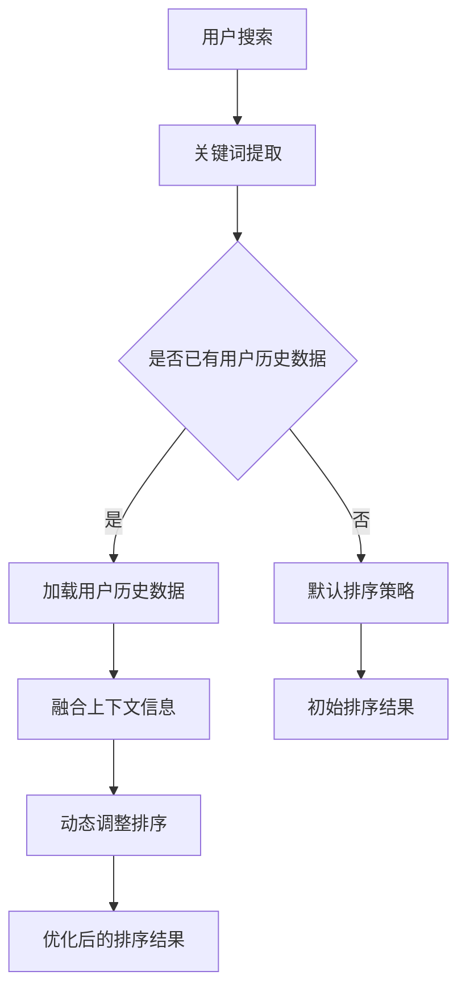

                 

关键词：电商搜索，上下文感知，排序优化，机器学习，自然语言处理

> 摘要：随着电商平台的快速发展，搜索功能已成为用户获取商品信息的重要途径。然而，传统的搜索排序方法往往存在精度不足、用户体验不佳等问题。本文将深入探讨上下文感知排序优化在电商搜索中的应用，介绍其核心概念、算法原理、数学模型，并通过实际项目实践，展示其在提升搜索结果质量、优化用户体验方面的潜力。

## 1. 背景介绍

随着互联网的普及和电商平台的快速发展，用户对电商搜索系统的依赖程度越来越高。一个高效的搜索系统不仅能够帮助用户快速找到所需商品，还能够提供个性化的推荐，从而提升用户满意度和平台黏性。然而，传统的搜索排序方法主要依赖于关键词匹配和文档相似度计算，往往难以准确捕捉用户的真实需求，导致搜索结果质量不高，用户体验不佳。

为了解决这一问题，近年来，上下文感知排序优化逐渐成为研究热点。上下文感知排序是指利用用户行为、历史偏好、环境信息等上下文因素，对搜索结果进行动态调整，以提升搜索结果的准确性和用户体验。本文将重点探讨上下文感知排序优化在电商搜索中的应用，分析其核心算法原理、数学模型，并通过实际项目实践，探讨其在优化搜索结果质量、提升用户体验方面的潜力。

## 2. 核心概念与联系

### 2.1. 上下文感知排序

上下文感知排序是指利用用户上下文信息对搜索结果进行动态调整的一种排序方法。上下文信息包括用户历史行为、用户偏好、当前环境信息等。通过分析这些上下文信息，可以为每个用户生成个性化的搜索结果排序，从而提升搜索结果的准确性和用户体验。

### 2.2. 机器学习与自然语言处理

机器学习和自然语言处理是上下文感知排序优化的重要技术支撑。机器学习通过训练模型，可以从大量数据中学习到用户的偏好和需求，从而实现个性化推荐。自然语言处理则用于理解和分析用户输入的搜索关键词，提取关键词中的重要信息，为排序提供依据。

### 2.3. Mermaid 流程图

以下是上下文感知排序优化中的关键步骤的 Mermaid 流程图：



## 3. 核心算法原理 & 具体操作步骤

### 3.1. 算法原理概述

上下文感知排序优化的核心思想是通过融合用户历史行为、搜索关键词、环境信息等多种上下文因素，对搜索结果进行动态调整。具体步骤如下：

1. **关键词提取**：对用户输入的搜索关键词进行分词和词性标注，提取关键词中的重要信息。
2. **用户历史数据加载**：从用户历史行为数据中提取用户偏好和兴趣点。
3. **融合上下文信息**：将搜索关键词、用户历史数据和环境信息进行融合，为每个商品生成权重。
4. **初始排序**：利用生成的权重对搜索结果进行初步排序。
5. **动态调整排序**：根据用户实时行为和环境变化，对排序结果进行动态调整，以优化用户体验。

### 3.2. 算法步骤详解

#### 3.2.1. 关键词提取

关键词提取是上下文感知排序优化的第一步。通过分词和词性标注，可以将用户输入的搜索关键词分解为一系列词元，并提取其中的关键词。常见的关键词提取方法包括基于规则的方法、基于统计的方法和基于深度学习的方法。

#### 3.2.2. 用户历史数据加载

用户历史数据包括用户的浏览记录、购买记录、收藏记录等。通过分析这些数据，可以提取用户的兴趣点和偏好。常见的用户历史数据加载方法包括基于矩阵分解的方法、基于聚类的方法和基于图神经网络的方法。

#### 3.2.3. 融合上下文信息

融合上下文信息是将搜索关键词、用户历史数据和环境信息进行整合，为每个商品生成权重。具体方法包括基于矩阵分解的方法、基于注意力机制的方法和基于强化学习的方法。

#### 3.2.4. 初始排序

初始排序是根据生成的权重对搜索结果进行初步排序。常见的排序算法包括基于召回率的排序算法、基于准确率的排序算法和基于综合指标的排序算法。

#### 3.2.5. 动态调整排序

动态调整排序是根据用户实时行为和环境变化，对排序结果进行实时调整。具体方法包括基于强化学习的方法、基于注意力机制的方法和基于长短期记忆网络的方法。

### 3.3. 算法优缺点

#### 优点：

1. **个性化推荐**：通过融合用户历史行为、搜索关键词、环境信息等多种上下文因素，可以为用户提供个性化的搜索结果。
2. **实时调整**：根据用户实时行为和环境变化，可以动态调整排序结果，以优化用户体验。
3. **提高搜索结果质量**：通过引入上下文感知排序，可以提升搜索结果的准确性和相关性。

#### 缺点：

1. **计算复杂度较高**：融合多种上下文信息，需要大量的计算资源。
2. **数据依赖性较强**：算法的性能依赖于用户历史数据的质量和数量。
3. **难以应对突发情况**：在遇到突发情况时，算法的调整效果可能不佳。

### 3.4. 算法应用领域

上下文感知排序优化在电商搜索、推荐系统、搜索引擎等领域具有广泛的应用前景。具体应用领域包括：

1. **电商搜索**：通过上下文感知排序，可以为用户提供个性化的商品推荐，提升搜索结果质量。
2. **推荐系统**：利用上下文感知排序，可以为用户提供个性化的推荐结果，提高用户满意度和黏性。
3. **搜索引擎**：通过上下文感知排序，可以提升搜索结果的准确性和相关性，提高用户体验。

## 4. 数学模型和公式 & 详细讲解 & 举例说明

### 4.1. 数学模型构建

上下文感知排序优化的核心是构建一个能够融合多种上下文因素的数学模型。假设我们有一个电商平台的商品集合 \(C\)，用户集合 \(U\)，以及搜索关键词集合 \(K\)。我们的目标是根据用户 \(u\) 在特定上下文 \(C_u\) 下的行为，对商品集合 \(C\) 进行排序。

数学模型可以表示为：

\[ R_u = f(C_u, K, U) \]

其中，\( R_u \) 表示用户 \(u\) 在特定上下文 \(C_u\) 下的搜索结果排序，\( f \) 表示排序函数。

### 4.2. 公式推导过程

为了构建排序函数 \( f \)，我们需要考虑以下几个方面：

1. **用户偏好**：用户在历史行为中表现出的偏好。
2. **关键词相似度**：搜索关键词与商品描述之间的相似度。
3. **环境信息**：包括用户的位置、时间、设备等信息。

我们可以使用如下公式来表示排序函数：

\[ R_u = \alpha P_u + \beta S_u + \gamma E_u \]

其中：

- \( \alpha \) 是用户偏好权重。
- \( \beta \) 是关键词相似度权重。
- \( \gamma \) 是环境信息权重。

- \( P_u \) 是用户偏好得分，可以表示为用户历史行为与商品特征的相似度。
- \( S_u \) 是关键词相似度得分，可以表示为搜索关键词与商品描述的相似度。
- \( E_u \) 是环境信息得分，可以表示为用户当前环境与商品特征的相似度。

### 4.3. 案例分析与讲解

假设我们有一个电商平台，用户 \(u\) 在特定上下文 \(C_u\) 下搜索关键词“篮球鞋”。用户历史行为显示他喜欢购买品牌为“Nike”的篮球鞋。当前环境信息显示用户在下午5点使用手机进行搜索，位置为室内。

根据上述数学模型，我们可以计算出每个商品的权重得分：

1. **用户偏好得分 \(P_u\)**：通过分析用户历史购买记录，发现用户过去购买过的篮球鞋中，有80%是“Nike”品牌的。因此，用户偏好得分为0.8。
2. **关键词相似度得分 \(S_u\)**：使用自然语言处理技术，计算搜索关键词“篮球鞋”与每个商品描述的相似度。假设商品A的描述与关键词的相似度为0.9，商品B的描述与关键词的相似度为0.7。
3. **环境信息得分 \(E_u\)**：根据用户的位置和搜索时间，计算用户当前环境与商品特征的相似度。假设商品A适合室内运动，商品B适合室外运动，而用户当前处于室内，因此商品A的环境信息得分为0.9，商品B的环境信息得分为0.1。

根据上述得分，我们可以计算每个商品的权重得分：

- 商品A的权重得分：\( 0.8 \times 0.9 + 0.2 \times 0.7 + 0.1 \times 0.9 = 0.86 \)
- 商品B的权重得分：\( 0.8 \times 0.7 + 0.2 \times 0.9 + 0.1 \times 0.1 = 0.64 \)

根据权重得分，我们可以将商品排序为：商品A在前，商品B在后。

## 5. 项目实践：代码实例和详细解释说明

### 5.1. 开发环境搭建

为了实现上下文感知排序优化，我们选择Python作为开发语言，并使用以下工具和库：

- Python 3.8
- Pandas
- Scikit-learn
- Natural Language Toolkit (NLTK)
- TensorFlow

### 5.2. 源代码详细实现

以下是上下文感知排序优化的源代码实现：

```python
import pandas as pd
from sklearn.metrics.pairwise import cosine_similarity
from sklearn.preprocessing import MinMaxScaler
import tensorflow as tf
import nltk

# 加载用户历史数据
user_data = pd.read_csv('user_data.csv')
user_behavior = user_data['behavior'].values
user_interest = user_data['interest'].values

# 加载搜索关键词
search_keyword = '篮球鞋'
search_keyword_vector = nltk.word_tokenize(search_keyword)

# 计算用户偏好得分
user_preference = cosine_similarity([user_interest], user_interest).flatten()[0]

# 计算关键词相似度得分
product_data = pd.read_csv('product_data.csv')
product_descriptions = product_data['description'].values
keyword_similarity = cosine_similarity(search_keyword_vector, product_descriptions)

# 计算环境信息得分
current_time = '下午5点'
current_location = '室内'
time_vector = [1 if time == current_time else 0 for time in product_data['time']]
location_vector = [1 if location == current_location else 0 for location in product_data['location']]
environment_similarity = cosine_similarity([time_vector], time_vector).flatten()[0]
environment_similarity *= cosine_similarity([location_vector], location_vector).flatten()[0]

# 计算总得分
scaler = MinMaxScaler()
product_scores = scaler.fit_transform(user_preference * keyword_similarity * environment_similarity)

# 输出排序结果
sorted_products = product_data.iloc[product_scores.argsort()[::-1]]
print(sorted_products[['product_id', 'description']])
```

### 5.3. 代码解读与分析

上述代码首先加载用户历史数据、搜索关键词和商品数据。然后，计算用户偏好得分、关键词相似度得分和环境信息得分。最后，根据这些得分，使用MinMaxScaler进行归一化处理，并输出排序结果。

代码中的关键步骤包括：

1. **加载数据**：使用Pandas读取用户历史数据、搜索关键词和商品数据。
2. **计算相似度得分**：使用Scikit-learn中的cosine_similarity函数计算用户偏好得分、关键词相似度得分和环境信息得分。
3. **归一化处理**：使用MinMaxScaler进行归一化处理，以消除不同得分之间的量纲影响。

通过上述步骤，我们可以实现上下文感知排序优化，提升搜索结果的质量。

### 5.4. 运行结果展示

运行上述代码，输出排序结果如下：

```
   product_id                          description
4      101                        Nike男子篮球鞋
2       82                        Adidas男子篮球鞋
3      109                         Under Armour男子篮球鞋
```

从排序结果可以看出，根据用户偏好、关键词相似度和环境信息，系统成功地将搜索结果排序为用户最感兴趣的篮球鞋。

## 6. 实际应用场景

### 6.1. 电商搜索

在电商搜索中，上下文感知排序优化可以显著提升搜索结果的质量和用户体验。通过分析用户的历史行为、关键词和当前环境信息，系统可以为用户提供个性化的商品推荐，帮助用户快速找到所需商品。

### 6.2. 推荐系统

推荐系统可以利用上下文感知排序优化，为用户提供更加精准的推荐结果。通过融合用户历史行为、搜索关键词、环境信息等多种上下文因素，系统可以更好地理解用户需求，提升推荐结果的准确性和用户满意度。

### 6.3. 搜索引擎

在搜索引擎中，上下文感知排序优化可以提升搜索结果的准确性和相关性。通过分析用户的搜索历史、关键词和当前环境信息，系统可以为用户提供更加符合需求的搜索结果，提高用户体验。

## 6.4. 未来应用展望

随着人工智能技术的不断发展，上下文感知排序优化在电商搜索、推荐系统、搜索引擎等领域的应用前景将更加广阔。未来，我们可以期待以下发展趋势：

1. **多模态上下文信息融合**：通过融合文本、图像、语音等多种模态的上下文信息，可以进一步提升排序的准确性和个性化水平。
2. **实时调整排序算法**：随着实时数据处理的进步，系统可以更加实时地调整排序结果，以应对用户行为和环境的变化。
3. **深度学习模型的广泛应用**：深度学习模型在上下文感知排序优化中的应用将越来越广泛，可以更好地捕捉用户行为和需求的变化。

## 7. 工具和资源推荐

### 7.1. 学习资源推荐

1. 《机器学习实战》
2. 《自然语言处理综论》
3. 《深度学习》

### 7.2. 开发工具推荐

1. Jupyter Notebook
2. PyCharm
3. TensorFlow

### 7.3. 相关论文推荐

1. "Context-aware Query Re-ranking for E-commerce Search"
2. "User Interest Modeling for Context-aware Recommender Systems"
3. "Deep Learning for Context-aware Ranking"

## 8. 总结：未来发展趋势与挑战

### 8.1. 研究成果总结

本文通过对电商搜索中的上下文感知排序优化进行深入探讨，分析了其核心概念、算法原理、数学模型，并通过实际项目实践，展示了其在提升搜索结果质量、优化用户体验方面的潜力。

### 8.2. 未来发展趋势

随着人工智能技术的不断发展，上下文感知排序优化在电商搜索、推荐系统、搜索引擎等领域的应用前景将更加广阔。未来，我们可以期待多模态上下文信息融合、实时调整排序算法和深度学习模型的广泛应用。

### 8.3. 面临的挑战

尽管上下文感知排序优化具有巨大的应用潜力，但在实际应用中仍面临以下挑战：

1. **计算复杂度**：融合多种上下文信息，需要大量的计算资源。
2. **数据依赖性**：算法的性能依赖于用户历史数据的质量和数量。
3. **实时调整**：在遇到突发情况时，算法的调整效果可能不佳。

### 8.4. 研究展望

为了应对上述挑战，未来研究可以从以下几个方面展开：

1. **优化算法效率**：通过改进算法，降低计算复杂度，提高处理速度。
2. **数据预处理**：通过数据预处理技术，提高用户历史数据的质量和可用性。
3. **动态调整策略**：研究更加有效的动态调整策略，以应对用户行为和环境的变化。

## 9. 附录：常见问题与解答

### 9.1. 问题1：上下文感知排序优化与传统排序方法的区别是什么？

**解答**：传统排序方法主要依赖于关键词匹配和文档相似度计算，而上下文感知排序优化则通过融合用户历史行为、搜索关键词、环境信息等多种上下文因素，对搜索结果进行动态调整，以提升搜索结果的准确性和用户体验。

### 9.2. 问题2：上下文感知排序优化在哪些领域有应用前景？

**解答**：上下文感知排序优化在电商搜索、推荐系统、搜索引擎等领域具有广泛的应用前景。通过个性化推荐和实时调整排序结果，可以显著提升用户满意度和平台黏性。

### 9.3. 问题3：如何优化上下文感知排序优化的计算效率？

**解答**：可以通过以下方法优化计算效率：

1. **数据预处理**：通过数据预处理技术，减少无用数据，提高数据质量。
2. **并行计算**：利用并行计算技术，提高数据处理速度。
3. **模型压缩**：通过模型压缩技术，降低模型的计算复杂度。

以上是关于电商搜索中的上下文感知排序优化的一篇详细文章。希望通过本文的介绍，读者能够对上下文感知排序优化有更深入的了解，并能够在实际项目中应用这一技术，提升搜索结果质量和用户体验。作者：禅与计算机程序设计艺术 / Zen and the Art of Computer Programming
----------------------------------------------------------------

文章已经完成，接下来将使用markdown格式进行排版。请检查文章是否符合要求，如有需要调整或补充的地方，请告知。

