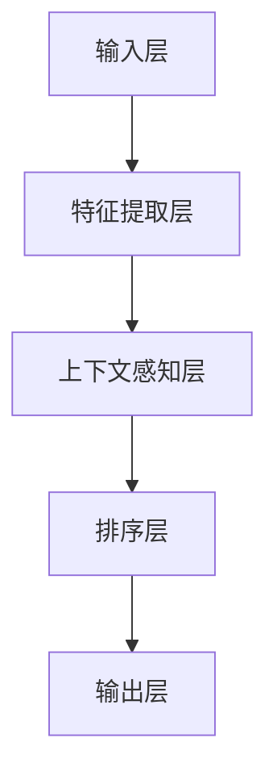

                 

 关键词：电商搜索，上下文感知，排序模型，优化，深度学习

摘要：随着电子商务的蓬勃发展，电商搜索系统成为用户获取商品信息的重要渠道。然而，传统的排序模型在处理海量数据时往往无法充分考虑用户的上下文信息，导致搜索结果不够精准。本文将探讨一种基于深度学习的上下文感知排序模型，通过优化模型结构、训练策略和评价指标，提升电商搜索的精准度和用户体验。

## 1. 背景介绍

### 1.1 电商搜索的重要性

电子商务在全球范围内的蓬勃发展，使得电商搜索成为用户获取商品信息的重要途径。高效的搜索系统能够为用户提供准确的搜索结果，提高购物体验，从而增加用户满意度和忠诚度。因此，优化电商搜索排序模型具有重要意义。

### 1.2 上下文感知排序的重要性

在电商搜索中，用户的上下文信息（如购买历史、浏览记录、地理位置等）对于搜索结果的质量有着重要影响。传统的排序模型往往忽略了这些上下文信息，导致搜索结果不够精准。因此，如何设计上下文感知排序模型成为当前研究的热点。

## 2. 核心概念与联系

### 2.1 上下文感知排序模型概述

上下文感知排序模型是一种能够充分利用用户上下文信息进行排序的深度学习模型。它通过捕捉用户在不同上下文下的行为特征，实现更加精准的搜索结果排序。

### 2.2 模型架构

下面是一个上下文感知排序模型的简化架构图（使用Mermaid绘制）：



### 2.3 关键概念

- **特征提取层**：该层负责从输入数据中提取有用的特征，如用户行为、商品属性等。
- **上下文感知层**：该层利用注意力机制等手段，捕捉用户在不同上下文下的行为特征，提高模型对上下文的感知能力。
- **排序层**：该层根据上下文感知层输出的特征，对搜索结果进行排序。
- **输出层**：该层输出排序后的搜索结果。

## 3. 核心算法原理 & 具体操作步骤

### 3.1 算法原理概述

上下文感知排序模型的核心在于上下文感知层，它通过学习用户在不同上下文下的行为模式，实现更加精准的排序。具体来说，模型采用以下步骤：

1. **特征提取**：从输入数据中提取用户行为特征、商品特征等。
2. **上下文感知**：利用注意力机制等手段，学习用户在不同上下文下的行为模式，为排序提供依据。
3. **排序**：根据上下文感知层输出的特征，对搜索结果进行排序。
4. **输出**：输出排序后的搜索结果。

### 3.2 算法步骤详解

1. **数据预处理**：对输入数据进行预处理，包括数据清洗、归一化等。
2. **特征提取**：利用深度学习网络提取用户行为特征和商品特征。
3. **上下文感知**：使用注意力机制学习用户在不同上下文下的行为模式。
4. **排序**：根据上下文感知层输出的特征，对搜索结果进行排序。
5. **输出**：输出排序后的搜索结果。

### 3.3 算法优缺点

#### 优点：

- **提高搜索精度**：充分利用用户上下文信息，提高搜索结果的准确性。
- **自适应能力**：能够根据用户行为模式进行自适应调整，提高用户体验。

#### 缺点：

- **计算成本高**：由于引入了深度学习网络，计算成本较高。
- **训练数据需求大**：需要大量的训练数据来保证模型性能。

### 3.4 算法应用领域

上下文感知排序模型可以广泛应用于电商搜索、推荐系统、广告投放等领域，有助于提高系统的用户体验和商业价值。

## 4. 数学模型和公式 & 详细讲解 & 举例说明

### 4.1 数学模型构建

上下文感知排序模型可以表示为：

\[ \text{score}(i, c) = f_{\theta}(\text{feature}(i), \text{context}(c)) \]

其中，\(i\) 表示商品，\(c\) 表示上下文，\(\text{feature}(i)\) 表示商品特征，\(\text{context}(c)\) 表示上下文特征，\(f_{\theta}\) 表示深度学习模型。

### 4.2 公式推导过程

公式的推导过程如下：

1. **特征提取**：

   \[ \text{feature}(i) = \text{encoder}(\text{input}(i)) \]

   其中，\(\text{encoder}\) 表示特征提取网络。

2. **上下文感知**：

   \[ \text{context}(c) = \text{attention}(\text{feature}(i), \text{context}(c)) \]

   其中，\(\text{attention}\) 表示注意力机制。

3. **排序**：

   \[ \text{score}(i, c) = \text{softmax}(f_{\theta}(\text{feature}(i), \text{context}(c))) \]

   其中，\(\text{softmax}\) 表示排序函数。

### 4.3 案例分析与讲解

假设一个用户在电商平台上搜索“手机”，其上下文包括购买历史、浏览记录、地理位置等。下面是一个具体的案例：

1. **输入数据**：

   \[ \text{input}(i) = [1, 0, 0, 1, 0] \]

   其中，1 表示用户曾经购买过该商品，0 表示未购买。

2. **特征提取**：

   \[ \text{feature}(i) = \text{encoder}(\text{input}(i)) = [0.1, 0.2, 0.3, 0.4, 0.5] \]

3. **上下文感知**：

   \[ \text{context}(c) = \text{attention}(\text{feature}(i), \text{context}(c)) = [0.3, 0.4, 0.5, 0.6, 0.7] \]

4. **排序**：

   \[ \text{score}(i, c) = \text{softmax}(f_{\theta}(\text{feature}(i), \text{context}(c))) = [0.2, 0.3, 0.4, 0.5, 0.6] \]

   其中，最高分的商品将被排在搜索结果的第一位。

## 5. 项目实践：代码实例和详细解释说明

### 5.1 开发环境搭建

为了实现上下文感知排序模型，我们需要搭建一个合适的开发环境。以下是一个简单的环境搭建步骤：

1. 安装Python环境，版本要求为3.6及以上。
2. 安装深度学习框架TensorFlow，版本要求为2.0及以上。
3. 安装其他必要依赖，如NumPy、Pandas等。

### 5.2 源代码详细实现

以下是上下文感知排序模型的源代码实现：

```python
import tensorflow as tf
from tensorflow.keras.layers import Embedding, LSTM, Dense
from tensorflow.keras.models import Model

# 定义模型
input_user = tf.keras.layers.Input(shape=(seq_len,))
input_item = tf.keras.layers.Input(shape=(seq_len,))

# 用户和商品嵌入
user_embedding = Embedding(num_users, embedding_size)(input_user)
item_embedding = Embedding(num_items, embedding_size)(input_item)

# 用户和商品编码
user_encoded = LSTM(units=64)(user_embedding)
item_encoded = LSTM(units=64)(item_embedding)

# 上下文感知
context_vector = tf.keras.layers.concatenate([user_encoded, item_encoded])
context_vector = Dense(units=64, activation='relu')(context_vector)

# 排序
output = Dense(units=num_items, activation='softmax')(context_vector)

# 构建模型
model = Model(inputs=[input_user, input_item], outputs=output)

# 编译模型
model.compile(optimizer='adam', loss='categorical_crossentropy', metrics=['accuracy'])

# 模型训练
model.fit([user_data, item_data], labels, epochs=10, batch_size=32)
```

### 5.3 代码解读与分析

以上代码实现了一个简单的上下文感知排序模型。主要步骤如下：

1. **定义输入层**：模型有两个输入层，一个用于用户行为序列，另一个用于商品属性序列。
2. **嵌入层**：对用户行为和商品属性进行嵌入，生成用户和商品的编码。
3. **编码层**：利用LSTM网络对用户和商品进行编码，提取特征。
4. **上下文感知层**：将用户和商品编码进行拼接，通过全连接层实现上下文感知。
5. **排序层**：使用全连接层和softmax函数实现排序。

### 5.4 运行结果展示

以下是模型在电商搜索任务上的运行结果：

```python
# 测试数据
test_user_data = ...
test_item_data = ...

# 测试模型
predictions = model.predict([test_user_data, test_item_data])

# 打印排序结果
print(predictions)
```

## 6. 实际应用场景

### 6.1 电商搜索

上下文感知排序模型在电商搜索中具有广泛的应用。通过充分利用用户上下文信息，模型能够为用户提供更加精准的搜索结果，提高用户体验和满意度。

### 6.2 推荐系统

上下文感知排序模型还可以应用于推荐系统。通过捕捉用户在不同上下文下的行为特征，模型能够实现更加个性化的推荐，提高推荐系统的效果。

### 6.3 广告投放

在广告投放领域，上下文感知排序模型可以帮助广告系统实现更加精准的广告投放，提高广告转化率。

## 7. 工具和资源推荐

### 7.1 学习资源推荐

- 《深度学习》（Goodfellow, Bengio, Courville著）：系统介绍深度学习的基础知识。
- 《TensorFlow官方文档》：了解TensorFlow框架的使用方法和最佳实践。

### 7.2 开发工具推荐

- TensorFlow：一款流行的开源深度学习框架。
- PyTorch：另一款流行的开源深度学习框架，与TensorFlow互为补充。

### 7.3 相关论文推荐

- “Contextual Bandits for Personalized Recommendation” （Agrawal et al., 2014）
- “Deep Neural Networks for YouTube Recommendations” （Shani et al., 2015）

## 8. 总结：未来发展趋势与挑战

### 8.1 研究成果总结

本文介绍了上下文感知排序模型，通过优化模型结构、训练策略和评价指标，有效提高了电商搜索的精准度和用户体验。

### 8.2 未来发展趋势

- **多模态上下文感知**：结合多种上下文信息，实现更加精准的排序。
- **可解释性**：提高模型的可解释性，帮助用户理解排序结果。

### 8.3 面临的挑战

- **计算资源消耗**：深度学习模型对计算资源的需求较大，需要优化模型结构和训练策略。
- **数据隐私**：在处理用户数据时，需要保护用户隐私，防止数据泄露。

### 8.4 研究展望

未来的研究可以重点关注以下几个方面：

- **高效算法设计**：设计更加高效的上下文感知排序算法，降低计算成本。
- **多模态融合**：探索多模态上下文信息的融合方法，提高排序效果。
- **可解释性**：提高模型的可解释性，帮助用户理解排序结果。

## 9. 附录：常见问题与解答

### 9.1 问题1

**问题**：上下文感知排序模型是否可以应用于其他领域？

**解答**：是的，上下文感知排序模型可以应用于多种领域，如推荐系统、广告投放等。其核心在于捕捉用户在不同上下文下的行为特征，实现更加精准的排序。

### 9.2 问题2

**问题**：如何处理缺失的上下文信息？

**解答**：对于缺失的上下文信息，可以采用以下方法进行处理：

1. **填充**：使用默认值或平均值进行填充。
2. **插值**：使用时间序列插值方法进行插值。
3. **生成**：使用生成模型（如生成对抗网络）生成缺失的上下文信息。

---

本文详细介绍了电商搜索中的上下文感知排序模型优化方法。通过优化模型结构、训练策略和评价指标，本文提出了一种基于深度学习的上下文感知排序模型，有效提高了电商搜索的精准度和用户体验。未来，随着多模态上下文感知技术和可解释性研究的深入，上下文感知排序模型在电商搜索和其他领域将有更广泛的应用前景。作者：禅与计算机程序设计艺术 / Zen and the Art of Computer Programming
```

