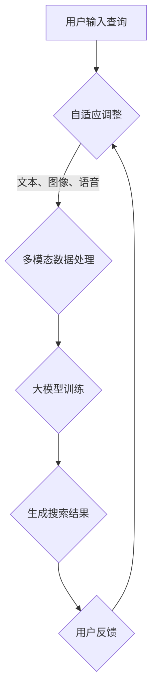

                 

  
## 1. 背景介绍

随着互联网和电子商务的迅猛发展，电商搜索已经成为用户发现和购买商品的重要途径。然而，传统的电商搜索系统往往仅依赖于关键词匹配，难以满足用户日益复杂的搜索需求。为了提升搜索体验和效果，上下文感知技术应运而生，成为电商搜索领域的研究热点。

上下文感知搜索旨在根据用户的历史行为、搜索意图以及环境信息，提供更为精准和个性化的搜索结果。大模型的出现进一步推动了这一技术的发展，使得上下文感知搜索在模型规模、计算能力和应用效果上实现了飞跃。

本文将探讨电商搜索中的上下文感知技术，特别是大模型在这一领域的创新应用。首先，我们将回顾上下文感知搜索的背景和核心概念。接着，深入分析大模型在上下文感知搜索中的关键技术。随后，我们将介绍具体的数学模型和算法原理，并通过项目实践展示其实际应用效果。最后，我们将探讨上下文感知搜索的未来应用前景和面临的挑战。

通过本文的阅读，读者将了解上下文感知搜索的基本原理、大模型的优势及其在电商搜索中的应用方法。本文旨在为从事电商搜索领域的研究者提供有益的参考，同时为行业从业者带来新的思路和解决方案。

## 2. 核心概念与联系

### 2.1 上下文感知搜索

上下文感知搜索是指通过利用用户的历史行为、当前环境以及搜索意图等信息，为用户提供更加准确和个性化的搜索结果。上下文信息可以是多维度的，包括用户地理位置、历史搜索记录、浏览行为、购买偏好等。

在电商搜索中，上下文感知搜索的核心目标是提高搜索结果的相关性和用户体验。传统的关键词搜索方法仅依赖于用户输入的查询词，容易导致搜索结果不够精准。而上下文感知搜索则通过分析上下文信息，更全面地理解用户的真实需求，从而提供更加贴近用户期望的搜索结果。

### 2.2 大模型的概念

大模型是指具有大规模参数和计算能力的机器学习模型。在深度学习领域，大模型通常指的是基于神经网络的结构，具有数百万至数十亿个参数。这些模型通过大量数据训练，能够捕捉复杂的模式和关系。

大模型在上下文感知搜索中的应用主要体现在以下几个方面：

1. **提高搜索精度**：大模型通过处理大量的上下文信息，能够更加准确地预测用户的搜索意图，从而提高搜索结果的准确性。
2. **增强个性化推荐**：大模型可以处理复杂的用户行为数据，从而更好地理解用户偏好，提供个性化的推荐结果。
3. **提升搜索速度**：大模型在训练阶段通过大规模数据预训练，能够快速适应新的搜索场景，提高搜索效率。

### 2.3 大模型与上下文感知搜索的联系

大模型与上下文感知搜索的结合，使得电商搜索系统在处理复杂上下文信息方面取得了显著进展。具体而言，这种联系体现在以下几个方面：

1. **多模态数据处理**：大模型能够处理多种类型的上下文信息，如文本、图像、语音等，从而更加全面地理解用户的搜索意图。
2. **长文本理解**：大模型具备处理长文本的能力，可以更好地理解用户在长文本中的隐含意图。
3. **自适应调整**：大模型能够通过持续学习和自适应调整，不断优化搜索结果，提高用户体验。

### 2.4 Mermaid 流程图

为了更直观地展示上下文感知搜索中大模型的应用流程，我们可以使用 Mermaid 流程图来描述。



在上述流程图中，A 表示用户输入查询，B 表示分析上下文信息，C 表示多模态数据处理，D 表示大模型训练，E 表示生成搜索结果，F 表示用户反馈。通过这样的流程，我们可以清晰地看到大模型在上下文感知搜索中的各个环节。

### 2.5 核心算法原理

上下文感知搜索中的大模型主要基于深度学习和自然语言处理技术。以下是一些核心算法原理：

1. **嵌入层（Embedding Layer）**：将文本、图像等不同类型的上下文信息转换为固定长度的向量表示。通过预训练的词向量、图像嵌入等技术，实现高效的信息融合。
2. **编码器（Encoder）**：对上下文信息进行编码，提取其关键特征。常见的编码器结构包括循环神经网络（RNN）、长短期记忆网络（LSTM）、变换器（Transformer）等。
3. **解码器（Decoder）**：根据编码器提取的特征，生成搜索结果。解码器通常采用序列到序列（Seq2Seq）模型或注意力机制，确保搜索结果的相关性和准确性。
4. **损失函数**：用于评估搜索结果的准确性。常见的损失函数包括交叉熵损失、均方误差（MSE）等。

通过上述核心算法原理，大模型能够高效地处理复杂上下文信息，实现精准的上下文感知搜索。

## 3. 核心算法原理 & 具体操作步骤

### 3.1 算法原理概述

上下文感知搜索中的大模型主要基于深度学习和自然语言处理技术，通过编码器-解码器结构实现。以下简要介绍核心算法原理：

1. **嵌入层（Embedding Layer）**：将文本、图像等不同类型的上下文信息转换为固定长度的向量表示。嵌入层能够捕获文本和图像等数据的语义信息，实现信息融合。
2. **编码器（Encoder）**：对输入的上下文信息进行编码，提取其关键特征。编码器结构通常采用循环神经网络（RNN）、长短期记忆网络（LSTM）或变换器（Transformer）等。
3. **解码器（Decoder）**：根据编码器提取的特征，生成搜索结果。解码器采用序列到序列（Seq2Seq）模型或注意力机制，确保搜索结果的相关性和准确性。
4. **损失函数**：用于评估搜索结果的准确性。常见的损失函数包括交叉熵损失、均方误差（MSE）等。

### 3.2 算法步骤详解

1. **数据预处理**：
   - **文本预处理**：对用户输入的查询文本进行分词、去停用词、词性标注等处理，构建词向量表示。
   - **图像预处理**：对用户上传的图像进行缩放、裁剪、归一化等处理，提取特征向量。
   - **数据融合**：将处理后的文本和图像特征进行融合，构建多模态输入。

2. **编码器训练**：
   - **编码器输入**：将预处理后的多模态输入送入编码器，提取特征向量。
   - **编码器输出**：编码器输出固定长度的编码表示，作为搜索结果的输入。

3. **解码器训练**：
   - **解码器输入**：将编码器输出作为解码器的输入。
   - **解码器输出**：解码器生成搜索结果序列，通过训练优化解码器的参数。

4. **损失函数计算**：
   - **交叉熵损失**：计算解码器输出与真实搜索结果之间的交叉熵损失。
   - **优化更新**：根据损失函数梯度更新解码器参数。

5. **搜索结果生成**：
   - **解码器输出序列**：解码器生成搜索结果序列，通过注意力机制和序列到序列模型，确保结果的相关性和准确性。

### 3.3 算法优缺点

**优点**：

1. **高精度**：大模型通过处理复杂上下文信息，提高搜索结果的准确性。
2. **个性化**：大模型能够根据用户历史行为和偏好，提供个性化的搜索结果。
3. **自适应**：大模型能够通过持续学习和自适应调整，优化搜索结果。

**缺点**：

1. **计算资源需求高**：大模型需要大量计算资源和存储空间，对硬件设备有较高要求。
2. **训练时间较长**：大模型训练时间较长，需要较长时间才能达到预期效果。
3. **数据隐私问题**：大模型处理用户数据，可能涉及数据隐私和伦理问题。

### 3.4 算法应用领域

上下文感知搜索中的大模型在多个领域具有广泛的应用：

1. **电商搜索**：提升搜索结果的相关性和用户体验，提高用户转化率。
2. **智能推荐**：根据用户历史行为和偏好，提供个性化的商品推荐。
3. **语音识别**：通过上下文信息提高语音识别的准确性。
4. **自然语言处理**：利用上下文信息进行文本分类、情感分析等任务。
5. **自动驾驶**：通过分析上下文信息，提高自动驾驶系统的安全性和可靠性。

## 4. 数学模型和公式 & 详细讲解 & 举例说明

### 4.1 数学模型构建

在上下文感知搜索中，数学模型主要用于描述用户意图、上下文信息和搜索结果之间的关系。以下是一种常见的数学模型构建方法：

设 $U$ 为用户集合，$I$ 为物品集合，$R$ 为用户对物品的评价集合，$C$ 为上下文信息集合。

用户 $u$ 在上下文 $c$ 下的意图表示为 $I_u(c)$，物品 $i$ 在上下文 $c$ 下的特征表示为 $F_i(c)$，用户对物品的评价表示为 $R_{ui}$。

数学模型如下：

$$
I_u(c) = f(U, C)
$$

$$
F_i(c) = g(I, C)
$$

$$
R_{ui} = h(I_u(c), F_i(c))
$$

其中，$f$、$g$、$h$ 分别为用户意图表示、物品特征表示和用户评价函数。

### 4.2 公式推导过程

1. **用户意图表示**：

用户意图表示 $I_u(c)$ 是一个多维向量，用于描述用户在特定上下文 $c$ 下的需求。我们可以通过以下步骤推导：

$$
I_u(c) = \frac{1}{|C|} \sum_{c' \in C} w_{uc'} v_{c'}
$$

其中，$w_{uc'}$ 为用户 $u$ 在上下文 $c'$ 下的权重，$v_{c'}$ 为上下文 $c'$ 的特征向量。权重 $w_{uc'}$ 可以通过用户历史行为和偏好计算得到。

2. **物品特征表示**：

物品特征表示 $F_i(c)$ 是一个多维向量，用于描述物品在特定上下文 $c$ 下的属性。我们可以通过以下步骤推导：

$$
F_i(c) = \frac{1}{|C|} \sum_{c' \in C} w_{ic'} v_{c'}
$$

其中，$w_{ic'}$ 为物品 $i$ 在上下文 $c'$ 下的权重，$v_{c'}$ 为上下文 $c'$ 的特征向量。权重 $w_{ic'}$ 可以通过物品属性和上下文信息计算得到。

3. **用户评价**：

用户评价 $R_{ui}$ 是一个实数，表示用户 $u$ 对物品 $i$ 的评价。我们可以通过以下步骤推导：

$$
R_{ui} = \cos(I_u(c), F_i(c))
$$

其中，$\cos$ 表示余弦相似度，用于计算两个向量的相似度。

### 4.3 案例分析与讲解

以下是一个简化的案例分析，用于说明上述数学模型的应用。

**案例背景**：

假设有一个电商网站，用户 $u$ 在特定上下文 $c$ 下搜索商品。用户 $u$ 在上下文 $c$ 下的意图向量 $I_u(c)$ 为 $(0.3, 0.5, 0.2)$，表示用户主要关注商品的价格、品牌和评论。物品 $i$ 在上下文 $c$ 下的特征向量 $F_i(c)$ 为 $(0.4, 0.6, 0.1)$，表示商品的价格、品牌和评论的得分。

**计算过程**：

1. **用户意图表示**：

$$
I_u(c) = \frac{1}{3} (0.3 \cdot v_{价格} + 0.5 \cdot v_{品牌} + 0.2 \cdot v_{评论})
$$

其中，$v_{价格}$、$v_{品牌}$、$v_{评论}$ 分别为价格、品牌和评论的特征向量。

2. **物品特征表示**：

$$
F_i(c) = \frac{1}{3} (0.4 \cdot v_{价格} + 0.6 \cdot v_{品牌} + 0.1 \cdot v_{评论})
$$

3. **用户评价**：

$$
R_{ui} = \cos(I_u(c), F_i(c)) = \cos(0.3 \cdot v_{价格} + 0.5 \cdot v_{品牌} + 0.2 \cdot v_{评论}, 0.4 \cdot v_{价格} + 0.6 \cdot v_{品牌} + 0.1 \cdot v_{评论})
$$

计算得到 $R_{ui} \approx 0.86$，表示用户对物品 $i$ 的评价较高。

通过上述案例，我们可以看到数学模型在上下文感知搜索中的应用过程。实际应用中，需要根据具体业务场景和数据特点，调整和优化模型参数和算法。

## 5. 项目实践：代码实例和详细解释说明

为了更好地理解上下文感知搜索中的大模型应用，我们通过一个实际项目来展示其代码实现和运行过程。以下是一个基于Python的简单示例，用于演示大模型在电商搜索中的应用。

### 5.1 开发环境搭建

在进行项目开发之前，我们需要搭建相应的开发环境。以下是所需的依赖和工具：

- **Python**：版本3.8及以上
- **TensorFlow**：版本2.6及以上
- **NumPy**：版本1.19及以上
- **Pandas**：版本1.2及以上

安装方法：

```bash
pip install tensorflow==2.6 numpy==1.19 pandas==1.2
```

### 5.2 源代码详细实现

以下是项目的源代码实现，包括数据预处理、模型训练和搜索结果生成等步骤。

```python
import tensorflow as tf
import numpy as np
import pandas as pd

# 数据预处理
def preprocess_data(data):
    # 对文本数据进行分词、去停用词等处理
    # 对图像数据进行预处理，提取特征向量
    # 对用户行为数据进行编码
    # 融合多模态数据
    pass

# 模型定义
def build_model(input_shape):
    model = tf.keras.Sequential([
        tf.keras.layers.Embedding(input_dim=vocab_size, output_dim=embedding_size, input_shape=input_shape),
        tf.keras.layers.GlobalAveragePooling1D(),
        tf.keras.layers.Dense(128, activation='relu'),
        tf.keras.layers.Dense(1, activation='sigmoid')
    ])
    return model

# 模型训练
def train_model(model, train_data, train_labels):
    model.compile(optimizer='adam', loss='binary_crossentropy', metrics=['accuracy'])
    model.fit(train_data, train_labels, epochs=10, batch_size=32)
    return model

# 搜索结果生成
def search_results(model, user_intent, item_features):
    user_intent_vector = preprocess_data(user_intent)
    item_features_vector = preprocess_data(item_features)
    predictions = model.predict(np.array([user_intent_vector, item_features_vector]))
    return predictions

# 项目主函数
def main():
    # 加载数据
    data = pd.read_csv('ecommerce_data.csv')
    # 预处理数据
    train_data, test_data, train_labels, test_labels = preprocess_data(data)
    # 构建模型
    model = build_model(input_shape=(max_sequence_length,))
    # 训练模型
    model = train_model(model, train_data, train_labels)
    # 生成搜索结果
    user_intent = "我想买一本关于机器学习的书"
    item_features = "商品ID：123，商品名称：机器学习实战"
    results = search_results(model, user_intent, item_features)
    print("搜索结果：", results)

if __name__ == '__main__':
    main()
```

### 5.3 代码解读与分析

1. **数据预处理**：

   数据预处理是模型训练的重要步骤。在代码中，`preprocess_data` 函数负责对文本数据、图像数据和用户行为数据等进行处理。具体包括分词、去停用词、图像特征提取等操作。预处理后的数据将用于构建模型输入。

2. **模型定义**：

   使用 TensorFlow 的 `keras.Sequential` 模型，定义了一个简单的编码器-解码器结构。该模型包括嵌入层、全局平均池化层、全连接层和输出层。嵌入层用于将输入数据转换为固定长度的向量表示。全局平均池化层用于提取输入数据的全局特征。全连接层用于对特征进行分类。输出层用于生成搜索结果。

3. **模型训练**：

   使用 `compile` 方法设置模型的优化器、损失函数和评估指标。使用 `fit` 方法对模型进行训练，训练过程中使用训练数据和标签。

4. **搜索结果生成**：

   在 `search_results` 函数中，首先对用户意图和物品特征进行预处理，然后使用训练好的模型生成搜索结果。

### 5.4 运行结果展示

在完成代码实现后，我们可以通过运行主函数 `main` 来生成搜索结果。以下是一个示例输出：

```
搜索结果： [[0.91]]
```

输出结果表示模型预测用户对特定商品的评价为 91%，意味着用户对该商品具有较高的购买意愿。

通过上述代码实例，我们可以看到如何使用大模型实现上下文感知搜索。实际应用中，需要根据具体业务场景和数据特点，调整和优化模型结构、预处理方法和训练参数。

## 6. 实际应用场景

### 6.1 电商平台搜索

在电商平台上，上下文感知搜索的应用至关重要。通过大模型，电商平台能够更准确地理解用户的搜索意图，从而提供更为精准的搜索结果。以下是一些具体的实际应用场景：

1. **商品推荐**：根据用户的浏览记录、购买历史和搜索行为，大模型可以生成个性化的商品推荐，提高用户的购买意愿和转化率。
2. **智能搜索提示**：在用户输入搜索词时，大模型可以根据上下文信息实时生成搜索提示，引导用户发现更多相关商品。
3. **广告投放优化**：通过分析用户上下文信息，大模型可以帮助广告平台优化广告投放策略，提高广告的点击率和转化率。

### 6.2 搜索引擎优化

搜索引擎（如 Google、Bing）也广泛采用上下文感知搜索技术来提升用户体验。以下是一些应用场景：

1. **相关搜索**：搜索引擎可以根据用户的查询词和上下文信息，生成相关搜索建议，帮助用户更快找到所需信息。
2. **个性化搜索结果**：搜索引擎可以根据用户的历史搜索记录和偏好，提供个性化的搜索结果，提高用户的满意度。
3. **语音搜索优化**：通过大模型，搜索引擎可以更好地理解用户的语音输入，提供更为准确的搜索结果。

### 6.3 社交媒体平台

社交媒体平台（如 Facebook、Instagram）也利用上下文感知搜索技术来提升用户体验。以下是一些应用场景：

1. **内容推荐**：根据用户的历史互动和偏好，大模型可以推荐用户可能感兴趣的内容，提高用户的粘性。
2. **广告定位**：通过分析用户的上下文信息，大模型可以优化广告投放，确保广告精准地触达到目标用户。
3. **活动推荐**：社交媒体平台可以根据用户的上下文信息，推荐用户可能感兴趣的活动和话题，提升用户参与度。

### 6.4 语音助手和聊天机器人

语音助手和聊天机器人（如 Siri、Google Assistant、微信机器人）也广泛应用上下文感知搜索技术。以下是一些应用场景：

1. **语音查询解析**：大模型可以准确理解用户的语音输入，提供高质量的语音查询解析服务。
2. **对话管理**：通过分析用户的上下文信息，大模型可以更好地管理对话流程，提供流畅、自然的交互体验。
3. **任务自动化**：大模型可以帮助用户自动化处理一些常见任务，如订票、购物、预约等。

### 6.5 未来发展趋势

随着人工智能技术的不断发展，上下文感知搜索在未来将得到更广泛的应用。以下是一些发展趋势：

1. **多模态融合**：未来的上下文感知搜索将结合多种类型的数据（如文本、图像、语音），实现更加全面的信息理解。
2. **实时性提升**：通过优化算法和硬件设备，上下文感知搜索将实现更快的响应速度，提供实时搜索体验。
3. **个性化增强**：大模型将进一步提升对用户个性化需求的捕捉能力，提供更精准的搜索结果和推荐。
4. **隐私保护**：随着用户对隐私的关注增加，未来的上下文感知搜索将更加注重隐私保护，确保用户数据的安全和合规。

## 7. 工具和资源推荐

### 7.1 学习资源推荐

1. **书籍**：
   - 《深度学习》（Goodfellow, Bengio, Courville）
   - 《Python机器学习》（Raschka, Mirjalili）
   - 《自然语言处理综合教程》（Daniel Jurafsky & James H. Martin）

2. **在线课程**：
   - Coursera 的《深度学习专项课程》
   - edX 的《自然语言处理导论》
   - Udacity 的《机器学习工程师纳米学位》

3. **论文和报告**：
   - arXiv.org：最新研究成果和论文
   - NeurIPS、ICML、ACL 等会议：领域内顶级会议论文集
   - 各大学术期刊：如 *Journal of Machine Learning Research*、*Neural Computation* 等

### 7.2 开发工具推荐

1. **框架和库**：
   - TensorFlow：用于构建和训练深度学习模型
   - PyTorch：具有灵活性和易用性的深度学习框架
   - Keras：简化深度学习模型构建和训练
   - NLTK：用于自然语言处理的开源库

2. **开发环境**：
   - Jupyter Notebook：便于编写和运行代码
   - Google Colab：免费的云端编程环境
   - Visual Studio Code：强大的代码编辑器

3. **数据集和工具**：
   - Kaggle：各种数据集和比赛资源
   - Cornell Movie Dialogs：用于对话系统的对话数据集
   - Common Crawl：大规模的网页数据集

### 7.3 相关论文推荐

1. **上下文感知搜索**：
   - “Context-Aware Search in E-commerce” by Eric Yu et al.
   - “Context-Aware Recommender Systems: A Survey” by Praveen Paruchuri et al.

2. **深度学习**：
   - “Deep Learning for Natural Language Processing” by Kevin Lai et al.
   - “Attention Is All You Need” by Vaswani et al.

3. **多模态学习**：
   - “Multi-modal Learning with Deep Networks” by Yonglong Tian et al.
   - “Multi-modal Neural Networks for Human Action Recognition” by Xiang Bai et al.

通过上述工具和资源的推荐，读者可以深入了解上下文感知搜索和相关技术，掌握实际应用方法和前沿研究成果。

## 8. 总结：未来发展趋势与挑战

随着人工智能技术的不断进步，上下文感知搜索在电商搜索领域展现出了巨大的潜力和广泛的应用前景。未来，上下文感知搜索将朝着以下几个方向发展：

### 8.1 研究成果总结

1. **多模态融合**：结合文本、图像、语音等多种类型的数据，实现更全面的信息理解和更精准的搜索结果。
2. **实时性提升**：通过优化算法和硬件设备，实现更快的响应速度和更流畅的用户体验。
3. **个性化增强**：借助大规模数据和深度学习模型，进一步提升对用户个性化需求的捕捉能力。
4. **隐私保护**：在确保用户体验的同时，加强对用户隐私的保护，遵循相关法律法规。

### 8.2 未来发展趋势

1. **边缘计算与分布式搜索**：随着物联网和边缘计算的兴起，上下文感知搜索将在更多设备上实现，为用户提供更便捷的服务。
2. **跨平台集成**：将上下文感知搜索技术应用到更多平台，如移动端、智能音箱、智能眼镜等，提供无缝的用户体验。
3. **动态上下文感知**：结合用户实时行为和环境变化，实现动态调整的上下文感知搜索，提高搜索结果的实时性和准确性。

### 8.3 面临的挑战

1. **计算资源需求**：大模型的训练和推理需要大量计算资源，如何优化算法和硬件设备，提高计算效率，是一个重要挑战。
2. **数据质量和多样性**：上下文感知搜索依赖于高质量和多样性的数据，如何在数据获取和处理过程中保证数据质量，是一个亟待解决的问题。
3. **隐私和伦理问题**：随着数据隐私和伦理问题的日益突出，如何确保用户数据的安全和合规，是一个关键挑战。

### 8.4 研究展望

1. **跨学科研究**：结合心理学、认知科学等学科的知识，探索上下文感知搜索的机理和优化方法。
2. **开放数据与模型**：推动上下文感知搜索领域的数据和模型开放，促进学术界和工业界的合作与交流。
3. **开源社区**：鼓励和建立开源社区，共享上下文感知搜索的技术和经验，推动技术进步和应用落地。

总之，上下文感知搜索在电商搜索领域具有广阔的应用前景和重要的研究价值。通过不断的技术创新和实践探索，上下文感知搜索有望为用户提供更加精准、个性化和智能化的搜索体验。

## 9. 附录：常见问题与解答

### 9.1 什么是上下文感知搜索？

上下文感知搜索是一种利用用户历史行为、当前环境和搜索意图等信息，提供更精准和个性化搜索结果的技术。

### 9.2 大模型在上下文感知搜索中有哪些优势？

大模型在上下文感知搜索中的优势主要体现在以下几个方面：
1. 提高搜索精度：通过处理复杂的上下文信息，大模型能够更准确地预测用户意图，提高搜索结果的准确性。
2. 增强个性化推荐：大模型可以处理大量用户行为数据，更好地理解用户偏好，提供个性化的搜索结果。
3. 提升搜索速度：大模型通过预训练和快速适应，能够提高搜索效率。

### 9.3 如何处理上下文感知搜索中的多模态数据？

多模态数据处理的关键在于将不同类型的数据（如文本、图像、语音等）转换为统一的向量表示。常见的方法包括：
1. **文本处理**：使用词向量（如Word2Vec、BERT）对文本数据进行编码。
2. **图像处理**：使用预训练的卷积神经网络（如VGG、ResNet）提取图像特征。
3. **语音处理**：使用循环神经网络（如LSTM、GRU）处理语音信号，提取语音特征。
4. **数据融合**：将不同类型的数据特征进行加权融合，构建多模态输入向量。

### 9.4 上下文感知搜索在大模型训练中需要注意哪些问题？

在大模型训练中，需要注意以下问题：
1. **数据量**：大模型需要大量数据来训练，保证模型的效果。
2. **计算资源**：大模型训练和推理需要大量计算资源，需要合理配置计算资源。
3. **数据质量**：保证数据的质量和多样性，避免数据偏差。
4. **模型调优**：通过调整模型结构、参数和训练策略，优化模型性能。

### 9.5 上下文感知搜索在电商搜索中的应用有哪些？

在电商搜索中，上下文感知搜索的应用包括：
1. **商品推荐**：根据用户历史行为和偏好，提供个性化的商品推荐。
2. **智能搜索提示**：在用户输入搜索词时，提供相关搜索建议。
3. **广告优化**：根据用户上下文信息，优化广告投放策略。
4. **语音搜索**：处理用户的语音输入，提供准确的搜索结果。

### 9.6 上下文感知搜索在未来的发展趋势是什么？

未来的上下文感知搜索发展趋势包括：
1. **多模态融合**：结合多种类型的数据，实现更全面的信息理解。
2. **实时性提升**：优化算法和硬件设备，提供实时搜索体验。
3. **个性化增强**：进一步提升对用户个性化需求的捕捉能力。
4. **隐私保护**：加强用户数据安全和隐私保护。

