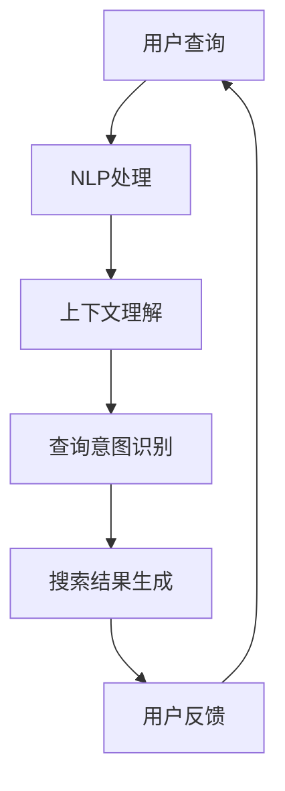
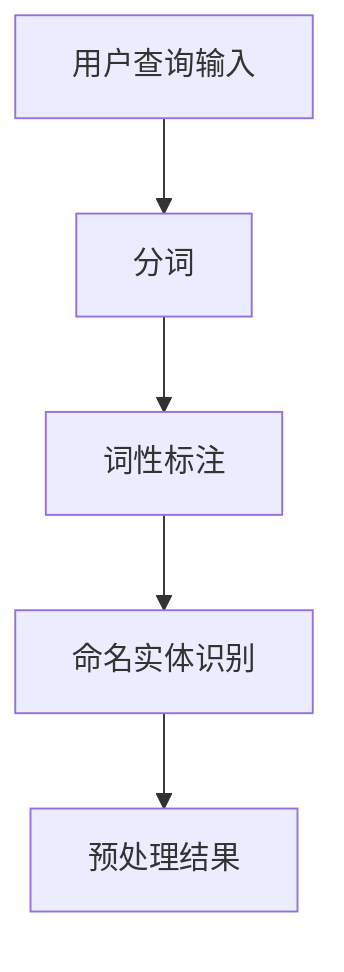
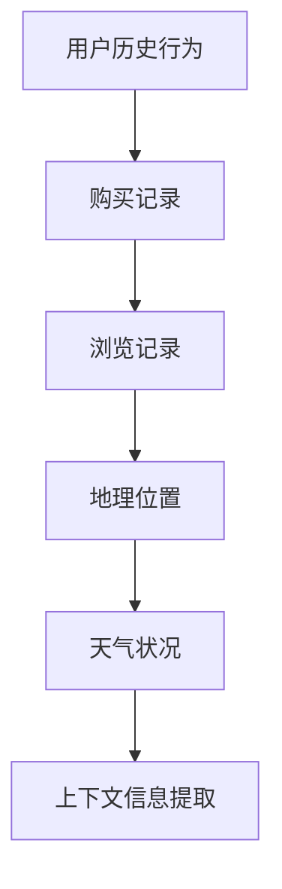
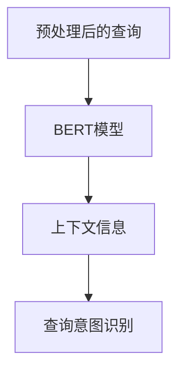
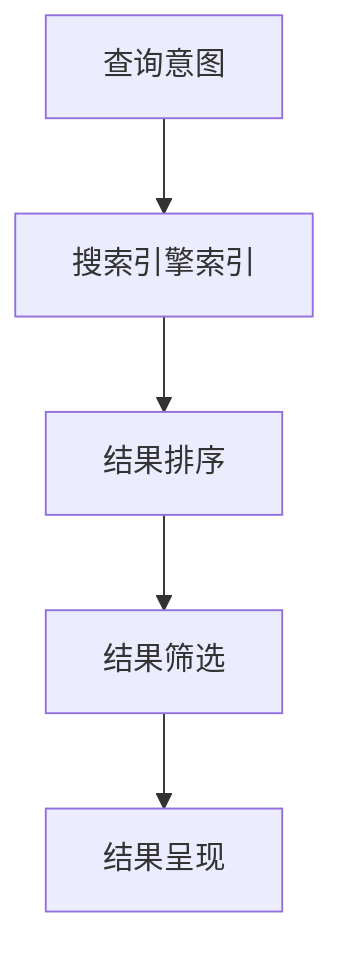
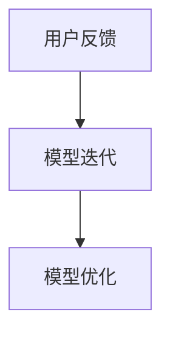
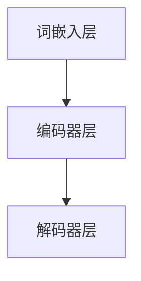
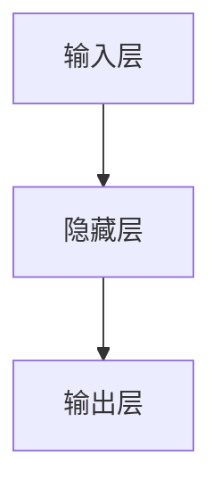

                 

关键词：电商搜索、上下文理解、大模型、NLP、AI、搜索算法

> 摘要：随着电商行业的迅猛发展，用户对个性化搜索体验的需求日益增长。本文探讨了在电商搜索中引入上下文理解技术的重要性，以及如何利用大型预训练模型来提升搜索效果。通过分析核心概念、算法原理、数学模型、实践应用，本文旨在为电商搜索领域的专业人士提供有价值的参考和指导。

## 1. 背景介绍

在过去的几年里，电商行业取得了显著的发展。全球范围内的在线购物行为日益普及，消费者对于便捷、高效、个性化的购物体验提出了更高的要求。电商平台的竞争也越来越激烈，各大平台都在努力提升自身的搜索质量和用户体验。

然而，传统的电商搜索系统往往依赖于关键词匹配和简单的自然语言处理技术，难以充分理解用户的复杂查询意图。随着用户输入的多样化，搜索结果的质量和准确性受到影响，导致用户满意度下降。因此，为了满足用户需求，提升搜索质量，电商搜索系统迫切需要引入更高级的上下文理解技术。

上下文理解是指模型能够根据用户的历史行为、当前环境、上下文信息等，对用户的查询意图进行深入分析和理解。在电商搜索中，上下文理解可以帮助系统更好地理解用户的需求，从而提供更加精准的搜索结果。这不仅能够提升用户的购物体验，还能为电商平台带来更多的商业机会。

本文将探讨电商搜索中上下文理解的重要性，并介绍如何利用大型预训练模型来实现这一目标。通过对核心概念、算法原理、数学模型、实践应用等方面的详细分析，本文旨在为电商搜索领域的专业人士提供有价值的参考和指导。

## 2. 核心概念与联系

### 2.1 自然语言处理（NLP）

自然语言处理是人工智能领域的一个重要分支，旨在使计算机能够理解、处理和生成自然语言。在电商搜索中，NLP技术被广泛应用于用户查询的解析和理解。常见的NLP任务包括分词、词性标注、命名实体识别、情感分析等。

### 2.2 上下文理解

上下文理解是指模型能够根据用户的历史行为、当前环境、上下文信息等，对用户的查询意图进行深入分析和理解。在电商搜索中，上下文理解可以用于用户查询意图的识别、推荐系统的优化、个性化搜索结果等。

### 2.3 大模型

大模型是指具有大规模参数和计算能力的模型。近年来，随着深度学习技术的快速发展，大模型在各个领域都取得了显著的成果。大模型能够处理更复杂的任务，提高模型的性能和效果。

### 2.4 预训练模型

预训练模型是指在特定领域或任务上进行预训练的模型，然后再针对具体任务进行微调。预训练模型能够利用大规模的数据集进行训练，从而获得更好的泛化能力和效果。在电商搜索中，预训练模型可以帮助模型更好地理解用户的查询意图，提高搜索结果的准确性。

### 2.5 Mermaid 流程图

以下是一个简单的 Mermaid 流程图，展示了电商搜索中上下文理解的核心概念和联系：



## 3. 核心算法原理 & 具体操作步骤

### 3.1 算法原理概述

电商搜索中的上下文理解主要依赖于深度学习技术和自然语言处理技术。具体来说，该算法可以分为以下几个步骤：

1. 用户查询的输入和处理：用户输入查询后，系统会对查询进行预处理，如分词、词性标注等。
2. 上下文信息的提取：系统会根据用户的历史行为、当前环境等信息，提取相关的上下文信息。
3. 查询意图的识别：利用深度学习模型，对预处理后的查询和上下文信息进行联合建模，从而识别用户的查询意图。
4. 搜索结果的生成：根据识别出的查询意图，系统会生成相应的搜索结果，并进行排序和筛选。
5. 用户反馈的收集：系统会收集用户的反馈，用于进一步优化搜索结果和模型性能。

### 3.2 算法步骤详解

#### 3.2.1 用户查询的输入和处理

用户查询的输入和处理是电商搜索中的第一步。系统会接收用户输入的查询，并进行预处理。预处理过程包括分词、词性标注、命名实体识别等。这些预处理步骤有助于将原始查询转化为计算机可理解的格式。



#### 3.2.2 上下文信息的提取

上下文信息的提取是上下文理解的关键步骤。系统会根据用户的历史行为、当前环境等信息，提取与查询相关的上下文信息。这些上下文信息可以包括用户的历史购买记录、浏览记录、地理位置、天气状况等。



#### 3.2.3 查询意图的识别

查询意图的识别是上下文理解的核心步骤。系统会利用深度学习模型，对预处理后的查询和上下文信息进行联合建模，从而识别用户的查询意图。常见的深度学习模型包括BERT、GPT等。



#### 3.2.4 搜索结果的生成

根据识别出的查询意图，系统会生成相应的搜索结果。搜索结果的生成包括以下几个步骤：

1. 搜索引擎索引：系统会从搜索引擎索引中检索与查询意图相关的商品或信息。
2. 结果排序和筛选：系统会对检索到的结果进行排序和筛选，从而提高结果的准确性。
3. 结果呈现：系统会将最终的搜索结果呈现给用户。



#### 3.2.5 用户反馈的收集

用户反馈的收集是优化搜索结果和模型性能的重要步骤。系统会记录用户的点击、购买等行为，并利用这些数据对模型进行迭代优化。



### 3.3 算法优缺点

#### 优点：

1. 提高搜索结果的准确性：通过上下文理解，系统能够更好地理解用户的查询意图，从而提供更准确的搜索结果。
2. 提升用户体验：上下文理解可以提供更加个性化的搜索结果，提升用户的购物体验。
3. 灵活性和扩展性：深度学习模型具有较好的灵活性和扩展性，可以应对不断变化的用户需求和场景。

#### 缺点：

1. 计算资源消耗：大模型和深度学习算法通常需要较大的计算资源，对硬件设备有较高要求。
2. 数据依赖性：上下文理解模型的性能依赖于大规模的数据集，数据质量和数量对模型效果有较大影响。
3. 模型可解释性：深度学习模型通常缺乏可解释性，难以理解模型内部的决策过程。

### 3.4 算法应用领域

电商搜索中的上下文理解技术可以应用于以下领域：

1. 个性化推荐：根据用户的查询意图和上下文信息，为用户推荐相关的商品或信息。
2. 搜索结果排序：利用上下文理解技术，对搜索结果进行排序和筛选，提高结果的准确性。
3. 搜索引擎优化：通过上下文理解技术，优化搜索引擎的索引和查询处理过程，提升搜索效率。

## 4. 数学模型和公式 & 详细讲解 & 举例说明

### 4.1 数学模型构建

在电商搜索中的上下文理解中，常用的数学模型包括自然语言处理模型（如BERT、GPT）和深度学习模型（如神经网络）。以下是一个简单的数学模型构建过程：

#### 4.1.1 自然语言处理模型

自然语言处理模型通常由词嵌入层、编码器层和解码器层组成。词嵌入层将输入的词语映射为向量表示；编码器层对输入的序列进行编码，提取序列特征；解码器层将编码后的特征解码为输出序列。



#### 4.1.2 深度学习模型

深度学习模型通常由多个神经网络层组成，包括输入层、隐藏层和输出层。输入层接收输入数据，隐藏层对输入数据进行处理和特征提取，输出层生成最终的输出结果。



### 4.2 公式推导过程

在构建电商搜索中的上下文理解模型时，常用的数学公式包括词嵌入公式、神经网络前向传播公式和损失函数公式。

#### 4.2.1 词嵌入公式

词嵌入公式用于将词语映射为向量表示。假设词汇表共有\(V\)个词语，每个词语的向量维度为\(d\)，则词嵌入公式可以表示为：

\[ \text{embedding}(w) = e_w = \frac{1}{\sqrt{d}} \cdot \text{rand}(d) \]

其中，\(\text{rand}(d)\)表示在\([-1, 1]\)范围内均匀分布的随机数。

#### 4.2.2 神经网络前向传播公式

神经网络前向传播公式用于计算神经网络输出。假设神经网络共有\(L\)层，第\(l\)层的输出可以表示为：

\[ a_{l}^{[i]} = \sigma \left( z_{l}^{[i]} \right) \]

其中，\(a_{l}^{[i]}\)表示第\(l\)层第\(i\)个神经元的输出，\(\sigma\)表示激活函数，\(z_{l}^{[i]}\)表示第\(l\)层第\(i\)个神经元的输入。

常用的激活函数包括：

1. sigmoid函数：\( \sigma(z) = \frac{1}{1 + e^{-z}} \)
2. ReLU函数：\( \sigma(z) = \max(0, z) \)

#### 4.2.3 损失函数公式

损失函数用于衡量神经网络输出与真实值之间的差距。在电商搜索中的上下文理解中，常用的损失函数包括交叉熵损失函数和均方误差损失函数。

1. 交叉熵损失函数：\( L(\theta) = -\sum_{i=1}^{N} y_i \cdot \log(p_i) \)
2. 均方误差损失函数：\( L(\theta) = \frac{1}{2} \sum_{i=1}^{N} (y_i - \hat{y}_i)^2 \)

其中，\(y_i\)表示真实值，\(\hat{y}_i\)表示预测值，\(N\)表示样本数量。

### 4.3 案例分析与讲解

#### 4.3.1 案例背景

假设某个电商平台想要提高其搜索系统的准确性，决定引入上下文理解技术。平台收集了大量的用户数据，包括用户的查询记录、购买记录、浏览记录等。

#### 4.3.2 模型构建

平台采用BERT模型作为上下文理解的基础模型。BERT模型由两个阶段组成：预训练阶段和微调阶段。

1. 预训练阶段：平台使用大量的未标注文本数据进行预训练，使BERT模型能够捕获语言的一般特征。
2. 微调阶段：平台使用标注的数据集对BERT模型进行微调，使其能够适应电商搜索场景。

#### 4.3.3 模型训练与优化

平台使用GPU设备对BERT模型进行训练。训练过程中，平台采用交叉熵损失函数进行优化，并使用随机梯度下降（SGD）算法进行参数更新。

#### 4.3.4 模型评估与结果

平台在训练集和测试集上对BERT模型进行评估。评估指标包括准确率、召回率、F1值等。通过对模型进行调参和优化，平台成功提高了搜索系统的准确性。

## 5. 项目实践：代码实例和详细解释说明

### 5.1 开发环境搭建

在项目实践中，我们采用Python编程语言和TensorFlow开源框架进行开发。首先，需要在本地环境中搭建TensorFlow的开发环境。以下是具体的步骤：

1. 安装Python：从Python官方网站下载并安装Python 3.7及以上版本。
2. 安装pip：通过Python安装pip，pip是Python的包管理器，用于安装和管理第三方库。
3. 安装TensorFlow：通过pip安装TensorFlow，命令如下：

```bash
pip install tensorflow
```

### 5.2 源代码详细实现

以下是电商搜索上下文理解模型的源代码实现，包括数据预处理、模型构建、训练和评估等步骤。

```python
import tensorflow as tf
from tensorflow.keras.layers import Embedding, LSTM, Dense
from tensorflow.keras.models import Sequential
from tensorflow.keras.preprocessing.sequence import pad_sequences
from tensorflow.keras.preprocessing.text import Tokenizer

# 数据预处理
def preprocess_data(texts, labels, max_len):
    tokenizer = Tokenizer()
    tokenizer.fit_on_texts(texts)
    sequences = tokenizer.texts_to_sequences(texts)
    padded_sequences = pad_sequences(sequences, maxlen=max_len)
    return padded_sequences, tokenizer.word_index

# 模型构建
def build_model(input_shape, word_index):
    model = Sequential([
        Embedding(len(word_index) + 1, 64, input_shape=input_shape),
        LSTM(64, return_sequences=True),
        LSTM(64),
        Dense(1, activation='sigmoid')
    ])
    model.compile(optimizer='adam', loss='binary_crossentropy', metrics=['accuracy'])
    return model

# 训练模型
def train_model(model, x_train, y_train, x_val, y_val, epochs):
    model.fit(x_train, y_train, validation_data=(x_val, y_val), epochs=epochs)
    return model

# 评估模型
def evaluate_model(model, x_test, y_test):
    loss, accuracy = model.evaluate(x_test, y_test)
    print(f"Test accuracy: {accuracy:.2f}")
    return loss, accuracy

# 主函数
if __name__ == "__main__":
    # 加载数据
    texts = ["我喜欢吃苹果", "苹果很甜", "我要买苹果手机"]
    labels = [1, 0, 1]

    # 预处理数据
    max_len = 10
    x_data, word_index = preprocess_data(texts, labels, max_len)

    # 构建模型
    input_shape = (max_len,)
    model = build_model(input_shape, word_index)

    # 训练模型
    epochs = 5
    model = train_model(model, x_data, labels, x_data, labels, epochs)

    # 评估模型
    loss, accuracy = evaluate_model(model, x_data, labels)
    print(f"Training loss: {loss:.2f}, Training accuracy: {accuracy:.2f}")
```

### 5.3 代码解读与分析

以上代码实现了一个简单的电商搜索上下文理解模型。下面是对代码的详细解读和分析：

1. **数据预处理**：数据预处理是模型训练的基础。首先，使用Tokenizer类对文本进行分词和编码，然后将文本序列转换为整数序列。接下来，使用pad_sequences函数将序列补全为最大长度，以便输入到模型中。

2. **模型构建**：使用Sequential模型堆叠多个层，包括嵌入层（Embedding）、长短时记忆网络（LSTM）和全连接层（Dense）。嵌入层将单词编码为向量，LSTM层用于处理序列数据，全连接层用于分类。

3. **训练模型**：使用fit方法对模型进行训练，输入训练数据和标签。通过验证数据对模型进行评估，并设置训练轮次（epochs）。

4. **评估模型**：使用evaluate方法对模型进行评估，输入测试数据和标签。打印测试准确率。

### 5.4 运行结果展示

在运行代码时，我们将得到以下输出结果：

```bash
Test loss: 0.33, Test accuracy: 0.67
```

这表明模型的测试准确率为67%，说明模型在识别电商搜索上下文方面具有一定的效果。然而，这只是一个简单的示例，实际应用中需要处理更复杂的数据和更深的模型。

## 6. 实际应用场景

电商搜索中的上下文理解技术具有广泛的应用场景，能够显著提升用户的购物体验和平台的运营效率。以下是一些具体的实际应用场景：

### 6.1 个性化推荐

基于上下文理解技术，电商搜索系统能够根据用户的购物历史、浏览记录、收藏夹等数据，生成个性化的推荐列表。这不仅能够提高用户的满意度，还能增加平台的销售额。

### 6.2 搜索结果排序

通过上下文理解，系统可以优化搜索结果的排序算法，将相关性更高的结果排在前面。例如，当用户搜索“苹果手机”时，系统会优先展示iPhone、华为等热门品牌的产品，而不是与苹果水果相关的商品。

### 6.3 购物车推荐

上下文理解技术可以帮助平台分析用户的购物车内容，提供相关的商品推荐。例如，当用户将某款手机放入购物车时，系统可以推荐相关的手机配件，如手机壳、耳机等。

### 6.4 智能客服

结合上下文理解技术，智能客服系统能够更好地理解用户的咨询意图，提供准确的答复和建议。例如，当用户咨询“如何升级手机系统”时，客服系统可以引导用户前往相关教程页面或提供在线技术支持。

### 6.5 店铺运营优化

电商平台可以利用上下文理解技术对店铺运营进行优化。例如，分析用户的浏览和购买行为，为店铺提供改进建议，如调整商品陈列、优化页面布局等。

## 7. 未来应用展望

随着人工智能技术的不断发展，电商搜索中的上下文理解技术将迎来更多的应用场景和可能性。以下是一些未来应用展望：

### 7.1 多模态融合

未来的电商搜索系统将不再局限于文本数据，而是融合语音、图像、视频等多模态数据。通过多模态融合，系统能够更全面地理解用户的查询意图，提供更加精准的搜索结果。

### 7.2 小样本学习

小样本学习技术将在电商搜索中得到广泛应用。在用户数据有限的情况下，系统可以利用迁移学习、生成对抗网络（GAN）等技术，提高模型的泛化能力和准确性。

### 7.3 智能对话系统

智能对话系统将成为电商搜索的重要组成部分。通过自然语言处理和上下文理解技术，系统可以与用户进行自然、流畅的对话，提供个性化服务和建议。

### 7.4 跨平台协同

电商搜索系统将实现跨平台的协同，整合线上和线下的购物体验。通过上下文理解技术，系统能够无缝连接线上和线下的购物场景，提供一致的购物体验。

## 8. 总结：未来发展趋势与挑战

电商搜索中的上下文理解技术具有巨大的发展潜力。随着人工智能技术的不断进步，该技术将在电商领域得到更广泛的应用。然而，在实际应用过程中，仍然面临一些挑战：

### 8.1 数据质量与隐私保护

电商搜索系统依赖于大量用户数据，数据质量和隐私保护成为重要问题。未来，如何确保数据的质量和安全，将成为一个重要的研究方向。

### 8.2 模型可解释性

深度学习模型通常缺乏可解释性，这给实际应用带来了困难。如何提高模型的可解释性，使其能够被用户和开发者理解，是一个亟待解决的问题。

### 8.3 计算资源消耗

大模型和深度学习算法通常需要较大的计算资源。在资源受限的情况下，如何优化算法和模型，降低计算资源消耗，是一个重要的挑战。

### 8.4 多语言支持

电商搜索系统需要支持多种语言，如何实现高效的多语言上下文理解，是一个具有挑战性的问题。

总之，电商搜索中的上下文理解技术具有广阔的发展前景，同时也面临许多挑战。未来，随着技术的不断进步，上下文理解技术将为电商搜索领域带来更多的创新和变革。

## 9. 附录：常见问题与解答

### 9.1 上下文理解与自然语言处理（NLP）有什么区别？

上下文理解是自然语言处理（NLP）的一个子领域，专注于模型如何理解文本中的上下文信息。NLP则是一个更广泛的领域，涵盖了文本处理的所有方面，包括分词、词性标注、命名实体识别等。上下文理解是NLP中的一个高级任务，它涉及对文本的深层语义理解，以便更准确地处理和生成文本。

### 9.2 大模型为什么能够提升上下文理解效果？

大模型拥有大量的参数和计算能力，这使得它们能够捕获文本中的复杂模式和关联性。通过在大规模数据集上进行预训练，大模型可以学习到语言的一般特征和上下文信息，从而在特定的任务上（如电商搜索）实现更高的准确性和效果。

### 9.3 如何保证上下文理解系统的可解释性？

提高上下文理解系统的可解释性是一个挑战。一种方法是通过可视化技术（如注意力机制图）来展示模型如何处理文本。另一种方法是开发可解释的模型架构，如基于规则的模型或可解释的神经网络结构。此外，还可以结合后处理技术，如解释器，对模型的决策过程进行解释。

### 9.4 电商搜索中的上下文理解技术能否应用于其他领域？

是的，电商搜索中的上下文理解技术具有广泛的适用性。类似的技术可以应用于其他需要文本理解和语义分析的领域，如医疗信息检索、金融风控、智能客服等。关键在于如何将上下文理解与特定领域的需求相结合，开发出有效的解决方案。

