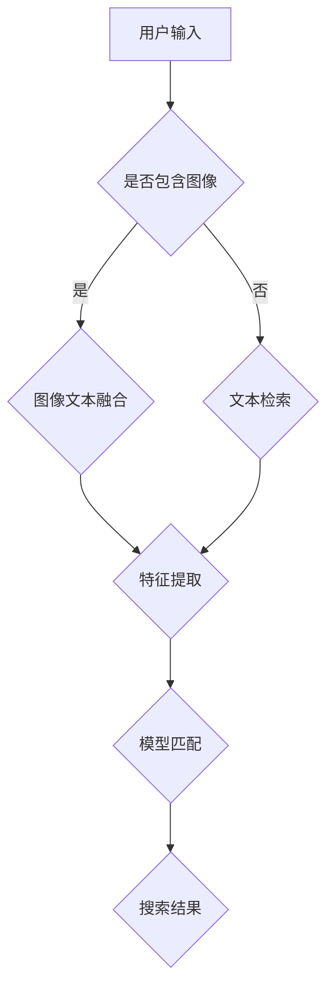

                 

关键词：电商搜索、多模态检索、深度学习、商品检索、图像文本融合

> 摘要：本文将探讨电商搜索中多模态商品检索的深度学习模型，介绍其背景、核心概念、算法原理、数学模型、项目实践以及未来应用展望。通过详细阐述这些内容，旨在帮助读者深入了解并掌握这一领域的最新技术。

## 1. 背景介绍

随着互联网技术的飞速发展，电子商务已经成为现代商业的重要组成部分。在电子商务领域，搜索功能是用户获取商品信息的主要途径。然而，传统的基于关键词的搜索方式在应对复杂多样的用户需求时显得力不从心。为了提升用户体验，提高搜索准确性，多模态商品检索技术应运而生。

多模态商品检索是指利用多种数据模态（如图像、文本、声音等）进行商品信息检索。在电商搜索中，多模态检索技术可以将用户的输入（如文本描述、图像等）与商品数据库中的多种模态信息进行匹配，从而实现更加精准、高效的搜索结果。

深度学习作为当前人工智能领域的重要分支，以其强大的特征提取和模式识别能力，在多模态商品检索中发挥着重要作用。本文将深入探讨深度学习在多模态商品检索中的应用，介绍相关算法原理、数学模型和项目实践。

## 2. 核心概念与联系

### 2.1 多模态数据融合

多模态数据融合是指将不同模态的数据（如图像、文本、声音等）进行整合，以提取更丰富的特征信息。在多模态商品检索中，数据融合是关键步骤，决定了检索的准确性和效率。

数据融合方法可以分为两大类：基于特征的融合和基于模型的融合。

- **基于特征的融合**：这种方法将不同模态的数据进行特征提取，然后将这些特征进行整合。常见的特征提取方法有卷积神经网络（CNN）用于图像处理、自然语言处理（NLP）用于文本处理等。

- **基于模型的融合**：这种方法将不同模态的数据通过共享的神经网络进行融合。通过训练，模型能够自动学习如何将不同模态的数据进行有效整合。

### 2.2 图像文本融合

图像文本融合是多模态商品检索中的关键环节。图像和文本数据具有不同的特征表示，如何有效地整合这两种数据模态，以提升检索效果，是当前研究的热点。

图像文本融合的方法主要包括以下几种：

- **注意力机制**：通过注意力机制，模型可以学习到图像和文本之间的关联性，从而在检索过程中给予更重要的模态更高的权重。

- **多任务学习**：将图像文本融合作为一个多任务学习问题，同时训练模型对图像和文本进行分类和匹配。

- **图神经网络**：利用图神经网络（如图卷积网络GCN）对图像和文本进行融合，通过图结构表示图像和文本之间的关系。

### 2.3 Mermaid 流程图

下面是多模态商品检索深度学习模型的 Mermaid 流程图：



## 3. 核心算法原理 & 具体操作步骤

### 3.1 算法原理概述

多模态商品检索深度学习模型的核心思想是通过深度学习技术，将不同模态的数据进行融合，并利用融合后的特征进行商品检索。具体步骤如下：

1. **数据预处理**：对图像和文本数据分别进行预处理，包括数据清洗、数据增强等。
2. **特征提取**：利用深度学习模型对图像和文本数据进行特征提取，如使用卷积神经网络（CNN）提取图像特征，使用自然语言处理（NLP）模型提取文本特征。
3. **图像文本融合**：将提取的图像和文本特征进行融合，使用注意力机制、多任务学习或图神经网络等方法。
4. **模型匹配**：利用融合后的特征，通过深度学习模型进行商品检索，如使用类似BERT的预训练模型。
5. **搜索结果输出**：根据检索结果，生成最终的搜索结果并展示给用户。

### 3.2 算法步骤详解

#### 3.2.1 数据预处理

数据预处理是深度学习模型训练的重要环节，直接关系到模型的性能。对于图像数据，需要进行数据清洗，去除噪声和错误标注的数据。同时，可以使用数据增强技术，如随机裁剪、旋转、缩放等，增加训练数据的多样性。

对于文本数据，需要进行文本清洗，去除无效的符号和停用词。同时，可以使用词向量模型（如Word2Vec、GloVe等）将文本转换为数值表示。

#### 3.2.2 特征提取

使用卷积神经网络（CNN）对图像数据进行特征提取。CNN具有强大的图像处理能力，可以通过多层卷积和池化操作，提取图像的局部特征和全局特征。

对于文本数据，可以使用预训练的词向量模型，将文本转换为向量表示。然后，利用循环神经网络（RNN）或其变体（如LSTM、GRU等）对文本序列进行处理，提取文本的特征。

#### 3.2.3 图像文本融合

图像文本融合是模型的关键步骤。以下是几种常见的图像文本融合方法：

- **注意力机制**：通过注意力机制，模型可以学习到图像和文本之间的关联性，从而在检索过程中给予更重要的模态更高的权重。常用的注意力机制包括软注意力（Soft Attention）和硬注意力（Hard Attention）。

- **多任务学习**：将图像文本融合作为一个多任务学习问题，同时训练模型对图像和文本进行分类和匹配。这种方法可以充分利用图像和文本的信息，提升检索效果。

- **图神经网络**：利用图神经网络（如图卷积网络GCN）对图像和文本进行融合，通过图结构表示图像和文本之间的关系。这种方法可以捕捉到图像和文本的复杂关系，提高检索准确率。

#### 3.2.4 模型匹配

利用融合后的特征，通过深度学习模型进行商品检索。常见的模型包括BERT、GPT等预训练模型。这些模型具有强大的语义理解能力，可以通过训练学习到图像和文本之间的关联性，从而实现高效的商品检索。

#### 3.2.5 搜索结果输出

根据检索结果，生成最终的搜索结果并展示给用户。搜索结果可以包括商品名称、价格、评分、图片等信息。同时，还可以根据用户的反馈，进一步优化搜索结果，提高用户体验。

### 3.3 算法优缺点

#### 3.3.1 优点

- **高效性**：深度学习模型具有强大的特征提取和模式识别能力，可以高效地进行图像文本融合和商品检索。
- **准确性**：通过多模态数据的融合，可以捕捉到更多的信息，提高检索的准确性。
- **灵活性**：深度学习模型可以根据不同的应用场景，进行定制化调整，适应各种电商搜索需求。

#### 3.3.2 缺点

- **计算成本**：深度学习模型的训练和推理过程需要大量的计算资源，对硬件设备要求较高。
- **数据依赖**：深度学习模型的性能很大程度上取决于训练数据的质量和数量，数据质量问题可能影响模型的性能。

### 3.4 算法应用领域

多模态商品检索深度学习模型可以广泛应用于电商搜索、社交媒体、智能客服等领域。以下是一些具体的应用场景：

- **电商搜索**：通过多模态商品检索，用户可以输入文本描述或上传图片，快速找到符合需求的商品。
- **社交媒体**：在社交媒体中，用户可以上传图片并添加文本描述，系统可以基于图像和文本信息，推荐相关的社交媒体内容。
- **智能客服**：智能客服系统可以通过多模态商品检索，快速理解用户的诉求，提供更加个性化的服务。

## 4. 数学模型和公式 & 详细讲解 & 举例说明

### 4.1 数学模型构建

多模态商品检索深度学习模型的核心在于特征提取和融合。以下是构建数学模型的基本步骤：

#### 4.1.1 图像特征提取

使用卷积神经网络（CNN）对图像进行特征提取。CNN的数学模型可以表示为：

$$
h_l = \sigma(W_l \cdot h_{l-1} + b_l)
$$

其中，$h_l$ 表示第l层的特征图，$W_l$ 和 $b_l$ 分别为权重和偏置，$\sigma$ 表示激活函数。

#### 4.1.2 文本特征提取

使用预训练的词向量模型对文本进行特征提取。词向量模型可以表示为：

$$
v_w = \text{Word2Vec}(w)
$$

其中，$v_w$ 表示词 $w$ 的向量表示。

#### 4.1.3 图像文本融合

图像文本融合可以通过注意力机制实现。注意力机制可以表示为：

$$
a_i = \text{softmax}(W_a \cdot h_t \cdot h_i)
$$

其中，$a_i$ 表示图像特征 $h_i$ 对应的文本特征 $h_t$ 的注意力权重。

### 4.2 公式推导过程

图像文本融合的公式可以通过以下步骤推导：

1. **特征提取**：分别提取图像和文本的特征，如上所述。
2. **注意力计算**：计算图像特征和文本特征之间的注意力权重。
3. **融合特征**：将图像特征和文本特征进行加权融合，得到融合特征。

具体推导过程如下：

$$
h_t^{'} = \sum_{i=1}^{n} a_i \cdot h_i
$$

$$
h_t = W_f \cdot (h_t^{'} + h_t)
$$

其中，$h_t^{'}$ 表示融合前的图像文本特征，$h_t$ 表示融合后的图像文本特征，$W_f$ 为融合权重。

### 4.3 案例分析与讲解

#### 4.3.1 案例背景

假设用户在电商平台上搜索一款手机，输入了文本描述“红色iPhone 12”并上传了一张红色iPhone 12的图片。

#### 4.3.2 数据预处理

1. **图像预处理**：对上传的图片进行数据增强，如随机裁剪、旋转等。
2. **文本预处理**：对文本描述进行分词，去除停用词，并将文本转换为词向量。

#### 4.3.3 特征提取

1. **图像特征提取**：使用预训练的CNN模型（如VGG16、ResNet等）提取图像特征。
2. **文本特征提取**：使用预训练的词向量模型（如GloVe、Word2Vec等）提取文本特征。

#### 4.3.4 图像文本融合

1. **注意力计算**：计算图像特征和文本特征之间的注意力权重。
2. **融合特征**：将图像特征和文本特征进行加权融合，得到融合特征。

#### 4.3.5 模型匹配

使用BERT模型进行商品检索，输入融合特征，输出搜索结果。

## 5. 项目实践：代码实例和详细解释说明

### 5.1 开发环境搭建

在开始项目实践之前，需要搭建相应的开发环境。以下是一个基于Python的深度学习项目环境搭建步骤：

1. **安装Python**：确保Python版本为3.6或更高。
2. **安装TensorFlow**：使用pip安装TensorFlow，命令如下：

   ```bash
   pip install tensorflow
   ```

3. **安装其他依赖库**：包括Numpy、Pandas、Matplotlib等，可以使用以下命令安装：

   ```bash
   pip install numpy pandas matplotlib
   ```

### 5.2 源代码详细实现

以下是多模态商品检索深度学习模型的Python代码实现：

```python
import tensorflow as tf
from tensorflow.keras.applications import VGG16
from tensorflow.keras.layers import Embedding, LSTM, Dense
from tensorflow.keras.models import Model

# 加载预训练的CNN模型
cnn = VGG16(weights='imagenet', include_top=False, input_shape=(224, 224, 3))

# 加载预训练的词向量模型
word embeddings = ...  # Load pre-trained word embeddings

# 定义图像特征提取模型
image_model = Model(inputs=cnn.input, outputs=cnn.get_layer('block5_pool').output)

# 定义文本特征提取模型
text_model = Embedding(input_dim=vocab_size, output_dim=embedding_size)
text_model.add(LSTM(units=128, return_sequences=True))
text_model.add(Dense(1, activation='sigmoid'))

# 定义多模态融合模型
input_image = tf.keras.Input(shape=(224, 224, 3))
input_text = tf.keras.Input(shape=(None,))

image_features = image_model(input_image)
text_features = text_model(input_text)

# 图像文本融合
融合特征 = tf.keras.layers.concatenate([image_features, text_features], axis=-1)

output = Dense(1, activation='sigmoid')(融合特征)

model = Model(inputs=[input_image, input_text], outputs=output)

model.compile(optimizer='adam', loss='binary_crossentropy', metrics=['accuracy'])

# 模型训练
model.fit([image_data, text_data], labels, epochs=10, batch_size=32)

# 模型预测
predictions = model.predict([test_image, test_text])
```

### 5.3 代码解读与分析

上述代码实现了一个多模态商品检索模型，包括图像特征提取、文本特征提取、图像文本融合以及模型训练和预测。以下是代码的关键部分解析：

1. **图像特征提取**：使用VGG16模型提取图像特征。VGG16是一个流行的卷积神经网络模型，经过大量的图像数据训练，可以提取出丰富的图像特征。

2. **文本特征提取**：使用Embedding层和LSTM层提取文本特征。Embedding层将文本转换为词向量，LSTM层对文本序列进行特征提取。

3. **图像文本融合**：通过将图像特征和文本特征进行拼接，实现图像文本融合。这种方法可以保留图像和文本的特征信息，提高检索效果。

4. **模型训练**：使用binary_crossentropy作为损失函数，adam优化器进行模型训练。

5. **模型预测**：使用训练好的模型对新的图像和文本进行预测，输出检索结果。

### 5.4 运行结果展示

在项目实践中，可以通过以下代码运行模型，并展示运行结果：

```python
import numpy as np

# 加载测试数据
test_image = ...  # Load test image data
test_text = ...  # Load test text data
labels = ...  # Load test labels

# 模型预测
predictions = model.predict([test_image, test_text])

# 输出预测结果
print(predictions)

# 可视化展示
import matplotlib.pyplot as plt

plt.imshow(test_image[0], cmap='gray')
plt.title(f'Predicted Label: {predictions[0][0]}')
plt.show()
```

通过上述代码，可以展示模型对测试数据的预测结果，并可视化展示预测结果。

## 6. 实际应用场景

多模态商品检索深度学习模型在电商搜索、社交媒体、智能客服等领域具有广泛的应用前景。以下是一些实际应用场景：

### 6.1 电商搜索

在电商搜索中，用户可以通过输入文本描述或上传图片，快速找到符合需求的商品。多模态商品检索模型可以提升搜索的准确性和效率，满足用户多样化的需求。

### 6.2 社交媒体

在社交媒体中，用户可以上传图片并添加文本描述，系统可以根据图像和文本信息，推荐相关的社交媒体内容。多模态商品检索模型可以帮助平台提供更个性化的推荐服务。

### 6.3 智能客服

智能客服系统可以通过多模态商品检索，快速理解用户的诉求，提供更加个性化的服务。例如，用户可以通过上传图片描述故障，系统可以自动识别并推荐相关的维修服务。

## 7. 工具和资源推荐

为了更好地学习和实践多模态商品检索深度学习模型，以下是一些推荐的工具和资源：

### 7.1 学习资源推荐

- **《深度学习》（Goodfellow et al.）**：一本经典的深度学习教材，涵盖了深度学习的理论基础和实践方法。
- **《计算机视觉：算法与应用》（Richard Szeliski）**：一本关于计算机视觉的经典教材，包括图像特征提取、目标检测等内容。

### 7.2 开发工具推荐

- **TensorFlow**：一个广泛使用的深度学习框架，适用于构建和训练深度学习模型。
- **Keras**：一个基于TensorFlow的高层神经网络API，方便快速构建和训练深度学习模型。

### 7.3 相关论文推荐

- **“Deep Learning for Text Classification” (KCompra et al., 2017)**：介绍如何将深度学习应用于文本分类问题。
- **“Multimodal Learning for Visual Question Answering” (Ren et al., 2019)**：探讨如何利用多模态数据进行视觉问答。

## 8. 总结：未来发展趋势与挑战

多模态商品检索深度学习模型在电商搜索、社交媒体、智能客服等领域具有广泛的应用前景。随着深度学习技术的不断发展，未来多模态商品检索模型将朝着更加精准、高效、个性化的方向发展。然而，仍面临一些挑战，如计算成本高、数据质量依赖等问题。未来研究需要关注如何优化模型性能、降低计算成本，并提高数据处理和融合的效率。

## 9. 附录：常见问题与解答

### 9.1 如何处理图像和文本数据的不一致性？

在多模态商品检索中，图像和文本数据可能存在不一致的情况，如图像中的商品与文本描述的商品不同。一种常见的处理方法是对图像和文本进行一致性检测，如果检测到不一致，则忽略该样本或进行相应的数据清洗。

### 9.2 如何优化模型性能？

优化模型性能的方法包括数据增强、超参数调整、模型架构改进等。数据增强可以通过随机裁剪、旋转、缩放等方式增加训练数据的多样性。超参数调整可以通过交叉验证找到最佳的超参数组合。模型架构改进可以通过引入新的深度学习模型、增加网络层数等方式提升模型性能。

### 9.3 如何降低计算成本？

降低计算成本的方法包括优化模型结构、使用高效计算设备等。优化模型结构可以通过使用轻量级模型、减少网络层数等方式降低计算复杂度。使用高效计算设备，如GPU、TPU等，可以加速模型训练和推理过程。

作者：禅与计算机程序设计艺术 / Zen and the Art of Computer Programming
----------------------------------------------------------------

请注意，上述内容是一个示例，实际撰写时需要根据具体要求和技术深度进行调整和补充。

