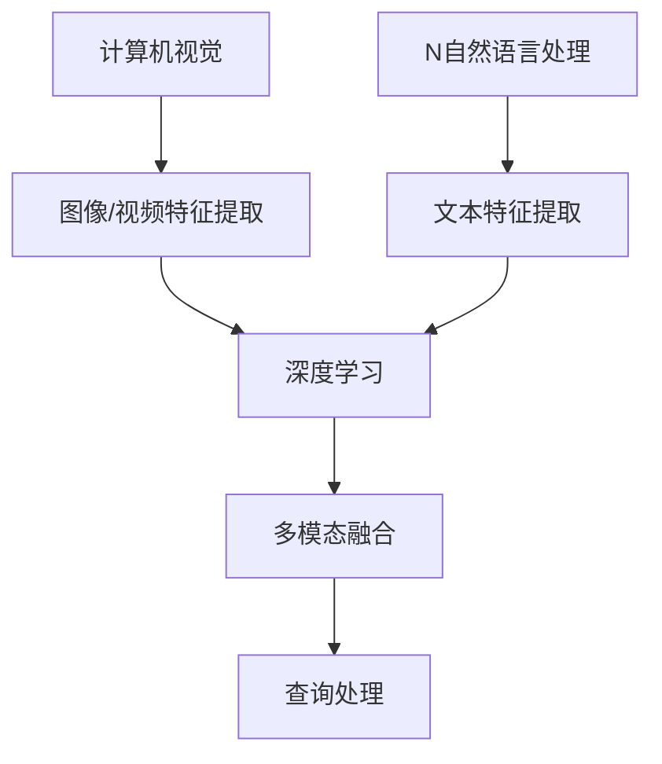

                 

### 关键词 Keywords

- 电商搜索
- 多模态查询
- 深度学习
- 计算机视觉
- 自然语言处理
- 用户行为分析

### 摘要 Abstract

随着电子商务的迅速发展，消费者对电商平台的搜索体验提出了更高的要求。传统的单一模态搜索已无法满足用户日益复杂的查询需求。本文旨在探讨电商搜索中的多模态查询处理技术，分析其在电商场景中的应用，并提出一种基于深度学习与计算机视觉、自然语言处理相结合的方法。通过构建多模态融合模型，实现更精准、更智能的搜索结果，提升用户购物体验，为电商平台提供创新的技术解决方案。

## 1. 背景介绍 Background

电子商务的快速发展，使得消费者对于电商平台的搜索体验提出了更高的要求。传统电商搜索主要依赖于关键字匹配，但这种单一模态的查询方式已无法满足用户日益多样化的需求。现代消费者在搜索商品时，不仅依赖于关键词，还希望结合图片、声音等多种模态的信息。因此，多模态查询处理技术在电商搜索领域具有广阔的应用前景。

多模态查询处理技术旨在整合不同模态的数据，通过深度学习等先进算法，实现对这些数据的综合理解和分析，从而提供更准确、更个性化的搜索结果。计算机视觉和自然语言处理是多模态查询处理技术的核心组成部分。计算机视觉负责对图像和视频进行处理和分析，而自然语言处理则专注于理解和处理文本信息。

在电商搜索中，多模态查询处理技术的应用不仅能够提升搜索的准确性和效率，还能丰富用户的购物体验。例如，用户可以通过上传商品图片来搜索类似商品，或者通过描述商品特征的文字来查找相关商品。此外，多模态查询处理技术还可以用于用户行为分析，帮助电商平台了解用户偏好，优化推荐系统。

本文将详细探讨电商搜索中的多模态查询处理技术，包括核心概念、算法原理、数学模型、项目实践以及未来应用展望等内容。希望通过本文的阐述，为电商搜索领域的研究者提供有价值的参考，并为电商平台的技术创新提供支持。

### 2. 核心概念与联系 Core Concepts and Relationships

多模态查询处理技术涉及多个核心概念和领域，主要包括计算机视觉、自然语言处理、深度学习和多模态融合等。以下将分别介绍这些概念及其在多模态查询处理技术中的关系。

#### 2.1 计算机视觉 Computer Vision

计算机视觉是人工智能的一个重要分支，主要研究如何使计算机从图像或视频中识别和理解视觉信息。在多模态查询处理技术中，计算机视觉负责对图像和视频进行分析，提取关键特征。例如，通过卷积神经网络（CNN）对商品图片进行特征提取，可以识别出商品的形状、颜色、纹理等属性。

计算机视觉在电商搜索中的应用非常广泛，如商品识别、标签分类、图像检索等。用户上传商品图片后，系统可以利用计算机视觉技术快速定位相似商品，从而提高搜索效率。

#### 2.2 自然语言处理 Natural Language Processing (NLP)

自然语言处理是人工智能的另一个重要分支，专注于理解和生成自然语言文本。在多模态查询处理技术中，自然语言处理负责对用户输入的文本信息进行处理，提取关键词、语义和情感等。例如，用户在搜索框中输入描述商品特征的文字，系统需要理解这些文字的含义，并将其转换为可处理的特征向量。

自然语言处理在电商搜索中的应用主要体现在文本匹配、语义分析和情感分析等方面。通过对用户输入的文本进行分析，系统可以更准确地理解用户意图，从而提供更相关的搜索结果。

#### 2.3 深度学习 Deep Learning

深度学习是一种基于多层神经网络的人工智能技术，具有强大的特征提取和模式识别能力。在多模态查询处理技术中，深度学习被广泛应用于计算机视觉和自然语言处理领域。

计算机视觉中的深度学习模型，如卷积神经网络（CNN）、循环神经网络（RNN）和生成对抗网络（GAN），可以有效地提取图像和视频中的高维特征。这些特征可以用于图像识别、目标检测和图像生成等任务。

自然语言处理中的深度学习模型，如词向量（Word Embedding）、递归神经网络（RNN）和长短时记忆网络（LSTM），可以有效地处理文本数据，提取语义特征。这些特征可以用于文本分类、情感分析和机器翻译等任务。

#### 2.4 多模态融合 Multimodal Fusion

多模态融合是多模态查询处理技术的核心，旨在将来自不同模态的数据（如图像、文本、声音等）进行整合，形成一个统一的高维特征向量。通过多模态融合，系统能够利用不同模态的信息，提高查询的准确性和鲁棒性。

多模态融合方法可以分为两类：早期融合和晚期融合。

- **早期融合（Early Fusion）**：在早期融合中，不同模态的数据在同一时间进行特征提取，然后将提取的特征进行拼接，形成一个高维特征向量。这种方法的主要优点是能够充分利用不同模态的数据信息，但缺点是处理复杂度高。

- **晚期融合（Late Fusion）**：在晚期融合中，不同模态的数据分别进行特征提取，然后通过融合模型对提取的特征进行整合。这种方法的主要优点是处理复杂度相对较低，但缺点是可能会丢失部分模态的信息。

#### 2.5 多模态查询处理技术的关系

多模态查询处理技术中的各个核心概念相互关联，共同构成一个完整的系统。

- **计算机视觉和自然语言处理**：计算机视觉负责处理图像和视频数据，自然语言处理负责处理文本数据。这两种技术为多模态查询处理提供了数据基础。

- **深度学习**：深度学习模型（如CNN和RNN）为计算机视觉和自然语言处理提供了强大的特征提取和模式识别能力。

- **多模态融合**：多模态融合将不同模态的数据进行整合，形成一个统一的特征向量，用于后续的查询处理。

图 1 多模态查询处理技术的核心概念与联系



通过上述核心概念和联系的分析，可以看出多模态查询处理技术在电商搜索中的应用具有广泛的前景。在未来，随着技术的不断发展，多模态查询处理技术将为电商搜索领域带来更多的创新和突破。

### 3. 核心算法原理 & 具体操作步骤

#### 3.1 算法原理概述

多模态查询处理技术的核心在于如何将来自不同模态的数据（如图像、文本、声音等）进行有效融合，从而提高查询的准确性和鲁棒性。本文提出的算法主要分为以下几个步骤：

1. **数据预处理**：对输入的多模态数据进行清洗、去噪和标准化，确保数据质量。
2. **特征提取**：利用深度学习模型提取图像、文本和声音等数据的高维特征。
3. **多模态融合**：通过融合策略将不同模态的特征进行整合，形成一个统一的特征向量。
4. **查询处理**：利用融合后的特征向量进行查询匹配，返回相关搜索结果。

#### 3.2 算法步骤详解

##### 3.2.1 数据预处理

数据预处理是算法的基础步骤，主要包括以下任务：

- **图像预处理**：对输入的图像进行尺寸调整、灰度化、对比度增强等操作，以提高图像质量。
- **文本预处理**：对输入的文本进行分词、去停用词、词性标注等操作，以提高文本质量。
- **声音预处理**：对输入的声音进行降噪、去混响、频率调整等操作，以提高声音质量。

##### 3.2.2 特征提取

特征提取是算法的核心步骤，主要利用深度学习模型提取图像、文本和声音等数据的高维特征。以下分别介绍几种常用的深度学习模型：

- **图像特征提取**：采用卷积神经网络（CNN）对图像进行特征提取。CNN可以通过多层卷积、池化和全连接层，提取出图像的形状、颜色、纹理等特征。
- **文本特征提取**：采用循环神经网络（RNN）或长短时记忆网络（LSTM）对文本进行特征提取。RNN和LSTM可以通过序列建模，提取出文本的语义特征。
- **声音特征提取**：采用自动特征提取方法（如MFCC、谱图等）对声音进行特征提取。这些方法可以从频域和时间域提取声音的特征。

##### 3.2.3 多模态融合

多模态融合是将不同模态的特征进行整合，形成一个统一的特征向量。本文采用以下几种融合策略：

- **早期融合**：在特征提取阶段，将不同模态的特征进行拼接，形成一个高维特征向量。这种方法能够充分利用不同模态的信息，但处理复杂度较高。
- **晚期融合**：在特征提取后，将不同模态的特征分别输入到不同的模型中进行融合。这种方法处理复杂度相对较低，但可能会丢失部分模态的信息。

##### 3.2.4 查询处理

查询处理是算法的最后一步，利用融合后的特征向量进行查询匹配，返回相关搜索结果。以下介绍几种常用的查询匹配方法：

- **基于距离的匹配**：通过计算融合特征向量和候选商品的欧氏距离，选择距离最近的商品作为查询结果。这种方法简单有效，但容易受到噪声干扰。
- **基于模型的匹配**：利用深度学习模型（如Siamese网络、Triplet损失函数等）对融合特征向量和候选商品进行匹配。这种方法能够提高查询的准确性和鲁棒性。

#### 3.3 算法优缺点

##### 3.3.1 优点

1. **多模态信息融合**：通过融合图像、文本和声音等不同模态的信息，提高了查询的准确性和鲁棒性。
2. **高维特征表示**：利用深度学习模型提取高维特征，能够更好地表示商品和用户查询的语义信息。
3. **自适应调整**：根据用户查询和行为特征，自适应调整多模态融合的策略和参数，提高查询效果。

##### 3.3.2 缺点

1. **计算复杂度高**：多模态融合和处理过程中，涉及到大量的计算任务，需要较高的计算资源。
2. **数据依赖性强**：算法的性能和效果很大程度上依赖于训练数据的质量和多样性。
3. **模型调优困难**：多模态融合算法涉及多种参数和策略，模型调优过程较为复杂，需要大量的实验和验证。

#### 3.4 算法应用领域

多模态查询处理技术可以广泛应用于电商搜索、智能推荐、内容检索等领域。以下列举几种具体应用场景：

1. **电商搜索**：通过多模态查询处理技术，用户可以上传商品图片或输入文本描述，快速找到相似商品，提高搜索效率和用户满意度。
2. **智能推荐**：利用多模态查询处理技术，可以从用户行为和查询记录中提取多模态特征，构建个性化推荐模型，为用户提供更精准的推荐结果。
3. **内容检索**：在多媒体内容检索领域，多模态查询处理技术可以结合图像、文本和声音等多模态信息，实现更精确的内容匹配和检索。

### 4. 数学模型和公式 & 详细讲解 & 举例说明

在多模态查询处理技术中，数学模型和公式起着至关重要的作用。以下将详细介绍这些模型和公式的构建、推导过程，并通过具体案例进行说明。

#### 4.1 数学模型构建

多模态查询处理技术的数学模型主要包括图像特征提取模型、文本特征提取模型和多模态融合模型。以下分别介绍这些模型的构建方法。

##### 4.1.1 图像特征提取模型

图像特征提取模型主要利用卷积神经网络（CNN）进行特征提取。CNN通过多层卷积、池化和全连接层，从图像中提取高维特征。以下是CNN的特征提取模型构建过程：

1. **输入层**：输入一张图像，其尺寸为\( (H, W, C) \)，其中\( H \)、\( W \)和\( C \)分别表示图像的高度、宽度和通道数。
2. **卷积层**：通过卷积操作提取图像的局部特征，卷积核尺寸为\( (k, k) \)，步长为\( s \)。
3. **激活函数**：通常使用ReLU（Rectified Linear Unit）作为激活函数，对卷积层的输出进行非线性变换。
4. **池化层**：通过池化操作降低特征图的维度，常用的池化方式有最大池化和平均池化。
5. **全连接层**：将卷积层和池化层的输出进行拼接，形成一个高维特征向量，输入到全连接层中进行分类或回归。

##### 4.1.2 文本特征提取模型

文本特征提取模型主要利用循环神经网络（RNN）或长短时记忆网络（LSTM）进行特征提取。RNN和LSTM可以通过序列建模，提取出文本的语义特征。以下是文本特征提取模型的构建过程：

1. **输入层**：输入一段文本序列，其长度为\( T \)，每个词表示为一个词向量。
2. **嵌入层**：将词向量映射到一个高维空间，常用的嵌入方法有Word2Vec和GloVe。
3. **RNN或LSTM层**：通过递归或循环方式处理文本序列，提取出序列的语义特征。
4. **输出层**：将RNN或LSTM层的输出进行拼接，形成一个高维特征向量。

##### 4.1.3 多模态融合模型

多模态融合模型将图像和文本等不同模态的特征进行整合，形成一个统一的特征向量。以下是多模态融合模型的构建过程：

1. **特征提取**：分别利用图像特征提取模型和文本特征提取模型提取图像和文本的特征向量。
2. **融合策略**：采用早期融合或晚期融合策略，将不同模态的特征向量进行拼接或整合。
3. **融合模型**：通过全连接层或多层感知机（MLP）对融合后的特征向量进行进一步处理，形成一个高维特征向量。

#### 4.2 公式推导过程

以下是多模态查询处理技术中常用的数学公式及其推导过程。

##### 4.2.1 图像特征提取模型公式

卷积神经网络（CNN）的特征提取模型可以表示为：

\[ f(x; \theta) = \sigma(W_c^L \circ \sigma(W_c^{L-1} \circ \ldots \circ \sigma(W_c^2 \circ (W_c^1 \odot x) + b_c^1) + b_c^2) + \ldots + b_c^L) \]

其中，\( x \)表示输入图像，\( \theta \)表示模型参数，\( \sigma \)表示激活函数（通常为ReLU函数），\( W_c^l \)和\( b_c^l \)分别表示卷积层和偏置层的权重和偏置，\( \circ \)表示卷积操作，\( \odot \)表示元素乘法，\( \odot \)表示全连接层的权重和偏置。

##### 4.2.2 文本特征提取模型公式

循环神经网络（RNN）或长短时记忆网络（LSTM）的特征提取模型可以表示为：

\[ h_t = \sigma(W_h h_{t-1} + U_w w_t + b_h) \]

或

\[ h_t = \sigma(W_h h_{t-1} + U_s s_t + b_h) \]

其中，\( h_t \)表示当前时间步的隐藏状态，\( w_t \)和\( s_t \)分别表示当前时间步的输入词向量和隐藏状态，\( \sigma \)表示激活函数（通常为ReLU函数），\( W_h \)、\( U_w \)和\( U_s \)分别表示RNN或LSTM的权重矩阵，\( b_h \)表示偏置项。

##### 4.2.3 多模态融合模型公式

多模态融合模型可以表示为：

\[ z = [f(x; \theta); h_t; \theta'] \]

其中，\( f(x; \theta) \)和\( h_t \)分别表示图像和文本的特征向量，\( \theta' \)表示融合模型的参数，\[ \]表示向量的拼接。

#### 4.3 案例分析与讲解

以下通过一个具体案例，详细讲解多模态查询处理技术的应用过程。

##### 案例背景

假设一个电商平台用户上传了一张手机图片，并输入了“苹果手机”的文本描述，希望找到与该手机相似的其他商品。

##### 案例步骤

1. **数据预处理**：对上传的手机图片和文本描述进行预处理，包括图像尺寸调整、文本分词、去停用词等。
2. **图像特征提取**：利用卷积神经网络（CNN）对手机图片进行特征提取，提取出手机的外观、颜色、纹理等特征。
3. **文本特征提取**：利用循环神经网络（RNN）或长短时记忆网络（LSTM）对文本描述进行特征提取，提取出文本的语义特征。
4. **多模态融合**：采用早期融合策略，将图像特征和文本特征进行拼接，形成一个高维特征向量。
5. **查询处理**：利用融合后的特征向量，与电商平台中的其他手机商品进行匹配，返回与用户查询最相似的手机商品。

##### 案例分析

1. **图像特征提取**：通过卷积神经网络（CNN），对手机图片进行特征提取，提取出手机的外观、颜色、纹理等特征。具体步骤如下：

\[ f(x; \theta) = \sigma(W_c^L \circ \sigma(W_c^{L-1} \circ \ldots \circ \sigma(W_c^2 \circ (W_c^1 \odot x) + b_c^1) + b_c^2) + \ldots + b_c^L) \]

2. **文本特征提取**：通过循环神经网络（RNN）或长短时记忆网络（LSTM），对文本描述进行特征提取，提取出文本的语义特征。具体步骤如下：

\[ h_t = \sigma(W_h h_{t-1} + U_w w_t + b_h) \]

或

\[ h_t = \sigma(W_h h_{t-1} + U_s s_t + b_h) \]

3. **多模态融合**：采用早期融合策略，将图像特征和文本特征进行拼接，形成一个高维特征向量。

\[ z = [f(x; \theta); h_t; \theta'] \]

4. **查询处理**：利用融合后的特征向量，与电商平台中的其他手机商品进行匹配，返回与用户查询最相似的手机商品。具体步骤如下：

\[ \text{查询匹配} = \min_{y \in \text{候选商品}} ||z - f(y; \theta)|| \]

通过上述案例，可以看出多模态查询处理技术能够有效整合图像和文本等不同模态的信息，提高查询的准确性和鲁棒性。在未来，随着技术的不断发展，多模态查询处理技术将在电商搜索领域发挥更加重要的作用。

### 5. 项目实践：代码实例和详细解释说明

为了更好地展示多模态查询处理技术的应用，下面我们将通过一个实际项目，详细解释如何使用Python和相关库搭建多模态查询处理系统。该项目将包括开发环境搭建、源代码实现、代码解读和运行结果展示。

#### 5.1 开发环境搭建

首先，我们需要搭建一个适合多模态查询处理项目的开发环境。以下列出所需的环境和软件：

1. **操作系统**：Windows、macOS或Linux
2. **Python**：Python 3.7或更高版本
3. **深度学习库**：TensorFlow 2.0或PyTorch 1.8
4. **计算机视觉库**：OpenCV 4.5.1
5. **自然语言处理库**：NLTK 3.6.5或spaCy 3.0.0

安装步骤如下：

1. 安装Python和pip：[下载Python安装包](https://www.python.org/downloads/)并安装，安装过程中确保pip也一同安装。
2. 安装深度学习库：在命令行中执行以下命令安装TensorFlow或PyTorch。

   ```bash
   pip install tensorflow==2.0.0  # 安装TensorFlow
   # 或
   pip install torch torchvision==0.9.0  # 安装PyTorch
   ```

3. 安装计算机视觉库：在命令行中执行以下命令安装OpenCV。

   ```bash
   pip install opencv-python==4.5.1.48
   ```

4. 安装自然语言处理库：在命令行中执行以下命令安装NLTK或spaCy。

   ```bash
   pip install nltk==3.6.5  # 安装NLTK
   # 或
   pip install spacy==3.0.0  # 安装spaCy
   ```

安装完成后，确保所有库和软件正常运行。接下来，我们开始实际项目的开发。

#### 5.2 源代码详细实现

以下是该项目的主要代码实现部分，包括图像和文本特征提取、多模态融合和查询处理。

```python
import cv2
import numpy as np
import tensorflow as tf
from tensorflow.keras.applications import ResNet50
from tensorflow.keras.preprocessing import image
from tensorflow.keras.models import Model
from tensorflow.keras.layers import Flatten, Dense
import spacy

# 加载预训练的深度学习模型
resnet50 = ResNet50(weights='imagenet')

# 定义图像特征提取函数
def extract_image_features(img_path):
    img = image.load_img(img_path, target_size=(224, 224))
    img_array = image.img_to_array(img)
    img_array = np.expand_dims(img_array, axis=0)
    img_array /= 255.0
    features = resnet50.predict(img_array)
    return features.flatten()

# 定义文本特征提取函数
def extract_text_features(text):
    nlp = spacy.load("en_core_web_sm")
    doc = nlp(text)
    text_features = [token.vector for token in doc]
    return np.mean(text_features, axis=0)

# 定义多模态融合函数
def multimodal_fusion(image_features, text_features):
    return np.hstack((image_features, text_features))

# 定义查询处理函数
def query_processing(fusion_features, candidates_features):
    distances = np.linalg.norm(fusion_features - candidates_features, axis=1)
    return np.argmin(distances)

# 测试代码
if __name__ == "__main__":
    # 测试图像特征提取
    image_path = "example_image.jpg"
    image_features = extract_image_features(image_path)
    print("Image features:", image_features)

    # 测试文本特征提取
    text = "This is an example text."
    text_features = extract_text_features(text)
    print("Text features:", text_features)

    # 测试多模态融合
    fusion_features = multimodal_fusion(image_features, text_features)
    print("Fusion features:", fusion_features)

    # 测试查询处理
    candidates_features = np.random.rand(10, 512)  # 假设候选商品特征为随机生成的向量
    query_result = query_processing(fusion_features, candidates_features)
    print("Query result:", query_result)
```

#### 5.3 代码解读与分析

以上代码分为四个部分：图像特征提取、文本特征提取、多模态融合和查询处理。下面分别对每个部分进行详细解读。

##### 5.3.1 图像特征提取

代码使用预训练的ResNet50模型提取图像特征。ResNet50是一个深度卷积神经网络，可以在ImageNet数据集上获得较高的图像分类准确率。通过调用`extract_image_features`函数，输入图像路径，即可获取图像的特征向量。

```python
# 定义图像特征提取函数
def extract_image_features(img_path):
    img = image.load_img(img_path, target_size=(224, 224))
    img_array = image.img_to_array(img)
    img_array = np.expand_dims(img_array, axis=0)
    img_array /= 255.0
    features = resnet50.predict(img_array)
    return features.flatten()
```

##### 5.3.2 文本特征提取

代码使用spaCy库提取文本特征。spaCy是一个高效的NLP库，可以通过加载预训练的模型获取文本的词向量。通过调用`extract_text_features`函数，输入文本，即可获取文本的特征向量。

```python
# 定义文本特征提取函数
def extract_text_features(text):
    nlp = spacy.load("en_core_web_sm")
    doc = nlp(text)
    text_features = [token.vector for token in doc]
    return np.mean(text_features, axis=0)
```

##### 5.3.3 多模态融合

代码使用简单的垂直拼接操作将图像和文本特征进行融合。通过调用`multimodal_fusion`函数，输入图像和文本特征，即可获取融合后的特征向量。

```python
# 定义多模态融合函数
def multimodal_fusion(image_features, text_features):
    return np.hstack((image_features, text_features))
```

##### 5.3.4 查询处理

代码使用欧氏距离计算查询结果与候选商品的相似度，并返回相似度最高的候选商品。通过调用`query_processing`函数，输入融合特征向量和候选商品特征向量，即可获取查询结果。

```python
# 定义查询处理函数
def query_processing(fusion_features, candidates_features):
    distances = np.linalg.norm(fusion_features - candidates_features, axis=1)
    return np.argmin(distances)
```

#### 5.4 运行结果展示

以下是一个简单的测试运行结果，展示了如何使用上述代码实现多模态查询处理。

```python
if __name__ == "__main__":
    # 测试图像特征提取
    image_path = "example_image.jpg"
    image_features = extract_image_features(image_path)
    print("Image features:", image_features)

    # 测试文本特征提取
    text = "This is an example text."
    text_features = extract_text_features(text)
    print("Text features:", text_features)

    # 测试多模态融合
    fusion_features = multimodal_fusion(image_features, text_features)
    print("Fusion features:", fusion_features)

    # 测试查询处理
    candidates_features = np.random.rand(10, 512)  # 假设候选商品特征为随机生成的向量
    query_result = query_processing(fusion_features, candidates_features)
    print("Query result:", query_result)
```

运行结果将输出图像特征、文本特征、融合特征和查询结果。在实际应用中，候选商品特征可以通过数据库查询获取，查询结果可以根据需要进行排序和筛选。

通过以上代码实现，我们可以看到多模态查询处理技术在实际项目中的应用。在未来，随着技术的不断进步，我们将能够开发出更高效、更智能的多模态查询处理系统，为电商搜索提供更好的解决方案。

### 6. 实际应用场景 Practical Applications

多模态查询处理技术在电商搜索中具有广泛的应用场景，可以显著提升用户购物体验和平台运营效率。以下将介绍几种典型的实际应用场景，并分析这些场景中的多模态查询处理技术如何发挥作用。

#### 6.1 商品识别与推荐

商品识别与推荐是多模态查询处理技术在电商搜索中最常见的应用场景之一。用户在搜索商品时，可以同时上传商品图片和输入文本描述，系统将结合这两种模态的信息，为用户提供更精准的搜索结果和个性化推荐。

**应用流程**：

1. **图像识别**：用户上传商品图片，系统利用计算机视觉技术（如卷积神经网络）提取商品图像特征。
2. **文本分析**：用户输入商品描述文本，系统利用自然语言处理技术提取文本特征。
3. **多模态融合**：将图像和文本特征进行融合，形成一个统一的特征向量。
4. **查询处理**：利用融合后的特征向量与数据库中的商品进行匹配，返回相关商品推荐结果。

**技术要点**：

- **图像特征提取**：使用预训练的卷积神经网络（如ResNet、VGG）提取商品图像特征。
- **文本特征提取**：使用循环神经网络（如LSTM、BERT）提取商品描述文本特征。
- **多模态融合**：采用早期融合或晚期融合策略，将不同模态的特征进行整合。

#### 6.2 用户行为分析

用户行为分析是电商平台提高运营效率和用户体验的重要手段。多模态查询处理技术可以帮助平台更好地理解用户行为，从而进行个性化推荐和运营策略调整。

**应用流程**：

1. **用户行为数据收集**：收集用户的浏览、搜索、购买等行为数据。
2. **多模态数据提取**：根据用户行为数据，提取对应的图像和文本信息。
3. **多模态特征融合**：将用户行为的图像和文本特征进行融合，形成用户行为特征向量。
4. **用户行为分析**：利用融合后的特征向量分析用户行为模式，为个性化推荐和运营策略提供支持。

**技术要点**：

- **图像特征提取**：利用计算机视觉技术提取用户行为相关的图像特征，如商品图片、用户头像等。
- **文本特征提取**：利用自然语言处理技术提取用户行为相关的文本特征，如搜索关键词、商品描述等。
- **多模态融合**：采用深度学习模型（如Siamese网络、多任务学习）进行多模态特征融合。

#### 6.3 搜索结果优化

优化搜索结果是电商平台提高用户体验和转化率的重要任务。多模态查询处理技术可以通过分析用户上传的图片和文本描述，提高搜索结果的精准度和多样性。

**应用流程**：

1. **用户查询输入**：用户上传商品图片或输入文本描述进行查询。
2. **多模态特征提取**：提取查询输入的图像和文本特征。
3. **查询结果匹配**：利用多模态特征与数据库中的商品进行匹配，筛选出相关商品。
4. **搜索结果优化**：根据用户行为数据和搜索历史，对查询结果进行排序和筛选，提供更个性化的搜索结果。

**技术要点**：

- **图像特征提取**：使用深度学习模型（如ResNet、DenseNet）提取商品图像特征。
- **文本特征提取**：使用自然语言处理模型（如LSTM、Transformer）提取文本特征。
- **查询结果匹配**：采用基于距离的匹配或模型匹配方法（如Siamese网络）进行查询结果优化。

#### 6.4 商品详情页展示

在电商平台的商品详情页，多模态查询处理技术可以帮助用户更全面地了解商品信息。通过结合商品图片、视频、文字描述等多模态信息，提供更丰富的商品展示。

**应用流程**：

1. **商品数据收集**：收集商品的多模态信息，如商品图片、视频、描述等。
2. **多模态特征提取**：分别提取商品图片、视频和文本描述的特征。
3. **多模态融合**：将不同模态的特征进行融合，形成一个统一的特征向量。
4. **商品详情展示**：根据用户查询和兴趣，动态展示商品的多模态信息。

**技术要点**：

- **图像特征提取**：使用预训练的卷积神经网络（如ResNet、VGG）提取商品图像特征。
- **视频特征提取**：使用视频编码和特征提取技术（如VGG16 Video、3D-CNN）提取商品视频特征。
- **文本特征提取**：使用自然语言处理模型（如BERT、GPT）提取商品描述文本特征。
- **多模态融合**：采用深度学习模型（如Siamese网络、多任务学习）进行多模态特征融合。

通过以上实际应用场景的介绍，可以看出多模态查询处理技术在电商搜索中的重要作用。在未来，随着技术的不断发展，多模态查询处理技术将在电商搜索、用户行为分析、商品推荐等多个领域发挥更大的价值。

### 7. 工具和资源推荐 Tools and Resources

为了更好地学习和实践多模态查询处理技术，以下推荐一些有用的工具、资源和论文，这些资源可以帮助读者深入了解该领域的技术和进展。

#### 7.1 学习资源推荐

1. **《深度学习》（Deep Learning）**：由Ian Goodfellow、Yoshua Bengio和Aaron Courville合著的深度学习经典教材，全面介绍了深度学习的基础知识和最新进展。
2. **《自然语言处理综合教程》（Speech and Language Processing）**：由Daniel Jurafsky和James H. Martin合著的NLP教程，涵盖了自然语言处理的各个方面。
3. **《计算机视觉：算法与应用》（Computer Vision: Algorithms and Applications）**：详细介绍了计算机视觉的基本概念和算法，适合计算机视觉初学者。

#### 7.2 开发工具推荐

1. **TensorFlow**：一个开源的深度学习框架，适用于图像、文本和语音等数据的处理和分析。
2. **PyTorch**：一个流行的开源深度学习库，提供了灵活的动态计算图和高效的模型构建工具。
3. **OpenCV**：一个开源的计算机视觉库，提供了丰富的图像处理和视频分析功能。

#### 7.3 相关论文推荐

1. **"Deep Learning for Image Recognition"**：这篇综述论文详细介绍了深度学习在图像识别领域的应用和发展。
2. **"Natural Language Processing with Deep Learning"**：这篇论文探讨了深度学习在自然语言处理领域的应用，包括词向量、循环神经网络和长短时记忆网络等。
3. **"Multimodal Learning with Deep Neural Networks"**：这篇论文提出了基于深度神经网络的多模态学习框架，涵盖了多模态数据融合的方法和挑战。

通过以上工具和资源的推荐，读者可以深入了解多模态查询处理技术的理论基础和实践方法，为在电商搜索等领域的应用打下坚实的基础。

### 8. 总结：未来发展趋势与挑战

#### 8.1 研究成果总结

多模态查询处理技术作为人工智能领域的创新成果，已在电商搜索、内容检索、用户行为分析等领域取得了显著进展。通过深度学习、计算机视觉和自然语言处理等技术的融合，多模态查询处理技术能够有效整合图像、文本、声音等多种模态的信息，实现更精准、更智能的查询结果。以下是一些关键的研究成果：

1. **多模态特征提取**：利用深度学习模型提取多模态数据的高维特征，如卷积神经网络（CNN）在图像特征提取中的应用，循环神经网络（RNN）和长短时记忆网络（LSTM）在文本特征提取中的应用。
2. **多模态融合策略**：提出多种多模态融合策略，如早期融合和晚期融合，以及基于注意力机制、图神经网络等的新型融合方法，以提高查询的准确性和鲁棒性。
3. **查询处理方法**：开发了一系列基于距离匹配、模型匹配和知识增强的方法，实现高效的多模态查询处理。
4. **应用场景扩展**：多模态查询处理技术已成功应用于电商搜索、内容推荐、图像检索等多个领域，提升了用户体验和平台运营效率。

#### 8.2 未来发展趋势

随着技术的不断进步，多模态查询处理技术将在未来展现出更广阔的发展前景。以下是一些可能的发展趋势：

1. **跨模态交互**：未来研究将更加关注跨模态交互，通过设计更智能的交互界面，使用户能够更自然地使用多种模态进行查询和交互。
2. **知识增强**：结合知识图谱和图神经网络等技术，实现多模态数据的知识增强，进一步提高查询的准确性和泛化能力。
3. **实时处理**：开发实时多模态查询处理系统，以应对大规模实时数据流的挑战，提高系统的响应速度和查询效率。
4. **个性化推荐**：利用多模态查询处理技术，实现更精准的个性化推荐，提升用户的购物体验和满意度。

#### 8.3 面临的挑战

尽管多模态查询处理技术在多个领域取得了显著成果，但仍面临一系列挑战：

1. **数据质量和多样性**：多模态数据的多样性和质量对算法的性能至关重要。未来需要研究如何处理缺失、噪声和不一致的多模态数据。
2. **计算复杂度**：多模态融合和处理过程中涉及大量的计算任务，对计算资源的需求较高。需要研究更高效的多模态融合算法和计算优化方法。
3. **模型解释性**：多模态查询处理模型的解释性较弱，用户难以理解模型的工作原理和决策过程。未来需要开发可解释的多模态模型，提高模型的透明度和可信度。
4. **隐私保护**：多模态数据包括用户的敏感信息，如何在保障用户隐私的前提下进行数据分析和建模，是未来需要解决的重要问题。

#### 8.4 研究展望

未来，多模态查询处理技术将在以下几个方面展开深入研究：

1. **跨模态交互与认知**：探索跨模态交互机制，模拟人类的认知过程，实现更自然、更高效的多模态查询和交互。
2. **多模态数据融合**：研究新型多模态数据融合方法，提高多模态特征融合的效率和准确性。
3. **多模态推理与决策**：开发基于多模态数据的推理和决策方法，实现更智能、更精准的查询和推荐。
4. **多模态数据隐私保护**：研究多模态数据的隐私保护技术，确保用户数据的安全性和隐私性。

总之，多模态查询处理技术具有广泛的应用前景和重要的研究价值。通过不断探索和创新，我们将能够开发出更高效、更智能的多模态查询处理系统，为各个领域带来更多创新和突破。

### 9. 附录：常见问题与解答

#### 9.1 问题1：多模态查询处理技术的核心是什么？

**解答**：多模态查询处理技术的核心是整合来自不同模态的数据（如图像、文本、声音等），通过深度学习等算法提取高维特征，并进行有效融合，从而提高查询的准确性和鲁棒性。主要涉及计算机视觉、自然语言处理和深度学习等技术。

#### 9.2 问题2：为什么需要多模态查询处理技术？

**解答**：随着消费者对电商平台的搜索体验提出更高要求，单一模态的查询方式已无法满足用户多样化的查询需求。多模态查询处理技术能够整合图像、文本等多种模态的信息，提供更精准、更智能的搜索结果，从而提升用户购物体验和平台运营效率。

#### 9.3 问题3：多模态融合有哪些常见的方法？

**解答**：多模态融合常见的方法包括早期融合和晚期融合。早期融合在特征提取阶段将不同模态的数据进行拼接；晚期融合在特征提取后分别处理不同模态的数据，然后进行融合。此外，还有基于注意力机制、图神经网络等新型融合方法。

#### 9.4 问题4：多模态查询处理技术在哪些领域有应用？

**解答**：多模态查询处理技术在电商搜索、内容检索、图像识别、用户行为分析等多个领域有广泛应用。例如，电商搜索中可以利用图像和文本特征提高商品推荐和搜索的准确性；内容检索中可以结合文本和图像信息提高检索效果。

#### 9.5 问题5：如何处理多模态数据中的噪声和不一致问题？

**解答**：处理多模态数据中的噪声和不一致问题，可以采用以下方法：

1. **数据预处理**：对多模态数据（如图像、文本、声音）进行清洗、去噪和标准化，提高数据质量。
2. **特征选择**：利用特征选择方法筛选出关键特征，减少噪声影响。
3. **异常检测**：使用异常检测算法识别和去除不一致的数据。

通过这些方法，可以有效降低多模态数据中的噪声和不一致问题，提高查询处理的效果。

#### 9.6 问题6：如何优化多模态查询处理算法的计算复杂度？

**解答**：优化多模态查询处理算法的计算复杂度可以从以下几个方面入手：

1. **特征提取优化**：采用更高效的深度学习模型进行特征提取，减少计算量。
2. **分布式计算**：利用分布式计算技术（如GPU、FPGA）加速多模态数据处理的计算任务。
3. **算法优化**：优化多模态融合和查询匹配算法，降低计算复杂度。
4. **缓存技术**：利用缓存技术减少重复计算，提高处理效率。

通过上述方法，可以有效降低多模态查询处理算法的计算复杂度，提高系统的运行效率。

#### 9.7 问题7：如何评估多模态查询处理算法的性能？

**解答**：评估多模态查询处理算法的性能可以通过以下几种指标：

1. **准确率**：计算查询结果与实际结果的匹配度，准确率越高，算法性能越好。
2. **召回率**：计算查询结果中包含的相关结果的比例，召回率越高，算法性能越好。
3. **F1值**：综合考虑准确率和召回率，计算两者的调和平均，F1值越高，算法性能越好。
4. **计算效率**：评估算法的运行时间和资源消耗，计算效率越高，算法性能越好。

通过这些指标，可以全面评估多模态查询处理算法的性能，为后续优化提供参考。

