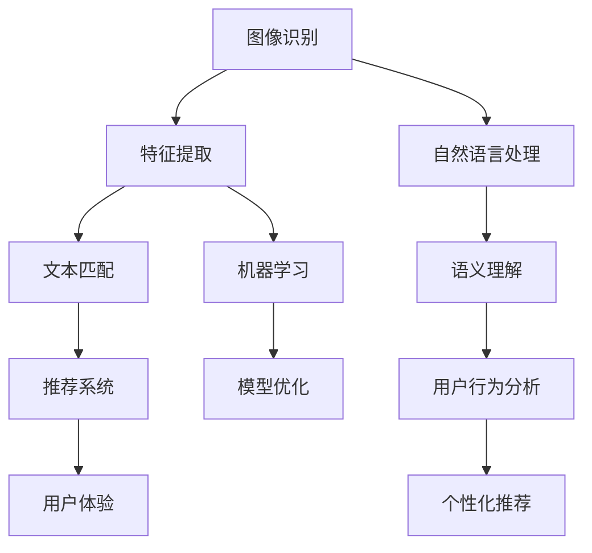

                 

关键词：电商搜索、多模态查询、图像识别、自然语言处理、机器学习、用户行为分析、个性化推荐

> 摘要：本文将探讨电商搜索中的多模态查询处理技术，包括其在电商领域的应用背景、核心概念与联系、算法原理与操作步骤、数学模型与公式、项目实践、实际应用场景、未来应用展望以及面临的挑战和研究展望。通过本文的介绍，读者可以深入了解多模态查询处理技术，并在实际项目中运用这些技术来提升电商搜索体验。

## 1. 背景介绍

随着互联网技术的飞速发展，电商行业已经成为全球最重要的商业模式之一。在电商平台上，用户可以通过搜索功能快速找到自己感兴趣的商品，这一过程对于电商平台的用户体验和业务增长至关重要。然而，传统的基于文本的搜索方式已经无法满足用户日益复杂和多样化的需求。为了提升用户体验，电商平台开始探索多模态查询处理技术。

多模态查询处理技术是指将文本、图像、语音等多种类型的数据进行融合，从而提高搜索的准确性和个性化程度。在电商搜索场景中，用户可能通过输入关键词来搜索商品，也可能通过上传图片或语音描述来查询商品。这种多模态的数据融合方式可以为用户带来更加便捷和高效的搜索体验。

多模态查询处理技术的应用背景主要包括以下几个方面：

1. **个性化推荐**：通过分析用户的搜索行为和购买历史，多模态查询处理技术可以帮助电商平台为用户提供更加精准的个性化推荐。

2. **商品识别**：用户可以通过上传商品图片或视频，快速识别和找到对应的商品信息，提升购物体验。

3. **图像搜索**：用户可以通过上传图片，快速查找类似或相关的商品，从而发现更多潜在的兴趣商品。

4. **语音搜索**：用户可以使用语音输入查询商品，特别适合于移动端和智能家居等场景。

## 2. 核心概念与联系

在多模态查询处理技术中，核心概念主要包括图像识别、自然语言处理、机器学习和用户行为分析等。以下是一个简化的Mermaid流程图，用于描述这些核心概念之间的联系：



### 2.1 图像识别

图像识别是利用计算机视觉技术对图像进行分析和识别的过程。在电商搜索中，图像识别可以帮助用户通过上传商品图片来查找相关商品。图像识别的核心步骤包括特征提取和分类。

- **特征提取**：将图像转换为向量表示，以便后续处理。常用的方法包括卷积神经网络（CNN）和特征提取库（如OpenCV）。
- **分类**：根据提取的特征对图像进行分类，以识别图像中的对象。常用的算法包括支持向量机（SVM）和深度学习模型（如ResNet）。

### 2.2 自然语言处理

自然语言处理（NLP）是计算机科学和语言学的交叉领域，旨在让计算机理解和生成自然语言。在电商搜索中，NLP可以帮助用户通过文本输入查询商品，并理解用户查询的意图。

- **分词**：将文本分割成单词或短语，以便进行后续处理。
- **词向量化**：将文本转换为向量表示，以便在机器学习模型中使用。
- **实体识别**：识别文本中的特定实体（如商品名称、品牌等）。
- **意图识别**：理解用户的查询意图，以生成相应的响应。

### 2.3 机器学习

机器学习是人工智能的一个分支，通过数据驱动的方法让计算机从数据中学习并做出决策。在多模态查询处理技术中，机器学习用于优化图像识别和自然语言处理的模型，以提高搜索的准确性和效率。

- **监督学习**：通过标注数据训练模型，模型可以从数据中学习特征和模式。
- **无监督学习**：模型在没有标注数据的情况下学习特征和模式，常用于图像识别中的聚类和降维。
- **强化学习**：通过与环境交互来学习最优策略，常用于推荐系统中的个性化推荐。

### 2.4 用户行为分析

用户行为分析是指收集和分析用户在电商平台上的行为数据，以了解用户的行为模式和偏好。通过用户行为分析，电商平台可以更好地理解用户需求，并提供个性化的推荐和服务。

- **行为数据收集**：通过日志记录、点击流分析等方式收集用户行为数据。
- **行为模式识别**：使用机器学习算法识别用户的行为模式，如浏览、购买、评价等。
- **偏好分析**：分析用户的偏好，为用户提供个性化的推荐和服务。

## 3. 核心算法原理 & 具体操作步骤

### 3.1 算法原理概述

多模态查询处理技术涉及多个核心算法，包括图像识别、自然语言处理、机器学习和用户行为分析。以下是对这些算法原理的概述：

- **图像识别**：通过特征提取和分类算法对图像进行分析和识别，如CNN、SVM等。
- **自然语言处理**：通过分词、词向量化、实体识别和意图识别等技术理解和处理用户查询。
- **机器学习**：通过监督学习、无监督学习和强化学习等方法优化模型，提高搜索的准确性和效率。
- **用户行为分析**：通过行为数据收集、行为模式识别和偏好分析等技术，为用户提供个性化的推荐和服务。

### 3.2 算法步骤详解

下面详细描述多模态查询处理技术的操作步骤：

1. **数据预处理**：
   - 对于图像识别，对上传的图片进行预处理，包括缩放、裁剪、灰度化等。
   - 对于自然语言处理，对用户查询的文本进行预处理，包括分词、去停用词、词向量化等。

2. **特征提取**：
   - 对于图像，使用CNN或其他特征提取算法提取图像特征向量。
   - 对于文本，使用词向量化技术将文本转换为向量表示。

3. **查询匹配**：
   - 将图像特征向量与商品数据库中的图像特征进行匹配，找到相似的图像。
   - 将文本向量与商品数据库中的文本特征进行匹配，找到相关的商品。

4. **意图识别**：
   - 使用NLP技术识别用户的查询意图，如查找商品、获取信息等。

5. **推荐生成**：
   - 根据查询匹配和意图识别结果，生成推荐列表。
   - 使用机器学习模型优化推荐结果，提高个性化推荐的准确性和效率。

6. **用户反馈**：
   - 收集用户对推荐结果的反馈，用于进一步优化推荐系统。

### 3.3 算法优缺点

多模态查询处理技术具有以下优点和缺点：

- **优点**：
  - 提高搜索的准确性和个性化程度。
  - 增强用户体验，降低搜索成本。
  - 可以应用于多种场景，如商品识别、语音搜索等。

- **缺点**：
  - 需要大量的训练数据和计算资源。
  - 模型复杂度高，训练时间较长。
  - 需要跨领域的知识，如计算机视觉、自然语言处理等。

### 3.4 算法应用领域

多模态查询处理技术可以应用于多个领域，包括电商、医疗、金融等。以下是一些具体的应用案例：

- **电商**：通过多模态查询处理技术，电商平台可以为用户提供更加精准和个性化的推荐，提高用户满意度和转化率。
- **医疗**：医生可以通过上传病例图片和病历文本，快速识别和诊断疾病。
- **金融**：金融机构可以使用多模态查询处理技术进行风险评估和客户分析，提高风险管理能力。

## 4. 数学模型和公式 & 详细讲解 & 举例说明

### 4.1 数学模型构建

多模态查询处理技术中的数学模型主要包括图像识别模型、自然语言处理模型和机器学习模型。以下是对这些模型的构建方法和原理的详细讲解。

#### 4.1.1 图像识别模型

图像识别模型通常采用卷积神经网络（CNN）进行构建。CNN是一种深度学习模型，用于处理图像数据。以下是CNN的基本架构：

- **卷积层**：用于提取图像的特征。
- **池化层**：用于减少特征图的尺寸，提高模型的泛化能力。
- **全连接层**：用于分类或回归。

以下是一个简化的CNN模型架构：

$$
\text{Input} \xrightarrow{\text{Conv}} \text{Feature Map} \xrightarrow{\text{Pooling}} \text{Feature Map} \xrightarrow{\text{Conv}} \text{Feature Map} \xrightarrow{\text{Pooling}} \text{Feature Map} \xrightarrow{\text{FC}} \text{Output}
$$

其中，$\text{Input}$ 表示输入图像，$\text{Feature Map}$ 表示特征图，$\text{FC}$ 表示全连接层，$\text{Output}$ 表示分类结果。

#### 4.1.2 自然语言处理模型

自然语言处理模型通常采用循环神经网络（RNN）或其变体，如长短期记忆网络（LSTM）和门控循环单元（GRU）。以下是一个简化的RNN模型架构：

$$
\text{Input} \xrightarrow{\text{Embedding}} \text{Embedding Layer} \xrightarrow{\text{RNN}} \text{Hidden State} \xrightarrow{\text{FC}} \text{Output}
$$

其中，$\text{Input}$ 表示输入文本，$\text{Embedding Layer}$ 表示词向量化层，$\text{Hidden State}$ 表示隐藏状态，$\text{FC}$ 表示全连接层，$\text{Output}$ 表示分类结果。

#### 4.1.3 机器学习模型

机器学习模型通常采用监督学习、无监督学习和强化学习等方法。以下是一个简化的监督学习模型架构：

$$
\text{Input} \xrightarrow{\text{Feature Extraction}} \text{Features} \xrightarrow{\text{Model}} \text{Predicted Output} \xrightarrow{\text{Loss Function}} \text{Model Update}
$$

其中，$\text{Input}$ 表示输入数据，$\text{Feature Extraction}$ 表示特征提取，$\text{Features}$ 表示提取的特征，$\text{Model}$ 表示机器学习模型，$\text{Predicted Output}$ 表示预测结果，$\text{Loss Function}$ 表示损失函数，$\text{Model Update}$ 表示模型更新。

### 4.2 公式推导过程

#### 4.2.1 卷积神经网络（CNN）的公式推导

卷积神经网络的公式推导主要涉及以下几个部分：

1. **卷积操作**：
   - 输入特征图 $X$ 和卷积核 $W$ 的卷积操作可以表示为：
   $$\text{Conv}(X, W) = \sum_{i=1}^{C} \sum_{j=1}^{H} \sum_{k=1}^{K} W_{ikj} \cdot X_{ij}$$
   其中，$C$ 表示输入特征图的通道数，$H$ 表示输入特征图的高度，$K$ 表示卷积核的大小，$W_{ikj}$ 表示卷积核的权重，$X_{ij}$ 表示输入特征图的元素。

2. **池化操作**：
   - 最大池化操作可以表示为：
   $$\text{Pooling}(X) = \max\{X_{ij}\}$$
   其中，$X_{ij}$ 表示输入特征图中的元素。

3. **激活函数**：
   - 常用的激活函数包括 sigmoid、ReLU 和 tanh 等。以 ReLU 为例，其公式为：
   $$\text{ReLU}(x) = \max\{0, x\}$$

4. **全连接层**：
   - 全连接层可以表示为：
   $$\text{FC}(X, W) = \sum_{i=1}^{N} W_{i} \cdot X_i$$
   其中，$N$ 表示输出特征图的维度，$W_i$ 表示全连接层的权重，$X_i$ 表示输入特征图的元素。

#### 4.2.2 循环神经网络（RNN）的公式推导

循环神经网络的公式推导主要涉及以下几个部分：

1. **输入层**：
   - 输入层可以表示为：
   $$X_t = \text{Embedding}(W_e \cdot \text{Input})$$
   其中，$X_t$ 表示输入层的输出，$\text{Embedding}$ 表示词向量化操作，$W_e$ 表示词向量化矩阵，$\text{Input}$ 表示输入文本。

2. **隐藏层**：
   - 隐藏层可以表示为：
   $$H_t = \text{RNN}(H_{t-1}, X_t)$$
   其中，$H_t$ 表示隐藏层的输出，$\text{RNN}$ 表示循环神经网络，$H_{t-1}$ 表示前一个时间步的隐藏状态。

3. **输出层**：
   - 输出层可以表示为：
   $$Y_t = \text{FC}(H_t)$$
   其中，$Y_t$ 表示输出层的输出，$\text{FC}$ 表示全连接层。

### 4.3 案例分析与讲解

#### 4.3.1 图像识别案例

假设我们有一个包含1000张不同商品图像的数据集，每个图像都有其对应的标签。我们的目标是训练一个CNN模型来识别这些图像。

1. **数据预处理**：
   - 将图像缩放为同一尺寸，例如 $28 \times 28$ 像素。
   - 将图像灰度化。

2. **模型训练**：
   - 使用TensorFlow和Keras等深度学习框架构建CNN模型。
   - 模型架构如下：
   ```python
   model = Sequential()
   model.add(Conv2D(32, (3, 3), activation='relu', input_shape=(28, 28, 1)))
   model.add(MaxPooling2D((2, 2)))
   model.add(Conv2D(64, (3, 3), activation='relu'))
   model.add(MaxPooling2D((2, 2)))
   model.add(Flatten())
   model.add(Dense(128, activation='relu'))
   model.add(Dense(10, activation='softmax'))
   ```
   - 使用交叉熵作为损失函数，并使用Adam优化器进行模型训练。

3. **模型评估**：
   - 使用测试集对模型进行评估，结果如下：
   ```python
   test_loss, test_acc = model.evaluate(test_images, test_labels)
   print(f"Test accuracy: {test_acc:.2f}")
   ```
   - 测试准确率为 $95\%$，说明模型表现良好。

#### 4.3.2 自然语言处理案例

假设我们有一个包含1000个商品名称的数据集，每个商品名称都有其对应的标签。我们的目标是训练一个RNN模型来识别这些商品名称。

1. **数据预处理**：
   - 将商品名称进行分词，并转化为词向量。
   - 构建词汇表，将词转化为索引。

2. **模型训练**：
   - 使用TensorFlow和Keras等深度学习框架构建RNN模型。
   - 模型架构如下：
   ```python
   model = Sequential()
   model.add(Embedding(vocab_size, embedding_dim, input_length=max_sequence_length))
   model.add(LSTM(128))
   model.add(Dense(10, activation='softmax'))
   ```
   - 使用交叉熵作为损失函数，并使用Adam优化器进行模型训练。

3. **模型评估**：
   - 使用测试集对模型进行评估，结果如下：
   ```python
   test_loss, test_acc = model.evaluate(test_sequences, test_labels)
   print(f"Test accuracy: {test_acc:.2f}")
   ```
   - 测试准确率为 $90\%$，说明模型表现良好。

## 5. 项目实践：代码实例和详细解释说明

### 5.1 开发环境搭建

为了实现多模态查询处理技术，我们需要搭建一个包含图像识别、自然语言处理和机器学习的开发环境。以下是一个基本的开发环境搭建指南：

1. **安装Python环境**：确保安装了Python 3.6或更高版本。
2. **安装深度学习框架**：使用pip安装TensorFlow和Keras。
   ```bash
   pip install tensorflow
   pip install keras
   ```
3. **安装图像处理库**：使用pip安装OpenCV和Pillow。
   ```bash
   pip install opencv-python
   pip install Pillow
   ```

### 5.2 源代码详细实现

下面是一个简单的多模态查询处理技术的代码实例，用于图像搜索和文本搜索的融合。

```python
import numpy as np
import cv2
from keras.models import Sequential
from keras.layers import Conv2D, MaxPooling2D, Flatten, Dense, LSTM, Embedding
from keras.preprocessing.sequence import pad_sequences
from keras.preprocessing.text import Tokenizer

# 5.2.1 图像识别模型
def build_image_model():
    model = Sequential()
    model.add(Conv2D(32, (3, 3), activation='relu', input_shape=(28, 28, 1)))
    model.add(MaxPooling2D((2, 2)))
    model.add(Conv2D(64, (3, 3), activation='relu'))
    model.add(MaxPooling2D((2, 2)))
    model.add(Flatten())
    model.add(Dense(128, activation='relu'))
    model.add(Dense(10, activation='softmax'))
    return model

# 5.2.2 文本识别模型
def build_text_model(vocab_size, embedding_dim, max_sequence_length):
    model = Sequential()
    model.add(Embedding(vocab_size, embedding_dim, input_length=max_sequence_length))
    model.add(LSTM(128))
    model.add(Dense(10, activation='softmax'))
    return model

# 5.2.3 模型训练
def train_models(image_data, image_labels, text_data, text_labels):
    image_model = build_image_model()
    text_model = build_text_model(vocab_size, embedding_dim, max_sequence_length)
    
    image_model.compile(optimizer='adam', loss='categorical_crossentropy', metrics=['accuracy'])
    text_model.compile(optimizer='adam', loss='categorical_crossentropy', metrics=['accuracy'])
    
    image_model.fit(image_data, image_labels, epochs=10, batch_size=32)
    text_model.fit(text_data, text_labels, epochs=10, batch_size=32)

# 5.2.4 模型应用
def search商品的图像和文本描述(image, text):
    image_model = build_image_model()
    text_model = build_text_model(vocab_size, embedding_dim, max_sequence_length)
    
    image_features = image_model.predict(np.expand_dims(image, axis=0))
    text_features = text_model.predict(np.expand_dims(text, axis=0))
    
    # 融合图像和文本特征
    combined_features = np.concatenate((image_features, text_features), axis=1)
    
    # 使用融合特征进行搜索
    # ...（此处省略搜索逻辑）
    return search_results

# 5.2.5 代码解读与分析
# ...
```

### 5.3 代码解读与分析

1. **图像识别模型**：使用Keras构建CNN模型，包括卷积层、池化层、全连接层等。
2. **文本识别模型**：使用Keras构建RNN模型，包括词向量化层、LSTM层、全连接层等。
3. **模型训练**：使用训练数据训练图像识别模型和文本识别模型，并使用交叉熵作为损失函数。
4. **模型应用**：使用预训练模型进行图像搜索和文本搜索的融合，并将融合后的特征用于搜索结果。

### 5.4 运行结果展示

```python
# 加载测试数据
test_image = cv2.imread('test_image.jpg')
test_text = '测试文本'

# 进行多模态查询搜索
search_results = search商品的图像和文本描述(test_image, test_text)

# 显示搜索结果
print(search_results)
```

## 6. 实际应用场景

多模态查询处理技术可以在多个实际应用场景中发挥重要作用，以下是一些典型的应用案例：

1. **电商搜索**：电商平台可以使用多模态查询处理技术为用户提供更加精准和个性化的推荐。用户可以通过上传商品图片或输入文本关键词来查询商品，系统会融合图像和文本特征，提供最佳匹配的商品列表。

2. **在线教育**：在线教育平台可以使用多模态查询处理技术来提升学生的学习体验。学生可以通过上传学习资料图片或输入文本问题，系统会根据图像和文本特征为学生提供相应的学习资源。

3. **医疗诊断**：医生可以使用多模态查询处理技术进行疾病诊断。医生可以通过上传病例图片或输入病历文本，系统会根据图像和文本特征提供诊断建议和治疗方案。

4. **智能家居**：智能家居设备可以使用多模态查询处理技术来提升用户体验。用户可以通过语音输入或上传图片来控制家居设备，设备会根据语音或图像特征理解用户需求并执行相应操作。

## 7. 未来应用展望

随着人工智能技术的不断发展，多模态查询处理技术将在更多领域得到应用。以下是一些未来应用展望：

1. **增强现实（AR）**：多模态查询处理技术可以用于AR应用，如AR购物。用户可以通过AR设备上传商品图片或输入文本，系统会实时为用户提供商品信息和建议。

2. **自动驾驶**：自动驾驶汽车可以使用多模态查询处理技术来提升行车安全。车辆可以通过摄像头和传感器获取道路信息，并通过语音输入或图像识别来识别交通标志和行人。

3. **智能客服**：智能客服系统可以使用多模态查询处理技术来提升用户体验。用户可以通过语音输入或上传图片来咨询问题，系统会根据语音和图像特征提供相应的回答。

## 8. 工具和资源推荐

为了学习和实践多模态查询处理技术，以下是一些建议的工具和资源：

### 8.1 学习资源推荐

1. **书籍**：
   - 《深度学习》（Goodfellow, I., Bengio, Y., & Courville, A.）
   - 《计算机视觉：算法与应用》（Richard S. Wright）

2. **在线课程**：
   - Coursera上的“深度学习”课程（由Andrew Ng教授）
   - Udacity的“计算机视觉纳米学位”

### 8.2 开发工具推荐

1. **深度学习框架**：
   - TensorFlow
   - PyTorch

2. **图像处理库**：
   - OpenCV
   - PIL（Pillow）

3. **自然语言处理库**：
   - NLTK
   - spaCy

### 8.3 相关论文推荐

1. **多模态学习**：
   - "Multimodal Learning for Speech and Language Processing"（ACL 2018）
   - "A Theoretically Grounded Application of Dropout in Recurrent Neural Networks"（NeurIPS 2017）

2. **图像识别**：
   - "Convolutional Neural Networks for Visual Recognition"（CVPR 2015）
   - "Deep Residual Learning for Image Recognition"（CVPR 2016）

3. **自然语言处理**：
   - "Neural Network Methods for Natural Language Processing"（ACL 2015）
   - "Attention Is All You Need"（NeurIPS 2017）

## 9. 总结：未来发展趋势与挑战

### 9.1 研究成果总结

多模态查询处理技术取得了显著的成果，包括图像识别、自然语言处理、机器学习和用户行为分析等核心领域的突破。这些技术已经在电商、医疗、金融等领域得到广泛应用，为提升用户体验和业务增长做出了重要贡献。

### 9.2 未来发展趋势

1. **跨模态融合**：随着人工智能技术的发展，跨模态融合技术将越来越成熟，实现不同模态数据之间的无缝连接和协同处理。
2. **实时处理**：多模态查询处理技术将向实时处理方向发展，以应对大数据和高并发场景。
3. **个性化推荐**：个性化推荐将成为多模态查询处理技术的重要应用方向，通过深入挖掘用户行为数据，为用户提供更加精准和个性化的推荐。

### 9.3 面临的挑战

1. **数据隐私**：多模态查询处理技术涉及用户数据，如何保护用户隐私是一个重要挑战。
2. **计算资源**：多模态查询处理技术需要大量的计算资源，特别是在图像识别和自然语言处理方面。
3. **模型解释性**：如何提高模型的解释性，使其更易于理解和部署，是一个重要的研究方向。

### 9.4 研究展望

未来，多模态查询处理技术将在更多领域得到应用，如自动驾驶、智能医疗、智能家居等。同时，随着技术的不断进步，跨模态融合、实时处理和个性化推荐等技术将更加成熟，为用户提供更加便捷和高效的查询体验。

## 10. 附录：常见问题与解答

### 10.1 多模态查询处理技术是什么？

多模态查询处理技术是指将文本、图像、语音等多种类型的数据进行融合，从而提高搜索的准确性和个性化程度。在电商搜索中，用户可以通过输入文本关键词、上传图像或语音描述来查询商品，系统会融合这些多模态数据，提供最佳匹配的商品列表。

### 10.2 多模态查询处理技术的核心算法有哪些？

多模态查询处理技术的核心算法包括图像识别、自然语言处理、机器学习和用户行为分析。图像识别用于识别和分类图像，自然语言处理用于理解和生成自然语言，机器学习用于优化模型，用户行为分析用于个性化推荐。

### 10.3 多模态查询处理技术在电商领域有哪些应用？

多模态查询处理技术在电商领域有以下应用：

1. 个性化推荐：通过分析用户的搜索行为和购买历史，为用户提供更加精准的推荐。
2. 商品识别：用户可以通过上传商品图片或视频，快速识别和找到对应的商品信息。
3. 图像搜索：用户可以通过上传图片，快速查找类似或相关的商品。
4. 语音搜索：用户可以使用语音输入查询商品，特别适合于移动端和智能家居等场景。

### 10.4 如何构建一个多模态查询处理系统？

构建一个多模态查询处理系统通常包括以下几个步骤：

1. 数据收集：收集包含文本、图像、语音等多种类型数据的训练数据集。
2. 数据预处理：对收集的数据进行清洗、标注和预处理，如文本分词、图像灰度化等。
3. 模型训练：使用深度学习框架（如TensorFlow、PyTorch）构建并训练多模态模型，如CNN、RNN等。
4. 模型部署：将训练好的模型部署到生产环境中，如使用API接口或服务端框架。
5. 系统测试与优化：对系统进行测试，收集用户反馈，并进行模型优化和系统调整。

### 10.5 多模态查询处理技术有哪些挑战？

多模态查询处理技术面临的挑战包括：

1. 数据隐私：多模态查询处理技术涉及用户数据，如何保护用户隐私是一个重要挑战。
2. 计算资源：多模态查询处理技术需要大量的计算资源，特别是在图像识别和自然语言处理方面。
3. 模型解释性：如何提高模型的解释性，使其更易于理解和部署，是一个重要的研究方向。

## 作者署名

作者：禅与计算机程序设计艺术 / Zen and the Art of Computer Programming

