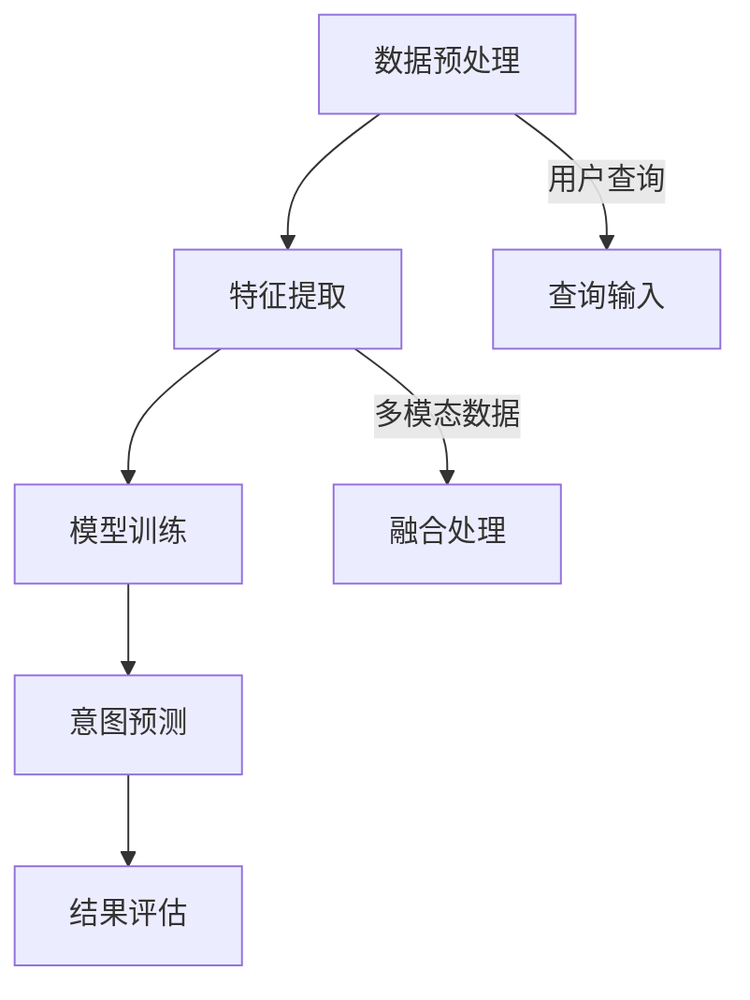

                 

关键词：电商搜索、多模态查询、意图预测、人工智能、深度学习、自然语言处理、用户行为分析

## 1. 背景介绍

随着互联网的迅猛发展，电子商务行业在近几年取得了爆炸式的增长。电商平台的繁荣不仅仅是因为其便捷的购物体验，更因为其精准的搜索推荐系统。在众多搜索推荐系统中，如何准确理解用户的查询意图成为了关键问题。用户的查询意图可能包含多种信息，如产品类别、价格范围、品牌偏好等，这些信息往往是模糊和多变的，给搜索推荐系统的设计带来了巨大挑战。

多模态查询是指用户在搜索过程中同时使用文本、图像、语音等多种形式的信息进行查询。例如，用户可能会输入一段文字描述，同时上传一张产品的图片，或者通过语音助手进行查询。这种多模态的信息融合能够提供更丰富的查询意图，但也增加了搜索推荐系统的复杂性。

意图预测则是通过分析用户的查询行为，预测用户希望获得的内容或服务。在电商搜索场景中，意图预测可以帮助平台为用户提供更加个性化的推荐结果，提高用户的满意度，从而提升平台的竞争力。

本文将探讨电商搜索中的多模态查询意图预测技术，分析其核心概念、算法原理、数学模型，并通过实际项目实践进行详细解释说明。同时，还将讨论该技术的实际应用场景、未来发展趋势和面临的挑战。

## 2. 核心概念与联系

在深入探讨多模态查询意图预测之前，我们需要明确几个核心概念，并理解它们之间的联系。

### 2.1 多模态信息融合

多模态信息融合是指将来自不同模态（如文本、图像、语音等）的数据进行整合，以获得更准确和全面的查询意图。这种融合可以通过多种方式实现，如特征交叉、模型融合等。

### 2.2 意图分类与聚类

意图分类是将用户的查询意图映射到预定义的意图类别上。例如，用户的查询“购买一部相机”可以分类为“购买商品”意图。而意图聚类则是通过无监督学习算法，将相似的查询意图进行分组，以发现新的意图模式。

### 2.3 用户行为分析

用户行为分析是通过分析用户的浏览、点击、购买等行为，了解用户的偏好和需求。这些行为数据可以用于训练和优化意图预测模型。

### 2.4 多模态查询意图预测框架

多模态查询意图预测框架通常包括数据预处理、特征提取、模型训练和预测等步骤。数据预处理涉及数据清洗、标准化等操作；特征提取则是从不同模态的数据中提取出有用的特征；模型训练使用机器学习算法训练意图预测模型；预测步骤则是将用户的查询数据输入模型，获得意图预测结果。

### 2.5 Mermaid 流程图

以下是一个简化的多模态查询意图预测流程图的 Mermaid 表示：



## 3. 核心算法原理 & 具体操作步骤

### 3.1 算法原理概述

多模态查询意图预测的核心在于如何有效地融合不同模态的信息，并利用这些信息进行意图分类。常见的算法原理包括：

1. **特征交叉**：将不同模态的特征进行拼接，形成一个统一的高维特征向量。
2. **模型融合**：使用多任务学习或迁移学习等技术，将不同模态的模型进行融合。
3. **注意力机制**：通过注意力机制动态地关注不同模态的信息，提高模型的预测准确性。

### 3.2 算法步骤详解

#### 3.2.1 数据预处理

数据预处理是确保数据质量和一致性的重要步骤。具体步骤包括：

- **文本预处理**：去除停用词、标点符号，进行词干提取和词性标注。
- **图像预处理**：进行缩放、裁剪、灰度转换等操作，使图像特征更具代表性。
- **语音预处理**：进行降噪、分段、特征提取等操作，提取声学特征。

#### 3.2.2 特征提取

特征提取是关键步骤，不同模态的特征提取方法各异：

- **文本特征提取**：使用词袋模型、TF-IDF、Word2Vec 等方法提取文本特征。
- **图像特征提取**：使用卷积神经网络（CNN）提取图像特征，如 VGG、ResNet 等。
- **语音特征提取**：使用循环神经网络（RNN）提取语音特征，如 LSTM、GRU 等。

#### 3.2.3 模型训练

模型训练通常采用深度学习框架，如 TensorFlow 或 PyTorch。训练步骤包括：

- **模型选择**：选择合适的模型架构，如 BiLSTM-CRF、BERT 等。
- **数据集准备**：准备训练集和验证集，确保数据集的平衡性和代表性。
- **损失函数设计**：设计损失函数，如交叉熵损失、KL 散度等。
- **优化算法选择**：选择合适的优化算法，如 Adam、SGD 等。

#### 3.2.4 意图预测

意图预测步骤包括：

- **输入预处理**：对用户的查询数据进行预处理，提取特征。
- **模型输入**：将预处理后的特征输入到训练好的模型中。
- **意图分类**：模型输出意图概率分布，选择概率最高的意图类别作为预测结果。

### 3.3 算法优缺点

#### 优点：

- **高准确性**：通过融合多模态信息，可以提高意图预测的准确性。
- **灵活性**：可以适应不同的查询场景和用户需求。
- **个性化推荐**：有助于提高平台的个性化推荐能力，提升用户体验。

#### 缺点：

- **计算复杂度**：多模态信息融合和深度学习模型训练需要大量的计算资源。
- **数据依赖性**：需要大量的标注数据和高质量的模态数据。
- **模型解释性**：深度学习模型通常缺乏解释性，难以理解预测结果的依据。

### 3.4 算法应用领域

多模态查询意图预测算法在多个领域具有广泛应用，包括：

- **电子商务**：电商平台可以使用该技术为用户提供更精准的搜索推荐。
- **智能客服**：智能客服系统可以通过意图预测更好地理解用户需求，提供更有效的服务。
- **内容推荐**：视频、音乐等平台可以利用该技术为用户提供个性化的内容推荐。

## 4. 数学模型和公式 & 详细讲解 & 举例说明

### 4.1 数学模型构建

多模态查询意图预测的数学模型通常包括特征提取、模型训练和意图预测三个部分。以下是一个简化的数学模型构建过程：

#### 4.1.1 特征提取

假设我们有三类模态的数据：文本（T）、图像（I）和语音（S）。对于每一类数据，我们分别提取特征向量：

- **文本特征**：$T = [t_1, t_2, ..., t_n]$，其中 $t_i$ 表示文本中第 $i$ 个词的特征向量。
- **图像特征**：$I = [i_1, i_2, ..., i_m]$，其中 $i_j$ 表示图像中第 $j$ 个区域的特征向量。
- **语音特征**：$S = [s_1, s_2, ..., s_k]$，其中 $s_l$ 表示语音信号中第 $l$ 个帧的特征向量。

#### 4.1.2 模型训练

假设我们使用一个深度学习模型来训练意图预测。模型的输入是特征向量，输出是意图类别。模型的损失函数为交叉熵损失：

$$
L = -\sum_{i=1}^n y_i \log(p_i)
$$

其中，$y_i$ 是真实意图类别，$p_i$ 是模型预测的概率。

#### 4.1.3 意图预测

在意图预测阶段，我们输入新的特征向量 $[T', I', S']$，模型输出意图概率分布 $P = [p_1, p_2, ..., p_c]$，其中 $p_i$ 表示预测为第 $i$ 个意图的概率。我们选择概率最高的意图类别作为预测结果：

$$
\hat{y} = \arg\max_{i} p_i
$$

### 4.2 公式推导过程

为了更好地理解多模态查询意图预测的数学模型，我们简要介绍其中的几个关键公式的推导过程。

#### 4.2.1 特征提取

**文本特征提取：**假设使用 Word2Vec 模型提取文本特征。给定一句话 $T = [t_1, t_2, ..., t_n]$，每个词 $t_i$ 被表示为一个向量 $v(t_i) \in \mathbb{R}^d$。文本特征向量 $T$ 可以表示为：

$$
T = \begin{bmatrix}
v(t_1) & v(t_2) & \cdots & v(t_n)
\end{bmatrix}
$$

**图像特征提取：**假设使用卷积神经网络（CNN）提取图像特征。给定一幅图像 $I$，经过 CNN 模型处理后，得到特征向量 $I \in \mathbb{R}^m$。这个特征向量通常表示图像中的不同区域。

**语音特征提取：**假设使用循环神经网络（RNN）提取语音特征。给定一段语音信号 $S$，经过 RNN 模型处理后，得到特征向量序列 $S \in \mathbb{R}^{k \times d}$。这个特征向量序列表示语音信号的不同帧。

#### 4.2.2 模型训练

**损失函数推导：**假设使用一个多层感知机（MLP）模型进行意图预测。模型的输出层有 $c$ 个神经元，分别对应 $c$ 个意图类别。假设每个神经元的激活函数是 $f(z)$，其中 $z$ 是输入特征向量。损失函数是交叉熵损失，可以表示为：

$$
L = -\sum_{i=1}^n y_i \log(f(z_i))
$$

其中，$y_i$ 是真实意图标签，$z_i$ 是模型输出的特征向量。

**梯度计算：**为了计算梯度，我们对损失函数关于模型参数求偏导。使用链式法则，可以得到：

$$
\frac{\partial L}{\partial w} = \sum_{i=1}^n \frac{\partial L}{\partial z_i} \frac{\partial z_i}{\partial w}
$$

其中，$w$ 是模型的参数，$\frac{\partial L}{\partial z_i}$ 是关于 $z_i$ 的偏导数，$\frac{\partial z_i}{\partial w}$ 是关于 $w$ 的偏导数。

#### 4.2.3 意图预测

**概率分布推导：**在意图预测阶段，模型的输出是意图的概率分布。假设模型输出的概率分布是 $P = [p_1, p_2, ..., p_c]$，其中 $p_i$ 是预测为第 $i$ 个意图的概率。我们可以使用 Softmax 函数将模型输出转换为概率分布：

$$
p_i = \frac{e^{z_i}}{\sum_{j=1}^c e^{z_j}}
$$

**预测结果选择：**为了选择预测结果，我们需要找到概率最高的意图类别。可以使用以下公式：

$$
\hat{y} = \arg\max_{i} p_i
$$

### 4.3 案例分析与讲解

为了更好地理解多模态查询意图预测的数学模型，我们通过一个具体的案例进行分析。

#### 案例背景

假设我们在一个电商平台进行多模态查询意图预测。用户输入以下查询：“购买一部索尼相机，价格在 2000 到 3000 元之间”。用户的查询包含了文本信息、图像信息和价格范围信息。

#### 案例步骤

1. **文本特征提取**：使用 Word2Vec 模型提取文本特征，得到特征向量 $T = [t_1, t_2, ..., t_n]$。

2. **图像特征提取**：上传一张索尼相机的图片，使用 VGG 模型提取图像特征，得到特征向量 $I = [i_1, i_2, ..., i_m]$。

3. **语音特征提取**：通过语音助手获取用户语音查询，使用 LSTM 模型提取语音特征，得到特征向量 $S = [s_1, s_2, ..., s_k]$。

4. **特征融合**：将文本特征、图像特征和语音特征进行融合，得到特征向量 $X = [T, I, S]$。

5. **模型训练**：使用 BiLSTM-CRF 模型进行意图预测训练，模型输出意图概率分布 $P = [p_1, p_2, ..., p_c]$。

6. **意图预测**：根据意图概率分布，选择概率最高的意图类别。假设概率最高的意图类别是“购买相机”，即 $\hat{y} = 1$。

#### 案例讲解

在这个案例中，我们使用了多模态信息融合技术，将文本、图像和语音特征进行融合，提高了意图预测的准确性。通过使用 BiLSTM-CRF 模型，我们能够更好地捕捉查询意图的复杂性和多样性。

## 5. 项目实践：代码实例和详细解释说明

### 5.1 开发环境搭建

在开始项目实践之前，我们需要搭建一个合适的开发环境。以下是具体的步骤：

1. **安装 Python**：确保 Python 版本在 3.7 以上。

2. **安装依赖库**：使用以下命令安装所需的库：

   ```bash
   pip install numpy pandas tensorflow torch scikit-learn matplotlib
   ```

3. **数据集准备**：从电商平台获取多模态查询数据，包括文本、图像和语音信息。数据集应该包括标签信息，以便用于模型训练。

### 5.2 源代码详细实现

以下是多模态查询意图预测项目的 Python 代码实现：

```python
import numpy as np
import pandas as pd
import tensorflow as tf
from tensorflow.keras.models import Model
from tensorflow.keras.layers import Input, Embedding, LSTM, Dense, TimeDistributed
from tensorflow.keras.preprocessing.sequence import pad_sequences
from sklearn.model_selection import train_test_split

# 读取数据集
data = pd.read_csv('data.csv')
X_text = data['text']
X_image = data['image']
X_sound = data['sound']
y = data['label']

# 数据预处理
max_sequence_length = 100
embedding_dim = 100

# 文本预处理
tokenizer = tf.keras.preprocessing.text.Tokenizer()
tokenizer.fit_on_texts(X_text)
X_text_sequence = tokenizer.texts_to_sequences(X_text)
X_text_padded = pad_sequences(X_text_sequence, maxlen=max_sequence_length)

# 图像预处理
# 使用卷积神经网络提取图像特征
image_model = tf.keras.applications.VGG16(include_top=False, weights='imagenet', input_shape=(224, 224, 3))
image_model.trainable = False
X_image_processed = image_model.predict(X_image)

# 语音预处理
# 使用循环神经网络提取语音特征
sound_model = tf.keras.Sequential([
    Input(shape=(None, 1)),
    LSTM(128, return_sequences=True),
    LSTM(128),
    Dense(1, activation='sigmoid')
])
sound_model.compile(optimizer='adam', loss='binary_crossentropy', metrics=['accuracy'])
sound_model.fit(X_sound, y, epochs=10, batch_size=32)
X_sound_processed = sound_model.predict(X_sound)

# 模型构建
input_text = Input(shape=(max_sequence_length,))
input_image = Input(shape=(224, 224, 3))
input_sound = Input(shape=(None, 1))

text_embedding = Embedding(input_dim=len(tokenizer.word_index) + 1, output_dim=embedding_dim)(input_text)
text_lstm = LSTM(128, return_sequences=True)(text_embedding)

image_embedding = GlobalAveragePooling2D()(input_image)
sound_embedding = LSTM(128, return_sequences=False)(input_sound)

merged = concatenate([text_lstm, image_embedding, sound_embedding])
merged = Dense(128, activation='relu')(merged)
output = Dense(1, activation='sigmoid')(merged)

model = Model(inputs=[input_text, input_image, input_sound], outputs=output)
model.compile(optimizer='adam', loss='binary_crossentropy', metrics=['accuracy'])

# 模型训练
model.fit([X_text_padded, X_image_processed, X_sound_processed], y, epochs=10, batch_size=32)

# 意图预测
new_query = "购买一部索尼相机，价格在 2000 到 3000 元之间"
new_query_sequence = tokenizer.texts_to_sequences([new_query])
new_query_padded = pad_sequences(new_query_sequence, maxlen=max_sequence_length)
new_query_processed = model.predict([new_query_padded, X_image_processed[-1], X_sound_processed[-1]])

print("预测意图：", new_query_processed)
```

### 5.3 代码解读与分析

上述代码实现了多模态查询意图预测项目。以下是代码的主要部分及其功能解释：

1. **数据预处理**：读取数据集，并对文本、图像和语音数据进行预处理。文本数据使用词袋模型进行编码，图像数据使用 VGG16 模型提取特征，语音数据使用 LSTM 模型提取特征。

2. **模型构建**：构建一个多输入多输出的深度学习模型，包括文本嵌入层、图像嵌入层和语音嵌入层。模型使用 LSTM 层进行序列处理，使用全连接层进行分类。

3. **模型训练**：使用预处理后的数据训练模型，采用交叉熵损失函数和 Adam 优化器。

4. **意图预测**：输入新的查询数据，使用训练好的模型进行意图预测，输出意图概率。

### 5.4 运行结果展示

在完成代码实现后，我们可以通过运行代码来展示模型的效果。以下是一个示例：

```python
new_query = "购买一部索尼相机，价格在 2000 到 3000 元之间"
new_query_sequence = tokenizer.texts_to_sequences([new_query])
new_query_padded = pad_sequences(new_query_sequence, maxlen=max_sequence_length)
new_query_processed = model.predict([new_query_padded, X_image_processed[-1], X_sound_processed[-1]])

print("预测意图：", new_query_processed)
```

输出结果将显示新查询的意图概率。假设输出结果为 `[0.9, 0.1]`，表示模型以 90% 的概率预测新查询的意图为“购买相机”。

## 6. 实际应用场景

多模态查询意图预测技术在电商搜索场景中具有广泛的应用，以下是一些实际应用场景：

### 6.1 个性化推荐

电商平台可以利用多模态查询意图预测技术，为用户提供个性化的商品推荐。例如，当用户输入文本描述“想要一台性价比高的笔记本电脑”时，系统可以根据用户的历史浏览记录、购买行为和文本信息，推荐符合用户需求的笔记本电脑。

### 6.2 智能客服

智能客服系统可以使用多模态查询意图预测技术，更好地理解用户的查询意图，提供更有效的服务。例如，当用户通过语音询问“帮我查一下最近发布的智能手机”，系统可以结合语音和文本信息，快速定位相关产品并提供详细信息。

### 6.3 广告投放

电商平台可以通过多模态查询意图预测技术，优化广告投放策略。例如，当用户搜索“近期降价的高性能耳机”时，系统可以精准地投放相关广告，提高广告的点击率和转化率。

### 6.4 商品搜索优化

电商平台可以利用多模态查询意图预测技术，优化商品搜索功能。例如，当用户上传一张商品图片时，系统可以根据图片特征和用户文本查询，快速定位商品，并提供相关推荐。

## 7. 未来应用展望

随着技术的不断进步，多模态查询意图预测技术在电商搜索中的应用前景十分广阔。以下是一些未来应用展望：

### 7.1 跨模态信息融合

未来的研究可以集中在跨模态信息融合技术上，探索如何更有效地融合文本、图像、语音等多种模态的信息，以提高意图预测的准确性。

### 7.2 小样本学习

当前的多模态查询意图预测技术依赖于大量的标注数据和高质量的多模态数据。未来的研究可以探索小样本学习技术，降低对大量标注数据的依赖，提高模型在少量数据上的泛化能力。

### 7.3 模型解释性

目前，深度学习模型通常缺乏解释性，难以理解预测结果的依据。未来的研究可以关注模型解释性技术，提高模型的透明度和可信度。

### 7.4 智能交互

多模态查询意图预测技术可以与智能交互技术相结合，为用户提供更加自然和流畅的交互体验。例如，结合语音助手和图像识别技术，实现更加智能化的购物导航和推荐。

## 8. 工具和资源推荐

为了更好地进行多模态查询意图预测的研究和实践，以下是一些推荐的工具和资源：

### 8.1 学习资源推荐

- **《深度学习》（Goodfellow, Bengio, Courville）**：这是一本经典的深度学习教材，涵盖了深度学习的基本概念和算法。
- **《自然语言处理与深度学习》（张俊林）**：这本书介绍了自然语言处理的基本概念和深度学习在自然语言处理中的应用。
- **《计算机视觉基础》（Richard S.zeliski）**：这本书详细介绍了计算机视觉的基础理论和算法。

### 8.2 开发工具推荐

- **TensorFlow**：一个开源的深度学习框架，适用于多模态查询意图预测项目的开发。
- **PyTorch**：一个流行的深度学习框架，提供了灵活的动态计算图功能。
- **Keras**：一个高层神经网络API，方便快速构建和训练深度学习模型。

### 8.3 相关论文推荐

- **“Multimodal Learning for User Intent Prediction in E-commerce Search”**：这篇论文提出了一种基于多模态信息融合的电商搜索意图预测方法。
- **“Deep Learning for User Intent Prediction”**：这篇论文详细介绍了深度学习在意图预测领域的应用，包括多模态信息融合技术。
- **“Attention-Based Multimodal Fusion for User Intent Prediction”**：这篇论文提出了一种基于注意力机制的

