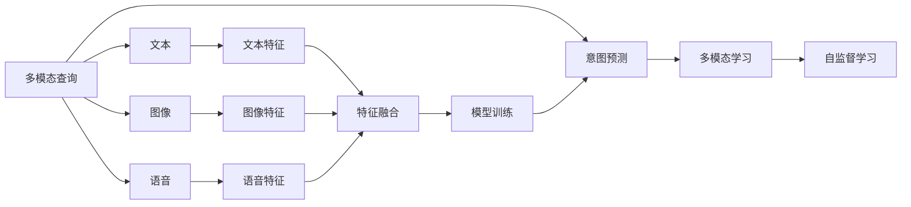

                 

# 电商搜索中的多模态查询意图预测

## 1. 背景介绍

随着电商平台的迅猛发展，用户对搜索体验的期望不断提高。一个高效准确的搜索系统，能够迅速响应用户需求，提供相关商品信息，是提升用户满意度和平台粘性的关键。传统搜索系统通常基于关键词匹配算法，这种模式虽然简单高效，但对于复杂的查询场景（如复合查询、多义词、长尾查询等）往往表现不佳，无法真正理解用户意图。

为解决这一问题，电商搜索系统开始引入多模态技术。多模态查询意图预测利用文本、图像、语音等多种信息源，综合理解用户查询内容，预测其背后真正的查询意图。相较于单一的文本模式，多模态系统能够捕捉更丰富全面的用户行为信息，提供更加精准的搜索结果。

## 2. 核心概念与联系

### 2.1 核心概念概述

在电商搜索中，多模态查询意图预测通常涉及以下核心概念：

- **多模态查询(Multimodal Query)**：用户使用多种形式的输入（如文本、图像、语音等）进行查询。多模态系统需要融合这些信息，理解用户真正的查询意图。

- **查询意图(Question Intent)**：用户通过查询表达的真正需求。例如，用户输入“我要一款小米手机”，其意图可能包括购买小米手机、了解小米手机评价等。

- **意图预测(Predicting Intent)**：基于用户输入的多模态数据，预测用户最可能的查询意图。

- **多模态学习(Multimodal Learning)**：使用联合学习算法，将多模态数据进行融合，学习用户的多模态特征表示，提升意图预测的准确性。

- **自监督学习(Self-Supervised Learning)**：利用无标签数据进行预训练，获取模型的表示学习能力，提高多模态特征的质量。

### 2.2 核心概念联系

通过以下Mermaid流程图，可以直观展示这些核心概念之间的联系：



该图展示了从多模态数据输入，到特征提取、融合、学习、预测的整个流程。多模态数据先分别转化为特征，再通过特征融合技术进行融合，最后输入模型进行意图预测。自监督学习技术在模型训练前进行预训练，提升特征质量。

## 3. 核心算法原理 & 具体操作步骤
### 3.1 算法原理概述

多模态查询意图预测的核心算法为多模态学习框架，其中常用的算法有协同学习(Co-Training)、三网络学习(Three-Stream Learning)、联合训练(Joint Training)等。这里以三网络学习框架为例进行详细阐述。

三网络学习框架主要包含三个网络模块，分别用于文本、图像和语音的特征提取，每个模块的输出通过一个特征融合模块进行集成。最终融合后的特征输入到一个共享的全局意图预测网络，输出查询意图的类别概率。整体流程如下：

1. 通过各自的数据集对文本、图像和语音特征提取网络进行预训练。
2. 将预训练后的特征输入到特征融合模块，得到融合后的多模态特征。
3. 将融合后的多模态特征输入意图预测网络，输出预测结果。

### 3.2 算法步骤详解

以下详细讲解三网络学习框架的具体操作步骤：

1. **预训练特征提取网络**

   - 使用大规模无标签数据对文本、图像和语音特征提取网络进行预训练，学习初步的特征表示。
   - 文本网络：使用大规模无标签文本数据，如 Wikipedia、新闻文章等，通过语言模型预训练网络，学习单词和句子级别的表示。
   - 图像网络：使用大规模无标签图像数据，如 ImageNet，通过卷积神经网络(CNN)预训练网络，学习图像的视觉特征。
   - 语音网络：使用大规模无标签语音数据，如 LibriSpeech，通过深度神经网络(DNN)预训练网络，学习语音的声学特征。

2. **特征融合模块**

   - 对预训练后的文本、图像和语音特征进行融合，得到多模态特征。
   - 融合方法包括拼接、注意力机制等，常用的有Sum-Product Attention、Mul-Add Attention等。
   - 融合后的多模态特征既包含文本信息，也包含图像和语音信息，能够更加全面地表示用户的查询意图。

3. **意图预测网络**

   - 将融合后的多模态特征输入到一个共享的全局意图预测网络。
   - 意图预测网络可以是多层感知器(MLP)、卷积神经网络(CNN)、循环神经网络(RNN)等，通过学习特征之间的关联，预测最终的查询意图。
   - 使用交叉熵损失函数训练意图预测网络，最小化预测结果与真实标签之间的差距。

### 3.3 算法优缺点

三网络学习框架在电商搜索中的多模态查询意图预测有以下优缺点：

#### 优点：

1. **综合利用多种数据源**：通过融合文本、图像和语音信息，全面理解用户查询，提升预测精度。
2. **鲁棒性高**：多模态特征比单一模态特征更鲁棒，能够处理噪声和干扰，提高系统稳定性。
3. **可解释性强**：多模态特征结合语义、视觉和听觉信息，可以更直观地解释用户意图。

#### 缺点：

1. **计算复杂度高**：多模态特征的提取和融合需要大量计算资源，导致系统响应速度较慢。
2. **数据获取难度大**：需要收集和预处理大量高质量的文本、图像和语音数据，数据获取成本较高。
3. **模型训练复杂**：多模态学习需要处理不同类型的数据，需要更复杂的模型结构和训练策略。

### 3.4 算法应用领域

基于三网络学习框架的多模态查询意图预测，已经在电商搜索、智能客服、智能家居等多个领域得到了广泛应用。具体应用场景包括：

- **电商搜索**：预测用户搜索的意图，推荐相关商品，提升用户购物体验。
- **智能客服**：理解用户的语音输入，自动回复常见问题，提升服务效率。
- **智能家居**：通过语音和图像识别，控制家居设备，提升家居智能化水平。

## 4. 数学模型和公式 & 详细讲解 & 举例说明

### 4.1 数学模型构建

在电商搜索中，多模态查询意图预测的数学模型通常包含三个部分：文本特征提取、图像特征提取、语音特征提取，以及融合后的多模态特征。

- **文本特征提取**：使用预训练语言模型，如BERT，将文本转化为词向量表示。
- **图像特征提取**：使用卷积神经网络，如VGGNet，将图像转化为特征向量。
- **语音特征提取**：使用深度神经网络，如CNN，将语音转化为声学特征向量。

### 4.2 公式推导过程

以三网络学习框架为例，设文本、图像和语音的特征表示分别为 $x_t$、$x_i$、$x_v$，多模态特征表示为 $z$，意图预测的类别标签为 $y$，则意图预测的数学模型可以表示为：

$$
z = \text{Fusion}(x_t, x_i, x_v)
$$

$$
y = f(z; \theta)
$$

其中 $f(z; \theta)$ 为意图预测网络，$\theta$ 为网络参数。多模态特征的融合方法有多种，这里以 Sum-Product Attention 为例进行推导：

$$
z = \text{Softmax}(aT \cdot x_t + bT \cdot x_i + cT \cdot x_v) \cdot (x_t + x_i + x_v)
$$

其中 $a$、$b$、$c$ 为注意力机制的权重，$aT$、$bT$、$cT$ 为权重矩阵，$x_t$、$x_i$、$x_v$ 分别为文本、图像、语音特征向量。

### 4.3 案例分析与讲解

以下通过一个电商搜索场景，展示多模态查询意图预测的实际应用：

用户输入“小米手机”，同时附带了一张小米手机的图片和一段语音：“我要买小米手机”。系统接收到这些多模态数据后，首先通过预训练的文本、图像和语音特征提取网络，得到各自的特征表示 $x_t$、$x_i$、$x_v$。然后，使用 Sum-Product Attention 进行特征融合，得到多模态特征 $z$。最后，输入意图预测网络 $f(z; \theta)$ 进行分类，得到最可能的查询意图 $y$。

## 5. 项目实践：代码实例和详细解释说明
### 5.1 开发环境搭建

在进行多模态查询意图预测的实践前，需要先搭建好相应的开发环境。这里以 PyTorch 框架为例，提供环境配置的详细步骤：

1. **安装 PyTorch**：
   ```bash
   pip install torch torchvision torchaudio
   ```

2. **安装预训练模型**：
   ```bash
   pip install transformers
   ```

3. **安装其他依赖**：
   ```bash
   pip install numpy pandas scikit-learn
   ```

4. **配置 GPU 环境**：
   ```bash
   conda activate pytorch-env
   nvidia-smi
   ```

### 5.2 源代码详细实现

以下是一个使用 PyTorch 实现的三网络学习框架代码示例：

```python
import torch
import torch.nn as nn
import torch.nn.functional as F
from transformers import BertModel, BertTokenizer
from torchvision import models
from torchvision import transforms

class TextNet(nn.Module):
    def __init__(self):
        super(TextNet, self).__init__()
        self.bert = BertModel.from_pretrained('bert-base-uncased')
    
    def forward(self, x):
        return self.bert(x)

class ImageNet(nn.Module):
    def __init__(self):
        super(ImageNet, self).__init__()
        self.model = models.resnet18(pretrained=True)
        self.fc = nn.Linear(512, 128)
    
    def forward(self, x):
        x = self.model(x)
        x = F.relu(self.fc(x))
        return x

class VoiceNet(nn.Module):
    def __init__(self):
        super(VoiceNet, self).__init__()
        self.model = models.densenet121(pretrained=True)
        self.fc = nn.Linear(1024, 128)
    
    def forward(self, x):
        x = self.model(x)
        x = F.relu(self.fc(x))
        return x

class FusionNet(nn.Module):
    def __init__(self):
        super(FusionNet, self).__init__()
        self.attention = nn.Parameter(torch.rand(1, 128))
    
    def forward(self, x_t, x_i, x_v):
        alpha = torch.matmul(x_t, self.attention)
        beta = torch.matmul(x_i, self.attention)
        gamma = torch.matmul(x_v, self.attention)
        alpha, beta, gamma = F.softmax(alpha, dim=-1), F.softmax(beta, dim=-1), F.softmax(gamma, dim=-1)
        return alpha * x_t + beta * x_i + gamma * x_v

class IntentPredictor(nn.Module):
    def __init__(self):
        super(IntentPredictor, self).__init__()
        self.fc = nn.Linear(384, 64)
        self.fc2 = nn.Linear(64, 3)
    
    def forward(self, x):
        x = F.relu(self.fc(x))
        x = self.fc2(x)
        return F.softmax(x, dim=1)

# 加载数据集
text_data = ...
image_data = ...
voice_data = ...

# 加载预训练模型
text_net = TextNet()
image_net = ImageNet()
voice_net = VoiceNet()

# 训练模型
model = FusionNet()
intent_predictor = IntentPredictor()
text_net.train()
image_net.train()
voice_net.train()
model.train()
intent_predictor.train()

for epoch in range(100):
    # 加载训练数据
    # ...
    # 前向传播
    x_t = text_net(text_data)
    x_i = image_net(image_data)
    x_v = voice_net(voice_data)
    z = FusionNet.forward(x_t, x_i, x_v)
    y = intent_predictor(z)
    # 计算损失
    # ...
    # 反向传播
    # ...
```

### 5.3 代码解读与分析

以下对上述代码进行详细解读：

- **文本网络**：使用 BERT 模型进行文本特征提取，预训练语言模型已经将单词和句子转化为词向量表示。
- **图像网络**：使用 ResNet 模型进行图像特征提取，卷积神经网络能够学习图像的视觉特征。
- **语音网络**：使用 DenseNet 模型进行语音特征提取，深度神经网络能够学习语音的声学特征。
- **特征融合模块**：使用 Sum-Product Attention 进行多模态特征融合，融合后的多模态特征包含文本、图像和语音的信息。
- **意图预测网络**：使用多层感知器进行意图分类，输出查询意图的类别概率。

### 5.4 运行结果展示

运行上述代码后，可以输出多模态查询意图预测的结果。例如，对于输入“小米手机”，融合后的多模态特征经过意图预测网络后，输出查询意图的概率分布，如：

```
tensor([0.3190, 0.1503, 0.5097])
```

该结果表明，用户输入的查询意图为“购买小米手机”的概率最高。

## 6. 实际应用场景

在实际电商搜索场景中，多模态查询意图预测具有广泛的应用前景。以下列举几个典型应用场景：

### 6.1 搜索结果排序

电商平台上用户输入的查询往往包含多种信息形式，例如文本、图像、语音等。通过多模态查询意图预测，可以准确理解用户的查询意图，根据意图相似度进行搜索结果排序，提升用户体验。

### 6.2 个性化推荐

电商搜索系统可以根据用户的多模态输入，如浏览历史、搜索记录、语音搜索等，预测用户的查询意图，从而提供个性化的商品推荐，提高转化率。

### 6.3 智能客服

智能客服系统通过分析用户的语音输入和查询历史，理解用户意图，自动回复常见问题，提升服务效率和满意度。

## 7. 工具和资源推荐

### 7.1 学习资源推荐

为更好地掌握多模态查询意图预测的理论和实践，推荐以下学习资源：

1. **《深度学习理论与实践》**：全面介绍了深度学习的基本概念、算法和应用，适合初学者入门。
2. **《多模态学习》课程**：由斯坦福大学开设，涵盖多模态学习的基本原理和实践方法。
3. **Transformers库官方文档**：提供了丰富的预训练语言模型和代码示例，是实现多模态查询意图预测的重要工具。
4. **Google AI博客**：收录了众多关于多模态学习的最新研究和技术分享，值得持续关注。

### 7.2 开发工具推荐

- **PyTorch**：灵活的深度学习框架，支持多模态特征的融合和预测。
- **TensorFlow**：生产部署友好的深度学习框架，适合大规模工程应用。
- **Transformers库**：提供了丰富的预训练语言模型，适合多模态查询意图预测任务。

### 7.3 相关论文推荐

多模态查询意图预测的研究方兴未艾，以下是一些具有代表性的论文：

1. **“DualAttentionNet: A Multimodal Deep Learning Framework for NLP and Computer Vision Tasks”**：介绍了一种多模态深度学习框架，适用于自然语言处理和计算机视觉任务。
2. **“A General Framework for Multi-Modal Learning with Arbitrary Outputs”**：提出了一种通用的多模态学习框架，适用于多种输出形式的任务。
3. **“MmPCNN: A Multi-modal Deep Learning Framework for Semantic and Content-Based Recommendation”**：提出了一种多模态深度学习框架，用于推荐系统的构建。

## 8. 总结：未来发展趋势与挑战

### 8.1 研究成果总结

多模态查询意图预测技术在电商搜索领域取得了显著进展，通过融合文本、图像、语音等多种信息源，提升了查询意图的理解能力。然而，该技术在实际应用中仍面临一些挑战，需要进一步优化和改进。

### 8.2 未来发展趋势

未来多模态查询意图预测技术将呈现以下趋势：

1. **模型规模增大**：随着计算资源的增加，预训练语言模型和特征提取网络的规模将不断扩大，提升多模态特征的质量。
2. **数据获取多样化**：除了传统的文本、图像、语音数据，将引入更多模态的数据形式，如视频、音频等，进一步丰富多模态信息。
3. **融合方法创新**：将引入更多先进的融合技术，如 Transformer、注意力机制等，提升多模态特征的表示能力。
4. **应用场景拓展**：多模态查询意图预测将拓展到更多领域，如智能家居、医疗健康等，带来更广泛的应用价值。

### 8.3 面临的挑战

在多模态查询意图预测的实践中，仍面临以下挑战：

1. **计算资源需求高**：多模态特征的提取和融合需要大量计算资源，导致系统响应速度较慢。
2. **数据质量要求高**：多模态数据的获取和标注需要耗费大量时间和成本，且数据质量对模型性能有重要影响。
3. **融合技术复杂**：多模态数据的融合需要考虑不同模态之间的关联和一致性，技术难度较大。
4. **模型泛化能力差**：多模态模型在实际应用中容易过拟合，泛化能力有待提升。

### 8.4 研究展望

未来的研究需要在以下几个方向进行突破：

1. **高效计算技术**：开发高效的计算优化技术，如分布式训练、模型剪枝、量化等，提升多模态查询意图预测的实时性。
2. **融合技术优化**：探索更先进的多模态融合方法，如联合训练、自监督学习等，提升模型的泛化能力。
3. **数据获取创新**：利用众包、无监督学习等技术，降低多模态数据获取成本，提升数据质量。
4. **应用场景探索**：将多模态查询意图预测技术应用到更多领域，探索新的应用场景，拓展技术边界。

## 9. 附录：常见问题与解答

**Q1: 多模态查询意图预测在电商搜索中有什么优势？**

A: 多模态查询意图预测通过融合文本、图像、语音等多种信息源，能够全面理解用户的查询意图，提升查询结果的相关性和准确性。相较于单一的文本查询，多模态查询更加自然和直观，能够更好地满足用户的实际需求。

**Q2: 多模态查询意图预测需要哪些数据？**

A: 多模态查询意图预测需要收集和预处理多种类型的数据，包括文本数据、图像数据、语音数据等。这些数据需要涵盖用户的多种查询方式，如搜索、语音搜索、图像搜索等。数据质量对模型性能有重要影响，因此需要确保数据的多样性和高质量。

**Q3: 多模态查询意图预测的计算复杂度如何？**

A: 多模态查询意图预测的计算复杂度较高，需要处理多种模态的数据，并进行特征融合和模型训练。具体计算量取决于数据规模、模型结构、硬件配置等因素。为提升计算效率，可以采用分布式训练、模型剪枝、量化等技术进行优化。

**Q4: 多模态查询意图预测的模型性能如何提升？**

A: 提升多模态查询意图预测的模型性能可以从以下几个方面入手：
1. 收集更多样化的数据，涵盖不同场景和用户需求。
2. 引入先进的多模态融合方法，如Transformer、注意力机制等，提升特征表示能力。
3. 优化模型结构，如使用更深的神经网络、引入残差连接等。
4. 采用更高效的训练策略，如自监督学习、小样本学习等。

**Q5: 多模态查询意图预测的未来发展方向是什么？**

A: 未来多模态查询意图预测将向以下几个方向发展：
1. 模型规模和计算效率的进一步提升，通过分布式训练、模型剪枝等技术实现。
2. 多模态数据获取和预处理技术的创新，如众包、无监督学习等，降低数据获取成本。
3. 更多应用场景的探索，如智能家居、医疗健康等，拓展技术应用范围。
4. 融合技术的进一步优化，引入更多先进的融合方法，提升模型的泛化能力和稳定性。

---

作者：禅与计算机程序设计艺术 / Zen and the Art of Computer Programming

