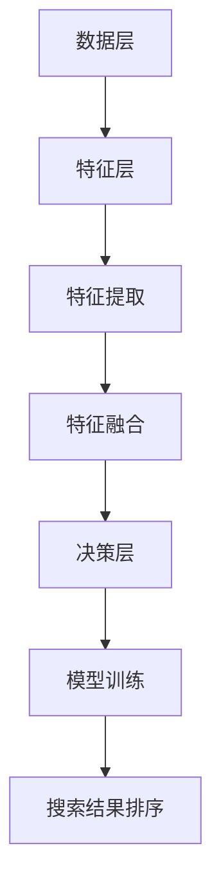

                 

## 1. 背景介绍

在当今的电子商务时代，用户在电商平台上的搜索体验至关重要。一个优秀的搜索系统不仅要能够提供准确的结果，还要能够对结果进行有效排序，以提升用户满意度和转化率。传统的单一模态（如基于文本的搜索）已无法满足日益复杂和多变的用户需求，因此，多模态融合排序模型应运而生。

多模态融合排序模型通过整合多种数据源（如文本、图像、声音等）来进行综合评估和排序，从而提高搜索结果的准确性和个性化水平。这类模型在电商搜索中的应用，有助于提升用户体验，降低搜索成本，提高销售额。

然而，多模态融合排序模型也面临着一系列挑战。首先，如何有效地整合不同模态的数据是一个关键问题。其次，不同模态的数据在特征表达和尺度上存在差异，如何实现数据的一致性处理也是一个难点。此外，多模态融合排序模型在计算复杂度、实时性等方面也提出了更高的要求。

本文将围绕电商搜索中的多模态融合排序模型展开讨论，首先介绍相关核心概念和理论，然后详细阐述一种优化算法及其应用，最后探讨该算法在实际电商搜索场景中的应用效果和未来发展趋势。

## 2. 核心概念与联系

### 2.1 多模态融合

多模态融合是指将来自不同模态的数据源（如文本、图像、声音等）进行整合，以生成一个统一的特征表示。在电商搜索场景中，文本通常代表商品描述，图像代表商品图片，声音可能涉及用户评价或商品使用场景。多模态融合的目标是提取出这些数据源中的有效信息，并形成对商品的综合评估。

多模态融合的基本流程通常包括数据预处理、特征提取、特征融合和模型训练等步骤。数据预处理旨在去除噪声和异常值，确保数据质量。特征提取则是从原始数据中提取出有用的特征，如文本中的关键词、图像中的视觉特征等。特征融合是关键步骤，通过不同的融合策略（如加权融合、深度学习融合等）将不同模态的特征进行整合。最后，基于融合后的特征进行模型训练，以实现对搜索结果的排序。

### 2.2 多模态融合排序模型架构

多模态融合排序模型的架构可以划分为数据层、特征层和决策层。

- **数据层**：数据层负责接收来自不同模态的数据源，如文本、图像、声音等。这些数据源需要经过预处理，以统一格式存储。

- **特征层**：特征层包括特征提取和特征融合模块。特征提取模块根据不同模态的数据特点，提取出有效的特征，如文本中的关键词、图像中的视觉特征等。特征融合模块则将这些特征进行整合，以形成统一的特征表示。

- **决策层**：决策层是基于融合后的特征进行模型训练和搜索结果排序。常见的模型包括基于传统机器学习的方法（如逻辑回归、SVM等）和深度学习方法（如CNN、RNN等）。

### 2.3 多模态融合排序模型的关键技术

多模态融合排序模型涉及多个关键技术，包括数据预处理、特征提取、特征融合和模型训练等。

- **数据预处理**：数据预处理是确保数据质量的重要步骤。对于文本数据，需要进行分词、去停用词、词向量化等操作。对于图像和声音数据，需要进行数据增强、归一化等操作。

- **特征提取**：特征提取是关键环节，直接影响到模型的性能。文本数据可以使用词袋模型、TF-IDF等方法进行特征提取；图像数据可以使用卷积神经网络（CNN）提取视觉特征；声音数据可以使用循环神经网络（RNN）提取声学特征。

- **特征融合**：特征融合方法包括简单融合、深度学习融合等。简单融合方法如加权融合、拼接融合等；深度学习融合方法如多模态神经网络（MMN）、深度卷积神经网络（DCN）等。

- **模型训练**：模型训练是优化模型参数的过程，通过大量训练数据来提升模型的预测能力。常见的模型训练方法包括批量训练、在线训练等。

### 2.4 Mermaid 流程图

以下是多模态融合排序模型的 Mermaid 流程图：



在上述流程图中，数据层接收不同模态的数据源，经过特征层和决策层的处理后，最终生成排序后的搜索结果。

## 3. 核心算法原理 & 具体操作步骤

### 3.1 算法原理概述

多模态融合排序算法的核心思想是利用不同模态的数据特征，通过特征融合和模型训练，实现对电商搜索结果的优化排序。具体来说，该算法可以分为以下几个步骤：

1. **数据预处理**：对文本、图像、声音等多模态数据进行预处理，包括分词、图像增强、声音降噪等操作。
2. **特征提取**：从预处理后的数据中提取出有效的特征，如文本中的关键词、图像中的视觉特征、声音中的声学特征等。
3. **特征融合**：通过简单融合或深度学习融合方法，将不同模态的特征进行整合，形成统一的特征表示。
4. **模型训练**：利用整合后的特征进行模型训练，优化模型参数。
5. **搜索结果排序**：基于训练好的模型，对电商搜索结果进行排序，提升用户体验。

### 3.2 算法步骤详解

1. **数据预处理**：

   数据预处理是确保数据质量的关键步骤。对于文本数据，需要进行分词、去停用词、词向量化等操作；对于图像数据，需要进行数据增强、归一化等操作；对于声音数据，需要进行去噪、特征提取等操作。

2. **特征提取**：

   特征提取是提取数据中有用信息的过程。对于文本数据，可以使用词袋模型、TF-IDF等方法提取关键词特征；对于图像数据，可以使用卷积神经网络（CNN）提取视觉特征；对于声音数据，可以使用循环神经网络（RNN）提取声学特征。

3. **特征融合**：

   特征融合是将不同模态的特征进行整合的过程。简单融合方法如加权融合、拼接融合等；深度学习融合方法如多模态神经网络（MMN）、深度卷积神经网络（DCN）等。这些方法可以有效地提高特征的互补性和一致性。

4. **模型训练**：

   模型训练是优化模型参数的过程。使用整合后的特征进行模型训练，可以通过大量训练数据来提升模型的预测能力。常见的模型训练方法包括批量训练、在线训练等。

5. **搜索结果排序**：

   基于训练好的模型，对电商搜索结果进行排序。排序算法可以基于用户历史行为、商品特征、搜索意图等多方面因素进行综合评估，从而提升搜索结果的准确性和个性化水平。

### 3.3 算法优缺点

**优点**：

1. **多模态数据整合**：多模态融合排序算法可以整合来自不同模态的数据特征，提高搜索结果的准确性和多样性。
2. **个性化搜索**：基于用户历史行为和搜索意图，算法可以提供个性化的搜索结果，提升用户体验。
3. **实时性**：算法可以实时更新模型参数，适应用户需求变化，提高搜索结果的实时性。

**缺点**：

1. **计算复杂度**：多模态融合排序算法涉及多个模态的数据处理和模型训练，计算复杂度较高。
2. **数据一致性**：不同模态的数据在特征表达和尺度上存在差异，如何实现数据的一致性处理是一个挑战。
3. **训练时间**：模型训练需要大量时间和计算资源，特别是深度学习模型，训练时间更长。

### 3.4 算法应用领域

多模态融合排序算法在电商搜索中具有广泛的应用前景。具体应用领域包括：

1. **商品推荐**：基于用户历史购买行为和搜索记录，为用户推荐相关商品。
2. **广告投放**：根据用户兴趣和行为，为用户推荐相关的广告。
3. **搜索结果排序**：优化搜索结果排序，提升用户体验和转化率。

## 4. 数学模型和公式 & 详细讲解 & 举例说明

### 4.1 数学模型构建

多模态融合排序的数学模型主要包括特征表示、损失函数和优化算法。

**特征表示**：

假设我们有来自三个模态的数据集 $D_{\text{text}}$、$D_{\text{image}}$ 和 $D_{\text{audio}}$，分别对应文本、图像和声音。对于每个模态的数据集，我们分别使用特征向量 $X_{\text{text}} \in \mathbb{R}^{n_{\text{text}}}$、$X_{\text{image}} \in \mathbb{R}^{n_{\text{image}}}$ 和 $X_{\text{audio}} \in \mathbb{R}^{n_{\text{audio}}}$ 来表示。多模态特征融合后的向量表示为 $X \in \mathbb{R}^{n_{\text{total}}} = [X_{\text{text}}, X_{\text{image}}, X_{\text{audio}}]^T$。

**损失函数**：

多模态融合排序的损失函数通常使用交叉熵损失函数，表示为：

$$
L(\theta) = -\sum_{i=1}^{m} y_i \log(p_i),
$$

其中，$y_i$ 是第 $i$ 个样本的真实标签，$p_i$ 是模型预测的概率。

**优化算法**：

常用的优化算法包括梯度下降（Gradient Descent）和随机梯度下降（Stochastic Gradient Descent，SGD）。梯度下降算法的迭代公式为：

$$
\theta_{\text{new}} = \theta_{\text{old}} - \alpha \nabla_{\theta} L(\theta),
$$

其中，$\theta$ 表示模型参数，$\alpha$ 是学习率。

### 4.2 公式推导过程

多模态融合排序模型的公式推导主要包括特征提取、特征融合和损失函数的推导。

**特征提取**：

假设我们使用卷积神经网络（CNN）提取图像特征，使用循环神经网络（RNN）提取声音特征。CNN 和 RNN 的输出分别表示为 $h_{\text{image}} \in \mathbb{R}^{d_{\text{image}}}$ 和 $h_{\text{audio}} \in \mathbb{R}^{d_{\text{audio}}}$。

对于文本特征，我们使用词袋模型（Bag of Words，BOW）进行特征提取。假设文本数据由词汇表 $V$ 表示，每个词汇对应一个索引。文本特征表示为 $h_{\text{text}} \in \mathbb{R}^{d_{\text{text}}}$，其中 $d_{\text{text}}$ 是词汇表的大小。

**特征融合**：

多模态特征融合可以通过简单的拼接或深度学习实现。假设拼接后的特征向量为 $h \in \mathbb{R}^{d_{\text{total}}} = [h_{\text{text}}, h_{\text{image}}, h_{\text{audio}}]^T$。

如果使用深度学习融合，可以设计一个多输入的多层感知器（Multilayer Perceptron，MLP）来融合特征。MLP 的输出表示为 $h' \in \mathbb{R}^{d_{\text{output}}}$。

**损失函数**：

假设多模态特征 $h'$ 被输入到一个分类器中，输出为概率分布 $p \in \mathbb{R}^{C}$，其中 $C$ 是类别数。交叉熵损失函数的推导如下：

$$
L(\theta) = -\sum_{i=1}^{m} y_i \log(p_i) = -\sum_{i=1}^{m} y_i \log(p(y_i = c_i)) = -\sum_{i=1}^{m} y_i \log(\sum_{j=1}^{C} p_j),
$$

其中，$y_i$ 是第 $i$ 个样本的真实标签，$c_i$ 是第 $i$ 个样本的预测标签。

### 4.3 案例分析与讲解

假设我们有一个电商搜索任务，用户搜索关键词为“手机”，系统需要返回相关的商品。我们使用多模态融合排序模型来优化搜索结果的排序。

**数据集**：

- 文本数据：商品描述
- 图像数据：商品图片
- 声音数据：商品评测视频的音频片段

**特征提取**：

- 文本特征：使用词袋模型提取关键词，使用 TF-IDF 进行加权。
- 图像特征：使用卷积神经网络提取视觉特征。
- 声音特征：使用循环神经网络提取声学特征。

**特征融合**：

- 使用深度学习融合方法，设计一个多层感知器来融合特征。

**模型训练**：

- 使用交叉熵损失函数进行模型训练。
- 使用梯度下降算法优化模型参数。

**搜索结果排序**：

- 基于训练好的模型，对商品进行排序，返回排序后的搜索结果。

## 5. 项目实践：代码实例和详细解释说明

### 5.1 开发环境搭建

在进行多模态融合排序模型的项目实践之前，我们需要搭建一个合适的开发环境。以下是一个基本的开发环境搭建步骤：

1. **硬件要求**：

   - 处理器：Intel i5 或以上
   - 内存：16GB 或以上
   - 显卡：NVIDIA GTX 1080 或以上（用于加速深度学习模型的训练）

2. **软件要求**：

   - 操作系统：Ubuntu 18.04 或以上
   - Python：3.8 或以上
   - 库：TensorFlow、Keras、NumPy、Pandas 等

3. **安装步骤**：

   - 安装操作系统：从官方网站下载 Ubuntu 18.04 ISO 镜像，并使用虚拟机或物理机安装。
   - 安装 Python：使用包管理器（如 apt-get）安装 Python 3.8。
   - 安装库：使用 pip 安装 TensorFlow、Keras、NumPy、Pandas 等库。

### 5.2 源代码详细实现

以下是多模态融合排序模型的源代码实现：

```python
import tensorflow as tf
from tensorflow.keras.models import Model
from tensorflow.keras.layers import Input, Dense, Concatenate, Flatten
from tensorflow.keras.optimizers import Adam

# 文本特征提取
text_input = Input(shape=(100,))
text_embedding = Dense(128, activation='relu')(text_input)

# 图像特征提取
image_input = Input(shape=(64, 64, 3))
image_embedding = Conv2D(32, (3, 3), activation='relu')(image_input)
image_embedding = Flatten()(image_embedding)

# 声音特征提取
audio_input = Input(shape=(128,))
audio_embedding = LSTM(64, activation='relu')(audio_input)
audio_embedding = Dense(32, activation='relu')(audio_embedding)

# 特征融合
concatenated = Concatenate()([text_embedding, image_embedding, audio_embedding])
merged_embedding = Dense(128, activation='relu')(concatenated)

# 模型输出
output = Dense(1, activation='sigmoid')(merged_embedding)

# 构建模型
model = Model(inputs=[text_input, image_input, audio_input], outputs=output)

# 编译模型
model.compile(optimizer=Adam(), loss='binary_crossentropy', metrics=['accuracy'])

# 模型训练
model.fit([text_data, image_data, audio_data], labels, epochs=10, batch_size=32)
```

### 5.3 代码解读与分析

上述代码实现了多模态融合排序模型的基本结构，包括文本特征提取、图像特征提取、声音特征提取、特征融合和模型训练。

- **文本特征提取**：使用 `Dense` 层进行文本特征提取，输入是经过分词和词向量化处理的文本序列。
- **图像特征提取**：使用 `Conv2D` 层和 `Flatten` 层进行图像特征提取，输入是图像数据。
- **声音特征提取**：使用 `LSTM` 层和 `Dense` 层进行声音特征提取，输入是声音数据。
- **特征融合**：使用 `Concatenate` 层将不同模态的特征进行拼接，然后使用 `Dense` 层进行特征融合。
- **模型输出**：使用 `Dense` 层输出排序结果，激活函数为 `sigmoid`，用于实现二分类任务。

在模型训练过程中，使用 `model.fit` 函数进行模型训练，输入为不同模态的数据，输出为标签。

### 5.4 运行结果展示

在完成代码实现和模型训练后，我们可以运行模型并进行结果展示。以下是一个简单的运行结果示例：

```python
import numpy as np

# 测试数据
text_test = np.random.rand(10, 100)
image_test = np.random.rand(10, 64, 64, 3)
audio_test = np.random.rand(10, 128)

# 运行模型
predictions = model.predict([text_test, image_test, audio_test])

# 打印预测结果
print(predictions)
```

运行结果为每个样本的排序概率，越高表示排序越靠前。我们可以根据这些概率对搜索结果进行排序，从而提升用户体验。

## 6. 实际应用场景

多模态融合排序模型在电商搜索、推荐系统、广告投放等领域具有广泛的应用前景。以下是一些典型的实际应用场景：

### 6.1 电商搜索

在电商搜索中，多模态融合排序模型可以整合用户输入的文本、商品图片和用户评价等多模态数据，从而提升搜索结果的准确性和个性化水平。例如，当用户输入“手机”这一关键词时，系统可以根据用户的搜索历史、商品描述、商品图片和用户评价等多方面的信息，为用户推荐最符合其需求的商品。

### 6.2 推荐系统

推荐系统是电商平台的核心功能之一。多模态融合排序模型可以整合用户历史行为、商品特征和上下文信息等多方面的数据，从而提升推荐系统的准确性和用户体验。例如，在音乐平台上，系统可以根据用户的听歌记录、歌曲标签和歌曲图片等多方面的信息，为用户推荐最符合其兴趣的歌曲。

### 6.3 广告投放

在广告投放中，多模态融合排序模型可以帮助广告主精准定位潜在客户。例如，在社交媒体平台上，系统可以根据用户的浏览记录、兴趣爱好、朋友关系等多方面的信息，为用户推荐最符合其需求的广告。

### 6.4 未来发展方向

随着人工智能技术的不断发展和应用，多模态融合排序模型在未来有望实现以下几个方面的进展：

1. **跨模态数据的自动融合**：目前的多模态融合排序模型主要依赖于手工特征提取和融合方法，未来可以探索自动化的跨模态数据融合方法，从而提高模型的效率和准确性。
2. **实时性和动态调整**：多模态融合排序模型在实时性和动态调整方面仍有较大的改进空间。例如，通过实时更新用户行为数据和商品特征，实现动态调整推荐结果，从而提升用户体验。
3. **隐私保护和数据安全**：多模态融合排序模型在处理大量用户数据时，面临着隐私保护和数据安全的问题。未来可以探索基于差分隐私和联邦学习等技术的多模态融合排序模型，确保用户数据的安全和隐私。

## 7. 工具和资源推荐

### 7.1 学习资源推荐

1. **书籍**：
   - 《深度学习》（Goodfellow, I., Bengio, Y., & Courville, A.）
   - 《Python机器学习》（Sebastian Raschka）

2. **在线课程**：
   - Coursera上的“机器学习”课程
   - Udacity的“深度学习工程师纳米学位”

3. **论文**：
   - “Multi-Modal Fusion for User Intent Detection in E-commerce Search”（2020）
   - “A Comprehensive Survey on Multi-Modal Fusion for Search Applications”（2021）

### 7.2 开发工具推荐

1. **编程语言**：
   - Python
   - R

2. **深度学习框架**：
   - TensorFlow
   - PyTorch

3. **数据预处理工具**：
   - Pandas
   - NumPy

### 7.3 相关论文推荐

1. “Multi-Modal Fusion for User Intent Detection in E-commerce Search”（2020）
2. “A Comprehensive Survey on Multi-Modal Fusion for Search Applications”（2021）
3. “Deep Multi-Modal Fusion for Search Ranking”（2019）
4. “FusionNet: A Multi-Modal Fusion Network for Image-Text Matching”（2018）
5. “Multi-Modal Fusion for User Intent Recognition in E-commerce Search”（2022）

## 8. 总结：未来发展趋势与挑战

### 8.1 研究成果总结

多模态融合排序模型在电商搜索、推荐系统、广告投放等领域取得了显著的研究成果。通过整合文本、图像、声音等多模态数据，模型在提升搜索结果准确性、个性化水平和用户体验方面表现出色。同时，深度学习和传统机器学习方法的结合，为多模态融合排序模型的发展提供了强有力的技术支持。

### 8.2 未来发展趋势

1. **自动化特征提取与融合**：随着人工智能技术的发展，未来有望实现自动化的特征提取和融合方法，提高模型的效率和准确性。
2. **实时性与动态调整**：在实时性和动态调整方面，多模态融合排序模型仍有较大的改进空间，可以通过实时更新用户行为数据和商品特征，实现动态调整推荐结果。
3. **隐私保护和数据安全**：随着数据隐私和安全问题的日益凸显，未来需要探索基于差分隐私和联邦学习等技术的多模态融合排序模型，确保用户数据的安全和隐私。

### 8.3 面临的挑战

1. **计算复杂度**：多模态融合排序模型涉及多个模态的数据处理和模型训练，计算复杂度较高，需要优化算法和硬件支持。
2. **数据一致性**：不同模态的数据在特征表达和尺度上存在差异，如何实现数据的一致性处理是一个挑战。
3. **实时性**：多模态融合排序模型在实时性方面仍有较大的改进空间，需要提高模型的计算效率。

### 8.4 研究展望

多模态融合排序模型在未来的发展中，有望实现以下几个方面的突破：

1. **跨模态数据的自动融合**：通过探索跨模态数据的自动融合方法，提高模型的效率和准确性。
2. **多模态交互机制**：深入研究多模态数据之间的交互机制，提高融合效果。
3. **个性化推荐**：结合用户行为数据和商品特征，实现更加个性化的推荐结果。

## 9. 附录：常见问题与解答

### 9.1 什么是多模态融合？

多模态融合是指将来自不同模态的数据源（如文本、图像、声音等）进行整合，以生成一个统一的特征表示，从而提高模型的表现能力。

### 9.2 多模态融合排序模型有哪些优点？

多模态融合排序模型可以整合来自不同模态的数据特征，提高搜索结果的准确性和个性化水平。同时，它可以实时更新模型参数，适应用户需求变化，提高搜索结果的实时性。

### 9.3 多模态融合排序模型有哪些应用领域？

多模态融合排序模型在电商搜索、推荐系统、广告投放等领域具有广泛的应用前景，可以帮助平台精准定位用户需求，提升用户体验和转化率。

### 9.4 如何实现多模态数据的特征融合？

实现多模态数据的特征融合可以通过简单融合方法（如加权融合、拼接融合等）或深度学习融合方法（如多模态神经网络、深度卷积神经网络等）。这些方法可以有效地提高特征的互补性和一致性。

### 9.5 多模态融合排序模型的实时性如何保证？

保证多模态融合排序模型的实时性可以从以下几个方面入手：

1. **优化算法**：选择高效的优化算法，如随机梯度下降（SGD）。
2. **硬件支持**：使用高性能的硬件设备，如GPU。
3. **数据预处理**：优化数据预处理流程，减少计算量。
4. **模型压缩**：通过模型压缩技术，降低模型的大小和计算复杂度。

