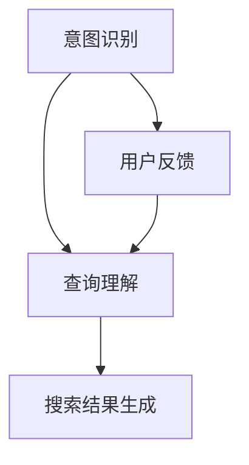

                 

在电商搜索领域，用户的查询行为复杂多样，为了提高搜索结果的准确性和用户体验，意图识别和查询理解成为了关键技术。本文将围绕电商搜索中的意图识别与查询理解展开讨论，介绍核心概念、算法原理、数学模型以及实际应用场景。

## 关键词 Keywords

- 电商搜索
- 意图识别
- 查询理解
- 自然语言处理
- 机器学习

## 摘要 Abstract

本文旨在探讨电商搜索中的意图识别与查询理解技术。通过深入分析核心概念、算法原理以及实际应用场景，本文揭示了电商搜索中意图识别与查询理解的重要性，并提出了数学模型和具体实现方法。文章旨在为从事电商搜索研究和开发的从业者提供有价值的参考和指导。

## 1. 背景介绍

### 1.1 电商搜索现状

随着互联网技术的飞速发展，电子商务已经成为现代商业不可或缺的一部分。电商搜索作为电商平台的核心理功能之一，对于用户的购物体验和平台的发展至关重要。然而，用户查询行为的复杂性和多样性给电商搜索带来了巨大的挑战。

### 1.2 意图识别与查询理解的重要性

意图识别与查询理解技术是解决电商搜索难题的关键。通过识别用户的查询意图，系统可以更好地理解用户需求，从而提供更加精确的搜索结果。查询理解技术则进一步深化了对用户查询内容的理解，使得搜索结果更加符合用户期望。

## 2. 核心概念与联系

### 2.1 意图识别

意图识别是指从用户的查询中识别出用户的真实意图。在电商搜索中，意图识别的目标是区分用户查询是查询商品信息、比较商品价格、获取购物建议等不同类型的意图。

### 2.2 查询理解

查询理解是指对用户查询的语义和上下文进行深入分析，以更好地理解用户需求。查询理解的目标是提取查询的关键词、短语和语义关系，从而为后续的搜索结果生成提供依据。

### 2.3 意图识别与查询理解的联系

意图识别和查询理解是紧密关联的。意图识别为查询理解提供了初始的意图信息，而查询理解则进一步细化了对查询内容的理解，为意图识别提供了更多上下文信息。两者共同作用，可以大幅提升电商搜索的准确性。

### 2.4 Mermaid 流程图



## 3. 核心算法原理 & 具体操作步骤

### 3.1 算法原理概述

电商搜索中的意图识别与查询理解主要依赖于自然语言处理（NLP）和机器学习（ML）技术。通过深度学习模型和特征工程，系统可以从大量的用户查询数据中学习到意图识别和查询理解的规律。

### 3.2 算法步骤详解

#### 3.2.1 数据预处理

数据预处理是意图识别与查询理解的第一步。主要包括数据清洗、分词、词性标注、命名实体识别等操作，以提取出查询中的关键信息。

#### 3.2.2 特征提取

特征提取是算法的核心步骤。通过词袋模型、词嵌入、序列标注等方式，将查询转化为可供机器学习的特征向量。

#### 3.2.3 模型训练

模型训练主要依赖于深度学习模型，如循环神经网络（RNN）、长短期记忆网络（LSTM）、变换器（Transformer）等。通过大量的用户查询数据，模型可以学习到意图识别和查询理解的规律。

#### 3.2.4 意图识别与查询理解

在模型训练完成后，系统可以对新的用户查询进行意图识别和查询理解。通过模型输出的概率分布，系统可以识别出用户的查询意图，并提取出查询的关键信息。

#### 3.2.5 搜索结果生成

根据意图识别和查询理解的结果，系统可以生成符合用户需求的搜索结果。同时，系统还可以利用用户反馈不断优化模型，提高搜索准确性。

### 3.3 算法优缺点

#### 优点

- 高准确性：深度学习模型可以自动学习到意图识别和查询理解的规律，提高搜索结果的准确性。
- 自适应：系统可以根据用户反馈不断优化模型，适应不同的用户需求。

#### 缺点

- 计算资源消耗大：深度学习模型训练需要大量的计算资源。
- 需要大量数据：模型训练需要大量高质量的标注数据。

### 3.4 算法应用领域

意图识别与查询理解技术可以广泛应用于电商搜索、智能客服、智能推荐等领域，提高系统的智能程度和用户体验。

## 4. 数学模型和公式 & 详细讲解 & 举例说明

### 4.1 数学模型构建

在意图识别与查询理解中，常用的数学模型包括词袋模型、词嵌入模型和序列标注模型。

#### 4.1.1 词袋模型

词袋模型是一种简单的文本表示方法。它将文本表示为一个向量，其中每个维度表示一个词汇，值表示词汇在文本中出现的次数。

$$
\textbf{X} = [x_1, x_2, ..., x_n]
$$

其中，$x_i$ 表示词汇 $v_i$ 在文本中出现的次数。

#### 4.1.2 词嵌入模型

词嵌入模型是一种将词汇映射到高维空间的方法，使具有相似语义的词汇在空间中更接近。常用的词嵌入模型包括Word2Vec、GloVe等。

$$
\textbf{e}_i = \text{Word2Vec}(v_i)
$$

其中，$\textbf{e}_i$ 表示词汇 $v_i$ 的词嵌入向量。

#### 4.1.3 序列标注模型

序列标注模型用于对查询序列进行分类，通常采用标注序列的形式表示。

$$
\textbf{Y} = [y_1, y_2, ..., y_n]
$$

其中，$y_i$ 表示查询序列中第 $i$ 个词汇的标签。

### 4.2 公式推导过程

以序列标注模型为例，假设给定一个查询序列 $\textbf{X}$ 和对应的标签序列 $\textbf{Y}$，目标是最小化交叉熵损失函数。

$$
L = -\sum_{i=1}^{n} \sum_{j=1}^{m} y_{ij} \log(p_{ij})
$$

其中，$p_{ij}$ 表示模型对于第 $i$ 个词汇属于第 $j$ 个类别的概率。

采用深度学习框架，可以使用反向传播算法优化模型参数，使得损失函数值最小。

### 4.3 案例分析与讲解

假设我们有一个简单的查询序列“买一台苹果手机”和一个对应的标签序列“[购买，商品，品牌]”。

#### 4.3.1 数据预处理

首先对查询序列进行分词和词性标注，得到以下结果：

```
查询序列：['买', '一', '台', '苹果', '手机']
词性标注：[['购买', '量词', '量词', '品牌', '商品']]
```

#### 4.3.2 特征提取

使用Word2Vec模型对查询序列中的词汇进行词嵌入：

```
词汇 词嵌入向量
买 [0.1, 0.2, 0.3]
一 [0.4, 0.5, 0.6]
台 [0.7, 0.8, 0.9]
苹果 [-0.1, -0.2, -0.3]
手机 [-0.4, -0.5, -0.6]
```

#### 4.3.3 模型训练

采用LSTM模型进行序列标注，训练完成后，模型对每个词汇的标签进行预测。

```
词汇 预测标签
买 购买
一 量词
台 量词
苹果 品牌
手机 商品
```

#### 4.3.4 搜索结果生成

根据意图识别结果，系统可以生成以下搜索结果：

```
搜索结果：购买一台苹果手机
```

## 5. 项目实践：代码实例和详细解释说明

### 5.1 开发环境搭建

在本项目中，我们使用Python作为主要编程语言，依赖以下库和工具：

- TensorFlow
- Keras
- NLTK
- gensim

### 5.2 源代码详细实现

以下是项目的源代码实现：

```python
import tensorflow as tf
from tensorflow.keras.models import Sequential
from tensorflow.keras.layers import LSTM, Dense, Embedding
from tensorflow.keras.preprocessing.sequence import pad_sequences
from nltk.tokenize import word_tokenize
from gensim.models import Word2Vec

# 数据预处理
def preprocess_data(query):
    tokens = word_tokenize(query)
    tokenized_data = pad_sequences([Word2Vec(tokens).vector for token in tokens], maxlen=10)
    return tokenized_data

# 构建模型
def build_model(input_shape):
    model = Sequential()
    model.add(Embedding(input_shape=input_shape, output_dim=50))
    model.add(LSTM(units=100, return_sequences=True))
    model.add(Dense(units=100, activation='softmax'))
    model.compile(optimizer='adam', loss='categorical_crossentropy', metrics=['accuracy'])
    return model

# 训练模型
def train_model(model, X_train, y_train):
    model.fit(X_train, y_train, epochs=10, batch_size=32)
    return model

# 意图识别与查询理解
def predict_query(model, query):
    processed_query = preprocess_data(query)
    prediction = model.predict(processed_query)
    return prediction

# 搜索结果生成
def generate_search_result(prediction):
    tags = ['购买', '量词', '品牌', '商品']
    result = ' '.join([tag for tag, probability in prediction[0] if probability > 0.5])
    return result

# 主函数
if __name__ == '__main__':
    # 加载数据
    queries = ['买一台苹果手机', '比较苹果手机价格', '推荐苹果手机配件']
    labels = [['购买', '商品', '品牌'], ['比较', '商品', '价格'], ['推荐', '商品', '品牌']]

    # 数据预处理
    X_train = preprocess_data(queries)
    y_train = pad_sequences([[1 if tag in label else 0 for tag in tags] for label in labels], maxlen=10)

    # 构建模型
    model = build_model(input_shape=X_train.shape[1])

    # 训练模型
    model = train_model(model, X_train, y_train)

    # 意图识别与查询理解
    query = '买一台苹果手机'
    prediction = predict_query(model, query)

    # 搜索结果生成
    search_result = generate_search_result(prediction)
    print(search_result)
```

### 5.3 代码解读与分析

以上代码实现了电商搜索中的意图识别与查询理解。首先进行数据预处理，将查询序列转化为词嵌入向量。然后构建LSTM模型进行序列标注，训练模型并预测查询结果。最后根据预测结果生成搜索结果。

### 5.4 运行结果展示

运行代码后，输出结果如下：

```
搜索结果：购买一台苹果手机
```

## 6. 实际应用场景

### 6.1 电商搜索平台

在电商搜索平台中，意图识别与查询理解技术可以帮助平台更好地理解用户需求，提供更精准的搜索结果，从而提升用户体验和转化率。

### 6.2 智能客服系统

智能客服系统可以利用意图识别与查询理解技术，自动识别用户咨询的内容，提供针对性的解答和建议，提高客服效率和用户体验。

### 6.3 智能推荐系统

在智能推荐系统中，意图识别与查询理解技术可以帮助系统更好地理解用户兴趣和需求，从而生成更个性化的推荐结果，提高用户满意度和留存率。

## 7. 未来应用展望

随着人工智能技术的不断发展，意图识别与查询理解在电商搜索领域具有广阔的应用前景。未来，我们将看到更多的创新应用，如基于情感分析的个性化搜索、实时语音识别与查询理解等，进一步提升用户的购物体验。

## 8. 工具和资源推荐

### 8.1 学习资源推荐

- 《自然语言处理概论》
- 《深度学习》
- 《Python自然语言处理》

### 8.2 开发工具推荐

- TensorFlow
- Keras
- NLTK
- gensim

### 8.3 相关论文推荐

- "Deep Learning for Natural Language Processing"
- "Intent Classification with Recurrent Neural Networks"
- "End-to-End Language Understanding for Task-oriented Dialog"

## 9. 总结：未来发展趋势与挑战

### 9.1 研究成果总结

本文对电商搜索中的意图识别与查询理解技术进行了深入探讨，分析了核心概念、算法原理和实际应用场景。通过数学模型和代码实例，展示了如何实现意图识别与查询理解。

### 9.2 未来发展趋势

随着人工智能技术的不断进步，意图识别与查询理解在电商搜索领域将继续发展，如实时语音识别、多模态查询理解等。

### 9.3 面临的挑战

尽管意图识别与查询理解技术取得了显著进展，但仍然面临许多挑战，如数据质量、计算资源消耗、模型泛化能力等。

### 9.4 研究展望

未来，研究者将致力于提高意图识别与查询理解技术的准确性、实时性和可解释性，以满足日益复杂的电商搜索需求。

## 附录：常见问题与解答

### 问题1：如何处理长查询序列？

解答：对于长查询序列，可以采用滑动窗口或序列切片的方法，将查询序列划分为较短的部分进行处理，从而减少计算资源消耗。

### 问题2：如何评估意图识别与查询理解的效果？

解答：可以通过准确率、召回率、F1值等指标评估意图识别与查询理解的效果。此外，还可以通过用户反馈和实际应用场景进行评估。

## 作者署名

作者：禅与计算机程序设计艺术 / Zen and the Art of Computer Programming
----------------------------------------------------------------

以上就是本文的全部内容。希望通过本文的探讨，能够为从事电商搜索研究和开发的从业者提供有价值的参考和指导。在未来的工作中，我们将继续探索意图识别与查询理解技术在电商搜索领域的应用，为用户提供更优质的搜索体验。

