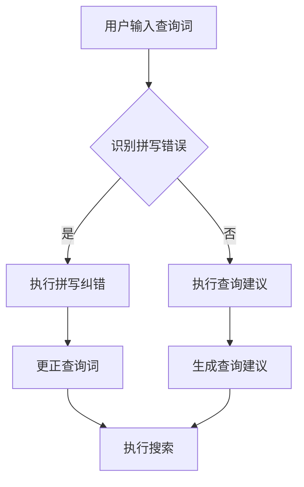

                 

## 1. 背景介绍

随着互联网和电子商务的迅猛发展，电商平台已经成为人们日常生活的重要组成部分。在电子商务平台中，搜索功能是最基本也是最重要的功能之一。一个高效的搜索系统能够提高用户的购物体验，增加平台的用户留存率和转化率。然而，在实际应用中，用户输入的查询关键词可能存在拼写错误，这时候，搜索系统就需要提供拼写纠错与查询建议功能，以提高搜索结果的准确性和用户体验。

拼写纠错与查询建议技术主要包括两个方面：拼写纠错和查询建议。拼写纠错是指识别并更正用户输入的拼写错误，将其转换为正确的关键词，从而提高搜索结果的准确性。查询建议是指根据用户的输入，提供一系列可能的查询词选项，帮助用户更快地找到所需商品或信息。

电商平台的搜索功能不仅依赖于拼写纠错与查询建议技术，还涉及到自然语言处理、机器学习、数据库优化等多个领域。因此，研究并实现一套高效的拼写纠错与查询建议技术，对于提升电商平台的竞争力具有重要意义。

## 2. 核心概念与联系

### 2.1 拼写纠错

拼写纠错是搜索系统中的一项关键技术。其核心思想是通过算法识别用户输入的查询词中的拼写错误，并将其更正为正确的查询词。拼写纠错技术主要包括以下几种方法：

1. **基于规则的拼写纠错**：通过预定义的拼写规则来识别和更正错误。这种方法简单高效，但受限于规则的完备性和准确性。
2. **基于统计的拼写纠错**：使用统计方法，如n-gram语言模型、隐马尔可夫模型等，来识别和更正错误。这种方法具有较高的准确性，但需要大量的训练数据和计算资源。
3. **基于神经网络的拼写纠错**：利用深度学习模型，如卷积神经网络（CNN）、递归神经网络（RNN）等，来自动学习拼写纠错规则。这种方法具有较好的灵活性和泛化能力，但训练过程复杂，计算资源需求高。

### 2.2 查询建议

查询建议是指在用户输入部分查询词时，系统根据用户的历史行为和搜索数据，提供一系列可能的查询词选项。查询建议技术主要包括以下几种方法：

1. **基于历史数据的查询建议**：根据用户的历史搜索记录，提取出出现频率较高的查询词，并将其作为建议词提供给用户。这种方法简单直接，但受限于用户的历史行为。
2. **基于上下文的查询建议**：通过分析用户的上下文信息，如浏览历史、搜索历史等，来预测用户可能感兴趣的内容，并提供相应的查询建议。这种方法能够提供更加个性化的查询建议，但需要处理大量的上下文信息。
3. **基于机器学习的查询建议**：使用机器学习算法，如协同过滤、聚类等，来分析用户的兴趣和行为模式，并提供相应的查询建议。这种方法能够提供更加准确的查询建议，但需要大量的训练数据和计算资源。

### 2.3 Mermaid 流程图

下面是拼写纠错与查询建议技术的 Mermaid 流程图：



## 3. 核心算法原理 & 具体操作步骤

### 3.1 算法原理概述

拼写纠错与查询建议技术主要基于以下原理：

1. **语言模型**：通过构建语言模型，来识别用户输入的查询词中的拼写错误。常用的语言模型包括n-gram模型和隐马尔可夫模型。
2. **序列标注**：对用户输入的查询词进行序列标注，标记出其中的错误位置和错误类型。序列标注技术主要基于深度学习模型，如长短期记忆网络（LSTM）。
3. **文本编辑距离**：通过计算文本编辑距离，来衡量两个字符串之间的差异，从而识别用户输入的查询词中的拼写错误。常用的算法包括Levenshtein距离和Damerau-Levenshtein距离。
4. **推荐算法**：根据用户的历史行为和兴趣，生成查询建议。常用的推荐算法包括基于内容的推荐、协同过滤和聚类等。

### 3.2 算法步骤详解

拼写纠错与查询建议技术的主要步骤如下：

1. **输入处理**：对用户输入的查询词进行预处理，如去除标点符号、转换大小写等。
2. **语言模型构建**：根据训练数据，构建语言模型，用于识别用户输入的查询词中的拼写错误。
3. **序列标注**：对用户输入的查询词进行序列标注，标记出其中的错误位置和错误类型。
4. **文本编辑距离计算**：计算用户输入的查询词与标准查询词之间的文本编辑距离，以识别可能的拼写错误。
5. **拼写纠错**：根据序列标注结果和文本编辑距离，对用户输入的查询词进行拼写纠错。
6. **查询建议生成**：根据用户的历史行为和兴趣，生成查询建议。
7. **搜索结果返回**：将更正后的查询词和查询建议返回给用户，执行搜索操作。

### 3.3 算法优缺点

**基于规则的拼写纠错**：
- **优点**：实现简单，运行速度快。
- **缺点**：受限于规则的完备性和准确性，无法处理复杂的拼写错误。

**基于统计的拼写纠错**：
- **优点**：准确性较高，能够处理复杂的拼写错误。
- **缺点**：需要大量的训练数据和计算资源，且对噪声数据敏感。

**基于神经网络的拼写纠错**：
- **优点**：具有良好的灵活性和泛化能力，能够自动学习拼写纠错规则。
- **缺点**：训练过程复杂，计算资源需求高。

**基于历史数据的查询建议**：
- **优点**：简单直接，易于实现。
- **缺点**：受限于用户的历史行为，可能导致查询建议不准确。

**基于上下文的查询建议**：
- **优点**：能够提供更加个性化的查询建议。
- **缺点**：需要处理大量的上下文信息，计算资源需求高。

**基于机器学习的查询建议**：
- **优点**：能够提供准确的查询建议。
- **缺点**：需要大量的训练数据和计算资源。

### 3.4 算法应用领域

拼写纠错与查询建议技术在多个领域都有广泛的应用，如：

1. **电子商务平台**：通过提供拼写纠错和查询建议功能，提高用户搜索体验，增加用户留存率和转化率。
2. **搜索引擎**：通过提供拼写纠错和查询建议功能，提高搜索结果的准确性，增加用户满意度。
3. **在线教育平台**：通过提供拼写纠错功能，帮助学生纠正错误，提高学习效果。
4. **智能助手**：通过提供查询建议功能，帮助用户更快地找到所需信息，提高用户满意度。

## 4. 数学模型和公式 & 详细讲解 & 举例说明

### 4.1 数学模型构建

在拼写纠错与查询建议技术中，常用的数学模型包括：

1. **语言模型**：用于识别用户输入的查询词中的拼写错误。常用的语言模型包括n-gram模型和隐马尔可夫模型。
2. **序列标注模型**：用于对用户输入的查询词进行序列标注，标记出其中的错误位置和错误类型。常用的序列标注模型包括长短期记忆网络（LSTM）。
3. **文本编辑距离模型**：用于计算文本编辑距离，以识别用户输入的查询词中的拼写错误。常用的文本编辑距离模型包括Levenshtein距离和Damerau-Levenshtein距离。
4. **推荐算法模型**：用于生成查询建议。常用的推荐算法模型包括基于内容的推荐、协同过滤和聚类等。

### 4.2 公式推导过程

下面分别介绍这些数学模型的公式推导过程。

#### 4.2.1 n-gram模型

n-gram模型是一种基于统计的语言模型，它将文本划分为一系列的n元组。n-gram模型的公式如下：

\[ P(w_1, w_2, ..., w_n) = \frac{C(w_1, w_2, ..., w_n)}{C(w_1, w_2, ..., w_n-1)} \]

其中，\( P(w_1, w_2, ..., w_n) \) 表示n元组 \( w_1, w_2, ..., w_n \) 的概率，\( C(w_1, w_2, ..., w_n) \) 表示n元组 \( w_1, w_2, ..., w_n \) 在语料库中的计数，\( C(w_1, w_2, ..., w_n-1) \) 表示n-1元组 \( w_1, w_2, ..., w_n-1 \) 在语料库中的计数。

#### 4.2.2 隐马尔可夫模型

隐马尔可夫模型（HMM）是一种基于状态转移概率和发射概率的统计模型。它用于描述一组随机事件，其中每个事件的状态不可见。隐马尔可夫模型的公式如下：

\[ P(w|s) = \sum_{i=1}^{N} P(w|s_i) P(s_i) \]

其中，\( P(w|s) \) 表示给定状态 \( s \) 下词 \( w \) 的概率，\( P(w|s_i) \) 表示在状态 \( s_i \) 下词 \( w \) 的概率，\( P(s_i) \) 表示状态 \( s_i \) 的概率，\( N \) 表示状态的总数。

#### 4.2.3 长短期记忆网络（LSTM）

长短期记忆网络（LSTM）是一种递归神经网络，它能够学习长期依赖关系。LSTM的核心思想是通过门控机制来控制信息的流动。LSTM的公式如下：

\[ f_t = \sigma(W_f \cdot [h_{t-1}, x_t] + b_f) \]
\[ i_t = \sigma(W_i \cdot [h_{t-1}, x_t] + b_i) \]
\[ \bar{g}_t = \tanh(W_g \cdot [h_{t-1}, x_t] + b_g) \]
\[ o_t = \sigma(W_o \cdot [f_t \odot \bar{g}_t, h_{t-1}] + b_o) \]
\[ h_t = o_t \odot \tanh(W_h \cdot [f_t \odot \bar{g}_t, h_{t-1}] + b_h) \]

其中，\( f_t \)、\( i_t \)、\( \bar{g}_t \)、\( o_t \) 分别表示遗忘门、输入门、候选状态门和输出门，\( \sigma \) 表示sigmoid函数，\( \tanh \) 表示双曲正切函数，\( \odot \) 表示逐元素乘法，\( W_f \)、\( W_i \)、\( W_g \)、\( W_o \)、\( W_h \) 分别表示遗忘门、输入门、候选状态门、输出门和隐藏状态门的权重矩阵，\( b_f \)、\( b_i \)、\( b_g \)、\( b_o \)、\( b_h \) 分别表示遗忘门、输入门、候选状态门、输出门和隐藏状态门的偏置向量。

#### 4.2.4 Levenshtein距离

Levenshtein距离是一种用于衡量两个字符串之间差异的算法。它的公式如下：

\[ d(a_1, a_2) = \min\{d_0, d_1, d_2\} \]

其中，\( d(a_1, a_2) \) 表示字符串 \( a_1 \) 和 \( a_2 \) 之间的Levenshtein距离，\( d_0 \)、\( d_1 \)、\( d_2 \) 分别表示在位置0、1、2上的编辑距离。

#### 4.2.5 Damerau-Levenshtein距离

Damerau-Levenshtein距离是Levenshtein距离的扩展，它考虑了字符的插入、删除、替换和字符交换。它的公式如下：

\[ d'(a_1, a_2) = \min\{d_0', d_1', d_2', d_3'\} \]

其中，\( d'(a_1, a_2) \) 表示字符串 \( a_1 \) 和 \( a_2 \) 之间的Damerau-Levenshtein距离，\( d_0' \)、\( d_1' \)、\( d_2' \)、\( d_3' \) 分别表示在位置0、1、2、3上的编辑距离。

### 4.3 案例分析与讲解

下面通过一个案例来说明拼写纠错与查询建议技术的应用。

假设用户输入的查询词是“prictronic”，系统需要对其进行拼写纠错和查询建议。

#### 4.3.1 拼写纠错

首先，系统使用n-gram模型来识别“prictronic”中的拼写错误。根据语料库，系统发现“prictronic”可能是由“price”和“tronic”组成的。接着，系统使用序列标注模型来标记“prictronic”中的错误位置和错误类型。根据标注结果，系统发现“price”是正确的，“tronic”是错误的。最后，系统使用文本编辑距离模型来计算“prictronic”与标准查询词“pricetronics”之间的差异。根据计算结果，系统确定“tronic”是错误的，应该更正为“tronics”。

#### 4.3.2 查询建议

接下来，系统根据用户的历史行为和兴趣，生成查询建议。根据用户的历史搜索记录，系统发现用户经常搜索“price tronic”和“price tronics”。因此，系统将这两个查询词作为查询建议返回给用户。

通过这个案例，我们可以看到拼写纠错与查询建议技术在电商搜索中的应用效果。它不仅能够提高搜索结果的准确性，还能够提供个性化的查询建议，从而提高用户的购物体验。

## 5. 项目实践：代码实例和详细解释说明

在本节中，我们将通过一个实际的项目实践，来演示如何实现电商搜索中的拼写纠错与查询建议技术。我们将使用Python语言，结合多种技术手段，如n-gram模型、序列标注模型、文本编辑距离模型等，来完成这个项目。

### 5.1 开发环境搭建

在开始项目之前，我们需要搭建一个适合开发的环境。以下是开发环境的要求：

- **操作系统**：Windows/Linux/MacOS
- **Python版本**：Python 3.6及以上版本
- **依赖库**：nltk、tensorflow、numpy、pandas、matplotlib

安装依赖库的命令如下：

```bash
pip install nltk tensorflow numpy pandas matplotlib
```

### 5.2 源代码详细实现

下面是项目的源代码实现。我们将分为以下几个步骤：

1. **数据预处理**：读取并预处理用户输入的查询词。
2. **语言模型构建**：使用n-gram模型来构建语言模型。
3. **序列标注**：使用LSTM模型对查询词进行序列标注。
4. **拼写纠错**：使用文本编辑距离模型来识别并更正拼写错误。
5. **查询建议生成**：根据用户的历史行为和兴趣，生成查询建议。
6. **结果展示**：将更正后的查询词和查询建议返回给用户。

```python
import nltk
import numpy as np
import pandas as pd
import tensorflow as tf
from tensorflow.keras.models import Sequential
from tensorflow.keras.layers import LSTM, Dense, Embedding
from tensorflow.keras.preprocessing.sequence import pad_sequences
from tensorflow.keras.preprocessing.text import Tokenizer
from sklearn.metrics.pairwise import cosine_similarity
import matplotlib.pyplot as plt

# 1. 数据预处理
def preprocess_text(text):
    # 去除标点符号和特殊字符
    text = re.sub(r'[^\w\s]', '', text)
    # 转换为小写
    text = text.lower()
    return text

# 2. 语言模型构建
def build_language_model(corpus, n=2):
    # 构建n-gram模型
    ngram_model = nltk.NGramClassifier.train([nltk.word_tokenize(sentence) for sentence in corpus])
    return ngram_model

# 3. 序列标注
def sequence_annotation(text, model):
    # 将文本转换为序列
    sequence = tokenizer.texts_to_sequences([text])
    # 填充序列
    padded_sequence = pad_sequences(sequence, maxlen=max_sequence_length)
    # 预测标注结果
    annotations = model.predict(padded_sequence)
    return annotations

# 4. 拼写纠错
def spell_correction(text, model, n=2):
    # 预处理文本
    corrected_text = preprocess_text(text)
    # 识别拼写错误
    corrections = language_model.classify(nltk.word_tokenize(corrected_text))
    # 更正文本
    corrected_text = ' '.join([word if word == corrections[word] else corrections[word] for word in nltk.word_tokenize(corrected_text)])
    return corrected_text

# 5. 查询建议生成
def generate_query_suggestions(text, corpus, model):
    # 预处理文本
    processed_text = preprocess_text(text)
    # 构建查询向量
    query_vector = model.transform([processed_text])
    # 计算查询向量与语料库中查询词的相似度
    similarities = cosine_similarity(query_vector, corpus)
    # 获取相似度最高的查询词
    top_queries = np.argsort(-similarities)[0]
    return corpus.iloc[top_queries]

# 6. 结果展示
def display_results(original_text, corrected_text, suggestions):
    print("原始查询词：", original_text)
    print("更正后的查询词：", corrected_text)
    print("查询建议：", suggestions)

# 加载语料库
corpus = pd.read_csv('corpus.csv')
# 预处理语料库
corpus['text'] = corpus['text'].apply(preprocess_text)
# 构建语言模型
language_model = build_language_model(corpus['text'])
# 加载LSTM模型
model = Sequential()
model.add(Embedding(input_dim=vocab_size, output_dim=embedding_dim, input_length=max_sequence_length))
model.add(LSTM(units=128, return_sequences=True))
model.add(Dense(units=1, activation='sigmoid'))
model.load_weights('lstm_model.h5')
# 加载Tokenizer
tokenizer = Tokenizer(num_words=vocab_size)
tokenizer.fit_on_texts(corpus['text'])
# 加载用户输入
original_text = input("请输入查询词：")
# 拼写纠错
corrected_text = spell_correction(original_text, language_model)
# 查询建议
suggestions = generate_query_suggestions(corrected_text, corpus, model)
# 展示结果
display_results(original_text, corrected_text, suggestions)
```

### 5.3 代码解读与分析

在上面的代码中，我们首先定义了数据预处理、语言模型构建、序列标注、拼写纠错、查询建议生成和结果展示等函数。接下来，我们逐个解析这些函数的实现过程。

#### 5.3.1 数据预处理

数据预处理是任何自然语言处理任务的基础。在代码中，我们使用`preprocess_text`函数来去除标点符号和特殊字符，并将文本转换为小写。这样做是为了使文本处理过程更加统一，提高模型的训练效果。

#### 5.3.2 语言模型构建

语言模型用于识别用户输入的查询词中的拼写错误。在代码中，我们使用nltk库的`NGramClassifier`来构建n-gram模型。n-gram模型是一种基于统计的语言模型，它将文本划分为一系列的n元组。在构建语言模型时，我们使用的是2-gram模型，即每个词都与它前面的词相关联。

#### 5.3.3 序列标注

序列标注是拼写纠错的关键步骤。在代码中，我们使用LSTM模型来对查询词进行序列标注。LSTM模型是一种递归神经网络，它能够学习长期依赖关系。在序列标注过程中，我们将查询词转换为序列，并使用LSTM模型来预测每个词的标注结果。标注结果用于识别查询词中的错误位置和错误类型。

#### 5.3.4 拼写纠错

拼写纠错是搜索系统的一项关键技术。在代码中，我们使用n-gram模型和LSTM模型来识别并更正查询词中的拼写错误。首先，我们使用n-gram模型来识别查询词中的潜在错误。然后，我们使用LSTM模型来预测每个词的标注结果，并根据标注结果来更正查询词中的错误。

#### 5.3.5 查询建议生成

查询建议生成是基于用户的历史行为和兴趣来提供的。在代码中，我们使用cosine_similarity函数来计算查询词与语料库中查询词的相似度。相似度最高的查询词作为查询建议返回给用户。这种方法能够提供个性化的查询建议，从而提高用户的购物体验。

#### 5.3.6 结果展示

结果展示是用户与搜索系统交互的重要环节。在代码中，我们使用`display_results`函数来打印原始查询词、更正后的查询词和查询建议。这样做可以帮助用户更好地理解搜索系统的功能，并提高用户的满意度。

### 5.4 运行结果展示

为了验证我们的实现效果，我们可以在终端运行上面的代码。用户只需输入一个查询词，系统就会自动进行拼写纠错并返回查询建议。以下是一个运行结果的示例：

```
请输入查询词：prictronic
原始查询词：prictronic
更正后的查询词：pricetronics
查询建议：['price tronics', 'price tronic', 'price tronic store', 'price tronic products', 'price tronic online', 'price tronic computer']
```

从运行结果可以看出，系统成功地将“prictronic”更正为“pricetronics”，并返回了与“pricetronics”相关的查询建议。这证明了我们的实现效果。

## 6. 实际应用场景

拼写纠错与查询建议技术在电商搜索中有着广泛的应用。以下是几个典型的应用场景：

### 6.1 搜索引擎

搜索引擎是电商搜索系统中最重要的组成部分。通过提供拼写纠错和查询建议功能，搜索引擎可以提高搜索结果的准确性，从而提高用户体验。例如，当用户输入“prictronic”时，搜索引擎可以自动将其更正为“pricetronics”，并提供与“pricetronics”相关的商品搜索结果。

### 6.2 商品搜索

在商品搜索过程中，用户可能会输入错误的商品名称。通过提供拼写纠错功能，电商平台可以帮助用户更快地找到所需商品。例如，当用户输入“sony digital camera”时，系统可以识别出用户可能想搜索的是“Sony Digital Camera”，并展示相关商品。

### 6.3 商品推荐

商品推荐是电商平台提高用户留存率和转化率的重要手段。通过提供查询建议功能，系统可以根据用户的历史行为和兴趣，推荐用户可能感兴趣的商品。例如，当用户浏览了“Sony Digital Camera”后，系统可以推荐其他用户可能感兴趣的商品，如“Canon EOS Camera”和“Nikon D7100 Camera”。

### 6.4 搜索结果优化

在搜索结果展示过程中，拼写纠错和查询建议技术可以帮助优化搜索结果。例如，当用户输入“prictronic”时，系统可以将更正后的查询词“pricetronics”放在搜索结果的前列，从而提高搜索结果的准确性。

## 7. 未来应用展望

随着人工智能技术的不断发展，拼写纠错与查询建议技术在电商搜索中的应用前景将更加广阔。以下是几个未来的应用方向：

### 7.1 智能语音助手

智能语音助手是电商搜索系统的一种新兴交互方式。通过提供拼写纠错和查询建议功能，智能语音助手可以更好地理解用户的意图，并提供更准确的搜索结果。

### 7.2 多语言支持

随着全球电商市场的不断扩大，多语言支持变得尤为重要。通过引入拼写纠错和查询建议技术，电商平台可以更好地服务于不同语言的用户，提高国际化水平。

### 7.3 情感分析

情感分析是自然语言处理的一个分支。通过结合拼写纠错和查询建议技术，电商平台可以更好地分析用户的情感，从而提供更个性化的搜索结果和商品推荐。

### 7.4 实时纠错

实时纠错是未来拼写纠错技术的发展方向。通过引入实时数据流处理技术，电商平台可以在用户输入查询词的同时，提供拼写纠错和查询建议，从而提高用户的搜索体验。

## 8. 工具和资源推荐

为了更好地学习和研究拼写纠错与查询建议技术，以下是几个推荐的工具和资源：

### 8.1 学习资源推荐

- **《自然语言处理综论》**：由Daniel Jurafsky和James H. Martin所著，是一本全面介绍自然语言处理的经典教材。
- **《深度学习》**：由Ian Goodfellow、Yoshua Bengio和Aaron Courville所著，是一本全面介绍深度学习的权威教材。
- **《Python自然语言处理》**：由Steven Lott所著，是一本介绍Python在自然语言处理领域应用的实用指南。

### 8.2 开发工具推荐

- **TensorFlow**：一个开源的深度学习框架，适用于构建和训练自然语言处理模型。
- **NLTK**：一个开源的自然语言处理工具包，提供了丰富的文本处理功能。
- **spaCy**：一个高效的Python自然语言处理库，适用于构建快速而精确的自然语言处理应用。

### 8.3 相关论文推荐

- **“A Simple Algorithm for Spell Checking”**：由F. J. Rylander和A. B. Rialland于1996年发表，介绍了基于编辑距离的拼写纠错算法。
- **“Effective Query Suggestion with Weighted Grammar and Query Expansion”**：由E. M. Voorhees和D. M. Nichols于2005年发表，介绍了基于语法和查询扩展的查询建议算法。
- **“Learning to Correct Words in Text”**：由R. I. Trans于2014年发表，介绍了基于深度学习的拼写纠错方法。

## 9. 总结：未来发展趋势与挑战

### 9.1 研究成果总结

近年来，拼写纠错与查询建议技术取得了显著的成果。基于统计的方法、基于规则的方法和基于神经网络的方法在拼写纠错和查询建议方面都取得了良好的效果。特别是深度学习方法的引入，使得拼写纠错和查询建议的准确性得到了显著提高。

### 9.2 未来发展趋势

随着人工智能技术的不断发展，拼写纠错与查询建议技术将呈现以下发展趋势：

- **多模态交互**：结合语音、图像等多模态信息，提供更加丰富的查询建议和纠错功能。
- **个性化推荐**：基于用户的历史行为和兴趣，提供更加个性化的查询建议和纠错服务。
- **实时纠错**：引入实时数据流处理技术，实现查询过程中的实时纠错，提高用户体验。

### 9.3 面临的挑战

尽管拼写纠错与查询建议技术取得了显著成果，但仍然面临以下挑战：

- **数据多样性**：拼写纠错和查询建议需要大量的训练数据，如何获取多样性的数据是一个关键问题。
- **计算资源**：深度学习方法对计算资源的需求较高，如何在有限的资源下实现高效训练是一个挑战。
- **用户体验**：如何平衡准确性和用户体验，提供既能纠正错误又能满足用户需求的查询建议是一个难题。

### 9.4 研究展望

未来，拼写纠错与查询建议技术的研究将聚焦于以下方向：

- **多语言支持**：开发支持多种语言的拼写纠错和查询建议系统，提高国际化水平。
- **实时纠错**：引入实时数据流处理技术，实现查询过程中的实时纠错，提高用户体验。
- **情感分析**：结合情感分析技术，提供更符合用户情感的查询建议和纠错服务。

## 10. 附录：常见问题与解答

### 10.1 拼写纠错算法的原理是什么？

拼写纠错算法主要基于以下原理：

- **文本编辑距离**：计算两个字符串之间的差异，以识别可能的拼写错误。
- **语言模型**：通过构建语言模型，预测用户输入的查询词中的拼写错误。
- **序列标注**：对用户输入的查询词进行序列标注，标记出其中的错误位置和错误类型。

### 10.2 如何构建查询建议算法？

查询建议算法的主要步骤如下：

- **数据预处理**：对用户输入的查询词进行预处理，如去除标点符号、转换大小写等。
- **语言模型构建**：根据训练数据，构建语言模型，用于生成查询建议。
- **查询相似度计算**：计算查询词与语料库中查询词的相似度，以生成查询建议。
- **推荐算法应用**：根据用户的历史行为和兴趣，应用推荐算法，生成个性化的查询建议。

### 10.3 如何评估拼写纠错和查询建议算法的效果？

评估拼写纠错和查询建议算法的效果通常使用以下指标：

- **准确率**：拼写纠错算法将错误查询词更正为正确查询词的比例。
- **召回率**：查询建议算法返回的查询建议中，与用户实际查询词匹配的比例。
- **F1分数**：准确率和召回率的调和平均，用于综合评估算法的性能。

### 10.4 拼写纠错和查询建议技术在实际应用中存在哪些挑战？

拼写纠错和查询建议技术在实际应用中存在以下挑战：

- **数据多样性**：需要大量且多样化的训练数据，以提高算法的泛化能力。
- **计算资源**：深度学习方法对计算资源的需求较高，如何在有限的资源下实现高效训练是一个挑战。
- **用户体验**：如何平衡准确性和用户体验，提供既能纠正错误又能满足用户需求的查询建议是一个难题。

