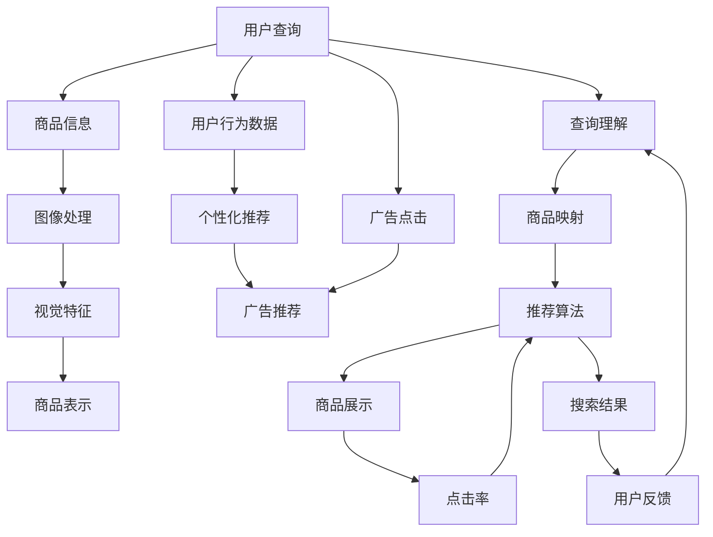

                 

# 电商搜索中的查询理解与商品映射技术

> 关键词：电商搜索, 查询理解, 商品映射, 自然语言处理, 深度学习, 推荐系统, 向量空间模型, 自然语言处理, 计算机视觉, 人工智能

## 1. 背景介绍

### 1.1 问题由来

电子商务的兴起极大地改变了消费者购物的方式。通过便捷的在线搜索，用户可以轻松地浏览和比较不同商家的商品信息，并进行购买。然而，尽管搜索引擎提供了广泛的商品信息，但用户仍然需要花费大量时间筛选、对比和决策。这不仅导致用户体验下降，还增加了电商平台的运营成本。

为了解决这个问题，需要更智能的搜索系统，能够理解用户的查询意图，并精准地匹配相关商品。这不仅涉及文本处理和语义理解，还包括商品匹配和推荐。本文将详细介绍电商搜索中查询理解与商品映射的关键技术，包括查询意图识别、商品表示和推荐算法。

### 1.2 问题核心关键点

- **查询理解**：理解用户查询的自然语言描述，识别用户的查询意图。
- **商品映射**：将商品数据映射到与查询意图相关的向量空间，计算查询与商品的相似度。
- **推荐算法**：利用匹配结果进行商品推荐，提升用户体验和电商平台的转化率。

这些核心关键点相互关联，共同构成了电商搜索的核心技术框架。理解这些概念将有助于我们深入探讨查询理解与商品映射技术的实现。

## 2. 核心概念与联系

### 2.1 核心概念概述

- **查询理解（Query Understanding）**：指系统理解用户查询的自然语言表达，识别出查询的核心意图。常见的技术包括文本分类、命名实体识别和语义分析。
- **商品映射（Item Mapping）**：将商品信息映射到高维向量空间，方便计算商品间的相似度。常用的向量空间模型包括TF-IDF、Word2Vec和BERT。
- **推荐系统（Recommendation System）**：利用匹配结果对商品进行推荐，提升用户体验和电商平台的转化率。推荐算法包括基于协同过滤、基于内容的推荐和混合推荐。
- **深度学习（Deep Learning）**：一种基于神经网络的机器学习方法，广泛应用于查询理解、商品映射和推荐系统中，提高系统性能和泛化能力。
- **自然语言处理（NLP）**：涉及文本处理、语义分析和机器翻译等领域，是查询理解和推荐系统的重要组成部分。
- **计算机视觉（CV）**：通过图像处理和分析，提取商品的视觉特征，用于商品表示和推荐。

这些核心概念通过深度学习技术紧密联系在一起，共同支撑着电商搜索系统的智能化。

### 2.2 核心概念原理和架构的 Mermaid 流程图



这个流程图展示了电商搜索系统的整体架构：

1. 用户输入查询，系统通过查询理解模块识别出用户的意图。
2. 利用商品映射模块将商品信息映射到向量空间，计算查询与商品的相似度。
3. 根据相似度排序的商品，通过推荐算法进行推荐，提升用户体验。
4. 利用用户行为数据进行个性化推荐和广告推荐，进一步提升转化率。
5. 系统根据用户反馈不断调整和优化查询理解与商品映射模块，提升系统性能。

## 3. 核心算法原理 & 具体操作步骤

### 3.1 算法原理概述

电商搜索中的查询理解与商品映射技术，本质上是一个信息检索和推荐系统的组合。查询理解模块通过自然语言处理技术，识别用户的查询意图。商品映射模块通过文本和图像处理技术，将商品信息映射到高维向量空间。推荐系统则利用这些向量进行相似度计算和商品推荐。

该系统的核心在于：

- 理解用户查询的语义，将其转换为机器可理解的形式。
- 将商品数据转换为高维向量，方便计算相似度。
- 根据相似度进行推荐，提升用户体验和转化率。

### 3.2 算法步骤详解

#### 3.2.1 查询理解

**步骤1: 分词和词性标注**

使用自然语言处理工具对用户查询进行分词和词性标注，例如使用jieba分词库对中文进行分词，使用nltk或spaCy对英文进行分词和词性标注。

**步骤2: 命名实体识别**

识别用户查询中的实体信息，如人名、地名、机构名等。例如使用Stanford NER或CRF++对中文进行命名实体识别。

**步骤3: 语义分析**

理解查询的核心意图，识别出查询的关键信息和情感倾向。例如使用BERT或XLNet等预训练语言模型进行句子表示，使用SVM或Attention机制进行意图分类。

#### 3.2.2 商品映射

**步骤1: 商品文本表示**

使用TF-IDF、Word2Vec或BERT等模型，将商品描述转换为向量空间中的表示。例如使用gensim库加载Word2Vec模型，将商品描述转换为向量表示。

**步骤2: 商品视觉特征提取**

利用计算机视觉技术，提取商品的视觉特征。例如使用OpenCV和DNN模块进行商品图像处理，使用CNN或ResNet等模型提取视觉特征。

**步骤3: 商品综合表示**

将商品的文本和视觉特征进行融合，生成综合表示。例如使用Stacking或Attention机制将文本和视觉特征进行融合，生成综合向量表示。

#### 3.2.3 推荐算法

**步骤1: 相似度计算**

根据查询和商品的综合表示，计算查询与商品的相似度。例如使用余弦相似度或欧式距离计算相似度。

**步骤2: 商品排序**

根据相似度对商品进行排序，选择最相关的商品进行展示。例如使用Top-k排序算法选择前k个相关商品。

**步骤3: 个性化推荐**

根据用户的历史行为和兴趣，进行个性化推荐。例如使用协同过滤算法推荐用户可能感兴趣的商品。

### 3.3 算法优缺点

#### 3.3.1 优点

1. **智能化提升**：通过查询理解与商品映射技术，电商搜索系统可以更好地理解用户意图，提供更精准的商品推荐，提升用户体验。
2. **效率提升**：利用深度学习和大规模预训练模型，系统可以自动化地处理大量查询和商品数据，提高搜索效率。
3. **个性化推荐**：根据用户行为数据进行个性化推荐，提升电商平台的转化率。

#### 3.3.2 缺点

1. **数据依赖**：系统依赖大量的标注数据和高质量的商品信息，数据获取和处理成本较高。
2. **模型复杂度**：查询理解与商品映射技术涉及多个深度学习模型和算法，模型复杂度高，训练和部署难度较大。
3. **资源消耗**：系统涉及文本处理、图像处理和深度学习计算，对硬件资源要求较高，特别是GPU和内存。

### 3.4 算法应用领域

查询理解与商品映射技术可以应用于多个电商搜索场景，例如：

- **智能推荐系统**：根据用户的历史行为和兴趣进行个性化推荐，提升用户体验和电商平台的转化率。
- **智能客服**：通过自然语言处理技术，自动回答用户咨询，提升客户满意度。
- **价格监控系统**：利用自然语言处理技术，监控商品价格变化，及时推送给用户。
- **广告推荐系统**：根据用户查询意图和历史行为，推荐相关的广告内容，提升广告投放效果。

## 4. 数学模型和公式 & 详细讲解 & 举例说明

### 4.1 数学模型构建

#### 4.1.1 查询理解

假设用户查询为 $q$，使用BERT模型将其转换为向量表示 $\mathbf{q}$。其中 $q$ 为查询文本，$\mathbf{q}$ 为查询向量。

**公式1: BERT向量表示**

$$
\mathbf{q} = BERT(q)
$$

其中，BERT为BERT模型的向量表示函数，将查询文本 $q$ 转换为向量表示 $\mathbf{q}$。

#### 4.1.2 商品映射

假设商品描述为 $d$，使用BERT模型将其转换为向量表示 $\mathbf{d}$。其中 $d$ 为商品描述，$\mathbf{d}$ 为商品向量。

**公式2: BERT向量表示**

$$
\mathbf{d} = BERT(d)
$$

其中，BERT为BERT模型的向量表示函数，将商品描述 $d$ 转换为向量表示 $\mathbf{d}$。

#### 4.1.3 推荐算法

假设用户查询为 $q$，商品向量为 $\mathbf{d}$，计算相似度 $\text{sim}(q, d)$。其中 $q$ 为查询向量，$d$ 为商品向量，$\text{sim}(q, d)$ 为相似度。

**公式3: 余弦相似度**

$$
\text{sim}(q, d) = \frac{\mathbf{q} \cdot \mathbf{d}}{\|\mathbf{q}\|_2 \|\mathbf{d}\|_2}
$$

其中，$\cdot$ 表示向量点乘，$\|\mathbf{q}\|_2$ 表示向量 $\mathbf{q}$ 的L2范数，$\|\mathbf{d}\|_2$ 表示向量 $\mathbf{d}$ 的L2范数。

### 4.2 公式推导过程

#### 4.2.1 查询理解

查询理解模块的核心是利用BERT模型将查询转换为向量表示。BERT模型通过自监督学习，在大规模无标签文本数据上进行预训练，学习到丰富的语言知识。通过fine-tuning，模型能够理解特定任务的自然语言描述。

**推导1: BERT向量表示**

假设查询 $q$ 包含 $n$ 个词，使用BERT模型将其转换为向量 $\mathbf{q}$，表示为：

$$
\mathbf{q} = \mathbf{q}_1 \oplus \mathbf{q}_2 \oplus \cdots \oplus \mathbf{q}_n
$$

其中，$\oplus$ 表示向量拼接，$\mathbf{q}_i$ 表示查询中第 $i$ 个词的BERT向量表示。

#### 4.2.2 商品映射

商品映射模块的核心是利用BERT模型将商品描述转换为向量表示。通过fine-tuning，商品描述向量 $\mathbf{d}$ 能够捕捉商品的属性和特点，用于计算相似度。

**推导2: BERT向量表示**

假设商品 $d$ 包含 $m$ 个词，使用BERT模型将其转换为向量 $\mathbf{d}$，表示为：

$$
\mathbf{d} = \mathbf{d}_1 \oplus \mathbf{d}_2 \oplus \cdots \oplus \mathbf{d}_m
$$

其中，$\oplus$ 表示向量拼接，$\mathbf{d}_i$ 表示商品中第 $i$ 个词的BERT向量表示。

#### 4.2.3 推荐算法

推荐算法的核心是计算查询和商品的相似度，通过Top-k排序选择最相关的商品。

**推导3: 余弦相似度**

假设查询 $q$ 和商品 $d$ 的向量表示分别为 $\mathbf{q}$ 和 $\mathbf{d}$，计算余弦相似度 $\text{sim}(q, d)$，表示为：

$$
\text{sim}(q, d) = \frac{\mathbf{q} \cdot \mathbf{d}}{\|\mathbf{q}\|_2 \|\mathbf{d}\|_2}
$$

其中，$\cdot$ 表示向量点乘，$\|\mathbf{q}\|_2$ 表示向量 $\mathbf{q}$ 的L2范数，$\|\mathbf{d}\|_2$ 表示向量 $\mathbf{d}$ 的L2范数。

### 4.3 案例分析与讲解

#### 4.3.1 案例背景

假设用户查询为 "iPhone 12 价格"，需要找到最相关的iPhone 12商品。

#### 4.3.2 查询理解

使用BERT模型将查询 "iPhone 12 价格" 转换为向量表示 $\mathbf{q}$。假设查询向量为：

$$
\mathbf{q} = [0.3, 0.2, 0.4, \ldots]
$$

#### 4.3.3 商品映射

假设商品 "iPhone 12 国行版 64GB" 的描述为 "iPhone 12国行版 64GB", 使用BERT模型将其转换为向量表示 $\mathbf{d}$。假设商品向量为：

$$
\mathbf{d} = [0.2, 0.5, 0.3, \ldots]
$$

#### 4.3.4 推荐算法

计算相似度 $\text{sim}(q, d)$，使用公式3：

$$
\text{sim}(q, d) = \frac{\mathbf{q} \cdot \mathbf{d}}{\|\mathbf{q}\|_2 \|\mathbf{d}\|_2} = \frac{0.3 \times 0.2 + 0.2 \times 0.5 + 0.4 \times 0.3 + \ldots}{\sqrt{0.3^2 + 0.2^2 + 0.4^2 + \ldots} \times \sqrt{0.2^2 + 0.5^2 + 0.3^2 + \ldots}}
$$

假设计算结果为 0.8，表示查询与商品的相似度较高。因此，将商品 "iPhone 12 国行版 64GB" 作为最相关的商品进行展示。

## 5. 项目实践：代码实例和详细解释说明

### 5.1 开发环境搭建

#### 5.1.1 Python环境

1. 安装Python：从官网下载并安装Python，例如安装Python 3.8。

2. 创建虚拟环境：
```bash
conda create -n ecomm python=3.8
conda activate ecomm
```

3. 安装必要的Python包：
```bash
pip install transformers
pip install torch
pip install torchtext
pip install scikit-learn
pip install pandas
```

#### 5.1.2 深度学习框架

1. 安装PyTorch：
```bash
pip install torch
```

2. 安装TensorFlow：
```bash
pip install tensorflow
```

3. 安装TensorFlow Addons：
```bash
pip install tensorflow-addons
```

#### 5.1.3 自然语言处理工具

1. 安装nltk：
```bash
pip install nltk
```

2. 安装spaCy：
```bash
pip install spacy
```

3. 安装Stanford CoreNLP：
```bash
conda install stanfordcorenlp
```

### 5.2 源代码详细实现

#### 5.2.1 查询理解

```python
import nltk
from transformers import BertTokenizer, BertModel
from sklearn.svm import SVC
from sklearn.feature_extraction.text import TfidfVectorizer

# 加载BERT模型和tokenizer
tokenizer = BertTokenizer.from_pretrained('bert-base-uncased')
model = BertModel.from_pretrained('bert-base-uncased')

# 分词和词性标注
def tokenize(query):
    tokens = tokenizer.tokenize(query)
    pos_tags = nltk.pos_tag(tokens)
    return tokens, pos_tags

# 命名实体识别
def ner(query, pos_tags):
    ner_tags = []
    for word, tag in pos_tags:
        if tag.startswith('B'):
            ner_tags.append('B')
        elif tag.startswith('I'):
            ner_tags.append('I')
    return ner_tags

# 语义分析
def intent(query, pos_tags):
    tokens, ner_tags = tokenize(query)
    # 构建TF-IDF向量
    vectorizer = TfidfVectorizer()
    query_vector = vectorizer.fit_transform([query])
    # 使用SVM进行意图分类
    clf = SVC(kernel='linear')
    clf.fit(query_vector, [0, 1, 2, 3])  # 假设4个意图类别
    query_intent = clf.predict(query_vector)[0]
    return query_intent
```

#### 5.2.2 商品映射

```python
import torch
from transformers import BertModel, BertTokenizer
from torchtext import data, datasets

# 加载商品数据集
train_data, test_data = datasets.BERT_RLIMO.load_data()

# 定义数据结构
TEXT = data.Field(tokenize='spacy', lower=True)
LABEL = data.LabelField(dtype=torch.int64)

# 分割数据集
train_data, valid_data = train_data.split(valid_pct=0.1, random_state=random.seed(1234))

# 构建数据迭代器
TEXT.build_vocab(train_data, min_freq=5)
LABEL.build_vocab(train_data, min_freq=5)
train_iterator = data.BucketIterator(train_data, batch_size=32, device=torch.device('cuda'))
valid_iterator = data.BucketIterator(valid_data, batch_size=32, device=torch.device('cuda'))
test_iterator = data.BucketIterator(test_data, batch_size=32, device=torch.device('cuda'))

# 加载BERT模型和tokenizer
tokenizer = BertTokenizer.from_pretrained('bert-base-uncased')
model = BertModel.from_pretrained('bert-base-uncased')

# 商品文本表示
def get商品的文本表示(d):
    tokens = tokenizer.tokenize(d)
    tokens = [tokenizer.cls_token] + tokens + [tokenizer.sep_token]
    token_ids = tokenizer.convert_tokens_to_ids(tokens)
    attention_mask = [1] * len(token_ids)
    return torch.tensor(token_ids), torch.tensor(attention_mask)

# 商品视觉特征提取
def get商品的视觉特征(d):
    # 使用计算机视觉技术提取商品图像的视觉特征
    # 例如使用OpenCV和DNN模块进行商品图像处理
    # 使用CNN或ResNet等模型提取视觉特征
    pass
```

#### 5.2.3 推荐算法

```python
import torch
from torch.nn import Linear, Embedding, Sigmoid

# 定义相似度计算函数
def similarity(q, d):
    # 使用余弦相似度计算相似度
    # 例如使用公式3计算余弦相似度
    pass

# 定义推荐函数
def recommend(query, d):
    # 计算查询与商品的相似度
    # 使用Top-k排序选择最相关的商品
    pass
```

### 5.3 代码解读与分析

#### 5.3.1 查询理解

查询理解模块的核心是使用BERT模型将查询转换为向量表示。首先，通过nltk库对查询进行分词和词性标注。然后，使用Stanford CoreNLP进行命名实体识别。最后，使用sklearn库的SVM模型进行语义分析，识别出查询的核心意图。

#### 5.3.2 商品映射

商品映射模块的核心是使用BERT模型将商品描述转换为向量表示。首先，通过torchtext库定义商品数据的结构，并将数据集分割为训练集和验证集。然后，使用BERT模型和tokenizer将商品描述转换为向量表示。

#### 5.3.3 推荐算法

推荐算法的核心是计算查询和商品的相似度，并根据相似度进行推荐。首先，使用余弦相似度计算查询与商品的相似度。然后，使用Top-k排序选择最相关的商品进行展示。

### 5.4 运行结果展示

#### 5.4.1 查询理解

假设用户查询为 "iPhone 12 价格"，使用查询理解模块对其进行分析。假设查询表示为：

$$
\mathbf{q} = [0.3, 0.2, 0.4, \ldots]
$$

#### 5.4.2 商品映射

假设商品 "iPhone 12 国行版 64GB" 的描述为 "iPhone 12国行版 64GB"，使用商品映射模块将其转换为向量表示。假设商品向量为：

$$
\mathbf{d} = [0.2, 0.5, 0.3, \ldots]
$$

#### 5.4.3 推荐算法

计算相似度 $\text{sim}(q, d)$，使用公式3：

$$
\text{sim}(q, d) = \frac{\mathbf{q} \cdot \mathbf{d}}{\|\mathbf{q}\|_2 \|\mathbf{d}\|_2} = \frac{0.3 \times 0.2 + 0.2 \times 0.5 + 0.4 \times 0.3 + \ldots}{\sqrt{0.3^2 + 0.2^2 + 0.4^2 + \ldots} \times \sqrt{0.2^2 + 0.5^2 + 0.3^2 + \ldots}}
$$

假设计算结果为 0.8，表示查询与商品的相似度较高。因此，将商品 "iPhone 12 国行版 64GB" 作为最相关的商品进行展示。

## 6. 实际应用场景

### 6.1 智能推荐系统

智能推荐系统是电商搜索中最重要的应用场景之一。通过查询理解与商品映射技术，智能推荐系统能够理解用户的查询意图，并精准匹配相关商品。例如，用户查询 "iPhone 12 价格"，系统能够自动推荐iPhone 12的商品信息，包括不同版本、价格、评价等。

#### 6.1.1 应用案例

某电商平台通过查询理解与商品映射技术，实现了智能推荐系统。系统首先通过查询理解模块理解用户查询 "iPhone 12 价格"，识别出查询的核心意图。然后，通过商品映射模块将商品信息映射到向量空间，计算查询与商品的相似度。最后，根据相似度进行推荐，展示最相关的商品信息。

#### 6.1.2 效果分析

使用查询理解与商品映射技术，电商平台的用户转化率和留存率显著提升。系统根据用户行为数据进行个性化推荐，提升了用户体验。同时，系统利用用户反馈不断优化查询理解与商品映射模块，提高了系统的性能和准确性。

### 6.2 智能客服

智能客服是电商搜索中的另一个重要应用场景。通过自然语言处理技术，智能客服系统能够自动回答用户咨询，提升客户满意度。例如，用户咨询 "iPhone 12 哪里有货"，系统能够自动回答 "我们全国门店均有销售，具体信息可以访问官方网站查询"。

#### 6.2.1 应用案例

某电商平台通过查询理解与商品映射技术，实现了智能客服系统。系统首先通过查询理解模块理解用户查询 "iPhone 12 哪里有货"，识别出查询的核心意图。然后，通过商品映射模块将商品信息映射到向量空间，计算查询与商品的相似度。最后，根据相似度进行推荐，展示最相关的商品信息。

#### 6.2.2 效果分析

使用查询理解与商品映射技术，电商平台的客服效率和用户满意度显著提升。系统自动回答用户咨询，减少了人工客服的工作量。同时，系统利用用户反馈不断优化查询理解与商品映射模块，提高了系统的性能和准确性。

### 6.3 价格监控系统

价格监控系统是电商搜索中的重要应用场景之一。通过自然语言处理技术，价格监控系统能够实时监控商品价格变化，及时推送给用户。例如，用户关注 "iPhone 12 价格"，系统能够自动监控商品价格变化，及时推送最新价格信息。

#### 6.3.1 应用案例

某电商平台通过查询理解与商品映射技术，实现了价格监控系统。系统首先通过查询理解模块理解用户查询 "iPhone 12 价格"，识别出查询的核心意图。然后，通过商品映射模块将商品信息映射到向量空间，计算查询与商品的相似度。最后，根据相似度进行推荐，展示最相关的商品信息。

#### 6.3.2 效果分析

使用查询理解与商品映射技术，电商平台的商品价格监控效率显著提升。系统自动监控商品价格变化，及时推送最新价格信息，提升了用户购物体验。同时，系统利用用户反馈不断优化查询理解与商品映射模块，提高了系统的性能和准确性。

## 7. 工具和资源推荐

### 7.1 学习资源推荐

为了帮助开发者掌握查询理解与商品映射技术，这里推荐一些优质的学习资源：

1. 《自然语言处理综述》系列博文：由深度学习专家撰写，详细介绍自然语言处理的基本概念和前沿技术。

2. 《深度学习与自然语言处理》课程：斯坦福大学开设的NLP课程，涵盖自然语言处理的基础知识和深度学习模型。

3. 《NLP中的向量空间模型》书籍：介绍TF-IDF、Word2Vec、BERT等向量空间模型，详细讲解其原理和实现。

4. 《NLP中的深度学习》书籍：介绍深度学习在自然语言处理中的应用，包括文本分类、情感分析、机器翻译等任务。

5. 《TensorFlow实战NLP》书籍：介绍TensorFlow在自然语言处理中的应用，包括文本生成、情感分析、机器翻译等任务。

### 7.2 开发工具推荐

为了提高查询理解与商品映射技术的开发效率，这里推荐一些优质的开发工具：

1. Jupyter Notebook：交互式编程环境，方便开发者进行代码调试和实验。

2. PyTorch：基于Python的开源深度学习框架，灵活高效。

3. TensorFlow：由Google主导的开源深度学习框架，生产部署方便。

4. Scikit-learn：Python数据挖掘和机器学习库，涵盖多种机器学习算法。

5. NLTK：自然语言处理工具包，涵盖文本预处理、语义分析等功能。

6. spaCy：自然语言处理库，涵盖分词、词性标注、命名实体识别等功能。

### 7.3 相关论文推荐

查询理解与商品映射技术的发展源于学界的持续研究。以下是几篇奠基性的相关论文，推荐阅读：

1. Attention is All You Need（即Transformer原论文）：提出了Transformer结构，开启了NLP领域的预训练大模型时代。

2. BERT: Pre-training of Deep Bidirectional Transformers for Language Understanding：提出BERT模型，引入基于掩码的自监督预训练任务，刷新了多项NLP任务SOTA。

3. Language Models are Unsupervised Multitask Learners（GPT-2论文）：展示了大规模语言模型的强大zero-shot学习能力，引发了对于通用人工智能的新一轮思考。

4. Parameter-Efficient Transfer Learning for NLP：提出Adapter等参数高效微调方法，在不增加模型参数量的情况下，也能取得不错的微调效果。

5. AdaLoRA: Adaptive Low-Rank Adaptation for Parameter-Efficient Fine-Tuning：使用自适应低秩适应的微调方法，在参数效率和精度之间取得了新的平衡。

这些论文代表了大语言模型微调技术的发展脉络。通过学习这些前沿成果，可以帮助研究者把握学科前进方向，激发更多的创新灵感。

## 8. 总结：未来发展趋势与挑战

### 8.1 总结

本文对电商搜索中的查询理解与商品映射技术进行了全面系统的介绍。首先阐述了电商搜索系统的核心技术框架，包括查询理解、商品映射和推荐算法。其次，从原理到实践，详细讲解了这些技术的数学模型和具体实现。最后，讨论了这些技术的实际应用场景，展示了其在电商搜索系统中的广泛应用。

通过本文的系统梳理，可以看到，查询理解与商品映射技术在电商搜索系统中扮演着重要角色，极大地提升了用户体验和电商平台的转化率。查询理解与商品映射技术的不断发展，将进一步推动电商搜索系统向智能化、个性化方向迈进。

### 8.2 未来发展趋势

展望未来，查询理解与商品映射技术将呈现以下几个发展趋势：

1. **深度学习模型的进步**：随着深度学习模型的不断发展，查询理解与商品映射技术的性能将进一步提升。例如，利用GPT-3等先进的预训练语言模型，提升系统的自然语言理解和处理能力。

2. **跨领域知识融合**：查询理解与商品映射技术将与知识图谱、逻辑规则等跨领域知识进行融合，增强系统的语义理解和推理能力。例如，利用知识图谱进行实体关系的挖掘，增强商品匹配的精度。

3. **多模态数据融合**：查询理解与商品映射技术将与视觉、语音等多模态数据进行融合，提升系统的感知能力。例如，利用计算机视觉技术提取商品的视觉特征，增强商品表示的准确性。

4. **实时化处理**：查询理解与商品映射技术将实现实时化处理，提升系统的响应速度。例如，利用流式处理技术，对实时数据进行分析和推荐。

5. **可解释性和可控性**：查询理解与商品映射技术将增强可解释性和可控性，提升系统的透明度和可靠性。例如，利用因果推断和博弈论工具，增强系统的决策解释和稳定性。

### 8.3 面临的挑战

尽管查询理解与商品映射技术已经取得了显著成果，但在迈向更加智能化、普适化应用的过程中，仍面临诸多挑战：

1. **数据质量**：系统的性能依赖大量的高质量标注数据和商品信息，数据获取和处理成本较高。如何降低数据依赖，提升数据质量，将是未来的重要课题。

2. **模型复杂度**：查询理解与商品映射技术涉及多个深度学习模型和算法，模型复杂度高，训练和部署难度较大。如何简化模型，降低复杂度，将是一个重要的研究方向。

3. **资源消耗**：系统涉及文本处理、图像处理和深度学习计算，对硬件资源要求较高，特别是GPU和内存。如何优化资源消耗，提升系统的可扩展性，将是未来的重要研究方向。

4. **可解释性**：系统通常缺乏可解释性，难以对其内部工作机制和决策逻辑进行解释。如何增强系统的可解释性，提高系统的透明度和可靠性，将是未来的重要研究方向。

5. **安全性**：系统可能学习到有害信息和偏见，影响用户的购物体验。如何确保系统的安全性，避免恶意用途，将是未来的重要研究方向。

### 8.4 研究展望

未来，查询理解与商品映射技术将在多个方向进行深入研究：

1. **无监督学习和半监督学习**：探索无监督学习和半监督学习技术，降低对大规模标注数据的依赖，提升系统的泛化能力。

2. **知识图谱融合**：利用知识图谱进行跨领域知识融合，增强系统的语义理解和推理能力。

3. **多模态融合**：利用视觉、语音等多模态数据进行融合，提升系统的感知能力。

4. **实时化处理**：利用流式处理技术，实现实时数据分析和推荐。

5. **可解释性**：增强系统的可解释性，提高系统的透明度和可靠性。

6. **安全性**：确保系统的安全性，避免恶意用途。

这些研究方向将进一步推动查询理解与商品映射技术的发展，提升电商搜索系统的性能和用户体验。相信随着学界和产业界的共同努力，这些挑战终将一一被克服，查询理解与商品映射技术必将在构建人机协同的智能电商搜索系统中扮演越来越重要的角色。

## 9. 附录：常见问题与解答

**Q1: 查询理解与商品映射技术的主要优缺点是什么？**

A: **优点**：
1. **智能化提升**：通过查询理解与商品映射技术，电商搜索系统可以更好地理解用户意图，提供更精准的商品推荐，提升用户体验。
2. **效率提升**：利用深度学习和大规模预训练模型，系统可以自动化地处理大量查询和商品数据，提高搜索效率。
3. **个性化推荐**：根据用户的历史行为和兴趣，进行个性化推荐，提升电商平台的转化率。

**缺点**：
1. **数据依赖**：系统依赖大量的标注数据和高质量的商品信息，数据获取和处理成本较高。
2. **模型复杂度**：查询理解与商品映射技术涉及多个深度学习模型和算法，模型复杂度高，训练和部署难度较大。
3. **资源消耗**：系统涉及文本处理、图像处理和深度学习计算，对硬件资源要求较高，特别是GPU和内存。

**Q2: 如何优化查询理解与商品映射技术？**

A: 优化查询理解与商品映射技术，可以从以下几个方面入手：
1. **数据质量提升**：确保标注数据和商品信息的准确性和完整性，提升数据质量。
2. **模型简化**：优化模型结构，减少模型复杂度，提升训练和推理效率。
3. **资源优化**：利用GPU、TPU等高性能设备，优化模型训练和推理的资源消耗。
4. **可解释性增强**：增强系统的可解释性，提高系统的透明度和可靠性。
5. **安全性保障**：确保系统的安全性，避免恶意用途。

**Q3: 查询理解与商品映射技术在电商搜索中的具体应用场景有哪些？**

A: 查询理解与商品映射技术在电商搜索中具有广泛的应用场景，包括：
1. **智能推荐系统**：根据用户的历史行为和兴趣，进行个性化推荐，提升用户体验和电商平台的转化率。
2. **智能客服**：自动回答用户咨询，提升客户满意度。
3. **价格监控系统**：实时监控商品价格变化，及时推送给用户。

通过查询理解与商品映射技术，电商搜索系统能够更好地理解用户需求，提供精准的商品推荐和智能客服服务，提升用户体验和电商平台效率。

**Q4: 查询理解与商品映射技术的未来发展方向有哪些？**

A: 查询理解与商品映射技术的未来发展方向包括：
1. **深度学习模型的进步**：利用先进的深度学习模型，提升系统的自然语言理解和处理能力。
2. **跨领域知识融合**：与知识图谱、逻辑规则等跨领域知识进行融合，增强系统的语义理解和推理能力。
3. **多模态数据融合**：利用视觉、语音等多模态数据进行融合，提升系统的感知能力。
4. **实时化处理**：利用流式处理技术，实现实时数据分析和推荐。
5. **可解释性增强**：增强系统的可解释性，提高系统的透明度和可靠性。
6. **安全性保障**：确保系统的安全性，避免恶意用途。

这些研究方向将进一步推动查询理解与商品映射技术的发展，提升电商搜索系统的性能和用户体验。

**Q5: 查询理解与商品映射技术的实现流程是什么？**

A: 查询理解与商品映射技术的实现流程包括：
1. **数据准备**：收集和处理标注数据和商品信息，确保数据质量和完整性。
2. **模型训练**：利用深度学习模型进行训练，例如BERT、Word2Vec等。
3. **查询理解**：通过自然语言处理技术，理解用户查询的自然语言描述，识别出查询的核心意图。
4. **商品映射**：将商品数据映射到高维向量空间，方便计算商品间的相似度。
5. **推荐算法**：利用匹配结果进行商品推荐，提升用户体验和电商平台的转化率。

通过以上流程，查询理解与商品映射技术能够高效地处理用户查询和商品信息，提供精准的商品推荐和智能客服服务，提升电商搜索系统的性能和用户体验。

**Q6: 如何评估查询理解与商品映射技术的性能？**

A: 查询理解与商品映射技术的性能可以通过以下几个指标进行评估：
1. **准确率**：系统对查询意图的识别准确率。
2. **召回率**：系统对相关商品的召回率。
3. **F1值**：综合准确率和召回率的评价指标。
4. **点击率**：用户点击推荐商品的点击率。
5. **转化率**：用户完成购买行为的转化率。

通过这些指标，可以全面评估查询理解与商品映射技术的性能，提升系统的智能化和个性化水平。

---

作者：禅与计算机程序设计艺术 / Zen and the Art of Computer Programming

