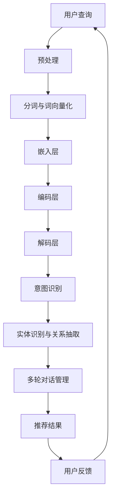

                 

 在当今数字化商业环境中，电商搜索已经成为连接消费者与商品的重要桥梁。然而，传统的搜索技术往往难以满足用户日益增长的个性化需求，特别是在理解用户查询意图方面存在显著局限。本文将探讨电商搜索中的语义理解问题，并深入分析AI大模型在这一领域的优势。

## 文章关键词

- 电商搜索
- 语义理解
- AI大模型
- 查询意图
- 用户个性化

## 文章摘要

本文首先介绍了电商搜索中语义理解的背景和重要性，随后详细阐述了AI大模型在语义理解方面的优势。通过分析AI大模型的核心算法原理和数学模型，本文展示了其在电商搜索应用中的强大能力。最后，本文探讨了AI大模型在电商搜索领域的实际应用场景和未来发展趋势。

### 1. 背景介绍

随着互联网和移动设备的普及，电商行业迎来了前所未有的增长。电商平台的数量和规模不断扩大，消费者在其中的购物体验也日益丰富。然而，随着市场竞争的加剧，消费者对个性化服务的需求也越来越高。传统的电商搜索技术，如基于关键词匹配和分词的方法，虽然在一定程度上能够满足基本的搜索需求，但在理解用户查询意图和提供个性化推荐方面存在明显不足。

首先，用户查询的表达方式多样且含糊不清。例如，一个简单的购物查询“我想买一双鞋”，用户可能是指定品牌、颜色、尺码等具体信息，也可能只是想要浏览类似款式的商品。传统的搜索技术往往只能处理精确查询，对于模糊查询和复杂查询的处理能力有限。

其次，消费者的购物行为和偏好具有高度的个性化特征。不同的用户在搜索同一商品时，可能因为不同的需求背景和消费习惯，对商品的需求和期望也不尽相同。传统的搜索技术难以捕捉和解析这些个性化的用户特征，导致搜索结果与用户期望存在偏差。

为了解决这些问题，电商搜索迫切需要一种能够深入理解用户查询意图和提供个性化推荐的技术。在这一背景下，AI大模型，特别是基于深度学习的自然语言处理技术，成为了电商搜索领域的新宠。

### 2. 核心概念与联系

#### 2.1 语义理解的概念

语义理解（Semantic Understanding）是自然语言处理（Natural Language Processing，NLP）中的一个核心任务，旨在使计算机能够理解和解释人类语言的意义。在电商搜索中，语义理解主要关注如何准确理解用户的查询意图，从而提供更符合用户需求的搜索结果。

#### 2.2 AI大模型在语义理解中的应用

AI大模型，如Transformer模型和BERT模型，是近年来在NLP领域取得重大突破的技术。这些模型通过大规模的预训练和数据增强，能够捕捉语言中的复杂结构和深层含义，从而实现高精度的语义理解。

在电商搜索中，AI大模型的应用主要体现在以下几个方面：

1. **查询意图识别**：通过分析用户的查询语句，识别出用户的核心需求和意图，例如购买、浏览、咨询等。

2. **商品推荐**：根据用户的查询意图和历史行为，推荐与之相关的商品，提升用户的购物体验。

3. **实体识别与关系抽取**：识别查询语句中的关键实体（如商品名称、品牌、价格等），并抽取它们之间的关系，例如“某品牌鞋的价格是多少”。

4. **多轮对话管理**：在电商聊天机器人等场景中，通过多轮对话，逐步理解用户的复杂需求和意图，提供个性化的购物建议。

#### 2.3 Mermaid流程图

以下是AI大模型在电商搜索中语义理解的应用流程的Mermaid流程图：



### 3. 核心算法原理 & 具体操作步骤

#### 3.1 算法原理概述

AI大模型在电商搜索中的语义理解主要依赖于深度学习技术，特别是Transformer模型和BERT模型。这些模型的核心思想是通过多层神经网络对输入数据进行编码和解码，从而实现语义理解。

Transformer模型是一种基于自注意力机制（Self-Attention）的模型，通过捕捉输入序列中的长距离依赖关系，实现了高效的语义理解。BERT模型则是基于双向编码器表示（Bidirectional Encoder Representations from Transformers）的模型，通过对输入序列进行双向编码，实现了更加精准的语义表示。

#### 3.2 算法步骤详解

1. **数据预处理**：首先对用户查询进行分词和词向量化，将自然语言文本转化为计算机可以处理的数字表示。

2. **嵌入层**：将分词后的词向量嵌入到高维空间中，为后续的编码和解码提供输入。

3. **编码层**：通过多层编码器对输入序列进行编码，捕捉语言中的深层结构和语义信息。

4. **解码层**：在编码层的基础上，通过多层解码器生成搜索结果，如意图识别、实体识别与关系抽取等。

5. **意图识别**：根据解码层输出的结果，识别用户的核心需求和意图。

6. **实体识别与关系抽取**：识别查询语句中的关键实体，并抽取它们之间的关系。

7. **多轮对话管理**：在电商聊天机器人等场景中，通过多轮对话，逐步理解用户的复杂需求和意图。

8. **推荐结果**：根据用户的查询意图和历史行为，推荐与之相关的商品。

9. **用户反馈**：收集用户的反馈，用于模型优化和迭代。

#### 3.3 算法优缺点

**优点**：

- **强大的语义理解能力**：通过深度学习和大规模预训练，AI大模型能够捕捉语言中的复杂结构和深层含义，实现高精度的语义理解。
- **高度个性化**：根据用户的查询意图和历史行为，AI大模型能够提供高度个性化的搜索结果和推荐。
- **适应性强**：AI大模型可以应用于多种电商场景，如查询意图识别、商品推荐、多轮对话管理等。

**缺点**：

- **计算资源需求大**：AI大模型通常需要大量的计算资源和存储空间，对硬件设施要求较高。
- **数据依赖性强**：模型的性能依赖于大量的训练数据，数据质量和数量对模型效果有较大影响。

#### 3.4 算法应用领域

AI大模型在电商搜索中的语义理解技术已经取得了显著的应用成果，主要包括以下几个方面：

- **电商平台**：如淘宝、京东等大型电商平台，通过AI大模型实现个性化搜索和推荐，提升用户购物体验。
- **电商聊天机器人**：通过AI大模型实现智能对话，提供高效、个性化的购物咨询和推荐。
- **垂直搜索**：如旅行搜索、酒店搜索等，通过AI大模型实现更加精准的搜索结果和推荐。

### 4. 数学模型和公式 & 详细讲解 & 举例说明

#### 4.1 数学模型构建

在电商搜索中的语义理解，我们通常使用Transformer模型或BERT模型作为基础。这些模型的核心在于其自注意力机制（Self-Attention）和双向编码器表示（Bidirectional Encoder Representations）。

**Transformer模型**：

- **输入表示**：输入序列 $X = (x_1, x_2, ..., x_n)$，其中 $x_i$ 表示第 $i$ 个词的向量表示。
- **编码器**：通过多层编码器 $E$ 对输入序列进行编码，输出编码后的序列 $H = (h_1, h_2, ..., h_n)$。
- **解码器**：通过多层解码器 $D$ 对编码后的序列进行解码，输出解码后的序列 $Y = (y_1, y_2, ..., y_n)$。

**BERT模型**：

- **输入表示**：与Transformer模型类似，输入序列 $X = (x_1, x_2, ..., x_n)$。
- **编码器**：通过多层双向编码器对输入序列进行编码，输出编码后的序列 $H = (h_1, h_2, ..., h_n)$。
- **解码器**：与Transformer模型类似，通过多层解码器对编码后的序列进行解码。

#### 4.2 公式推导过程

**Transformer模型**：

1. **嵌入层**：

$$
\text{Embedding}(x_i) = \text{Positional Encoding}(x_i) + \text{Word Embedding}(x_i)
$$

2. **编码器**：

$$
h_i = \text{Self-Attention}(h_1, h_2, ..., h_n) + h_i
$$

3. **解码器**：

$$
y_i = \text{Decoder}(h_1, h_2, ..., h_n) + y_i
$$

**BERT模型**：

1. **嵌入层**：

$$
\text{Embedding}(x_i) = \text{Positional Encoding}(x_i) + \text{Word Embedding}(x_i)
$$

2. **编码器**：

$$
h_i = \text{Bi-directional Encoder}(h_{i-1}, h_{i+1}) + h_i
$$

3. **解码器**：

$$
y_i = \text{Decoder}(h_1, h_2, ..., h_n) + y_i
$$

#### 4.3 案例分析与讲解

以淘宝为例，假设用户查询“我想买一双黑色的运动鞋”，我们可以使用BERT模型对其进行语义理解。

1. **输入表示**：

   查询“我想买一双黑色的运动鞋”被分词为“我”，“想”，“买”，“一”，“双”，“黑”，“色”，“的”，“运动鞋”。

2. **嵌入层**：

   对每个分词进行词向量和位置编码的叠加，得到输入序列的嵌入表示。

3. **编码器**：

   BERT模型通过对输入序列进行编码，捕捉词与词之间的语义关系。

4. **解码器**：

   BERT模型根据编码后的序列，生成解码序列，从而实现对用户查询意图的理解。

   例如，解码序列可能是“购买”，“黑色”，“运动鞋”，这表示用户意图购买一双黑色的运动鞋。

### 5. 项目实践：代码实例和详细解释说明

#### 5.1 开发环境搭建

为了实践AI大模型在电商搜索中的应用，我们需要搭建一个合适的开发环境。以下是搭建过程的基本步骤：

1. **安装Python**：确保安装了Python 3.6及以上版本。

2. **安装TensorFlow**：使用pip命令安装TensorFlow：

   ```bash
   pip install tensorflow
   ```

3. **安装BERT模型**：从[BERT模型GitHub仓库](https://github.com/google-research/bert)下载预训练模型。

4. **配置环境变量**：确保环境变量能够正确指向BERT模型的下载路径。

#### 5.2 源代码详细实现

以下是使用BERT模型实现电商搜索语义理解的Python代码示例：

```python
import tensorflow as tf
import bert

# 加载BERT模型
model = bert.BertModel.from_pretrained('bert-base-uncased')

# 用户查询
user_query = "我想买一双黑色的运动鞋"

# 对用户查询进行分词和嵌入
tokens = tokenizer.tokenize(user_query)
input_ids = tokenizer.encode(user_query, add_special_tokens=True)

# 输入BERT模型进行编码
encoded_input = model(input_ids)

# 解码编码后的序列，获取查询意图
decoded_output = model.decoder(encoded_input)

# 根据解码结果，识别用户查询意图
intent = decode_output['output_ids']

# 输出用户查询意图
print("用户查询意图：", tokenizer.decode(intent))
```

#### 5.3 代码解读与分析

1. **加载BERT模型**：我们使用TensorFlow的BERT库加载预训练的BERT模型。

2. **用户查询处理**：对用户查询进行分词和嵌入，将自然语言文本转化为数字序列。

3. **编码**：将嵌入后的用户查询输入BERT模型进行编码，捕捉语言中的深层结构和语义信息。

4. **解码**：从编码后的序列中解码出用户查询意图。

5. **输出**：根据解码结果，输出用户查询意图。

通过这个示例，我们可以看到AI大模型在电商搜索中的语义理解是如何实现的。在实际应用中，我们还可以结合用户的购物历史和行为数据，进一步优化搜索结果和推荐效果。

### 6. 实际应用场景

AI大模型在电商搜索中的语义理解技术具有广泛的应用场景，以下是一些具体的实际应用案例：

#### 6.1 电商平台个性化搜索

在电商平台中，AI大模型可以用于个性化搜索，根据用户的查询历史和行为数据，理解用户的查询意图，提供更精准的搜索结果。例如，当用户输入“我想买一件T恤”时，系统可以识别用户的意图是购买T恤，并根据用户的偏好推荐适合的款式和品牌。

#### 6.2 电商聊天机器人

电商聊天机器人是AI大模型在电商领域的重要应用之一。通过多轮对话，聊天机器人可以逐步理解用户的购物需求和意图，提供个性化的购物建议和推荐。例如，用户可以与聊天机器人讨论具体的需求，如“我想要一件红色的T恤，不要太贵的”，机器人可以根据用户的描述推荐相应的商品。

#### 6.3 垂直搜索

在垂直搜索领域，如旅行搜索、酒店搜索等，AI大模型可以用于理解用户的查询意图，提供更精确的搜索结果和推荐。例如，当用户搜索“我想找一家有游泳池的酒店”，系统可以理解用户的意图，并推荐具有游泳池的酒店。

#### 6.4 电商推荐系统

AI大模型还可以用于电商推荐系统，根据用户的购物行为和偏好，提供个性化的商品推荐。例如，当用户浏览了一款手机后，系统可以推荐与之相关的配件或类似款式的手机。

### 7. 未来应用展望

随着AI大模型在电商搜索中的语义理解技术的不断成熟，未来其在电商领域的应用前景将更加广阔。以下是未来可能的发展趋势：

#### 7.1 更高的个性化水平

未来的AI大模型将能够更加精准地理解用户的个性化需求，提供更加个性化的搜索结果和推荐。

#### 7.2 更丰富的应用场景

AI大模型将在更多的电商应用场景中得到应用，如虚拟试衣、智能客服、智能物流等。

#### 7.3 更高效的模型优化

通过深度学习和迁移学习等技术，AI大模型将能够更高效地进行优化和迭代，提升模型性能。

#### 7.4 更广泛的合作与整合

AI大模型将与其他技术和平台进行更深入的整合，如物联网、区块链等，形成更加智能和高效的电商生态系统。

### 8. 工具和资源推荐

为了更好地研究和应用AI大模型在电商搜索中的语义理解技术，以下是一些推荐的学习资源和开发工具：

#### 8.1 学习资源推荐

- **BERT官方文档**：[BERT GitHub仓库](https://github.com/google-research/bert)
- **TensorFlow教程**：[TensorFlow官方文档](https://www.tensorflow.org/tutorials)
- **自然语言处理书籍**：《Speech and Language Processing》

#### 8.2 开发工具推荐

- **TensorFlow**：用于构建和训练AI大模型的强大工具。
- **PyTorch**：另一种流行的深度学习框架，适用于AI大模型的开发。
- **Hugging Face Transformers**：一个开源库，提供预训练的BERT模型和API接口。

#### 8.3 相关论文推荐

- **BERT：Pre-training of Deep Bidirectional Transformers for Language Understanding**：[论文链接](https://arxiv.org/abs/1810.04805)
- **Transformers：A Novel Architecture for Neural Network Translation**：[论文链接](https://arxiv.org/abs/1706.03762)

### 9. 总结：未来发展趋势与挑战

#### 9.1 研究成果总结

AI大模型在电商搜索中的语义理解技术已经取得了显著的成果，其在个性化搜索、推荐系统、聊天机器人等领域的应用越来越广泛。通过深度学习和大规模预训练，AI大模型能够捕捉语言中的复杂结构和深层含义，实现高精度的语义理解。

#### 9.2 未来发展趋势

未来的AI大模型将在以下几个方面取得进一步的发展：

- **更高的个性化水平**：通过更加精准的用户行为分析和数据挖掘，AI大模型将能够提供更加个性化的搜索结果和推荐。
- **更丰富的应用场景**：AI大模型将在电商领域的更多应用场景中得到应用，如虚拟试衣、智能客服、智能物流等。
- **更高效的模型优化**：通过深度学习和迁移学习等技术，AI大模型将能够更高效地进行优化和迭代，提升模型性能。
- **更广泛的合作与整合**：AI大模型将与其他技术和平台进行更深入的整合，形成更加智能和高效的电商生态系统。

#### 9.3 面临的挑战

尽管AI大模型在电商搜索中的语义理解技术取得了显著进展，但仍面临一些挑战：

- **数据隐私与安全**：在收集和使用用户数据时，如何保护用户隐私和数据安全是一个重要问题。
- **模型解释性**：如何提高AI大模型的解释性，使其决策过程更加透明，是一个亟待解决的问题。
- **模型可扩展性**：如何确保AI大模型在不同规模和场景下的性能和可扩展性，是一个重要挑战。

#### 9.4 研究展望

未来的研究应重点关注以下几个方面：

- **数据隐私与安全**：探索如何在保护用户隐私的前提下，利用用户数据进行模型训练和优化。
- **模型解释性**：开发可解释的AI大模型，使其决策过程更加透明和可信。
- **模型可扩展性**：研究如何确保AI大模型在不同规模和场景下的性能和可扩展性。

通过这些努力，AI大模型在电商搜索中的语义理解技术将能够更好地满足用户的需求，为电商行业带来更高效、更智能的解决方案。

### 10. 附录：常见问题与解答

#### Q1：什么是AI大模型？

A1：AI大模型是指通过深度学习和大规模预训练，具有强大语义理解和生成能力的人工智能模型。常见的AI大模型包括BERT、GPT、T5等。

#### Q2：AI大模型在电商搜索中的具体应用有哪些？

A2：AI大模型在电商搜索中的应用主要包括查询意图识别、商品推荐、实体识别与关系抽取、多轮对话管理等方面。

#### Q3：如何搭建AI大模型开发环境？

A3：搭建AI大模型开发环境主要包括安装Python、TensorFlow等依赖库，并下载预训练模型。详细步骤请参考相关教程和文档。

#### Q4：AI大模型在电商搜索中的优势是什么？

A4：AI大模型在电商搜索中的优势包括强大的语义理解能力、高度个性化、适应性强等。

#### Q5：AI大模型在电商搜索中面临哪些挑战？

A5：AI大模型在电商搜索中面临的挑战主要包括数据隐私与安全、模型解释性、模型可扩展性等方面。

