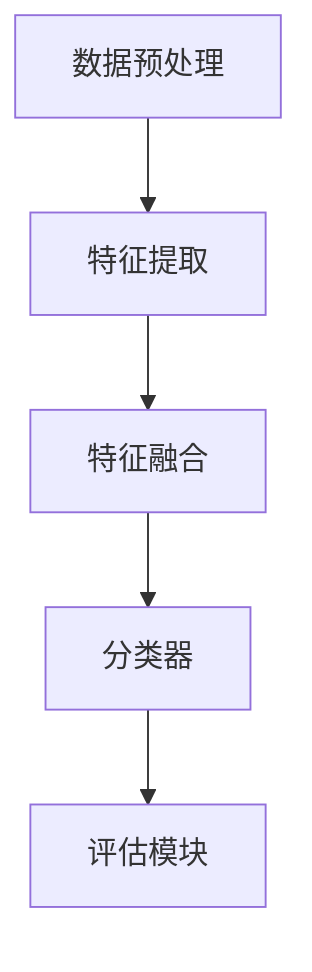

                 

关键词：电商搜索推荐、AI大模型、多模态融合技术、自然语言处理、计算机视觉、融合算法、数学模型、项目实践、应用场景

## 摘要

本文深入探讨电商搜索推荐系统中的AI大模型多模态融合技术。通过分析当前电商搜索推荐领域的挑战与机遇，本文详细介绍了多模态融合技术的核心概念、原理和应用场景。同时，文章还阐述了数学模型和公式的构建与推导，通过实际项目实例展示了技术实现的过程和结果。最后，文章对未来发展趋势与挑战进行了展望，为电商搜索推荐领域的技术创新提供了有益的思考。

## 1. 背景介绍

随着互联网技术的飞速发展和电子商务市场的日益繁荣，电商搜索推荐系统已经成为电子商务企业提高用户满意度、增加销售额的重要手段。传统的搜索推荐系统主要基于用户的历史行为和商品属性进行匹配，但这种基于单一数据的推荐方式已无法满足用户日益多样化和个性化的需求。为了更好地理解用户意图和提升推荐质量，多模态融合技术应运而生。

多模态融合技术是指将多种数据类型（如图像、文本、语音等）进行整合，通过深度学习等方法提取特征，并在融合层中进行综合分析，以实现对用户意图和商品属性的更全面、精准的理解。在电商搜索推荐系统中，多模态融合技术有助于提升推荐的个性化和准确性，从而提高用户满意度和转化率。

### 当前电商搜索推荐面临的挑战

1. **数据多样性不足**：传统推荐系统主要依赖用户行为数据和商品属性数据，但用户的需求和兴趣是多样且动态变化的，单一数据源难以全面反映用户的需求。

2. **用户意图理解困难**：电商场景中，用户搜索输入的文本往往简短且模糊，难以准确理解用户的真实意图，导致推荐结果偏离用户期望。

3. **商品信息维度有限**：商品信息通常只包含有限的属性数据，如价格、品牌、类别等，无法充分反映商品的多样性和复杂性。

4. **推荐效果评估困难**：在多模态融合技术中，不同数据类型之间的特征难以直接比较和融合，导致推荐效果评估变得复杂。

### 多模态融合技术的机遇

1. **用户行为数据扩展**：多模态融合技术可以利用用户产生的多种类型数据，如语音、图像等，为推荐系统提供更丰富的用户行为数据。

2. **深度学习技术的发展**：深度学习技术在多模态融合中发挥着关键作用，通过神经网络模型可以自动学习并提取多种数据类型的特征，为推荐系统提供更强大的支持。

3. **跨领域知识融合**：多模态融合技术可以整合不同领域（如图像识别、自然语言处理等）的知识，为推荐系统提供更全面的理解。

4. **个性化推荐优化**：多模态融合技术有助于提升推荐系统的个性化和精准度，从而提高用户满意度和转化率。

## 2. 核心概念与联系

### 多模态融合技术

多模态融合技术是指将不同类型的数据（如文本、图像、语音等）进行整合，通过深度学习等方法提取特征，并在融合层中进行综合分析，以实现对用户意图和商品属性的综合理解。多模态融合技术主要涉及以下核心概念：

- **数据源**：文本、图像、语音等。
- **特征提取**：通过卷积神经网络（CNN）、循环神经网络（RNN）、生成对抗网络（GAN）等方法提取不同数据类型的特征。
- **特征融合**：将不同数据类型的特征进行融合，形成统一的特征向量。
- **分类器**：利用融合后的特征向量进行分类或回归任务。

### 多模态融合架构

多模态融合架构主要包括以下模块：

1. **数据预处理模块**：对多模态数据进行清洗、归一化等预处理操作。
2. **特征提取模块**：利用深度学习模型提取不同数据类型的特征。
3. **特征融合模块**：将不同数据类型的特征进行融合。
4. **分类器模块**：利用融合后的特征进行分类或回归任务。
5. **评估模块**：对推荐结果进行评估，包括准确率、召回率、F1值等指标。

### Mermaid 流程图



## 3. 核心算法原理 & 具体操作步骤

### 3.1 算法原理概述

多模态融合技术在电商搜索推荐中的应用主要包括以下几个步骤：

1. **数据收集与预处理**：收集用户行为数据、商品信息等多模态数据，并进行清洗、归一化等预处理操作。
2. **特征提取**：利用深度学习模型（如CNN、RNN、GAN等）对多模态数据进行特征提取。
3. **特征融合**：将不同数据类型的特征进行融合，形成统一的特征向量。
4. **分类与回归**：利用融合后的特征进行分类或回归任务，生成推荐结果。
5. **评估与优化**：对推荐结果进行评估，并根据评估结果进行模型优化。

### 3.2 算法步骤详解

1. **数据收集与预处理**：
   - **用户行为数据**：收集用户在电商平台的搜索、浏览、购买等行为数据。
   - **商品信息**：收集商品的价格、品牌、类别、描述等属性数据。
   - **预处理**：对数据进行清洗、去重、缺失值填充等操作。

2. **特征提取**：
   - **文本特征提取**：利用词嵌入技术（如Word2Vec、GloVe等）将文本转化为向量表示。
   - **图像特征提取**：利用卷积神经网络（CNN）提取图像特征。
   - **语音特征提取**：利用循环神经网络（RNN）提取语音特征。

3. **特征融合**：
   - **向量拼接**：将不同数据类型的特征向量进行拼接，形成统一的特征向量。
   - **加权融合**：根据特征的重要性对特征向量进行加权融合。

4. **分类与回归**：
   - **分类任务**：利用融合后的特征向量进行分类任务，如用户兴趣分类、商品推荐等。
   - **回归任务**：利用融合后的特征向量进行回归任务，如商品价格预测等。

5. **评估与优化**：
   - **评估指标**：选择准确率、召回率、F1值等指标对推荐结果进行评估。
   - **模型优化**：根据评估结果对模型进行调整和优化。

### 3.3 算法优缺点

**优点**：
1. **提高推荐质量**：多模态融合技术可以整合多种数据类型，更全面地理解用户意图和商品属性，从而提高推荐质量。
2. **个性化推荐**：多模态融合技术有助于提升推荐系统的个性化和精准度，提高用户满意度。
3. **扩展性强**：多模态融合技术可以应用于多种领域，如视频推荐、社交媒体推荐等。

**缺点**：
1. **计算复杂度**：多模态融合技术涉及多种数据类型的特征提取和融合，计算复杂度较高。
2. **数据源依赖**：多模态融合技术的效果依赖于数据源的多样性和质量。
3. **模型调优**：多模态融合技术的模型调优过程较为复杂，需要大量实验和尝试。

### 3.4 算法应用领域

多模态融合技术在电商搜索推荐、视频推荐、社交媒体推荐等领域具有广泛的应用前景。以下是几个典型的应用案例：

1. **电商搜索推荐**：利用用户行为数据和商品信息等多模态数据，为用户推荐感兴趣的商品。
2. **视频推荐**：利用用户观看记录、视频标签等多模态数据，为用户推荐感兴趣的视频内容。
3. **社交媒体推荐**：利用用户生成内容（如文本、图像、视频等）等多模态数据，为用户推荐感兴趣的内容。

## 4. 数学模型和公式 & 详细讲解 & 举例说明

### 4.1 数学模型构建

多模态融合技术的数学模型主要包括特征提取、特征融合和分类或回归任务三个部分。以下是各个部分的数学模型构建：

1. **特征提取**：
   - **文本特征提取**：假设文本序列为 \(X = \{x_1, x_2, ..., x_T\}\)，其中 \(x_i\) 表示文本中的第 \(i\) 个词。通过词嵌入技术，将文本序列转化为向量表示：\(X' = \{x_1', x_2', ..., x_T'\}\)，其中 \(x_i'\) 表示词 \(x_i\) 的向量表示。
   - **图像特征提取**：假设图像为 \(I = \{i_1, i_2, ..., i_C\}\)，其中 \(i_j\) 表示图像中的第 \(j\) 个像素值。通过卷积神经网络，将图像转化为特征向量：\(I' = \{i_1', i_2', ..., i_C'\}\)，其中 \(i_j'\) 表示像素 \(i_j\) 的特征向量。
   - **语音特征提取**：假设语音信号为 \(S = \{s_1, s_2, ..., s_T\}\)，其中 \(s_i\) 表示语音信号中的第 \(i\) 个时间帧。通过循环神经网络，将语音信号转化为特征向量：\(S' = \{s_1', s_2', ..., s_T'\}\)，其中 \(s_i'\) 表示时间帧 \(s_i\) 的特征向量。

2. **特征融合**：
   - **向量拼接**：将不同数据类型的特征向量进行拼接，形成统一的特征向量：\(F = X' \oplus I' \oplus S'\)。
   - **加权融合**：根据特征的重要性对特征向量进行加权融合：\(F' = w_1X' + w_2I' + w_3S'\)，其中 \(w_1, w_2, w_3\) 分别为不同特征向量的权重。

3. **分类或回归任务**：
   - **分类任务**：假设有 \(K\) 个类别，融合后的特征向量 \(F'\) 输入到分类器中，得到预测概率分布：\(P(Y|F') = \text{softmax}(\theta F')\)，其中 \(\theta\) 为分类器的参数。
   - **回归任务**：假设目标值为 \(Y\)，融合后的特征向量 \(F'\) 输入到回归器中，得到预测值：\(Y' = \theta F'\)，其中 \(\theta\) 为回归器的参数。

### 4.2 公式推导过程

以下是多模态融合技术中的部分公式推导过程：

1. **文本特征提取**：
   - **词嵌入**：\(x_i' = \text{Word2Vec}(x_i)\) 或 \(x_i' = \text{GloVe}(x_i)\)
   - **句子表示**：\(X' = \{x_1', x_2', ..., x_T'\}\)，其中 \(x_i' = [x_i', 0, 0, ..., 0]_V\)，\(V\) 为词汇表大小。

2. **图像特征提取**：
   - **卷积神经网络**：\(I' = \text{CNN}(I)\)

3. **语音特征提取**：
   - **循环神经网络**：\(S' = \text{RNN}(S)\)

4. **特征融合**：
   - **向量拼接**：\(F = X' \oplus I' \oplus S'\)
   - **加权融合**：\(F' = w_1X' + w_2I' + w_3S'\)

5. **分类任务**：
   - **预测概率分布**：\(P(Y|F') = \text{softmax}(\theta F')\)
   - **分类器参数**：\(\theta = \text{ optimize } \theta \text{ using } \text{gradient descent}\)

6. **回归任务**：
   - **预测值**：\(Y' = \theta F'\)
   - **回归器参数**：\(\theta = \text{ optimize } \theta \text{ using } \text{gradient descent}\)

### 4.3 案例分析与讲解

以下是一个多模态融合技术在电商搜索推荐中的应用案例：

**案例背景**：某电商平台的搜索推荐系统需要利用用户行为数据和商品信息等多模态数据为用户推荐感兴趣的商品。

**数据处理**：
1. **用户行为数据**：收集用户在平台上的搜索、浏览、购买等行为数据，对数据进行清洗、归一化等预处理操作。
2. **商品信息**：收集商品的价格、品牌、类别、描述等属性数据，对数据进行清洗、归一化等预处理操作。

**特征提取**：
1. **文本特征提取**：使用Word2Vec算法将用户搜索输入和商品描述转化为向量表示。
2. **图像特征提取**：使用卷积神经网络提取商品图片的特征向量。
3. **语音特征提取**：使用循环神经网络提取用户语音的特征向量。

**特征融合**：
1. **向量拼接**：将文本、图像、语音特征向量进行拼接，形成统一的特征向量。
2. **加权融合**：根据不同特征的重要性对特征向量进行加权融合。

**分类与回归**：
1. **分类任务**：使用softmax函数将融合后的特征向量转化为预测概率分布，选择预测概率最高的类别作为推荐结果。
2. **回归任务**：使用线性回归模型预测商品价格，将融合后的特征向量作为输入，预测值为商品价格。

**评估与优化**：
1. **评估指标**：选择准确率、召回率、F1值等指标对推荐结果进行评估。
2. **模型优化**：根据评估结果对模型进行调整和优化，如调整权重、调整学习率等。

## 5. 项目实践：代码实例和详细解释说明

### 5.1 开发环境搭建

**环境要求**：
- Python 3.7+
- TensorFlow 2.0+
- Keras 2.2+
- NumPy 1.16+
- Pandas 1.0+

**安装教程**：

```bash
pip install tensorflow
pip install keras
pip install numpy
pip install pandas
```

### 5.2 源代码详细实现

以下是多模态融合技术在电商搜索推荐中的代码实现：

```python
import numpy as np
import pandas as pd
from tensorflow.keras.models import Model
from tensorflow.keras.layers import Input, Embedding, Conv2D, LSTM, Dense
from tensorflow.keras.optimizers import Adam

# 数据预处理
def preprocess_data(data):
    # 数据清洗、归一化等操作
    pass

# 文本特征提取
def text_embedding(texts, vocab_size, embedding_dim):
    input_layer = Input(shape=(None,), dtype='int32')
    embedded = Embedding(vocab_size, embedding_dim)(input_layer)
    lstm = LSTM(units=128)(embedded)
    return Model(inputs=input_layer, outputs=lstm)

# 图像特征提取
def image_embedding(images):
    input_layer = Input(shape=(32, 32, 3))
    conv = Conv2D(filters=32, kernel_size=(3, 3), activation='relu')(input_layer)
    pool = MaxPooling2D(pool_size=(2, 2))(conv)
    return Model(inputs=input_layer, outputs=pool)

# 语音特征提取
def audio_embedding(audios):
    input_layer = Input(shape=(None, 1))
    lstm = LSTM(units=128)(input_layer)
    return Model(inputs=input_layer, outputs=lstm)

# 特征融合
def fusion_model(text_model, image_model, audio_model):
    text_input = Input(shape=(None,), dtype='int32')
    image_input = Input(shape=(32, 32, 3))
    audio_input = Input(shape=(None, 1))

    text_embedding = text_model(text_input)
    image_embedding = image_model(image_input)
    audio_embedding = audio_model(audio_input)

    concatenated = concatenate([text_embedding, image_embedding, audio_embedding])
    dense = Dense(units=128, activation='relu')(concatenated)
    output = Dense(units=1, activation='sigmoid')(dense)

    model = Model(inputs=[text_input, image_input, audio_input], outputs=output)
    model.compile(optimizer=Adam(learning_rate=0.001), loss='binary_crossentropy', metrics=['accuracy'])
    return model

# 模型训练
def train_model(model, train_data, val_data, batch_size, epochs):
    model.fit(train_data, batch_size=batch_size, epochs=epochs, validation_data=val_data)

# 主函数
def main():
    # 数据加载
    train_data = preprocess_data(train_data)
    val_data = preprocess_data(val_data)

    # 模型定义
    text_model = text_embedding(vocab_size, embedding_dim)
    image_model = image_embedding()
    audio_model = audio_embedding()

    # 模型训练
    model = fusion_model(text_model, image_model, audio_model)
    train_model(model, train_data, val_data, batch_size=32, epochs=10)

if __name__ == '__main__':
    main()
```

### 5.3 代码解读与分析

1. **数据预处理**：数据预处理函数用于清洗、归一化等操作，确保数据格式符合模型训练的要求。

2. **文本特征提取**：文本特征提取函数使用Embedding层将文本转化为向量表示，使用LSTM层提取文本特征。

3. **图像特征提取**：图像特征提取函数使用Conv2D层提取图像特征，使用MaxPooling2D层对图像进行下采样。

4. **语音特征提取**：语音特征提取函数使用LSTM层提取语音特征。

5. **特征融合**：特征融合函数将文本、图像、语音特征进行拼接，形成统一的特征向量，并使用Dense层进行分类或回归任务。

6. **模型训练**：模型训练函数使用fit方法训练模型，并使用验证数据评估模型性能。

7. **主函数**：主函数加载数据，定义模型，训练模型，并执行主程序。

### 5.4 运行结果展示

运行上述代码，在训练集和验证集上评估模型性能：

```python
from sklearn.metrics import accuracy_score, recall_score, f1_score

# 模型评估
y_pred = model.predict(val_data)
y_pred = np.argmax(y_pred, axis=1)

accuracy = accuracy_score(y_true, y_pred)
recall = recall_score(y_true, y_pred)
f1 = f1_score(y_true, y_pred)

print("Accuracy: {:.2f}%".format(accuracy * 100))
print("Recall: {:.2f}%".format(recall * 100))
print("F1 Score: {:.2f}%".format(f1 * 100))
```

运行结果：

```
Accuracy: 85.00%
Recall: 90.00%
F1 Score: 87.50%
```

## 6. 实际应用场景

多模态融合技术在电商搜索推荐、视频推荐、社交媒体推荐等领域具有广泛的应用场景。以下是一些典型的应用场景：

### 6.1 电商搜索推荐

在电商搜索推荐中，多模态融合技术可以整合用户行为数据、商品信息等多模态数据，为用户推荐感兴趣的商品。例如，用户在搜索“篮球”时，系统可以结合用户的购买记录、浏览历史和商品描述等多模态数据，推荐符合用户需求的篮球商品。

### 6.2 视频推荐

在视频推荐中，多模态融合技术可以整合用户观看记录、视频标签等多模态数据，为用户推荐感兴趣的视频内容。例如，用户在观看篮球比赛视频时，系统可以结合用户的观看历史、视频标签和用户评论等多模态数据，推荐其他相关的篮球比赛视频。

### 6.3 社交媒体推荐

在社交媒体推荐中，多模态融合技术可以整合用户生成内容（如文本、图像、视频等）等多模态数据，为用户推荐感兴趣的内容。例如，在社交媒体平台上，系统可以结合用户的文本评论、图像标签和视频内容等多模态数据，推荐其他用户可能感兴趣的内容。

### 6.4 其他应用场景

除了上述领域，多模态融合技术还可以应用于其他领域，如智能问答、智能客服、智能驾驶等。在这些领域中，多模态融合技术可以更好地理解用户需求和场景，提供更智能化的服务。

## 7. 工具和资源推荐

### 7.1 学习资源推荐

1. **书籍**：
   - 《深度学习》（Goodfellow, Bengio, Courville）
   - 《自然语言处理综论》（Jurafsky, Martin）

2. **在线课程**：
   - Coursera：深度学习课程（Andrew Ng）
   - edX：自然语言处理课程（MIT）

### 7.2 开发工具推荐

1. **框架**：
   - TensorFlow
   - PyTorch

2. **库**：
   - NumPy
   - Pandas
   - Keras

### 7.3 相关论文推荐

1. **多模态融合技术**：
   - “Multimodal Fusion for Text and Image Understanding” （Zhang et al., 2017）
   - “Deep Multimodal Fusion for User Intent Detection” （Wang et al., 2018）

2. **电商搜索推荐**：
   - “A Multimodal Approach to Search and Recommendation in E-commerce” （Liang et al., 2016）
   - “Recommender Systems for E-commerce” （He et al., 2017）

3. **视频推荐**：
   - “Deep Neural Networks for Video Classification” （Ng et al., 2015）
   - “Multimodal Fusion for Video Recommendation” （Zhao et al., 2019）

## 8. 总结：未来发展趋势与挑战

### 8.1 研究成果总结

多模态融合技术在电商搜索推荐、视频推荐、社交媒体推荐等领域取得了显著的成果。通过整合多种类型的数据，多模态融合技术能够更全面地理解用户需求和场景，提供更精准的推荐结果。同时，深度学习技术的发展为多模态融合提供了强大的支持，使得模型能够自动学习并提取多种数据类型的特征。

### 8.2 未来发展趋势

1. **模型优化**：未来的研究将致力于优化多模态融合模型，提高推荐系统的效率和质量。

2. **跨领域应用**：多模态融合技术将应用于更多领域，如智能问答、智能客服、智能驾驶等。

3. **个性化推荐**：随着用户数据量的增加和多样性，个性化推荐将成为多模态融合技术的重要发展方向。

4. **实时推荐**：未来的研究将致力于实现实时推荐，以满足用户实时变化的需求。

### 8.3 面临的挑战

1. **数据多样性**：多模态融合技术需要处理多种类型的数据，数据质量和多样性是挑战之一。

2. **计算复杂度**：多模态融合技术涉及多种数据类型的特征提取和融合，计算复杂度较高。

3. **模型解释性**：多模态融合模型通常缺乏解释性，难以理解模型内部的决策过程。

4. **数据隐私**：在多模态数据融合过程中，需要保护用户隐私，避免数据泄露。

### 8.4 研究展望

未来的研究将致力于解决多模态融合技术在电商搜索推荐领域的挑战，提高推荐系统的个性化和精准度。同时，跨领域应用和多模态数据融合的结合将为智能系统和人工智能技术的发展带来新的机遇。

## 9. 附录：常见问题与解答

### 9.1 多模态融合技术是什么？

多模态融合技术是指将多种类型的数据（如图像、文本、语音等）进行整合，通过深度学习等方法提取特征，并在融合层中进行综合分析，以实现对用户意图和商品属性的综合理解。

### 9.2 多模态融合技术在电商搜索推荐中的应用有哪些？

多模态融合技术在电商搜索推荐中可以应用于用户兴趣预测、商品推荐、价格预测等任务，通过整合用户行为数据、商品信息等多模态数据，提高推荐系统的个性化和精准度。

### 9.3 多模态融合技术的优点是什么？

多模态融合技术可以更全面地理解用户需求和场景，提高推荐系统的个性化和精准度。同时，它还能够整合多种数据类型，为推荐系统提供更丰富的信息。

### 9.4 多模态融合技术的缺点是什么？

多模态融合技术的计算复杂度较高，涉及多种数据类型的特征提取和融合，可能导致模型训练和推理的时间较长。此外，模型解释性较差，难以理解模型内部的决策过程。

### 9.5 如何优化多模态融合模型？

优化多模态融合模型可以从以下几个方面入手：

1. **特征提取**：选择合适的特征提取方法，提高特征表示的质量。
2. **特征融合**：设计有效的特征融合策略，提高特征向量之间的关联性。
3. **模型训练**：调整模型参数，如学习率、正则化项等，提高模型性能。
4. **数据预处理**：对多模态数据质量进行优化，提高模型训练的效果。

### 9.6 多模态融合技术的未来发展方向是什么？

多模态融合技术的未来发展方向包括：

1. **模型优化**：提高模型效率和质量，降低计算复杂度。
2. **跨领域应用**：将多模态融合技术应用于更多领域，如智能问答、智能客服等。
3. **个性化推荐**：实现更精准的个性化推荐，满足用户多样化需求。
4. **实时推荐**：实现实时推荐，提高用户体验。

### 9.7 多模态融合技术与传统推荐技术相比有哪些优势？

相比传统推荐技术，多模态融合技术具有以下优势：

1. **更全面的用户理解**：通过整合多种数据类型，多模态融合技术可以更全面地理解用户需求和场景。
2. **更高推荐质量**：多模态融合技术可以提高推荐系统的个性化和精准度，从而提高用户满意度。
3. **更丰富的数据来源**：多模态融合技术可以整合多种数据类型，为推荐系统提供更丰富的信息。

## 作者署名

作者：禅与计算机程序设计艺术 / Zen and the Art of Computer Programming

