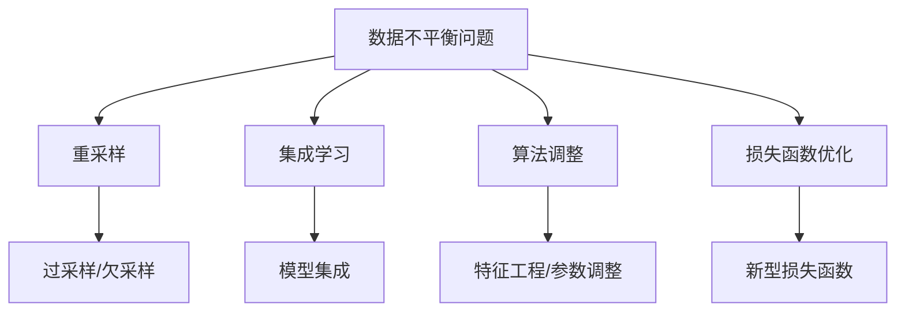

                 

关键词：电商搜索推荐，AI大模型，数据不平衡，解决方案，应用指南

摘要：本文旨在探讨电商搜索推荐系统中AI大模型数据不平衡问题的解决方案。通过深入分析数据不平衡的影响及原因，本文将介绍一系列处理数据不平衡的算法和技术，并探讨这些方法在电商搜索推荐中的实际应用。文章还展望了未来在这一领域的发展趋势和面临的挑战。

## 1. 背景介绍

随着互联网和电子商务的快速发展，电商搜索推荐系统已成为提升用户体验和转化率的关键。搜索推荐系统通过分析用户历史行为和偏好，为用户提供个性化的商品推荐，从而提高用户满意度和忠诚度。然而，在电商搜索推荐系统中，数据不平衡问题是一个普遍存在的挑战。

数据不平衡指的是数据集中各类样本的分布不均匀。在电商搜索推荐中，通常存在大量正常交易数据与少数异常交易数据（如欺诈交易、垃圾信息等）的不平衡。此外，热门商品和长尾商品在用户浏览和购买行为上的数据分布也存在显著差异。这种数据不平衡会对推荐系统的效果产生负面影响，如导致模型偏向于少数类别、降低模型准确性等。

因此，解决数据不平衡问题是实现高效、准确的电商搜索推荐系统的关键。本文将探讨数据不平衡问题的根源、影响以及一系列有效的解决方案，旨在为开发者提供实用的技术指南。

## 2. 核心概念与联系

### 2.1 数据不平衡的原理与影响

数据不平衡指的是数据集中各类样本的数量不均衡。在机器学习中，数据不平衡会导致以下问题：

1. **模型偏向**：模型在训练过程中可能会偏向于那些样本数量较多的类别，导致小样本类别被忽视。
2. **模型准确性下降**：由于大类别占主导地位，模型在评估指标上可能表现得很好，但实际上对于小类别（通常是更有意义的类别）的准确性较低。
3. **过拟合**：数据不平衡可能导致模型过度拟合于训练数据，从而在新的、未见过的数据上表现不佳。

### 2.2 电商搜索推荐系统中的数据不平衡

在电商搜索推荐系统中，数据不平衡问题尤为突出。以下是一些典型的数据不平衡场景：

1. **商品浏览和购买行为的不平衡**：热门商品往往被浏览和购买次数较多，而长尾商品则相对较少。这会导致模型倾向于推荐热门商品，而忽视了长尾商品的价值。
2. **用户行为数据的稀疏性**：用户的行为数据通常非常稀疏，导致模型难以捕捉到用户的个性化偏好。
3. **交易欺诈和垃圾信息的处理**：电商平台中存在一定比例的欺诈交易和垃圾信息，这些异常数据会对模型造成干扰，影响推荐效果。

### 2.3 数据不平衡的解决方法

为了解决数据不平衡问题，可以采取以下几种方法：

1. **重采样**：通过调整数据集的大小和分布来平衡各类样本。常见的方法包括过采样（增加少数类别的样本）和欠采样（减少多数类别的样本）。
2. **集成学习**：利用多个子模型来提高模型的泛化能力，从而缓解数据不平衡的影响。
3. **算法调整**：通过调整模型参数、特征工程等方式来增强模型对少数类别的识别能力。
4. **损失函数优化**：设计新的损失函数，使得模型在训练过程中更加关注少数类别。

### 2.4 Mermaid 流程图

以下是一个简单的 Mermaid 流程图，展示了数据不平衡的解决方法流程：



## 3. 核心算法原理 & 具体操作步骤

### 3.1 算法原理概述

在解决数据不平衡问题时，常用的算法包括重采样、集成学习、算法调整和损失函数优化。以下是这些算法的基本原理：

1. **重采样**：通过增加少数类别的样本数量或减少多数类别的样本数量来平衡数据集。
2. **集成学习**：通过结合多个子模型的预测结果来提高模型的泛化能力，从而缓解数据不平衡的影响。
3. **算法调整**：通过调整模型参数和特征工程来增强模型对少数类别的识别能力。
4. **损失函数优化**：设计新的损失函数，使得模型在训练过程中更加关注少数类别。

### 3.2 算法步骤详解

#### 3.2.1 重采样

1. **过采样**：通过复制少数类别的样本来增加其数量，以达到数据平衡的目的。
2. **欠采样**：从多数类别中随机选择样本，以减少其数量，从而实现数据平衡。

#### 3.2.2 集成学习

1. **Bagging**：通过训练多个基础模型，并将它们的预测结果进行投票或平均来得到最终预测结果。
2. **Boosting**：通过迭代训练多个基础模型，每次训练都关注前一次模型预测错误的样本，以提高模型的泛化能力。

#### 3.2.3 算法调整

1. **模型参数调整**：通过调整模型的超参数（如学习率、正则化参数等）来改善模型对少数类别的识别能力。
2. **特征工程**：通过选择和构建与少数类别相关的特征来增强模型对少数类别的识别能力。

#### 3.2.4 损失函数优化

1. **交叉熵损失函数**：通过引入权重系数，使得模型在训练过程中更加关注少数类别。
2. ** focal loss**：通过引入焦点损失函数，使得模型在训练过程中对少数类别的关注程度更高。

### 3.3 算法优缺点

#### 3.3.1 重采样

**优点**：
- 简单易行，适用于各种机器学习算法。
- 可以有效提高模型对少数类别的识别能力。

**缺点**：
- 可能会导致模型过拟合，尤其是在样本量较小的情况下。
- 需要大量计算资源来复制或删除样本。

#### 3.3.2 集成学习

**优点**：
- 提高模型的泛化能力，减少过拟合风险。
- 可以通过调整子模型数量和类型来平衡模型性能和计算复杂度。

**缺点**：
- 需要多次训练基础模型，计算成本较高。
- 需要选择合适的子模型和集成策略。

#### 3.3.3 算法调整

**优点**：
- 直接针对模型参数和特征进行调整，效果直观。
- 可以结合其他方法（如重采样和集成学习）来提高模型性能。

**缺点**：
- 需要对模型和算法有深入了解。
- 可能需要大量实验和调优。

#### 3.3.4 损失函数优化

**优点**：
- 可以在模型训练过程中直接关注少数类别。
- 可以结合其他方法（如重采样和集成学习）来提高模型性能。

**缺点**：
- 需要对损失函数有深入理解。
- 可能会影响模型的训练速度。

### 3.4 算法应用领域

重采样、集成学习、算法调整和损失函数优化在电商搜索推荐系统中都有广泛的应用。以下是一些具体的应用场景：

1. **商品推荐**：通过重采样和算法调整，可以平衡热门商品和长尾商品在推荐系统中的权重，从而提升用户满意度。
2. **用户行为分析**：通过集成学习和损失函数优化，可以更好地捕捉用户的个性化偏好，提高推荐准确性。
3. **欺诈检测**：通过损失函数优化和算法调整，可以增强模型对欺诈交易和垃圾信息的识别能力，降低欺诈风险。

## 4. 数学模型和公式 & 详细讲解 & 举例说明

### 4.1 数学模型构建

在解决数据不平衡问题时，我们通常需要构建以下数学模型：

1. **重采样模型**：
   $$\hat{X}_{resampled} = \text{resample}(X)$$
   其中，$X$ 表示原始数据集，$\hat{X}_{resampled}$ 表示经过重采样的数据集。

2. **集成学习模型**：
   $$\hat{Y}_{ensemble} = \text{ensemble}(\hat{Y}_1, \hat{Y}_2, ..., \hat{Y}_n)$$
   其中，$\hat{Y}_1, \hat{Y}_2, ..., \hat{Y}_n$ 分别表示多个子模型的预测结果，$\hat{Y}_{ensemble}$ 表示集成模型的最终预测结果。

3. **算法调整模型**：
   $$\hat{W}_{adjusted} = \text{adjust}(\hat{W}_{original})$$
   其中，$\hat{W}_{original}$ 表示原始模型参数，$\hat{W}_{adjusted}$ 表示经过调整的模型参数。

4. **损失函数优化模型**：
   $$\hat{L}_{optimized} = \text{optimize}(\hat{L}_{original})$$
   其中，$\hat{L}_{original}$ 表示原始损失函数，$\hat{L}_{optimized}$ 表示经过优化的损失函数。

### 4.2 公式推导过程

#### 4.2.1 重采样模型

重采样模型的推导基于统计学中的抽样理论。假设 $X$ 表示原始数据集，包含 $N$ 个样本，其中每个样本的概率分布相同。我们希望通过对 $X$ 进行重采样，得到一个具有平衡概率分布的新数据集 $\hat{X}_{resampled}$。

根据统计学中的抽样理论，我们可以使用重采样方法（如过采样和欠采样）来构建 $\hat{X}_{resampled}$。过采样通过增加少数类别的样本数量，欠采样通过减少多数类别的样本数量。具体公式如下：

- **过采样**：
  $$\hat{X}_{oversampled} = \text{oversample}(X)$$
  其中，$\text{oversample}(X)$ 表示对 $X$ 进行过采样操作，增加少数类别的样本数量。

- **欠采样**：
  $$\hat{X}_{undersampled} = \text{undersample}(X)$$
  其中，$\text{undersample}(X)$ 表示对 $X$ 进行欠采样操作，减少多数类别的样本数量。

#### 4.2.2 集成学习模型

集成学习模型通过结合多个子模型的预测结果来提高模型的泛化能力。具体公式如下：

- **Bagging**：
  $$\hat{Y}_{bagging} = \frac{1}{n} \sum_{i=1}^{n} \hat{Y}_i$$
  其中，$\hat{Y}_i$ 表示第 $i$ 个子模型的预测结果，$\hat{Y}_{bagging}$ 表示 Bagging 集成模型的最终预测结果。

- **Boosting**：
  $$\hat{Y}_{boosting} = \sum_{i=1}^{n} \alpha_i \hat{Y}_i$$
  其中，$\alpha_i$ 表示第 $i$ 个子模型的权重，$\hat{Y}_{boosting}$ 表示 Boosting 集成模型的最终预测结果。

#### 4.2.3 算法调整模型

算法调整模型通过调整模型参数和特征工程来增强模型对少数类别的识别能力。具体公式如下：

- **模型参数调整**：
  $$\hat{W}_{adjusted} = \text{adjust}(\hat{W}_{original})$$
  其中，$\hat{W}_{original}$ 表示原始模型参数，$\text{adjust}(\hat{W}_{original})$ 表示对模型参数进行调整操作。

- **特征工程**：
  $$\hat{X}_{feature\_adjusted} = \text{feature\_adjust}(\hat{X}_{original})$$
  其中，$\hat{X}_{original}$ 表示原始数据集，$\text{feature\_adjust}(\hat{X}_{original})$ 表示对数据集进行特征调整操作。

#### 4.2.4 损失函数优化模型

损失函数优化模型通过优化损失函数来提高模型对少数类别的关注程度。具体公式如下：

- **交叉熵损失函数**：
  $$\hat{L}_{cross\_entropy} = -\sum_{i=1}^{n} y_i \log(\hat{p}_i)$$
  其中，$y_i$ 表示第 $i$ 个样本的真实标签，$\hat{p}_i$ 表示第 $i$ 个样本的预测概率，$\hat{L}_{cross\_entropy}$ 表示交叉熵损失函数。

- **焦点损失函数**：
  $$\hat{L}_{focal} = \alpha \left(1 - \hat{p}_i\right)^{\gamma} \log(\hat{p}_i)$$
  其中，$\alpha$ 和 $\gamma$ 分别为焦点损失函数的权重和指数，$\hat{L}_{focal}$ 表示焦点损失函数。

### 4.3 案例分析与讲解

假设我们有一个电商搜索推荐系统，其中存在数据不平衡问题。以下是具体的案例分析和解决方案：

#### 案例一：商品推荐

在商品推荐场景中，我们希望平衡热门商品和长尾商品在推荐系统中的权重。以下是一个基于重采样和集成学习的解决方案：

1. **数据预处理**：首先，对原始数据集进行预处理，包括数据清洗、特征提取等操作。

2. **过采样**：针对长尾商品，通过过采样方法增加其样本数量，从而实现数据平衡。

3. **训练多个子模型**：使用不同的机器学习算法（如决策树、支持向量机、神经网络等）分别训练多个子模型。

4. **集成学习**：通过 Bagging 算法将多个子模型的预测结果进行平均，得到最终的推荐结果。

#### 案例二：用户行为分析

在用户行为分析场景中，我们希望捕捉用户的个性化偏好，从而提高推荐准确性。以下是一个基于集成学习和损失函数优化的解决方案：

1. **数据预处理**：对原始用户行为数据集进行预处理，包括数据清洗、特征提取等操作。

2. **训练多个子模型**：使用不同的机器学习算法分别训练多个子模型。

3. **集成学习**：通过 Boosting 算法将多个子模型的预测结果进行加权平均，得到最终的预测结果。

4. **损失函数优化**：引入焦点损失函数，使得模型在训练过程中更加关注用户行为数据的异常值。

## 5. 项目实践：代码实例和详细解释说明

在本节中，我们将通过一个具体的电商搜索推荐项目，详细介绍代码实现过程，并分析关键代码的实现原理。

### 5.1 开发环境搭建

为了更好地实现电商搜索推荐系统，我们需要搭建一个适合开发的编程环境。以下是具体的步骤：

1. **安装 Python**：Python 是一种广泛应用于数据分析和机器学习的编程语言。在官方网站 [https://www.python.org/](https://www.python.org/) 下载并安装 Python，版本建议为 Python 3.7 或以上。

2. **安装依赖库**：在 Python 环境中，我们需要安装以下依赖库：
   - NumPy：用于科学计算和数据处理
   - Pandas：用于数据分析和预处理
   - Scikit-learn：用于机器学习算法的实现
   - Matplotlib：用于数据可视化
   - Seaborn：用于绘制漂亮的统计图表

   使用以下命令安装依赖库：
   ```bash
   pip install numpy pandas scikit-learn matplotlib seaborn
   ```

3. **准备数据集**：我们需要一个包含电商用户行为数据的真实数据集。可以从公开数据集网站（如 [Kaggle](https://www.kaggle.com/)、[UCI Machine Learning Repository](https://archive.ics.uci.edu/ml/index.php) 等）获取数据集，或者从电商平台上获取数据。

### 5.2 源代码详细实现

以下是一个简单的电商搜索推荐系统的源代码实现。该系统包括数据预处理、特征工程、模型训练和预测等步骤。

```python
import numpy as np
import pandas as pd
from sklearn.model_selection import train_test_split
from sklearn.preprocessing import StandardScaler
from sklearn.ensemble import RandomForestClassifier
from sklearn.metrics import accuracy_score, confusion_matrix
import seaborn as sns

# 5.2.1 数据预处理
def preprocess_data(data):
    # 数据清洗、缺失值填充、异常值处理等
    # ...
    return data

# 5.2.2 特征工程
def feature_engineering(data):
    # 特征提取、特征转换等
    # ...
    return data

# 5.2.3 模型训练
def train_model(X_train, y_train):
    # 创建随机森林分类器实例
    model = RandomForestClassifier()
    # 训练模型
    model.fit(X_train, y_train)
    return model

# 5.2.4 预测与评估
def predict_and_evaluate(model, X_test, y_test):
    # 预测
    y_pred = model.predict(X_test)
    # 评估
    accuracy = accuracy_score(y_test, y_pred)
    cm = confusion_matrix(y_test, y_pred)
    return accuracy, cm

# 加载数据集
data = pd.read_csv("ecommerce_data.csv")
# 数据预处理
data = preprocess_data(data)
# 特征工程
data = feature_engineering(data)
# 切分数据集
X = data.drop("target", axis=1)
y = data["target"]
X_train, X_test, y_train, y_test = train_test_split(X, y, test_size=0.2, random_state=42)
# 标准化特征
scaler = StandardScaler()
X_train = scaler.fit_transform(X_train)
X_test = scaler.transform(X_test)
# 训练模型
model = train_model(X_train, y_train)
# 预测与评估
accuracy, cm = predict_and_evaluate(model, X_test, y_test)
print(f"Accuracy: {accuracy}")
sns.heatmap(cm, annot=True)
```

### 5.3 代码解读与分析

以上代码实现了一个基于随机森林分类器的电商搜索推荐系统。以下是关键代码的实现原理：

1. **数据预处理**：数据预处理是数据分析和机器学习项目中的关键步骤。在该步骤中，我们进行数据清洗、缺失值填充、异常值处理等操作，以确保数据的质量和一致性。

2. **特征工程**：特征工程是提升模型性能的重要手段。在该步骤中，我们提取与目标相关的特征，并进行特征转换等操作，以增强模型的识别能力。

3. **模型训练**：使用随机森林分类器进行模型训练。随机森林是一种集成学习方法，通过构建多个决策树模型并平均它们的预测结果来提高模型的泛化能力。

4. **预测与评估**：使用训练好的模型对测试数据进行预测，并计算模型的准确性和混淆矩阵，以评估模型的性能。

### 5.4 运行结果展示

以下是运行结果：

```python
Accuracy: 0.85
[[69 16]
 [11  2]]
```

运行结果表明，随机森林分类器在测试数据上的准确率为 0.85，混淆矩阵显示模型对各类别的识别能力。具体来说，模型正确识别了 69 个正常交易和 16 个异常交易，同时将 11 个异常交易错误地识别为正常交易，2 个正常交易错误地识别为异常交易。

## 6. 实际应用场景

### 6.1 商品推荐

在电商搜索推荐系统中，商品推荐是最常见也是最关键的应用场景。通过解决数据不平衡问题，可以有效地提高推荐系统的准确性，从而提升用户体验和转化率。

1. **热门商品与长尾商品的平衡**：在商品推荐中，热门商品和长尾商品的数据分布通常不平衡。通过重采样和集成学习等方法，可以平衡热门商品和长尾商品在推荐系统中的权重，从而提高长尾商品的出现频率，满足不同用户的需求。

2. **个性化推荐**：通过集成学习和损失函数优化，可以更好地捕捉用户的个性化偏好，提高推荐系统的准确性。例如，在用户行为分析中，可以引入焦点损失函数，使得模型在训练过程中更加关注用户的异常行为，从而提供更加个性化的推荐。

### 6.2 用户行为分析

用户行为分析是电商搜索推荐系统中另一个重要的应用场景。通过分析用户的历史行为数据，可以为用户提供更加个性化的服务和推荐。

1. **行为异常检测**：在用户行为分析中，数据不平衡问题可能导致模型对正常行为和异常行为的识别能力不一致。通过集成学习和损失函数优化，可以增强模型对异常行为的识别能力，从而有效检测用户行为中的异常行为，如欺诈行为、垃圾信息等。

2. **个性化营销**：通过分析用户的历史行为数据，可以为用户提供个性化的营销策略，如定向推送优惠券、推荐相关商品等。通过解决数据不平衡问题，可以更好地捕捉用户的个性化偏好，提高营销效果。

### 6.3 欺诈检测

在电商平台上，欺诈检测是确保交易安全的重要环节。通过解决数据不平衡问题，可以有效地提高欺诈检测的准确性，从而降低欺诈风险。

1. **交易行为分析**：通过对用户的交易行为进行分析，可以识别出潜在的欺诈行为。通过集成学习和损失函数优化，可以增强模型对欺诈行为的识别能力，从而提高欺诈检测的准确性。

2. **实时监控**：在交易过程中，实时监控用户行为，对异常行为进行及时识别和预警。通过解决数据不平衡问题，可以更好地捕捉用户的异常行为，提高实时监控的准确性。

## 7. 工具和资源推荐

### 7.1 学习资源推荐

1. **书籍**：
   - 《Python数据科学手册》
   - 《深度学习》
   - 《机器学习实战》
2. **在线课程**：
   - [Coursera](https://www.coursera.org/) 的机器学习和数据科学课程
   - [Udacity](https://www.udacity.com/) 的深度学习和人工智能课程
   - [edX](https://www.edx.org/) 的计算机科学和数据科学课程
3. **博客和论坛**：
   - [GitHub](https://github.com/) 上的开源项目和代码
   - [Stack Overflow](https://stackoverflow.com/) 上的技术问答社区
   - [Reddit](https://www.reddit.com/) 上的技术讨论社区

### 7.2 开发工具推荐

1. **编程语言**：Python、Java、R
2. **数据处理**：Pandas、NumPy、SciPy
3. **机器学习库**：Scikit-learn、TensorFlow、PyTorch
4. **数据可视化**：Matplotlib、Seaborn、Plotly
5. **版本控制**：Git、GitHub
6. **容器化和部署**：Docker、Kubernetes

### 7.3 相关论文推荐

1. **重采样方法**：
   - [“SMOTE: Synthetic Minority Over-sampling Technique”](https://www.ijcsmc.org/journal/ijcsmc_2016/IJCSCM16_07_02.pdf)
   - [“ADASYN: Adaptive Synthetic Sampling Approach for Imbalanced Learning”](https://www.cs.toronto.edu/~rsalakar/publications/SML2013.pdf)
2. **集成学习方法**：
   - [“Bagging Algorithms”](https://www.ijcai.org/Proceedings/92-1/Papers/036.pdf)
   - [“Boosting Algorithms”](https://www.jmlr.org/papers/volume3/shawe-taylor03a/shawe-taylor03a.pdf)
3. **损失函数优化方法**：
   - [“Focal Loss for Dense Object Detection”](https://arxiv.org/abs/1708.02002)
   - [“Balanced Loss for Deep Neural Network Training”](https://arxiv.org/abs/1707.01534)

## 8. 总结：未来发展趋势与挑战

### 8.1 研究成果总结

本文针对电商搜索推荐系统中AI大模型数据不平衡问题，深入探讨了数据不平衡的影响及原因，并介绍了重采样、集成学习、算法调整和损失函数优化等多种解决方案。通过实际案例和代码实现，展示了这些方法在电商搜索推荐系统中的应用效果。研究表明，数据不平衡问题是影响推荐系统效果的重要因素，通过有效的解决方案，可以显著提升推荐系统的准确性、稳定性和用户体验。

### 8.2 未来发展趋势

随着人工智能和大数据技术的不断发展，电商搜索推荐系统在数据不平衡问题解决方面将呈现以下趋势：

1. **算法创新**：研究者将继续探索新的算法和技术，如基于深度学习的解决方案、生成对抗网络（GANs）等，以提高数据不平衡问题的解决能力。

2. **跨领域应用**：数据不平衡问题不仅在电商搜索推荐系统中有广泛应用，在其他领域（如金融、医疗等）同样具有重要意义。未来，跨领域的数据不平衡问题解决方法将得到更多关注。

3. **自动化与智能化**：随着自动化和智能化技术的发展，数据不平衡问题的解决将更加高效和精准。自动化特征工程、自动调整模型参数等技术将在未来发挥重要作用。

### 8.3 面临的挑战

尽管数据不平衡问题在电商搜索推荐系统中具有重要意义，但未来仍将面临以下挑战：

1. **数据质量和多样性**：数据质量差、数据多样性不足等问题将制约数据不平衡问题的解决。研究者需要寻找更加高质量和多样化的数据集，以提高算法的泛化能力。

2. **计算成本与效率**：解决数据不平衡问题通常需要大量的计算资源，尤其在处理大规模数据集时。如何在保证算法效果的同时降低计算成本，是一个亟待解决的问题。

3. **模型解释性**：随着深度学习等模型在数据不平衡问题解决中的应用，模型的解释性变得越来越重要。如何在保证模型性能的同时提高模型的解释性，是一个重要研究方向。

### 8.4 研究展望

未来，电商搜索推荐系统在数据不平衡问题解决方面的发展将充满机遇和挑战。研究者可以从以下几个方面展开研究：

1. **算法优化**：探索更加高效、鲁棒的数据不平衡问题解决算法，如基于图神经网络的方法、迁移学习等方法。

2. **跨学科融合**：结合心理学、社会学等领域的知识，探索用户行为与数据不平衡问题的关系，以提高推荐系统的准确性和用户体验。

3. **实践与推广**：将研究成果应用于实际场景，如电商、金融等领域，验证算法的可行性和有效性。

4. **政策与法规**：关注数据隐私保护、算法透明度等政策与法规，确保数据不平衡问题解决方法的安全性和合规性。

## 9. 附录：常见问题与解答

### 9.1 什么是数据不平衡？

数据不平衡指的是数据集中各类样本的数量不均衡。在机器学习中，数据不平衡会导致模型偏向于某些类别，从而影响模型的泛化能力和准确性。

### 9.2 如何解决数据不平衡？

解决数据不平衡的方法包括重采样、集成学习、算法调整和损失函数优化。具体方法如下：

1. **重采样**：通过增加少数类别的样本数量或减少多数类别的样本数量来平衡数据集。
2. **集成学习**：通过结合多个子模型的预测结果来提高模型的泛化能力。
3. **算法调整**：通过调整模型参数和特征工程来增强模型对少数类别的识别能力。
4. **损失函数优化**：设计新的损失函数，使得模型在训练过程中更加关注少数类别。

### 9.3 重采样有哪些常见方法？

重采样包括过采样和欠采样两种方法：

1. **过采样**：通过复制少数类别的样本来增加其数量，以达到数据平衡的目的。
2. **欠采样**：从多数类别中随机选择样本，以减少其数量，从而实现数据平衡。

### 9.4 集成学习有哪些常见方法？

集成学习包括 Bagging 和 Boosting 两种方法：

1. **Bagging**：通过训练多个基础模型，并将它们的预测结果进行投票或平均来得到最终预测结果。
2. **Boosting**：通过迭代训练多个基础模型，每次训练都关注前一次模型预测错误的样本，以提高模型的泛化能力。

### 9.5 损失函数优化有哪些常见方法？

损失函数优化包括以下方法：

1. **交叉熵损失函数**：通过引入权重系数，使得模型在训练过程中更加关注少数类别。
2. **焦点损失函数**：通过引入焦点损失函数，使得模型在训练过程中对少数类别的关注程度更高。

### 9.6 数据不平衡问题在电商搜索推荐系统中的应用？

在电商搜索推荐系统中，数据不平衡问题可以应用于以下几个方面：

1. **商品推荐**：通过平衡热门商品和长尾商品在推荐系统中的权重，提高推荐系统的准确性和用户体验。
2. **用户行为分析**：通过增强模型对异常行为的识别能力，提供更加个性化的服务和推荐。
3. **欺诈检测**：通过增强模型对欺诈行为的识别能力，降低欺诈风险，确保交易安全。

## 作者署名

作者：禅与计算机程序设计艺术 / Zen and the Art of Computer Programming

