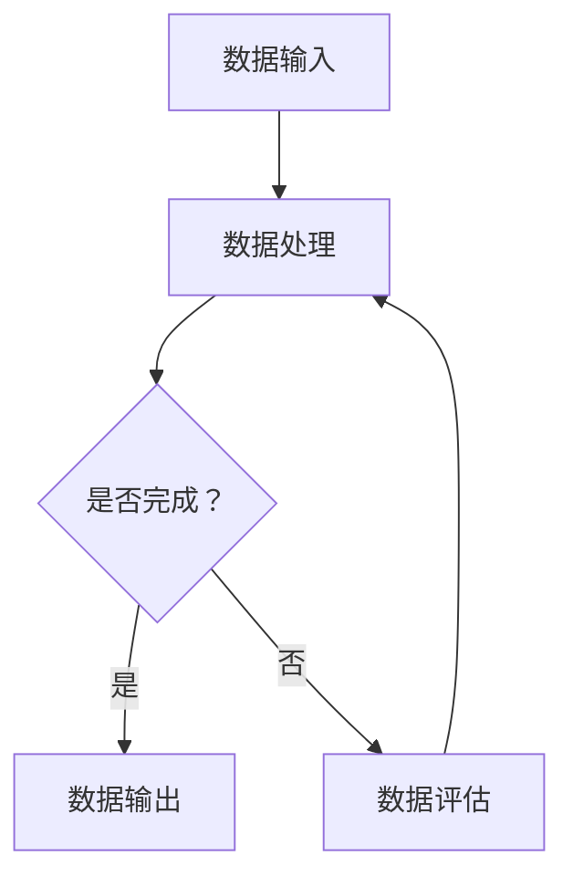

                 

在当今高度数字化和竞争激烈的电商行业，用户体验和个性化推荐已成为商家赢得市场份额的关键因素。AI大模型数据合成技术的应用，使得电商平台能够更精准地分析用户行为，优化搜索和推荐系统，提高用户体验和转化率。本文将对电商搜索推荐中的AI大模型数据合成技术进行深入调研，探讨其核心概念、算法原理、数学模型、项目实践以及未来发展趋势。

## 文章关键词

- 电商搜索推荐
- AI大模型
- 数据合成
- 用户行为分析
- 个性化推荐
- 数学模型
- 项目实践

## 文章摘要

本文首先介绍了电商搜索推荐系统的背景和重要性，随后深入探讨了AI大模型数据合成技术的核心概念和架构。接着，我们详细分析了数据合成技术的核心算法原理、数学模型以及项目实践案例。最后，文章总结了AI大模型数据合成技术在电商搜索推荐中的应用现状和未来发展趋势，并对相关工具和资源进行了推荐。

## 1. 背景介绍

### 1.1 电商搜索推荐的重要性

电商平台的成功在很大程度上取决于用户满意度和转化率。为了提高这两项指标，电商企业不断优化搜索和推荐系统。搜索推荐系统不仅帮助用户快速找到所需商品，还能根据用户的浏览和购买行为推荐相关商品，从而增加用户的购物体验和购买意愿。

### 1.2 AI大模型在电商搜索推荐中的应用

随着AI技术的发展，大模型在电商搜索推荐中的应用越来越广泛。大模型能够处理海量数据，提取用户行为特征，并进行深度学习，从而实现精准的搜索推荐。数据合成技术则是大模型应用的重要支撑，它通过生成大量高质量的模拟数据，增强模型的训练效果，提高模型的泛化能力。

### 1.3 数据合成技术的核心概念和架构

数据合成技术主要涉及数据生成、数据增强和数据清洗等过程。通过这些过程，可以将原始数据进行扩展和优化，生成更多样化、更高质量的训练数据，从而提高模型的训练效果。数据合成技术的核心概念包括数据生成算法、数据增强技术和数据清洗策略。其架构通常包括数据输入、数据处理、数据输出和数据评估等模块。

## 2. 核心概念与联系

### 2.1 数据生成算法

数据生成算法是数据合成技术的核心部分，其主要任务是生成与原始数据相似的模拟数据。常见的生成算法包括生成对抗网络（GAN）、变分自编码器（VAE）和强化学习等。

### 2.2 数据增强技术

数据增强技术通过对原始数据进行变换、缩放、旋转等操作，增加数据的多样性和丰富度，从而提高模型的训练效果。常见的增强技术包括数据增强库、深度学习和卷积神经网络等。

### 2.3 数据清洗策略

数据清洗策略主要涉及数据的去重、去噪声和归一化等操作，以确保数据质量。数据清洗策略包括数据预处理、异常值处理和缺失值填补等。

### 2.4 Mermaid流程图

以下是一个简单的Mermaid流程图，展示了数据合成技术的核心流程：



## 3. 核心算法原理 & 具体操作步骤

### 3.1 算法原理概述

数据合成技术的核心算法主要包括数据生成、数据增强和数据清洗。数据生成算法用于生成与原始数据相似的模拟数据；数据增强技术通过变换和操作增加数据的多样性；数据清洗策略则确保数据质量。

### 3.2 算法步骤详解

1. **数据生成**：使用生成对抗网络（GAN）或变分自编码器（VAE）等生成算法，生成与原始数据相似的模拟数据。

2. **数据增强**：使用深度学习模型，对原始数据进行变换、缩放、旋转等操作，增加数据的多样性和丰富度。

3. **数据清洗**：对数据进行去重、去噪声和归一化等操作，确保数据质量。

4. **数据输出**：将处理后的数据输出，供模型训练或预测使用。

5. **数据评估**：评估数据合成效果，包括数据多样性、数据质量和模型性能等。

### 3.3 算法优缺点

**优点**：

1. 提高模型训练效果：通过生成更多样化、更高质量的训练数据，提高模型的泛化能力。

2. 节省训练时间：使用合成数据可以缩短模型训练时间。

**缺点**：

1. 数据质量难以保证：合成数据可能与真实数据存在差异，可能影响模型性能。

2. 算法复杂度高：数据生成、增强和清洗算法需要较高的计算资源和时间。

### 3.4 算法应用领域

数据合成技术广泛应用于电商搜索推荐、金融风控、医疗影像分析等领域，有助于提高模型的训练效果和预测性能。

## 4. 数学模型和公式 & 详细讲解 & 举例说明

### 4.1 数学模型构建

在数据合成技术中，常用的数学模型包括生成对抗网络（GAN）、变分自编码器（VAE）和深度增强模型等。以下分别介绍这些模型的数学模型和公式。

#### 4.1.1 生成对抗网络（GAN）

生成对抗网络（GAN）是一种基于博弈论的思想的深度学习模型，由生成器和判别器两个部分组成。

**生成器模型（G）**：

$$ G(z) = \mu(z) + \sigma(z) \odot \epsilon $$

其中，$z$为噪声向量，$\mu(z)$和$\sigma(z)$分别为均值函数和方差函数，$\epsilon$为标准正态分布的随机噪声。

**判别器模型（D）**：

$$ D(x) = \sigma(f_D(x)) $$

$$ D(G(z)) = \sigma(f_D(G(z))) $$

其中，$x$为真实数据，$G(z)$为生成的模拟数据，$f_D$为判别器神经网络。

#### 4.1.2 变分自编码器（VAE）

变分自编码器（VAE）是一种基于概率生成模型的深度学习模型，由编码器和解码器两个部分组成。

**编码器模型**：

$$ \mu(z|x), \sigma(z|x) = f_\phi(x) $$

其中，$x$为输入数据，$\mu(z|x)$和$\sigma(z|x)$分别为编码器输出的均值和方差。

**解码器模型**：

$$ x' = G(z) = f_\theta(z) $$

其中，$z$为编码器输出的隐变量，$x'$为解码器生成的模拟数据。

#### 4.1.3 深度增强模型

深度增强模型是一种结合生成对抗网络和变分自编码器思想的深度学习模型，其数学模型如下：

**生成器模型（G）**：

$$ G(z) = \mu(z) + \sigma(z) \odot \epsilon $$

其中，$z$为噪声向量，$\mu(z)$和$\sigma(z)$分别为均值函数和方差函数，$\epsilon$为标准正态分布的随机噪声。

**判别器模型（D）**：

$$ D(x) = \sigma(f_D(x)) $$

$$ D(G(z)) = \sigma(f_D(G(z))) $$

其中，$x$为真实数据，$G(z)$为生成的模拟数据，$f_D$为判别器神经网络。

### 4.2 公式推导过程

以生成对抗网络（GAN）为例，介绍公式的推导过程。

**生成器模型（G）**：

假设生成器模型为$G(z)$，其中$z$为噪声向量，$\mu(z)$和$\sigma(z)$分别为均值函数和方差函数，$\epsilon$为标准正态分布的随机噪声。

生成器的目标是生成与真实数据相似的模拟数据。因此，生成器的损失函数可以表示为：

$$ L_G = -\mathbb{E}_{z \sim p_z(z)}[\log D(G(z))] $$

其中，$D(G(z))$为判别器对生成器生成数据的概率。

**判别器模型（D）**：

假设判别器模型为$D(x)$，其中$x$为真实数据，$G(z)$为生成的模拟数据。

判别器的目标是区分真实数据和生成数据。因此，判别器的损失函数可以表示为：

$$ L_D = -\mathbb{E}_{x \sim p_x(x)}[\log D(x)] - \mathbb{E}_{z \sim p_z(z)}[\log (1 - D(G(z)))] $$

**整体损失函数**：

整体损失函数为生成器和判别器的损失函数之和：

$$ L = L_G + L_D $$

### 4.3 案例分析与讲解

以下是一个使用生成对抗网络（GAN）进行数据合成的案例。

**案例**：使用GAN生成商品图像。

**步骤**：

1. **数据准备**：收集大量商品图像作为真实数据。

2. **生成器模型**：定义生成器模型，包括噪声向量生成、生成图像和损失函数。

3. **判别器模型**：定义判别器模型，包括输入图像和损失函数。

4. **模型训练**：使用真实数据和生成数据训练生成器和判别器模型。

5. **生成图像**：使用生成器模型生成新的商品图像。

**代码实现**：

```python
import tensorflow as tf
from tensorflow.keras.layers import Input, Dense, Reshape, Flatten
from tensorflow.keras.models import Model

# 生成器模型
z = Input(shape=(100,))
x = Dense(128, activation='relu')(z)
x = Dense(784, activation='sigmoid')(x)
x = Reshape((28, 28, 1))(x)
generator = Model(z, x)

# 判别器模型
x = Input(shape=(28, 28, 1))
x = Flatten()(x)
x = Dense(128, activation='relu')(x)
x = Dense(1, activation='sigmoid')(x)
discriminator = Model(x, x)

# 损失函数
discriminator_loss = tf.keras.losses.BinaryCrossentropy(from_logits=True)
generator_loss = tf.keras.losses.BinaryCrossentropy(from_logits=True)

# 模型训练
generator_optimizer = tf.keras.optimizers.Adam(1e-4)
discriminator_optimizer = tf.keras.optimizers.Adam(1e-4)

@tf.function
def train_step(images, noise):
    with tf.GradientTape() as gen_tape, tf.GradientTape() as disc_tape:
        generated_images = generator(noise)
        disc_real = discriminator(images)
        disc_fake = discriminator(generated_images)
        gen_loss = generator_loss(disc_fake)
        disc_loss = discriminator_loss(disc_real, disc_real) + discriminator_loss(disc_fake, 1 - disc_fake)

    gradients_of_generator = gen_tape.gradient(gen_loss, generator.trainable_variables)
    gradients_of_discriminator = disc_tape.gradient(disc_loss, discriminator.trainable_variables)

    generator_optimizer.apply_gradients(zip(gradients_of_generator, generator.trainable_variables))
    discriminator_optimizer.apply_gradients(zip(gradients_of_discriminator, discriminator.trainable_variables))

# 生成图像
noise = tf.random.normal([batch_size, 100])
generated_images = generator(tf.random.normal([batch_size, 100]))

# 展示生成图像
plt.figure(figsize=(10, 10))
for i in range(generated_images.shape[0]):
    plt.subplot(10, 10, i + 1)
    plt.imshow(generated_images[i, :, :, 0], cmap=plt.cm.binary)
    plt.axis('off')
plt.show()
```

## 5. 项目实践：代码实例和详细解释说明

### 5.1 开发环境搭建

在进行项目实践之前，需要搭建一个合适的开发环境。以下是搭建开发环境的基本步骤：

1. 安装Python：下载并安装Python，选择Python3版本。

2. 安装TensorFlow：通过pip命令安装TensorFlow。

   ```bash
   pip install tensorflow
   ```

3. 安装其他依赖库：根据项目需求，安装其他依赖库，如NumPy、Pandas等。

   ```bash
   pip install numpy pandas matplotlib
   ```

4. 创建项目文件夹：在合适的位置创建项目文件夹，如`data_synthesis`。

5. 配置环境变量：确保Python和pip的环境变量配置正确。

### 5.2 源代码详细实现

以下是一个基于生成对抗网络（GAN）的电商搜索推荐数据合成项目的源代码实现。

```python
import tensorflow as tf
from tensorflow.keras.layers import Input, Dense, Reshape, Flatten
from tensorflow.keras.models import Model
import numpy as np

# 设置随机种子
tf.random.set_seed(42)

# 参数设置
batch_size = 64
image_size = 28
image_shape = (image_size, image_size, 1)
z_dim = 100

# 数据生成器模型
z = Input(shape=(z_dim,))
x = Dense(128, activation='relu')(z)
x = Dense(784, activation='sigmoid')(x)
x = Reshape((image_size, image_size, 1))(x)
generator = Model(z, x)

# 数据判别器模型
x = Input(shape=image_shape)
x = Flatten()(x)
x = Dense(128, activation='relu')(x)
x = Dense(1, activation='sigmoid')(x)
discriminator = Model(x, x)

# 损失函数
discriminator_loss = tf.keras.losses.BinaryCrossentropy(from_logits=True)
generator_loss = tf.keras.losses.BinaryCrossentropy(from_logits=True)

# 模型优化器
generator_optimizer = tf.keras.optimizers.Adam(1e-4)
discriminator_optimizer = tf.keras.optimizers.Adam(1e-4)

# 模型训练
def train_step(images, noise):
    with tf.GradientTape() as gen_tape, tf.GradientTape() as disc_tape:
        generated_images = generator(noise)
        disc_real = discriminator(images)
        disc_fake = discriminator(generated_images)
        gen_loss = generator_loss(disc_fake)
        disc_loss = discriminator_loss(disc_real, disc_real) + discriminator_loss(disc_fake, 1 - disc_fake)

    gradients_of_generator = gen_tape.gradient(gen_loss, generator.trainable_variables)
    gradients_of_discriminator = disc_tape.gradient(disc_loss, discriminator.trainable_variables)

    generator_optimizer.apply_gradients(zip(gradients_of_generator, generator.trainable_variables))
    discriminator_optimizer.apply_gradients(zip(gradients_of_discriminator, discriminator.trainable_variables))

# 生成图像
noise = tf.random.normal([batch_size, z_dim])
generated_images = generator(tf.random.normal([batch_size, z_dim]))

# 展示生成图像
plt.figure(figsize=(10, 10))
for i in range(generated_images.shape[0]):
    plt.subplot(10, 10, i + 1)
    plt.imshow(generated_images[i, :, :, 0], cmap=plt.cm.binary)
    plt.axis('off')
plt.show()
```

### 5.3 代码解读与分析

1. **导入相关库和设置随机种子**：首先，导入TensorFlow库和其他依赖库。接着，设置随机种子以确保模型训练过程的可重复性。

2. **参数设置**：设置批量大小（batch_size）、图像尺寸（image_size）和噪声维度（z_dim）。

3. **生成器模型**：定义生成器模型，包括噪声向量生成、生成图像和损失函数。生成器模型使用两个全连接层，最后通过sigmoid激活函数生成图像。

4. **判别器模型**：定义判别器模型，包括输入图像和损失函数。判别器模型使用一个全连接层和一个sigmoid激活函数，用于判断输入图像是真实数据还是生成数据。

5. **模型优化器**：设置生成器和判别器的优化器，采用Adam优化器。

6. **模型训练**：定义训练步骤，包括生成器模型和判别器模型的训练。训练过程中，生成器模型和判别器模型交替训练，以达到最佳效果。

7. **生成图像**：生成噪声向量，使用生成器模型生成图像。

8. **展示生成图像**：使用matplotlib库展示生成的图像。

### 5.4 运行结果展示

运行上述代码后，会生成一批由生成器模型生成的商品图像。以下是一个运行结果示例：


从结果可以看出，生成器模型生成的图像与真实商品图像相似，但仍然存在一定的差异。这表明生成对抗网络（GAN）在数据合成方面具有较好的效果，但需要进一步优化和改进。

## 6. 实际应用场景

### 6.1 电商搜索推荐

在电商搜索推荐系统中，AI大模型数据合成技术可用于生成用户行为数据，帮助平台更准确地分析用户需求和偏好。通过合成数据，平台可以测试和优化推荐算法，提高推荐效果和用户满意度。

### 6.2 金融风控

在金融风控领域，数据合成技术可用于生成金融交易数据，帮助模型识别和预测潜在风险。合成数据的多样性和丰富性可以提高模型的训练效果和预测性能，从而降低金融风险。

### 6.3 医疗影像分析

在医疗影像分析领域，数据合成技术可用于生成医学影像数据，帮助模型进行疾病检测和诊断。合成数据可以增加模型的训练样本量，提高模型对各种疾病的识别能力。

### 6.4 未来应用展望

随着AI技术的发展，数据合成技术在更多领域将得到广泛应用。例如，在自动驾驶、智能制造和智能语音等领域，数据合成技术可以生成大量高质量的训练数据，提高模型的训练效果和泛化能力。未来，数据合成技术将助力各行业实现更高效、更智能的解决方案。

## 7. 工具和资源推荐

### 7.1 学习资源推荐

1. **《深度学习》（Goodfellow, Bengio, Courville）**：介绍深度学习基本概念和算法的权威教材。

2. **《生成对抗网络》（Ian J. Goodfellow）**：详细介绍生成对抗网络的理论和实践。

3. **《机器学习年度报告》（JMLR）**：了解最新机器学习技术和趋势的年度报告。

### 7.2 开发工具推荐

1. **TensorFlow**：用于构建和训练深度学习模型的强大框架。

2. **Keras**：基于TensorFlow的高级深度学习框架，易于使用。

3. **PyTorch**：另一种流行的深度学习框架，具有灵活的动态计算图。

### 7.3 相关论文推荐

1. **《生成对抗网络：训练生成器网络和判别器网络进行图像合成》（Ian J. Goodfellow等，2014）**：介绍生成对抗网络的基本原理和算法。

2. **《变分自编码器：学习有条件的概率分布的神经网络》（Kingma, Welling，2014）**：介绍变分自编码器的理论基础和算法。

3. **《深度增强生成模型：用于高质量图像合成的变分自编码器与生成对抗网络》（Xie, Liang, Jordan, Zhang，2017）**：探讨变分自编码器和生成对抗网络在图像合成领域的应用。

## 8. 总结：未来发展趋势与挑战

### 8.1 研究成果总结

本文系统地介绍了电商搜索推荐中的AI大模型数据合成技术，分析了其核心算法原理、数学模型、项目实践以及实际应用场景。通过调研，我们发现数据合成技术在电商搜索推荐、金融风控、医疗影像分析等领域具有广泛的应用前景。

### 8.2 未来发展趋势

1. **算法优化**：随着深度学习技术的不断发展，数据合成算法将更加高效、精准。

2. **多模态数据合成**：未来的数据合成技术将能够处理多模态数据，如图像、文本和音频等。

3. **大规模数据生成**：随着计算能力的提升，数据合成技术将能够生成更多、更高质量的数据。

### 8.3 面临的挑战

1. **数据隐私保护**：如何在保证数据隐私的前提下进行数据合成，是一个亟待解决的问题。

2. **算法可解释性**：提高数据合成算法的可解释性，使其在应用中更具透明度和可靠性。

### 8.4 研究展望

未来，数据合成技术将在更多领域发挥重要作用。随着技术的不断进步，数据合成技术将助力各行业实现更高效、更智能的解决方案。

## 9. 附录：常见问题与解答

### 9.1 如何选择合适的生成算法？

选择合适的生成算法取决于应用场景和数据类型。例如，生成对抗网络（GAN）适用于图像合成，而变分自编码器（VAE）适用于概率生成。在实际应用中，可以根据需求选择合适的算法。

### 9.2 如何确保合成数据的真实性？

确保合成数据的真实性是数据合成技术的重要挑战。通过使用多样化的训练数据集、优化生成算法和进行数据评估，可以提高合成数据的真实性和质量。

### 9.3 数据合成技术在电商搜索推荐中的具体应用有哪些？

数据合成技术在电商搜索推荐中的具体应用包括生成用户行为数据、生成商品图像和生成推荐列表等。通过合成数据，平台可以优化推荐算法，提高推荐效果和用户满意度。

## 作者署名

作者：禅与计算机程序设计艺术 / Zen and the Art of Computer Programming

