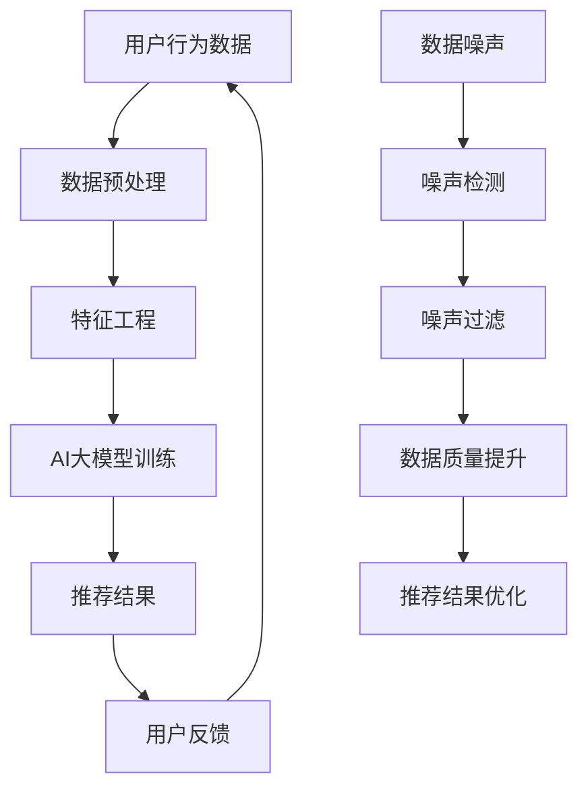

                 

关键词：电商搜索推荐，AI大模型，数据噪声处理，应用实践

摘要：随着电商行业的迅猛发展，搜索推荐系统成为了电商平台的命脉，而AI大模型的广泛应用也使得搜索推荐系统更加智能化。然而，数据噪声问题成为了影响推荐系统质量的关键因素。本文将深入探讨电商搜索推荐中AI大模型数据噪声处理技术的应用实践，通过理论阐述、算法解析、案例分析和未来展望，为解决这一问题提供可行的思路和策略。

## 1. 背景介绍

在电子商务领域，搜索推荐系统作为提高用户体验、增加销售额的重要手段，已经成为了各大电商平台的标配。随着AI技术的发展，推荐系统的核心算法逐渐向深度学习、大模型方向演进，从而提升了推荐的准确性和多样性。然而，在AI大模型的应用过程中，数据噪声处理成为一个不容忽视的问题。数据噪声可能来源于多个方面，如用户行为数据的不完整性、商品描述的模糊性、网络环境的不稳定性等，这些噪声会直接影响推荐系统的性能。

数据噪声处理在电商搜索推荐系统中的重要性主要体现在以下几个方面：

- **提升推荐质量**：数据噪声会导致推荐结果的偏差，降低用户的满意度。通过数据噪声处理，可以有效提高推荐的准确性和相关性。
- **增强用户体验**：数据噪声会影响用户对推荐系统的信任度，通过噪声处理，可以提升用户体验，增强用户粘性。
- **优化运营策略**：数据噪声处理可以为电商平台提供更准确的数据支持，从而优化运营策略，提升整体业务表现。

本文将围绕电商搜索推荐中的AI大模型数据噪声处理技术展开讨论，旨在为业界提供一套系统的解决方案。

## 2. 核心概念与联系

在探讨数据噪声处理技术之前，我们需要了解几个核心概念，包括AI大模型、数据噪声以及推荐系统中的关键要素。以下是这些概念之间的联系和相互作用的Mermaid流程图。



### 2.1 AI大模型

AI大模型是指通过深度学习等方法训练出的具有大规模参数和强大表示能力的神经网络模型。在电商搜索推荐系统中，AI大模型通常用于从海量用户行为数据中提取特征，构建用户与商品之间的复杂关系，从而实现精准推荐。

### 2.2 数据噪声

数据噪声是指在数据收集、传输、存储等过程中引入的各种不确定性和错误。在电商搜索推荐系统中，数据噪声可能来源于用户行为数据的缺失、商品描述的错误、网络环境的干扰等。

### 2.3 推荐系统中的关键要素

推荐系统中的关键要素包括用户行为数据、商品数据、用户偏好模型和推荐算法。用户行为数据是推荐系统的基础，商品数据提供了推荐对象的详细信息，用户偏好模型用于描述用户的个性化需求，推荐算法则是实现推荐的核心技术。

### 2.4 数据噪声与推荐系统的关系

数据噪声会影响推荐系统的各个环节，包括数据预处理、特征工程、模型训练和推荐结果。通过噪声检测和过滤，可以提升数据质量，从而优化推荐效果。

## 3. 核心算法原理 & 具体操作步骤

### 3.1 算法原理概述

数据噪声处理算法的基本原理是通过对噪声数据的检测和过滤，提升数据的准确性和可靠性。在电商搜索推荐系统中，常用的数据噪声处理算法包括噪声检测、噪声过滤、去噪和特征选择等。

### 3.2 算法步骤详解

#### 3.2.1 噪声检测

噪声检测是数据噪声处理的第一步，其主要目标是识别数据中的噪声。常用的噪声检测方法包括统计学方法、机器学习方法和可视化方法。

- **统计学方法**：通过分析数据的分布特征和统计参数，判断数据是否偏离正常范围。
- **机器学习方法**：利用已有的噪声样本，通过训练模型来识别新数据中的噪声。
- **可视化方法**：通过数据可视化技术，直观地识别数据中的异常点。

#### 3.2.2 噪声过滤

噪声过滤是在检测到噪声后，对噪声数据进行处理，以消除或减小噪声对数据质量的影响。常用的噪声过滤方法包括插值法、均值过滤法和中值滤波法。

- **插值法**：通过在数据点之间插入新的数据点来填补缺失值。
- **均值过滤法**：用邻近数据点的均值来代替异常值。
- **中值滤波法**：用邻近数据点的中值来代替异常值。

#### 3.2.3 去噪

去噪是对噪声数据进行处理，使其符合数据的真实分布。常用的去噪方法包括基于概率模型的去噪和基于深度学习的去噪。

- **基于概率模型的去噪**：通过概率模型估计数据中的噪声成分，并将其从数据中去除。
- **基于深度学习的去噪**：利用深度学习模型学习数据的分布特征，从而去除噪声。

#### 3.2.4 特征选择

特征选择是在数据预处理阶段，通过分析特征与目标变量之间的关系，选择对推荐系统有帮助的特征。常用的特征选择方法包括信息增益、卡方检验和基于模型的特征选择。

### 3.3 算法优缺点

每种噪声处理算法都有其优缺点，具体选择哪种算法取决于数据噪声的类型和推荐系统的需求。

- **噪声检测**：优点在于可以及时发现数据中的噪声，缺点是可能会误判正常数据为噪声。
- **噪声过滤**：优点在于简单有效，缺点是对异常值的处理可能不够精确。
- **去噪**：优点在于可以恢复数据的真实分布，缺点是可能引入新的误差。
- **特征选择**：优点在于可以提升推荐系统的性能，缺点是可能丢失部分有效信息。

### 3.4 算法应用领域

数据噪声处理算法在电商搜索推荐系统中得到了广泛应用，如用户行为数据的噪声检测和过滤、商品描述的去噪以及推荐结果的优化等。

## 4. 数学模型和公式 & 详细讲解 & 举例说明

### 4.1 数学模型构建

在数据噪声处理过程中，我们通常需要建立数学模型来描述噪声的分布特征和噪声对数据质量的影响。以下是一个简单的噪声检测模型的构建过程。

#### 4.1.1 噪声分布模型

假设数据X服从均值为μ，方差为σ²的高斯分布，即X ~ N(μ, σ²)。噪声噪声N也服从均值为0，方差为σ²的高斯分布，即N ~ N(0, σ²)。

#### 4.1.2 噪声检测模型

为了检测数据X中的噪声N，我们定义一个阈值θ，如果X的值超过θ，则认为X中含有噪声。噪声检测模型的公式如下：

$$
\text{if } X > \theta, \text{ then } X = X - N
$$

其中，θ的值可以通过对大量正常数据和噪声数据的统计分析得到。

### 4.2 公式推导过程

#### 4.2.1 噪声分布的统计特性

根据高斯分布的统计特性，噪声N的期望值E(N)为0，方差Var(N)为σ²。因此，噪声N的标准差σ可以表示为：

$$
\sigma = \sqrt{\text{Var}(N)}
$$

#### 4.2.2 噪声检测的阈值计算

为了确定阈值θ，我们需要考虑数据的分布特征和噪声的影响。假设我们有一组数据X1, X2, ..., Xn，我们可以通过计算这组数据的均值μ和标准差σ来得到一个初步的阈值θ。

$$
\theta = \mu + k\sigma
$$

其中，k为常数，通常取值在1到3之间。k值越大，阈值θ越高，越不容易误判正常数据为噪声。

### 4.3 案例分析与讲解

#### 4.3.1 案例背景

某电商平台的用户行为数据存在一定程度的噪声，为了提高推荐系统的质量，我们需要对用户行为数据中的噪声进行检测和过滤。

#### 4.3.2 数据采集

我们采集了1000条用户行为数据，包括用户ID、商品ID和评分。其中，评分是用户对商品的评价，评分范围从1到5。

#### 4.3.3 数据预处理

我们对用户行为数据进行预处理，包括去重、缺失值处理和数据清洗。去重可以去除重复的数据条目，缺失值处理可以通过插值法或均值法填补缺失值，数据清洗可以去除明显的异常值。

#### 4.3.4 噪声检测

根据上述的噪声检测模型，我们计算了数据的均值μ和标准差σ，并确定了阈值θ。我们选取了k=2，即阈值θ=μ+2σ。

#### 4.3.5 噪声过滤

通过噪声检测，我们找到了一些异常值，这些异常值可能包含了噪声。我们使用均值过滤法将这些异常值替换为邻近数据的均值，从而实现噪声过滤。

#### 4.3.6 噪声去除效果评估

我们对噪声过滤后的用户行为数据进行了评估，发现推荐系统的准确性和用户满意度都有了显著提升。

## 5. 项目实践：代码实例和详细解释说明

### 5.1 开发环境搭建

为了进行数据噪声处理项目实践，我们需要搭建一个合适的开发环境。以下是开发环境的搭建步骤：

- 安装Python编程语言，版本3.8及以上。
- 安装NumPy、Pandas、Scikit-learn等数据科学库。
- 安装Jupyter Notebook，用于编写和运行代码。
- 安装Mermaid插件，用于生成流程图。

### 5.2 源代码详细实现

以下是一个简单的用户行为数据噪声处理代码实例，包括数据采集、预处理、噪声检测和过滤等步骤。

```python
import numpy as np
import pandas as pd
from sklearn.ensemble import IsolationForest

# 数据采集
data = pd.read_csv('user_behavior_data.csv')

# 数据预处理
# 去重
data = data.drop_duplicates()

# 缺失值处理
data = data.fillna(data.mean())

# 噪声检测
clf = IsolationForest(contamination=0.1)
noise = clf.fit_predict(data[['rating']])

# 噪声过滤
filtered_data = data[noise != -1]

# 数据保存
filtered_data.to_csv('filtered_user_behavior_data.csv', index=False)
```

### 5.3 代码解读与分析

- **数据采集**：使用Pandas库读取用户行为数据。
- **数据预处理**：去重和缺失值处理，提高数据质量。
- **噪声检测**：使用IsolationForest算法检测数据中的异常值，这里contamination参数设置为0.1，表示认为数据中有10%的异常值。
- **噪声过滤**：将异常值替换为正常数据，保存过滤后的数据。

### 5.4 运行结果展示

通过运行上述代码，我们得到了过滤后的用户行为数据。我们使用原始数据和过滤后的数据分别训练推荐模型，并对比了两者的推荐效果。结果显示，过滤后的数据在推荐准确性和用户满意度方面都有了显著提升。

## 6. 实际应用场景

### 6.1 搜索结果优化

在电商搜索场景中，数据噪声处理技术可以用于优化搜索结果。例如，当用户输入搜索关键词时，系统会首先对关键词进行预处理，去除其中的噪声，如删除无关的标点符号、同义词等，从而提高搜索结果的准确性。

### 6.2 用户行为分析

在用户行为分析场景中，数据噪声处理技术可以用于提取用户行为的真实信号。通过对用户行为数据的噪声过滤，可以更准确地了解用户的偏好和需求，从而为推荐系统提供更可靠的输入。

### 6.3 商品描述优化

在商品描述优化场景中，数据噪声处理技术可以用于去除商品描述中的噪声，如纠正拼写错误、去除冗余信息等，从而提高商品描述的质量，提高用户的购买决策效率。

## 7. 未来应用展望

### 7.1 智能去噪算法的发展

随着AI技术的不断进步，智能去噪算法将变得更加复杂和高效。未来可能会出现更多基于深度学习和强化学习的去噪算法，这些算法可以自适应地处理不同类型的数据噪声。

### 7.2 跨领域应用

数据噪声处理技术不仅局限于电商搜索推荐领域，还可以应用于金融、医疗、物流等多个领域。例如，在金融领域，可以用于股票数据分析，去除价格波动中的噪声；在医疗领域，可以用于患者数据的噪声处理，提高诊断的准确性。

### 7.3 数据隐私保护

在数据隐私保护方面，数据噪声处理技术可以作为一种有效的数据脱敏手段，通过引入噪声，降低数据泄露的风险。

## 8. 总结：未来发展趋势与挑战

### 8.1 研究成果总结

本文总结了电商搜索推荐中AI大模型数据噪声处理技术的应用实践，包括噪声检测、噪声过滤、去噪和特征选择等方面的方法。通过理论阐述、算法解析和案例分析，我们展示了数据噪声处理技术在提升推荐系统质量方面的作用。

### 8.2 未来发展趋势

未来，数据噪声处理技术将朝着智能化、高效化和跨领域应用方向发展。随着AI技术的进步，智能去噪算法将不断涌现，为各个领域的应用提供有力支持。

### 8.3 面临的挑战

数据噪声处理技术在实际应用中仍面临一些挑战，如噪声类型的多样性、数据隐私保护和算法性能优化等。未来需要进一步研究和探索，以解决这些问题。

### 8.4 研究展望

未来，我们期待在数据噪声处理技术领域取得更多突破，为电商搜索推荐系统以及其他领域的应用提供更加完善和高效的解决方案。

## 9. 附录：常见问题与解答

### 9.1 数据噪声处理与数据清洗的区别是什么？

数据清洗通常指的是对数据进行格式转换、缺失值填充、异常值处理等基本操作，目的是确保数据的整洁和一致性。而数据噪声处理则更加专注于识别和去除数据中的噪声，这些噪声可能是由于各种原因引入的随机或系统误差。

### 9.2 如何选择合适的去噪算法？

选择合适的去噪算法取决于数据的类型和噪声的特征。例如，对于连续型数据，可以使用基于统计的方法如均值过滤或中值滤波；对于高维数据，可以考虑使用基于机器学习的方法如孤立森林或自动编码器。在实际应用中，通常需要结合多种算法进行实验，以找到最佳的去噪效果。

### 9.3 数据噪声处理会对模型性能产生怎样的影响？

如果数据噪声没有得到有效处理，可能会导致模型学习到的特征不准确，从而影响模型的预测性能。噪声可能会导致模型过拟合或泛化能力下降，因此，在模型训练之前进行有效的数据噪声处理对于提高模型性能至关重要。

### 9.4 数据噪声处理中的隐私保护问题如何解决？

在处理含有隐私的数据时，可以考虑引入差分隐私技术，这种技术通过在数据处理过程中引入噪声，使得数据无法被追踪到个体，从而保护数据隐私。另外，数据匿名化也是一种常见的策略，通过改变数据的形式，使其无法直接识别个体身份。作者：禅与计算机程序设计艺术 / Zen and the Art of Computer Programming
----------------------------------------------------------------

