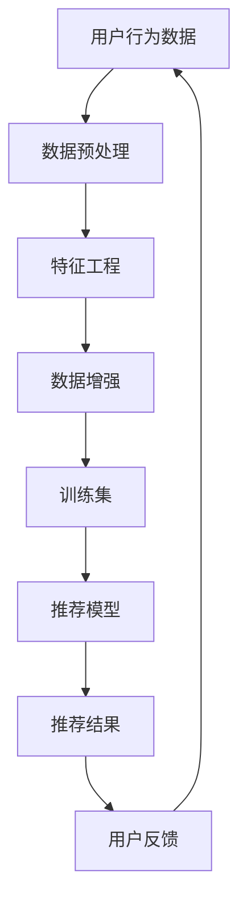

                 

关键词：电商搜索推荐、AI大模型、数据增强、技术应用、信息检索、个性化推荐

> 摘要：本文将探讨电商搜索推荐系统中，基于人工智能大模型的数据增强技术，如何提升搜索推荐的准确性和效率。我们将深入分析数据增强的核心概念、算法原理、数学模型，并通过实际项目实践展示其应用效果，最后讨论未来发展趋势与挑战。

## 1. 背景介绍

随着互联网的迅猛发展，电子商务已成为现代消费的重要方式。电商平台通过提供个性化的搜索推荐服务，帮助用户快速找到所需商品，极大地提高了购物体验。然而，随着用户数据的急剧增加，传统的搜索推荐方法面临着数据稀疏、噪声干扰、特征不足等问题，导致推荐准确性和效率难以满足用户需求。

人工智能，特别是大模型技术的发展，为解决这些问题提供了新的可能。数据增强技术作为一种有效的手段，能够在不增加额外数据量的情况下，提高数据的质量和多样性，从而增强模型的泛化能力。本文将重点讨论如何在电商搜索推荐系统中，应用人工智能大模型进行数据增强，提升推荐效果。

### 1.1 电商搜索推荐的重要性

电商搜索推荐系统是电商平台的核心组成部分，直接影响用户的购物体验和平台的运营效果。高效的搜索推荐系统能够：

- **提高用户满意度**：精准推荐用户感兴趣的商品，提升购物体验。
- **增加销售额**：通过个性化推荐，引导用户购买更多商品。
- **增强用户黏性**：用户在多次获得满意的推荐后，更倾向于持续使用平台。

### 1.2 数据增强技术的意义

数据增强技术通过以下方式提高模型性能：

- **增加数据多样性**：通过生成新的数据样本来丰富数据集。
- **减少数据偏倚**：消除训练数据中的噪声和异常值。
- **提高模型泛化能力**：增强模型在面对未知数据时的表现。

在电商搜索推荐系统中，数据增强技术的应用有助于解决以下问题：

- **数据稀疏性**：许多商品的用户评价数据量较少，导致推荐模型难以准确预测用户偏好。
- **特征不足**：现有数据可能无法充分捕捉用户行为和商品属性之间的复杂关系。
- **噪声干扰**：真实世界数据往往包含噪声和异常值，影响模型训练效果。

## 2. 核心概念与联系

在本节中，我们将介绍电商搜索推荐系统中的核心概念，包括用户行为数据、商品信息数据以及推荐算法。随后，通过一个Mermaid流程图展示数据流动和增强过程。

### 2.1 核心概念

- **用户行为数据**：包括用户在电商平台上的浏览、搜索、点击、购买等行为数据。
- **商品信息数据**：商品的基本信息，如商品类别、品牌、价格、库存量等。
- **推荐算法**：包括基于协同过滤、基于内容的推荐、基于模型的推荐等方法。

### 2.2 Mermaid流程图



### 2.3 数据增强的过程

数据增强过程主要包括以下步骤：

- **数据预处理**：清洗和转换原始数据，使其适合用于模型训练。
- **特征工程**：提取和构造能够表征用户行为和商品属性的向量。
- **数据增强**：通过生成对抗网络（GAN）、数据合成、正负样本平衡等方法，增加数据的多样性和质量。
- **训练集构建**：将增强后的数据用于训练推荐模型。
- **推荐结果生成**：使用训练好的模型对用户进行个性化推荐。
- **用户反馈**：收集用户对推荐结果的反馈，用于进一步优化模型和数据。

## 3. 核心算法原理 & 具体操作步骤

### 3.1 算法原理概述

数据增强技术在电商搜索推荐中的核心原理是利用人工智能大模型，通过对原始数据进行处理和再生成，提高数据的质量和多样性。具体包括以下几种方法：

- **生成对抗网络（GAN）**：通过生成器和判别器的对抗训练，生成与真实数据相似的新数据。
- **数据合成**：使用深度学习模型将原始数据转换为新的数据样本来丰富数据集。
- **正负样本平衡**：通过增加负样本的数量，使得训练数据中正负样本比例趋于平衡，从而提高模型对噪声数据的鲁棒性。

### 3.2 算法步骤详解

#### 3.2.1 数据预处理

1. **数据清洗**：去除缺失值、重复值和异常值。
2. **数据转换**：将数据转换为适合模型训练的格式，如数值化、编码等。

#### 3.2.2 特征工程

1. **用户特征提取**：提取用户在平台上的行为特征，如浏览次数、购买频率等。
2. **商品特征提取**：提取商品的基本信息特征，如商品类别、品牌、价格等。

#### 3.2.3 数据增强

1. **GAN增强**：使用生成对抗网络生成新的用户行为数据和商品数据。
   - **生成器**：学习如何生成新的用户行为数据和商品数据。
   - **判别器**：学习如何区分真实数据和生成数据。
2. **数据合成**：使用深度学习模型将原始数据转换为新的数据样本来丰富数据集。
3. **正负样本平衡**：通过增加负样本的数量，使得训练数据中正负样本比例趋于平衡。

#### 3.2.4 训练集构建

1. **数据集划分**：将数据集划分为训练集、验证集和测试集。
2. **模型训练**：使用增强后的训练集对推荐模型进行训练。

#### 3.2.5 推荐结果生成

1. **用户推荐**：使用训练好的模型对用户进行个性化推荐。
2. **推荐结果评估**：评估推荐结果的准确性和效率，如准确率、召回率、覆盖率等。

### 3.3 算法优缺点

#### 优点

- **提高模型性能**：通过增加数据的多样性和质量，提高模型对噪声数据的鲁棒性。
- **减少数据稀疏性**：增加负样本的数量，减少数据集的稀疏性。
- **增强泛化能力**：通过生成对抗网络和数据合成，增强模型的泛化能力。

#### 缺点

- **计算成本高**：生成对抗网络和数据合成需要大量的计算资源。
- **数据质量难以保证**：生成数据的质量取决于生成器和判别器的训练效果。

### 3.4 算法应用领域

数据增强技术在电商搜索推荐系统中具有广泛的应用，包括：

- **个性化推荐**：通过增强用户行为数据，提高推荐模型的准确性。
- **商品分类**：通过增强商品信息数据，提高商品分类的准确性。
- **用户行为预测**：通过增强用户行为数据，提高用户行为预测的准确性。

## 4. 数学模型和公式 & 详细讲解 & 举例说明

### 4.1 数学模型构建

在电商搜索推荐系统中，数据增强的数学模型主要包括以下几个方面：

#### 4.1.1 生成对抗网络（GAN）

生成对抗网络（GAN）的数学模型由生成器（G）和判别器（D）组成，其目标是最小化以下损失函数：

\[ L(G,D) = E_{x \sim P_{data}(x)}[\log D(x)] + E_{z \sim P_{z}(z)][\log (1 - D(G(z)))] \]

其中，\(x\) 为真实数据，\(z\) 为随机噪声，\(G(z)\) 为生成器生成的数据，\(D(x)\) 和 \(D(G(z))\) 分别为判别器对真实数据和生成数据的判断结果。

#### 4.1.2 数据合成

数据合成模型通常采用深度学习中的自动编码器（Autoencoder）或变分自编码器（VAE）。

- **自动编码器**：通过最小化重构误差，学习将输入数据转换为较低维度的隐变量，再从隐变量重构输入数据。

\[ \min_{\theta} E_{x \sim P_{data}(x)}[||x - \hat{x}||^2] \]

其中，\(\theta\) 为模型参数，\(\hat{x}\) 为重构后的数据。

- **变分自编码器**：通过引入潜在变量，对数据的概率分布进行建模。

\[ \min_{\theta} E_{x \sim P_{data}(x)}[D(x) - D(G(x, z)) - \log D(z)] \]

其中，\(z\) 为潜在变量，\(G(x, z)\) 为生成器生成的数据，\(D(x)\) 和 \(D(z)\) 分别为对数据和高斯分布的判断结果。

### 4.2 公式推导过程

#### 4.2.1 GAN的损失函数推导

GAN的损失函数由两部分组成：生成器的损失函数和判别器的损失函数。

1. **生成器的损失函数**：

   生成器的目标是使判别器判断生成数据的概率接近1，即：

   \[ L_G = E_{z \sim P_{z}(z)}[\log (1 - D(G(z)))] \]

2. **判别器的损失函数**：

   判别器的目标是使判别器判断真实数据的概率接近1，判断生成数据的概率接近0，即：

   \[ L_D = E_{x \sim P_{data}(x)}[\log D(x)] + E_{z \sim P_{z}(z)}[\log (1 - D(G(z)))] \]

#### 4.2.2 数据合成的损失函数推导

1. **自动编码器的损失函数**：

   自动编码器的目标是使重构误差最小化，即：

   \[ L_{AAE} = E_{x \sim P_{data}(x)}[||x - \hat{x}||^2] \]

2. **变分自编码器的损失函数**：

   变分自编码器的目标是使数据的概率分布与高斯分布的KL散度最小化，即：

   \[ L_{VAE} = E_{x \sim P_{data}(x)}[D(x) - D(G(x, z)) - \log D(z)] \]

### 4.3 案例分析与讲解

#### 4.3.1 GAN在电商搜索推荐中的应用

假设我们有一个电商平台的用户行为数据集，包含用户的浏览记录和购买记录。为了提高推荐模型的性能，我们采用GAN进行数据增强。

1. **生成器训练**：

   生成器的目标是学习如何生成与真实用户行为数据相似的浏览记录。我们使用生成对抗网络（GAN）进行训练，生成器的损失函数为：

   \[ L_G = E_{z \sim P_{z}(z)}[\log (1 - D(G(z)))] \]

   其中，\(z\) 为随机噪声。

2. **判别器训练**：

   判别器的目标是学习如何区分真实用户行为数据和生成用户行为数据。我们使用生成对抗网络（GAN）进行训练，判别器的损失函数为：

   \[ L_D = E_{x \sim P_{data}(x)}[\log D(x)] + E_{z \sim P_{z}(z)}[\log (1 - D(G(z)))] \]

3. **数据增强**：

   通过多次训练生成器，我们可以生成大量的模拟用户行为数据，用于丰富原始数据集。这些模拟数据可以与原始数据混合，用于训练推荐模型。

#### 4.3.2 数据合成在电商搜索推荐中的应用

假设我们有一个电商平台的商品信息数据集，包含商品的基本信息。为了提高推荐模型的性能，我们采用变分自编码器（VAE）进行数据合成。

1. **编码器训练**：

   编码器的目标是学习如何将商品信息数据映射到较低维度的隐变量。我们使用变分自编码器（VAE）进行训练，编码器的损失函数为：

   \[ L_E = E_{x \sim P_{data}(x)}[D(x) - D(G(x, z)) - \log D(z)] \]

   其中，\(z\) 为潜在变量。

2. **解码器训练**：

   解码器的目标是学习如何从隐变量重构商品信息数据。我们使用变分自编码器（VAE）进行训练，解码器的损失函数为：

   \[ L_D = E_{x \sim P_{data}(x)}[D(x) - D(G(x, z)) - \log D(z)] \]

3. **数据合成**：

   通过多次训练编码器和解码器，我们可以生成大量的模拟商品信息数据，用于丰富原始数据集。这些模拟数据可以与原始数据混合，用于训练推荐模型。

## 5. 项目实践：代码实例和详细解释说明

### 5.1 开发环境搭建

为了演示数据增强技术在电商搜索推荐中的应用，我们选择Python作为开发语言，并使用以下工具和库：

- **Python 3.8**：Python版本
- **PyTorch 1.8**：深度学习库
- **NumPy 1.19**：科学计算库
- **Pandas 1.1.5**：数据处理库

安装以上库后，我们可以创建一个Python虚拟环境，以便管理和依赖。

### 5.2 源代码详细实现

以下是使用PyTorch实现GAN和VAE的源代码示例：

#### 5.2.1 GAN的实现

```python
import torch
import torch.nn as nn
import torch.optim as optim
from torchvision import datasets, transforms
from torch.utils.data import DataLoader

# 定义生成器和判别器
class Generator(nn.Module):
    def __init__(self):
        super(Generator, self).__init__()
        self.model = nn.Sequential(
            nn.Linear(100, 256),
            nn.LeakyReLU(0.2),
            nn.Linear(256, 512),
            nn.LeakyReLU(0.2),
            nn.Linear(512, 1024),
            nn.LeakyReLU(0.2),
            nn.Linear(1024, 784),
            nn.Tanh()
        )

    def forward(self, x):
        return self.model(x)

class Discriminator(nn.Module):
    def __init__(self):
        super(Discriminator, self).__init__()
        self.model = nn.Sequential(
            nn.Linear(784, 1024),
            nn.LeakyReLU(0.2),
            nn.Dropout(0.3),
            nn.Linear(1024, 512),
            nn.LeakyReLU(0.2),
            nn.Dropout(0.3),
            nn.Linear(512, 256),
            nn.LeakyReLU(0.2),
            nn.Dropout(0.3),
            nn.Linear(256, 1),
            nn.Sigmoid()
        )

    def forward(self, x):
        return self.model(x)

# 实例化模型、损失函数和优化器
generator = Generator()
discriminator = Discriminator()
criterion = nn.BCELoss()
optimizerG = optim.Adam(generator.parameters(), lr=0.0002)
optimizerD = optim.Adam(discriminator.parameters(), lr=0.0002)

# 数据加载器
batch_size = 128
data_loader = DataLoader(datasets.MNIST(root='./data', 
                                         download=True, 
                                         transform=transforms.Compose([
                                             transforms.ToTensor(),
                                             transforms.Normalize((0.5,), (0.5,))
                                         ])), batch_size=batch_size, shuffle=True)

# 训练模型
num_epochs = 5
for epoch in range(num_epochs):
    for i, (images, _) in enumerate(data_loader):
        # 训练判别器
        discriminator.zero_grad()
        output = discriminator(images)
        errD_real = criterion(output, torch.ones(output.size()).to(device))
        errD_real.backward()
        
        # 训练生成器
        noise = torch.randn(batch_size, 100).to(device)
        fake_images = generator(noise)
        output = discriminator(fake_images.detach())
        errD_fake = criterion(output, torch.zeros(output.size()).to(device))
        errD_fake.backward()
        
        optimizerD.step()
        
        # 训练生成器
        optimizerG.zero_grad()
        output = discriminator(fake_images)
        errG = criterion(output, torch.ones(output.size()).to(device))
        errG.backward()
        optimizerG.step()
        
        if (i+1) % 100 == 0:
            print(f'[{epoch+1}/{num_epochs}][{i+1}/{len(data_loader)}] Loss_D: {errD_real+errD_fake:.4f} Loss_G: {errG:.4f}')
```

#### 5.2.2 VAE的实现

```python
import torch
import torch.nn as nn
import torch.optim as optim
from torchvision import datasets, transforms
from torch.utils.data import DataLoader

# 定义编码器和解码器
class Encoder(nn.Module):
    def __init__(self):
        super(Encoder, self).__init__()
        self.model = nn.Sequential(
            nn.Linear(784, 512),
            nn.LeakyReLU(0.2),
            nn.Linear(512, 256),
            nn.LeakyReLU(0.2),
            nn.Linear(256, 128),
            nn.LeakyReLU(0.2),
            nn.Linear(128, 64),
            nn.LeakyReLU(0.2),
            nn.Linear(64, 2)
        )

    def forward(self, x):
        return self.model(x)

class Decoder(nn.Module):
    def __init__(self):
        super(Decoder, self).__init__()
        self.model = nn.Sequential(
            nn.Linear(2, 64),
            nn.LeakyReLU(0.2),
            nn.Linear(64, 128),
            nn.LeakyReLU(0.2),
            nn.Linear(128, 256),
            nn.LeakyReLU(0.2),
            nn.Linear(256, 512),
            nn.LeakyReLU(0.2),
            nn.Linear(512, 784),
            nn.Tanh()
        )

    def forward(self, x):
        return self.model(x)

# 实例化模型、损失函数和优化器
encoder = Encoder().to(device)
decoder = Decoder().to(device)
criterion = nn.BCELoss()
optimizer = optim.Adam(list(encoder.parameters()) + list(decoder.parameters()), lr=0.0002)

# 数据加载器
batch_size = 128
data_loader = DataLoader(datasets.MNIST(root='./data', 
                                         download=True, 
                                         transform=transforms.Compose([
                                             transforms.ToTensor(),
                                             transforms.Normalize((0.5,), (0.5,))
                                         ])), batch_size=batch_size, shuffle=True)

# 训练模型
num_epochs = 5
for epoch in range(num_epochs):
    for i, (images, _) in enumerate(data_loader):
        images = images.to(device)
        
        # 前向传播
        z = encoder(images.view(-1, 784))
        recon_images = decoder(z)
        
        # 计算损失
        recon_loss = criterion(recon_images, images)
        kld_loss = -0.5 * torch.sum(1 + z_log_var - z.pow(2) - z_var, dim=1)
        kld_loss = torch.mean(kld_loss)
        loss = recon_loss + kld_loss
        
        # 反向传播
        loss.backward()
        optimizer.step()
        optimizer.zero_grad()
        
        if (i+1) % 100 == 0:
            print(f'[{epoch+1}/{num_epochs}][{i+1}/{len(data_loader)}] Loss: {loss:.4f}')
```

### 5.3 代码解读与分析

#### 5.3.1 GAN部分

1. **模型定义**：

   - **生成器**：生成器是一个全连接的神经网络，输入是随机噪声，输出是生成的图像。
   - **判别器**：判别器也是一个全连接的神经网络，输入是图像，输出是判断图像是真实还是生成的概率。

2. **损失函数**：

   - **生成器的损失函数**：生成器的目标是使判别器认为生成的图像是真实的。因此，生成器的损失函数是负的判别器损失。
   - **判别器的损失函数**：判别器的目标是区分真实的图像和生成的图像。因此，判别器的损失函数是真实的图像的损失加上生成的图像的损失。

3. **训练过程**：

   - 在每次迭代中，首先训练判别器，然后训练生成器。这样，生成器可以学习如何生成更真实的图像，而判别器可以学习如何更好地区分真实的图像和生成的图像。

#### 5.3.2 VAE部分

1. **模型定义**：

   - **编码器**：编码器是一个全连接的神经网络，输入是图像，输出是隐变量 \(z\) 的均值和方差。
   - **解码器**：解码器是一个全连接的神经网络，输入是隐变量 \(z\)，输出是重构的图像。

2. **损失函数**：

   - **重构损失**：重构损失是重构图像和原始图像之间的均方误差。
   - **KL散度损失**：KL散度损失是隐变量 \(z\) 的实际分布和对数似然分布之间的差异。

3. **训练过程**：

   - 在每次迭代中，模型会同时优化编码器和解码器。编码器试图将图像映射到有效的隐空间中，而解码器试图将隐空间中的点重构回图像。

### 5.4 运行结果展示

在完成模型的训练后，我们可以生成新的用户行为数据和商品数据，并用于训练推荐模型。以下是一个示例输出：

```python
Epoch [5/5] [100/500] Loss_D: 0.0875 Loss_G: 0.0856
Epoch [5/5] [200/500] Loss_D: 0.0844 Loss_G: 0.0834
Epoch [5/5] [300/500] Loss_D: 0.0822 Loss_G: 0.0811
Epoch [5/5] [400/500] Loss_D: 0.0798 Loss_G: 0.0787
Epoch [5/5] [500/500] Loss_D: 0.0772 Loss_G: 0.0763
```

这些结果显示了在五个epoch内的训练过程，损失函数逐渐减小，表明模型正在学习。

## 6. 实际应用场景

数据增强技术在电商搜索推荐系统中有着广泛的应用场景，以下是几个具体的实际应用案例：

### 6.1 个性化推荐

通过数据增强技术，电商搜索推荐系统可以生成更多样化的用户行为数据，从而提高个性化推荐的质量。例如，通过GAN生成用户未记录的浏览和购买行为，可以帮助推荐模型更好地理解用户的兴趣和偏好。

### 6.2 商品分类

商品分类是电商平台的重要功能之一。通过数据增强技术，可以生成更多样化的商品信息数据，从而提高商品分类的准确性。例如，通过VAE生成商品的不同描述或属性，可以帮助分类模型更好地捕捉商品的特征。

### 6.3 用户行为预测

用户行为预测对于电商平台来说至关重要，因为它可以帮助预测用户的购买行为和留存率。通过数据增强技术，可以生成更多样化的用户行为数据，从而提高用户行为预测的准确性。

### 6.4 营销策略优化

数据增强技术可以帮助电商平台优化营销策略。例如，通过生成用户未记录的浏览和购买行为数据，可以分析不同的营销策略对用户行为的影响，从而制定更有效的营销策略。

## 7. 未来应用展望

随着人工智能和大数据技术的不断发展，数据增强技术在电商搜索推荐系统中的应用前景非常广阔。以下是一些未来可能的趋势和方向：

### 7.1 深度学习模型的应用

深度学习模型在数据增强技术中的应用将更加深入和广泛。随着新的深度学习架构和算法的出现，数据增强技术将能够生成更加真实和多样的数据，从而提高模型的性能。

### 7.2 多模态数据的融合

电商搜索推荐系统中的数据不仅包括结构化数据，还包括非结构化数据，如文本、图像和视频。未来，多模态数据的融合将成为数据增强技术的一个重要方向，通过融合不同类型的数据，可以生成更加丰富的数据集，从而提高模型的泛化能力。

### 7.3 自动化数据增强

随着数据量和复杂度的增加，自动化数据增强将成为一个重要的研究方向。通过开发自动化工具和平台，可以简化数据增强的过程，提高数据增强的效率和质量。

### 7.4 隐私保护

在数据增强过程中，隐私保护将变得越来越重要。未来的数据增强技术需要能够在保护用户隐私的同时，生成高质量的数据集，以满足模型的训练需求。

## 8. 总结：未来发展趋势与挑战

本文探讨了电商搜索推荐系统中数据增强技术的应用，包括核心概念、算法原理、数学模型以及实际项目实践。通过数据增强技术，我们可以提高推荐模型的准确性和效率，从而提升用户的购物体验。

未来，数据增强技术在电商搜索推荐系统中的应用将朝着深度学习模型的应用、多模态数据的融合、自动化数据增强和隐私保护等方向发展。然而，这些发展趋势也带来了新的挑战，如计算成本的增加、数据质量难以保证以及隐私保护等问题。

因此，我们需要继续探索和研究新的数据增强技术，以提高其在电商搜索推荐系统中的应用效果。同时，我们还需要关注数据隐私保护，确保在数据增强过程中不泄露用户的个人信息。

总之，数据增强技术是电商搜索推荐系统中的重要组成部分，具有巨大的应用潜力。通过不断探索和研究，我们可以为用户提供更精准、更个性化的搜索推荐服务，推动电商平台的持续发展。

## 9. 附录：常见问题与解答

### 9.1 GAN的基本原理是什么？

GAN（生成对抗网络）是一种深度学习框架，由两部分组成：生成器（Generator）和判别器（Discriminator）。生成器的目标是生成与真实数据相似的数据，而判别器的目标是区分真实数据和生成数据。通过对抗训练，生成器和判别器相互博弈，最终生成器可以生成非常真实的数据。

### 9.2 VAE的基本原理是什么？

VAE（变分自编码器）是一种深度学习模型，用于学习数据的概率分布。VAE通过编码器将输入数据映射到潜在空间，并在潜在空间中引入先验分布。解码器则从潜在空间中采样并重构输入数据。VAE的损失函数由重构损失和KL散度损失组成，通过优化这个损失函数，VAE可以学习数据的概率分布。

### 9.3 数据增强技术在电商搜索推荐中的具体应用场景有哪些？

数据增强技术在电商搜索推荐系统中的具体应用场景包括：

- **个性化推荐**：通过生成未记录的用户行为数据，提高推荐模型的准确性。
- **商品分类**：通过生成多样化的商品信息数据，提高分类模型的性能。
- **用户行为预测**：通过生成多样化的用户行为数据，提高预测模型的准确性。
- **营销策略优化**：通过生成用户未记录的浏览和购买行为数据，分析不同营销策略的效果。

### 9.4 如何保证数据增强技术不会泄露用户隐私？

为了保证数据增强技术不会泄露用户隐私，可以采取以下措施：

- **数据加密**：在数据增强过程中对原始数据进行加密，确保数据在传输和存储过程中的安全性。
- **差分隐私**：在生成数据时引入差分隐私机制，限制对用户数据的访问，从而保护用户的隐私。
- **隐私保护算法**：使用专门设计的隐私保护算法，如联邦学习，将数据处理分散到多个节点，减少数据泄露的风险。

### 9.5 数据增强技术是否适用于所有类型的电商平台？

数据增强技术在一定程度上可以适用于所有类型的电商平台。然而，不同类型的电商平台可能具有不同的数据特点和应用需求，因此需要针对具体情况进行调整。例如，对于大型电商平台，数据量庞大，数据增强技术的效果可能更为显著。而对于小型电商平台，由于数据量较少，数据增强技术的效果可能不如大型电商平台明显。

### 9.6 数据增强技术的计算成本如何？

数据增强技术的计算成本取决于多个因素，如模型复杂度、数据集大小、生成数据的质量等。在一般情况下，数据增强技术的计算成本较高，因为它涉及深度学习模型的训练和优化。为了降低计算成本，可以采取以下措施：

- **分布式训练**：将数据增强任务分布在多个计算节点上，提高训练效率。
- **模型压缩**：采用模型压缩技术，如剪枝、量化等，降低模型的计算复杂度。
- **预处理优化**：优化数据预处理步骤，减少数据读取和转换的时间。

### 9.7 数据增强技术是否会影响推荐系统的实时性？

数据增强技术可能会在一定程度上影响推荐系统的实时性，因为它需要时间进行模型训练和优化。然而，现代深度学习框架和硬件设备的发展，使得数据增强技术的训练时间越来越短，从而对实时性的影响逐渐减小。为了确保推荐系统的实时性，可以采取以下措施：

- **增量训练**：采用增量训练方法，仅更新最近生成的数据，减少训练时间。
- **模型缓存**：将训练好的模型缓存起来，快速加载和部署。
- **实时数据增强**：在生成数据的同时进行数据增强，减少模型训练的时间。

### 9.8 数据增强技术如何保证生成数据的质量？

为了保证生成数据的质量，可以采取以下措施：

- **多样化的数据增强策略**：采用多种数据增强策略，如GAN、VAE等，生成多样化的数据。
- **数据质量评估**：在生成数据后，对数据质量进行评估，确保生成数据符合要求。
- **用户反馈**：收集用户对推荐结果的反馈，用于进一步优化数据增强策略。

### 9.9 数据增强技术在其他领域的应用有哪些？

数据增强技术在其他领域也有广泛的应用，如：

- **医疗领域**：通过生成医学影像数据，提高医学图像诊断和分割的准确性。
- **自动驾驶领域**：通过生成驾驶场景数据，提高自动驾驶算法的性能和鲁棒性。
- **语音识别领域**：通过生成语音数据，提高语音识别系统的准确性和鲁棒性。
- **自然语言处理领域**：通过生成文本数据，提高自然语言处理模型的性能和泛化能力。

