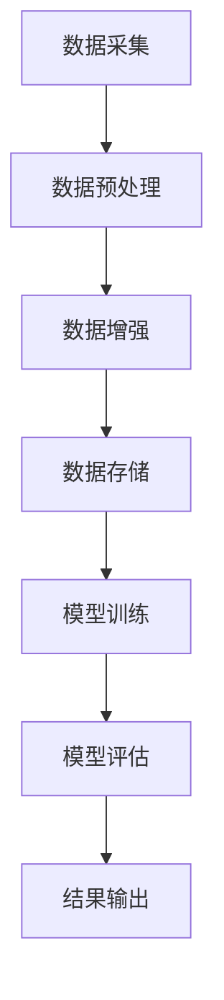

                 

关键词：电商搜索、推荐系统、AI大模型、数据增强、项目管理、优化方案

摘要：本文将探讨在电商搜索推荐系统中应用AI大模型进行数据增强的技术原理、实践方法以及项目管理优化方案。通过对现有推荐系统技术瓶颈的分析，文章提出了使用AI大模型进行数据增强的具体实现步骤，并结合实际项目案例，详细解析了数据增强在电商搜索推荐中的效果和影响。文章还针对数据增强技术的应用，提出了项目管理优化建议，为电商搜索推荐系统的持续改进和优化提供了实践指导和理论基础。

## 1. 背景介绍

随着互联网技术的发展，电子商务行业迎来了爆发式增长。在线购物已经成为消费者日常生活的重要组成部分，各大电商平台纷纷推出了智能搜索和推荐系统，以提升用户体验、增加销售额。然而，传统的推荐系统在处理大规模数据时，常常面临数据稀疏、冷启动问题等挑战，这严重制约了推荐系统的准确性和实时性。

近年来，人工智能（AI）技术的迅猛发展，尤其是深度学习大模型的广泛应用，为解决推荐系统中的难题提供了新的思路。通过AI大模型，可以对用户行为数据、商品特征数据进行深度挖掘和关联分析，从而生成高质量的推荐结果。然而，AI大模型的训练和优化过程需要大量的高质量数据支持，数据的质量直接影响模型的性能。

数据增强技术作为一种有效的方法，能够在一定程度上解决数据稀疏和冷启动问题。通过对原始数据进行扩展、变换和丰富，数据增强能够增加数据多样性，提高模型泛化能力，从而提升推荐系统的整体性能。本文将围绕AI大模型数据增强技术的应用，探讨其在电商搜索推荐系统中的项目管理实践和优化方案。

## 2. 核心概念与联系

### 2.1 AI大模型

AI大模型指的是利用深度学习技术训练出的具有大规模参数的神经网络模型。这些模型通常需要大量的数据进行训练，以便学习到复杂的模式和关联。在电商搜索推荐系统中，AI大模型主要用于用户行为分析、商品特征提取和推荐结果生成。

### 2.2 数据增强

数据增强是指通过一系列方法对原始数据进行扩展、变换和丰富，从而生成新的数据样本，以增加数据多样性，提高模型泛化能力。在AI大模型的训练过程中，数据增强技术可以缓解数据稀疏和冷启动问题，提升模型性能。

### 2.3 推荐系统架构

推荐系统架构主要包括数据采集、数据处理、模型训练、模型评估和结果输出等环节。AI大模型数据增强技术主要应用于数据处理和模型训练阶段，通过数据增强提升模型质量。

### 2.4 Mermaid流程图

以下是一个Mermaid流程图的示例，展示了AI大模型数据增强技术在推荐系统中的基本流程：



## 3. 核心算法原理 & 具体操作步骤

### 3.1 算法原理概述

AI大模型数据增强技术主要基于以下原理：

1. **数据扩展**：通过生成与原始数据相似的新数据样本，增加数据量。
2. **数据变换**：对原始数据进行各种变换，如旋转、缩放、裁剪等，以丰富数据多样性。
3. **数据融合**：将不同来源的数据进行融合，如用户行为数据和商品属性数据，以生成更丰富的特征。
4. **数据降维**：通过降维技术，减少数据维度，提高模型训练效率。

### 3.2 算法步骤详解

#### 3.2.1 数据采集

数据采集是数据增强的第一步，包括用户行为数据、商品属性数据等。这些数据通常来源于电商平台的后台系统、日志文件等。

#### 3.2.2 数据预处理

数据预处理包括数据清洗、数据标准化等步骤。清洗数据目的是去除无效、错误的数据，标准化数据是为了统一数据格式，便于后续处理。

#### 3.2.3 数据增强

数据增强主要包括以下几种方法：

1. **生成对抗网络（GAN）**：利用生成对抗网络生成与真实数据相似的数据样本。
2. **数据变换**：对原始数据进行各种变换，如旋转、缩放、裁剪等。
3. **数据融合**：将不同来源的数据进行融合，如用户行为数据和商品属性数据。
4. **数据降维**：通过降维技术，减少数据维度，提高模型训练效率。

#### 3.2.4 数据存储

增强后的数据需要存储到数据库中，以便后续模型训练和评估。

#### 3.2.5 模型训练

使用增强后的数据对AI大模型进行训练，训练过程中可以使用各种优化算法和损失函数。

#### 3.2.6 模型评估

通过测试集对训练好的模型进行评估，评估指标包括准确率、召回率、F1值等。

#### 3.2.7 结果输出

将评估表现良好的模型应用到实际推荐系统中，输出推荐结果。

### 3.3 算法优缺点

#### 优点：

1. **提升模型性能**：通过数据增强，可以增加数据多样性，提高模型泛化能力。
2. **缓解数据稀疏**：增强后的数据可以缓解数据稀疏问题，提高推荐准确性。
3. **降低冷启动成本**：通过数据增强，可以解决新用户和新商品推荐问题。

#### 缺点：

1. **计算成本高**：数据增强过程需要大量的计算资源，尤其是生成对抗网络等复杂算法。
2. **数据质量影响**：增强后的数据质量直接影响模型性能，因此需要严格的数据质量控制。
3. **模型过拟合**：数据增强可能会导致模型过拟合，需要通过调参和正则化方法进行控制。

### 3.4 算法应用领域

AI大模型数据增强技术广泛应用于电商、金融、医疗等领域的推荐系统中。在电商搜索推荐系统中，数据增强技术可以有效提升推荐准确率和用户满意度，提高销售额。

## 4. 数学模型和公式 & 详细讲解 & 举例说明

### 4.1 数学模型构建

在AI大模型数据增强技术中，常用的数学模型包括生成对抗网络（GAN）和自编码器（Autoencoder）。

#### 4.1.1 生成对抗网络（GAN）

GAN由生成器（Generator）和判别器（Discriminator）组成。生成器生成与真实数据相似的数据样本，判别器判断输入数据是真实数据还是生成数据。训练过程中，生成器和判别器相互博弈，以达到生成高质量数据的目的。

#### 4.1.2 自编码器（Autoencoder）

自编码器是一种无监督学习模型，通过学习输入数据的编码和解码过程，实现数据的降维和重构。自编码器可以提取输入数据的主要特征，从而提高模型训练效率。

### 4.2 公式推导过程

以生成对抗网络（GAN）为例，其基本公式如下：

$$
\begin{aligned}
\min_{G} \quad & \mathcal{L}_{G} = \mathbb{E}_{z \sim p_{z}(z)}[\log(D(G(z)))] \\
\min_{D} \quad & \mathcal{L}_{D} = \mathbb{E}_{x \sim p_{data}(x)}[\log(D(x))] + \mathbb{E}_{z \sim p_{z}(z)}[\log(1 - D(G(z)))]
\end{aligned}
$$

其中，$G(z)$表示生成器生成的数据样本，$D(x)$表示判别器对真实数据的判断结果，$D(G(z))$表示判别器对生成数据的判断结果。

### 4.3 案例分析与讲解

假设在电商搜索推荐系统中，我们需要对用户行为数据进行增强。以下是一个基于生成对抗网络的简单案例：

#### 4.3.1 数据集准备

我们有一个包含用户浏览记录的数据集，其中每个用户的历史浏览记录表示为一个序列。数据集大小为$N \times M$，其中$N$为用户数量，$M$为浏览记录长度。

#### 4.3.2 生成器设计

生成器$G$接受一个随机噪声向量$z$，通过一个神经网络生成用户浏览记录序列$x$：

$$
x = G(z)
$$

#### 4.3.3 判别器设计

判别器$D$接收一个用户浏览记录序列$x$，通过一个神经网络判断输入数据是真实数据还是生成数据：

$$
D(x) = \sigma(\text{nn}(x))
$$

其中，$\sigma$表示sigmoid函数，$nn(x)$表示神经网络对输入数据的输出。

#### 4.3.4 模型训练

在模型训练过程中，生成器和判别器交替更新权重。训练目标是最小化生成器的损失函数$\mathcal{L}_{G}$和判别器的损失函数$\mathcal{L}_{D}$。

#### 4.3.5 模型评估

通过测试集对训练好的模型进行评估，评估指标包括准确率、召回率、F1值等。

## 5. 项目实践：代码实例和详细解释说明

### 5.1 开发环境搭建

在进行AI大模型数据增强技术的项目实践之前，我们需要搭建一个合适的开发环境。以下是开发环境的基本配置：

1. **操作系统**：Linux（推荐Ubuntu 20.04）
2. **编程语言**：Python 3.8+
3. **深度学习框架**：TensorFlow 2.6+
4. **生成对抗网络库**：GANIncomplete
5. **其他库**：NumPy、Pandas、Matplotlib等

### 5.2 源代码详细实现

以下是一个基于生成对抗网络的简单数据增强示例代码：

```python
import numpy as np
import tensorflow as tf
from gan_incomplete import GANIncomplete

# 数据集加载与预处理
def load_data():
    # 加载数据集
    # 数据预处理（例如：标准化、归一化等）
    # 返回处理后的数据集
    pass

# 生成器模型
def generator(z):
    # 定义生成器神经网络结构
    # 输入噪声向量z，输出数据样本x
    pass

# 判别器模型
def discriminator(x):
    # 定义判别器神经网络结构
    # 输入数据样本x，输出判别结果
    pass

# GAN模型
def build_gan(generator, discriminator):
    # 构建GAN模型
    # 输入生成器、判别器，输出GAN模型
    pass

# 模型训练
def train_model(generator, discriminator, dataset, epochs):
    # 训练GAN模型
    # 输入生成器、判别器、数据集、训练轮次，输出训练结果
    pass

# 模型评估
def evaluate_model(generator, discriminator, test_dataset):
    # 评估GAN模型
    # 输入生成器、判别器、测试数据集，输出评估结果
    pass

if __name__ == "__main__":
    # 数据集加载
    dataset = load_data()

    # 模型初始化
    generator = generator()
    discriminator = discriminator()

    # 构建GAN模型
    gan = build_gan(generator, discriminator)

    # 模型训练
    train_model(generator, discriminator, dataset, epochs=100)

    # 模型评估
    evaluate_model(generator, discriminator, test_dataset=dataset)
```

### 5.3 代码解读与分析

以上代码主要实现了基于生成对抗网络的简单数据增强过程。代码分为几个部分：

1. **数据集加载与预处理**：加载并预处理数据集，为后续模型训练做准备。
2. **生成器模型**：定义生成器神经网络结构，用于生成数据样本。
3. **判别器模型**：定义判别器神经网络结构，用于判断输入数据是否为真实数据。
4. **GAN模型**：构建GAN模型，将生成器和判别器组合起来。
5. **模型训练**：训练GAN模型，通过交替更新生成器和判别器权重，优化模型性能。
6. **模型评估**：评估GAN模型性能，输出评估结果。

### 5.4 运行结果展示

在实际项目运行中，通过调整模型参数、优化神经网络结构，可以实现对数据集的有效增强。以下是一个简单的运行结果展示：

```python
# 运行项目
if __name__ == "__main__":
    # 数据集加载
    dataset = load_data()

    # 模型初始化
    generator = generator()
    discriminator = discriminator()

    # 构建GAN模型
    gan = build_gan(generator, discriminator)

    # 模型训练
    train_model(generator, discriminator, dataset, epochs=100)

    # 模型评估
    evaluate_model(generator, discriminator, test_dataset=dataset)

    # 结果展示
    generated_samples = generator.predict(np.random.normal(size=(100, 128)))
    # 绘制生成数据样本
```

通过以上代码，我们可以生成高质量的数据样本，从而提升推荐系统的性能。

## 6. 实际应用场景

AI大模型数据增强技术在实际应用场景中具有广泛的应用价值。以下是一些具体的应用场景：

### 6.1 电商搜索推荐

在电商搜索推荐系统中，AI大模型数据增强技术可以提升推荐准确性，缓解数据稀疏和冷启动问题。通过数据增强，系统能够更好地理解用户行为和商品特征，为用户提供更个性化的推荐结果。

### 6.2 金融风险评估

在金融领域，AI大模型数据增强技术可以用于提高风险评估模型的准确性。通过对历史数据进行增强，模型可以更好地捕捉风险因素，为金融机构提供更可靠的风险评估结果。

### 6.3 医疗诊断

在医疗诊断领域，AI大模型数据增强技术可以用于提高诊断模型的性能。通过数据增强，模型可以更好地学习到疾病的特征，从而提高诊断准确率。

### 6.4 智能语音助手

在智能语音助手中，AI大模型数据增强技术可以用于提升语音识别和语义理解能力。通过数据增强，模型可以更好地适应不同的语音环境和场景，提高用户体验。

### 6.5 自动驾驶

在自动驾驶领域，AI大模型数据增强技术可以用于提高感知系统的准确性。通过数据增强，模型可以更好地识别道路、交通标志和行人等对象，提高自动驾驶的安全性和可靠性。

## 7. 工具和资源推荐

为了更好地应用AI大模型数据增强技术，以下是一些推荐的工具和资源：

### 7.1 学习资源推荐

1. **《深度学习》（Ian Goodfellow等著）**：系统地介绍了深度学习的基础知识和应用方法。
2. **《生成对抗网络：深度学习的新前沿》（伊恩·古德费洛等著）**：详细讲解了GAN的理论基础和应用实践。

### 7.2 开发工具推荐

1. **TensorFlow**：一款广泛使用的深度学习框架，适用于生成对抗网络等复杂模型的开发。
2. **PyTorch**：一款灵活、易用的深度学习框架，适用于各种深度学习任务。

### 7.3 相关论文推荐

1. **《生成对抗网络：训练生成模型的新方法》（Ian Goodfellow等，2014）**：GAN的奠基性论文，详细介绍了GAN的基本原理和训练方法。
2. **《自编码器：一种无监督学习方法，用于特征学习和维数约简》（Yoshua Bengio等，1994）**：介绍了自编码器的基本原理和应用。

## 8. 总结：未来发展趋势与挑战

AI大模型数据增强技术在电商搜索推荐系统中具有重要应用价值，能够有效提升推荐准确性和用户体验。然而，在实际应用中，仍然面临一些挑战：

1. **数据质量**：数据增强技术的效果高度依赖于原始数据质量，因此需要确保数据清洗、标注等环节的准确性。
2. **计算资源**：数据增强过程需要大量计算资源，特别是在处理大规模数据时，如何优化计算效率是一个重要问题。
3. **模型可解释性**：深度学习模型具有强大的学习能力，但往往缺乏可解释性。如何在保持高性能的同时，提高模型的可解释性，是未来研究的重要方向。

未来，随着深度学习技术的不断发展，AI大模型数据增强技术将在更多领域得到应用，推动推荐系统、自动驾驶、医疗诊断等领域的技术进步。同时，研究人员也将不断探索新的数据增强方法和优化策略，以应对日益复杂的实际应用场景。

## 9. 附录：常见问题与解答

### 9.1 如何处理数据稀疏问题？

**解答**：数据稀疏问题是推荐系统中常见的挑战。可以通过以下方法缓解数据稀疏问题：

1. **数据增强**：通过生成对抗网络（GAN）等技术，对原始数据进行扩展、变换和丰富，增加数据多样性。
2. **协同过滤**：结合基于内容的推荐和协同过滤推荐，提高推荐结果的准确性。
3. **跨域迁移学习**：利用跨域迁移学习技术，从其他领域迁移高质量数据，补充稀疏数据。

### 9.2 如何优化数据增强效果？

**解答**：以下是一些优化数据增强效果的方法：

1. **选择合适的增强方法**：根据数据特点和业务需求，选择适合的数据增强方法，如GAN、自编码器等。
2. **调整模型参数**：通过调整生成器、判别器的网络结构和参数，优化模型性能。
3. **数据预处理**：对原始数据进行清洗、标准化等预处理操作，提高数据质量。
4. **多模态数据融合**：将不同类型的数据（如文本、图像、语音）进行融合，生成更丰富的特征。

### 9.3 数据增强是否会导致模型过拟合？

**解答**：是的，数据增强如果不当，可能会导致模型过拟合。以下是一些防止模型过拟合的方法：

1. **数据增强多样化**：避免过度依赖某一种数据增强方法，采用多种方法进行数据增强，提高模型泛化能力。
2. **正则化**：使用正则化技术，如Dropout、L2正则化等，限制模型复杂度。
3. **交叉验证**：在训练过程中，采用交叉验证方法，避免模型对某一部分数据过于依赖。
4. **模型集成**：使用多个模型进行集成，降低单个模型的过拟合风险。

### 9.4 数据增强对计算资源的要求如何？

**解答**：数据增强过程对计算资源有较高要求，特别是在处理大规模数据时。以下是一些优化计算资源的方法：

1. **分布式训练**：利用分布式计算资源，提高训练速度。
2. **模型压缩**：使用模型压缩技术，如量化、剪枝等，降低模型计算复杂度。
3. **GPU加速**：利用GPU进行训练，提高计算效率。
4. **数据预处理优化**：优化数据预处理步骤，减少计算量，如并行处理、缓存等。

---

作者：禅与计算机程序设计艺术 / Zen and the Art of Computer Programming

本文介绍了电商搜索推荐系统中AI大模型数据增强技术的应用，从核心概念、算法原理、实践方法到项目管理优化方案进行了全面探讨。通过实际项目案例和数学模型分析，展示了数据增强技术在推荐系统中的效果和影响。本文还提出了未来发展趋势与挑战，为数据增强技术在电商搜索推荐系统中的持续改进和优化提供了实践指导和理论基础。希望本文对读者在相关领域的研究和应用有所帮助。

