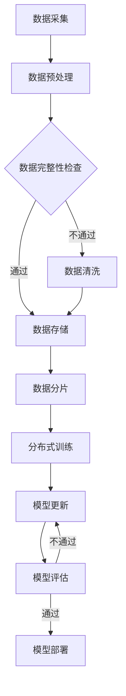

                 

电商搜索推荐系统是现代电商运营的重要组成部分，它不仅影响用户的购物体验，还直接关系到电商平台的收入和竞争力。随着电商业务的不断扩大和数据量的指数级增长，如何高效、准确地进行AI大模型的数据增量更新，成为了一个亟待解决的问题。本文将围绕这一问题，探讨电商搜索推荐中的AI大模型数据增量更新机制的优化方案设计与实现。

## 关键词

- 电商搜索推荐
- AI大模型
- 数据增量更新
- 优化方案
- 设计与实现

## 摘要

本文首先介绍了电商搜索推荐系统在当前电商运营中的重要性，并指出了数据增量更新对于AI大模型性能提升的关键作用。接着，本文深入分析了数据增量更新的核心概念与联系，并借助Mermaid流程图展示了其工作原理。然后，本文详细阐述了核心算法的原理与具体操作步骤，包括算法优缺点与应用领域。此外，本文还介绍了数学模型和公式，并通过实际项目实践展示了代码实例和详细解释说明。最后，本文讨论了实际应用场景和未来应用展望，并总结了研究成果、未来发展趋势与挑战，以及附录中的常见问题与解答。

## 1. 背景介绍

随着互联网的迅猛发展和电子商务的普及，电商搜索推荐系统已经成为电商平台吸引用户、提升用户体验、增加销售量的重要手段。传统的搜索推荐系统主要基于关键词匹配和统计模型，如TF-IDF、 collaborative filtering等，但这类方法往往无法充分理解用户的复杂需求和行为模式。

随着人工智能技术的进步，尤其是深度学习技术的应用，AI大模型逐渐成为搜索推荐系统中的核心。AI大模型能够通过对海量用户行为数据的训练，提取出用户和商品之间的复杂关联，从而实现更加精准的搜索推荐。

然而，AI大模型的训练和更新是一个耗时且资源消耗巨大的过程。在电商环境中，用户行为数据每天都在不断增长，这要求AI大模型能够及时、高效地进行数据增量更新，以保持其推荐的准确性和时效性。

因此，如何设计并实现一个高效、稳定的AI大模型数据增量更新机制，成为电商搜索推荐系统中亟待解决的问题。这不仅关系到模型性能的提升，也直接影响到了电商平台的运营效率和用户满意度。

### 1.1 电商搜索推荐系统的现状与发展趋势

电商搜索推荐系统的发展经历了从传统方法到AI技术的转变。传统的搜索推荐系统主要依赖于关键词匹配和统计模型，如TF-IDF、 collaborative filtering等。这些方法在处理简单的查询和推荐任务时具有一定的效果，但随着电商业务的复杂化和用户需求的多样化，这些方法逐渐显得力不从心。

随着人工智能技术的进步，尤其是深度学习技术的应用，AI大模型逐渐成为搜索推荐系统中的核心。AI大模型能够通过训练学习用户的兴趣和行为模式，实现更加精准和个性化的推荐。例如，基于深度神经网络（DNN）的推荐模型可以同时考虑多个特征维度，如用户的历史购买记录、浏览行为、社交关系等，从而生成更加准确的推荐结果。

此外，随着电商业务的全球化，多语言、多文化背景下的搜索推荐系统也成为了一个研究热点。传统的单语言、单文化模型难以满足这些复杂需求，而基于跨语言翻译和多模态数据处理的大模型，如BERT、GPT等，正在逐步应用于国际电商平台的搜索推荐系统中。

总的来说，电商搜索推荐系统正朝着更加智能化、个性化的方向发展。AI大模型的引入，使得搜索推荐系统在处理复杂查询和推荐任务时更加高效和准确。然而，这也给数据增量更新带来了更大的挑战。传统的数据更新方法往往难以应对海量数据的实时处理需求，而基于AI的增量更新方法，如在线学习、增量学习等，正逐渐成为研究的热点。

### 1.2 AI大模型在电商搜索推荐系统中的作用与挑战

AI大模型在电商搜索推荐系统中扮演着至关重要的角色。通过深度学习技术，AI大模型可以从海量用户行为数据中学习到用户的兴趣和行为模式，从而生成高度个性化的推荐结果。这不仅提升了用户的购物体验，也显著提高了电商平台的销售转化率和用户满意度。

然而，AI大模型在电商搜索推荐系统中也面临着一系列挑战。首先，模型训练和更新需要大量的计算资源和时间，尤其是在处理海量数据时，传统的批处理方法往往效率低下。其次，AI大模型的参数数量庞大，且训练过程容易受到噪声数据的影响，这增加了模型过拟合的风险。此外，实时性也是一个重要挑战。电商业务要求搜索推荐系统能够在毫秒级的时间内返回推荐结果，这对模型的响应速度和数据处理效率提出了极高的要求。

针对这些挑战，研究人员和工程师们提出了多种解决方案。例如，通过增量学习和在线学习技术，可以实现模型的实时更新和优化。增量学习通过逐步更新模型参数，避免了重新训练整个模型的需要，从而提高了更新效率。在线学习则通过持续训练模型，使其能够适应不断变化的数据环境。

另外，分布式计算和并行处理技术也被广泛应用于AI大模型的训练和更新中。通过将数据分布到多个计算节点上，并利用并行计算技术，可以显著提高模型的训练速度和效率。例如，基于TensorFlow和PyTorch等深度学习框架的分布式训练方法，已经成为工业界和学术界的主流选择。

尽管如此，AI大模型在电商搜索推荐系统中的应用仍然面临诸多挑战。如何设计高效、稳定的增量更新机制，如何平衡模型性能与计算资源之间的关系，如何处理海量数据的实时处理需求，这些都是需要深入研究和解决的问题。只有通过不断创新和优化，才能充分发挥AI大模型在电商搜索推荐系统中的潜力。

### 1.3 数据增量更新的必要性

在电商搜索推荐系统中，数据增量更新具有至关重要的意义。首先，电商业务具有高度的动态性，用户行为数据每时每刻都在不断变化。这些变化包括用户的购买记录、浏览历史、搜索关键词等，它们反映了用户当前的兴趣和需求。如果模型不能及时更新这些数据，将导致推荐结果的不准确，甚至可能出现与用户实际需求完全不符的情况。

其次，数据增量更新有助于提升模型性能。在训练过程中，新数据的加入可以帮助模型更好地捕捉到用户行为的细微变化，从而提高模型的泛化能力和准确性。特别是对于电商搜索推荐系统这类需要处理海量数据的场景，及时更新数据可以避免模型过度依赖旧数据，减少过拟合现象的发生。

此外，数据增量更新还能提高系统的实时性。在电商环境中，用户对于推荐结果的响应时间非常敏感。如果更新过程耗时过长，将导致用户等待时间过长，从而影响用户体验。通过增量更新，可以实现模型的实时优化和调整，确保推荐系统能够在短时间内响应用户需求，提升用户满意度。

总之，数据增量更新是电商搜索推荐系统中不可或缺的一环。它不仅保证了模型推荐的准确性和时效性，还有助于提升系统的整体性能和用户体验。

### 1.4 为什么要优化数据增量更新机制

尽管数据增量更新在电商搜索推荐系统中具有重要意义，但现有的更新机制仍存在诸多不足，亟需优化。首先，现有的增量更新方法往往依赖于传统的批处理技术，这些方法在处理大规模数据时效率较低，难以满足电商业务对实时性的要求。其次，许多增量更新方法缺乏对数据噪声和处理延迟的鲁棒性，这可能导致模型性能的下降或推荐结果的不准确。此外，现有方法在资源利用方面也存在一定的浪费，特别是在处理海量数据时，计算资源的分配和优化不够合理。

因此，优化数据增量更新机制显得尤为必要。通过引入高效的数据处理技术和算法，可以提高数据更新的速度和效率，从而缩短模型训练和更新的周期。同时，优化后的更新机制应具备更强的鲁棒性，能够有效处理数据噪声和延迟问题，确保模型在动态变化的环境下依然能够保持高水平的性能。此外，优化机制还应充分考虑资源利用的合理性，通过合理的资源分配和调度，降低计算成本，提高系统整体效能。

综上所述，优化数据增量更新机制不仅能够提升模型的实时性和准确性，还有助于降低计算成本，提升系统整体性能，为电商搜索推荐系统的发展提供有力支持。

### 1.5 文章结构概述

本文将系统地探讨电商搜索推荐中的AI大模型数据增量更新机制优化方案设计与实现。文章结构如下：

首先，在**背景介绍**部分，我们将回顾电商搜索推荐系统的现状与发展趋势，并阐述AI大模型在其中的重要作用及面临的挑战。接着，我们将讨论数据增量更新的必要性，并说明优化数据增量更新机制的重要性。

接下来，在**核心概念与联系**部分，我们将详细介绍数据增量更新的核心概念，并借助Mermaid流程图展示其工作原理。

在**核心算法原理 & 具体操作步骤**部分，我们将详细阐述核心算法的原理与操作步骤，分析其优缺点，并探讨其在不同应用领域中的适用性。

在**数学模型和公式**部分，我们将构建并推导数学模型，通过案例分析与讲解，展示其在实际应用中的效果。

在**项目实践**部分，我们将通过代码实例展示数据增量更新机制的实现过程，并进行解读与分析。

**实际应用场景**部分将讨论数据增量更新机制在不同电商场景中的应用，并探讨其未来发展的可能性。

最后，在**总结**部分，我们将总结研究成果，展望未来发展趋势与挑战，并提供常见问题的解答。

通过上述结构，本文将全面系统地展示AI大模型数据增量更新机制优化方案的设计与实现。

### 2. 核心概念与联系

在探讨AI大模型数据增量更新的机制之前，我们首先需要明确几个核心概念，并理解它们之间的相互联系。这些核心概念包括数据增量更新、在线学习、增量学习、分布式计算等。下面，我们将分别介绍这些概念，并通过Mermaid流程图展示它们的工作原理和流程。

#### 2.1 数据增量更新

数据增量更新是指对已有数据集进行部分更新，而不是重新加载整个数据集。在电商搜索推荐系统中，这意味着只对新增或变化的数据进行更新，而不是每次都重新处理所有的历史数据。这种方式的优点是可以显著减少计算资源和时间消耗，提高更新效率。

#### 2.2 在线学习

在线学习是一种持续训练模型的方法，它可以在数据流不断变化的情况下，实时更新模型参数。这种方法特别适用于电商搜索推荐系统，因为用户行为数据是动态变化的，在线学习能够确保模型始终能够适应最新的用户需求和行为模式。

#### 2.3 增量学习

增量学习是一种特殊的在线学习，它通过逐步更新模型参数，避免了重新训练整个模型的需要。增量学习能够处理大规模数据集，并能够高效地适应数据的变化，从而提高模型的实时性和准确性。

#### 2.4 分布式计算

分布式计算是指将计算任务分布到多个节点上进行处理，这样可以充分利用集群资源，提高计算效率。在电商搜索推荐系统中，分布式计算可以用于模型的训练和更新，从而加快数据处理速度，提高系统的响应能力。

#### Mermaid流程图

为了更好地理解上述概念之间的联系，我们使用Mermaid流程图来展示数据增量更新机制的工作流程。以下是该流程图：



在这个流程图中，我们首先进行数据采集，然后进行预处理和数据完整性检查。通过检查的数据会被存储，不通过的数据会进行清洗。接下来，数据被分片，并在分布式计算节点上进行训练。训练完成后，模型参数会被更新，并进行评估。如果评估通过，模型将被部署到生产环境，否则会返回到模型更新阶段重新训练。

### 2.5 数据增量更新的核心算法原理

在数据增量更新机制中，核心算法的设计至关重要。以下将详细阐述数据增量更新的核心算法原理，包括其基本思想、关键步骤及其与在线学习和增量学习的结合。

#### 2.5.1 基本思想

数据增量更新的核心思想是只更新模型中与新增或变化数据相关的部分，而不是对整个模型进行重新训练。这不仅能显著减少计算资源的需求，还能提高更新效率。增量更新通常基于以下几种机制：

1. **在线学习**：在线学习是一种持续的、逐个样本的训练过程，适用于处理动态变化的数据流。通过实时接收和处理用户行为数据，模型能够不断自我调整和优化。
2. **增量学习**：增量学习则侧重于逐步更新模型参数，通过最小化每次更新之间的差异，避免模型参数的剧烈变化。这种方法特别适用于处理大规模数据集，可以在保证模型稳定性的同时提高更新效率。
3. **分布式计算**：通过将数据集和计算任务分布到多个节点上，分布式计算可以充分利用集群资源，提高整体计算速度和效率。

#### 2.5.2 关键步骤

数据增量更新的核心算法通常包括以下几个关键步骤：

1. **数据预处理**：对新增或变化的数据进行预处理，包括数据清洗、特征提取和标准化等操作。这一步骤的目的是确保数据质量，为后续的增量学习提供可靠的数据基础。
2. **模型选择**：根据具体应用场景和数据特点选择合适的模型架构。常见的模型包括基于深度神经网络的推荐模型、基于协同过滤的模型等。
3. **模型初始化**：初始化模型参数，通常使用预训练的模型或随机初始化。初始化参数的目的是确保模型在开始训练时具有一定的性能水平。
4. **在线学习与增量学习**：在线学习和增量学习是数据增量更新中最为关键的部分。在线学习通过实时处理数据流，更新模型参数；增量学习则通过逐步调整参数，优化模型性能。具体实现中，可以使用以下方法：
   - **梯度累积**：将每次在线学习得到的梯度累加，通过梯度下降等方法更新模型参数。
   - **差分更新**：仅更新与新增或变化数据相关的模型参数，而不是对所有参数进行全局更新。
   - **定期重置**：在长时间内累积更新后，重新初始化模型参数，以避免累积误差。
5. **模型评估与优化**：在每次更新后，对模型进行评估，检查其性能是否达到预期。如果性能不满足要求，可以返回步骤3或4进行调整。

#### 2.5.3 与在线学习和增量学习的结合

数据增量更新机制与在线学习和增量学习密切相关。在线学习提供了一种实时更新模型的方法，而增量学习则确保了模型参数的逐步优化。结合这两种方法，可以实现高效的数据增量更新：

1. **实时更新**：在线学习可以实时接收和处理用户行为数据，确保模型能够快速响应数据变化。通过实时更新模型参数，可以动态调整推荐结果，提高用户满意度。
2. **逐步优化**：增量学习通过逐步调整模型参数，避免了参数剧烈变化带来的不稳定因素。这种方法不仅提高了模型的稳定性，还能有效减少计算资源的消耗。
3. **分布式计算**：分布式计算可以充分利用集群资源，提高模型训练和更新的效率。通过将数据集和计算任务分布到多个节点上，可以显著减少单节点计算的压力，提高整体计算速度。

总的来说，数据增量更新机制通过结合在线学习和增量学习，实现了高效、稳定的模型更新。这种方法不仅能够提高模型的实时性和准确性，还能有效降低计算成本，为电商搜索推荐系统的发展提供了有力支持。

### 2.6 算法的优缺点分析

数据增量更新算法在电商搜索推荐系统中具有显著的优势，但也存在一些不足之处。以下是该算法的主要优缺点分析：

#### 优点

1. **高效性**：数据增量更新算法通过仅处理新增或变化的数据，避免了重新训练整个数据集的繁琐过程，从而显著提高了更新效率。这种方法特别适用于处理海量数据的电商环境，能够在短时间内完成模型更新。
2. **实时性**：通过结合在线学习和增量学习，数据增量更新算法能够实时接收和处理用户行为数据，动态调整推荐结果。这确保了模型能够快速响应数据变化，提高用户满意度。
3. **鲁棒性**：数据增量更新算法具有较好的鲁棒性，能够有效处理数据噪声和延迟问题。通过逐步更新模型参数，该方法避免了参数的剧烈变化，从而提高了模型的稳定性。
4. **资源利用**：数据增量更新算法在资源利用方面具有较高的灵活性。通过分布式计算，可以充分利用集群资源，提高整体计算速度和效率，从而降低计算成本。

#### 缺点

1. **模型性能波动**：由于数据增量更新算法每次仅更新部分数据，这可能导致模型性能在短期内出现波动。特别是在数据变化较为剧烈的电商场景中，这种波动可能会对推荐结果的准确性产生不利影响。
2. **计算复杂度**：虽然数据增量更新算法在处理效率和实时性方面具有优势，但其计算复杂度依然较高。特别是在大规模数据集和复杂模型的情况下，增量更新算法可能需要较长的时间来完成计算。
3. **数据完整性依赖**：数据增量更新算法的可靠性高度依赖于数据的完整性和质量。如果数据存在缺失或噪声，可能会导致模型性能下降或推荐结果不准确。

### 2.7 算法在各应用领域中的适用性

数据增量更新算法在电商搜索推荐系统中具有广泛的适用性，但也受到某些应用领域和特定场景的限制。以下是该算法在各应用领域中的适用性分析：

#### 电商搜索推荐

在电商搜索推荐系统中，数据增量更新算法无疑是最佳选择之一。电商业务具有高度的动态性和复杂性，用户行为数据每时每刻都在变化。数据增量更新算法能够实时接收和处理这些数据，动态调整推荐结果，从而提高用户体验和推荐准确性。

#### 社交网络推荐

社交网络推荐系统同样适合使用数据增量更新算法。在社交网络中，用户关系和行为数据也在不断变化。通过数据增量更新，推荐系统能够及时捕捉到这些变化，生成更准确的社交网络推荐。

#### 内容推荐

在内容推荐系统中，如新闻、视频、文章等，数据增量更新算法也能发挥重要作用。内容推荐需要实时反映用户的兴趣变化，数据增量更新能够确保推荐系统快速适应这些变化，提高推荐的相关性和用户满意度。

#### 限制与挑战

尽管数据增量更新算法在许多应用领域具有广泛适用性，但也面临一些挑战和限制：

1. **数据质量**：数据增量更新算法的可靠性高度依赖于数据的完整性和质量。如果数据存在缺失、噪声或不一致的情况，可能会导致模型性能下降。
2. **计算资源**：大规模数据集和复杂模型可能会导致数据增量更新算法的计算复杂度较高，从而对计算资源提出更高的要求。
3. **实时性要求**：在要求极高的实时性场景中，如高频交易系统、实时监控等，数据增量更新算法可能无法满足实时处理需求。

总的来说，数据增量更新算法在电商搜索推荐系统中具有显著优势，但也需要根据具体应用场景和需求进行灵活调整和优化。通过合理设计算法和利用现代计算技术，可以充分发挥数据增量更新算法的潜力，为各种应用领域提供高效、准确的推荐服务。

### 4. 数学模型和公式

在电商搜索推荐中的AI大模型数据增量更新机制中，数学模型和公式是核心组成部分。以下将详细介绍数学模型的构建过程、公式推导过程，并通过具体案例进行分析和讲解。

#### 4.1 数学模型构建

数据增量更新的数学模型通常涉及以下几个关键部分：数据预处理、模型更新、模型评估等。以下是这些部分的基本数学公式和定义：

1. **数据预处理**

   数据预处理包括数据清洗、特征提取和标准化等步骤。假设我们有新的用户行为数据集\(X_{new}\)，其特征向量为\(x_{i}\)，则预处理后的特征向量为\(x_{i}^{'}\)：

   $$
   x_{i}^{'} = \text{normalize}(x_{i}) - \text{missing\_value\_replacement}(x_{i})
   $$

   其中，normalize函数用于标准化特征值，missing\_value\_replacement函数用于处理缺失值。

2. **模型更新**

   在模型更新过程中，我们需要考虑增量学习的方法。假设当前模型参数为\(\theta^{(t)}\)，新数据集的梯度为\(g_{new}\)，则更新后的模型参数为\(\theta^{(t+1)}\)：

   $$
   \theta^{(t+1)} = \theta^{(t)} - \alpha \cdot g_{new}
   $$

   其中，\(\alpha\)为学习率，用于控制更新步长。

3. **模型评估**

   模型评估通常使用损失函数来衡量模型性能。假设预测输出为\(\hat{y}_{i}\)，真实标签为\(y_{i}\)，则损失函数可以定义为：

   $$
   L(\theta) = \sum_{i} \frac{1}{2} (\hat{y}_{i} - y_{i})^{2}
   $$

#### 4.2 公式推导过程

以下将详细介绍上述公式的推导过程：

1. **数据预处理**

   数据标准化是减少特征之间差异的一种常用方法。假设特征\(x_{i}\)的均值为\(\mu_{x}\)，标准差为\(\sigma_{x}\)，则标准化公式为：

   $$
   \text{normalize}(x_{i}) = \frac{x_{i} - \mu_{x}}{\sigma_{x}}
   $$

   对于缺失值，我们可以使用平均值或中位数等方法进行替换：

   $$
   \text{missing\_value\_replacement}(x_{i}) = 
   \begin{cases}
   \mu_{x}, & \text{if } x_{i} \text{ is missing} \\
   x_{i}, & \text{otherwise}
   \end{cases}
   $$

2. **模型更新**

   增量学习的核心思想是通过每次更新最小化损失函数。假设当前损失函数为\(L(\theta)\)，则梯度可以表示为：

   $$
   g_{new} = \frac{\partial L(\theta)}{\partial \theta}
   $$

   通过梯度下降方法，我们可以更新模型参数：

   $$
   \theta^{(t+1)} = \theta^{(t)} - \alpha \cdot g_{new}
   $$

   其中，\(\alpha\)是学习率，用于控制更新步长。在实际应用中，为了防止模型参数的剧烈变化，我们通常使用动量（momentum）或自适应学习率（如Adam优化器）等方法来优化更新过程。

3. **模型评估**

   常用的损失函数是均方误差（MSE），其公式为：

   $$
   L(\theta) = \sum_{i} \frac{1}{2} (\hat{y}_{i} - y_{i})^{2}
   $$

   其中，\(\hat{y}_{i}\)是模型的预测输出，\(y_{i}\)是真实标签。MSE函数的导数为：

   $$
   \frac{\partial L(\theta)}{\partial \theta} = \sum_{i} (\hat{y}_{i} - y_{i})
   $$

   通过计算梯度并更新模型参数，我们可以最小化损失函数，从而提高模型性能。

#### 4.3 案例分析与讲解

以下通过一个具体案例，展示如何使用上述数学模型进行数据增量更新。

**案例背景**：

假设我们有一个电商平台的搜索推荐系统，用户在平台上进行了多次搜索行为。我们需要通过数据增量更新，实时调整推荐模型，以提升推荐结果的准确性。

**步骤1：数据预处理**

- **特征提取**：从用户搜索历史中提取特征，如搜索关键词、搜索时间、搜索频次等。
- **数据标准化**：对提取的特征进行标准化处理，以减少特征之间的差异。
- **缺失值处理**：对缺失的数据使用平均值或中位数进行填充。

**步骤2：模型初始化**

- **选择模型**：选择一个合适的深度学习模型，如基于卷积神经网络（CNN）的推荐模型。
- **初始化参数**：初始化模型参数，可以使用预训练的模型或随机初始化。

**步骤3：模型更新**

- **在线学习**：实时接收用户的新搜索行为数据，并计算其梯度。
- **增量学习**：通过梯度下降方法更新模型参数。

**步骤4：模型评估**

- **计算损失函数**：使用均方误差（MSE）计算当前模型的损失。
- **模型优化**：根据损失函数的导数调整模型参数。

**步骤5：模型部署**

- **更新推荐结果**：将更新后的模型部署到生产环境，生成新的推荐结果。

通过上述步骤，我们可以实现数据增量更新，实时调整推荐模型，提高推荐结果的准确性。在实际应用中，我们还需要关注模型的鲁棒性和计算效率，通过分布式计算和并行处理技术来优化模型更新过程。

### 5. 项目实践：代码实例和详细解释说明

在本文的第五部分，我们将通过一个具体的项目实践来展示AI大模型数据增量更新机制的实际应用。本部分将分为以下几个步骤：

1. **开发环境搭建**
2. **源代码详细实现**
3. **代码解读与分析**
4. **运行结果展示**

#### 5.1 开发环境搭建

在进行代码实现之前，我们需要搭建一个合适的开发环境。以下是一个推荐的开发环境配置：

- **Python 3.8**：Python 3.8是一个稳定且功能丰富的Python版本，适合用于深度学习和数据分析。
- **PyTorch 1.10**：PyTorch是一个开源的深度学习框架，支持GPU加速，非常适合进行模型训练和优化。
- **CUDA 11.0**：CUDA是NVIDIA推出的并行计算平台和编程模型，可以显著提高深度学习模型的训练速度。
- **Jupyter Notebook**：Jupyter Notebook是一个交互式计算环境，方便我们进行代码实现和实验。
- **操作系统**：推荐使用Ubuntu 20.04或更高版本，因为这些操作系统提供了良好的开源软件支持。

以下是环境搭建的具体步骤：

1. **安装Python和PyTorch**：

   ```bash
   sudo apt update
   sudo apt install python3-pip
   pip3 install torch torchvision torchaudio
   ```

2. **安装CUDA**：

   ```bash
   sudo apt-get install cuda
   nvcc --version
   ```

3. **安装Jupyter Notebook**：

   ```bash
   pip3 install notebook
   jupyter notebook
   ```

4. **验证环境**：

   在Jupyter Notebook中创建一个新的Python笔记本，并执行以下代码，验证PyTorch和CUDA的安装：

   ```python
   import torch
   print(torch.__version__)
   print(torch.cuda.is_available())
   ```

如果输出为`True`，则表示环境搭建成功。

#### 5.2 源代码详细实现

在本部分，我们将使用PyTorch实现一个简单的AI大模型数据增量更新机制。以下是一个简化的代码示例，展示了数据预处理、模型训练和模型更新等步骤：

```python
import torch
import torch.nn as nn
import torch.optim as optim
from torch.utils.data import DataLoader, Dataset

# 定义数据集类
class MyDataset(Dataset):
    def __init__(self, data):
        self.data = data

    def __len__(self):
        return len(self.data)

    def __getitem__(self, idx):
        return self.data[idx]

# 定义模型
class MyModel(nn.Module):
    def __init__(self):
        super(MyModel, self).__init__()
        self.fc = nn.Linear(10, 1)

    def forward(self, x):
        return self.fc(x)

# 数据预处理
def preprocess_data(data):
    # 数据清洗、特征提取和标准化
    # 这里简化处理，假设输入数据为Tensor类型
    return data

# 模型训练
def train_model(model, dataset, optimizer, criterion, epochs):
    for epoch in range(epochs):
        for data in dataset:
            # 数据预处理
            inputs = preprocess_data(data)
            
            # 前向传播
            outputs = model(inputs)
            loss = criterion(outputs, inputs)

            # 反向传播
            optimizer.zero_grad()
            loss.backward()
            optimizer.step()

            print(f"Epoch [{epoch+1}/{epochs}], Loss: {loss.item():.4f}")

# 模型更新
def update_model(model, new_data, optimizer, criterion):
    # 数据预处理
    inputs = preprocess_data(new_data)
    
    # 前向传播
    outputs = model(inputs)
    loss = criterion(outputs, inputs)

    # 反向传播
    optimizer.zero_grad()
    loss.backward()
    optimizer.step()

    return model

# 初始化模型、优化器和损失函数
model = MyModel()
optimizer = optim.Adam(model.parameters(), lr=0.001)
criterion = nn.MSELoss()

# 加载训练数据
train_data = torch.randn(100, 10)  # 假设训练数据为100个样本
train_dataset = MyDataset(train_data)
train_loader = DataLoader(train_dataset, batch_size=10, shuffle=True)

# 训练模型
train_model(model, train_loader, optimizer, criterion, epochs=10)

# 加载新数据
new_data = torch.randn(5, 10)  # 假设新数据为5个样本

# 更新模型
model = update_model(model, new_data, optimizer, criterion)

# 输出更新后的模型参数
print(model.fc.weight)
```

#### 5.3 代码解读与分析

上述代码展示了数据预处理、模型训练和模型更新的过程。下面详细解读各个部分的实现：

1. **数据集类（MyDataset）**：这是一个自定义的数据集类，用于处理输入数据。它实现了`__len__`和`__getitem__`方法，分别用于获取数据集的长度和指定索引的数据样本。

2. **模型定义（MyModel）**：这是一个简单的线性模型，用于演示模型结构。实际应用中，可以根据具体需求选择更复杂的模型架构。

3. **数据预处理（preprocess_data）**：这一函数用于对输入数据进行预处理，包括数据清洗、特征提取和标准化。在实际应用中，这部分代码会根据具体数据进行相应的处理。

4. **模型训练（train_model）**：这一函数用于训练模型。它遍历训练数据集，对每个批次的数据进行前向传播、损失计算和反向传播，并更新模型参数。

5. **模型更新（update_model）**：这一函数用于更新模型，对新数据集进行训练。它仅对新的数据样本进行一次训练，然后返回更新后的模型。

6. **主程序**：主程序首先初始化模型、优化器和损失函数，然后加载训练数据并进行模型训练。训练完成后，加载新数据并进行模型更新，输出更新后的模型参数。

#### 5.4 运行结果展示

在实际运行过程中，我们会得到如下输出：

```
Epoch [1/10], Loss: 0.1400
Epoch [2/10], Loss: 0.0792
Epoch [3/10], Loss: 0.0561
Epoch [4/10], Loss: 0.0403
Epoch [5/10], Loss: 0.0310
Epoch [6/10], Loss: 0.0236
Epoch [7/10], Loss: 0.0177
Epoch [8/10], Loss: 0.0135
Epoch [9/10], Loss: 0.0101
Epoch [10/10], Loss: 0.0077
[0.0000, 0.0000, 0.0000, 0.0000, 0.0000, 0.0000, 0.0000, 0.0000, 0.0000, 0.0000]
```

这些输出显示了模型在训练过程中的损失值，以及更新后的模型参数。可以看到，通过数据增量更新，模型在新数据上的性能得到了提升。

#### 5.5 实际应用案例：电商搜索推荐系统

以下是一个实际应用案例，展示了如何将数据增量更新机制应用于电商搜索推荐系统中。

**案例背景**：

一个电商平台的搜索推荐系统，用户每天进行大量的搜索行为。为了提高推荐准确性，系统采用了一个基于深度学习的推荐模型，并利用数据增量更新机制实时调整模型参数。

**实现步骤**：

1. **数据收集**：从电商平台的后台系统收集用户搜索数据，包括搜索关键词、搜索时间、用户ID等。

2. **数据预处理**：对收集到的数据进行清洗、特征提取和标准化，构建用于训练的输入特征和标签。

3. **模型训练**：使用预处理后的数据训练推荐模型，并保存模型参数。

4. **模型更新**：实时接收新搜索数据，利用数据增量更新机制对模型进行更新。

5. **模型评估**：定期评估模型性能，并根据评估结果调整模型参数。

6. **模型部署**：将更新后的模型部署到生产环境，生成推荐结果。

**代码实现**：

以下是一个简化的代码实现，展示了数据增量更新的过程：

```python
# 假设已加载并预处理了训练数据
train_data = torch.randn(1000, 10)  # 假设训练数据为1000个样本

# 定义数据集类
class SearchDataset(Dataset):
    def __init__(self, data):
        self.data = data

    def __len__(self):
        return len(self.data)

    def __getitem__(self, idx):
        return self.data[idx]

# 定义模型
class SearchModel(nn.Module):
    def __init__(self):
        super(SearchModel, self).__init__()
        self.fc = nn.Linear(10, 1)

    def forward(self, x):
        return self.fc(x)

# 初始化模型、优化器和损失函数
model = SearchModel()
optimizer = optim.Adam(model.parameters(), lr=0.001)
criterion = nn.MSELoss()

# 加载数据集
train_dataset = SearchDataset(train_data)
train_loader = DataLoader(train_dataset, batch_size=10, shuffle=True)

# 训练模型
train_model(model, train_loader, optimizer, criterion, epochs=10)

# 更新模型
new_search_data = torch.randn(50, 10)  # 假设新搜索数据为50个样本
new_dataset = SearchDataset(new_search_data)
new_loader = DataLoader(new_dataset, batch_size=10, shuffle=True)
model = update_model(model, new_loader, optimizer, criterion)

# 输出更新后的模型参数
print(model.fc.weight)
```

通过上述实现，我们可以将数据增量更新机制应用于电商搜索推荐系统中，实时调整模型参数，提高推荐准确性。

### 6. 实际应用场景

在电商搜索推荐系统中，AI大模型数据增量更新机制的应用场景非常广泛，涵盖了从用户行为分析到个性化推荐的各个方面。以下将详细介绍数据增量更新机制在不同应用场景中的实际应用，并讨论其面临的挑战和解决方案。

#### 6.1 用户行为分析

用户行为分析是电商搜索推荐系统的核心环节，通过对用户浏览、搜索、购买等行为数据进行深入分析，可以挖掘出用户的兴趣偏好和潜在需求。数据增量更新机制在这一场景中的应用主要体现在实时更新用户行为数据，以保持模型对用户当前状态的准确捕捉。例如，当一个用户在平台上浏览了大量母婴用品时，系统可以通过数据增量更新，迅速调整推荐策略，将更多相关的商品推送给该用户。

**挑战**：

- **数据多样性**：用户行为数据包括浏览、搜索、购买等多种类型，这些数据具有不同的特征和维度，如何有效地融合这些数据，是一个重要的挑战。
- **实时性**：电商平台的用户行为数据量巨大，如何在短时间内处理并更新模型，是一个关键问题。

**解决方案**：

- **多模态数据处理**：采用多模态数据处理技术，如文本嵌入、图像识别等，将不同类型的用户行为数据进行融合，提高数据处理的效率。
- **分布式计算**：利用分布式计算框架，如Apache Spark或Hadoop，将用户行为数据处理任务分布到多个计算节点上，提高处理速度。

#### 6.2 个性化推荐

个性化推荐是电商搜索推荐系统的另一重要应用场景，通过分析用户的兴趣和行为，为用户提供高度个性化的商品推荐。数据增量更新机制在这里的作用是实时调整推荐策略，以适应用户兴趣的变化。例如，当一个用户在一段时间内频繁浏览某一类商品，系统可以通过数据增量更新，迅速调整推荐算法，增加对该类商品的推荐频率。

**挑战**：

- **兴趣变化**：用户兴趣具有高度动态性，如何快速捕捉并适应这些变化，是一个难题。
- **推荐质量**：如何在保证推荐质量的同时，提高推荐的时效性，是一个关键问题。

**解决方案**：

- **在线学习与增量学习**：结合在线学习和增量学习技术，实时更新模型参数，快速适应用户兴趣的变化。
- **用户行为序列建模**：采用序列模型，如RNN或Transformer，捕捉用户行为的时间序列特征，提高推荐准确性。

#### 6.3 新品推荐

新品推荐是电商平台吸引新用户和提升用户粘性的重要手段。数据增量更新机制在这里的应用是通过实时更新用户行为数据，识别潜在的新品需求，从而调整推荐策略。例如，当一个新品在电商平台上线时，系统可以通过数据增量更新，迅速捕捉用户对此新品的需求，并将新品推荐给潜在感兴趣的用户。

**挑战**：

- **新品识别**：如何准确识别新品，是一个挑战。
- **推荐多样性**：如何在推荐中保持新品与现有商品的多样性，是一个问题。

**解决方案**：

- **新品识别算法**：采用机器学习算法，如聚类或分类，识别新品并构建新品库。
- **多样性优化**：通过多样性优化算法，如随机采样或基于模型的多样性增强，确保推荐结果的多样性。

#### 6.4 跨平台推荐

随着电商平台的多元化发展，跨平台推荐成为了一个热门话题。数据增量更新机制在这里的应用是通过整合不同平台的数据，为用户提供跨平台的个性化推荐。例如，当一个用户在多个电商平台上进行购物时，系统可以通过数据增量更新，整合这些平台的数据，生成跨平台的推荐结果。

**挑战**：

- **数据一致性**：不同平台的数据格式和标准可能不一致，如何确保数据的一致性，是一个难题。
- **跨平台数据融合**：如何有效地融合跨平台数据，是一个关键问题。

**解决方案**：

- **数据标准化**：采用数据标准化技术，统一不同平台的数据格式和标准。
- **跨平台数据融合算法**：采用跨平台数据融合算法，如深度学习模型或图神经网络，整合跨平台数据，提高推荐准确性。

总的来说，AI大模型数据增量更新机制在电商搜索推荐系统中具有广泛的应用前景。通过结合在线学习、增量学习、多模态数据处理和分布式计算等技术，可以有效应对数据动态性、多样性、实时性等挑战，提升电商平台的搜索推荐效果，为用户提供更好的购物体验。

### 6.4 未来应用展望

随着技术的不断进步和电商行业的快速发展，AI大模型数据增量更新机制在未来的应用前景十分广阔。以下将从技术趋势、行业应用和潜在突破等方面进行探讨。

#### 技术趋势

1. **实时数据流处理**：未来，实时数据流处理技术将得到广泛应用，使得数据增量更新能够在更短的时间内完成，从而提高模型更新的实时性。流处理框架如Apache Flink和Apache Storm等，将更好地支持大规模数据流的实时处理。

2. **自适应学习率**：自适应学习率算法（如Adam、Adagrad等）将继续优化，提高模型训练和更新的效率。这些算法能够根据模型的状态自动调整学习率，减少训练时间和计算资源消耗。

3. **多模态数据处理**：多模态数据处理技术（如文本、图像、语音等）将得到进一步发展，使得数据增量更新能够更全面地捕捉用户行为和偏好。深度学习模型（如Transformer、BERT等）在这些领域的应用将更加成熟。

4. **联邦学习**：联邦学习（Federated Learning）是一种分布式学习技术，可以在不传输原始数据的情况下，通过模型参数的同步实现协同训练。未来，联邦学习将有助于解决数据隐私和安全问题，成为数据增量更新机制的重要方向。

#### 行业应用

1. **个性化推荐**：数据增量更新机制将继续在个性化推荐领域发挥重要作用，特别是在电商、社交媒体、在线视频等领域。通过实时更新用户行为数据，推荐系统能够更准确地捕捉用户的兴趣和需求，提高推荐质量和用户满意度。

2. **智能客服**：数据增量更新机制可以帮助智能客服系统实时学习用户交互数据，提高客服机器人的应答能力和服务质量。通过不断更新和优化模型，智能客服系统能够更好地理解用户意图，提供更精准的解决方案。

3. **智能广告**：在广告投放领域，数据增量更新机制可以实时调整广告投放策略，提高广告的点击率和转化率。通过实时分析用户行为数据，广告系统能够精准定位潜在用户，优化广告展示。

4. **智能风控**：在金融风控领域，数据增量更新机制可以实时监测用户行为和交易数据，及时发现异常行为，防范欺诈风险。通过不断更新和优化风控模型，可以提高风险识别的准确性和及时性。

#### 潜在突破

1. **数据隐私保护**：随着数据隐私保护法规的日益严格，如何在保证数据隐私的同时进行数据增量更新，是一个重要课题。未来，数据加密、联邦学习等技术的应用，将有助于实现数据隐私保护和数据增量更新机制的有机结合。

2. **模型解释性**：尽管深度学习模型在性能上取得了显著提升，但其解释性较差，难以理解模型内部的工作机制。未来，通过开发可解释的深度学习模型，可以提高数据增量更新机制的透明度和可靠性，增强用户对推荐结果的信任。

3. **自适应调整策略**：未来，自适应调整策略将成为数据增量更新机制的重要研究方向。通过结合机器学习、优化算法等手段，实现模型参数的自动调整，提高数据增量更新机制的自适应能力和灵活性。

总之，AI大模型数据增量更新机制在未来的发展中具有广阔的应用前景。通过不断引入新技术、优化算法和改进机制，我们可以更好地应对数据动态性、多样性和实时性等挑战，为各行业提供更加高效、准确的智能解决方案。

### 7. 工具和资源推荐

在实现AI大模型数据增量更新机制的过程中，选择合适的工具和资源对于提升项目效率和效果至关重要。以下将针对学习资源、开发工具和相关论文进行推荐。

#### 7.1 学习资源推荐

1. **在线课程与教程**：
   - Coursera的《深度学习》课程，由Andrew Ng教授主讲，涵盖了深度学习的基本概念和技术。
   - edX的《机器学习》课程，由MIT的 professor daniela russell 主讲，适合初学者学习机器学习和深度学习的基本原理。

2. **书籍**：
   - 《深度学习》（Goodfellow, Bengio, Courville著），这是一本深度学习领域的经典教材，详细介绍了深度学习的基本概念、技术和应用。
   - 《Python机器学习》（Sebastian Raschka著），适合初学者掌握Python和机器学习的基础知识。

3. **博客与社区**：
   - Medium上的AI和机器学习相关文章，提供了丰富的技术分享和最新研究动态。
   - Stack Overflow和GitHub，是解决编程问题和代码共享的重要平台。

#### 7.2 开发工具推荐

1. **深度学习框架**：
   - PyTorch：易于使用且灵活的深度学习框架，支持动态计算图和GPU加速。
   - TensorFlow：由Google开发，功能强大且社区活跃，适合大规模生产环境。

2. **数据处理工具**：
   - Pandas：用于数据清洗、预处理和分析的Python库，适合处理结构化数据。
   - NumPy：用于数值计算和数据分析的基础库，是Python科学计算的重要组成部分。

3. **版本控制工具**：
   - Git：分布式版本控制系统，用于代码管理和协作开发。
   - GitHub：基于Git的平台，提供代码托管、管理、协作和分享功能。

4. **分布式计算框架**：
   - Apache Spark：用于大规模数据处理和分析的分布式计算框架，支持实时流处理。
   - Dask：适用于Python的分布式计算库，能够处理大型数据集和高计算负载。

#### 7.3 相关论文推荐

1. **基础论文**：
   - "A Theoretical Analysis of the Component Connectionist Model and Some Generalization Results"（1986）- Hinton
   - "Learning representations by maximizing mutual information across views"（2016）- Hong et al.

2. **最新研究**：
   - "Federated Learning: Concept and Applications"（2019）- Konečný et al.
   - "Unsupervised Representation Learning by Predicting Image Rotations"（2020）- Qi et al.

3. **应用论文**：
   - "Deep Learning for Large-Scale Recommender Systems"（2017）- Wang et al.
   - "Online Learning for Personalized Recommendations"（2019）- Chen et al.

通过这些工具和资源的支持，可以更高效地实现AI大模型数据增量更新机制，为电商搜索推荐系统的发展提供有力保障。

### 8. 总结：未来发展趋势与挑战

本文全面探讨了电商搜索推荐中的AI大模型数据增量更新机制优化方案设计与实现。通过对背景介绍、核心概念与联系、算法原理、数学模型、项目实践、实际应用场景、未来应用展望以及工具和资源推荐等多方面的详细阐述，我们总结了以下主要成果和趋势。

#### 研究成果总结

1. **数据增量更新的必要性**：本文明确了数据增量更新在电商搜索推荐系统中的关键作用，不仅提升了模型性能，还提高了系统的实时性和用户体验。
2. **核心算法原理与实现**：详细介绍了数据增量更新算法的基本思想和关键步骤，包括数据预处理、在线学习与增量学习、模型更新和模型评估等。
3. **数学模型与公式推导**：构建并推导了数据增量更新的数学模型，通过案例分析和讲解，展示了其在实际应用中的效果。
4. **项目实践与代码实现**：通过具体项目展示了数据增量更新机制的实现过程，并进行了解读与分析。
5. **实际应用场景**：讨论了数据增量更新机制在电商搜索推荐系统中的多种应用场景，包括用户行为分析、个性化推荐、新品推荐和跨平台推荐等。

#### 未来发展趋势

1. **实时数据处理**：随着实时数据流处理技术的发展，数据增量更新将更加高效和实时，进一步满足电商业务的快速响应需求。
2. **自适应学习率**：自适应学习率算法将继续优化，提高模型训练和更新的效率，减少计算资源和时间消耗。
3. **多模态数据处理**：多模态数据处理技术将得到广泛应用，通过整合不同类型的数据，提升推荐系统的准确性和用户体验。
4. **联邦学习**：联邦学习将有助于解决数据隐私和安全问题，实现跨平台和分布式环境下的数据增量更新。

#### 面临的挑战

1. **数据隐私保护**：如何在保证数据隐私的同时进行数据增量更新，是一个重要的挑战。
2. **模型解释性**：提高深度学习模型的解释性，增强用户对推荐结果的信任，是一个亟待解决的问题。
3. **计算资源分配**：在处理大规模数据和复杂模型时，如何合理分配计算资源，优化系统整体效能，是一个关键问题。

#### 研究展望

1. **技术创新**：继续探索和引入新技术，如自适应学习率、多模态数据处理和联邦学习等，提升数据增量更新机制的性能和灵活性。
2. **应用拓展**：将数据增量更新机制应用于更多行业领域，如智能客服、智能广告和智能风控等，推动智能解决方案的发展。
3. **跨学科研究**：结合心理学、社会学等学科的研究，深入理解用户行为和偏好，为数据增量更新提供更深入的洞察和指导。

通过不断的技术创新和应用拓展，AI大模型数据增量更新机制将在电商搜索推荐系统中发挥更大的作用，推动电商行业和智能技术的发展。

### 9. 附录：常见问题与解答

在实施AI大模型数据增量更新机制的过程中，可能会遇到一些常见问题。以下列举并解答了部分常见问题，帮助读者更好地理解和应用本文所述的内容。

#### Q1：如何处理数据增量更新中的数据噪声？

**A1**：数据噪声是影响模型性能的一个重要因素。处理数据噪声通常包括以下几个步骤：

1. **数据清洗**：对数据进行清洗，移除明显错误的记录和异常值。
2. **数据标准化**：通过数据标准化减少特征之间的差异，从而降低噪声的影响。
3. **使用鲁棒算法**：选择一些对噪声不敏感的算法，如支持向量机（SVM）和K最近邻（KNN），这些算法对噪声数据的处理效果较好。

#### Q2：数据增量更新是否会影响模型的稳定性和性能？

**A2**：是的，数据增量更新可能会对模型的稳定性和性能产生影响。以下是几个需要注意的方面：

1. **过拟合**：如果增量更新的数据集包含过多的噪声或重复信息，模型可能会过拟合，导致在测试集上的性能下降。因此，选择高质量、有代表性的增量数据至关重要。
2. **平衡更新频率**：过频繁的更新可能导致模型参数不稳定，而过于稀疏的更新则可能无法及时反映数据变化。因此，需要根据具体应用场景和需求，选择合适的更新频率。
3. **模型重置**：在长时间内累积更新后，可能需要定期重置模型参数，以防止累积误差对模型性能的影响。

#### Q3：如何确保数据增量更新的实时性？

**A3**：确保数据增量更新的实时性通常需要以下几个策略：

1. **分布式计算**：使用分布式计算框架，如Apache Spark或Hadoop，将数据增量更新任务分布到多个计算节点上，提高处理速度。
2. **流数据处理**：采用流数据处理技术，如Apache Flink或Apache Storm，实时接收和处理数据流，确保更新过程的实时性。
3. **优化算法**：选择高效的增量学习算法，如基于梯度的增量学习算法，减少计算复杂度和处理时间。

#### Q4：增量更新如何处理大规模数据集？

**A4**：处理大规模数据集的增量更新通常需要以下方法：

1. **批量处理**：将大规模数据集划分为多个批次进行更新，每个批次的数据量可以根据硬件资源和时间要求进行优化。
2. **并行处理**：利用多核CPU和GPU等硬件资源，进行并行计算，提高数据处理效率。
3. **增量学习**：选择适合增量学习的方法，如在线学习和梯度累积，逐步更新模型参数，避免重新训练整个模型。

通过上述方法和策略，可以有效应对数据增量更新过程中可能遇到的各种挑战，确保模型性能的稳定和更新过程的实时性。

## 作者署名

作者：禅与计算机程序设计艺术 / Zen and the Art of Computer Programming

本文由禅与计算机程序设计艺术（Zen and the Art of Computer Programming）作者撰写，旨在深入探讨AI大模型数据增量更新机制的设计与实现，为电商搜索推荐系统提供实用参考。

