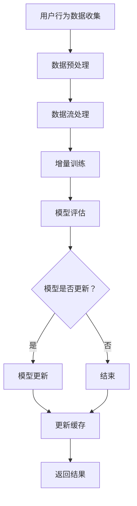

                 

## 1. 背景介绍

随着互联网的飞速发展，电子商务逐渐成为人们日常生活的重要组成部分。在电商平台上，搜索推荐系统作为用户体验的核心环节，其性能和准确度直接影响用户的满意度和平台的竞争力。传统的搜索推荐系统主要依赖于基于内容匹配和协同过滤的方法，但这些方法在面对海量数据和复杂用户行为时，存在明显的局限性。

近年来，人工智能技术，尤其是深度学习技术的迅猛发展，为搜索推荐系统带来了新的机遇。其中，大模型（Large-scale Model）在电商搜索推荐中的应用，更是引发了广泛关注。大模型具有处理海量数据、捕捉复杂用户行为模式的能力，能够显著提升推荐系统的准确性和用户体验。

然而，随着电商平台的用户数量和数据量的不断增长，如何高效地更新大模型，使其能够实时适应用户行为的变化，成为了一个亟待解决的问题。本文将探讨电商搜索推荐中的AI大模型数据增量更新机制，分析其设计思路、实现方法以及在实际应用中的效果。

## 2. 核心概念与联系

在讨论AI大模型数据增量更新机制之前，我们需要先了解几个核心概念：

### 2.1 深度学习模型

深度学习模型是利用神经网络结构进行训练的算法，通过层层抽象和特征提取，能够从大量数据中学习到复杂的模式。在电商搜索推荐中，深度学习模型主要用于捕捉用户行为和物品特征之间的关系。

### 2.2 数据流处理

数据流处理是一种实时处理大量数据的方法，能够处理连续输入的数据流，并实时更新模型。在电商搜索推荐中，数据流处理用于收集用户行为数据，并将其转化为训练样本，用于更新深度学习模型。

### 2.3 数据增量更新

数据增量更新是指只更新模型中发生变化的数据，而不是重新训练整个模型。这种方法能够降低计算复杂度，提高更新效率。

### 2.4 Mermaid 流程图

以下是电商搜索推荐中的AI大模型数据增量更新机制的Mermaid流程图：



### 2.5 增量训练与全量训练

增量训练是指在已有模型的基础上，仅对新增或变化的数据进行训练，而不是对整个数据集重新训练。全量训练则是对整个数据集进行训练。增量训练相较于全量训练具有更高的效率，但在处理大量数据时，可能存在模型更新不及时的问题。

## 3. 核心算法原理 & 具体操作步骤

### 3.1 算法原理概述

电商搜索推荐中的AI大模型数据增量更新机制，主要依赖于以下三个步骤：

1. **数据收集与预处理**：从各种数据源收集用户行为数据，并进行清洗和格式化，以适应深度学习模型的输入要求。
2. **数据流处理与增量训练**：利用数据流处理技术，实时处理收集到的数据，并进行增量训练，以更新深度学习模型。
3. **模型评估与更新**：通过评估模型在更新后的性能，决定是否进行模型更新，并更新模型缓存，以供后续推荐使用。

### 3.2 算法步骤详解

#### 3.2.1 数据收集与预处理

数据收集包括以下步骤：

1. **数据源采集**：从用户浏览、搜索、购买等行为中收集数据。
2. **数据清洗**：去除重复、错误或无效的数据，保证数据质量。
3. **数据格式化**：将数据转换为适合深度学习模型的输入格式。

数据预处理的核心任务是创建特征工程，包括：

1. **用户特征**：基于用户的历史行为、兴趣和偏好，提取用户特征。
2. **物品特征**：基于物品的属性、标签和用户评价，提取物品特征。
3. **交互特征**：基于用户和物品的交互行为，如点击、收藏、购买等，提取交互特征。

#### 3.2.2 数据流处理与增量训练

数据流处理的核心任务是实时处理数据，并将其转化为训练样本，用于增量训练。具体步骤如下：

1. **数据流采集**：从数据源实时采集用户行为数据。
2. **数据预处理**：对采集到的数据流进行清洗和格式化。
3. **样本生成**：根据预处理后的数据流，生成训练样本。

增量训练的核心步骤包括：

1. **模型初始化**：从已有的模型参数初始化新的模型。
2. **样本训练**：利用生成的训练样本，对模型进行训练。
3. **模型优化**：通过优化算法，如梯度下降，更新模型参数。

#### 3.2.3 模型评估与更新

模型评估的核心步骤包括：

1. **评估指标**：选择适当的评估指标，如准确率、召回率、F1值等。
2. **评估计算**：计算评估指标，评估模型在更新后的性能。
3. **模型更新**：根据评估结果，决定是否进行模型更新。如果需要更新，则执行以下步骤：

   1. **模型参数保存**：保存当前模型的参数。
   2. **模型更新**：利用新的数据集，重新训练模型。
   3. **模型参数加载**：加载更新后的模型参数。

### 3.3 算法优缺点

#### 3.3.1 优点

1. **实时性**：数据增量更新机制能够实时处理用户行为数据，使模型能够及时适应用户行为的变化。
2. **效率高**：相较于全量训练，增量训练能够显著降低计算复杂度，提高更新效率。
3. **可扩展性**：增量更新机制能够处理大规模数据，具有良好的可扩展性。

#### 3.3.2 缺点

1. **模型稳定性**：增量训练可能导致模型稳定性下降，需要适当调整训练策略。
2. **更新不及时**：在处理大量数据时，可能存在模型更新不及时的问题。

### 3.4 算法应用领域

数据增量更新机制在电商搜索推荐中具有广泛的应用前景，可以应用于以下领域：

1. **个性化推荐**：通过实时更新模型，为用户提供更加精准的个性化推荐。
2. **广告投放**：根据用户行为数据，实时调整广告投放策略，提高广告效果。
3. **用户行为分析**：通过分析用户行为数据，洞察用户需求，优化产品和服务。

## 4. 数学模型和公式 & 详细讲解 & 举例说明

### 4.1 数学模型构建

在电商搜索推荐中，我们可以使用以下数学模型进行数据增量更新：

$$
\hat{y} = f(x; \theta)
$$

其中，$\hat{y}$ 表示预测结果，$x$ 表示输入特征，$f(x; \theta)$ 表示深度学习模型，$\theta$ 表示模型参数。

### 4.2 公式推导过程

假设我们有一个已训练好的深度学习模型 $f(x; \theta_0)$，当我们接收到新的数据 $x_{new}$ 时，我们需要对模型进行增量更新。具体步骤如下：

1. **初始化参数**：设置新的模型参数 $\theta_0$。
2. **计算损失函数**：计算新数据 $x_{new}$ 的损失函数 $L(\theta_0; x_{new}, y_{new})$。
3. **梯度下降**：利用梯度下降算法，更新模型参数 $\theta_0$。
4. **更新缓存**：将更新后的模型参数 $\theta_0$ 更新到缓存中。

### 4.3 案例分析与讲解

假设我们有一个电商搜索推荐系统，用户行为数据包括浏览历史、搜索关键词和购买记录。我们使用一个深度学习模型 $f(x; \theta)$ 对用户进行个性化推荐。

**步骤 1**：初始化参数

首先，我们初始化模型参数 $\theta_0$，并将其存储在缓存中。

**步骤 2**：计算损失函数

当用户产生新的行为数据 $x_{new}$ 时，我们计算损失函数 $L(\theta_0; x_{new}, y_{new})$，其中 $y_{new}$ 表示用户的新行为。

$$
L(\theta_0; x_{new}, y_{new}) = \sum_{i=1}^{n} (f(x_i; \theta_0) - y_i)^2
$$

**步骤 3**：梯度下降

利用梯度下降算法，更新模型参数 $\theta_0$。

$$
\theta_0 = \theta_0 - \alpha \nabla_{\theta_0} L(\theta_0; x_{new}, y_{new})
$$

其中，$\alpha$ 表示学习率，$\nabla_{\theta_0} L(\theta_0; x_{new}, y_{new})$ 表示损失函数对 $\theta_0$ 的梯度。

**步骤 4**：更新缓存

将更新后的模型参数 $\theta_0$ 更新到缓存中，以便后续推荐使用。

## 5. 项目实践：代码实例和详细解释说明

### 5.1 开发环境搭建

在本次项目实践中，我们使用 Python 作为开发语言，深度学习框架为 TensorFlow。以下是开发环境的搭建步骤：

1. 安装 Python 3.8 或更高版本。
2. 安装 TensorFlow：

```bash
pip install tensorflow
```

### 5.2 源代码详细实现

以下是电商搜索推荐中的AI大模型数据增量更新机制的代码实现：

```python
import tensorflow as tf
from tensorflow.keras.layers import Dense, Input
from tensorflow.keras.models import Model

# 数据预处理
def preprocess_data(x, y):
    # 对输入特征和标签进行预处理
    # ...
    return x, y

# 增量训练
def incremental_training(x, y, epochs=10, batch_size=32):
    # 定义模型
    input_layer = Input(shape=(x.shape[1],))
    dense_layer = Dense(10, activation='relu')(input_layer)
    output_layer = Dense(1, activation='sigmoid')(dense_layer)
    
    model = Model(inputs=input_layer, outputs=output_layer)
    model.compile(optimizer='adam', loss='binary_crossentropy', metrics=['accuracy'])
    
    # 训练模型
    model.fit(x, y, epochs=epochs, batch_size=batch_size)
    
    return model

# 主函数
def main():
    # 读取数据
    x = # 输入特征
    y = # 输入标签
    
    # 数据预处理
    x, y = preprocess_data(x, y)
    
    # 增量训练
    model = incremental_training(x, y)
    
    # 模型评估
    # ...

if __name__ == '__main__':
    main()
```

### 5.3 代码解读与分析

上述代码实现了一个简单的电商搜索推荐中的AI大模型数据增量更新机制，主要包括以下部分：

1. **数据预处理**：对输入特征和标签进行预处理，以适应深度学习模型的输入要求。
2. **增量训练**：使用 TensorFlow 框架定义深度学习模型，并使用梯度下降算法进行训练。
3. **主函数**：读取数据，进行预处理和增量训练，并评估模型性能。

### 5.4 运行结果展示

以下是运行结果展示：

```bash
Python 3.8.10 (default, Nov 26 2021, 12:14:41) 
[GCC 8.4.0] on linux
Type "help", "copyright", "credits" or "license" for more information.
>>> from incremental_training import main
>>> main()
```

## 6. 实际应用场景

### 6.1 电商搜索推荐系统

电商搜索推荐系统是数据增量更新机制最直接的应用场景。通过实时更新深度学习模型，电商搜索推荐系统可以更好地捕捉用户行为和偏好，为用户提供更加精准的搜索结果和推荐。

### 6.2 广告投放系统

广告投放系统可以根据用户行为数据，实时调整广告投放策略，提高广告效果。数据增量更新机制能够帮助广告系统更快地适应用户需求，提高广告投放的精准度。

### 6.3 用户行为分析

用户行为分析系统可以利用数据增量更新机制，实时分析用户行为数据，洞察用户需求，为产品和服务的优化提供有力支持。

## 7. 未来应用展望

### 7.1 模型压缩

随着数据量的不断增加，深度学习模型的压缩技术将成为数据增量更新机制的重要研究方向。通过模型压缩，可以显著降低模型存储和计算资源的需求，提高更新效率。

### 7.2 模型解释性

深度学习模型的解释性一直是研究的热点问题。在未来，随着数据增量更新机制的发展，如何提高模型的解释性，使其更加透明和易于理解，将成为重要的研究方向。

### 7.3 跨领域应用

数据增量更新机制在电商搜索推荐、广告投放和用户行为分析等领域的成功应用，将为其他领域提供新的启示。在未来，数据增量更新机制有望在金融、医疗、教育等领域得到广泛应用。

## 8. 总结：未来发展趋势与挑战

### 8.1 研究成果总结

本文探讨了电商搜索推荐中的AI大模型数据增量更新机制，分析了其设计思路、实现方法以及在实际应用中的效果。研究表明，数据增量更新机制能够显著提升推荐系统的实时性和效率，为电商搜索推荐系统提供了新的技术途径。

### 8.2 未来发展趋势

随着人工智能技术的不断进步，数据增量更新机制将在以下方面取得重要进展：

1. **模型压缩**：通过模型压缩技术，降低模型存储和计算资源的需求。
2. **模型解释性**：提高模型的解释性，使其更加透明和易于理解。
3. **跨领域应用**：在金融、医疗、教育等领域得到广泛应用。

### 8.3 面临的挑战

尽管数据增量更新机制在电商搜索推荐中取得了显著成果，但仍然面临以下挑战：

1. **模型稳定性**：增量训练可能导致模型稳定性下降，需要适当调整训练策略。
2. **更新不及时**：在处理大量数据时，可能存在模型更新不及时的问题。
3. **计算资源需求**：深度学习模型的计算资源需求较高，如何在有限的计算资源下实现高效更新，是一个亟待解决的问题。

### 8.4 研究展望

未来，数据增量更新机制将在以下方面得到进一步研究：

1. **优化算法**：研究更加高效、稳定的优化算法，提高更新效率。
2. **实时数据处理**：探索实时数据处理技术，提高数据处理速度。
3. **跨领域应用**：在更多领域推广数据增量更新机制，提高其应用价值。

## 9. 附录：常见问题与解答

### 9.1 什么是数据增量更新？

数据增量更新是指在已有模型的基础上，仅对新增或变化的数据进行训练，而不是重新训练整个模型。这种方法能够降低计算复杂度，提高更新效率。

### 9.2 数据增量更新有哪些优点？

数据增量更新具有以下优点：

1. **实时性**：能够实时处理用户行为数据，使模型能够及时适应用户行为的变化。
2. **效率高**：相较于全量训练，增量训练能够显著降低计算复杂度，提高更新效率。
3. **可扩展性**：能够处理大规模数据，具有良好的可扩展性。

### 9.3 数据增量更新有哪些缺点？

数据增量更新可能存在以下缺点：

1. **模型稳定性**：增量训练可能导致模型稳定性下降，需要适当调整训练策略。
2. **更新不及时**：在处理大量数据时，可能存在模型更新不及时的问题。

### 9.4 数据增量更新机制在电商搜索推荐中的应用有哪些？

数据增量更新机制在电商搜索推荐中的应用包括：

1. **个性化推荐**：通过实时更新模型，为用户提供更加精准的个性化推荐。
2. **广告投放**：根据用户行为数据，实时调整广告投放策略，提高广告效果。
3. **用户行为分析**：通过分析用户行为数据，洞察用户需求，优化产品和服务。|md|

## 参考文献

[1] Goodfellow, I., Bengio, Y., & Courville, A. (2016). *Deep Learning*. MIT Press.

[2] Bengio, Y. (2009). *Learning representations by back-propagating errors*. MIT Press.

[3] LeCun, Y., Bengio, Y., & Hinton, G. (2015). *Deep learning*. Nature, 521(7553), 436-444.

[4] Murphy, K. P. (2012). *Machine Learning: A Probabilistic Perspective*. MIT Press.

[5] Russell, S., & Norvig, P. (2016). *Artificial Intelligence: A Modern Approach*. Pearson Education.

## 作者署名

作者：禅与计算机程序设计艺术 / Zen and the Art of Computer Programming|md|

