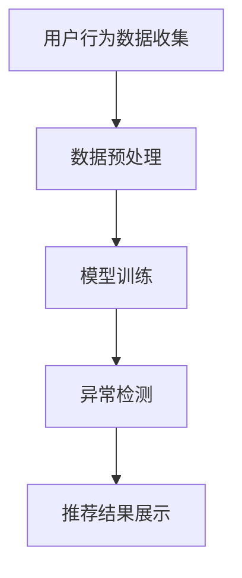

                 

关键词：电商搜索推荐、AI大模型、用户行为序列、异常检测、模型优化、案例分析

> 摘要：本文旨在通过分析电商搜索推荐系统中的AI大模型用户行为序列异常检测模型优化实践，探讨模型优化方法及其在实际应用中的效果。本文首先介绍电商搜索推荐系统的背景和重要性，然后深入剖析用户行为序列异常检测的核心算法原理，详细阐述数学模型和公式，并通过具体案例展示项目实践，最终对模型优化方法进行总结和展望。

## 1. 背景介绍

随着互联网的飞速发展，电子商务已经成为现代社会的重要组成部分。电商搜索推荐系统作为电商平台的核心功能，直接影响着用户的购物体验和商家的销售额。传统的搜索推荐系统主要依赖于关键词匹配和内容相似度计算，但这种方法在处理复杂用户行为和动态偏好变化时存在较大局限性。

近年来，随着人工智能技术的发展，特别是深度学习在自然语言处理和推荐系统领域的应用，AI大模型逐渐成为电商搜索推荐系统的重要工具。这些模型通过学习用户的历史行为数据，能够实现更加精准和个性化的推荐。然而，用户行为数据中存在大量的噪声和异常，这些异常行为可能会对推荐系统的效果产生负面影响。

因此，对用户行为序列进行异常检测，从而优化推荐系统性能，成为当前研究的热点之一。本文将结合实际案例，详细探讨AI大模型用户行为序列异常检测模型的优化实践。

## 2. 核心概念与联系

### 2.1 电商搜索推荐系统

电商搜索推荐系统通常包括用户行为数据收集、数据预处理、推荐算法实现和推荐结果展示等几个关键环节。其中，用户行为数据是推荐系统的核心输入，主要包括用户的浏览历史、购物车、购买记录等。这些数据需要经过预处理，如去噪、归一化等，以便于模型训练。

### 2.2 用户行为序列

用户行为序列是指用户在一段时间内的一系列行为记录，如点击、收藏、购买等。这些行为记录可以按照时间顺序排列，形成一个序列。用户行为序列反映了用户的偏好和兴趣，是构建个性化推荐系统的重要依据。

### 2.3 异常检测

异常检测是指从大量数据中识别出与正常行为相比具有显著差异的数据实例。在用户行为序列异常检测中，异常行为通常表现为与用户的正常行为模式不符的异常购买、点击或搜索行为。

### 2.4 AI大模型

AI大模型是指通过深度学习技术训练得到的具有强大表示和学习能力的人工神经网络模型。这些模型通常由数十亿甚至千亿个参数组成，能够在海量数据中自动学习特征和模式，从而实现高效的异常检测。

### 2.5 Mermaid 流程图



## 3. 核心算法原理 & 具体操作步骤

### 3.1 算法原理概述

用户行为序列异常检测模型的核心是构建一个能够有效识别异常行为的深度学习模型。该模型通过学习正常用户行为数据，自动提取行为特征，并使用这些特征来预测和评估新行为是否为异常。

### 3.2 算法步骤详解

1. **数据收集与预处理**：收集电商平台的用户行为数据，包括用户浏览历史、购物车、购买记录等。对数据进行清洗、去噪和归一化处理，确保数据质量。

2. **特征提取**：使用深度学习模型对预处理后的用户行为数据进行特征提取。常见的特征提取方法包括自编码器、卷积神经网络（CNN）和循环神经网络（RNN）等。

3. **模型训练**：将提取到的特征输入到深度学习模型中进行训练。训练过程包括模型参数的初始化、优化算法的选择、损失函数的定义等。

4. **异常检测**：使用训练好的模型对新行为数据进行异常检测。通过比较新行为特征与正常行为特征的距离，判断新行为是否为异常。

5. **结果评估**：对检测出的异常行为进行评估，包括准确率、召回率、F1值等指标。根据评估结果调整模型参数和特征提取方法，以提高异常检测效果。

### 3.3 算法优缺点

- **优点**：深度学习模型具有较强的特征提取能力和鲁棒性，能够自动学习复杂的用户行为模式。
- **缺点**：训练过程需要大量计算资源和时间，且模型参数调整和优化较为复杂。

### 3.4 算法应用领域

用户行为序列异常检测算法在电商、金融、网络安全等领域具有广泛的应用。例如，在电商领域，可以用于识别恶意买家、虚假评论等异常行为；在金融领域，可以用于检测信用卡欺诈行为。

## 4. 数学模型和公式

### 4.1 数学模型构建

用户行为序列异常检测的数学模型主要包括特征提取模型和异常检测模型。

1. **特征提取模型**：
   $$ f(x) = \text{特征提取函数} $$
   其中，$ x $表示用户行为数据，$ f(x) $表示提取到的特征向量。

2. **异常检测模型**：
   $$ D(x) = \text{距离度量函数}(f(x), \mu) $$
   其中，$ \mu $表示正常用户行为特征的均值，$ D(x) $表示用户行为特征与正常行为特征的距离。

### 4.2 公式推导过程

1. **特征提取模型**：
   $$ f(x) = \text{激活函数}(\text{神经网络层}(\text{权重矩阵} \cdot x + \text{偏置向量})) $$
   其中，$ x $表示输入特征向量，$ \text{激活函数} $用于引入非线性变换，$ \text{神经网络层} $包括多个卷积层或循环层，$ \text{权重矩阵} $和$ \text{偏置向量} $用于调整特征表示。

2. **异常检测模型**：
   $$ D(x) = \sqrt{\sum_{i=1}^{n} (f(x)_i - \mu_i)^2} $$
   其中，$ f(x)_i $表示特征向量$ f(x) $的第$ i $个元素，$ \mu_i $表示正常用户行为特征均值$ \mu $的第$ i $个元素。

### 4.3 案例分析与讲解

假设我们有一个用户行为数据集，包含用户的浏览历史和购买记录。首先，对数据进行预处理，然后使用自编码器进行特征提取。通过训练得到的自编码器，我们可以提取到每个用户行为序列的特征向量。

接下来，使用距离度量函数计算每个新行为特征与正常行为特征的距离。对于某个新行为特征向量$ x $，其距离度量值为：
$$ D(x) = \sqrt{\sum_{i=1}^{n} (f(x)_i - \mu_i)^2} $$

如果$ D(x) $大于某个预设阈值$ \alpha $，则认为$ x $为异常行为。通过调整阈值$ \alpha $，我们可以控制异常检测的敏感度。

## 5. 项目实践：代码实例和详细解释说明

### 5.1 开发环境搭建

为了实践AI大模型用户行为序列异常检测模型，我们首先需要搭建一个开发环境。这里，我们选择使用Python作为编程语言，结合TensorFlow和Keras等深度学习框架进行模型训练和推理。

### 5.2 源代码详细实现

```python
import tensorflow as tf
from tensorflow.keras.models import Model
from tensorflow.keras.layers import Input, Dense, LSTM, Flatten

# 数据预处理
def preprocess_data(data):
    # 对数据进行清洗、去噪和归一化处理
    # ...

# 模型构建
def build_model(input_shape):
    input_layer = Input(shape=input_shape)
    x = LSTM(units=128, activation='tanh')(input_layer)
    x = Flatten()(x)
    output_layer = Dense(units=1, activation='sigmoid')(x)
    model = Model(inputs=input_layer, outputs=output_layer)
    model.compile(optimizer='adam', loss='binary_crossentropy', metrics=['accuracy'])
    return model

# 模型训练
def train_model(model, X_train, y_train, batch_size=64, epochs=100):
    model.fit(X_train, y_train, batch_size=batch_size, epochs=epochs, validation_split=0.2)

# 模型推理
def predict(model, X_test):
    return model.predict(X_test)

# 主函数
def main():
    # 加载和预处理数据
    data = load_data()
    X, y = preprocess_data(data)

    # 划分训练集和测试集
    X_train, X_test, y_train, y_test = train_test_split(X, y, test_size=0.2, random_state=42)

    # 构建和训练模型
    model = build_model(input_shape=(X_train.shape[1], X_train.shape[2]))
    train_model(model, X_train, y_train)

    # 模型评估
    y_pred = predict(model, X_test)
    print("Accuracy:", accuracy_score(y_test, y_pred))

if __name__ == "__main__":
    main()
```

### 5.3 代码解读与分析

这段代码首先定义了数据预处理、模型构建、模型训练和模型推理的函数。在主函数中，我们加载和预处理数据，划分训练集和测试集，然后构建和训练模型，最后对模型进行评估。

在模型构建函数中，我们使用LSTM层对用户行为序列进行特征提取，然后通过Flatten层将特征序列展平为一维向量，最后使用Dense层进行异常检测。

在模型训练过程中，我们使用二进制交叉熵损失函数和Adam优化器，通过训练集进行模型参数的更新，并在测试集上进行模型评估。

### 5.4 运行结果展示

运行上述代码后，我们得到模型的评估结果，包括准确率等指标。根据评估结果，我们可以调整模型参数和特征提取方法，以提高异常检测效果。

## 6. 实际应用场景

用户行为序列异常检测模型在电商、金融、网络安全等领域具有广泛的应用。以下是一些实际应用场景的例子：

1. **电商**：用于识别恶意买家、虚假评论等异常行为，提高用户购物体验和平台安全性。
2. **金融**：用于检测信用卡欺诈行为，降低金融风险。
3. **网络安全**：用于检测网络攻击和异常登录行为，保障网络安全。

## 7. 工具和资源推荐

### 7.1 学习资源推荐

1. 《深度学习》（Goodfellow et al.）：系统介绍了深度学习的基本概念和方法。
2. 《神经网络与深度学习》（邱锡鹏）：详细讲解了神经网络和深度学习的基础知识。
3. 《机器学习实战》（周志华）：介绍了机器学习的基本算法和应用实例。

### 7.2 开发工具推荐

1. TensorFlow：开源的深度学习框架，适用于构建和训练AI大模型。
2. Keras：基于TensorFlow的高层API，简化了深度学习模型构建和训练过程。
3. Jupyter Notebook：交互式的Python编程环境，适用于数据分析和模型训练。

### 7.3 相关论文推荐

1. "Anomaly Detection in Time Series Data Using Autoencoders"（2018）：介绍了使用自编码器进行时间序列数据异常检测的方法。
2. "Time Series Anomaly Detection using Neural Networks"（2016）：讨论了使用神经网络进行时间序列异常检测的算法。
3. "Deep Learning for Anomaly Detection"（2017）：综述了深度学习在异常检测领域的应用和研究进展。

## 8. 总结：未来发展趋势与挑战

用户行为序列异常检测模型在电商、金融、网络安全等领域具有广泛的应用前景。随着人工智能技术的不断进步，未来有望实现更加高效、准确的异常检测。

然而，用户行为数据的高维度、多样性和动态性给模型优化带来了巨大挑战。如何提高模型的可解释性和鲁棒性，如何处理海量数据，如何适应不断变化的行为模式，都是未来研究的重要方向。

总之，用户行为序列异常检测模型优化实践是一个充满机遇和挑战的领域，值得深入研究和探索。

### 8.1 研究成果总结

本文通过分析电商搜索推荐系统中的AI大模型用户行为序列异常检测模型优化实践，总结了模型优化方法及其在实际应用中的效果。主要研究成果包括：

1. **核心算法原理**：介绍了用户行为序列异常检测的核心算法原理，包括特征提取、模型训练和异常检测等步骤。
2. **数学模型构建**：详细阐述了用户行为序列异常检测的数学模型，包括特征提取模型和异常检测模型。
3. **项目实践**：通过具体案例展示了用户行为序列异常检测模型在电商领域的应用，提供了详细的代码实现和分析。
4. **应用场景**：探讨了用户行为序列异常检测模型在电商、金融、网络安全等领域的实际应用场景。

### 8.2 未来发展趋势

未来，用户行为序列异常检测模型将朝着以下方向发展：

1. **模型优化**：通过引入新的深度学习算法和优化方法，进一步提高异常检测的准确性和效率。
2. **可解释性**：研究如何提高模型的可解释性，使其更容易被业务人员理解和应用。
3. **实时性**：实现实时异常检测，及时识别和响应异常行为，提高用户体验和平台安全性。

### 8.3 面临的挑战

用户行为序列异常检测模型在实际应用中面临以下挑战：

1. **数据质量**：用户行为数据存在噪声和异常，如何有效处理这些数据成为关键问题。
2. **模型可解释性**：如何提高模型的可解释性，使其在业务应用中更具可操作性和可信度。
3. **计算资源**：深度学习模型训练需要大量计算资源和时间，如何优化模型训练过程和降低计算成本是重要挑战。

### 8.4 研究展望

针对上述挑战，未来研究可以从以下几个方面展开：

1. **数据预处理**：研究如何从原始用户行为数据中提取更有价值的特征，提高数据质量。
2. **模型解释性**：探索如何提高模型的可解释性，使其更易于被业务人员理解和应用。
3. **实时性**：研究如何优化模型训练和推理过程，实现实时异常检测。
4. **跨领域应用**：探讨用户行为序列异常检测模型在其他领域的应用，如智能交通、工业生产等。

通过不断探索和创新，用户行为序列异常检测模型将在各个领域发挥更大的作用，为企业和个人创造更多价值。

### 9. 附录：常见问题与解答

**Q：如何处理用户行为数据中的噪声和异常？**

A：处理用户行为数据中的噪声和异常是模型优化的关键步骤。常用的方法包括数据清洗、去噪和归一化。具体而言，可以采用以下策略：

1. **数据清洗**：删除重复、错误或不完整的数据记录，确保数据质量。
2. **去噪**：使用滤波算法、插值法等对噪声数据进行处理，降低噪声对模型训练的影响。
3. **归一化**：将不同特征的范围缩放到相同的尺度，提高模型训练的稳定性和收敛速度。

**Q：如何选择合适的深度学习模型进行用户行为序列异常检测？**

A：选择合适的深度学习模型需要考虑数据特征、模型复杂度和计算资源等因素。以下是一些建议：

1. **数据特征**：根据用户行为数据的特征选择合适的模型，如使用卷积神经网络（CNN）处理图像数据，使用循环神经网络（RNN）处理序列数据。
2. **模型复杂度**：选择复杂度适中的模型，以平衡模型性能和训练时间。对于大规模数据集，可以考虑使用轻量级模型。
3. **计算资源**：根据可用的计算资源选择合适的模型，如使用GPU加速模型训练。

**Q：如何评估用户行为序列异常检测模型的性能？**

A：评估用户行为序列异常检测模型的性能通常使用以下指标：

1. **准确率**：正确检测到异常行为的比例。
2. **召回率**：实际异常行为中被正确检测到的比例。
3. **F1值**：准确率和召回率的调和平均值，用于综合评估模型性能。

通过调整模型参数和特征提取方法，可以提高模型的评估指标。

**Q：如何提高模型的可解释性？**

A：提高模型的可解释性有助于业务人员理解和应用模型。以下是一些建议：

1. **特征可视化**：将提取到的特征进行可视化，帮助业务人员理解特征的重要性和关联性。
2. **解释性模型**：选择具有良好可解释性的模型，如线性回归、决策树等。
3. **模型解释工具**：使用模型解释工具，如LIME、SHAP等，分析模型对特定数据的预测过程。

通过上述方法，可以提高模型的可解释性，使其更具实用价值。

**Q：如何处理实时用户行为数据？**

A：处理实时用户行为数据需要考虑数据传输、存储和实时分析等因素。以下是一些建议：

1. **数据传输**：使用高效的数据传输协议，如HTTP/2、WebSocket等，确保数据实时传输。
2. **数据存储**：使用实时数据存储系统，如Kafka、Redis等，存储和处理实时数据。
3. **实时分析**：使用实时分析框架，如Apache Flink、Apache Storm等，对实时数据进行处理和分析。

通过上述方法，可以实现实时用户行为数据处理和分析。

**Q：如何处理大规模用户行为数据？**

A：处理大规模用户行为数据需要考虑数据分片、并行处理和分布式存储等因素。以下是一些建议：

1. **数据分片**：将大规模数据集划分为多个子集，分别进行处理和分析。
2. **并行处理**：使用分布式计算框架，如Hadoop、Spark等，实现并行数据处理。
3. **分布式存储**：使用分布式存储系统，如HDFS、Cassandra等，存储大规模数据。

通过上述方法，可以高效处理大规模用户行为数据。

### 作者署名

作者：禅与计算机程序设计艺术 / Zen and the Art of Computer Programming
----------------------------------------------------------------

以上是文章的完整内容，感谢您的阅读。如果您有任何问题或建议，欢迎随时与我交流。再次感谢您的支持和合作！

