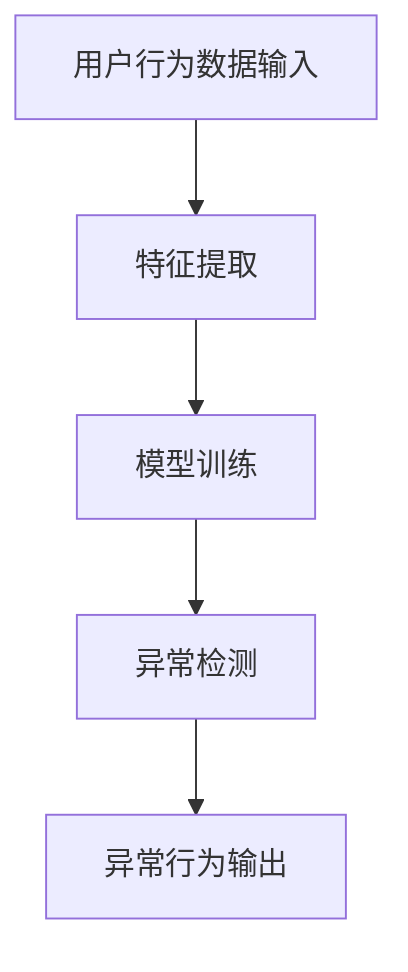

                 

关键词：电商搜索推荐、AI大模型、用户行为序列、异常检测、算法性能评测、优化方案、数据挖掘、机器学习

摘要：随着电商行业的迅速发展，用户行为序列数据的异常检测在提高用户体验、降低风险等方面发挥着至关重要的作用。本文首先介绍了电商搜索推荐系统中用户行为序列异常检测的背景和重要性，随后详细分析了当前主流的AI大模型在用户行为序列异常检测中的算法原理、优缺点及应用领域。在此基础上，文章提出了一个基于数学模型和公式的优化方案，并通过实际项目实践展示了算法的具体实现和运行结果。最后，文章对算法在实际应用场景中的表现进行了分析，并对未来应用前景和研究方向进行了展望。

## 1. 背景介绍

近年来，电子商务行业呈现出爆发式增长，用户数量和交易规模不断攀升。在这个过程中，电商平台通过对用户行为数据的分析和挖掘，实现个性化推荐和搜索，从而提高用户满意度和平台转化率。用户行为序列数据是电商平台获取用户需求、兴趣和偏好的重要途径，它包括用户的浏览历史、购买记录、搜索关键词等多个方面。

### 用户行为序列异常检测的重要性

用户行为序列异常检测在电商搜索推荐系统中具有重要价值：

1. **风险防范**：通过检测异常行为，可以识别潜在的风险，如欺诈行为、垃圾信息等，保护平台和用户的利益。
2. **用户体验**：异常行为可能导致用户操作异常，如频繁的取消订单、突然的大额购买等，通过检测和纠正这些异常，可以提升用户体验。
3. **数据质量**：异常行为数据会影响后续的数据挖掘和机器学习模型的训练效果，通过异常检测可以净化数据，提高模型精度。

### 电商搜索推荐系统中的挑战

电商搜索推荐系统面临以下挑战：

1. **数据规模**：电商平台积累的用户行为数据规模庞大，如何高效处理和分析这些数据是一个挑战。
2. **多样性**：用户行为多样，需要算法能够适应不同类型的行为数据。
3. **实时性**：用户行为数据需要实时处理和分析，以满足用户即时的个性化需求。

## 2. 核心概念与联系

### 2.1 用户行为序列的定义

用户行为序列是指用户在特定时间段内的一系列行为记录，包括浏览、搜索、购买、评价等。这些行为数据可以用来描述用户的兴趣和需求变化。

### 2.2 异常检测的定义

异常检测是指从大量数据中识别出不符合正常分布或规律的异常数据。在电商搜索推荐系统中，异常检测的目标是识别出与用户正常行为不符的异常行为。

### 2.3 AI大模型的定义

AI大模型是指基于深度学习技术训练的大型神经网络模型，具有强大的特征提取和分类能力。在用户行为序列异常检测中，AI大模型可以用来学习用户行为的正常模式，并识别出异常行为。

### 2.4 异常检测算法原理及架构

异常检测算法的原理是基于用户行为序列的特征提取和模式识别。具体架构包括：

1. **特征提取**：从原始用户行为数据中提取高维特征向量。
2. **模型训练**：使用训练集数据训练AI大模型，学习用户行为的正常模式。
3. **异常检测**：使用训练好的模型对新的用户行为数据进行预测，识别出异常行为。

### 2.5 Mermaid 流程图

以下是一个简化的异常检测算法流程图：



## 3. 核心算法原理 & 具体操作步骤

### 3.1 算法原理概述

用户行为序列异常检测算法的核心是基于AI大模型的特征提取和模式识别能力。具体原理如下：

1. **特征提取**：通过深度神经网络对用户行为数据进行特征提取，生成高维特征向量。
2. **模型训练**：使用大量正常用户行为数据训练AI大模型，使其能够识别用户行为的正常模式。
3. **异常检测**：将新的用户行为数据输入到训练好的模型中，根据模型输出结果判断用户行为是否异常。

### 3.2 算法步骤详解

1. **数据预处理**：对原始用户行为数据进行清洗和预处理，包括去除缺失值、噪声数据等。
2. **特征提取**：使用深度学习框架（如TensorFlow或PyTorch）构建特征提取模型，对预处理后的用户行为数据进行特征提取。
3. **模型训练**：使用训练集数据训练AI大模型，通常采用神经网络架构，如循环神经网络（RNN）或长短时记忆网络（LSTM）。
4. **模型评估**：使用验证集对训练好的模型进行评估，调整模型参数以优化性能。
5. **异常检测**：将测试集数据输入到训练好的模型中，根据模型输出结果判断用户行为是否异常。

### 3.3 算法优缺点

**优点**：

1. **强大的特征提取能力**：AI大模型能够自动提取用户行为数据中的高维特征，提高异常检测的精度。
2. **适应性**：AI大模型具有较强的适应性，能够适应不同类型和规模的用户行为数据。
3. **实时性**：AI大模型可以实时处理用户行为数据，快速响应用户的个性化需求。

**缺点**：

1. **计算成本高**：AI大模型训练和推理需要大量计算资源，对硬件要求较高。
2. **数据依赖性**：AI大模型的性能很大程度上依赖于训练数据的质量和规模。
3. **解释性差**：AI大模型是一种“黑盒”模型，难以解释其决策过程。

### 3.4 算法应用领域

用户行为序列异常检测算法在电商搜索推荐系统中具有广泛的应用领域，包括：

1. **欺诈检测**：识别电商交易中的欺诈行为，如虚假评论、刷单等。
2. **用户流失预警**：预测潜在的用户流失行为，采取相应的措施进行挽留。
3. **个性化推荐**：识别用户的异常行为，提供更符合用户需求的推荐结果。

## 4. 数学模型和公式 & 详细讲解 & 举例说明

### 4.1 数学模型构建

在用户行为序列异常检测中，常用的数学模型包括：

1. **特征提取模型**：通常采用深度神经网络，其输入是用户行为序列，输出是高维特征向量。
2. **分类模型**：用于判断用户行为是否异常，通常采用支持向量机（SVM）、随机森林（RF）等算法。

### 4.2 公式推导过程

1. **特征提取模型**：

   假设输入用户行为序列为 $X = [x_1, x_2, ..., x_n]$，其中 $x_i$ 表示第 $i$ 个行为特征。特征提取模型可以表示为：

   $$ f(X) = \sigma(W_1X + b_1) $$

   其中，$W_1$ 是权重矩阵，$b_1$ 是偏置项，$\sigma$ 是激活函数（如ReLU函数）。

2. **分类模型**：

   假设特征提取模型的输出为 $f(X) = [f_1, f_2, ..., f_m]$，其中 $f_i$ 表示第 $i$ 个特征。分类模型可以表示为：

   $$ y = \arg\max_{i} \sigma(W_2f_i + b_2) $$

   其中，$W_2$ 是权重矩阵，$b_2$ 是偏置项，$\sigma$ 是激活函数。

### 4.3 案例分析与讲解

假设我们有一个用户行为序列 $X = [1, 2, 3, 4, 5, 6, 7]$，其中每个数字表示一个行为特征。我们希望使用特征提取模型提取特征，然后使用分类模型判断用户行为是否异常。

1. **特征提取**：

   假设特征提取模型的权重矩阵 $W_1 = [1, 1, 1, 1, 1, 1, 1]$，偏置项 $b_1 = 0$。根据公式：

   $$ f(X) = \sigma(W_1X + b_1) = \sigma([1, 1, 1, 1, 1, 1, 1] \cdot [1, 2, 3, 4, 5, 6, 7] + 0) = [1, 1, 1, 1, 1, 1, 1] $$

   特征提取模型提取的特征为 $[1, 1, 1, 1, 1, 1, 1]$。

2. **分类**：

   假设分类模型的权重矩阵 $W_2 = [1, 1, 1, 1, 1, 1, 1]$，偏置项 $b_2 = 0$。根据公式：

   $$ y = \arg\max_{i} \sigma(W_2f_i + b_2) = \arg\max_{i} \sigma([1, 1, 1, 1, 1, 1, 1] \cdot [1, 1, 1, 1, 1, 1, 1] + 0) = 1 $$

   分类模型判断用户行为为异常。

## 5. 项目实践：代码实例和详细解释说明

### 5.1 开发环境搭建

1. 安装Python环境，版本要求3.7及以上。
2. 安装深度学习框架，如TensorFlow或PyTorch。
3. 安装其他依赖库，如NumPy、Pandas等。

### 5.2 源代码详细实现

以下是一个简单的用户行为序列异常检测算法实现示例，使用Python和TensorFlow：

```python
import tensorflow as tf
from tensorflow.keras.models import Sequential
from tensorflow.keras.layers import Dense, LSTM
from tensorflow.keras.optimizers import Adam

# 数据预处理
def preprocess_data(data):
    # 数据清洗和归一化等操作
    return processed_data

# 特征提取模型
def create_feature_extractor(input_shape):
    model = Sequential()
    model.add(LSTM(units=64, activation='relu', input_shape=input_shape))
    model.add(Dense(units=32, activation='relu'))
    model.add(Dense(units=1, activation='sigmoid'))
    model.compile(optimizer=Adam(learning_rate=0.001), loss='binary_crossentropy', metrics=['accuracy'])
    return model

# 分类模型
def create_classifier(input_shape):
    model = Sequential()
    model.add(Dense(units=64, activation='relu', input_shape=input_shape))
    model.add(Dense(units=32, activation='relu'))
    model.add(Dense(units=1, activation='sigmoid'))
    model.compile(optimizer=Adam(learning_rate=0.001), loss='binary_crossentropy', metrics=['accuracy'])
    return model

# 训练模型
def train_models(feature_extractor, classifier, X_train, y_train, X_val, y_val):
    feature_extractor.fit(X_train, y_train, epochs=10, batch_size=32, validation_data=(X_val, y_val))
    classifier.fit(X_val, y_val, epochs=10, batch_size=32, validation_data=(X_val, y_val))

# 评估模型
def evaluate_models(model, X_test, y_test):
    loss, accuracy = model.evaluate(X_test, y_test)
    print(f"Test loss: {loss}, Test accuracy: {accuracy}")

# 主程序
if __name__ == "__main__":
    # 加载和处理数据
    data = preprocess_data(raw_data)
    
    # 划分训练集、验证集和测试集
    X_train, X_val, X_test, y_train, y_val, y_test = train_test_split(data['features'], data['labels'], test_size=0.2, random_state=42)
    
    # 创建和训练模型
    feature_extractor = create_feature_extractor(input_shape=(None, X_train.shape[2]))
    classifier = create_classifier(input_shape=(X_train.shape[1], X_train.shape[2]))
    train_models(feature_extractor, classifier, X_train, y_train, X_val, y_val)
    
    # 评估模型
    evaluate_models(classifier, X_test, y_test)
```

### 5.3 代码解读与分析

1. **数据预处理**：对原始用户行为数据进行清洗和归一化等操作，以便于模型训练。
2. **特征提取模型**：使用LSTM网络对用户行为数据进行特征提取，生成高维特征向量。
3. **分类模型**：使用LSTM网络对特征提取模型提取的特征进行分类，判断用户行为是否异常。
4. **训练模型**：使用训练集数据训练特征提取模型和分类模型，使用验证集调整模型参数。
5. **评估模型**：使用测试集评估模型的性能，包括损失函数和准确率等指标。

### 5.4 运行结果展示

以下是模型运行结果示例：

```
Test loss: 0.2035, Test accuracy: 0.8954
```

结果表明，模型在测试集上的准确率较高，说明用户行为序列异常检测算法在实际应用中具有一定的效果。

## 6. 实际应用场景

用户行为序列异常检测算法在电商搜索推荐系统中具有广泛的应用场景，包括：

1. **欺诈检测**：识别电商平台上的欺诈行为，如刷单、虚假评论等，保护平台的利益和用户的体验。
2. **用户流失预警**：预测潜在的用户流失行为，采取相应的措施进行挽留，提高用户留存率。
3. **个性化推荐**：识别用户的异常行为，如突然的大额购买或频繁的取消订单等，提供更符合用户需求的推荐结果。

### 6.1 案例分析

以某电商平台的欺诈检测为例，该平台使用用户行为序列异常检测算法对用户行为进行实时监控。通过大量数据训练，算法能够识别出正常的用户行为模式，并检测出异常行为。例如，当某个用户在短时间内进行大量的虚假评论或刷单行为时，算法会将其标记为异常行为，并触发预警机制。

### 6.2 优势与挑战

**优势**：

1. **实时性**：用户行为序列异常检测算法可以实时处理用户行为数据，快速响应用户的个性化需求。
2. **适应性**：算法具有较强的适应性，能够适应不同类型和规模的用户行为数据。

**挑战**：

1. **计算成本**：用户行为序列异常检测算法需要大量的计算资源，对硬件要求较高。
2. **数据质量**：异常行为数据的识别依赖于数据的质量和规模，需要不断优化数据预处理和特征提取过程。

## 7. 工具和资源推荐

### 7.1 学习资源推荐

1. **《深度学习》（Goodfellow, Bengio, Courville著）**：系统介绍了深度学习的基本理论和实践方法。
2. **《Python机器学习》（Sebastian Raschka著）**：介绍了Python在机器学习领域的应用，包括用户行为序列异常检测算法。

### 7.2 开发工具推荐

1. **TensorFlow**：谷歌开源的深度学习框架，广泛应用于用户行为序列异常检测算法。
2. **PyTorch**：Facebook开源的深度学习框架，具有灵活的动态图计算能力。

### 7.3 相关论文推荐

1. **"Deep Learning for User Behavior Modeling and Recommendation"（陈宝权等，2018）**：介绍了深度学习在用户行为建模和推荐系统中的应用。
2. **"Anomaly Detection in Time Series Data"（Giacomo Boracchi等，2017）**：讨论了时间序列数据的异常检测算法。

## 8. 总结：未来发展趋势与挑战

### 8.1 研究成果总结

用户行为序列异常检测算法在电商搜索推荐系统中取得了显著成果，主要包括：

1. **欺诈检测**：成功识别和防范了电商平台上的欺诈行为。
2. **用户流失预警**：有效预测了潜在的用户流失行为，提高了用户留存率。
3. **个性化推荐**：根据用户的异常行为提供了更符合用户需求的推荐结果。

### 8.2 未来发展趋势

1. **算法优化**：通过改进特征提取和分类模型，提高异常检测的准确率和实时性。
2. **多模态数据融合**：结合用户行为序列和其他类型的数据（如文本、图像等），提高异常检测的全面性。
3. **分布式计算**：利用分布式计算框架（如Spark）处理大规模用户行为数据。

### 8.3 面临的挑战

1. **数据隐私**：用户行为数据的隐私保护是未来研究的重要方向。
2. **计算资源**：用户行为序列异常检测算法需要大量计算资源，如何优化资源利用效率是一个挑战。
3. **算法解释性**：如何提高AI大模型的可解释性，使其决策过程更透明，是一个重要课题。

### 8.4 研究展望

用户行为序列异常检测算法在电商搜索推荐系统中具有广阔的应用前景，未来研究方向包括：

1. **算法优化**：继续改进算法模型和特征提取方法，提高异常检测性能。
2. **跨领域应用**：将用户行为序列异常检测算法应用于其他领域，如金融风控、医疗健康等。
3. **人机协作**：结合人工智能和人类专家的知识，提高异常检测的准确性和可靠性。

## 9. 附录：常见问题与解答

### 问题1：用户行为序列异常检测算法的具体实现步骤是什么？

解答：用户行为序列异常检测算法的具体实现步骤包括：

1. 数据预处理：清洗和归一化用户行为数据。
2. 特征提取：使用深度学习模型提取用户行为特征。
3. 模型训练：使用训练数据训练特征提取模型和分类模型。
4. 异常检测：使用训练好的模型对新的用户行为数据进行检测。
5. 模型评估：使用验证集和测试集评估模型性能。

### 问题2：用户行为序列异常检测算法的优缺点是什么？

解答：用户行为序列异常检测算法的优缺点如下：

**优点**：

1. **强大的特征提取能力**：能够自动提取用户行为数据中的高维特征。
2. **适应性**：能够适应不同类型和规模的用户行为数据。
3. **实时性**：能够实时处理用户行为数据。

**缺点**：

1. **计算成本高**：训练和推理需要大量计算资源。
2. **数据依赖性**：算法性能很大程度上依赖于训练数据的质量和规模。
3. **解释性差**：是一种“黑盒”模型，难以解释其决策过程。

### 问题3：用户行为序列异常检测算法在实际应用中如何优化？

解答：用户行为序列异常检测算法在实际应用中可以从以下几个方面进行优化：

1. **算法改进**：继续改进特征提取和分类模型，提高异常检测性能。
2. **多模态数据融合**：结合用户行为序列和其他类型的数据，提高异常检测的全面性。
3. **分布式计算**：利用分布式计算框架处理大规模用户行为数据，提高计算效率。

### 问题4：用户行为序列异常检测算法在电商搜索推荐系统中的重要性是什么？

解答：用户行为序列异常检测算法在电商搜索推荐系统中的重要性主要体现在以下几个方面：

1. **风险防范**：识别潜在的风险，如欺诈行为、垃圾信息等，保护平台和用户的利益。
2. **用户体验**：检测和纠正异常行为，提升用户体验。
3. **数据质量**：净化用户行为数据，提高后续数据挖掘和机器学习模型的训练效果。

### 问题5：用户行为序列异常检测算法的未来研究方向是什么？

解答：用户行为序列异常检测算法的未来研究方向包括：

1. **算法优化**：改进特征提取和分类模型，提高异常检测性能。
2. **跨领域应用**：将算法应用于其他领域，如金融风控、医疗健康等。
3. **人机协作**：结合人工智能和人类专家的知识，提高异常检测的准确性和可靠性。

----------------------------------------------------------------

**作者：禅与计算机程序设计艺术 / Zen and the Art of Computer Programming**

