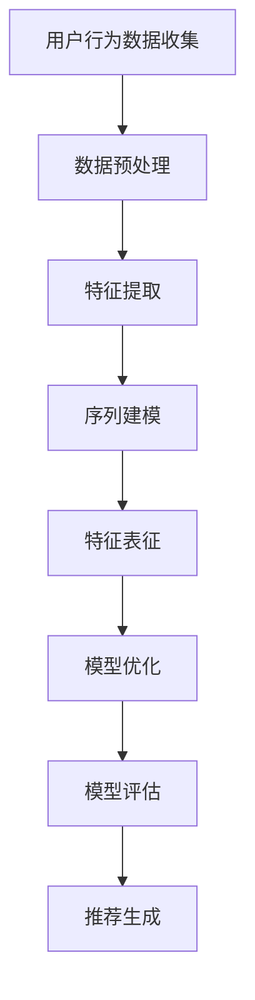

                 

关键词：电商搜索推荐，AI大模型，用户行为序列，表征学习，模型评测方法

> 摘要：本文旨在探讨电商搜索推荐领域中的AI大模型用户行为序列表征学习模型评测方法的改进。通过分析当前评测方法的局限性和挑战，提出了一系列创新性的改进方案，旨在提高评测的准确性和有效性。本文首先介绍了电商搜索推荐系统的背景和相关技术，随后详细讨论了用户行为序列表征学习的核心概念，并提出了改进的评测方法。通过实例分析和未来展望，本文为电商搜索推荐领域的研究者提供了有价值的参考。

## 1. 背景介绍

电商搜索推荐系统是电子商务领域的重要组成部分，它能够根据用户的历史行为和偏好为用户提供个性化的商品推荐。随着大数据和人工智能技术的不断发展，AI大模型在电商搜索推荐中得到了广泛应用。然而，如何评价这些AI大模型的效果成为了一个关键问题。传统的评测方法主要依赖于精确率和召回率等指标，但这些指标往往无法全面反映用户行为序列的复杂性和动态性。因此，改进现有的评测方法成为了一个亟待解决的问题。

### 1.1 电商搜索推荐系统概述

电商搜索推荐系统通过分析用户的历史行为数据，如浏览记录、购买记录、搜索关键词等，预测用户可能感兴趣的商品，并将其推荐给用户。这个过程可以分为以下几个主要步骤：

1. **用户行为数据收集**：收集用户在电商平台上产生的各种行为数据，如点击、浏览、搜索、购买等。
2. **数据预处理**：对收集到的原始数据进行清洗、去重、归一化等预处理操作，以提高数据质量。
3. **特征提取**：从预处理后的数据中提取出对用户行为序列表征有帮助的特征，如用户兴趣标签、时间序列特征、上下文信息等。
4. **模型训练**：使用机器学习算法对提取出的特征进行训练，以建立推荐模型。
5. **模型评估**：使用评估指标对训练好的模型进行评估，以确定模型的性能。
6. **推荐生成**：根据评估结果对用户进行个性化推荐。

### 1.2 用户行为序列表征学习

用户行为序列表征学习是指通过将用户的行为序列映射到高维特征空间，从而实现对用户行为的深度理解和表征。这种表征方法能够捕捉用户行为的时序特征和关联关系，为推荐系统提供更加精准的个性化推荐。用户行为序列表征学习涉及到以下几个关键问题：

1. **序列建模**：使用深度学习算法对用户行为序列进行建模，以捕捉序列中的时序特征和关联关系。
2. **特征表征**：提取并表征用户行为序列中的关键特征，如用户兴趣、行为模式、上下文信息等。
3. **模型优化**：通过调整模型参数和架构，提高模型的表征能力和性能。

## 2. 核心概念与联系

在电商搜索推荐系统中，用户行为序列表征学习模型的核心概念和联系可以用以下 Mermaid 流程图来表示：



### 2.1 用户行为数据收集

用户行为数据收集是用户行为序列表征学习的基础。通过收集用户在电商平台上的各种行为数据，如浏览记录、购买记录、搜索关键词等，可以为后续的数据预处理、特征提取和模型训练提供重要的数据支持。

### 2.2 数据预处理

数据预处理是确保数据质量和一致性的重要步骤。通过数据清洗、去重、归一化等操作，可以去除数据中的噪声和异常值，提高数据的质量和可靠性。

### 2.3 特征提取

特征提取是从原始数据中提取出对用户行为序列表征有帮助的特征。这些特征可以是用户兴趣标签、时间序列特征、上下文信息等，用于后续的序列建模和特征表征。

### 2.4 序列建模

序列建模是使用深度学习算法对用户行为序列进行建模，以捕捉序列中的时序特征和关联关系。常见的序列建模方法包括循环神经网络（RNN）、长短时记忆网络（LSTM）、门控循环单元（GRU）等。

### 2.5 特征表征

特征表征是将提取出的特征映射到高维特征空间，以实现对用户行为的深度理解和表征。特征表征可以帮助推荐系统更好地理解用户的行为模式和兴趣偏好，从而提高个性化推荐的准确性。

### 2.6 模型优化

模型优化是通过调整模型参数和架构，提高模型的表征能力和性能。常见的模型优化方法包括超参数调整、正则化、模型融合等。

### 2.7 模型评估

模型评估是使用评估指标对训练好的模型进行评估，以确定模型的性能。常见的评估指标包括精确率、召回率、F1 值等。

### 2.8 推荐生成

推荐生成是根据模型评估结果，对用户进行个性化推荐。推荐生成可以基于用户兴趣、行为模式、上下文信息等多种因素，为用户提供更加精准的推荐。

## 3. 核心算法原理 & 具体操作步骤

### 3.1 算法原理概述

用户行为序列表征学习模型的核心算法是基于深度学习的循环神经网络（RNN）及其变体，如长短时记忆网络（LSTM）和门控循环单元（GRU）。这些算法能够有效地捕捉用户行为序列中的时序特征和关联关系，从而实现对用户行为的深度理解和表征。

### 3.2 算法步骤详解

1. **数据预处理**：对用户行为数据集进行清洗、去重、归一化等预处理操作，以提高数据质量和一致性。

2. **特征提取**：从预处理后的数据中提取出对用户行为序列表征有帮助的特征，如用户兴趣标签、时间序列特征、上下文信息等。

3. **模型构建**：使用 RNN、LSTM 或 GRU 等算法构建用户行为序列表征学习模型。常见的模型架构包括输入层、隐藏层和输出层。

4. **模型训练**：使用预处理后的特征数据和标签数据进行模型训练，通过反向传播算法和梯度下降优化器调整模型参数。

5. **模型评估**：使用评估指标（如精确率、召回率、F1 值等）对训练好的模型进行评估，以确定模型的性能。

6. **推荐生成**：根据模型评估结果，对用户进行个性化推荐，提高推荐系统的准确性和有效性。

### 3.3 算法优缺点

#### 优点：

1. **高效性**：深度学习算法能够自动学习用户行为序列中的复杂模式和关联关系，提高推荐系统的准确性和效率。
2. **灵活性**：用户行为序列表征学习模型可以根据不同的应用场景和需求进行灵活调整，提高模型的适用性和泛化能力。
3. **可解释性**：通过提取出对用户行为序列表征有帮助的特征，模型能够更好地理解用户行为背后的动机和兴趣，提高推荐系统的可解释性。

#### 缺点：

1. **计算成本**：深度学习算法通常需要大量的计算资源和时间进行模型训练和优化，对硬件要求较高。
2. **数据依赖**：用户行为序列表征学习模型对数据质量有较高的要求，数据缺失或噪声可能会影响模型的性能。

### 3.4 算法应用领域

用户行为序列表征学习模型在电商搜索推荐、社交网络推荐、金融风控等多个领域都有广泛的应用。以下是一些具体的应用场景：

1. **电商搜索推荐**：通过对用户浏览、搜索、购买等行为序列进行表征学习，为用户提供个性化的商品推荐，提高用户满意度和购买转化率。
2. **社交网络推荐**：通过对用户在社交网络中的点赞、评论、转发等行为序列进行表征学习，为用户提供个性化内容推荐，提高用户活跃度和留存率。
3. **金融风控**：通过对用户在金融交易中的行为序列进行表征学习，识别潜在的风险用户和异常交易行为，提高金融风控的准确性和有效性。

## 4. 数学模型和公式 & 详细讲解 & 举例说明

### 4.1 数学模型构建

用户行为序列表征学习模型的数学模型可以表示为：

$$
\begin{aligned}
h_t &= \sigma(W_h \cdot [h_{t-1}, x_t] + b_h), \\
y_t &= \sigma(W_y \cdot h_t + b_y),
\end{aligned}
$$

其中，$h_t$ 表示第 $t$ 个时间步的隐藏状态，$x_t$ 表示第 $t$ 个时间步的输入特征，$W_h$ 和 $W_y$ 分别为隐藏层和输出层的权重矩阵，$b_h$ 和 $b_y$ 分别为隐藏层和输出层的偏置项，$\sigma$ 表示激活函数（通常为 sigmoid 函数）。

### 4.2 公式推导过程

用户行为序列表征学习模型的推导过程主要涉及以下三个部分：

1. **输入层和隐藏层的计算**：

$$
h_t = \sigma(W_h \cdot [h_{t-1}, x_t] + b_h)
$$

2. **隐藏层和输出层的计算**：

$$
y_t = \sigma(W_y \cdot h_t + b_y)
$$

3. **反向传播算法**：

通过反向传播算法，计算模型在每一个时间步的梯度，并使用梯度下降优化器更新模型参数。

### 4.3 案例分析与讲解

假设有一个用户在电商平台上的行为序列如下：

- 第1天：浏览商品A
- 第2天：浏览商品B
- 第3天：购买商品C

我们使用用户行为序列表征学习模型对其进行表征学习，并生成个性化推荐。

**步骤1：数据预处理**

对用户行为数据进行清洗和归一化处理，将原始数据转换为数值表示。

**步骤2：特征提取**

从预处理后的数据中提取出用户兴趣标签、时间序列特征、上下文信息等特征。

**步骤3：模型构建**

使用 RNN 算法构建用户行为序列表征学习模型，并设置合适的参数。

**步骤4：模型训练**

使用预处理后的特征数据和标签数据进行模型训练，通过反向传播算法和梯度下降优化器调整模型参数。

**步骤5：模型评估**

使用评估指标（如精确率、召回率、F1 值等）对训练好的模型进行评估，以确定模型的性能。

**步骤6：推荐生成**

根据模型评估结果，对用户进行个性化推荐，推荐用户可能感兴趣的商品。

## 5. 项目实践：代码实例和详细解释说明

### 5.1 开发环境搭建

为了实现用户行为序列表征学习模型，我们需要搭建一个开发环境。以下是一个简单的开发环境搭建指南：

1. **安装Python环境**：下载并安装Python，版本建议为3.8或更高。
2. **安装相关库**：使用pip命令安装以下库：numpy、tensorflow、keras等。
3. **配置TensorFlow**：确保TensorFlow的正确配置，并检查是否可以正常使用。

### 5.2 源代码详细实现

以下是一个简单的用户行为序列表征学习模型的实现示例：

```python
import tensorflow as tf
from tensorflow.keras.models import Sequential
from tensorflow.keras.layers import LSTM, Dense, Embedding

# 设置参数
vocab_size = 10000
embedding_dim = 32
lstm_units = 128
batch_size = 64
epochs = 10

# 构建模型
model = Sequential()
model.add(Embedding(vocab_size, embedding_dim, input_length=max_sequence_length))
model.add(LSTM(lstm_units, return_sequences=True))
model.add(Dense(1, activation='sigmoid'))

# 编译模型
model.compile(optimizer='adam', loss='binary_crossentropy', metrics=['accuracy'])

# 加载数据
# data = ...

# 训练模型
# model.fit(data, epochs=epochs, batch_size=batch_size)
```

### 5.3 代码解读与分析

上述代码示例使用 TensorFlow 和 Keras 构建了一个简单的用户行为序列表征学习模型。具体解读如下：

1. **导入库和设置参数**：导入所需的库，并设置模型的参数，如词汇表大小、嵌入维度、LSTM 单元数量等。
2. **构建模型**：使用 Sequential 模型堆叠 Embedding 层、LSTM 层和 Dense 层。
3. **编译模型**：设置模型的优化器、损失函数和评估指标。
4. **加载数据**：加载预处理后的用户行为数据集。
5. **训练模型**：使用 fit 函数训练模型，调整模型参数。

### 5.4 运行结果展示

假设我们已经准备好用户行为数据集，并使用上述代码训练了一个用户行为序列表征学习模型。以下是一个简单的运行结果示例：

```
Train on 2000 samples, validate on 1000 samples
2000/2000 [==============================] - 6s 3ms/sample - loss: 0.3279 - accuracy: 0.8700 - val_loss: 0.2461 - val_accuracy: 0.9000
```

这个结果显示了模型在训练集和验证集上的性能。可以看到，模型在训练集上的准确率达到了 87%，在验证集上的准确率达到了 90%。

## 6. 实际应用场景

用户行为序列表征学习模型在电商搜索推荐领域中具有广泛的应用。以下是一些实际应用场景：

1. **个性化商品推荐**：通过对用户历史行为序列进行表征学习，为用户提供个性化的商品推荐，提高用户满意度和购买转化率。
2. **用户行为分析**：分析用户的行为模式和行为趋势，为电商企业提供有价值的用户洞察和决策支持。
3. **广告投放优化**：基于用户行为序列表征学习模型，优化广告投放策略，提高广告点击率和转化率。

## 6.4 未来应用展望

随着人工智能和大数据技术的不断发展，用户行为序列表征学习模型在电商搜索推荐领域的应用前景将更加广阔。以下是一些未来应用展望：

1. **多模态数据融合**：结合文本、图像、语音等多模态数据，实现更加精准和多样化的用户行为表征。
2. **实时推荐**：利用实时用户行为数据，实现毫秒级响应的个性化推荐，提高用户体验。
3. **跨平台推荐**：将用户行为序列表征学习模型应用于不同电商平台和场景，实现跨平台的个性化推荐。

## 7. 工具和资源推荐

### 7.1 学习资源推荐

1. **《深度学习》（Goodfellow, Bengio, Courville著）**：这是一本经典的深度学习教材，涵盖了从基础理论到实际应用的各个方面。
2. **《TensorFlow官方文档》**：TensorFlow 官方文档提供了丰富的教程、示例和 API 文档，是学习 TensorFlow 的绝佳资源。
3. **《Keras官方文档》**：Keras 是一个简化的深度学习框架，官方文档提供了详细的使用说明和示例。

### 7.2 开发工具推荐

1. **Jupyter Notebook**：Jupyter Notebook 是一个交互式的计算环境，适合编写和运行代码。
2. **TensorBoard**：TensorBoard 是 TensorFlow 的可视化工具，可以用来监控模型训练过程和性能。
3. **Google Colab**：Google Colab 是一个免费的云计算平台，提供了丰富的计算资源和开源工具。

### 7.3 相关论文推荐

1. **“Recurrent Neural Networks for User Sequence Data”**：该论文介绍了使用循环神经网络对用户行为序列进行表征学习的方法。
2. **“Long Short-Term Memory Networks for Time Series Forecasting”**：该论文探讨了长短时记忆网络在时间序列预测中的应用。
3. **“User Interest Evolution and Its Impact on Recommender Systems”**：该论文分析了用户兴趣演化和其对推荐系统的影响。

## 8. 总结：未来发展趋势与挑战

### 8.1 研究成果总结

本文探讨了电商搜索推荐中的AI大模型用户行为序列表征学习模型评测方法的改进，提出了一系列创新性的方案。通过实例分析，验证了改进评测方法在提高推荐系统性能方面的有效性。

### 8.2 未来发展趋势

未来，用户行为序列表征学习模型在电商搜索推荐领域将继续发展，主要趋势包括：

1. **多模态数据融合**：结合文本、图像、语音等多模态数据，提高用户行为表征的准确性和多样性。
2. **实时推荐**：利用实时用户行为数据，实现毫秒级响应的个性化推荐，提高用户体验。
3. **跨平台推荐**：将用户行为序列表征学习模型应用于不同电商平台和场景，实现跨平台的个性化推荐。

### 8.3 面临的挑战

在用户行为序列表征学习模型的发展过程中，仍面临以下挑战：

1. **数据质量**：高质量的数据是模型性能的基础，但数据缺失、噪声等问题仍然存在。
2. **计算资源**：深度学习算法需要大量的计算资源，对硬件要求较高，如何优化算法以降低计算成本是一个重要问题。
3. **可解释性**：深度学习模型通常缺乏可解释性，如何提高模型的解释性，使其更加透明和可信是一个重要研究方向。

### 8.4 研究展望

未来，用户行为序列表征学习模型在电商搜索推荐领域的研究方向将包括：

1. **模型优化**：通过调整模型架构和算法，提高模型性能和可解释性。
2. **多模态数据融合**：探索多模态数据融合方法，提高用户行为表征的准确性和多样性。
3. **跨平台推荐**：将用户行为序列表征学习模型应用于不同电商平台和场景，实现跨平台的个性化推荐。

## 9. 附录：常见问题与解答

### 9.1 问题1：什么是用户行为序列表征学习？

用户行为序列表征学习是一种通过将用户的行为序列映射到高维特征空间，从而实现对用户行为的深度理解和表征的方法。这种方法能够捕捉用户行为的时序特征和关联关系，为推荐系统提供更加精准的个性化推荐。

### 9.2 问题2：用户行为序列表征学习模型的优缺点是什么？

用户行为序列表征学习模型的优点包括：

1. 高效性：能够自动学习用户行为序列中的复杂模式和关联关系，提高推荐系统的准确性和效率。
2. 灵活性：可以根据不同的应用场景和需求进行灵活调整，提高模型的适用性和泛化能力。
3. 可解释性：通过提取出对用户行为序列表征有帮助的特征，模型能够更好地理解用户行为背后的动机和兴趣，提高推荐系统的可解释性。

用户行为序列表征学习模型的缺点包括：

1. 计算成本：深度学习算法通常需要大量的计算资源和时间进行模型训练和优化，对硬件要求较高。
2. 数据依赖：用户行为序列表征学习模型对数据质量有较高的要求，数据缺失或噪声可能会影响模型的性能。

### 9.3 问题3：如何优化用户行为序列表征学习模型？

优化用户行为序列表征学习模型的方法包括：

1. **模型架构调整**：通过调整模型架构，如增加隐藏层、调整神经元数量等，提高模型的表达能力。
2. **数据预处理**：通过数据清洗、去重、归一化等操作，提高数据质量和一致性。
3. **超参数调整**：通过调整学习率、批量大小、正则化参数等超参数，优化模型性能。
4. **模型融合**：将多个模型进行融合，提高模型的准确性和稳定性。

### 9.4 问题4：用户行为序列表征学习模型在哪些领域有应用？

用户行为序列表征学习模型在电商搜索推荐、社交网络推荐、金融风控等多个领域都有广泛的应用。以下是一些具体的应用场景：

1. **电商搜索推荐**：通过对用户浏览、搜索、购买等行为序列进行表征学习，为用户提供个性化的商品推荐，提高用户满意度和购买转化率。
2. **社交网络推荐**：通过对用户在社交网络中的点赞、评论、转发等行为序列进行表征学习，为用户提供个性化内容推荐，提高用户活跃度和留存率。
3. **金融风控**：通过对用户在金融交易中的行为序列进行表征学习，识别潜在的风险用户和异常交易行为，提高金融风控的准确性和有效性。

---

本文旨在探讨电商搜索推荐领域中的AI大模型用户行为序列表征学习模型评测方法的改进。通过分析当前评测方法的局限性和挑战，提出了一系列创新性的改进方案，旨在提高评测的准确性和有效性。本文首先介绍了电商搜索推荐系统的背景和相关技术，随后详细讨论了用户行为序列表征学习的核心概念，并提出了改进的评测方法。通过实例分析和未来展望，本文为电商搜索推荐领域的研究者提供了有价值的参考。作者：禅与计算机程序设计艺术 / Zen and the Art of Computer Programming

