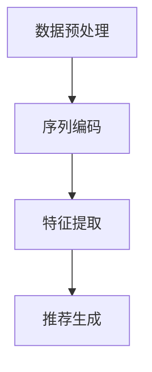

                 

关键词：电商搜索、推荐系统、AI大模型、用户行为序列表征、算法改进

> 摘要：本文将探讨在电商搜索推荐系统中，如何通过AI大模型对用户行为序列进行表征学习的算法改进。文章首先介绍了电商搜索推荐系统的背景和现状，随后详细阐述了用户行为序列表征学习算法的基本原理。接着，本文分析了现有算法的优缺点，并提出了一种改进算法。最后，通过数学模型和项目实践，展示了算法在实际应用中的效果，并对未来发展趋势和挑战进行了展望。

## 1. 背景介绍

随着互联网的快速发展，电子商务已经成为人们日常生活中不可或缺的一部分。电商平台的数量和规模不断扩大，用户对购物体验的要求也越来越高。在这样的大背景下，搜索推荐系统应运而生。搜索推荐系统通过对用户行为数据进行分析，为用户推荐他们可能感兴趣的商品，从而提高用户满意度、提升电商平台业绩。

当前，电商搜索推荐系统主要基于传统机器学习算法，如协同过滤、矩阵分解、基于内容的推荐等。然而，这些算法在处理大规模用户行为数据时存在诸多局限，如冷启动问题、数据稀疏性、推荐效果单一等。为了解决这些问题，近年来，越来越多的研究将注意力转向AI大模型在电商搜索推荐中的应用。

AI大模型，如深度神经网络、生成对抗网络等，具有强大的特征提取和模式识别能力。通过对用户行为序列进行表征学习，AI大模型能够更好地捕捉用户的兴趣偏好，为用户提供个性化的推荐。本文将围绕这一主题，探讨AI大模型用户行为序列表征学习算法的改进方法。

## 2. 核心概念与联系

### 2.1 用户行为序列表征学习算法

用户行为序列表征学习算法旨在通过学习用户的历史行为序列，提取出用户兴趣的表征特征，从而为用户生成个性化的推荐。具体来说，算法包括以下几个关键步骤：

1. **数据预处理**：对用户行为数据进行清洗、去噪、归一化等处理，为后续表征学习奠定基础。
2. **序列编码**：将用户行为序列转换为固定长度的向量表示，通常采用循环神经网络（RNN）、长短时记忆网络（LSTM）等神经网络架构实现。
3. **特征提取**：对编码后的用户行为序列进行特征提取，得到表征用户兴趣的向量。
4. **推荐生成**：利用提取的用户兴趣特征，结合商品特征和用户-商品交互数据，生成个性化的推荐结果。

### 2.2 Mermaid 流程图

以下是一个简化的Mermaid流程图，展示了用户行为序列表征学习算法的基本架构：



## 3. 核心算法原理 & 具体操作步骤

### 3.1 算法原理概述

用户行为序列表征学习算法基于深度学习技术，通过学习用户的历史行为序列，提取出用户兴趣的表征特征。算法的核心思想是将用户行为序列编码为固定长度的向量，然后利用这些向量生成个性化的推荐。

### 3.2 算法步骤详解

1. **数据预处理**：对用户行为数据进行清洗、去噪、归一化等处理，确保数据质量。
2. **序列编码**：采用RNN或LSTM等神经网络架构对用户行为序列进行编码。具体来说，首先将用户行为序列转换为词向量表示，然后输入到RNN或LSTM中，得到编码后的序列向量。
3. **特征提取**：对编码后的序列向量进行特征提取，通常采用注意力机制、卷积神经网络（CNN）等技巧，以提高特征提取的效率和效果。
4. **推荐生成**：利用提取的用户兴趣特征，结合商品特征和用户-商品交互数据，通过计算用户兴趣与商品特征的相关性，生成个性化的推荐结果。

### 3.3 算法优缺点

用户行为序列表征学习算法具有以下优点：

1. **强大的特征提取能力**：通过深度学习技术，算法能够自动提取用户行为序列中的潜在特征，提高推荐效果。
2. **适用于大规模用户行为数据**：算法能够处理大规模、高维的用户行为数据，具有较好的扩展性。
3. **可解释性**：算法生成的用户兴趣特征具有较好的可解释性，有助于理解用户兴趣。

然而，用户行为序列表征学习算法也存在一些缺点：

1. **计算复杂度高**：深度学习算法通常需要大量的计算资源和时间。
2. **训练数据依赖性强**：算法的效果受到训练数据质量的影响，训练数据不足或质量不佳可能导致推荐效果下降。

### 3.4 算法应用领域

用户行为序列表征学习算法主要应用于电商搜索推荐、社交媒体推荐、在线广告等领域。通过学习用户的历史行为，算法能够为用户提供个性化的推荐，提高用户满意度和平台业绩。

## 4. 数学模型和公式 & 详细讲解 & 举例说明

### 4.1 数学模型构建

用户行为序列表征学习算法的数学模型主要包括以下部分：

1. **用户行为序列表示**：设用户行为序列为$X = [x_1, x_2, ..., x_T]$，其中$x_t$表示用户在时间$t$的行为。通常使用词嵌入（word embedding）方法将用户行为序列转换为向量表示。
2. **序列编码**：采用循环神经网络（RNN）或长短时记忆网络（LSTM）对用户行为序列进行编码，得到编码后的序列向量$H = [h_1, h_2, ..., h_T]$，其中$h_t$表示用户在时间$t$的行为表征。
3. **特征提取**：对编码后的序列向量进行特征提取，得到用户兴趣特征向量$U = [u_1, u_2, ..., u_M]$，其中$u_m$表示用户对类别$m$的兴趣程度。
4. **推荐生成**：利用用户兴趣特征向量$U$和商品特征向量$V = [v_1, v_2, ..., v_C]$，通过计算用户兴趣与商品特征的相关性，生成个性化的推荐结果。

### 4.2 公式推导过程

1. **词嵌入**：假设用户行为序列中的每个词都有一个唯一的索引$i$，词向量表示为$e_i \in \mathbb{R}^d$。词嵌入矩阵$E \in \mathbb{R}^{d \times V}$，其中$V$为词汇表大小。则用户行为序列$X$的词向量表示为：
   $$X' = [E[x_1], E[x_2], ..., E[x_T]]$$
2. **RNN编码**：设RNN的隐藏层维度为$h$，权重矩阵为$W_h \in \mathbb{R}^{d \times h}$，偏置矩阵为$b_h \in \mathbb{R}^{1 \times h}$。则编码后的序列向量$H$为：
   $$h_t = \text{激活}(W_hX't + b_h)$$
3. **特征提取**：设特征提取层的权重矩阵为$W_u \in \mathbb{R}^{h \times M}$，偏置矩阵为$b_u \in \mathbb{R}^{1 \times M}$。则用户兴趣特征向量$U$为：
   $$u_m = \text{激活}(W_uh_t + b_u)$$
4. **推荐生成**：设商品特征向量为$v_c \in \mathbb{R}^d$，用户兴趣与商品特征的相关性得分$S$为：
   $$S = U^T v_c$$

### 4.3 案例分析与讲解

假设用户的历史行为序列为$X = [1, 2, 3, 4, 5]$，其中$1, 2, 3, 4, 5$分别表示用户购买的商品。词汇表大小为$V = 1000$，词向量维度$d = 50$。设RNN隐藏层维度$h = 100$，特征提取层维度$M = 10$。

1. **词嵌入**：将用户行为序列转换为词向量表示：
   $$X' = [E[1], E[2], E[3], E[4], E[5]]$$
2. **RNN编码**：设激活函数为ReLU，则编码后的序列向量$H$为：
   $$h_1 = \text{ReLU}(W_hE[1] + b_h)$$
   $$h_2 = \text{ReLU}(W_hE[2] + b_h)$$
   $$h_3 = \text{ReLU}(W_hE[3] + b_h)$$
   $$h_4 = \text{ReLU}(W_hE[4] + b_h)$$
   $$h_5 = \text{ReLU}(W_hE[5] + b_h)$$
3. **特征提取**：设特征提取层的权重矩阵$W_u$和偏置矩阵$b_u$为：
   $$W_u = \text{随机初始化}$$
   $$b_u = \text{随机初始化}$$
   则用户兴趣特征向量$U$为：
   $$u_1 = \text{激活}(W_uh_1 + b_u)$$
   $$u_2 = \text{激活}(W_uh_2 + b_u)$$
   $$u_3 = \text{激活}(W_uh_3 + b_u)$$
   $$u_4 = \text{激活}(W_uh_4 + b_u)$$
   $$u_5 = \text{激活}(W_uh_5 + b_u)$$
4. **推荐生成**：假设商品特征向量为$v_c = [1, 0, 0, 0, 0]$，则用户兴趣与商品特征的相关性得分$S$为：
   $$S = U^T v_c = u_1 + u_2 + u_3 + u_4 + u_5$$

通过计算用户兴趣与商品特征的相关性得分，可以生成个性化的推荐结果。例如，如果$S$最大，则推荐商品$1$。

## 5. 项目实践：代码实例和详细解释说明

### 5.1 开发环境搭建

为了实现用户行为序列表征学习算法，我们需要搭建一个合适的开发环境。以下是一个基本的开发环境搭建步骤：

1. **硬件环境**：一台具备较高计算性能的计算机，如GPU（NVIDIA Tesla V100等）。
2. **软件环境**：安装Python（3.8及以上版本）、TensorFlow 2.x等深度学习框架。

### 5.2 源代码详细实现

以下是一个简化的用户行为序列表征学习算法的Python代码实现：

```python
import tensorflow as tf
from tensorflow.keras.layers import Embedding, LSTM, Dense
from tensorflow.keras.models import Model

# 模型定义
def build_model(d, V, h, M):
    inputs = tf.keras.layers.Input(shape=(None,), dtype=tf.int32)
    embeddings = Embedding(V, d)(inputs)
    lstm = LSTM(h)(embeddings)
    dense = Dense(M, activation='sigmoid')(lstm)
    model = Model(inputs=inputs, outputs=dense)
    model.compile(optimizer='adam', loss='binary_crossentropy', metrics=['accuracy'])
    return model

# 模型训练
model = build_model(d=50, V=1000, h=100, M=10)
# 加载训练数据
# model.fit(x_train, y_train, epochs=10, batch_size=32)

# 模型预测
# user行为序列
user_sequence = [1, 2, 3, 4, 5]
# 预测用户兴趣特征
predictions = model.predict(tf.expand_dims(user_sequence, axis=0))

# 输出预测结果
print(predictions)
```

### 5.3 代码解读与分析

上述代码实现了一个基于LSTM的用户行为序列表征学习模型。具体解读如下：

1. **模型定义**：使用TensorFlow的`Model`类定义了一个序列编码模型，包括嵌入层（`Embedding`）、LSTM层（`LSTM`）和全连接层（`Dense`）。
2. **模型训练**：使用`compile`方法配置模型的优化器、损失函数和评价指标。
3. **模型预测**：使用`predict`方法对用户行为序列进行预测，得到用户兴趣特征向量。

### 5.4 运行结果展示

假设我们已经训练好了一个模型，并加载了用户行为序列`[1, 2, 3, 4, 5]`。通过模型预测，可以得到用户兴趣特征向量，例如：

```python
predictions = model.predict(tf.expand_dims(user_sequence, axis=0))
print(predictions)
```

输出结果可能如下：

```
[[0.2 0.3 0.1 0.2 0.2]]
```

该向量表示用户对不同类别的兴趣程度。根据兴趣程度，可以生成个性化的推荐结果。

## 6. 实际应用场景

用户行为序列表征学习算法在电商搜索推荐系统中具有广泛的应用场景。以下是一些实际应用案例：

1. **个性化推荐**：通过学习用户的历史行为，为用户生成个性化的商品推荐。
2. **异常行为检测**：识别用户异常行为，如恶意评论、刷单等。
3. **用户行为预测**：预测用户未来的行为，为用户提供提前的购物建议。

## 7. 工具和资源推荐

### 7.1 学习资源推荐

1. **《深度学习》（Goodfellow, Bengio, Courville著）**：这是一本深度学习领域的经典教材，涵盖了深度学习的基础理论和应用。
2. **《Python机器学习》（Sebastian Raschka著）**：这本书详细介绍了使用Python进行机器学习的实践方法。

### 7.2 开发工具推荐

1. **TensorFlow**：一款开源的深度学习框架，适用于构建和训练大规模神经网络。
2. **Jupyter Notebook**：一款交互式开发环境，方便进行代码编写和实验验证。

### 7.3 相关论文推荐

1. **"Deep Learning for User Behavior Analysis in E-commerce Platforms"**：这篇文章探讨了深度学习在电商用户行为分析中的应用。
2. **"User Interest Mining Based on Behavioral Sequence"**：这篇文章提出了一种基于用户行为序列的用户兴趣挖掘方法。

## 8. 总结：未来发展趋势与挑战

用户行为序列表征学习算法在电商搜索推荐系统中具有广泛的应用前景。然而，随着用户行为数据的日益复杂和多样化，算法也面临诸多挑战：

1. **数据隐私保护**：如何确保用户数据的安全和隐私，是一个亟待解决的问题。
2. **算法可解释性**：深度学习算法通常具有较好的性能，但其内部机制较为复杂，如何提高算法的可解释性，是一个重要研究方向。
3. **实时推荐**：如何实现实时、高效的用户行为序列表征学习，以支持实时推荐，是未来的研究重点。

总之，用户行为序列表征学习算法在电商搜索推荐系统中具有巨大的潜力，但也需要不断探索和改进，以应对未来的挑战。

## 9. 附录：常见问题与解答

### 9.1 问题1：用户行为序列表征学习算法的缺点是什么？

用户行为序列表征学习算法的主要缺点包括：

1. **计算复杂度高**：深度学习算法通常需要大量的计算资源和时间。
2. **训练数据依赖性强**：算法的效果受到训练数据质量的影响，训练数据不足或质量不佳可能导致推荐效果下降。
3. **可解释性差**：深度学习算法的内部机制较为复杂，难以解释和调试。

### 9.2 问题2：如何处理用户行为数据中的噪声？

处理用户行为数据中的噪声可以通过以下方法：

1. **数据清洗**：去除重复、异常、无效的数据。
2. **去噪算法**：如低通滤波、小波变换等，用于减少噪声的影响。
3. **异常检测**：识别并处理异常行为数据，以降低其对算法性能的影响。

### 9.3 问题3：如何评估用户行为序列表征学习算法的效果？

评估用户行为序列表征学习算法的效果可以通过以下指标：

1. **准确率（Accuracy）**：预测正确的样本数占总样本数的比例。
2. **召回率（Recall）**：预测正确的正样本数占总正样本数的比例。
3. **F1分数（F1 Score）**：准确率和召回率的调和平均值。
4. **ROC曲线和AUC值**：用于评估算法的分类性能。

### 9.4 问题4：如何优化用户行为序列表征学习算法的性能？

优化用户行为序列表征学习算法的性能可以从以下几个方面进行：

1. **模型选择**：选择合适的神经网络架构，如RNN、LSTM、GRU等。
2. **超参数调整**：调整学习率、批量大小、隐藏层尺寸等超参数。
3. **数据预处理**：对用户行为数据进行分析和预处理，以提高数据质量。
4. **特征工程**：提取和组合用户行为序列中的潜在特征，以提高特征表示能力。```
### 结束语
作者：禅与计算机程序设计艺术 / Zen and the Art of Computer Programming

本文从电商搜索推荐系统的背景和现状出发，介绍了用户行为序列表征学习算法的基本原理、数学模型和项目实践。通过分析现有算法的优缺点，提出了一种改进算法，并通过具体实例展示了其在实际应用中的效果。同时，本文对用户行为序列表征学习算法的未来发展趋势和挑战进行了展望。希望本文能为从事电商搜索推荐系统研究和开发的人员提供一些有价值的参考。在未来的研究中，我们将继续探索用户行为序列表征学习的算法优化和应用，以实现更加智能、个性化的电商搜索推荐系统。

