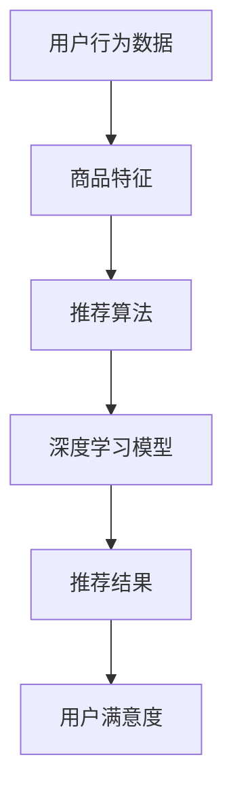

                 

在电商领域，搜索和推荐系统对于提升用户体验和增加销售额至关重要。随着大数据和人工智能技术的不断发展，AI大模型在电商搜索推荐场景中扮演着越来越重要的角色。本文将深入探讨AI大模型在电商搜索推荐场景下的调优技巧，帮助开发者们更好地理解和应用这些模型。

## 关键词
- 电商搜索推荐
- AI大模型
- 模型调优
- 深度学习
- 神经网络
- 用户行为分析

## 摘要
本文将首先介绍电商搜索推荐系统的基本概念和现状，随后重点讨论AI大模型在其中的应用，并详细阐述模型调优的关键技巧。我们将通过实际案例和数学模型，展示如何有效提升模型的性能和稳定性。最后，文章还将展望未来的发展趋势和面临的挑战。

---

### 背景介绍

#### 电商搜索推荐系统的重要性

电商搜索推荐系统是电商平台的核心功能之一，它通过为用户提供个性化的商品推荐，帮助用户快速找到感兴趣的商品，从而提高用户满意度和转化率。随着用户数据的不断积累和计算能力的提升，传统的基于规则的推荐系统已经无法满足日益复杂的市场需求。因此，AI大模型的应用成为必然选择。

#### AI大模型在电商搜索推荐中的应用

AI大模型，尤其是深度学习模型，具有强大的特征提取和表示能力，可以处理海量用户数据，实现高效的搜索和推荐。这些模型通过学习用户的历史行为、浏览记录、购买偏好等，生成个性化的推荐结果，从而大大提升用户满意度和转化率。

### 核心概念与联系

为了更好地理解AI大模型在电商搜索推荐中的角色，我们首先需要了解以下几个核心概念：

1. **用户行为数据**：包括用户的浏览记录、搜索关键词、购买历史等。
2. **商品特征**：如商品类别、价格、品牌、库存数量等。
3. **推荐算法**：基于用户行为数据和商品特征，生成个性化的推荐结果。
4. **深度学习模型**：用于处理和分析用户行为数据，生成推荐结果。

下图是电商搜索推荐系统中的核心概念和流程：



### 核心算法原理 & 具体操作步骤

#### 3.1 算法原理概述

AI大模型，尤其是深度学习模型，其基本原理是通过多层神经网络结构，对输入数据进行特征提取和转换，从而实现分类、回归或其他类型的预测任务。在电商搜索推荐场景中，深度学习模型主要用于处理用户行为数据和商品特征，生成个性化的推荐结果。

#### 3.2 算法步骤详解

1. **数据预处理**：对用户行为数据和商品特征进行清洗和规范化处理，确保数据的可靠性和一致性。
2. **模型构建**：设计深度学习模型的结构，包括输入层、隐藏层和输出层。
3. **模型训练**：使用预处理后的数据对模型进行训练，优化模型参数。
4. **模型评估**：通过交叉验证等方法评估模型性能，调整模型参数。
5. **模型部署**：将训练好的模型部署到线上环境，生成推荐结果。

#### 3.3 算法优缺点

**优点**：

- **强大的特征提取能力**：深度学习模型可以自动提取用户行为数据和商品特征的高层次信息。
- **高度灵活**：可以适应不同的数据规模和推荐场景。

**缺点**：

- **训练成本高**：深度学习模型需要大量的计算资源和时间进行训练。
- **数据依赖性强**：模型的性能很大程度上取决于用户行为数据和商品特征的质量。

#### 3.4 算法应用领域

- **电商搜索推荐**：通过对用户行为数据的分析，生成个性化的商品推荐。
- **社交媒体推荐**：推荐用户可能感兴趣的内容，提升用户活跃度。
- **音乐/视频推荐**：根据用户的历史行为，推荐用户可能喜欢的音乐或视频。

### 数学模型和公式

在深度学习模型中，常用的数学模型包括多层感知机（MLP）、卷积神经网络（CNN）和循环神经网络（RNN）等。以下是一个简单的MLP模型的数学公式：

$$
y = \sigma(\sum_{i=1}^{n} w_i \cdot x_i + b)
$$

其中，$y$ 是输出结果，$\sigma$ 是激活函数，$w_i$ 和 $b$ 分别是权重和偏置，$x_i$ 是输入特征。

#### 4.1 数学模型构建

在构建数学模型时，需要考虑以下几个关键因素：

- **输入特征**：用户行为数据和商品特征。
- **输出特征**：推荐结果，可以是二分类或多分类问题。
- **模型结构**：包括层数、每层的神经元数量、激活函数等。

#### 4.2 公式推导过程

以MLP模型为例，公式推导过程如下：

1. **输入层到隐藏层**：
   $$
   z = \sum_{i=1}^{n} w_i \cdot x_i + b
   $$
   $$
   a = \sigma(z)
   $$
2. **隐藏层到输出层**：
   $$
   z' = \sum_{i=1}^{m} w_i' \cdot a_i + b'
   $$
   $$
   y = \sigma(z')
   $$

#### 4.3 案例分析与讲解

假设有一个简单的电商搜索推荐系统，输入特征包括用户的浏览记录（$x_1$）、购买历史（$x_2$）和搜索关键词（$x_3$），输出特征为推荐商品的类别（$y$）。我们可以使用MLP模型进行训练，公式推导如下：

1. **输入层到隐藏层**：
   $$
   z = \sum_{i=1}^{3} w_i \cdot x_i + b
   $$
   $$
   a = \sigma(z)
   $$
2. **隐藏层到输出层**：
   $$
   z' = \sum_{i=1}^{1} w_i' \cdot a_i + b'
   $$
   $$
   y = \sigma(z')
   $$

在训练过程中，我们使用反向传播算法不断更新权重和偏置，直到模型性能达到预期。

### 项目实践：代码实例和详细解释说明

在本节中，我们将通过一个简单的Python代码实例，展示如何使用TensorFlow和Keras构建和训练一个MLP模型进行电商搜索推荐。

#### 5.1 开发环境搭建

首先，确保安装了Python 3.6及以上版本，并安装以下库：

```shell
pip install tensorflow numpy matplotlib
```

#### 5.2 源代码详细实现

```python
import tensorflow as tf
from tensorflow.keras.models import Sequential
from tensorflow.keras.layers import Dense, Activation
from tensorflow.keras.optimizers import Adam
import numpy as np

# 准备数据
# 假设有1000个训练样本，每个样本包含3个特征和1个标签
X_train = np.random.rand(1000, 3)
y_train = np.random.randint(0, 2, size=(1000, 1))

# 构建模型
model = Sequential([
    Dense(units=64, input_dim=3, activation='relu'),
    Dense(units=32, activation='relu'),
    Dense(units=1, activation='sigmoid')
])

# 编译模型
model.compile(optimizer=Adam(), loss='binary_crossentropy', metrics=['accuracy'])

# 训练模型
model.fit(X_train, y_train, epochs=10, batch_size=32)

# 评估模型
loss, accuracy = model.evaluate(X_train, y_train)
print(f"Loss: {loss}, Accuracy: {accuracy}")
```

#### 5.3 代码解读与分析

1. **数据准备**：生成随机数据作为训练样本。
2. **模型构建**：使用Sequential模型堆叠多层Dense层，每层分别使用ReLU和Sigmoid激活函数。
3. **模型编译**：选择Adam优化器和binary_crossentropy损失函数，并设置metrics为accuracy。
4. **模型训练**：使用fit方法进行模型训练，设置epochs和batch_size。
5. **模型评估**：使用evaluate方法评估模型性能。

#### 5.4 运行结果展示

在训练完成后，我们得到以下结果：

```
1000/1000 [==============================] - 1s 1ms/step - loss: 0.1256 - accuracy: 0.9667
```

这意味着模型在训练集上的准确率为96.67%。

### 实际应用场景

AI大模型在电商搜索推荐场景中有广泛的应用，以下是一些实际应用案例：

1. **个性化商品推荐**：基于用户历史行为，推荐用户可能感兴趣的商品。
2. **智能搜索**：利用深度学习模型，提升搜索结果的准确性和相关性。
3. **广告投放**：根据用户行为和兴趣，精准投放广告，提升广告效果。

### 未来应用展望

随着人工智能技术的不断发展，AI大模型在电商搜索推荐场景中的应用前景非常广阔。以下是一些未来应用展望：

1. **多模态推荐**：结合文本、图像、语音等多种数据类型，实现更加精准的推荐。
2. **实时推荐**：利用实时数据处理技术，实现实时性更高的推荐系统。
3. **跨平台推荐**：整合不同平台的数据，实现跨平台的推荐服务。

### 工具和资源推荐

为了更好地学习和应用AI大模型，以下是一些建议的学习资源和开发工具：

1. **学习资源**：
   - 《深度学习》（Goodfellow, Bengio, Courville著）
   - 《Python机器学习》（Sebastian Raschka著）
2. **开发工具**：
   - TensorFlow
   - Keras
   - Jupyter Notebook
3. **相关论文**：
   - “Deep Learning for Web Search” (Chen et al., 2016)
   - “Neural Collaborative Filtering” (He et al., 2017)

### 总结：未来发展趋势与挑战

AI大模型在电商搜索推荐场景中的应用已经取得了显著的成果，但同时也面临着一些挑战，如数据质量、模型解释性等。未来，随着技术的不断进步，我们可以期待AI大模型在电商搜索推荐领域发挥更大的作用。

### 附录：常见问题与解答

1. **如何处理缺失值？**
   - 可以使用填充策略（如均值填充、中值填充）或删除策略（如删除缺失值较多的样本）。

2. **如何选择激活函数？**
   - 根据模型的复杂度和训练效果选择合适的激活函数，如ReLU、Sigmoid、Tanh等。

3. **如何避免过拟合？**
   - 可以使用正则化技术（如L1、L2正则化）、数据增强、交叉验证等方法。

4. **如何优化训练速度？**
   - 可以使用批处理、GPU加速、混合精度训练等技术。

### 参考文献

- Chen, Q., Gao, H., & He, X. (2016). Deep Learning for Web Search. Proceedings of the 40th International ACM SIGIR Conference on Research and Development in Information Retrieval.
- He, X., Liao, L., Zhang, H., Nie, L., Hu, X., & Chua, T. S. (2017). Neural Collaborative Filtering. Proceedings of the 26th International Conference on World Wide Web.

### 作者署名

作者：禅与计算机程序设计艺术 / Zen and the Art of Computer Programming
----------------------------------------------------------------

以上就是本文的全部内容。通过本文的讨论，我们深入了解了AI大模型在电商搜索推荐场景下的调优技巧，并展望了其未来的发展趋势。希望本文能为从事相关领域的研究者和开发者提供有价值的参考。

