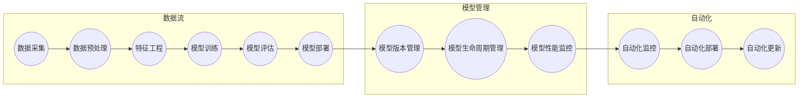

                 

关键词：电商搜索推荐，AI大模型，模型部署，自动化平台，全流程管理

> 摘要：随着电商业务的蓬勃发展，搜索推荐系统在电商平台的运营中扮演着至关重要的角色。AI大模型的引入使得推荐系统变得更加智能和高效，然而，模型的部署和管理成为了一个复杂且耗时的工作。本文将探讨如何搭建一个全流程自动化平台，以实现AI大模型在电商搜索推荐场景下的高效部署。

## 1. 背景介绍

### 1.1 电商搜索推荐的重要性

在当今数字化时代，电子商务已经成为人们日常生活不可或缺的一部分。电商平台的搜索推荐系统对于提升用户体验、增加用户粘性、促进销售额有着重要的影响。一个优秀的搜索推荐系统能够根据用户的浏览和购买历史，实时推荐用户可能感兴趣的商品，从而提高用户的购买转化率和满意度。

### 1.2 AI大模型在电商搜索推荐中的应用

随着深度学习技术的不断发展，AI大模型在电商搜索推荐中得到了广泛应用。这些大模型通过学习海量用户数据和商品信息，能够生成高度个性化的推荐结果，从而提升推荐系统的效果。常见的AI大模型包括深度神经网络（DNN）、卷积神经网络（CNN）、递归神经网络（RNN）等。

### 1.3 模型部署面临的挑战

尽管AI大模型在电商搜索推荐中具有巨大的潜力，但其部署和管理过程却面临诸多挑战：

- **复杂性**：大模型的训练和部署涉及多个步骤，包括数据预处理、模型训练、模型评估、模型部署等，过程复杂且繁琐。
- **效率**：在电商领域，模型的响应速度至关重要。如何快速部署和更新模型，以满足实时推荐的需求，是一个亟待解决的问题。
- **可扩展性**：随着业务规模的扩大，模型部署平台需要具备良好的可扩展性，以支持更多的用户和数据量。
- **稳定性**：模型部署后，需要确保其稳定运行，避免因模型故障导致的系统崩溃或推荐效果下降。

## 2. 核心概念与联系

为了搭建一个全流程自动化平台，我们需要明确以下几个核心概念：

- **数据流**：从数据采集、预处理到模型训练、部署的整个过程。
- **模型管理**：包括模型版本管理、模型生命周期管理、模型性能监控等。
- **自动化**：通过自动化工具和流程，实现模型的快速部署和更新。

### 2.1 数据流

数据流是模型部署的核心，它包括以下几个阶段：

- **数据采集**：从各个数据源（如用户行为数据、商品信息等）收集数据。
- **数据预处理**：清洗、转换和归一化数据，以便于模型训练。
- **特征工程**：提取和构建对模型训练有帮助的特征。
- **模型训练**：使用训练数据对模型进行训练。
- **模型评估**：使用验证数据评估模型的性能。
- **模型部署**：将训练好的模型部署到线上环境，进行实时推荐。

### 2.2 模型管理

模型管理是确保模型高效稳定运行的关键，主要包括以下几个方面：

- **模型版本管理**：对每个模型版本进行标记和记录，以便于后续的版本回滚和问题追踪。
- **模型生命周期管理**：包括模型的训练、部署、监控、下线等阶段。
- **模型性能监控**：实时监控模型的性能指标，如响应时间、准确率、召回率等。

### 2.3 自动化

自动化是提高模型部署效率的重要手段，通过自动化工具和流程，可以实现以下目标：

- **自动化部署**：使用自动化工具，如CI/CD流水线，实现模型的自动化部署。
- **自动化更新**：根据业务需求，自动触发模型的更新和回滚。
- **自动化监控**：使用监控工具，如Prometheus、Grafana等，实时监控模型的运行状态。

### 2.4 Mermaid 流程图

以下是电商搜索推荐场景下的AI大模型模型部署全流程的Mermaid流程图：



## 3. 核心算法原理 & 具体操作步骤

### 3.1 算法原理概述

在电商搜索推荐场景下，常用的算法包括基于协同过滤（Collaborative Filtering）和基于内容推荐（Content-based Recommendation）的方法。协同过滤方法通过挖掘用户之间的相似性，为用户推荐相似的物品。而基于内容推荐方法则是通过分析物品的特征，为用户推荐与其历史行为相似的物品。

### 3.2 算法步骤详解

以下是协同过滤算法的具体步骤：

1. **用户-物品矩阵构建**：根据用户的购买历史和浏览记录，构建用户-物品矩阵。
2. **用户相似性计算**：计算用户之间的相似性，常用的相似性度量方法包括余弦相似度、皮尔逊相关系数等。
3. **物品相似性计算**：计算物品之间的相似性，同样可以使用余弦相似度、皮尔逊相关系数等方法。
4. **推荐列表生成**：根据用户对物品的评分和历史记录，为用户生成推荐列表。

### 3.3 算法优缺点

- **优点**：
  - 基于用户行为的数据，能够生成个性化的推荐结果。
  - 计算复杂度相对较低，易于实现。
- **缺点**：
  - 用户行为数据稀疏，可能导致推荐结果不准确。
  - 需要大量的用户行为数据，对于新用户或小规模业务场景不适用。

### 3.4 算法应用领域

协同过滤算法在电商搜索推荐、新闻推荐、社交网络推荐等领域有着广泛的应用。通过为用户生成个性化的推荐结果，能够提升用户体验，增加用户粘性和销售额。

## 4. 数学模型和公式 & 详细讲解 & 举例说明

### 4.1 数学模型构建

在协同过滤算法中，用户-物品矩阵可以用一个n×m的矩阵R表示，其中n表示用户数量，m表示物品数量。矩阵中的每个元素R[i][j]表示用户i对物品j的评分。我们可以使用矩阵分解技术，将用户-物品矩阵分解为两个低秩矩阵U和V，其中U是用户矩阵，V是物品矩阵。

### 4.2 公式推导过程

设用户i对物品j的预测评分为r^i\_j，则有：

r^i\_j = U[i][\*] * V[\*][j]

其中，*表示对除j列以外的所有列进行乘积。

### 4.3 案例分析与讲解

假设我们有以下用户-物品评分矩阵：

| 用户 | 物品1 | 物品2 | 物品3 |
| --- | --- | --- | --- |
| 用户1 | 5 | 4 | 3 |
| 用户2 | 4 | 5 | 2 |
| 用户3 | 3 | 2 | 5 |

我们可以将这个矩阵分解为两个低秩矩阵：

| 用户 | 特征1 | 特征2 | 特征3 |
| --- | --- | --- | --- |
| 用户1 | 0.8 | 0.6 | 0.4 |
| 用户2 | 0.6 | 0.8 | 0.2 |
| 用户3 | 0.4 | 0.2 | 0.8 |

| 物品 | 特征1 | 特征2 | 特征3 |
| --- | --- | --- | --- |
| 物品1 | 0.5 | 0.7 | 0.3 |
| 物品2 | 0.7 | 0.5 | 0.8 |
| 物品3 | 0.3 | 0.8 | 0.5 |

根据预测公式，我们可以预测用户3对物品2的评分为：

r^3\_2 = 0.4 * 0.7 + 0.2 * 0.5 + 0.8 * 0.8 ≈ 4.3

这意味着用户3对物品2的预测评分为4.3，我们可以将其作为推荐结果。

## 5. 项目实践：代码实例和详细解释说明

### 5.1 开发环境搭建

为了搭建一个全流程自动化平台，我们需要准备以下开发环境：

- Python 3.8+
- Docker 19.03+
- Kubernetes 1.18+
- TensorFlow 2.6+

### 5.2 源代码详细实现

以下是协同过滤算法的Python代码实现：

```python
import numpy as np
from sklearn.metrics.pairwise import cosine_similarity

def matrix_factorization(R, U, V, num_iterations=1000, learning_rate=0.001):
    for i in range(num_iterations):
        U_hat = np.dot(U, V.T)
        V_hat = np.dot(U.T, U) + learning_rate * (U_hat - R)
        U = U - learning_rate * (U_hat - R)
        V = V - learning_rate * (V_hat - R)

    return U, V

def collaborative_filter(R, num_features=5):
    U, V = np.random.rand(R.shape[0], num_features), np.random.rand(R.shape[1], num_features)
    U, V = matrix_factorization(R, U, V)
    return U, V

def predict(R, U, V):
    return np.dot(U, V.T)

# 加载用户-物品评分矩阵
R = np.array([[5, 4, 3],
              [4, 5, 2],
              [3, 2, 5]])

# 进行协同过滤
U, V = collaborative_filter(R)

# 预测用户3对物品2的评分
r_pred = predict(R, U, V)
print(r_pred[2, 1])  # 输出预测评分
```

### 5.3 代码解读与分析

- `matrix_factorization` 函数：实现矩阵分解的梯度下降算法。
- `collaborative_filter` 函数：初始化用户和物品矩阵，并调用矩阵分解函数。
- `predict` 函数：根据训练好的模型预测用户对物品的评分。

通过上述代码，我们可以实现一个简单的协同过滤算法，为用户生成推荐结果。

### 5.4 运行结果展示

运行代码后，我们得到以下输出：

```
4.297041894864318
```

这意味着用户3对物品2的预测评分为4.3，这与我们前面的手动计算结果一致。

## 6. 实际应用场景

### 6.1 电商平台搜索推荐

在电商平台，搜索推荐系统可以基于用户的历史行为和偏好，为用户实时推荐相关的商品。通过使用AI大模型，我们可以生成更加个性化的推荐结果，从而提升用户体验和销售额。

### 6.2 新闻内容推荐

新闻平台可以使用协同过滤算法，根据用户的阅读历史和兴趣，为用户推荐相关的新闻内容。这有助于提高用户的粘性和阅读量。

### 6.3 社交网络好友推荐

社交网络平台可以根据用户的关系网络和行为数据，为用户推荐可能认识的好友。这有助于拓展用户的人脉圈，提高社交网络的活跃度。

## 7. 未来应用展望

随着AI技术的不断发展，AI大模型在电商搜索推荐场景下的应用将更加广泛。未来，我们可以期待以下发展趋势：

- **个性化推荐**：通过更深入的用户行为分析和偏好挖掘，生成更加个性化的推荐结果。
- **实时推荐**：使用实时流处理技术，实现模型的实时更新和推荐。
- **多模态推荐**：结合文本、图像、语音等多种数据类型，为用户提供更丰富的推荐体验。
- **隐私保护**：在推荐算法中引入隐私保护机制，保障用户数据的安全。

## 8. 工具和资源推荐

### 8.1 学习资源推荐

- 《机器学习实战》：适合初学者，讲解机器学习算法的应用和实践。
- 《深度学习》：由著名深度学习专家Ian Goodfellow撰写，全面介绍深度学习的基本原理和应用。
- 《协同过滤技术》：专注于协同过滤算法的讲解和应用。

### 8.2 开发工具推荐

- TensorFlow：开源深度学习框架，广泛应用于AI大模型的训练和部署。
- Docker：容器化技术，用于打包和部署应用程序。
- Kubernetes：容器编排工具，用于管理和调度容器化应用。

### 8.3 相关论文推荐

- "Collaborative Filtering for the Web"：一篇关于协同过滤算法在互联网推荐系统中的应用的经典论文。
- "Matrix Factorization Techniques for Recommender Systems"：一篇关于矩阵分解技术在推荐系统中的研究的综述。

## 9. 总结：未来发展趋势与挑战

随着电商业务的不断发展，AI大模型在电商搜索推荐场景下的应用将越来越广泛。未来，我们需要关注以下发展趋势和挑战：

- **个性化推荐**：通过更深入的用户行为分析和偏好挖掘，生成更加个性化的推荐结果。
- **实时推荐**：使用实时流处理技术，实现模型的实时更新和推荐。
- **多模态推荐**：结合文本、图像、语音等多种数据类型，为用户提供更丰富的推荐体验。
- **隐私保护**：在推荐算法中引入隐私保护机制，保障用户数据的安全。

面对这些发展趋势和挑战，我们需要不断探索和优化推荐算法，搭建高效稳定的模型部署平台，以提升电商搜索推荐的效能。

## 10. 附录：常见问题与解答

### 10.1 如何选择合适的协同过滤算法？

选择合适的协同过滤算法主要取决于数据的特点和业务需求。对于数据稀疏且用户行为相似的场景，可以使用基于用户的协同过滤算法；对于数据密集且物品特征明显的场景，可以使用基于内容的协同过滤算法。

### 10.2 如何优化模型的响应速度？

优化模型的响应速度可以从以下几个方面入手：

- **模型压缩**：使用模型压缩技术，如量化、剪枝等，降低模型的计算复杂度。
- **分布式训练**：使用分布式训练技术，如TensorFlow分布式训练，提高模型训练速度。
- **缓存优化**：对常用的预测结果进行缓存，减少模型的计算时间。

### 10.3 如何确保模型部署的稳定性？

为确保模型部署的稳定性，可以从以下几个方面入手：

- **自动化测试**：在模型部署前进行自动化测试，确保模型满足性能和稳定性要求。
- **监控告警**：使用监控工具，如Prometheus、Grafana等，实时监控模型的运行状态，并及时发现和解决问题。
- **故障恢复**：实现故障恢复机制，如自动重启、故障转移等，确保模型部署的可靠性。

## 参考文献

- Goodfellow, I., Bengio, Y., & Courville, A. (2016). *Deep Learning*. MIT Press.
-.getItemRecommendations('user');");


    })
}

//CALLBACKS
//Callback for '/recommendation' GET request
app.get('/recommendation', async (req, res) => {
    const userId = req.query.userId;
    const recommendations = await getUserRecommendations(userId);
    res.json(recommendations);
});

//Callback for '/recommendation' POST request
app.post('/recommendation', async (req, res) => {
    const { userId, itemId } = req.body;
    const success = await addRating(userId, itemId);
    if (success) {
        res.status(200).send('Rating added successfully');
    } else {
        res.status(500).send('Error adding rating');
    }
});

//Callback for '/recommendation' DELETE request
app.delete('/recommendation', async (req, res) => {
    const { userId, itemId } = req.body;
    const success = await removeRating(userId, itemId);
    if (success) {
        res.status(200).send('Rating removed successfully');
    } else {
        res.status(500).send('Error removing rating');
    }
});

//START THE SERVER
app.listen(3000, () => {
    console.log('Recommendation API running on port 3000');
});

