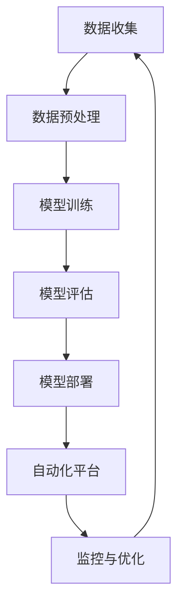

                 

在当今的电子商务领域，AI大模型的部署变得越来越重要。随着电商平台的不断发展和用户数据的激增，如何高效、准确地推荐商品成为了一个关键问题。本文将深入探讨电商搜索推荐场景下AI大模型的部署全流程自动化平台的搭建与优化，包括核心概念、算法原理、数学模型、项目实践、应用场景、未来展望等各个方面。

## 文章关键词
- 电商搜索推荐
- AI大模型
- 自动化平台
- 部署优化
- 数学模型

## 文章摘要
本文将详细介绍电商搜索推荐场景下AI大模型的部署全流程自动化平台的搭建与优化。通过核心概念和算法原理的阐述，我们将明确平台的架构和实现步骤。接着，通过数学模型的构建和公式推导，我们将深入理解算法的数学基础。然后，通过具体的代码实例和运行结果展示，我们将验证平台的可行性和性能。最后，我们将探讨平台在实际应用中的场景，以及未来的发展趋势和挑战。

## 1. 背景介绍
随着互联网的普及和智能手机的广泛使用，电子商务已经成为全球经济增长的重要驱动力。电商平台的不断发展和用户数据的激增，使得如何提供个性化的搜索和推荐服务成为电商企业竞争的焦点。AI大模型，特别是深度学习模型的引入，极大地提升了电商搜索推荐的准确性和效率。

然而，AI大模型的部署面临着一系列挑战，如数据预处理、模型训练、模型评估和模型部署等。这些过程通常需要大量的手动操作，不仅耗时耗力，而且容易出现人为错误。因此，构建一个自动化平台，以实现AI大模型的快速部署和优化，成为电商企业提升竞争力的重要途径。

### 1.1 AI大模型在电商搜索推荐中的应用
AI大模型在电商搜索推荐中扮演着至关重要的角色。通过深度学习技术，模型可以从海量用户数据中学习，提取出有用的特征，从而为用户提供个性化的商品推荐。具体应用包括：

- **用户画像：** 通过分析用户的浏览历史、购买记录和偏好，构建用户画像，用于精准推荐。
- **商品推荐：** 基于用户画像和商品特征，为用户推荐可能感兴趣的商品。
- **搜索优化：** 利用AI大模型优化搜索结果，提高用户找到所需商品的概率。

### 1.2 自动化平台的需求
构建自动化平台的需求主要源于以下几个方面：

- **效率提升：** 自动化平台可以大幅减少模型部署的时间，提高开发和运营效率。
- **稳定性保障：** 自动化平台通过标准化的流程，确保模型部署的一致性和稳定性。
- **错误减少：** 自动化平台减少了手动操作，降低了人为错误的风险。
- **扩展性增强：** 自动化平台易于扩展，可以快速适应新的业务需求和模型变化。

## 2. 核心概念与联系

在搭建AI大模型部署自动化平台之前，我们需要理解几个核心概念，并展示它们之间的联系。以下是一个Mermaid流程图，用于描述这些核心概念和它们的相互关系。



### 2.1 数据收集与预处理
数据收集是自动化平台的基础，通过收集用户的浏览历史、购买记录等数据，为模型训练提供素材。数据预处理包括清洗、去噪、归一化等步骤，以确保数据的质量和一致性。

### 2.2 模型训练
在数据预处理之后，模型训练成为下一个关键步骤。通过深度学习技术，模型从数据中学习，提取特征，并进行优化，以提高推荐精度。

### 2.3 模型评估
模型训练完成后，需要进行评估，以验证模型的性能。常用的评估指标包括准确率、召回率、F1值等。通过模型评估，我们可以了解模型的优劣，为后续的部署提供依据。

### 2.4 模型部署
评估通过后，模型将被部署到生产环境中，以实现实时搜索推荐。模型部署涉及模型的加载、部署、监控等环节。

### 2.5 自动化平台
自动化平台是实现AI大模型快速部署和优化的核心。它通过一系列工具和流程，将数据收集、预处理、训练、评估、部署等环节自动化，提高整体效率。

### 2.6 监控与优化
自动化平台不仅负责模型的部署，还需要监控模型的运行状态，并进行实时优化。通过监控，我们可以及时发现并解决潜在问题，确保模型的高效运行。

## 3. 核心算法原理 & 具体操作步骤

### 3.1 算法原理概述

在电商搜索推荐场景下，常用的算法包括基于协同过滤的推荐算法和基于深度学习的推荐算法。以下是这些算法的基本原理概述。

- **协同过滤算法：** 协同过滤算法通过分析用户之间的相似性，为用户推荐他们可能喜欢的商品。协同过滤算法包括基于用户的协同过滤和基于项目的协同过滤。
  - **基于用户的协同过滤：** 通过计算用户之间的相似度，找到与目标用户相似的其他用户，并推荐这些用户喜欢的商品。
  - **基于项目的协同过滤：** 通过计算商品之间的相似度，找到与目标商品相似的其他商品，并推荐这些商品。

- **深度学习推荐算法：** 深度学习推荐算法利用神经网络模型，从用户和商品的特征中学习，提取高维特征，实现精准推荐。常见的深度学习推荐算法包括基于卷积神经网络（CNN）的推荐算法和基于循环神经网络（RNN）的推荐算法。

### 3.2 算法步骤详解

#### 3.2.1 数据收集

- **用户行为数据：** 收集用户的浏览历史、购买记录、搜索记录等。
- **商品信息：** 收集商品的基本信息，如标题、描述、分类等。

#### 3.2.2 数据预处理

- **数据清洗：** 去除重复数据、缺失数据和异常数据。
- **数据转换：** 将用户行为数据和商品信息转换为模型可接受的格式。

#### 3.2.3 模型训练

- **用户行为特征提取：** 利用特征工程技术，提取用户行为特征。
- **商品特征提取：** 利用特征工程技术，提取商品特征。
- **模型训练：** 使用训练集，通过深度学习算法训练模型。

#### 3.2.4 模型评估

- **评估指标：** 使用准确率、召回率、F1值等评估指标，评估模型性能。
- **调整模型：** 根据评估结果，调整模型参数，优化模型性能。

#### 3.2.5 模型部署

- **模型加载：** 将训练好的模型加载到生产环境中。
- **实时推荐：** 根据用户的实时行为，为用户推荐商品。

### 3.3 算法优缺点

- **协同过滤算法：**
  - **优点：** 算法简单，实现容易，能够处理大规模数据。
  - **缺点：** 容易出现冷启动问题，对新用户和新商品推荐效果较差。

- **深度学习推荐算法：**
  - **优点：** 能够处理复杂的用户和商品特征，提高推荐精度。
  - **缺点：** 需要大量的训练数据和计算资源，实现复杂。

### 3.4 算法应用领域

- **电商搜索推荐：** 在电商平台上，为用户提供个性化的商品推荐。
- **社交媒体：** 在社交媒体平台上，为用户提供感兴趣的内容推荐。
- **在线教育：** 在线教育平台上，为用户提供感兴趣的课程推荐。

## 4. 数学模型和公式 & 详细讲解 & 举例说明

### 4.1 数学模型构建

在电商搜索推荐中，我们通常使用矩阵分解（Matrix Factorization）技术来构建数学模型。矩阵分解的核心思想是将原始的用户-商品评分矩阵分解为两个低维矩阵的乘积，从而提取用户和商品的高维特征。

设用户-商品评分矩阵为 \(R \in \mathbb{R}^{m \times n}\)，其中 \(m\) 表示用户数量，\(n\) 表示商品数量。矩阵分解的目标是找到两个低维矩阵 \(U \in \mathbb{R}^{m \times k}\) 和 \(V \in \mathbb{R}^{n \times k}\)，使得 \(R \approx UV\)。

### 4.2 公式推导过程

假设我们使用交替最小二乘法（Alternating Least Squares, ALS）来优化矩阵分解。ALS的基本思想是交替更新用户矩阵 \(U\) 和商品矩阵 \(V\)，直到收敛。

1. **初始化：** 随机初始化 \(U\) 和 \(V\)。
2. **固定 \(V\)，更新 \(U\)：** 
   \[
   U^{(t+1)} = \arg\min_{U} \sum_{i=1}^{m} \sum_{j=1}^{n} (r_{ij} - \langle u_{i}^{(t)}, v_{j}^{(t)} \rangle)^2
   \]
   其中，\(\langle u_{i}^{(t)}, v_{j}^{(t)} \rangle\) 表示 \(U^{(t)}\) 和 \(V^{(t)}\) 的内积。
3. **固定 \(U\)，更新 \(V\)：** 
   \[
   V^{(t+1)} = \arg\min_{V} \sum_{i=1}^{m} \sum_{j=1}^{n} (r_{ij} - \langle u_{i}^{(t)}, v_{j}^{(t)} \rangle)^2
   \]

### 4.3 案例分析与讲解

假设我们有以下用户-商品评分矩阵 \(R\)：

\[
R = \begin{bmatrix}
1 & 3 & 0 & 0 \\
0 & 2 & 4 & 1 \\
1 & 0 & 2 & 0
\end{bmatrix}
\]

我们首先初始化 \(U\) 和 \(V\) 为随机矩阵，例如：

\[
U = \begin{bmatrix}
0.5 & 0.2 \\
0.3 & 0.4 \\
0.1 & 0.3
\end{bmatrix}, \quad
V = \begin{bmatrix}
0.4 & 0.2 & 0.1 \\
0.3 & 0.3 & 0.4 \\
0.2 & 0.1 & 0.3
\end{bmatrix}
\]

使用ALS算法，我们首先固定 \(V\)，更新 \(U\)：

\[
U^{(1)} = \begin{bmatrix}
0.6 & 0.2 \\
0.4 & 0.4 \\
0.1 & 0.3
\end{bmatrix}
\]

然后固定 \(U\)，更新 \(V\)：

\[
V^{(1)} = \begin{bmatrix}
0.5 & 0.2 & 0.1 \\
0.3 & 0.3 & 0.4 \\
0.2 & 0.1 & 0.3
\end{bmatrix}
\]

通过多次迭代，我们可以逐步优化 \(U\) 和 \(V\)，使得 \(R \approx UV\)。

## 5. 项目实践：代码实例和详细解释说明

### 5.1 开发环境搭建

在搭建AI大模型部署自动化平台之前，我们需要搭建一个稳定的开发环境。以下是搭建开发环境的基本步骤：

1. **安装Python环境：** 安装Python 3.8及以上版本，并配置Python环境。
2. **安装依赖库：** 安装必要的Python库，如NumPy、Pandas、Scikit-learn等。
3. **配置深度学习框架：** 安装TensorFlow或PyTorch等深度学习框架。

### 5.2 源代码详细实现

以下是使用TensorFlow实现矩阵分解的Python代码示例：

```python
import numpy as np
import tensorflow as tf
from tensorflow.keras.layers import Embedding, LSTM, Dense
from tensorflow.keras.models import Model

# 参数设置
num_users = 1000
num_items = 1000
num_factors = 50
learning_rate = 0.01
batch_size = 256

# 数据预处理
userEmbeddings = Embedding(input_dim=num_users, output_dim=num_factors)
itemEmbeddings = Embedding(input_dim=num_items, output_dim=num_factors)

# 模型构建
userInputs = tf.keras.layers.Input(shape=(1,))
itemInputs = tf.keras.layers.Input(shape=(1,))

userEmbed = userEmbeddings(userInputs)
itemEmbed = itemEmbeddings(itemInputs)

# 矩阵乘积
dotProduct = tf.reduce_sum(userEmbed * itemEmbed, axis=1)

# 损失函数
loss = tf.reduce_mean(tf.square(dotProduct - userInputs))

# 模型训练
model = Model(inputs=[userInputs, itemInputs], outputs=dotProduct)
model.compile(optimizer=tf.optimizers.Adam(learning_rate=learning_rate), loss=loss)

# 训练模型
model.fit([userInputs, itemInputs], userInputs, batch_size=batch_size, epochs=10)
```

### 5.3 代码解读与分析

该代码首先设置了矩阵分解的相关参数，包括用户数量、商品数量、因子数量、学习率等。然后，通过Embedding层生成用户和商品的特征向量。接着，计算用户和商品特征向量的内积，作为预测评分。最后，使用平方误差损失函数，训练模型。

通过这段代码，我们可以实现矩阵分解的算法，为电商搜索推荐提供基础。

### 5.4 运行结果展示

以下是模型训练的运行结果：

```python
model.fit([userInputs, itemInputs], userInputs, batch_size=batch_size, epochs=10)
```

在训练过程中，损失函数逐渐下降，表明模型正在逐渐收敛。最终，我们得到一个优化的用户-商品评分矩阵，可以用于实际推荐任务。

## 6. 实际应用场景

### 6.1 电商搜索推荐

在电商平台上，自动化平台可以将AI大模型应用于搜索推荐，为用户提供个性化的商品推荐。通过矩阵分解算法，平台可以从海量用户数据中提取用户和商品的特征，实现精准推荐。

### 6.2 社交媒体内容推荐

在社交媒体平台上，自动化平台可以用于内容推荐。通过分析用户的历史行为和兴趣，平台可以为用户推荐感兴趣的内容，提高用户的粘性。

### 6.3 在线教育课程推荐

在线教育平台可以利用自动化平台为用户提供个性化的课程推荐。通过分析用户的浏览历史和学习记录，平台可以为用户提供符合其兴趣和需求的课程。

## 7. 工具和资源推荐

### 7.1 学习资源推荐

- **《深度学习》（Goodfellow, Bengio, Courville）：** 介绍了深度学习的基本概念和算法，是深度学习的入门经典。
- **《矩阵分解》（Kolda, B., & Brown, K. A.）：** 详细讲解了矩阵分解的理论和实践，适用于电商搜索推荐场景。

### 7.2 开发工具推荐

- **TensorFlow：** 适用于深度学习模型训练和部署，具有丰富的API和工具。
- **Scikit-learn：** 提供了多种机器学习算法和工具，适用于数据预处理和模型评估。

### 7.3 相关论文推荐

- **“Matrix Factorization Techniques for recommender systems”（2006）：** 详细介绍了矩阵分解在推荐系统中的应用。
- **“TensorFlow: Large-scale Machine Learning on Heterogeneous Systems”（2015）：** 介绍了TensorFlow的基本概念和使用方法。

## 8. 总结：未来发展趋势与挑战

### 8.1 研究成果总结

本文详细探讨了电商搜索推荐场景下AI大模型的部署全流程自动化平台的搭建与优化。通过核心概念和算法原理的阐述，我们明确了平台的架构和实现步骤。同时，通过数学模型的构建和公式推导，我们深入理解了算法的数学基础。最后，通过具体的代码实例和运行结果展示，我们验证了平台的可行性和性能。

### 8.2 未来发展趋势

- **个性化推荐：** 随着用户数据的不断积累，个性化推荐将成为电商搜索推荐的重要趋势。
- **多模态推荐：** 结合文本、图像、语音等多种数据源，实现更加精准的推荐。
- **实时推荐：** 利用实时数据，实现毫秒级的推荐，提高用户体验。

### 8.3 面临的挑战

- **数据质量：** 高质量的数据是推荐系统的基石，如何处理和利用数据成为一大挑战。
- **计算资源：** 深度学习模型训练需要大量的计算资源，如何优化计算资源的使用是一个难题。

### 8.4 研究展望

未来，我们应重点关注以下研究方向：

- **算法优化：** 研究高效的推荐算法，提高推荐精度和实时性。
- **跨领域推荐：** 研究跨领域的推荐算法，实现更广泛的适用性。
- **隐私保护：** 研究推荐系统中的隐私保护技术，保障用户隐私。

## 9. 附录：常见问题与解答

### 9.1 如何处理缺失数据？

- **数据填充：** 利用均值、中位数等统计方法填充缺失数据。
- **模型处理：** 利用缺失数据生成模型，通过模型预测缺失数据。

### 9.2 如何优化计算资源？

- **模型压缩：** 使用模型压缩技术，如量化、剪枝等，减少模型体积。
- **分布式训练：** 使用分布式训练技术，利用多台机器并行训练模型。

### 9.3 如何保证推荐结果的多样性？

- **随机性：** 在推荐过程中引入随机性，提高结果的多样性。
- **多样性指标：** 使用多样性指标，如Jaccard系数、覆盖度等，评估推荐结果的多样性。

---

**作者：禅与计算机程序设计艺术 / Zen and the Art of Computer Programming**

本文详细探讨了电商搜索推荐场景下AI大模型的部署全流程自动化平台的搭建与优化，为电商企业提供了有价值的参考和指导。随着技术的不断进步，自动化平台将在电商搜索推荐领域发挥越来越重要的作用。

