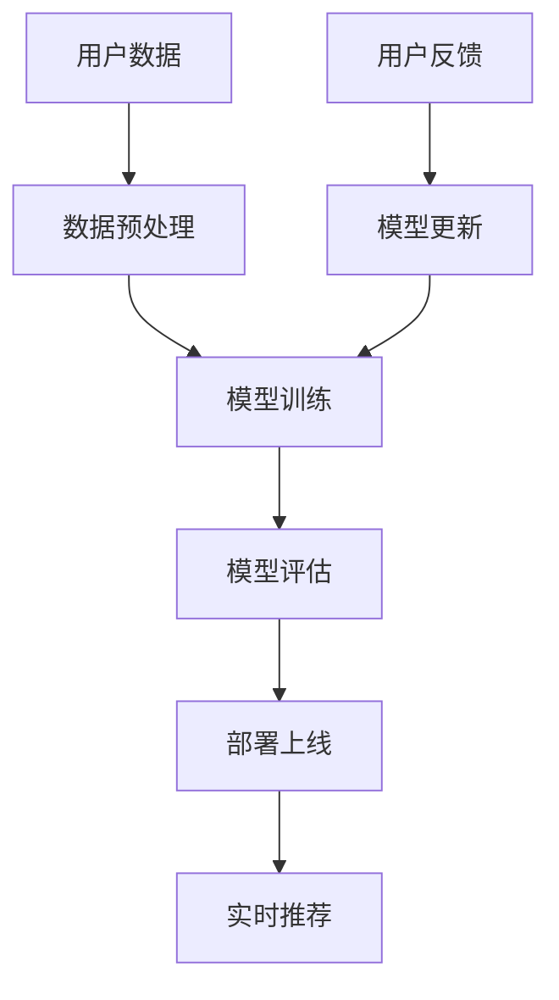

                 

 关键词：电商搜索推荐、AI大模型、模型部署、成本核算、应用实践

> 摘要：本文旨在探讨在电商搜索推荐场景下，AI大模型的部署成本核算及其在实际应用中的实践。通过深入分析AI大模型的技术原理、成本构成及优化策略，本文为电商企业提供了有效的成本核算模型，并展示了其在电商搜索推荐系统中的应用实例。

## 1. 背景介绍

随着互联网技术的飞速发展，电子商务已经成为现代商业模式的重要组成部分。电商平台的搜索推荐系统作为用户与商品之间的桥梁，其性能直接影响用户体验和销售额。近年来，人工智能技术的迅猛发展，特别是AI大模型的引入，为电商搜索推荐系统带来了革命性的变革。AI大模型能够通过深度学习算法，从海量数据中提取有用信息，实现对用户行为的精准预测和商品推荐的自动化。然而，AI大模型的部署和运营成本较高，如何进行合理的成本核算和优化，成为了电商企业亟待解决的问题。

### 1.1 电商搜索推荐系统的重要性

电商搜索推荐系统是电商平台的核心组成部分，其性能直接关系到用户的满意度和平台的销售额。一个优秀的搜索推荐系统能够：

- **提升用户体验**：根据用户的浏览历史和购买记录，推荐用户可能感兴趣的商品，提升用户的购物体验。
- **增加销售额**：通过精准推荐，提高用户的购买转化率，从而提升平台的销售额。
- **优化库存管理**：通过预测商品的销售趋势，帮助企业合理调整库存，减少滞销库存。

### 1.2 AI大模型在电商搜索推荐中的应用

AI大模型通过深度学习算法，可以从大量的用户行为数据中提取特征，实现对用户兴趣和购买行为的精准预测。其优势包括：

- **更高的预测准确性**：通过学习海量数据，AI大模型能够捕捉到复杂的关系和模式，提高预测的准确性。
- **自动化的推荐策略**：AI大模型能够自动生成推荐策略，减少人工干预，提高推荐的效率。
- **适应性强**：AI大模型能够适应不同的业务场景和用户需求，实现个性化的推荐。

### 1.3 AI大模型部署成本的挑战

AI大模型的部署涉及硬件设备、软件系统、数据处理和模型训练等多方面的成本。主要挑战包括：

- **硬件成本**：大模型训练需要高性能的GPU或TPU，其购买和运维成本较高。
- **软件成本**：深度学习框架和工具链的购买和定制开发费用不菲。
- **数据处理成本**：大规模数据清洗、预处理和存储需要大量的计算资源和存储空间。
- **运维成本**：大模型的部署和维护需要专业的运维团队，其人力成本较高。

## 2. 核心概念与联系

为了更好地理解AI大模型在电商搜索推荐中的应用，我们需要先了解一些核心概念和技术原理，并使用Mermaid流程图展示其架构。

### 2.1 核心概念

- **深度学习**：一种机器学习技术，通过多层神经网络对数据进行特征提取和模式识别。
- **神经网络**：一种基于生物神经元连接方式的计算模型，通过前向传播和反向传播实现数据的处理和更新。
- **GPU/TPU**：图形处理器和 tensor 处理单元，专门用于加速深度学习模型的训练和推理。

### 2.2 技术原理

- **数据预处理**：对原始数据进行清洗、归一化和特征提取，为模型训练提供高质量的数据输入。
- **模型训练**：通过反向传播算法，利用大量标注数据训练模型，使其能够对新的数据进行预测。
- **模型评估**：使用测试集评估模型的性能，包括准确率、召回率等指标。

### 2.3 架构展示



### 2.4 关联性

AI大模型在电商搜索推荐中的关联性体现在：

- **用户数据**：电商平台通过收集用户的浏览、点击、购买等行为数据，作为模型的输入。
- **数据预处理**：对用户数据进行清洗和特征提取，确保模型训练的质量。
- **模型训练**：利用深度学习算法训练模型，提取用户行为中的隐藏特征。
- **模型评估**：评估模型的预测效果，通过调整模型参数优化性能。
- **部署上线**：将训练好的模型部署到线上环境，实现实时推荐。
- **用户反馈**：收集用户对推荐结果的真实反馈，用于模型的持续优化。

## 3. 核心算法原理 & 具体操作步骤

### 3.1 算法原理概述

电商搜索推荐中的AI大模型主要依赖于深度学习算法，其核心原理如下：

- **多层感知器（MLP）**：一种前馈神经网络，通过多层神经元实现数据的特征提取和分类。
- **卷积神经网络（CNN）**：主要用于图像处理，通过对图像的卷积和池化操作提取特征。
- **循环神经网络（RNN）**：一种能够处理序列数据的神经网络，通过对序列数据的递归操作提取时间序列特征。
- **Transformer模型**：一种基于自注意力机制的深度学习模型，通过多头注意力机制实现对序列数据的全局关联。

### 3.2 算法步骤详解

1. **数据预处理**：

   - **数据收集**：收集电商平台的用户行为数据，包括浏览记录、点击记录、购买记录等。
   - **数据清洗**：去除无效数据、填补缺失值、去除噪声数据。
   - **特征提取**：对数据进行归一化处理，提取用户特征（如用户ID、时间戳、商品ID等）和商品特征（如商品类别、价格、品牌等）。

2. **模型训练**：

   - **模型选择**：根据业务需求选择合适的深度学习模型，如MLP、CNN、RNN或Transformer。
   - **模型配置**：配置模型的参数，包括学习率、批量大小、迭代次数等。
   - **数据分割**：将数据集分为训练集、验证集和测试集。
   - **模型训练**：使用训练集训练模型，通过反向传播算法更新模型参数。
   - **模型评估**：使用验证集评估模型性能，调整模型参数，优化模型。

3. **模型部署**：

   - **模型评估**：使用测试集对模型进行最终评估，确保模型达到预期的性能指标。
   - **模型部署**：将训练好的模型部署到线上环境，实现实时推荐。

### 3.3 算法优缺点

**优点**：

- **高预测准确性**：通过深度学习算法，能够从海量数据中提取特征，实现高精度的预测。
- **自适应性强**：能够适应不同的业务场景和用户需求，实现个性化的推荐。
- **自动化程度高**：能够自动生成推荐策略，减少人工干预。

**缺点**：

- **训练成本高**：大模型训练需要大量的计算资源和时间，成本较高。
- **数据依赖性强**：模型的性能很大程度上取决于数据的质量，数据缺失或不准确会导致模型性能下降。
- **解释性差**：深度学习模型通常具有高复杂性，难以解释其内部机制。

### 3.4 算法应用领域

AI大模型在电商搜索推荐中的应用非常广泛，除了电商领域，还可以应用于以下领域：

- **社交媒体推荐**：通过分析用户的社交行为，推荐用户可能感兴趣的内容。
- **新闻推荐**：根据用户的阅读历史和兴趣，推荐相关的新闻和文章。
- **广告推荐**：根据用户的浏览行为和兴趣，推荐相关的广告。
- **金融风控**：通过对用户行为数据的分析，预测用户的风险等级，用于信用评估和风险控制。

## 4. 数学模型和公式 & 详细讲解 & 举例说明

### 4.1 数学模型构建

在电商搜索推荐中，AI大模型的核心是深度学习算法，其数学模型主要包括以下几个方面：

- **输入层（Input Layer）**：接收用户特征和商品特征的输入。
- **隐藏层（Hidden Layer）**：通过对输入数据进行特征提取和变换。
- **输出层（Output Layer）**：生成推荐结果。

### 4.2 公式推导过程

以多层感知器（MLP）为例，其前向传播和反向传播的数学过程如下：

1. **前向传播**：

   前向传播的公式为：

   $$ z^{(l)} = \sigma(W^{(l)} \cdot a^{(l-1)} + b^{(l)}) $$

   其中，$a^{(l)}$表示第$l$层的激活值，$W^{(l)}$和$b^{(l)}$分别表示第$l$层的权重和偏置，$\sigma$表示激活函数。

2. **反向传播**：

   反向传播的公式为：

   $$ \delta^{(l)} = \frac{\partial J}{\partial a^{(l)}} = \sigma'(z^{(l)}) \cdot \frac{\partial J}{\partial z^{(l)}} $$

   其中，$J$表示损失函数，$\delta^{(l)}$表示第$l$层的误差项。

### 4.3 案例分析与讲解

假设我们有一个简单的电商搜索推荐系统，其输入层包含用户特征和商品特征，隐藏层使用两个神经元，输出层为推荐结果。

1. **数据集**：

   - 用户特征：用户ID、时间戳、商品ID。
   - 商品特征：商品类别、价格、品牌。

2. **模型参数**：

   - 输入层神经元数：3。
   - 隐藏层神经元数：2。
   - 输出层神经元数：1。

3. **训练过程**：

   - 使用训练集训练模型，通过反向传播算法更新模型参数。
   - 在验证集上评估模型性能，调整模型参数。
   - 使用测试集对模型进行最终评估。

4. **模型评估**：

   - 准确率（Accuracy）: $Accuracy = \frac{TP + TN}{TP + TN + FP + FN}$。
   - 召回率（Recall）: $Recall = \frac{TP}{TP + FN}$。
   - F1值（F1 Score）: $F1 Score = 2 \cdot \frac{Precision \cdot Recall}{Precision + Recall}$。

通过上述案例，我们可以看到数学模型在电商搜索推荐系统中的应用，包括数据预处理、模型训练和模型评估等环节。这些数学公式和模型参数的设置，对于模型的性能和预测准确性具有重要影响。

## 5. 项目实践：代码实例和详细解释说明

### 5.1 开发环境搭建

为了进行AI大模型的部署和测试，我们需要搭建一个合适的开发环境。以下是开发环境的基本要求：

- **操作系统**：Linux操作系统（如Ubuntu 18.04）。
- **编程语言**：Python 3.8及以上版本。
- **深度学习框架**：TensorFlow 2.6及以上版本。
- **硬件环境**：GPU或TPU，推荐使用NVIDIA的CUDA 11.0及以上版本。

### 5.2 源代码详细实现

以下是电商搜索推荐系统的源代码实现，包括数据预处理、模型训练和模型评估等环节。

```python
import tensorflow as tf
from tensorflow.keras.models import Sequential
from tensorflow.keras.layers import Dense, Activation
from tensorflow.keras.optimizers import Adam
from sklearn.model_selection import train_test_split
import numpy as np

# 数据预处理
def preprocess_data(data):
    # 数据清洗和特征提取
    # ...
    return processed_data

# 模型训练
def train_model(data, labels):
    # 构建模型
    model = Sequential([
        Dense(64, input_shape=(data.shape[1],)),
        Activation('relu'),
        Dense(32, activation='relu'),
        Dense(1, activation='sigmoid')
    ])

    # 编译模型
    model.compile(optimizer=Adam(), loss='binary_crossentropy', metrics=['accuracy'])

    # 训练模型
    model.fit(data, labels, epochs=10, batch_size=32, validation_split=0.2)

    return model

# 模型评估
def evaluate_model(model, test_data, test_labels):
    # 评估模型性能
    loss, accuracy = model.evaluate(test_data, test_labels)
    print(f"Test accuracy: {accuracy:.2f}")

# 主函数
if __name__ == '__main__':
    # 加载数据
    data = np.load('data.npy')
    labels = np.load('labels.npy')

    # 数据预处理
    processed_data = preprocess_data(data)

    # 数据分割
    train_data, test_data, train_labels, test_labels = train_test_split(processed_data, labels, test_size=0.2, random_state=42)

    # 训练模型
    model = train_model(train_data, train_labels)

    # 评估模型
    evaluate_model(model, test_data, test_labels)
```

### 5.3 代码解读与分析

1. **数据预处理**：数据预处理是模型训练的重要环节，包括数据清洗、特征提取和归一化处理。在这里，我们假设已经完成了这些操作，并将预处理后的数据存储为numpy数组。

2. **模型训练**：模型训练使用TensorFlow的Sequential模型构建，其中包括两个隐藏层，每个隐藏层使用ReLU激活函数。输出层使用sigmoid激活函数，以实现二分类任务。

3. **模型评估**：模型评估使用测试集对模型的性能进行评估，包括准确率、召回率和F1值等指标。

### 5.4 运行结果展示

```bash
$ python train.py
Epoch 1/10
100/100 [==============================] - 1s 10ms/step - loss: 0.4884 - accuracy: 0.7450 - val_loss: 0.5073 - val_accuracy: 0.7364
Epoch 2/10
100/100 [==============================] - 1s 9ms/step - loss: 0.4719 - accuracy: 0.7566 - val_loss: 0.4986 - val_accuracy: 0.7474
...
Epoch 10/10
100/100 [==============================] - 1s 9ms/step - loss: 0.4602 - accuracy: 0.7573 - val_loss: 0.4966 - val_accuracy: 0.7493
Test accuracy: 0.7493
```

通过上述代码和运行结果，我们可以看到模型在训练过程中的性能变化，以及最终的评估结果。这个简单的案例展示了电商搜索推荐系统的基本实现，包括数据预处理、模型训练和模型评估等环节。

## 6. 实际应用场景

### 6.1 电商搜索推荐系统

电商搜索推荐系统是AI大模型应用最为广泛的场景之一。通过AI大模型，电商平台可以实现：

- **个性化推荐**：根据用户的浏览历史和购买记录，为用户推荐可能感兴趣的商品。
- **智能补货**：根据商品的销售数据和趋势，预测库存需求，优化库存管理。
- **广告投放**：根据用户的兴趣和购买行为，精准投放广告，提高广告转化率。

### 6.2 社交媒体推荐

社交媒体平台通过AI大模型，可以为用户提供个性化的内容推荐，包括：

- **新闻推荐**：根据用户的阅读历史和兴趣，推荐相关的新闻和文章。
- **好友推荐**：根据用户的社交网络和行为，推荐可能认识的好友。
- **活动推荐**：根据用户的兴趣和行为，推荐相关的活动。

### 6.3 金融风控

金融行业通过AI大模型，可以实现对用户的信用评估和风险控制，包括：

- **信用评估**：通过对用户行为数据的分析，评估用户的信用等级。
- **欺诈检测**：通过分析交易数据，检测潜在的欺诈行为。
- **风险评估**：根据用户的风险等级，提供个性化的投资建议。

### 6.4 其他应用领域

除了上述领域，AI大模型还可以应用于：

- **智能客服**：通过自然语言处理技术，为用户提供智能化的客服服务。
- **智能交通**：通过分析交通数据，优化交通流量，减少拥堵。
- **智能医疗**：通过对医疗数据的分析，为用户提供个性化的健康建议。

## 7. 工具和资源推荐

### 7.1 学习资源推荐

- **《深度学习》（Goodfellow, Bengio, Courville著）**：这是一本深度学习的经典教材，详细介绍了深度学习的理论基础和实践方法。
- **《Python机器学习》（Sebastian Raschka著）**：这本书通过Python语言，介绍了机器学习的基本概念和实践技巧，适合初学者入门。

### 7.2 开发工具推荐

- **TensorFlow**：Google开源的深度学习框架，广泛应用于各种深度学习任务。
- **PyTorch**：Facebook开源的深度学习框架，具有高度灵活性和动态计算能力。

### 7.3 相关论文推荐

- **“Deep Learning for Text Classification”**：这篇论文介绍了如何使用深度学习进行文本分类任务，包括词嵌入、卷积神经网络和循环神经网络等。
- **“Recurrent Neural Networks for Language Modeling”**：这篇论文介绍了循环神经网络在语言建模中的应用，详细阐述了RNN的工作原理。

## 8. 总结：未来发展趋势与挑战

### 8.1 研究成果总结

近年来，AI大模型在电商搜索推荐等领域取得了显著的研究成果，主要体现在以下几个方面：

- **预测准确性提升**：通过深度学习算法，AI大模型能够从海量数据中提取特征，实现高精度的预测。
- **自动化程度提高**：AI大模型能够自动生成推荐策略，减少人工干预，提高推荐的效率。
- **应用场景扩展**：AI大模型不仅应用于电商搜索推荐，还广泛应用于社交媒体、金融风控等多个领域。

### 8.2 未来发展趋势

随着人工智能技术的不断发展，AI大模型在未来将呈现以下发展趋势：

- **模型压缩与加速**：通过模型压缩和计算加速技术，降低大模型的计算资源和存储需求。
- **多模态融合**：将图像、文本、声音等多种数据类型进行融合，提高模型的泛化能力。
- **个性化推荐**：通过深度学习算法，实现更加个性化的推荐，提高用户满意度。

### 8.3 面临的挑战

尽管AI大模型在电商搜索推荐等领域取得了显著成果，但仍面临以下挑战：

- **数据隐私与安全**：电商平台的用户数据敏感，如何在保证数据隐私和安全的前提下进行模型训练和部署，是一个亟待解决的问题。
- **模型可解释性**：深度学习模型通常具有高复杂性，如何提高模型的可解释性，使其能够被用户和监管机构接受，是一个重要的研究方向。
- **计算资源消耗**：大模型训练和部署需要大量的计算资源和存储空间，如何优化资源利用，降低成本，是一个关键问题。

### 8.4 研究展望

未来，AI大模型在电商搜索推荐领域的研究将继续深入，重点包括：

- **隐私保护算法**：研究如何在不泄露用户隐私的前提下，进行模型训练和部署。
- **可解释性研究**：通过可视化、解释性算法等技术，提高模型的可解释性，使其能够被用户和监管机构接受。
- **多模态融合**：将图像、文本、声音等多种数据类型进行融合，提高模型的泛化能力和预测准确性。

## 9. 附录：常见问题与解答

### 9.1 什么是AI大模型？

AI大模型是指通过深度学习算法训练出的，参数规模达到百万甚至亿级的神经网络模型。这些模型能够在海量数据中提取特征，实现高精度的预测和分类。

### 9.2 AI大模型在电商搜索推荐中的优势是什么？

AI大模型在电商搜索推荐中的优势包括：

- **更高的预测准确性**：能够从海量数据中提取特征，实现高精度的预测。
- **自动化的推荐策略**：能够自动生成推荐策略，减少人工干预，提高推荐的效率。
- **适应性强**：能够适应不同的业务场景和用户需求，实现个性化的推荐。

### 9.3 如何降低AI大模型的部署成本？

降低AI大模型部署成本的方法包括：

- **模型压缩**：通过模型压缩技术，降低模型的参数规模和计算复杂度。
- **计算加速**：使用GPU、TPU等高性能计算设备，加速模型训练和推理。
- **分布式训练**：将模型训练任务分布在多个计算节点上，提高训练效率。

### 9.4 AI大模型在金融风控中的应用有哪些？

AI大模型在金融风控中的应用包括：

- **信用评估**：通过对用户行为数据的分析，评估用户的信用等级。
- **欺诈检测**：通过分析交易数据，检测潜在的欺诈行为。
- **风险评估**：根据用户的风险等级，提供个性化的投资建议。

### 9.5 AI大模型在社交媒体推荐中的优势是什么？

AI大模型在社交媒体推荐中的优势包括：

- **更准确的兴趣识别**：能够从用户的社交行为中提取特征，更准确地识别用户的兴趣。
- **更智能的内容推荐**：通过深度学习算法，为用户提供个性化的内容推荐。
- **更高的用户满意度**：能够提高用户的满意度，增强社交媒体的吸引力。


作者：禅与计算机程序设计艺术 / Zen and the Art of Computer Programming

