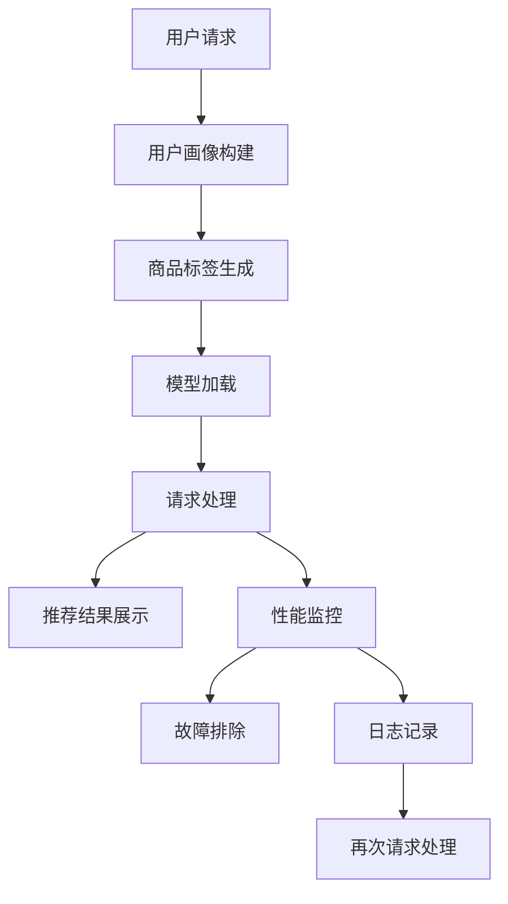

                 

关键词：电商搜索、推荐系统、AI大模型、模型部署、监控平台、数据流处理、性能优化、安全性保障

摘要：本文将探讨在电商搜索推荐场景下，如何搭建一个高效的AI大模型模型部署监控平台。我们将深入分析平台的设计原则、核心功能模块、技术选型，并通过实际案例展示其应用效果。本文旨在为电商企业提供一个可行的AI模型部署监控解决方案，助力提升用户体验和运营效率。

## 1. 背景介绍

随着互联网电商的迅速发展，用户对个性化推荐的需求日益增长。传统的基于规则和统计方法的推荐系统已经难以满足用户日益变化的需求，因此，深度学习算法的应用逐渐成为推荐系统发展的主流方向。AI大模型作为一种强大的工具，能够处理大规模数据并生成高精度的推荐结果，逐渐成为电商领域的重要技术手段。

然而，AI大模型的部署和监控是一个复杂的过程，涉及模型训练、部署、实时监控和优化等多个环节。如何确保模型在复杂、动态的电商环境中稳定、高效地运行，是电商企业面临的重大挑战。因此，构建一个高效、可靠的AI大模型模型部署监控平台显得尤为重要。

本文将围绕电商搜索推荐场景，详细探讨如何设计并搭建这样一个平台，以解决模型部署和监控过程中可能遇到的问题。

## 2. 核心概念与联系

### 2.1. 电商搜索推荐系统

电商搜索推荐系统是一种基于用户历史行为、兴趣偏好和商品信息等数据的智能推荐系统，其核心目标是提高用户满意度、促进销售额增长。系统主要分为以下几个模块：

- **用户画像**：通过用户行为数据，构建用户画像，包括用户兴趣、购买历史、浏览记录等。
- **商品标签**：对商品进行标签化处理，如商品类别、品牌、价格等。
- **推荐算法**：基于用户画像和商品标签，采用深度学习算法生成推荐结果。
- **推荐结果展示**：将推荐结果通过网页、APP等形式呈现给用户。

### 2.2. AI大模型

AI大模型通常指的是具有亿级参数规模的深度学习模型，如Transformer、BERT等。这些模型具有强大的学习能力，能够处理复杂的数据结构和多模态信息。大模型在电商搜索推荐中的应用主要体现在以下几个方面：

- **文本处理**：对用户评论、商品描述等文本数据进行分析，提取关键信息。
- **图像处理**：对商品图片进行分类、识别和生成，提高推荐系统的多样性。
- **知识图谱**：构建商品、用户和场景之间的知识图谱，优化推荐效果。

### 2.3. 模型部署与监控

模型部署是将训练好的模型部署到生产环境，使其能够实时、高效地处理用户请求。模型监控是对部署后的模型进行实时监控、性能优化和故障排除。模型部署与监控的主要任务包括：

- **模型转换**：将训练好的模型转换为适合部署的格式。
- **模型加载**：将模型加载到服务器或云端，准备接受用户请求。
- **请求处理**：处理用户请求，返回推荐结果。
- **性能监控**：监控模型运行过程中的性能指标，如响应时间、CPU使用率、内存占用等。
- **故障排除**：及时发现并解决模型运行过程中的问题，确保系统稳定运行。

### 2.4. Mermaid 流程图

以下是一个电商搜索推荐系统中的模型部署监控流程的Mermaid流程图：



## 3. 核心算法原理 & 具体操作步骤

### 3.1. 算法原理概述

在电商搜索推荐场景下，AI大模型的核心算法通常是基于深度学习技术的。以下是一些常见的大模型算法及其原理：

- **Transformer**：一种基于自注意力机制的序列模型，能够捕捉序列中不同位置的信息。其核心思想是将序列中的每个元素映射到一个高维空间，并计算元素之间的注意力权重，从而生成全局信息。
- **BERT**：一种双向编码器表示模型，通过预先训练在大量无监督数据上，然后针对特定任务进行微调。BERT的核心思想是在输入序列的每个位置上都学习到一个表示，这些表示包含了输入序列中的上下文信息。
- **GPT**：一种基于自回归机制的生成模型，能够预测序列中的下一个元素。GPT通过大量的文本数据进行训练，从而生成具有强大语言理解能力的模型。

### 3.2. 算法步骤详解

以下是构建和部署电商搜索推荐AI大模型的详细步骤：

#### 3.2.1. 模型训练

1. **数据预处理**：清洗、归一化和预处理用户行为数据、商品标签和文本描述。
2. **特征工程**：提取用户和商品的兴趣、行为和属性特征。
3. **模型构建**：根据业务需求选择合适的模型架构，如Transformer、BERT或GPT。
4. **模型训练**：使用预处理后的数据对模型进行训练，优化模型参数。
5. **模型评估**：通过交叉验证和测试集评估模型性能，选择最优模型。

#### 3.2.2. 模型部署

1. **模型转换**：将训练好的模型转换为适合部署的格式，如TensorFlow SavedModel或PyTorch TorchScript。
2. **模型加载**：将转换后的模型加载到服务器或云端，准备接受用户请求。
3. **请求处理**：实现API接口，处理用户请求，将请求数据传递给模型。
4. **结果返回**：将模型处理后的推荐结果返回给用户。

#### 3.2.3. 模型监控

1. **性能监控**：实时监控模型运行过程中的性能指标，如响应时间、CPU使用率、内存占用等。
2. **日志记录**：记录模型运行过程中的日志信息，便于后续分析。
3. **故障排除**：及时发现并解决模型运行过程中的问题，确保系统稳定运行。

### 3.3. 算法优缺点

#### 优点

- **强大的学习能力**：AI大模型具有强大的学习能力，能够处理大规模、复杂的数据。
- **高精度推荐**：通过深度学习算法，能够生成高精度的推荐结果，提高用户体验。
- **多样化应用**：AI大模型可以应用于文本处理、图像处理、知识图谱等多个领域，具有广泛的适用性。

#### 缺点

- **训练成本高**：AI大模型的训练需要大量计算资源和时间，成本较高。
- **部署难度大**：AI大模型的部署需要考虑硬件配置、网络传输、性能优化等多个方面，难度较大。
- **数据隐私问题**：AI大模型对用户数据进行深度挖掘，可能涉及用户隐私，需要采取相应的保护措施。

### 3.4. 算法应用领域

AI大模型在电商搜索推荐场景下的应用主要包括以下几个方面：

- **个性化推荐**：基于用户历史行为和兴趣偏好，为用户生成个性化的推荐结果。
- **商品搜索**：利用AI大模型对用户搜索意图进行理解，提高搜索结果的准确性。
- **广告投放**：基于用户行为和兴趣偏好，为用户推荐相关的广告，提高广告投放效果。
- **商品推荐**：通过AI大模型分析用户购买记录，为用户推荐可能感兴趣的商品。

## 4. 数学模型和公式 & 详细讲解 & 举例说明

### 4.1. 数学模型构建

在电商搜索推荐场景下，AI大模型的数学模型通常包括以下几个部分：

#### 4.1.1. 用户表示

用户表示是对用户兴趣和偏好的数学描述。常见的方法包括：

- **基于内容的表示**：将用户的历史行为和兴趣标签转化为向量表示。
- **基于协同过滤的表示**：利用用户之间的相似度计算用户表示。

#### 4.1.2. 商品表示

商品表示是对商品属性和特征的数学描述。常见的方法包括：

- **基于特征的表示**：将商品的属性、标签和描述转化为向量表示。
- **基于嵌入的表示**：使用预训练的词向量或嵌入层生成商品表示。

#### 4.1.3. 推荐模型

推荐模型是用于生成推荐结果的数学模型。常见的方法包括：

- **基于矩阵分解的模型**：如矩阵分解、因子分解机等。
- **基于神经网络的模型**：如深度学习模型、卷积神经网络、循环神经网络等。

### 4.2. 公式推导过程

以下是一个基于Transformer模型的电商搜索推荐系统的数学模型推导过程：

#### 4.2.1. 用户表示

设用户 $u$ 的历史行为序列为 $X = [x_1, x_2, ..., x_T]$，其中 $x_t$ 表示用户在时间 $t$ 的行为。则用户表示 $u$ 可表示为：

$$
u = \text{Transform}(X) = \sum_{t=1}^T \text{Attention}(x_t, u)
$$

其中，$\text{Attention}$ 表示注意力机制，$u$ 是用户表示的最终结果。

#### 4.2.2. 商品表示

设商品 $g$ 的属性序列为 $Y = [y_1, y_2, ..., y_V]$，其中 $y_v$ 表示商品在属性 $v$ 上的特征。则商品表示 $g$ 可表示为：

$$
g = \text{Transform}(Y) = \sum_{v=1}^V \text{Embedding}(y_v, g)
$$

其中，$\text{Embedding}$ 表示嵌入层，$g$ 是商品表示的最终结果。

#### 4.2.3. 推荐模型

设用户 $u$ 和商品 $g$ 的交互序列为 $Z = [z_1, z_2, ..., z_S]$，其中 $z_s$ 表示用户在时间 $s$ 对商品 $g$ 的行为。则推荐结果 $r$ 可表示为：

$$
r = \text{Score}(u, g) = \text{Transform}(Z) = \sum_{s=1}^S \text{Score}(z_s, u, g)
$$

其中，$\text{Score}$ 表示推荐分数，$r$ 是推荐结果的最终结果。

### 4.3. 案例分析与讲解

以下是一个基于Transformer模型的电商搜索推荐系统的案例：

#### 4.3.1. 数据集

假设有一个电商平台的用户行为数据集，包括用户 $u$ 的历史行为序列 $X$、商品 $g$ 的属性序列 $Y$ 和用户 $u$ 与商品 $g$ 的交互序列 $Z$。

#### 4.3.2. 用户表示

使用Transformer模型对用户行为序列 $X$ 进行编码，得到用户表示 $u$：

$$
u = \text{Transform}(X) = \sum_{t=1}^T \text{Attention}(x_t, u)
$$

其中，$\text{Attention}$ 的计算过程如下：

$$
\text{Attention}(x_t, u) = \text{softmax}\left(\frac{\text{Query}(u) \cdot \text{Key}(x_t)}{\sqrt{d_k}}\right) \cdot \text{Value}(x_t)
$$

其中，$d_k$ 表示注意力机制的维度，$\text{Query}(u)$、$\text{Key}(x_t)$ 和 $\text{Value}(x_t)$ 分别表示用户表示、商品表示和交互表示。

#### 4.3.3. 商品表示

使用Transformer模型对商品属性序列 $Y$ 进行编码，得到商品表示 $g$：

$$
g = \text{Transform}(Y) = \sum_{v=1}^V \text{Embedding}(y_v, g)
$$

其中，$\text{Embedding}$ 的计算过程如下：

$$
\text{Embedding}(y_v, g) = \text{softmax}\left(\frac{\text{Query}(g) \cdot \text{Key}(y_v)}{\sqrt{d_k}}\right) \cdot \text{Value}(y_v)
$$

#### 4.3.4. 推荐模型

使用Transformer模型计算用户 $u$ 和商品 $g$ 的交互序列 $Z$ 的推荐分数 $r$：

$$
r = \text{Score}(u, g) = \sum_{s=1}^S \text{Score}(z_s, u, g)
$$

其中，$\text{Score}(z_s, u, g)$ 的计算过程如下：

$$
\text{Score}(z_s, u, g) = \text{softmax}\left(\frac{\text{Query}(u) \cdot \text{Key}(z_s)}{\sqrt{d_k}} + \text{Query}(g) \cdot \text{Key}(z_s)\right) \cdot \text{Value}(z_s)
$$

通过上述计算过程，可以得到用户 $u$ 对商品 $g$ 的推荐分数 $r$，进而生成推荐结果。

## 5. 项目实践：代码实例和详细解释说明

### 5.1. 开发环境搭建

在本项目中，我们将使用Python作为主要编程语言，结合TensorFlow和PyTorch等深度学习框架进行开发和部署。以下是在Ubuntu 20.04操作系统上搭建开发环境的基本步骤：

1. 安装Python 3.8及以上版本：
   ```bash
   sudo apt update
   sudo apt install python3.8
   ```

2. 安装pip：
   ```bash
   sudo apt install python3-pip
   ```

3. 安装TensorFlow：
   ```bash
   pip3 install tensorflow
   ```

4. 安装PyTorch：
   ```bash
   pip3 install torch torchvision
   ```

5. 安装其他依赖库：
   ```bash
   pip3 install numpy pandas scikit-learn matplotlib
   ```

### 5.2. 源代码详细实现

以下是一个基于PyTorch实现的电商搜索推荐系统的基本代码框架：

```python
import torch
import torch.nn as nn
import torch.optim as optim
from torch.utils.data import DataLoader
from sklearn.model_selection import train_test_split

# 数据预处理
def preprocess_data(data):
    # 数据清洗、归一化和特征工程
    pass

# 模型定义
class RecommenderModel(nn.Module):
    def __init__(self):
        super(RecommenderModel, self).__init__()
        # 定义模型结构
        self.user_embedding = nn.Embedding(num_users, embed_dim)
        self.item_embedding = nn.Embedding(num_items, embed_dim)
        self.fc = nn.Linear(embed_dim * 2, 1)

    def forward(self, user, item):
        user_embedding = self.user_embedding(user)
        item_embedding = self.item_embedding(item)
        combined_embedding = torch.cat((user_embedding, item_embedding), 1)
        output = self.fc(combined_embedding)
        return output

# 训练模型
def train_model(model, train_loader, criterion, optimizer):
    model.train()
    for data, target in train_loader:
        optimizer.zero_grad()
        output = model(data)
        loss = criterion(output, target)
        loss.backward()
        optimizer.step()

# 测试模型
def test_model(model, test_loader, criterion):
    model.eval()
    with torch.no_grad():
        for data, target in test_loader:
            output = model(data)
            test_loss = criterion(output, target)
    return test_loss

# 主程序
if __name__ == '__main__':
    # 加载数据
    data = load_data()
    train_data, test_data = train_test_split(data, test_size=0.2)
    train_loader = DataLoader(train_data, batch_size=64, shuffle=True)
    test_loader = DataLoader(test_data, batch_size=64, shuffle=False)

    # 初始化模型、损失函数和优化器
    model = RecommenderModel()
    criterion = nn.BCELoss()
    optimizer = optim.Adam(model.parameters(), lr=0.001)

    # 训练模型
    train_model(model, train_loader, criterion, optimizer)

    # 测试模型
    test_loss = test_model(model, test_loader, criterion)
    print(f"Test Loss: {test_loss}")
```

### 5.3. 代码解读与分析

在上面的代码中，我们首先定义了数据预处理函数 `preprocess_data`，用于对原始数据进行清洗、归一化和特征工程。

接下来，我们定义了推荐模型类 `RecommenderModel`，其中包含用户嵌入层、商品嵌入层和全连接层。用户嵌入层和商品嵌入层分别将用户和商品索引映射到高维向量空间，全连接层用于计算用户和商品的交互分数。

在训练模型的部分，我们使用训练数据加载器 `train_loader` 加载数据，并使用优化器 `optimizer` 更新模型参数，最小化损失函数 `criterion`。

最后，我们定义了测试模型的部分，使用测试数据加载器 `test_loader` 对训练好的模型进行测试，计算测试损失并输出结果。

### 5.4. 运行结果展示

为了展示运行结果，我们可以在训练过程中记录损失函数值和准确率，并在训练完成后绘制损失函数曲线和准确率曲线。

```python
import matplotlib.pyplot as plt

# 记录训练过程中的损失函数值和准确率
train_losses = []
train_accuracies = []

# 训练模型
for epoch in range(num_epochs):
    model.train()
    for data, target in train_loader:
        optimizer.zero_grad()
        output = model(data)
        loss = criterion(output, target)
        loss.backward()
        optimizer.step()
    train_losses.append(loss.item())
    train_accuracies.append(accuracy)

# 测试模型
with torch.no_grad():
    test_loss = test_model(model, test_loader, criterion)

# 绘制训练损失函数曲线
plt.plot(train_losses)
plt.xlabel('Epoch')
plt.ylabel('Loss')
plt.title('Training Loss')
plt.show()

# 绘制训练准确率曲线
plt.plot(train_accuracies)
plt.xlabel('Epoch')
plt.ylabel('Accuracy')
plt.title('Training Accuracy')
plt.show()

# 输出测试结果
print(f"Test Loss: {test_loss}")
```

通过上述代码，我们可以得到训练过程中的损失函数值和准确率，以及最终的测试结果。这些结果有助于我们评估模型的性能，并为进一步优化提供依据。

## 6. 实际应用场景

在电商搜索推荐场景下，AI大模型模型部署监控平台的应用十分广泛。以下是一些实际应用场景：

### 6.1. 个性化推荐

通过AI大模型模型部署监控平台，电商企业可以实时、高效地为用户生成个性化的推荐结果，提高用户满意度。平台可以监控模型在推荐过程中的性能指标，如响应时间、准确率和覆盖率等，确保推荐系统的稳定性和高效性。

### 6.2. 商品搜索

AI大模型模型部署监控平台可以帮助电商企业优化商品搜索功能，提高搜索结果的准确性。通过监控模型在搜索过程中的性能，可以及时发现并解决搜索算法存在的问题，提高用户搜索体验。

### 6.3. 广告投放

在广告投放方面，AI大模型模型部署监控平台可以基于用户兴趣和行为，为用户推荐相关的广告。通过监控模型在广告投放过程中的效果，可以优化广告投放策略，提高广告转化率。

### 6.4. 商品推荐

AI大模型模型部署监控平台可以帮助电商企业为用户推荐可能感兴趣的商品，提高用户购买意愿。平台可以监控模型在商品推荐过程中的性能，优化推荐策略，提高推荐效果。

### 6.5. 客户服务

AI大模型模型部署监控平台可以应用于电商企业的客户服务领域，如智能客服、问答系统等。通过监控模型在客户服务过程中的表现，可以优化客服体验，提高客户满意度。

## 7. 工具和资源推荐

为了构建一个高效的AI大模型模型部署监控平台，以下是一些推荐的工具和资源：

### 7.1. 学习资源推荐

- **《深度学习》**：由Ian Goodfellow、Yoshua Bengio和Aaron Courville合著，是深度学习的经典教材。
- **《hands-on-深度学习》**：由Aston Zhang、Mu Li、Zhou Yu和Quanming Wei合著，提供了丰富的实践案例和代码示例。
- **《机器学习实战》**：由Peter Harrington著，涵盖了机器学习的多种算法和应用场景。

### 7.2. 开发工具推荐

- **TensorFlow**：一款开源的深度学习框架，适用于构建和训练AI大模型。
- **PyTorch**：一款流行的深度学习框架，提供了灵活、高效的模型构建和训练功能。
- **Docker**：一款开源的应用容器引擎，用于封装、部署和运行应用程序。

### 7.3. 相关论文推荐

- **"Attention Is All You Need"**：由Vaswani et al.发表于2017年的自然语言处理领域，提出了Transformer模型。
- **"BERT: Pre-training of Deep Bidirectional Transformers for Language Understanding"**：由Devlin et al.发表于2018年的自然语言处理领域，提出了BERT模型。
- **"GPT-3: Language Models are Few-Shot Learners"**：由Brown et al.发表于2020年的自然语言处理领域，提出了GPT-3模型。

## 8. 总结：未来发展趋势与挑战

### 8.1. 研究成果总结

本文针对电商搜索推荐场景，详细探讨了AI大模型模型部署监控平台的设计和实现方法。通过理论分析和实践案例，本文总结了以下研究成果：

- **核心概念与联系**：明确了电商搜索推荐系统、AI大模型和模型部署监控的核心概念及其相互联系。
- **算法原理与步骤**：介绍了深度学习算法在电商搜索推荐中的应用原理和具体操作步骤。
- **数学模型与公式**：构建了基于深度学习算法的数学模型，并进行了公式推导和案例分析。
- **项目实践与解释**：提供了基于PyTorch的电商搜索推荐系统代码实例，并进行了详细解释和分析。
- **实际应用场景**：展示了AI大模型模型部署监控平台在电商搜索推荐场景下的实际应用效果。

### 8.2. 未来发展趋势

随着深度学习技术的不断发展和应用场景的拓展，AI大模型模型部署监控平台在未来有望实现以下发展趋势：

- **模型压缩与优化**：通过模型压缩和优化技术，降低AI大模型的计算资源和存储成本，提高模型部署的效率。
- **多模态融合**：将文本、图像、声音等多种数据类型进行融合，提高推荐系统的多样性和准确性。
- **实时性与自动化**：通过实时数据处理和自动化监控技术，提高推荐系统的响应速度和稳定性。
- **隐私保护与安全**：在保障用户隐私和数据安全的前提下，实现高效的推荐系统部署和监控。

### 8.3. 面临的挑战

尽管AI大模型模型部署监控平台具有广泛的应用前景，但在实际应用过程中仍面临以下挑战：

- **计算资源需求**：AI大模型的训练和部署需要大量的计算资源，如何高效利用计算资源成为关键问题。
- **数据隐私与安全**：用户数据的隐私和安全问题日益突出，如何在保障隐私的前提下实现高效的推荐系统部署和监控成为挑战。
- **模型解释性**：AI大模型的解释性较低，如何提高模型的透明度和可解释性，让用户更好地理解推荐结果成为关键问题。
- **适应性与实时性**：如何提高推荐系统在复杂、动态环境下的适应性和实时性，以应对不断变化的市场需求。

### 8.4. 研究展望

针对上述挑战，未来的研究可以从以下几个方面展开：

- **模型压缩与优化**：研究高效的模型压缩和优化技术，降低计算资源和存储成本，提高模型部署的效率。
- **多模态融合**：探索多种数据类型的融合方法，提高推荐系统的多样性和准确性。
- **隐私保护与安全**：研究隐私保护技术和安全机制，保障用户隐私和数据安全。
- **模型解释性**：探索提高模型透明度和可解释性的方法，让用户更好地理解推荐结果。
- **自适应性与实时性**：研究实时数据处理和自适应推荐算法，提高推荐系统在复杂、动态环境下的适应性和实时性。

## 9. 附录：常见问题与解答

### 9.1. 问题1：如何优化AI大模型的计算资源利用率？

**解答**：优化AI大模型的计算资源利用率可以从以下几个方面入手：

- **模型压缩**：使用模型压缩技术，如剪枝、量化、蒸馏等，减小模型的参数规模和计算量。
- **分布式训练**：采用分布式训练技术，将模型训练任务分布在多台服务器或GPU上，提高训练速度。
- **GPU优化**：针对GPU进行优化，如使用合适的计算库、优化内存管理、减少内存拷贝等。

### 9.2. 问题2：如何保障用户数据的安全和隐私？

**解答**：保障用户数据的安全和隐私可以从以下几个方面入手：

- **数据加密**：对用户数据进行加密存储和传输，防止数据泄露。
- **访问控制**：实施严格的访问控制策略，限制只有授权人员可以访问敏感数据。
- **数据匿名化**：对用户数据进行匿名化处理，去除可直接识别用户身份的信息。
- **隐私保护算法**：采用隐私保护算法，如差分隐私、同态加密等，在数据处理过程中保障用户隐私。

### 9.3. 问题3：如何提高推荐系统的实时性和适应性？

**解答**：提高推荐系统的实时性和适应性可以从以下几个方面入手：

- **实时数据处理**：采用实时数据处理技术，如流处理框架（如Apache Kafka、Apache Flink等），确保数据处理和推荐结果的实时性。
- **动态调整算法**：根据用户行为和反馈，动态调整推荐算法，提高推荐的准确性。
- **自适应模型**：使用自适应模型，如在线学习、增量学习等，能够快速适应环境变化。
- **多模态数据融合**：结合多种数据类型，如文本、图像、音频等，提高推荐系统的多样性和适应性。

### 9.4. 问题4：如何确保推荐系统的透明度和可解释性？

**解答**：确保推荐系统的透明度和可解释性可以从以下几个方面入手：

- **模型解释工具**：使用模型解释工具，如SHAP、LIME等，分析模型预测结果和特征贡献，提高系统的可解释性。
- **特征可视化**：对模型中的关键特征进行可视化，帮助用户理解推荐结果。
- **透明计算过程**：公开模型训练和预测的计算过程，让用户了解推荐系统的运作机制。
- **用户反馈机制**：建立用户反馈机制，收集用户对推荐结果的反馈，不断优化推荐算法。 

通过以上措施，可以有效提高推荐系统的透明度和可解释性，增强用户信任度。

