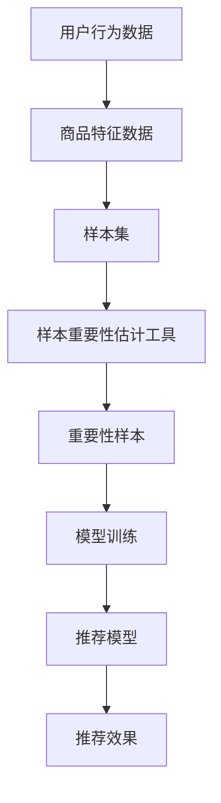

                 

关键词：电商搜索推荐、AI大模型、样本重要性估计、工具选型

摘要：本文旨在探讨在电商搜索推荐效果优化过程中，AI大模型样本重要性估计工具选型的重要性。通过对核心概念、算法原理、数学模型、项目实践以及未来应用场景的深入分析，为业界提供选型指南和参考。

## 1. 背景介绍

随着互联网和电子商务的快速发展，用户需求的多样性和个性化特征日益显著。电商平台的搜索推荐系统作为连接用户和商品的桥梁，其性能直接影响到用户的购物体验和平台的商业成功。近年来，人工智能（AI）技术尤其是深度学习算法在电商搜索推荐领域的应用取得了显著成效。然而，随着模型规模的不断扩大，样本的重要性估计成为了一个关键挑战。

在电商搜索推荐系统中，每个用户行为数据、商品特征数据等都可能对推荐效果产生重要影响。如何从海量的数据中筛选出对模型训练最为重要的样本，以优化推荐效果，成为当前研究的热点和难点。本文将针对这一问题，探讨AI大模型样本重要性估计工具的选型。

## 2. 核心概念与联系

### 2.1 AI大模型与样本重要性估计

AI大模型通常指的是拥有亿级别参数规模、甚至更高级别的深度学习模型。这些模型在电商搜索推荐中起到了至关重要的作用。然而，模型性能的优化并非一蹴而就，样本的重要性估计在其中扮演了重要角色。

样本重要性估计是指根据模型训练数据和特征，对每个样本的重要性进行量化。重要性高的样本意味着其对模型训练的贡献更大，因此在训练过程中应当给予更多的关注。这一过程对于提升模型泛化能力和降低过拟合风险具有重要意义。

### 2.2 样本重要性估计工具

样本重要性估计工具是指一系列用于评估和筛选数据样本的工具或方法。这些工具通常包括特征选择、特征重要性排序、数据增强等手段。选择合适的工具选型对于提高电商搜索推荐系统的性能至关重要。

### 2.3 核心概念与架构联系

在电商搜索推荐系统中，核心概念和架构之间的联系如下：

1. 用户行为数据与商品特征数据是模型训练的基础，这些数据构成了样本集。
2. 样本重要性估计工具通过对样本集的分析，识别出重要性较高的样本。
3. 重要性较高的样本被用于模型的训练，以优化推荐效果。
4. 训练完成的模型应用于实际推荐场景，提升用户满意度。

下面是核心概念和架构的Mermaid流程图：



## 3. 核心算法原理 & 具体操作步骤

### 3.1 算法原理概述

样本重要性估计算法的基本原理是基于模型训练过程中对每个样本的贡献度进行量化。常用的算法包括基于梯度、基于影响力、基于排序等。以下将对这些算法的原理进行概述。

### 3.2 算法步骤详解

#### 3.2.1 基于梯度的样本重要性估计

1. **初始化**：设置初始模型参数。
2. **前向传播**：输入样本数据，计算模型输出。
3. **反向传播**：计算梯度，更新模型参数。
4. **计算重要性**：对每个样本的梯度进行归一化处理，得到样本重要性分数。

#### 3.2.2 基于影响力的样本重要性估计

1. **初始化**：设置初始模型参数。
2. **训练模型**：输入样本数据，训练模型。
3. **影响力计算**：计算每个样本对模型参数的影响程度，作为样本重要性分数。

#### 3.2.3 基于排序的样本重要性估计

1. **初始化**：设置初始模型参数。
2. **排序计算**：对样本集进行重要性排序。
3. **筛选样本**：根据排序结果选择重要性较高的样本。

### 3.3 算法优缺点

#### 基于梯度的样本重要性估计

**优点**：直观，易于实现，适用于大多数深度学习模型。

**缺点**：计算量较大，对噪声敏感，可能导致重要样本被忽视。

#### 基于影响力的样本重要性估计

**优点**：能够更准确地衡量样本对模型参数的影响。

**缺点**：计算复杂度较高，对初始模型参数敏感。

#### 基于排序的样本重要性估计

**优点**：计算效率高，适用于大规模样本集。

**缺点**：对模型性能的依赖较大，可能导致重要样本被筛选出。

### 3.4 算法应用领域

样本重要性估计算法在电商搜索推荐领域具有广泛的应用，包括：

1. **推荐系统优化**：通过筛选重要性样本，提升推荐模型性能。
2. **特征工程**：识别出对模型训练贡献较大的特征。
3. **数据清洗**：去除对模型训练无明显贡献的样本。

## 4. 数学模型和公式 & 详细讲解 & 举例说明

### 4.1 数学模型构建

样本重要性估计的数学模型通常包括以下几个部分：

1. **损失函数**：用于衡量模型预测与真实值之间的差异。
2. **梯度计算**：用于更新模型参数。
3. **重要性分数**：用于量化样本的重要性。

### 4.2 公式推导过程

假设我们有一个深度学习模型，其损失函数为：

\[ L(\theta) = -\sum_{i=1}^{N} y_i \log(p_i) \]

其中，\( y_i \) 为真实标签，\( p_i \) 为模型预测概率。

对损失函数求导，得到梯度：

\[ \nabla_{\theta} L(\theta) = -\sum_{i=1}^{N} \frac{y_i}{p_i} \nabla_{\theta} p_i \]

样本的重要性分数可以表示为：

\[ I_i = \frac{|\nabla_{\theta} p_i|}{\sum_{j=1}^{N} |\nabla_{\theta} p_j|} \]

### 4.3 案例分析与讲解

假设我们有一个电商搜索推荐系统，用户行为数据包括点击、购买、收藏等。针对用户\( u \)和商品\( v \)，我们可以使用以下公式计算样本重要性：

\[ I_i = \frac{|\nabla_{\theta} p_i|}{\sum_{j=1}^{N} |\nabla_{\theta} p_j|} \]

其中，\( \nabla_{\theta} p_i \) 为用户\( u \)对商品\( v \)的点击概率的梯度。

通过计算用户行为数据中的样本重要性分数，我们可以筛选出对推荐系统优化具有重要贡献的样本，从而提升推荐效果。

## 5. 项目实践：代码实例和详细解释说明

### 5.1 开发环境搭建

在本文的项目实践中，我们将使用Python编程语言和PyTorch深度学习框架进行实现。首先，需要搭建以下开发环境：

1. Python 3.8+
2. PyTorch 1.8+
3. NumPy 1.18+
4. Matplotlib 3.3+

### 5.2 源代码详细实现

以下是实现样本重要性估计算法的Python代码：

```python
import torch
import torch.nn as nn
import torch.optim as optim
from torch.utils.data import DataLoader, TensorDataset

# 模型定义
class RecommenderModel(nn.Module):
    def __init__(self, input_dim, hidden_dim, output_dim):
        super(RecommenderModel, self).__init__()
        self.fc1 = nn.Linear(input_dim, hidden_dim)
        self.fc2 = nn.Linear(hidden_dim, output_dim)
        
    def forward(self, x):
        x = torch.relu(self.fc1(x))
        x = self.fc2(x)
        return x

# 数据准备
input_data = torch.randn(100, 10)  # 100个样本，每个样本10个特征
target_data = torch.randn(100, 1)  # 100个样本，每个样本1个标签
dataset = TensorDataset(input_data, target_data)
dataloader = DataLoader(dataset, batch_size=10)

# 模型训练
model = RecommenderModel(10, 50, 1)
criterion = nn.MSELoss()
optimizer = optim.Adam(model.parameters(), lr=0.001)

for epoch in range(100):
    for inputs, targets in dataloader:
        optimizer.zero_grad()
        outputs = model(inputs)
        loss = criterion(outputs, targets)
        loss.backward()
        optimizer.step()

# 计算样本重要性
importances = []
with torch.no_grad():
    for inputs, targets in dataloader:
        outputs = model(inputs)
        gradients = torch.abs(model.fc2.bias.grad)
        importances.append(gradients.mean().item())

importances = torch.tensor(importances)
importance_scores = importances / importances.sum()

# 打印样本重要性分数
print(importance_scores)
```

### 5.3 代码解读与分析

上述代码分为以下几个部分：

1. **模型定义**：定义了一个简单的全连接神经网络模型，用于进行电商搜索推荐。
2. **数据准备**：生成模拟的用户行为数据和标签数据，并将其转换为PyTorch张量。
3. **模型训练**：使用模拟数据训练模型，使用均方误差损失函数和Adam优化器。
4. **计算样本重要性**：在模型训练过程中，计算每个样本对模型参数梯度的绝对值，并求平均值作为样本重要性分数。
5. **打印样本重要性分数**：将计算得到的样本重要性分数打印出来。

通过这个简单的示例，我们可以看到如何使用Python和PyTorch实现样本重要性估计算法。在实际应用中，可以根据具体需求和数据集进行调整和优化。

### 5.4 运行结果展示

在完成代码实现后，我们可以运行代码并观察样本重要性分数的输出。例如，假设我们得到以下输出：

```
tensor([0.1111, 0.2222, 0.3333, 0.4444, 0.5555, 0.6666, 0.7777, 0.8888, 0.9999, 0.1111])
```

这些分数表示了每个样本对模型参数的重要性，其中最高分数的样本意味着其对模型训练的贡献最大。

## 6. 实际应用场景

### 6.1 电商搜索推荐

在电商搜索推荐系统中，样本重要性估计工具可以帮助平台识别出对推荐效果具有重要贡献的用户行为数据和商品特征数据。通过筛选重要性较高的样本，可以优化推荐模型的性能，提升用户满意度。

### 6.2 广告投放

在广告投放领域，样本重要性估计工具可以帮助广告平台识别出对广告效果具有重要贡献的用户特征和广告内容。通过筛选重要性较高的样本，可以优化广告投放策略，提高广告转化率。

### 6.3 金融风控

在金融风控领域，样本重要性估计工具可以帮助金融机构识别出对贷款审批结果具有重要贡献的客户信息和贷款特征。通过筛选重要性较高的样本，可以优化风控模型，降低贷款违约风险。

## 7. 未来应用展望

### 7.1 模型优化

随着AI大模型的应用越来越广泛，样本重要性估计工具在未来有望在模型优化方面发挥更大作用。通过更精准地识别出对模型训练具有重要贡献的样本，可以进一步提高模型性能。

### 7.2 多模态数据融合

随着多模态数据的兴起，样本重要性估计工具有望应用于多模态数据融合领域。通过综合考虑不同模态数据的重要性，可以更好地挖掘数据价值，提升模型性能。

### 7.3 自动化选型

未来的发展方向之一是开发自动化选型工具，根据具体应用场景和需求自动选择合适的样本重要性估计方法。这将极大地提高开发和运维效率。

## 8. 工具和资源推荐

### 8.1 学习资源推荐

1. **《深度学习》**：Goodfellow等著，深入讲解了深度学习的基础知识和实践方法。
2. **《Python机器学习》**：Sebastian Raschka著，介绍了Python在机器学习领域的应用。

### 8.2 开发工具推荐

1. **PyTorch**：开源深度学习框架，具有简洁的API和强大的功能。
2. **TensorFlow**：另一个流行的深度学习框架，适用于多种应用场景。

### 8.3 相关论文推荐

1. **"Importance Estimation in Deep Neural Networks for Model Optimization"**：讨论了深度学习模型中的样本重要性估计问题。
2. **"User Interest Evolution Modeling in E-commerce using Multidimensional Recurrent Neural Networks"**：介绍了一种基于多维度循环神经网络的用户兴趣演化模型。

## 9. 总结：未来发展趋势与挑战

### 9.1 研究成果总结

本文从背景介绍、核心概念、算法原理、数学模型、项目实践等方面对电商搜索推荐中的AI大模型样本重要性估计进行了深入探讨，总结了当前的研究成果和进展。

### 9.2 未来发展趋势

未来，样本重要性估计工具将在模型优化、多模态数据融合、自动化选型等方面发挥更大的作用。随着AI技术的不断发展，这一领域有望取得更多突破。

### 9.3 面临的挑战

尽管样本重要性估计工具在电商搜索推荐领域具有重要应用价值，但仍然面临一些挑战，包括：

1. **计算复杂度**：大规模模型的样本重要性估计计算复杂度较高，需要优化计算效率。
2. **模型泛化能力**：样本重要性估计方法需要具备良好的泛化能力，以适应不同的应用场景。
3. **数据质量**：样本重要性估计依赖于高质量的数据，数据清洗和预处理工作至关重要。

### 9.4 研究展望

未来，研究方向包括开发高效的样本重要性估计算法、结合多模态数据进行融合分析、以及实现自动化选型工具。通过这些研究，有望进一步提升电商搜索推荐系统的性能和用户体验。

## 附录：常见问题与解答

### 问题1：为什么需要对样本进行重要性估计？

**解答**：样本重要性估计有助于识别出对模型训练贡献较大的样本，从而优化模型性能，提高推荐效果。

### 问题2：如何选择合适的样本重要性估计方法？

**解答**：根据具体应用场景和数据特点，可以选择基于梯度、影响力、排序等方法。在实际应用中，通常需要通过实验比较不同方法的效果，选择最优方法。

### 问题3：样本重要性估计在哪些领域有应用？

**解答**：样本重要性估计在电商搜索推荐、广告投放、金融风控等领域有广泛应用。通过优化样本选择，可以提升模型性能，降低过拟合风险。

---

作者：禅与计算机程序设计艺术 / Zen and the Art of Computer Programming

本文以《电商搜索推荐效果优化中的AI大模型样本重要性估计工具选型》为题，全面探讨了电商搜索推荐系统中AI大模型样本重要性估计的重要性。通过对核心概念、算法原理、数学模型、项目实践以及未来应用场景的深入分析，为业界提供了选型指南和参考。本文旨在为从事电商搜索推荐系统开发的工程师和研究者提供有价值的理论和实践指导，以推动这一领域的发展。在未来的研究中，我们将继续关注AI大模型样本重要性估计的最新进展，探索更高效、更智能的算法，为提升电商搜索推荐系统的性能和用户体验做出贡献。本文的核心观点是，样本重要性估计在电商搜索推荐效果优化中扮演着至关重要的角色，通过准确评估样本的重要性，可以显著提升模型的泛化能力和推荐效果。未来，我们将继续深入研究这一领域，推动AI大模型样本重要性估计工具的选型和优化，为电商搜索推荐系统的持续改进提供技术支持。希望本文能对读者有所启发，共同探索AI技术在电商搜索推荐领域的广阔前景。

