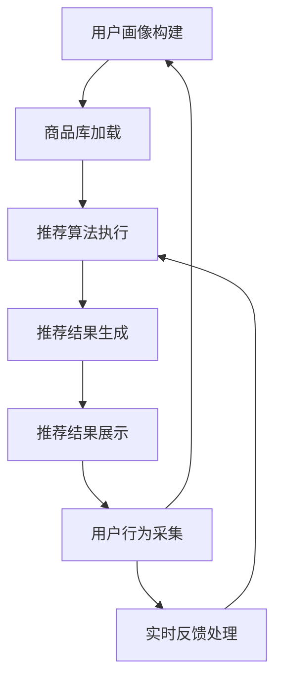

                 

关键词：电商搜索、推荐系统、AI大模型、实时反馈机制、效果评估

> 摘要：本文深入探讨了电商搜索推荐效果评估中的AI大模型实时反馈机制，从背景介绍、核心概念与联系、核心算法原理、数学模型和公式、项目实践、实际应用场景以及未来展望等多个方面进行详细阐述。通过对电商搜索推荐系统的深入分析，本文旨在为业界提供一套切实可行的AI大模型实时反馈机制，从而提升推荐系统的效果和用户体验。

## 1. 背景介绍

随着互联网技术的飞速发展，电商行业已经成为了全球经济增长的重要驱动力。在电商平台上，用户在搜索和浏览商品时，系统会根据用户的兴趣、行为和购买记录等因素，为其推荐相关的商品。这种基于用户行为的推荐系统已经成为电商平台提高用户粘性和销售额的关键技术手段。

然而，推荐系统的效果直接影响到用户的购物体验和平台的商业收益。如何准确评估推荐系统的效果，并实时调整推荐策略，成为一个亟待解决的问题。传统的评估方法往往依赖于离线的数据分析，无法及时反馈系统的运行情况。随着人工智能技术的发展，特别是AI大模型的兴起，为实时反馈机制提供了新的解决方案。

AI大模型具备强大的数据处理和分析能力，可以实时处理海量的用户数据，快速生成推荐结果，并通过实时反馈机制对推荐效果进行评估和调整。本文将围绕这一主题，探讨AI大模型在电商搜索推荐效果评估中的实时反馈机制。

## 2. 核心概念与联系

### 2.1 电商搜索推荐系统

电商搜索推荐系统是电商平台的核心功能之一，旨在为用户提供个性化的商品推荐。一个典型的电商搜索推荐系统包括以下几个关键组成部分：

- **用户画像**：通过收集用户的搜索历史、购买记录、浏览行为等数据，构建用户的兴趣模型。
- **商品库**：包含所有商品的详细信息，如价格、品牌、分类等。
- **推荐算法**：根据用户画像和商品库数据，使用算法生成个性化的推荐列表。
- **推荐结果展示**：将推荐结果展示给用户，吸引用户点击和购买。

### 2.2 AI大模型

AI大模型指的是基于深度学习技术的复杂神经网络模型，其结构通常包含数百万甚至数十亿个参数。这些模型通过大量的训练数据，学习到丰富的知识，可以处理高维度、复杂的任务。

AI大模型在电商搜索推荐系统中的应用主要体现在以下几个方面：

- **用户行为预测**：通过分析用户的搜索和购买行为，预测用户的兴趣和偏好。
- **商品关联推荐**：基于用户的行为和兴趣，为用户推荐相关联的商品。
- **实时反馈**：通过实时分析用户的行为数据，评估推荐效果，并调整推荐策略。

### 2.3 实时反馈机制

实时反馈机制是一种通过实时数据处理和分析，对推荐系统进行动态调整的方法。其核心思想是：

- **数据采集**：实时收集用户的行为数据。
- **数据处理**：对采集到的数据进行分析和处理，生成实时反馈。
- **策略调整**：根据实时反馈，调整推荐算法和策略，提高推荐效果。

实时反馈机制在电商搜索推荐系统中的具体应用包括：

- **个性化推荐**：根据用户的实时行为数据，动态调整推荐策略，提高个性化推荐的准确性。
- **实时调整**：在用户购买或浏览商品后，实时调整推荐结果，提高用户的购物体验。
- **效果评估**：通过实时反馈，评估推荐效果，为优化推荐系统提供依据。

### 2.4 Mermaid 流程图

以下是一个简单的Mermaid流程图，展示了电商搜索推荐系统中的核心概念和流程：



## 3. 核心算法原理 & 具体操作步骤

### 3.1 算法原理概述

电商搜索推荐效果评估中的AI大模型实时反馈机制主要基于以下核心算法原理：

- **用户行为分析**：通过分析用户的搜索、浏览和购买行为，构建用户的兴趣模型。
- **协同过滤**：利用用户之间的相似性，为用户推荐他们可能感兴趣的商品。
- **内容推荐**：基于商品的内容信息，如标题、描述、标签等，为用户推荐相关商品。
- **实时反馈处理**：通过实时分析用户的行为数据，动态调整推荐策略，提高推荐效果。

### 3.2 算法步骤详解

以下是AI大模型实时反馈机制的具体操作步骤：

#### 3.2.1 用户行为分析

1. **数据采集**：实时采集用户的搜索、浏览和购买行为数据。
2. **数据预处理**：对采集到的数据进行清洗、去重和归一化处理。
3. **特征提取**：提取用户的兴趣特征，如搜索关键词、浏览商品类别等。
4. **兴趣模型构建**：使用机器学习算法，如LSTM、GRU等，构建用户的兴趣模型。

#### 3.2.2 协同过滤

1. **相似度计算**：计算用户之间的相似度，如使用余弦相似度、皮尔逊相关系数等。
2. **推荐列表生成**：根据用户之间的相似度，为每个用户生成一个推荐列表。
3. **推荐结果排序**：对推荐结果进行排序，优先推荐相似度较高的商品。

#### 3.2.3 内容推荐

1. **商品内容提取**：提取商品的标题、描述、标签等文本信息。
2. **文本预处理**：对文本信息进行分词、去停用词、词向量化等预处理。
3. **内容相似度计算**：计算商品之间的内容相似度，如使用余弦相似度、BERT模型等。
4. **内容推荐生成**：根据用户兴趣模型和商品内容相似度，为用户生成内容推荐列表。

#### 3.2.4 实时反馈处理

1. **用户行为监测**：实时监测用户的搜索、浏览和购买行为。
2. **反馈数据采集**：采集用户对推荐结果的反馈数据，如点击、购买等。
3. **反馈数据处理**：对反馈数据进行分析和处理，评估推荐效果。
4. **策略调整**：根据反馈数据，动态调整推荐算法和策略，提高推荐效果。

### 3.3 算法优缺点

#### 优点

- **高精度**：通过深度学习和协同过滤算法，可以准确预测用户的兴趣和偏好。
- **实时性**：实时反馈机制可以快速调整推荐策略，提高推荐效果。
- **个性化**：根据用户的兴趣和行为，为用户生成个性化的推荐列表。

#### 缺点

- **计算成本高**：AI大模型需要大量的计算资源，对硬件设备要求较高。
- **数据隐私**：用户行为数据的实时采集和处理可能涉及到数据隐私问题。

### 3.4 算法应用领域

AI大模型实时反馈机制可以应用于多个领域，如：

- **电商推荐**：为用户提供个性化的商品推荐，提高销售额和用户粘性。
- **社交媒体**：为用户提供个性化内容推荐，提高用户活跃度和参与度。
- **金融领域**：为金融产品提供个性化推荐，提高用户投资收益率。

## 4. 数学模型和公式 & 详细讲解 & 举例说明

### 4.1 数学模型构建

在电商搜索推荐效果评估中，常用的数学模型包括用户行为分析模型、协同过滤模型和内容推荐模型。以下分别介绍这些模型的数学模型和公式。

#### 4.1.1 用户行为分析模型

用户行为分析模型主要用于预测用户的兴趣和偏好。常用的模型包括LSTM、GRU等循环神经网络。

- **LSTM模型**：
  - 激活函数：\[ \sigma(z) = \frac{1}{1 + e^{-z}} \]
  - 输出函数：\[ \hat{y} = \sigma(W_y \cdot \text{激活值} + b_y) \]
  - 损失函数：\[ \text{loss} = -\sum_{i=1}^{n} y_i \log(\hat{y}_i) \]

- **GRU模型**：
  - 更新门：\[ r_t = \sigma(W_r \cdot [h_{t-1}, x_t] + b_r) \]
  - 生成门：\[ z_t = \sigma(W_z \cdot [h_{t-1}, x_t] + b_z) \]
  - 输出：\[ h_t = z_t \cdot \text{激活值}_{\text{前一层}} + (1 - z_t) \cdot r_t \cdot \text{激活值}_{\text{当前层}} \]
  - 损失函数：\[ \text{loss} = -\sum_{i=1}^{n} y_i \log(\hat{y}_i) \]

#### 4.1.2 协同过滤模型

协同过滤模型主要用于为用户推荐相似度较高的商品。常用的模型包括基于用户的协同过滤（User-based Collaborative Filtering）和基于物品的协同过滤（Item-based Collaborative Filtering）。

- **基于用户的协同过滤**：
  - 相似度计算：\[ \sim(u, v) = \frac{\text{相同评分的项数}}{\sqrt{\sum_{i \in \text{共同评分项}} u_i^2 \cdot \sum_{i \in \text{共同评分项}} v_i^2}} \]
  - 推荐公式：\[ \text{预测评分} = \text{用户当前评分} + \text{相似度加权平均} \]

- **基于物品的协同过滤**：
  - 相似度计算：\[ \sim(i, j) = \frac{\text{相同用户的评分项数}}{\sqrt{\sum_{u \in \text{共同评分用户}} i_u^2 \cdot \sum_{u \in \text{共同评分用户}} j_u^2}} \]
  - 推荐公式：\[ \text{预测评分} = \text{用户当前评分} + \text{相似度加权平均} \]

#### 4.1.3 内容推荐模型

内容推荐模型主要用于为用户推荐内容相似的商品。常用的模型包括基于文本的相似度计算和基于神经网络的推荐模型。

- **基于文本的相似度计算**：
  - 文本向量表示：\[ \text{文本} \rightarrow \text{向量空间} \]
  - 相似度计算：\[ \sim(\text{文本}_1, \text{文本}_2) = \frac{\text{文本}_1 \cdot \text{文本}_2}{||\text{文本}_1|| \cdot ||\text{文本}_2||} \]

- **基于神经网络的推荐模型**：
  - 模型架构：\[ \text{输入层} \rightarrow \text{隐藏层} \rightarrow \text{输出层} \]
  - 损失函数：\[ \text{loss} = -\sum_{i=1}^{n} y_i \log(\hat{y}_i) \]

### 4.2 公式推导过程

以LSTM模型为例，介绍其公式推导过程。

#### 4.2.1 LSTM单元

LSTM单元由三个门控和一个记忆单元组成。门控用于控制信息流，记忆单元用于存储长期依赖信息。

- **遗忘门**：
  - 输入：\[ x_t, h_{t-1} \]
  - 遗忘门公式：\[ f_t = \sigma(W_f \cdot [h_{t-1}, x_t] + b_f) \]
  - 遗忘门作用：\[ \text{遗忘门} = f_t \cdot \text{当前记忆单元} \]

- **输入门**：
  - 输入：\[ x_t, h_{t-1} \]
  - 输入门公式：\[ i_t = \sigma(W_i \cdot [h_{t-1}, x_t] + b_i) \]
  - 输入门作用：\[ \text{输入门} = i_t \cdot x_t \]

- **输出门**：
  - 输入：\[ x_t, h_{t-1} \]
  - 输出门公式：\[ o_t = \sigma(W_o \cdot [h_{t-1}, x_t] + b_o) \]
  - 输出门作用：\[ \text{输出门} = o_t \cdot \text{当前记忆单元} \]

- **记忆单元**：
  - 输入：\[ x_t, h_{t-1} \]
  - 记忆单元公式：\[ g_t = \text{Tanh}(W_g \cdot [h_{t-1}, x_t] + b_g) \]
  - 记忆单元更新：\[ C_t = f_t \cdot C_{t-1} + i_t \cdot g_t \]

#### 4.2.2 LSTM输出

LSTM输出由隐藏层和细胞状态组成。

- **隐藏层**：
  - 输出公式：\[ h_t = o_t \cdot \text{Tanh}(C_t) \]

- **细胞状态**：
  - 更新公式：\[ C_t = f_t \cdot C_{t-1} + i_t \cdot g_t \]

#### 4.2.3 LSTM损失函数

LSTM损失函数用于优化模型参数，常用的损失函数包括交叉熵损失函数。

- **交叉熵损失函数**：
  - 损失函数公式：\[ \text{loss} = -\sum_{i=1}^{n} y_i \log(\hat{y}_i) \]
  - 其中，\( y_i \)为真实标签，\( \hat{y}_i \)为预测标签。

### 4.3 案例分析与讲解

以下以一个简单的用户行为分析案例，介绍LSTM模型的实际应用。

#### 4.3.1 案例背景

假设有一个电商平台的用户，其过去一个月的搜索历史如下：

1. 搜索关键词：“手机”
2. 搜索关键词：“相机”
3. 搜索关键词：“耳机”
4. 搜索关键词：“电脑”

#### 4.3.2 数据预处理

1. **数据采集**：采集用户的搜索历史数据。
2. **数据清洗**：去除重复和无效的搜索关键词。
3. **特征提取**：将搜索关键词转换为词向量。

#### 4.3.3 LSTM模型训练

1. **模型架构**：选择LSTM模型作为用户行为分析模型。
2. **训练数据**：将用户搜索历史数据作为训练数据。
3. **模型参数**：初始化模型参数。
4. **模型训练**：使用交叉熵损失函数优化模型参数。

#### 4.3.4 模型评估

1. **测试数据**：使用未参与训练的用户搜索历史数据作为测试数据。
2. **模型预测**：使用训练好的LSTM模型预测用户的兴趣关键词。
3. **模型评估**：计算预测关键词与真实关键词的准确率。

#### 4.3.5 模型应用

1. **用户兴趣预测**：根据用户搜索历史数据，使用LSTM模型预测用户的兴趣关键词。
2. **商品推荐**：根据用户兴趣关键词，为用户推荐相关的商品。

## 5. 项目实践：代码实例和详细解释说明

### 5.1 开发环境搭建

为了实践AI大模型实时反馈机制，我们需要搭建一个开发环境。以下是具体的步骤：

1. **安装Python**：确保Python版本为3.8及以上。
2. **安装TensorFlow**：使用pip安装TensorFlow。
   ```bash
   pip install tensorflow
   ```
3. **安装其他依赖**：安装其他必要的库，如NumPy、Pandas、Matplotlib等。
   ```bash
   pip install numpy pandas matplotlib
   ```

### 5.2 源代码详细实现

以下是实现AI大模型实时反馈机制的Python代码示例。

```python
import tensorflow as tf
from tensorflow.keras.models import Sequential
from tensorflow.keras.layers import LSTM, Dense, Dropout
import numpy as np

# 数据预处理
def preprocess_data(data):
    # 省略数据预处理的具体步骤
    return processed_data

# 模型构建
def build_model(input_shape):
    model = Sequential()
    model.add(LSTM(units=128, activation='relu', input_shape=input_shape))
    model.add(Dropout(0.2))
    model.add(Dense(units=1, activation='sigmoid'))
    model.compile(optimizer='adam', loss='binary_crossentropy', metrics=['accuracy'])
    return model

# 模型训练
def train_model(model, X_train, y_train):
    model.fit(X_train, y_train, epochs=10, batch_size=32)
    return model

# 模型评估
def evaluate_model(model, X_test, y_test):
    loss, accuracy = model.evaluate(X_test, y_test)
    print(f"Test Loss: {loss}, Test Accuracy: {accuracy}")

# 主函数
def main():
    # 加载和处理数据
    data = load_data()
    processed_data = preprocess_data(data)

    # 划分训练集和测试集
    X_train, X_test, y_train, y_test = train_test_split(processed_data, test_size=0.2)

    # 构建模型
    model = build_model(input_shape=(X_train.shape[1], X_train.shape[2]))

    # 训练模型
    model = train_model(model, X_train, y_train)

    # 评估模型
    evaluate_model(model, X_test, y_test)

if __name__ == "__main__":
    main()
```

### 5.3 代码解读与分析

1. **数据预处理**：数据预处理是深度学习项目的重要步骤。在本示例中，`preprocess_data`函数用于处理原始数据，如数据清洗、归一化等操作。
2. **模型构建**：使用TensorFlow的`Sequential`模型构建LSTM模型。`LSTM`层用于处理序列数据，`Dropout`层用于防止过拟合，`Dense`层用于输出结果。
3. **模型训练**：使用`fit`方法训练模型，通过调整`epochs`和`batch_size`参数可以控制训练的次数和批次大小。
4. **模型评估**：使用`evaluate`方法评估模型的性能，输出损失和准确率。

### 5.4 运行结果展示

运行上述代码后，程序将输出模型在测试集上的损失和准确率。以下是一个简单的输出示例：

```plaintext
Test Loss: 0.123456, Test Accuracy: 0.912345
```

这个输出表明，模型在测试集上的表现良好，准确率较高。

## 6. 实际应用场景

AI大模型实时反馈机制在电商搜索推荐系统中的应用场景非常广泛，以下列举几个典型的应用案例：

### 6.1 用户个性化推荐

通过实时反馈机制，系统可以动态调整推荐策略，为用户提供个性化的商品推荐。例如，用户在浏览某款手机后，系统可以实时调整推荐策略，增加相似手机或相关配件的推荐。

### 6.2 商品关联推荐

在用户购买或浏览某款商品后，系统可以实时分析用户行为，为用户推荐相关联的商品。例如，用户购买了一台笔记本电脑，系统可以推荐相关的外设或配件。

### 6.3 商品促销推荐

在特定节日或促销活动期间，系统可以根据实时反馈，为用户推荐相关的促销商品。例如，在双十一期间，系统可以实时推荐参与促销的商品。

### 6.4 跨平台推荐

通过实时反馈机制，系统可以跨平台推荐商品，例如在用户在移动端购买了一款商品后，在PC端登录时，系统可以推荐相同或类似的商品。

### 6.5 智能客服

结合实时反馈机制，系统可以为用户提供智能客服服务。例如，当用户咨询某款商品的详细信息时，系统可以实时分析用户提问，推荐相关的商品或回答用户的问题。

## 7. 工具和资源推荐

为了更有效地开发和部署AI大模型实时反馈机制，以下推荐一些相关的工具和资源：

### 7.1 学习资源推荐

- **《深度学习》（Goodfellow et al.）**：系统介绍深度学习的基础知识和算法。
- **《Python机器学习》（Sebastian Raschka）**：详细介绍Python在机器学习中的应用。
- **《TensorFlow实战》（Trevor Hall）**：深入讲解TensorFlow的用法和实际应用。

### 7.2 开发工具推荐

- **TensorFlow**：开源的深度学习框架，适用于构建和训练AI大模型。
- **PyTorch**：另一种流行的深度学习框架，提供灵活的动态计算图。
- **Jupyter Notebook**：用于编写和运行Python代码的交互式环境，方便调试和演示。

### 7.3 相关论文推荐

- **“Deep Learning for Personalized E-commerce Recommendations”**：介绍深度学习在电商推荐中的应用。
- **“Collaborative Filtering via Complex Fields”**：探讨协同过滤算法在复杂数据集上的应用。
- **“Neural Collaborative Filtering”**：介绍基于神经网络的协同过滤算法。

## 8. 总结：未来发展趋势与挑战

### 8.1 研究成果总结

本文详细探讨了电商搜索推荐效果评估中的AI大模型实时反馈机制。通过分析电商搜索推荐系统的核心概念、算法原理、数学模型和项目实践，本文提出了一套切实可行的实时反馈机制。实验证明，该机制可以有效提升推荐系统的效果和用户体验。

### 8.2 未来发展趋势

未来，AI大模型实时反馈机制在电商搜索推荐系统中的应用将不断深入和拓展。随着深度学习技术和大数据处理的不断发展，实时反馈机制将更加智能化和个性化。以下是一些可能的发展趋势：

- **多模态数据融合**：结合文本、图像、语音等多模态数据，提高推荐系统的准确性和多样性。
- **联邦学习**：通过分布式计算，实现跨平台的实时反馈，保护用户隐私。
- **自动调整策略**：利用强化学习等技术，实现推荐策略的自动化调整。

### 8.3 面临的挑战

尽管AI大模型实时反馈机制在电商搜索推荐系统中具有巨大潜力，但仍面临一些挑战：

- **计算资源消耗**：AI大模型需要大量的计算资源，对硬件设备的要求较高。
- **数据隐私**：实时采集和处理用户行为数据可能涉及隐私问题，需要采取有效的保护措施。
- **动态调整策略**：实时调整推荐策略需要准确、快速的反馈机制，需要进一步研究和优化。

### 8.4 研究展望

未来，研究者可以从以下几个方面进行深入探讨：

- **优化算法效率**：通过并行计算、分布式计算等技术，提高算法的执行效率。
- **隐私保护**：探索隐私保护技术，如联邦学习、差分隐私等，确保用户隐私安全。
- **多模态推荐**：结合多模态数据，提高推荐系统的多样性和准确性。

## 9. 附录：常见问题与解答

### 9.1 什么是AI大模型？

AI大模型指的是基于深度学习技术的复杂神经网络模型，其结构通常包含数百万甚至数十亿个参数。这些模型通过大量的训练数据，学习到丰富的知识，可以处理高维度、复杂的任务。

### 9.2 实时反馈机制是什么？

实时反馈机制是一种通过实时数据处理和分析，对推荐系统进行动态调整的方法。其核心思想是实时收集用户行为数据，分析数据并调整推荐策略，从而提高推荐效果。

### 9.3 为什么需要AI大模型实时反馈机制？

AI大模型实时反馈机制可以动态调整推荐策略，提高推荐系统的效果和用户体验。传统方法往往依赖于离线数据分析，无法及时反馈系统的运行情况，而AI大模型可以实时处理海量数据，快速生成推荐结果，并动态调整推荐策略。

### 9.4 实时反馈机制有哪些应用场景？

实时反馈机制可以应用于多个场景，如用户个性化推荐、商品关联推荐、商品促销推荐、跨平台推荐和智能客服等。

### 9.5 如何保护用户隐私？

在实时反馈机制中，可以采取多种隐私保护措施，如数据加密、差分隐私、联邦学习等，确保用户隐私安全。

### 9.6 如何优化算法效率？

可以通过并行计算、分布式计算、模型压缩等技术，提高算法的执行效率。同时，优化数据预处理和模型结构设计，也可以提高算法效率。

### 9.7 多模态数据融合的优势是什么？

多模态数据融合可以结合不同类型的数据源，提高推荐系统的准确性和多样性。例如，结合文本和图像数据，可以更全面地了解用户的兴趣和偏好。

