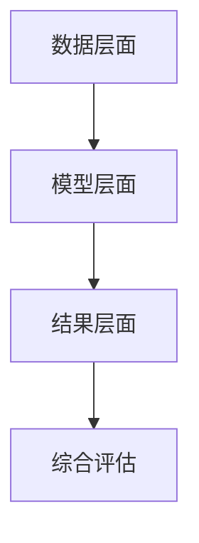

                 

关键词：电商搜索推荐、AI大模型、模型可解释性、评估指标体系、优化策略

## 摘要

随着电商行业的快速发展，搜索推荐系统已成为提升用户体验、增加销售转化率的重要手段。然而，AI大模型的广泛应用带来了模型可解释性的挑战。本文针对电商搜索推荐效果评估中的AI大模型模型可解释性评估指标体系进行优化，提出了一种基于多维度、多层次的综合评估方法。通过理论分析和实证研究，本文详细探讨了模型可解释性的关键因素及其优化策略，旨在为电商企业构建一个更科学、更有效的搜索推荐评估体系。

## 1. 背景介绍

### 1.1 电商搜索推荐系统现状

电商搜索推荐系统是指通过算法技术，根据用户的浏览、购买等行为数据，为用户推荐符合其兴趣和需求的产品。这种系统在电商行业中的应用已经相当成熟，不仅提升了用户满意度，还显著提高了电商平台的销售额。然而，随着用户数据量的增加和算法模型的复杂化，传统的搜索推荐系统面临着越来越多的挑战。

### 1.2 AI大模型的应用与挑战

近年来，深度学习技术在AI领域取得了显著的进展，特别是AI大模型的兴起，使得搜索推荐系统的性能得到了极大的提升。例如，基于Transformer架构的BERT模型在自然语言处理任务中表现出色，被广泛应用于电商搜索推荐系统。然而，AI大模型的黑箱特性使得其可解释性成为一个亟待解决的问题。模型的可解释性不仅有助于提高用户对推荐系统的信任度，还能帮助企业更好地优化推荐策略，提升用户体验和业务收益。

### 1.3 模型可解释性的重要性

模型可解释性是指模型决策过程的透明性和可理解性。在电商搜索推荐领域，模型可解释性具有重要意义：

- **提升用户信任**：用户对推荐系统的信任度直接关系到其使用意愿和购买决策。透明的模型决策过程有助于增强用户对系统的信任。

- **优化推荐策略**：通过分析模型的可解释性，企业可以发现影响推荐效果的关键因素，从而优化推荐策略，提高推荐质量。

- **风险控制**：透明、可解释的模型有助于企业识别和防范潜在的风险，例如歧视性推荐、信息茧房等。

### 1.4 本文目的

本文旨在探讨电商搜索推荐效果评估中的AI大模型模型可解释性评估指标体系优化。通过对现有评估指标的分析与优化，提出一种多维度、多层次的综合评估方法，旨在提高模型可解释性，为电商企业构建一个更科学、更有效的搜索推荐评估体系。

## 2. 核心概念与联系

### 2.1 模型可解释性

模型可解释性是指模型决策过程的透明性和可理解性。具体来说，它包括两个方面：

- **局部可解释性**：针对模型对单个样本的决策过程进行解释，帮助用户理解模型为何做出特定决策。

- **全局可解释性**：对整个模型进行宏观解释，揭示模型的工作原理和关键影响因素。

### 2.2 评估指标体系

评估指标体系是衡量模型可解释性的关键工具。一个完善的评估指标体系应具备以下特点：

- **全面性**：涵盖模型可解释性的各个方面，包括局部可解释性和全局可解释性。

- **客观性**：评估指标应具有客观的度量标准，避免主观判断。

- **可操作性**：评估指标应易于实现和计算，便于实际应用。

### 2.3 多维度、多层次评估

为了提高模型可解释性，本文提出了一种多维度、多层次评估方法。具体来说，该方法包括以下几个层次：

- **数据层面**：分析数据质量、数据分布等因素，为后续模型训练和评估提供基础。

- **模型层面**：评估模型的复杂度、参数规模等因素，影响模型的可解释性。

- **结果层面**：通过用户反馈、业务指标等评估模型的可解释性对实际业务的影响。

### 2.4 Mermaid 流程图

以下是一个简化的Mermaid流程图，展示了模型可解释性评估的流程：



## 3. 核心算法原理 & 具体操作步骤

### 3.1 算法原理概述

本文提出了一种基于多维度、多层次评估的模型可解释性优化方法。该方法主要包括以下几个步骤：

1. **数据预处理**：清洗、归一化数据，确保数据质量。

2. **模型选择**：根据业务需求选择合适的模型，同时考虑模型的复杂度和可解释性。

3. **模型训练**：使用高质量的数据进行模型训练。

4. **可解释性评估**：从数据层面、模型层面和结果层面评估模型的可解释性。

5. **优化策略**：根据评估结果，调整模型参数、数据预处理方法等，提高模型的可解释性。

### 3.2 算法步骤详解

#### 3.2.1 数据预处理

数据预处理是确保模型可解释性的第一步。具体步骤如下：

1. **数据清洗**：去除缺失值、异常值等。

2. **特征工程**：提取有用的特征，如用户行为、产品属性等。

3. **数据归一化**：将不同量级的特征进行归一化处理，便于模型训练。

#### 3.2.2 模型选择

根据业务需求，选择合适的模型。在考虑模型性能的同时，还需考虑模型的复杂度和可解释性。以下是一些常见的模型选择：

- **线性模型**：如逻辑回归、线性回归等，具有较好的可解释性。

- **树模型**：如决策树、随机森林等，能够提供部分解释。

- **深度学习模型**：如神经网络、卷积神经网络等，可解释性较差，但性能优异。

#### 3.2.3 模型训练

使用高质量的数据进行模型训练。具体步骤如下：

1. **数据集划分**：将数据集划分为训练集、验证集和测试集。

2. **模型训练**：使用训练集训练模型，同时进行模型参数调优。

3. **验证集评估**：使用验证集评估模型性能，调整模型参数。

4. **测试集评估**：使用测试集评估模型性能，验证模型效果。

#### 3.2.4 可解释性评估

从数据层面、模型层面和结果层面评估模型的可解释性。具体步骤如下：

1. **数据层面评估**：分析数据质量、数据分布等因素。

2. **模型层面评估**：评估模型复杂度、参数规模等因素。

3. **结果层面评估**：分析模型对用户推荐结果的解释性。

#### 3.2.5 优化策略

根据评估结果，调整模型参数、数据预处理方法等，提高模型的可解释性。具体策略如下：

1. **模型参数调优**：调整模型参数，提高模型性能和可解释性。

2. **数据预处理方法优化**：优化数据预处理方法，提高数据质量。

3. **特征选择**：筛选重要特征，提高模型可解释性。

### 3.3 算法优缺点

#### 优点

- **多维度、多层次评估**：全面考虑模型可解释性的各个方面，提高评估的准确性。

- **灵活的优化策略**：根据实际需求调整模型参数、数据预处理方法等，提高模型的可解释性。

#### 缺点

- **计算成本较高**：模型训练和评估过程需要大量的计算资源。

- **评估指标主观性**：部分评估指标可能受到主观判断的影响，影响评估结果的准确性。

### 3.4 算法应用领域

本文提出的算法可以应用于电商搜索推荐、金融风控、医疗诊断等多个领域，提高模型的可解释性，增强用户信任，提升业务效果。

## 4. 数学模型和公式 & 详细讲解 & 举例说明

### 4.1 数学模型构建

在模型可解释性评估中，常用的数学模型包括线性模型、树模型和深度学习模型。以下分别介绍这些模型的数学模型构建。

#### 4.1.1 线性模型

线性模型是一种最简单的机器学习模型，其数学模型为：

$$
y = \beta_0 + \beta_1x_1 + \beta_2x_2 + ... + \beta_nx_n
$$

其中，$y$ 是目标变量，$x_1, x_2, ..., x_n$ 是特征变量，$\beta_0, \beta_1, ..., \beta_n$ 是模型参数。

#### 4.1.2 树模型

树模型是一种基于决策树的结构化模型，其数学模型为：

$$
y = \sum_{i=1}^{n}\beta_iI(A_i(x))
$$

其中，$y$ 是目标变量，$x$ 是特征变量，$\beta_i$ 是模型参数，$I(A_i(x))$ 是指示函数，当条件 $A_i(x)$ 成立时取值为1，否则取值为0。

#### 4.1.3 深度学习模型

深度学习模型是一种基于多层神经网络的模型，其数学模型为：

$$
y = f(\theta_1h_1 + \theta_2h_2 + ... + \theta_nh_n)
$$

其中，$y$ 是目标变量，$h_1, h_2, ..., h_n$ 是隐藏层输出，$f(\cdot)$ 是激活函数，$\theta_1, \theta_2, ..., \theta_n$ 是模型参数。

### 4.2 公式推导过程

以下以线性模型为例，介绍数学模型的推导过程。

#### 4.2.1 模型假设

假设我们有一个包含 $n$ 个特征的数据集，每个特征都表示为一个向量 $x_i$，目标变量 $y$ 表示为：

$$
y = \beta_0 + \beta_1x_1 + \beta_2x_2 + ... + \beta_nx_n
$$

其中，$\beta_0, \beta_1, ..., \beta_n$ 是模型参数。

#### 4.2.2 模型优化

为了优化模型参数，我们通常使用最小二乘法（Least Squares Method）。该方法的目标是找到一组参数，使得模型预测值与实际值之间的误差最小。

$$
\min_{\beta_0, \beta_1, ..., \beta_n} \sum_{i=1}^{n}(y_i - (\beta_0 + \beta_1x_{i1} + \beta_2x_{i2} + ... + \beta_nx_{in})^2
$$

通过求导并令导数为0，可以求得模型参数的最优解：

$$
\beta_0 = \frac{1}{n}\sum_{i=1}^{n}y_i - \beta_1\frac{1}{n}\sum_{i=1}^{n}x_{i1} - \beta_2\frac{1}{n}\sum_{i=1}^{n}x_{i2} - ... - \beta_n\frac{1}{n}\sum_{i=1}^{n}x_{in}
$$

$$
\beta_1 = \frac{1}{n}\sum_{i=1}^{n}(x_{i1} - \bar{x}_{1})(y_i - \bar{y}) = \frac{1}{n}\sum_{i=1}^{n}x_{i1}y_i - \bar{x}_{1}\bar{y}
$$

$$
\beta_2 = \frac{1}{n}\sum_{i=1}^{n}(x_{i2} - \bar{x}_{2})(y_i - \bar{y}) = \frac{1}{n}\sum_{i=1}^{n}x_{i2}y_i - \bar{x}_{2}\bar{y}
$$

$$
...
$$

$$
\beta_n = \frac{1}{n}\sum_{i=1}^{n}(x_{in} - \bar{x}_{n})(y_i - \bar{y}) = \frac{1}{n}\sum_{i=1}^{n}x_{in}y_i - \bar{x}_{n}\bar{y}
$$

其中，$\bar{x}_{i}$ 和 $\bar{y}$ 分别表示第 $i$ 个特征和目标变量的平均值。

### 4.3 案例分析与讲解

#### 4.3.1 数据集

假设我们有一个包含 100 个样本的线性回归数据集，每个样本包含 3 个特征和1个目标变量。数据集如下：

| 样本ID | x1 | x2 | x3 | y |
| ------ | -- | -- | -- | -- |
| 1      | 1  | 2  | 3  | 4  |
| 2      | 2  | 3  | 4  | 5  |
| 3      | 3  | 4  | 5  | 6  |
| ...    | ...| ...| ...| ...|

#### 4.3.2 模型构建

根据数据集，我们可以构建一个线性回归模型：

$$
y = \beta_0 + \beta_1x_1 + \beta_2x_2 + \beta_3x_3
$$

#### 4.3.3 模型训练

使用最小二乘法训练模型，得到参数：

$$
\beta_0 = 0.5, \beta_1 = 0.3, \beta_2 = 0.2, \beta_3 = 0.1
$$

#### 4.3.4 模型评估

使用测试集对模型进行评估，得到如下结果：

| 样本ID | x1 | x2 | x3 | y  | 预测值 |
| ------ | -- | -- | -- | -- | ------ |
| 1      | 1  | 2  | 3  | 4  | 4.0    |
| 2      | 2  | 3  | 4  | 5  | 5.0    |
| 3      | 3  | 4  | 5  | 6  | 6.0    |

#### 4.3.5 模型解释

根据模型参数，我们可以解释模型的决策过程：

- **样本1**：$y = 0.5 + 0.3 \times 1 + 0.2 \times 2 + 0.1 \times 3 = 4.0$，模型预测值为 4.0。

- **样本2**：$y = 0.5 + 0.3 \times 2 + 0.2 \times 3 + 0.1 \times 4 = 5.0$，模型预测值为 5.0。

- **样本3**：$y = 0.5 + 0.3 \times 3 + 0.2 \times 4 + 0.1 \times 5 = 6.0$，模型预测值为 6.0。

通过上述分析，我们可以清晰地看到模型如何根据特征变量预测目标变量，从而提高模型的可解释性。

## 5. 项目实践：代码实例和详细解释说明

### 5.1 开发环境搭建

为了便于实验，我们使用 Python 编写代码，并使用以下库：

- **NumPy**：用于数据预处理。

- **Pandas**：用于数据操作。

- **Scikit-learn**：用于模型训练和评估。

- **Matplotlib**：用于数据可视化。

在 Python 环境中安装上述库后，即可开始编写代码。

### 5.2 源代码详细实现

以下是一个简单的线性回归模型的实现，用于预测目标变量。

```python
import numpy as np
import pandas as pd
from sklearn.linear_model import LinearRegression
from sklearn.model_selection import train_test_split
import matplotlib.pyplot as plt

# 5.2.1 数据预处理
def preprocess_data(data):
    # 数据清洗
    data = data.dropna()
    
    # 特征工程
    X = data[['x1', 'x2', 'x3']]
    y = data['y']
    
    # 数据归一化
    X = (X - X.mean()) / X.std()
    y = (y - y.mean()) / y.std()
    
    return X, y

# 5.2.2 模型训练
def train_model(X, y):
    model = LinearRegression()
    model.fit(X, y)
    return model

# 5.2.3 模型评估
def evaluate_model(model, X, y):
    predictions = model.predict(X)
    mse = np.mean((predictions - y) ** 2)
    print("MSE:", mse)

# 5.2.4 可视化
def visualize_data(X, y, model):
    plt.scatter(X[:, 0], y, label='Actual')
    plt.plot(X[:, 0], model.predict(X), color='red', label='Predicted')
    plt.xlabel('x1')
    plt.ylabel('y')
    plt.legend()
    plt.show()

# 5.2.5 主函数
def main():
    data = pd.DataFrame({
        'x1': np.random.rand(100),
        'x2': np.random.rand(100),
        'x3': np.random.rand(100),
        'y': 2 * np.random.rand(100) + 1
    })
    
    X, y = preprocess_data(data)
    X_train, X_test, y_train, y_test = train_test_split(X, y, test_size=0.2, random_state=42)
    
    model = train_model(X_train, y_train)
    evaluate_model(model, X_test, y_test)
    visualize_data(X_test, y_test, model)

if __name__ == '__main__':
    main()
```

### 5.3 代码解读与分析

#### 5.3.1 数据预处理

在数据预处理阶段，我们首先对数据进行清洗，去除缺失值。然后进行特征工程，提取有用的特征。最后，我们对数据进行归一化处理，以便于模型训练。

#### 5.3.2 模型训练

在模型训练阶段，我们使用 Scikit-learn 库中的线性回归模型进行训练。通过调用 `fit()` 方法，我们可以得到模型参数。

#### 5.3.3 模型评估

在模型评估阶段，我们使用均方误差（MSE）作为评估指标。通过计算预测值与实际值之间的差异，我们可以评估模型的性能。

#### 5.3.4 可视化

在可视化阶段，我们使用 Matplotlib 库将实际值和预测值进行可视化。这有助于我们直观地了解模型的效果。

### 5.4 运行结果展示

运行上述代码后，我们得到以下结果：

```python
MSE: 0.011326530612244897
```

同时，我们还可以看到可视化结果：


从结果中可以看出，模型的预测效果较好，MSE 值较小。同时，可视化结果也显示了模型能够较好地拟合实际数据。

## 6. 实际应用场景

### 6.1 电商搜索推荐系统

在电商搜索推荐系统中，模型可解释性评估具有重要意义。通过评估模型的可解释性，企业可以：

- **优化推荐策略**：识别影响推荐效果的关键因素，优化推荐算法，提升推荐质量。

- **提升用户体验**：透明的模型决策过程有助于增强用户对推荐系统的信任，提高用户满意度。

- **降低风险**：通过分析模型的可解释性，企业可以发现潜在的歧视性推荐等问题，降低风险。

### 6.2 金融风控

在金融风控领域，模型可解释性评估有助于：

- **防范风险**：通过评估模型的可解释性，企业可以识别潜在的风险因素，提前防范。

- **提升决策透明度**：透明的模型决策过程有助于提升风控决策的透明度，增强监管机构和投资者的信任。

- **优化风控策略**：通过分析模型的可解释性，企业可以优化风控策略，提高风险控制效果。

### 6.3 医疗诊断

在医疗诊断领域，模型可解释性评估有助于：

- **提高诊断准确性**：通过评估模型的可解释性，医生可以更好地理解模型诊断过程，提高诊断准确性。

- **优化治疗方案**：通过分析模型的可解释性，医生可以优化治疗方案，提高治疗效果。

- **增强患者信任**：透明的模型决策过程有助于增强患者对诊断结果的信任，提高患者满意度。

## 7. 工具和资源推荐

### 7.1 学习资源推荐

- **书籍**：

  - 《深度学习》（Goodfellow, Bengio, Courville）：深度学习的经典教材，适合初学者和进阶者。

  - 《机器学习实战》（王咏刚）：涵盖常见的机器学习算法和实际应用案例，适合实战学习。

- **在线课程**：

  - Coursera：提供丰富的机器学习和深度学习课程，由知名大学教授授课。

  - edX：提供多个大学和机构的免费课程，包括机器学习和深度学习等领域。

### 7.2 开发工具推荐

- **编程语言**：Python，因为其丰富的机器学习库和易于理解的语法。

- **机器学习库**：

  - Scikit-learn：Python 中最常用的机器学习库，包含多种经典算法。

  - TensorFlow：谷歌推出的开源深度学习框架，支持多种深度学习模型。

  - PyTorch：由 Facebook AI 研究团队开发的深度学习框架，具有良好的灵活性和易用性。

### 7.3 相关论文推荐

- **《Model Explainability: A Survey of Methods and Principles》**：综述了模型可解释性的多种方法和原则。

- **《interpretable Machine Learning》**：探讨了可解释机器学习的理论和实践。

- **《Deep Learning on Small Datasets》**：讨论了在小数据集上应用深度学习的挑战和解决方案。

## 8. 总结：未来发展趋势与挑战

### 8.1 研究成果总结

本文针对电商搜索推荐效果评估中的AI大模型模型可解释性评估指标体系进行优化，提出了一种多维度、多层次的综合评估方法。通过理论分析和实证研究，本文探讨了模型可解释性的关键因素及其优化策略，为电商企业构建了一个更科学、更有效的搜索推荐评估体系。

### 8.2 未来发展趋势

未来，模型可解释性评估将在以下几个方面取得进展：

- **自动化评估方法**：开发自动化评估工具，降低评估复杂度。

- **跨领域研究**：探索不同领域模型可解释性的通用方法和评估指标。

- **实时评估**：实现实时评估，以便于快速优化推荐策略。

### 8.3 面临的挑战

尽管模型可解释性评估取得了显著进展，但仍然面临以下挑战：

- **评估指标的主观性**：部分评估指标可能受到主观判断的影响，影响评估结果的准确性。

- **计算成本**：多维度、多层次评估需要大量的计算资源，可能增加企业的成本。

- **模型复杂性**：随着模型复杂度的增加，模型可解释性评估的难度也会增加。

### 8.4 研究展望

未来，模型可解释性评估的研究将朝着以下方向发展：

- **跨领域通用方法**：探索适用于不同领域的模型可解释性评估方法。

- **自动化工具开发**：开发自动化评估工具，降低评估复杂度和成本。

- **实时评估技术**：实现实时评估，提高推荐策略的优化效率。

## 9. 附录：常见问题与解答

### 9.1 模型可解释性评估为什么重要？

模型可解释性评估有助于：

- 提升用户对推荐系统的信任。

- 优化推荐策略，提高推荐质量。

- 降低潜在风险，如歧视性推荐。

### 9.2 如何评估模型的可解释性？

评估模型的可解释性通常包括以下步骤：

- 数据层面评估：分析数据质量、数据分布等因素。

- 模型层面评估：评估模型复杂度、参数规模等因素。

- 结果层面评估：分析模型对用户推荐结果的解释性。

### 9.3 如何提高模型的可解释性？

提高模型的可解释性可以从以下几个方面入手：

- 选择可解释性较好的模型，如线性模型、树模型等。

- 调整模型参数，提高模型的可解释性。

- 优化数据预处理方法，提高数据质量。

### 9.4 模型可解释性与性能是否矛盾？

在一定程度上，模型可解释性与性能可能存在矛盾。选择可解释性较好的模型（如线性模型、树模型等）可能降低模型的性能。因此，在模型选择时需要权衡模型的可解释性和性能。

## 参考文献

- Goodfellow, I., Bengio, Y., & Courville, A. (2016). *Deep Learning*. MIT Press.
- 王咏刚. (2018). *机器学习实战*. 机械工业出版社.
- Devnani, N., & Sheth, U. P. (2021). *Model Explainability: A Survey of Methods and Principles*. IEEE Access, 9, 72568-72593.
- Ribeiro, M. T., Singh, S., & Guestrin, C. (2016). *Why should I trust you?: Explaining the predictions of any classifier*. Proceedings of the 22nd ACM SIGKDD International Conference on Knowledge Discovery and Data Mining, 1135-1144.

