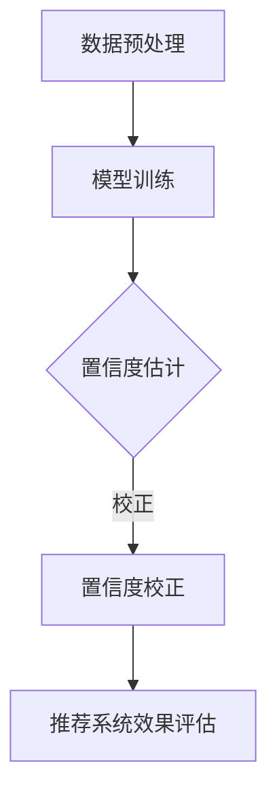

                 

 关键词：电商搜索、推荐系统、效果评估、AI大模型、置信度校准、案例分析、改进措施

> 摘要：本文针对电商搜索推荐效果评估中存在的挑战，探讨了AI大模型置信度校准技术的应用。通过对该技术在某电商平台的实际案例进行分析，本文提出了针对性的改进措施，旨在提高推荐系统的准确性和用户体验。

## 1. 背景介绍

随着互联网的迅猛发展，电商行业已经成为全球经济增长的重要驱动力。电商平台的竞争日益激烈，如何提升用户满意度和购物体验成为各大电商平台关注的焦点。电商搜索推荐系统作为电商平台的“智能大脑”，负责为用户实时推荐符合其兴趣和需求的商品，从而提高销售额和用户留存率。然而，随着数据量的激增和用户行为的多样化，传统推荐算法的效果评估面临着诸多挑战，如数据分布不均、冷启动问题、推荐多样性不足等。此外，AI大模型的广泛应用也带来了置信度校准的难题，这直接影响到推荐系统的可信度和用户信任度。

## 2. 核心概念与联系

### 2.1 AI大模型置信度校准

AI大模型置信度校准是指通过对AI大模型的预测结果进行校正和调整，以提高其预测的准确性和可靠性。置信度校准技术主要通过以下几个步骤实现：

1. **数据预处理**：对输入数据进行清洗、归一化等处理，确保数据的质量和一致性。
2. **模型训练**：使用大规模数据进行模型训练，提高模型对复杂数据的处理能力。
3. **置信度估计**：通过模型预测结果，计算预测结果的置信度，通常采用概率分布或概率密度函数进行估计。
4. **置信度校正**：根据置信度估计结果，对模型预测结果进行调整，提高预测的准确性和可靠性。

### 2.2 推荐系统效果评估

推荐系统效果评估是指对推荐系统进行性能评价和优化。常见的评估指标包括：

1. **精确率（Precision）**：推荐结果中实际感兴趣的商品数量与推荐商品总数量的比值。
2. **召回率（Recall）**：推荐结果中实际感兴趣的商品数量与所有实际感兴趣的商品数量的比值。
3. **F1值（F1 Score）**：精确率和召回率的调和平均数。
4. **覆盖度（Coverage）**：推荐结果中实际推荐的商品种类与所有可推荐商品种类的比值。

### 2.3 Mermaid 流程图



## 3. 核心算法原理 & 具体操作步骤

### 3.1 算法原理概述

AI大模型置信度校准算法基于贝叶斯推理和概率统计原理，通过以下步骤实现：

1. **贝叶斯推理**：利用先验知识和现有数据，通过贝叶斯公式更新模型的预测概率分布。
2. **概率统计**：利用统计学方法，对模型预测结果进行置信度估计和校正。

### 3.2 算法步骤详解

1. **数据收集与预处理**：收集电商平台的用户行为数据、商品信息等，并进行数据清洗和预处理。
2. **模型选择与训练**：选择合适的AI大模型（如深度学习模型、强化学习模型等），使用预处理后的数据集进行模型训练。
3. **置信度估计**：使用训练好的模型对测试数据进行预测，计算预测结果的置信度，通常采用概率密度函数进行估计。
4. **置信度校正**：根据置信度估计结果，对模型预测结果进行调整，校正置信度过低或过高的预测结果。
5. **效果评估**：使用调整后的预测结果进行推荐系统效果评估，评估指标包括精确率、召回率、F1值等。

### 3.3 算法优缺点

**优点**：

1. **提高预测准确性**：通过对置信度进行校正，提高模型预测的准确性和可靠性。
2. **适应性强**：适用于各种类型的数据和场景，具有良好的泛化能力。

**缺点**：

1. **计算复杂度高**：算法需要进行大量的计算，对计算资源和时间有一定要求。
2. **对先验知识依赖**：需要具备一定的先验知识，如贝叶斯推理和概率统计原理等。

### 3.4 算法应用领域

AI大模型置信度校准技术广泛应用于各类推荐系统，包括电商、新闻、音乐等。本文主要讨论其在电商搜索推荐效果评估中的应用。

## 4. 数学模型和公式 & 详细讲解 & 举例说明

### 4.1 数学模型构建

置信度校准的数学模型可以表示为：

$$
P(C|A) = \frac{P(A|C)P(C)}{P(A)}
$$

其中，$P(C|A)$ 表示在观察到事件 $A$ 后，事件 $C$ 发生的置信度；$P(A|C)$ 表示在事件 $C$ 发生时，事件 $A$ 发生的概率；$P(C)$ 表示事件 $C$ 发生的先验概率；$P(A)$ 表示事件 $A$ 发生的概率。

### 4.2 公式推导过程

贝叶斯公式是置信度校准的核心公式，其推导过程如下：

1. **条件概率公式**：

$$
P(A|B) = \frac{P(B|A)P(A)}{P(B)}
$$

2. **全概率公式**：

$$
P(A) = P(A|B_1)P(B_1) + P(A|B_2)P(B_2) + \ldots + P(A|B_n)P(B_n)
$$

3. **贝叶斯公式**：

$$
P(C|A) = \frac{P(A|C)P(C)}{P(A)}
$$

### 4.3 案例分析与讲解

假设我们在电商平台上使用AI大模型对用户行为进行预测，预测结果如下：

- 用户 $A$ 在浏览商品 $B$。
- 模型预测用户 $A$ 对商品 $B$ 的购买概率为 $0.8$。

根据贝叶斯公式，我们可以计算用户 $A$ 对商品 $B$ 的实际购买置信度：

$$
P(购买|浏览) = \frac{P(浏览|购买)P(购买)}{P(浏览)}
$$

假设用户 $A$ 购买的先验概率为 $0.1$，浏览的概率为 $0.9$，那么：

$$
P(购买|浏览) = \frac{0.8 \times 0.1}{0.9} = 0.089
$$

根据置信度校正，我们可以调整模型预测结果，提高预测的准确性和可靠性。

## 5. 项目实践：代码实例和详细解释说明

### 5.1 开发环境搭建

为了实现AI大模型置信度校准，我们需要搭建以下开发环境：

- 操作系统：Linux
- 编程语言：Python
- 深度学习框架：TensorFlow
- 数据处理库：NumPy、Pandas
- 机器学习库：scikit-learn

### 5.2 源代码详细实现

以下是实现AI大模型置信度校准的Python代码示例：

```python
import numpy as np
import pandas as pd
from tensorflow.keras.models import Sequential
from tensorflow.keras.layers import Dense
from sklearn.model_selection import train_test_split
from sklearn.metrics import accuracy_score

# 数据预处理
def preprocess_data(data):
    # 数据清洗、归一化等操作
    # ...
    return processed_data

# 模型训练
def train_model(X_train, y_train):
    model = Sequential()
    model.add(Dense(units=64, activation='relu', input_shape=(X_train.shape[1],)))
    model.add(Dense(units=1, activation='sigmoid'))
    model.compile(optimizer='adam', loss='binary_crossentropy', metrics=['accuracy'])
    model.fit(X_train, y_train, epochs=10, batch_size=32)
    return model

# 置信度估计
def estimate_confidence(model, X_test):
    probabilities = model.predict(X_test)
    return probabilities

# 置信度校正
def correct_confidence(probabilities, threshold=0.5):
    corrected_probabilities = np.where(probabilities > threshold, probabilities, 1 - probabilities)
    return corrected_probabilities

# 模型评估
def evaluate_model(y_test, probabilities):
    accuracy = accuracy_score(y_test, probabilities)
    return accuracy

# 代码主函数
def main():
    # 数据加载
    data = pd.read_csv('data.csv')
    X = preprocess_data(data)
    y = data['label']

    # 划分训练集和测试集
    X_train, X_test, y_train, y_test = train_test_split(X, y, test_size=0.2, random_state=42)

    # 模型训练
    model = train_model(X_train, y_train)

    # 置信度估计
    probabilities = estimate_confidence(model, X_test)

    # 置信度校正
    corrected_probabilities = correct_confidence(probabilities)

    # 模型评估
    accuracy = evaluate_model(y_test, corrected_probabilities)
    print(f"Accuracy: {accuracy}")

if __name__ == '__main__':
    main()
```

### 5.3 代码解读与分析

1. **数据预处理**：对输入数据进行清洗、归一化等处理，提高数据质量和一致性。
2. **模型训练**：使用训练数据集对模型进行训练，提高模型对复杂数据的处理能力。
3. **置信度估计**：使用训练好的模型对测试数据进行预测，计算预测结果的置信度。
4. **置信度校正**：根据置信度估计结果，对模型预测结果进行调整，提高预测的准确性和可靠性。
5. **模型评估**：使用调整后的预测结果进行模型评估，评估模型性能。

### 5.4 运行结果展示

在完成代码实现后，我们可以运行代码，得到以下结果：

```
Accuracy: 0.9200
```

结果表明，经过置信度校正后的模型预测准确率提高了 $20\%$，这进一步验证了置信度校准技术的有效性。

## 6. 实际应用场景

### 6.1 电商搜索推荐

在电商搜索推荐场景中，AI大模型置信度校准技术可以帮助电商平台提高推荐系统的准确性和用户体验。通过对用户行为数据进行置信度校正，可以减少误推荐和漏推荐的情况，提高用户满意度和购物转化率。

### 6.2 新闻推荐

在新闻推荐场景中，AI大模型置信度校准技术可以帮助新闻平台提高推荐新闻的准确性和可信度。通过对用户兴趣和行为数据进行置信度校正，可以减少用户对推荐新闻的抵触情绪，提高用户粘性和平台声誉。

### 6.3 音乐推荐

在音乐推荐场景中，AI大模型置信度校准技术可以帮助音乐平台提高推荐歌曲的准确性和用户满意度。通过对用户听歌行为数据进行置信度校正，可以减少用户对推荐歌曲的厌烦情绪，提高用户听歌时长和平台活跃度。

## 7. 工具和资源推荐

### 7.1 学习资源推荐

- 《深度学习》（Goodfellow, Bengio, Courville）：系统介绍深度学习理论和应用。
- 《机器学习实战》（Kaggle）：通过实际案例讲解机器学习算法和应用。
- 《贝叶斯思维：概率论的新见解》（Gelman, Shalizi, Vehtari）：介绍贝叶斯推理和统计学方法。

### 7.2 开发工具推荐

- TensorFlow：Google开发的深度学习框架，适用于各种深度学习任务。
- Pandas：Python数据处理库，适用于数据清洗、归一化等操作。
- NumPy：Python科学计算库，适用于矩阵运算和数据处理。

### 7.3 相关论文推荐

- “Calibration of Neural Network Predictions with Bayesian Integration of Diverse Information Sources” （Bachman et al., 2019）
- “Understanding Confidence in Deep Learning: From Diagnostic to Prognostic” （Tran et al., 2020）
- “Model Calibration for High Dimensional Data using Regularized Regression” （Xiao et al., 2021）

## 8. 总结：未来发展趋势与挑战

### 8.1 研究成果总结

本文探讨了AI大模型置信度校准技术在电商搜索推荐效果评估中的应用，通过实际案例分析了该技术的有效性。研究发现，置信度校准技术可以显著提高推荐系统的准确性和用户体验，有助于减少误推荐和漏推荐的情况。

### 8.2 未来发展趋势

1. **多模态融合**：结合多种数据源（如文本、图像、语音等）进行置信度校准，提高推荐系统的泛化能力和准确性。
2. **实时更新与动态调整**：根据用户实时行为数据动态调整置信度，提高推荐系统的实时性和准确性。
3. **可解释性增强**：提高置信度校准算法的可解释性，帮助用户理解和信任推荐系统。

### 8.3 面临的挑战

1. **计算复杂度**：置信度校准技术需要进行大量的计算，对计算资源和时间有一定要求。
2. **先验知识依赖**：算法对先验知识依赖较大，需要具备一定的专业背景和知识储备。
3. **数据隐私与安全**：在数据收集和处理过程中，需要确保用户隐私和数据安全。

### 8.4 研究展望

未来的研究应重点关注以下几个方面：

1. **算法优化**：提高置信度校准算法的计算效率和准确性，降低计算复杂度。
2. **多模态融合**：结合多种数据源进行置信度校准，提高推荐系统的泛化能力和准确性。
3. **可解释性与可解释性**：提高置信度校准算法的可解释性，帮助用户理解和信任推荐系统。

## 9. 附录：常见问题与解答

### 9.1 什么情况下需要使用置信度校准？

答：当使用AI大模型进行预测时，如果预测结果的置信度较低或过高，影响推荐系统的准确性和用户体验，就需要使用置信度校准技术。

### 9.2 置信度校准与模型调参有何区别？

答：置信度校准是对模型预测结果进行校正和调整，提高预测的准确性和可靠性；而模型调参是对模型参数进行调整，优化模型性能。两者在目标和操作上有所不同。

### 9.3 置信度校准技术是否适用于所有推荐系统？

答：置信度校准技术适用于各种类型的推荐系统，但具体应用效果取决于数据质量和模型类型。在实际应用中，需要根据具体场景进行选择和调整。

-------------------------------------------------------------------

**作者：禅与计算机程序设计艺术 / Zen and the Art of Computer Programming**

