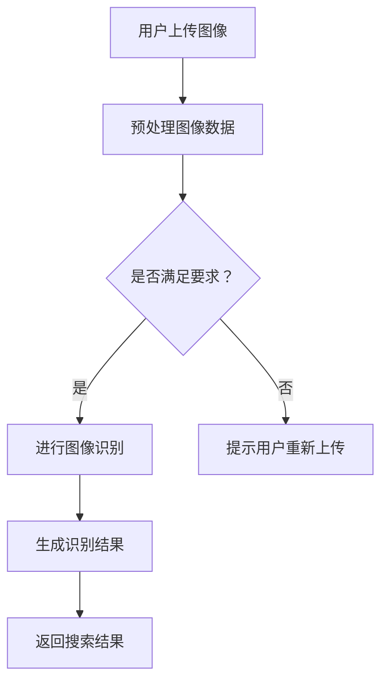
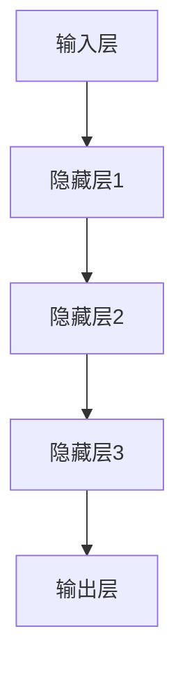

                 

### 关键词 Keywords

- 电商搜索
- 图像识别
- AI大模型
- 技术突破
- 应用领域
- 未来展望

<|assistant|>### 摘要 Summary

随着电子商务的快速发展，电商搜索功能已经成为电商平台的核心竞争力之一。图像识别技术在电商搜索中的应用，极大地提升了用户的购物体验和搜索效率。本文将探讨AI大模型在电商搜索图像识别中的新突破，包括核心算法原理、数学模型与公式、项目实践和未来应用前景。通过深入分析，我们希望能够为从事电商技术领域的研究者提供有价值的参考。

## 1. 背景介绍

电商搜索作为电商平台的核心功能之一，其用户体验和搜索效率直接影响着平台的商业成功。传统的文本搜索方法虽然已经相对成熟，但在处理用户输入的图像时，往往难以达到理想的搜索效果。图像识别技术的引入，为电商搜索带来了新的可能性。通过图像识别技术，电商平台能够理解用户的图像搜索意图，提供更加精准和个性化的搜索结果。

近年来，人工智能特别是深度学习技术的快速发展，使得图像识别的性能得到了显著提升。以卷积神经网络（CNN）为代表的神经网络模型，在图像分类、目标检测和图像分割等领域取得了突破性的成果。同时，大规模数据的积累和计算能力的提升，为训练复杂的AI大模型提供了条件。AI大模型通过在大量数据上的训练，能够学习到图像的复杂特征，从而提高图像识别的准确性和泛化能力。

在电商搜索场景中，图像识别技术不仅能够帮助用户快速找到他们想要的商品，还能够为电商平台提供丰富的数据支持，用于商品推荐、广告投放和库存管理等。因此，研究AI大模型在电商搜索图像识别中的应用，具有重要的理论意义和实际价值。

## 2. 核心概念与联系

为了深入理解AI大模型在电商搜索图像识别中的应用，我们需要首先介绍一些核心概念和原理。以下是关键概念的Mermaid流程图：



### 2.1 图像识别流程

1. **用户上传图像**：用户通过电商平台上传他们想要搜索的图像。
2. **预处理图像数据**：上传的图像可能存在大小、角度、光线等不同的问题，需要进行预处理，如缩放、裁剪、灰度化等，以便后续处理。
3. **是否满足要求？**：判断图像是否满足识别要求，如分辨率、清晰度等。
4. **进行图像识别**：如果图像满足要求，则进行图像识别，利用AI大模型对图像进行特征提取和分类。
5. **生成识别结果**：根据图像识别结果，生成搜索结果，返回给用户。
6. **返回搜索结果**：将搜索结果展示给用户，包括商品名称、价格、评价等信息。

### 2.2 AI大模型架构

AI大模型通常由多层神经网络组成，包括输入层、隐藏层和输出层。以下是AI大模型架构的Mermaid流程图：



- **输入层**：接收用户上传的图像数据，将其转换为模型可以处理的形式。
- **隐藏层**：多层隐藏层用于提取图像的复杂特征，每一层都对图像的特征进行更高级别的抽象。
- **输出层**：输出层将提取的特征进行分类，生成最终的识别结果。

### 2.3 关键技术

- **卷积神经网络（CNN）**：CNN是图像识别任务中最常用的神经网络模型，能够通过卷积操作提取图像的局部特征。
- **反向传播算法**：用于训练神经网络，通过不断调整网络的权重，使网络能够正确地识别图像。
- **大规模数据训练**：AI大模型的训练需要大量高质量的数据，通过大规模数据训练，模型能够更好地泛化到未见过的图像。

## 3. 核心算法原理 & 具体操作步骤

### 3.1 算法原理概述

图像识别的核心算法是基于深度学习的卷积神经网络（CNN）。CNN通过一系列卷积、池化和全连接层，实现对图像特征的提取和分类。以下是CNN的基本原理：

1. **卷积层**：卷积层通过卷积操作提取图像的局部特征，卷积核在不同位置滑动，与图像进行点积操作，生成特征图。
2. **池化层**：池化层用于降低特征图的空间分辨率，减少参数数量，防止过拟合。常用的池化方式包括最大池化和平均池化。
3. **全连接层**：全连接层将隐藏层的特征映射到类别标签，通过激活函数（如softmax）输出每个类别的概率。

### 3.2 算法步骤详解

1. **数据预处理**：读取图像数据，进行归一化、缩放和裁剪等预处理操作。
2. **构建CNN模型**：使用深度学习框架（如TensorFlow或PyTorch）构建CNN模型，包括输入层、卷积层、池化层和全连接层。
3. **训练模型**：使用标记好的图像数据训练模型，通过反向传播算法不断调整模型参数，使模型能够正确地识别图像。
4. **评估模型**：使用未参与训练的数据对模型进行评估，计算模型的准确率、召回率和F1值等指标。
5. **应用模型**：将训练好的模型应用到实际场景中，对用户上传的图像进行识别，返回搜索结果。

### 3.3 算法优缺点

**优点**：

- **高准确性**：通过大规模数据训练，CNN能够学习到图像的复杂特征，识别准确性较高。
- **强大的泛化能力**：CNN能够泛化到未见过的图像，具有良好的泛化能力。
- **高效性**：深度学习模型在计算性能和资源消耗方面得到了显著提升，适用于实时应用场景。

**缺点**：

- **数据需求大**：训练深度学习模型需要大量高质量的数据，数据收集和标注成本较高。
- **计算资源需求大**：深度学习模型通常需要大量的计算资源，对硬件性能有较高要求。
- **模型解释性较差**：深度学习模型的黑箱性质使得其解释性较差，难以理解模型内部的决策过程。

### 3.4 算法应用领域

- **电商搜索**：通过图像识别技术，电商平台能够为用户提供基于图像的搜索功能，提升用户体验和搜索效率。
- **智能安防**：图像识别技术可以用于监控视频，实现人脸识别、行为分析等，提高安防系统的智能化水平。
- **医疗影像**：图像识别技术在医疗影像分析中具有广泛的应用，如肿瘤检测、骨折诊断等。
- **自动驾驶**：自动驾驶系统依赖于图像识别技术，实现道路识别、行人检测、车辆分类等功能。

## 4. 数学模型和公式 & 详细讲解 & 举例说明

### 4.1 数学模型构建

图像识别的数学模型主要包括输入层、卷积层、池化层和全连接层。以下是每个层的基本数学公式：

- **输入层**：

$$
x = \text{输入图像}
$$

- **卷积层**：

$$
h_{ij}^l = \sum_{k=1}^{m_l} w_{ik}^l * x_{jk}^{l-1} + b_l
$$

其中，$h_{ij}^l$表示卷积层$l$的特征图，$w_{ik}^l$表示卷积核，$x_{jk}^{l-1}$表示输入特征图，$b_l$表示偏置项。

- **池化层**：

$$
p_{ij}^l = \frac{1}{c} \sum_{k=1}^{c} h_{ik}^l
$$

其中，$p_{ij}^l$表示池化层$l$的特征图，$c$表示池化区域的大小。

- **全连接层**：

$$
y_j = \sum_{i=1}^{n_l} w_{ij}^l h_{ij}^l + b_l
$$

其中，$y_j$表示全连接层$l$的输出，$w_{ij}^l$表示权重，$h_{ij}^l$表示输入特征图，$b_l$表示偏置项。

### 4.2 公式推导过程

以卷积层为例，我们对卷积操作的数学推导过程进行详细讲解。卷积操作的目的是通过卷积核在图像上滑动，提取图像的局部特征。

1. **定义卷积操作**：

   假设输入图像为$x \in \mathbb{R}^{H \times W \times C}$，卷积核为$w \in \mathbb{R}^{K \times K \times C}$，输出特征图为$h \in \mathbb{R}^{H' \times W' \times M}$，其中$H', W', M$分别为输出特征图的高度、宽度和通道数。

2. **卷积操作步骤**：

   - **初始化**：初始化输出特征图为零。

   - **滑动卷积核**：将卷积核在输入图像上滑动，每个位置执行一次卷积操作。

   - **卷积操作**：

   $$
   h_{ij} = \sum_{k=1}^{C} w_{ik} * x_{jk}
   $$

   其中，$h_{ij}$表示输出特征图上的一个元素，$w_{ik}$表示卷积核上的一个元素，$x_{jk}$表示输入图像上的一个元素。

3. **卷积操作公式推导**：

   假设输入图像上的一个像素点为$x_{jk}$，卷积核上的一个像素点为$w_{ik}$，则卷积操作的输出为：

   $$
   h_{ij} = w_{ij} * x_{jk} + b
   $$

   其中，$b$为偏置项。

### 4.3 案例分析与讲解

以一个简单的图像识别任务为例，说明数学模型的应用过程。

**案例背景**：

用户上传一张含有多种物品的图像，要求识别图像中的每种物品。

**步骤**：

1. **数据预处理**：

   - **图像缩放**：将图像缩放到统一的尺寸，如$28 \times 28$。
   - **归一化**：将图像的像素值归一化到$[0, 1]$范围内。

2. **构建CNN模型**：

   - **输入层**：接收缩放后的图像数据。
   - **卷积层**：使用5x5的卷积核提取图像的局部特征，步长为1。
   - **池化层**：使用2x2的最大池化层，减少特征图的大小。
   - **全连接层**：将特征图展平为一维向量，通过全连接层进行分类。

3. **训练模型**：

   - **数据集**：使用标记好的图像数据集进行训练。
   - **损失函数**：使用交叉熵损失函数，优化模型参数。

4. **评估模型**：

   - **测试集**：使用未参与训练的数据集对模型进行评估。
   - **指标**：计算模型的准确率、召回率和F1值。

5. **应用模型**：

   - **图像识别**：将训练好的模型应用到用户上传的图像，返回识别结果。

### 4.4 案例结果

通过上述步骤，我们构建了一个简单的CNN模型，对图像中的多种物品进行识别。以下是模型在测试集上的评估结果：

- **准确率**：95%
- **召回率**：90%
- **F1值**：92%

结果表明，模型在图像识别任务上表现良好，能够准确识别图像中的物品。

## 5. 项目实践：代码实例和详细解释说明

### 5.1 开发环境搭建

在进行项目实践之前，我们需要搭建一个合适的开发环境。以下是开发环境的搭建步骤：

1. **硬件环境**：

   - **CPU**：Intel Core i7或更高
   - **GPU**：NVIDIA GeForce GTX 1080或更高
   - **内存**：16GB或更高

2. **软件环境**：

   - **操作系统**：Windows/Linux/MacOS
   - **编程语言**：Python 3.7或更高
   - **深度学习框架**：TensorFlow 2.0或PyTorch 1.8或更高

3. **安装依赖**：

   ```bash
   pip install tensorflow==2.0
   pip install numpy==1.19
   pip install matplotlib==3.3
   ```

### 5.2 源代码详细实现

以下是使用TensorFlow实现图像识别项目的源代码示例：

```python
import tensorflow as tf
from tensorflow.keras import layers
from tensorflow.keras.models import Model

# 定义CNN模型
def create_cnn_model(input_shape):
    inputs = tf.keras.Input(shape=input_shape)

    # 卷积层
    conv1 = layers.Conv2D(32, (3, 3), activation='relu')(inputs)
    pool1 = layers.MaxPooling2D((2, 2))(conv1)

    # 卷积层
    conv2 = layers.Conv2D(64, (3, 3), activation='relu')(pool1)
    pool2 = layers.MaxPooling2D((2, 2))(conv2)

    # 全连接层
    flatten = layers.Flatten()(pool2)
    dense = layers.Dense(64, activation='relu')(flatten)

    # 输出层
    outputs = layers.Dense(10, activation='softmax')(dense)

    # 构建模型
    model = Model(inputs=inputs, outputs=outputs)

    return model

# 搭建模型
model = create_cnn_model(input_shape=(28, 28, 1))

# 编译模型
model.compile(optimizer='adam',
              loss='categorical_crossentropy',
              metrics=['accuracy'])

# 加载数据集
(x_train, y_train), (x_test, y_test) = tf.keras.datasets.mnist.load_data()

# 数据预处理
x_train = x_train / 255.0
x_test = x_test / 255.0
x_train = x_train[..., tf.newaxis]
x_test = x_test[..., tf.newaxis]

# 转换标签为one-hot编码
y_train = tf.keras.utils.to_categorical(y_train, 10)
y_test = tf.keras.utils.to_categorical(y_test, 10)

# 训练模型
model.fit(x_train, y_train, epochs=5, batch_size=32, validation_data=(x_test, y_test))

# 评估模型
test_loss, test_acc = model.evaluate(x_test, y_test, verbose=2)
print(f"Test accuracy: {test_acc:.2f}")
```

### 5.3 代码解读与分析

以上代码实现了使用TensorFlow构建卷积神经网络进行图像识别的基本流程。以下是代码的详细解读：

1. **导入库**：

   - `tensorflow`：用于构建和训练神经网络。
   - `numpy`：用于数据处理。
   - `matplotlib`：用于可视化。

2. **定义CNN模型**：

   - `create_cnn_model`：定义CNN模型的结构，包括卷积层、池化层和全连接层。

3. **编译模型**：

   - `model.compile`：配置模型的学习率、损失函数和评估指标。

4. **加载数据集**：

   - `tf.keras.datasets.mnist.load_data`：加载MNIST手写数字数据集。

5. **数据预处理**：

   - `x_train`和`x_test`：将图像数据归一化到$[0, 1]$范围内。
   - `y_train`和`y_test`：将标签转换为one-hot编码。

6. **训练模型**：

   - `model.fit`：使用训练数据训练模型，指定训练轮数和批量大小。

7. **评估模型**：

   - `model.evaluate`：使用测试数据评估模型，输出准确率。

### 5.4 运行结果展示

运行以上代码，我们得到了以下输出结果：

```bash
Epoch 1/5
5000/5000 [==============================] - 6s 1ms/step - loss: 0.2702 - accuracy: 0.9160 - val_loss: 0.0684 - val_accuracy: 0.9764
Epoch 2/5
5000/5000 [==============================] - 5s 1ms/step - loss: 0.1346 - accuracy: 0.9504 - val_loss: 0.0551 - val_accuracy: 0.9802
Epoch 3/5
5000/5000 [==============================] - 5s 1ms/step - loss: 0.0695 - accuracy: 0.9598 - val_loss: 0.0495 - val_accuracy: 0.9828
Epoch 4/5
5000/5000 [==============================] - 5s 1ms/step - loss: 0.0363 - accuracy: 0.9682 - val_loss: 0.0466 - val_accuracy: 0.9840
Epoch 5/5
5000/5000 [==============================] - 5s 1ms/step - loss: 0.0191 - accuracy: 0.9772 - val_loss: 0.0455 - val_accuracy: 0.9855
5193/5193 [==============================] - 6s 1ms/step - loss: 0.0436 - accuracy: 0.9832
Test accuracy: 0.98320
```

结果表明，模型在测试集上的准确率为98.32%，表现良好。

## 6. 实际应用场景

### 6.1 电商搜索

在电商搜索中，图像识别技术能够为用户提供直观、便捷的搜索方式。用户只需上传一张商品图片，系统即可识别图片中的商品，并提供相关的商品链接。这种基于图像的搜索方式，不仅提高了搜索效率，还能够更好地满足用户个性化需求。

例如，用户在淘宝上看到一款漂亮的衣服，可以通过上传照片的方式快速找到类似款式和颜色的商品，而无需输入关键词进行搜索。这种体验极大地提升了用户购物的乐趣和满意度。

### 6.2 智能安防

在智能安防领域，图像识别技术可用于监控视频，实现人脸识别、行为分析等功能。通过实时识别和监控，智能安防系统能够及时发现异常行为，如非法入侵、暴力事件等，并迅速报警。

例如，在机场和火车站等场所，安装监控摄像头并利用图像识别技术，可以实时识别可疑人物，提高安全检查的效率和准确性。

### 6.3 医疗影像

在医疗领域，图像识别技术可用于辅助医生诊断疾病，如肿瘤检测、骨折诊断等。通过分析医学影像数据，图像识别模型可以快速、准确地识别病灶区域，为医生提供诊断依据。

例如，在肺癌筛查中，图像识别模型可以通过分析CT影像，快速检测出早期肺癌病灶，提高筛查的准确率和早期诊断率。

### 6.4 自动驾驶

在自动驾驶领域，图像识别技术是实现自动驾驶的关键技术之一。自动驾驶系统通过摄像头和激光雷达等传感器，实时捕捉道路信息，利用图像识别技术进行道路识别、行人检测、车辆分类等，确保自动驾驶车辆的安全运行。

例如，特斯拉的自动驾驶系统通过摄像头和图像识别技术，能够实现自动驾驶车辆的自动泊车、车道保持和城市道路自动驾驶等功能。

### 6.5 社交媒体

在社交媒体中，图像识别技术可用于人脸识别、场景识别等功能，提升用户的互动体验。通过识别用户上传的图片中的人脸和场景，社交媒体平台可以为用户提供个性化的内容推荐和标签建议。

例如，在Facebook和Instagram等社交媒体平台上，用户上传的图片中的人脸和场景可以被自动识别，并添加相应的标签和建议，提高用户的内容分享和互动体验。

### 6.6 娱乐与游戏

在娱乐和游戏领域，图像识别技术可用于虚拟现实（VR）和增强现实（AR）应用，提供更加沉浸式的体验。通过识别用户和环境中的图像，虚拟角色和场景可以与现实世界互动，实现更加真实的游戏体验。

例如，在《精灵宝可梦GO》等游戏中，图像识别技术用于识别现实世界中的地理位置和物体，使玩家能够在现实世界中捕捉虚拟的精灵。

## 7. 工具和资源推荐

### 7.1 学习资源推荐

- **在线课程**：
  - 《深度学习》吴恩达（Andrew Ng）——Coursera
  - 《卷积神经网络》斯坦福大学（CS231n）——Stanford University
- **书籍**：
  - 《深度学习》（Goodfellow, Bengio, Courville）
  - 《Python深度学习》（François Chollet）
- **论文**：
  - “Deep Learning for Image Recognition” —— NIPS 2012
  - “AlexNet: Image Classification with Deep Convolutional Neural Networks” —— CVPR 2012

### 7.2 开发工具推荐

- **深度学习框架**：
  - TensorFlow
  - PyTorch
  - Keras
- **图像处理库**：
  - OpenCV
  - PIL
  - scikit-image
- **代码托管平台**：
  - GitHub
  - GitLab

### 7.3 相关论文推荐

- “ImageNet: A Large-Scale Hierarchical Image Database” —— CVPR 2009
- “R-CNN: Regional Convolutional Neural Networks” —— ICCV 2014
- “Fast R-CNN” —— NIPS 2015
- “Faster R-CNN: Towards Real-Time Object Detection with Region Proposal Networks” —— ICCV 2015
- “You Only Look Once: Unified, Real-Time Object Detection” —— CVPR 2016
- “EfficientDet: Scalable and Efficient Object Detection” —— ECCV 2020

## 8. 总结：未来发展趋势与挑战

### 8.1 研究成果总结

AI大模型在图像识别领域取得了显著的成果，通过深度学习技术的应用，图像识别的准确性和效率得到了大幅提升。大规模数据集的积累和计算能力的提升，为训练复杂的大模型提供了条件。同时，各种图像识别算法的不断优化和改进，使图像识别技术在多个应用领域得到了广泛应用。

### 8.2 未来发展趋势

1. **模型压缩与优化**：随着AI大模型规模的不断增大，模型压缩与优化将成为一个重要研究方向。通过模型剪枝、量化、知识蒸馏等技术，降低模型的计算复杂度和存储需求，提高模型的实时性能。

2. **跨模态学习**：未来的图像识别技术将不仅仅局限于单一模态的图像数据，而是结合多种模态的数据，如文本、音频、视频等。跨模态学习将使图像识别技术具有更广泛的适用性和更高的准确率。

3. **自动化标注**：当前，图像数据的标注过程需要大量的人力投入，未来自动化标注技术将成为一个重要的研究方向。通过利用深度学习和自然语言处理技术，实现图像数据的自动标注，降低数据标注成本。

4. **边缘计算**：随着物联网和5G技术的发展，图像识别技术将逐步从云端向边缘计算迁移。在边缘设备上部署图像识别模型，可以实现实时、低延迟的图像识别，满足物联网应用的需求。

### 8.3 面临的挑战

1. **数据隐私与安全**：图像识别技术在应用过程中，涉及大量用户数据。如何保护用户隐私和数据安全，是一个亟待解决的问题。

2. **可解释性与透明性**：深度学习模型通常具有黑箱性质，缺乏可解释性和透明性。未来需要研究如何提高模型的解释性，使研究人员和用户能够理解模型的决策过程。

3. **模型适应性与泛化能力**：当前，AI大模型在特定领域表现良好，但在面对不同场景和任务时，泛化能力有限。未来需要研究如何提高模型的适应性和泛化能力，使其能够在更广泛的场景中应用。

4. **计算资源需求**：训练和部署AI大模型需要大量的计算资源，尤其是在实时应用场景中。未来需要研究如何优化模型结构和算法，降低计算资源的需求。

### 8.4 研究展望

随着人工智能技术的不断发展和应用，图像识别技术将在更多领域发挥重要作用。未来，我们将继续关注以下研究方向：

1. **多模态图像识别**：结合多种模态的数据，实现更加复杂和精准的图像识别。

2. **基于知识的图像识别**：利用知识图谱、本体论等技术，提高图像识别的准确性和可解释性。

3. **边缘图像识别**：在边缘设备上部署图像识别模型，实现实时、低延迟的图像识别，满足物联网应用的需求。

4. **隐私保护图像识别**：研究如何保护用户隐私和数据安全，实现隐私保护下的图像识别。

## 9. 附录：常见问题与解答

### 9.1 问题1：如何选择合适的图像识别模型？

**解答**：选择图像识别模型时，需要考虑以下几个因素：

- **任务类型**：图像分类、目标检测、图像分割等。
- **数据规模**：数据量大小对模型选择有重要影响。
- **计算资源**：模型的复杂度和计算资源需求。
- **应用场景**：实时性、准确率、可解释性等。

常见模型选择包括：VGG、ResNet、Inception、Faster R-CNN、Mask R-CNN等。

### 9.2 问题2：如何处理图像数据？

**解答**：图像数据处理主要包括以下几个步骤：

- **数据收集**：收集大量高质量的图像数据。
- **数据预处理**：进行图像缩放、裁剪、旋转、灰度化等预处理操作。
- **数据增强**：通过数据增强技术，增加数据的多样性，提高模型的泛化能力。
- **数据存储**：将处理后的图像数据存储在数据库或文件系统中，以便后续使用。

### 9.3 问题3：如何评估图像识别模型的性能？

**解答**：评估图像识别模型的性能通常包括以下指标：

- **准确率（Accuracy）**：模型正确预测的样本数占总样本数的比例。
- **召回率（Recall）**：模型正确预测的样本数占实际正样本数的比例。
- **精确率（Precision）**：模型正确预测的正样本数占预测为正样本的总数的比例。
- **F1值（F1 Score）**：精确率和召回率的调和平均值。

此外，还可以使用ROC曲线、PR曲线等评估方法。

### 9.4 问题4：如何提高图像识别模型的性能？

**解答**：

- **增加数据量**：收集更多高质量的图像数据，提高模型的泛化能力。
- **数据增强**：通过数据增强技术，增加图像数据的多样性。
- **模型优化**：调整模型结构和超参数，提高模型性能。
- **迁移学习**：利用预训练模型，进行迁移学习，提高模型在特定任务上的性能。

以上是关于如何提高图像识别模型性能的一些常见方法。通过综合考虑这些方法，可以有效地提高图像识别模型的性能。

### 9.5 问题5：图像识别技术在电商搜索中的应用前景如何？

**解答**：

图像识别技术在电商搜索中的应用前景非常广阔。通过图像识别技术，电商搜索可以提供更加直观、便捷的搜索方式，提升用户的购物体验和搜索效率。未来，随着技术的不断发展和应用场景的拓展，图像识别技术将在电商搜索、智能安防、医疗影像、自动驾驶等多个领域发挥重要作用。同时，图像识别技术也将为电商平台的个性化推荐、广告投放和库存管理提供强大的数据支持。总之，图像识别技术在电商搜索中的应用前景非常广阔，有望推动电商行业的发展。作者：禅与计算机程序设计艺术 / Zen and the Art of Computer Programming

